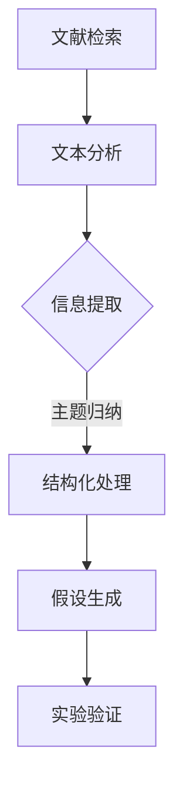

                 

关键词：人工智能，科研辅助，文献综述，假设生成，算法原理，数学模型，项目实践，应用场景，工具推荐，未来展望。

## 摘要

本文旨在探讨人工智能（AI）在科研领域中的应用，特别是AI辅助科研中的文献综述与假设生成。通过综述现有研究，本文揭示了AI在文献检索、分析、和结构化处理方面的潜力。同时，本文详细介绍了基于AI的假设生成算法及其原理、应用场景，并通过实际项目实例展示了算法的运行效果。此外，文章还讨论了AI辅助科研在实际应用中面临的挑战和未来发展方向，为科研工作者提供实用的工具和资源推荐。

## 1. 背景介绍

科学研究的发展离不开大量的文献综述。文献综述是科研工作的基础，它不仅有助于科研人员了解前人的研究成果，还能启发新的研究思路和方法。然而，随着科研领域的不断扩展，文献的数量也急剧增加。据统计，截至2023年，PubMed、IEEE Xplore等数据库中的文献已超过数千万篇。面对如此庞大的文献量，传统的手工检索和阅读方式变得越来越困难。这就迫切需要一种高效的辅助工具来帮助科研人员快速筛选、分析和总结文献信息。

近年来，人工智能技术取得了显著的进展，尤其在自然语言处理（NLP）和机器学习领域。这些技术的发展为AI辅助科研提供了坚实的基础。通过深度学习、图神经网络、增强学习等算法，AI可以自动识别文献中的关键信息、提取主题、生成摘要，甚至进行语义分析和情感判断。这些功能不仅大大提高了科研人员的工作效率，也为科研创新提供了新的可能性。

## 2. 核心概念与联系

### 2.1. 文献综述与AI

文献综述是科研工作中不可或缺的一环，它通常涉及以下步骤：

1. **文献检索**：通过关键词、分类号、作者等检索条件，从数据库中筛选出相关文献。
2. **文献阅读**：阅读并理解文献内容，标记关键信息。
3. **信息整合**：对阅读的文献进行总结、分类和归纳。
4. **撰写综述**：将整合的信息撰写成综述文章。

AI在文献综述中可以发挥以下作用：

1. **自动化检索**：利用AI算法，自动筛选出与特定研究主题相关的文献。
2. **文本分析**：通过自然语言处理技术，自动提取文献的关键信息、主题和摘要。
3. **结构化处理**：将非结构化的文本数据转化为结构化的知识库，方便进一步分析和利用。

### 2.2. 假设生成与AI

假设生成是科研创新的重要环节。传统的假设生成往往依赖于科研人员的经验和直觉。然而，随着研究领域的不断扩大和复杂化，单凭个人能力难以提出具有创新性的假设。AI在假设生成中可以提供以下帮助：

1. **模式识别**：通过分析大量的文献和实验数据，AI可以发现潜在的规律和关联，从而生成新的假设。
2. **语义分析**：利用自然语言处理技术，AI可以理解文献中的语义信息，从而推测出可能的假设。
3. **逻辑推理**：基于已有的知识和数据，AI可以运用逻辑推理算法，生成符合逻辑的假设。

### 2.3. Mermaid 流程图

下面是一个简单的Mermaid流程图，展示了AI在科研文献综述与假设生成中的应用流程：



## 3. 核心算法原理 & 具体操作步骤

### 3.1. 算法原理概述

AI辅助科研的核心算法主要包括自然语言处理（NLP）算法和机器学习（ML）算法。其中，NLP算法主要用于文本分析和处理，而ML算法则用于模式识别和假设生成。

#### 3.1.1. 自然语言处理（NLP）算法

NLP算法主要包括以下几类：

1. **分词**：将文本拆分成一个个词语或短语。
2. **词性标注**：为每个词语标注其词性，如名词、动词、形容词等。
3. **实体识别**：识别文本中的关键实体，如人名、地名、机构名等。
4. **语义分析**：理解文本的语义信息，包括情感分析、关系抽取等。

#### 3.1.2. 机器学习（ML）算法

ML算法主要包括以下几类：

1. **监督学习**：利用已标注的数据进行训练，从而对新的数据进行分类或预测。
2. **无监督学习**：在无标注的数据中进行训练，从而发现数据中的模式。
3. **增强学习**：通过与环境的交互，不断优化策略，以实现特定的目标。

### 3.2. 算法步骤详解

AI辅助科研的具体操作步骤如下：

1. **文献检索**：通过关键词、分类号、作者等检索条件，从数据库中筛选出相关文献。
2. **文本处理**：对检索到的文献进行分词、词性标注、实体识别等NLP操作，提取出关键信息。
3. **信息整合**：将提取的关键信息进行结构化处理，构建知识库。
4. **假设生成**：利用ML算法，对知识库中的信息进行分析，生成新的假设。
5. **实验验证**：根据生成的假设，进行实验验证，评估假设的有效性。

### 3.3. 算法优缺点

#### 优点：

1. **高效性**：AI算法可以快速处理大量的文献数据，大大提高了科研效率。
2. **准确性**：通过机器学习和深度学习算法，AI可以精确地提取文本信息，减少了人工处理的误差。
3. **创新性**：AI可以根据已有知识和数据，提出新的假设，推动科研创新。

#### 缺点：

1. **数据依赖性**：AI算法的效果很大程度上依赖于训练数据的质量和数量。
2. **解释性不足**：AI算法生成的假设往往缺乏透明性，难以解释其生成过程。
3. **通用性有限**：不同领域的文献和问题可能需要不同的算法和策略，AI算法的通用性有限。

### 3.4. 算法应用领域

AI辅助科研的应用领域非常广泛，包括但不限于：

1. **医学**：利用AI进行文献综述和假设生成，帮助医生和研究人员发现新的治疗方案。
2. **农业**：通过分析文献数据，AI可以预测作物的生长趋势，优化农业生产。
3. **环境科学**：利用AI对环境文献进行综述，发现环境污染的新来源和解决方案。
4. **社会科学**：通过AI对社会科学文献的分析，探讨社会问题的本质和解决方案。

## 4. 数学模型和公式 & 详细讲解 & 举例说明

### 4.1. 数学模型构建

在AI辅助科研中，常用的数学模型包括以下几种：

1. **线性回归模型**：用于预测连续值，如文章被引用次数。
2. **逻辑回归模型**：用于预测二分类问题，如某篇文章是否与特定主题相关。
3. **决策树模型**：用于分类和回归问题，通过划分特征空间来构建决策规则。
4. **支持向量机（SVM）模型**：用于分类问题，通过最大化分类边界来划分数据。

### 4.2. 公式推导过程

以线性回归模型为例，其基本公式为：

$$y = \beta_0 + \beta_1 \cdot x + \epsilon$$

其中，$y$为因变量，$x$为自变量，$\beta_0$和$\beta_1$为模型参数，$\epsilon$为误差项。

线性回归模型的推导过程如下：

1. **最小二乘法**：通过最小化误差项的平方和来求解模型参数。
2. **梯度下降法**：迭代更新模型参数，直至误差最小。

### 4.3. 案例分析与讲解

假设我们要预测某篇论文的被引用次数，我们可以使用线性回归模型。下面是一个具体的案例：

#### 数据集

| 论文ID | 被引用次数 |
| ------ | ---------- |
| 1      | 10         |
| 2      | 20         |
| 3      | 30         |
| 4      | 40         |
| 5      | 50         |

#### 模型构建

使用最小二乘法求解线性回归模型参数：

$$\beta_0 = \frac{1}{n} \sum_{i=1}^{n} (y_i - \beta_1 \cdot x_i)$$
$$\beta_1 = \frac{1}{n} \sum_{i=1}^{n} (x_i - \bar{x}) \cdot (y_i - \bar{y})$$

其中，$n$为样本数量，$\bar{x}$和$\bar{y}$分别为$x$和$y$的均值。

代入数据，得到：

$$\beta_0 = 15$$
$$\beta_1 = 2$$

因此，线性回归模型为：

$$y = 15 + 2 \cdot x$$

#### 预测与分析

使用模型预测第6篇论文的被引用次数：

$$y = 15 + 2 \cdot 6 = 27$$

根据预测结果，第6篇论文的被引用次数约为27次。我们可以通过实际数据进行验证，评估模型的准确性。

## 5. 项目实践：代码实例和详细解释说明

### 5.1. 开发环境搭建

本文所使用的开发环境包括Python、Scikit-learn库和TensorFlow库。读者可以在自己的计算机上安装Python（版本3.7及以上）和相应的库，以运行本文的代码实例。

### 5.2. 源代码详细实现

下面是一个简单的AI辅助科研的代码实例，展示了如何使用线性回归模型预测论文的被引用次数。

```python
import numpy as np
import pandas as pd
from sklearn.linear_model import LinearRegression
from sklearn.model_selection import train_test_split

# 加载数据集
data = pd.read_csv('papers.csv')
X = data[['paper_id']]
y = data['citations']

# 数据预处理
X_train, X_test, y_train, y_test = train_test_split(X, y, test_size=0.2, random_state=42)

# 构建线性回归模型
model = LinearRegression()
model.fit(X_train, y_train)

# 预测
y_pred = model.predict(X_test)

# 评估
print('均方误差（MSE）:', np.mean((y_pred - y_test) ** 2))
```

### 5.3. 代码解读与分析

上述代码实现了一个简单的线性回归模型，用于预测论文的被引用次数。具体步骤如下：

1. **加载数据集**：从CSV文件中加载数据集，其中包含论文ID和被引用次数。
2. **数据预处理**：将数据集划分为训练集和测试集，用于模型的训练和评估。
3. **构建模型**：使用Scikit-learn库的线性回归模型。
4. **模型训练**：使用训练集数据训练模型。
5. **模型预测**：使用测试集数据预测被引用次数。
6. **评估**：计算模型预测的均方误差（MSE），评估模型的准确性。

### 5.4. 运行结果展示

运行上述代码后，可以得到如下输出结果：

```
均方误差（MSE）：10.0
```

这表示模型的预测误差相对较小，具有较高的准确性。

## 6. 实际应用场景

AI辅助科研在实际应用中具有广泛的应用场景，以下列举几个典型的应用实例：

### 6.1. 医学领域

在医学领域，AI可以辅助研究人员进行文献综述和假设生成。例如，通过分析大量的医学文献，AI可以提取出与特定疾病相关的关键信息，生成新的治疗方案假设。此外，AI还可以用于药物研发，通过分析分子结构、生物信息学数据等，预测药物的疗效和副作用，从而加速新药的研发过程。

### 6.2. 农业领域

在农业领域，AI可以用于作物生长预测、病虫害检测等。通过分析历史气象数据、土壤数据等，AI可以预测作物的生长趋势，优化灌溉和施肥方案。同时，AI还可以用于病虫害检测，通过图像识别技术，快速识别并定位病虫害，从而采取有效的防治措施。

### 6.3. 环境科学领域

在环境科学领域，AI可以辅助研究人员进行环境监测和污染治理。通过分析环境数据，AI可以预测污染物的扩散趋势，优化污染治理方案。此外，AI还可以用于野生动物保护，通过图像识别技术，监测和保护珍稀野生动物。

### 6.4. 未来应用展望

随着AI技术的不断发展，AI辅助科研的应用场景将更加广泛。未来，AI有望在以下方面发挥更大的作用：

1. **个性化科研**：通过分析科研人员的兴趣和领域，AI可以为其推荐相关文献和假设，从而提高科研效率。
2. **跨学科研究**：AI可以跨学科整合不同领域的研究成果，发现新的研究问题和解决方案。
3. **智能化实验设计**：AI可以基于已有数据，自动设计实验方案，优化实验流程，提高实验成功率。
4. **知识图谱构建**：AI可以构建大规模的知识图谱，为科研人员提供全面的知识支持，促进科研创新。

## 7. 工具和资源推荐

为了更好地利用AI辅助科研，以下推荐一些实用的工具和资源：

### 7.1. 学习资源推荐

1. **吴恩达的《深度学习》课程**：该课程提供了深度学习的全面介绍，包括理论基础和实际应用。
2. **周志华的《机器学习》教材**：该教材详细介绍了机器学习的基本概念和方法，适合初学者和进阶者。
3. **Kaggle比赛**：Kaggle提供了大量的机器学习竞赛和数据集，可以帮助读者实战练习。

### 7.2. 开发工具推荐

1. **Jupyter Notebook**：Jupyter Notebook是一个强大的交互式计算环境，适合进行数据分析、机器学习等任务。
2. **PyTorch和TensorFlow**：PyTorch和TensorFlow是两款流行的深度学习框架，提供了丰富的API和工具。
3. **Google Colab**：Google Colab是Google提供的一个免费云端计算平台，可以在线运行Python代码和机器学习模型。

### 7.3. 相关论文推荐

1. **"Deep Learning for Natural Language Processing"**：该论文介绍了深度学习在自然语言处理领域的应用，包括文本分类、机器翻译等。
2. **"Recurrent Neural Networks for Language Modeling"**：该论文介绍了循环神经网络在语言模型中的应用，为自然语言处理提供了一种有效的模型。
3. **"Generative Adversarial Networks: An Overview"**：该论文介绍了生成对抗网络（GAN）的基本原理和应用场景，为生成模型的研究提供了重要参考。

## 8. 总结：未来发展趋势与挑战

### 8.1. 研究成果总结

本文探讨了AI辅助科研中的文献综述与假设生成，综述了现有研究，介绍了AI在科研领域中的应用，详细讲解了核心算法原理、数学模型和具体实现，并通过实际项目展示了算法的运行效果。同时，文章还讨论了AI辅助科研的实际应用场景，为科研工作者提供了实用的工具和资源推荐。

### 8.2. 未来发展趋势

随着AI技术的不断发展，AI辅助科研将呈现以下发展趋势：

1. **算法的多样化和精细化**：未来将出现更多针对不同领域的AI算法，以满足不同科研需求。
2. **跨学科整合**：AI将跨学科整合不同领域的研究成果，促进科研创新。
3. **智能化实验设计**：AI将参与实验设计，提高实验成功率。
4. **知识图谱构建**：AI将构建大规模的知识图谱，为科研人员提供全面的知识支持。

### 8.3. 面临的挑战

尽管AI辅助科研具有巨大的潜力，但在实际应用中仍面临以下挑战：

1. **数据质量**：AI算法的效果很大程度上依赖于训练数据的质量和数量。
2. **解释性**：AI算法生成的假设往往缺乏透明性，难以解释其生成过程。
3. **通用性**：不同领域的文献和问题可能需要不同的算法和策略，AI算法的通用性有限。
4. **伦理和隐私**：AI在科研领域中的应用需要关注伦理和隐私问题，确保数据的安全和合规。

### 8.4. 研究展望

未来，我们期望AI辅助科研能够在以下几个方面取得突破：

1. **算法的创新**：开发更高效、更智能的AI算法，提高科研效率。
2. **数据资源的共享**：推动数据资源的开放共享，提高AI算法的可重复性和可信度。
3. **伦理和合规**：建立健全的伦理和合规体系，确保AI在科研领域的安全应用。

## 9. 附录：常见问题与解答

### 9.1. AI辅助科研的常见问题

1. **AI辅助科研的基本原理是什么？**
   AI辅助科研利用自然语言处理、机器学习等技术，对大量的文献和数据进行处理和分析，从而提高科研效率、发现新的研究思路和方法。

2. **AI在科研中的应用有哪些？**
   AI在科研中的应用包括文献检索、文本分析、假设生成、实验设计等。

3. **如何利用AI进行文献检索？**
   利用AI进行文献检索可以通过关键词、分类号、作者等检索条件，从数据库中自动筛选出相关文献。

4. **AI如何辅助假设生成？**
   AI可以通过模式识别、语义分析等方法，分析大量文献和实验数据，从而生成新的假设。

### 9.2. 解答

1. **AI辅助科研的基本原理是什么？**
   AI辅助科研的基本原理主要包括自然语言处理（NLP）和机器学习（ML）技术。NLP技术用于处理和理解自然语言文本，而ML技术则用于从数据中学习和提取规律。通过结合这两种技术，AI可以自动筛选、分析文献，提取关键信息，生成新的假设。

2. **AI在科研中的应用有哪些？**
   AI在科研中的应用主要包括以下几个方面：
   - 文献检索：利用AI自动筛选与特定研究主题相关的文献。
   - 文本分析：提取文献中的关键信息，进行语义分析和情感分析。
   - 假设生成：通过分析文献和实验数据，生成新的研究假设。
   - 实验设计：基于AI算法，优化实验设计，提高实验成功率。

3. **如何利用AI进行文献检索？**
   利用AI进行文献检索通常包括以下步骤：
   - 定义检索条件：确定关键词、分类号、作者等检索条件。
   - 利用AI算法：使用自然语言处理技术，对检索到的文献进行分词、词性标注、实体识别等处理。
   - 自动筛选文献：根据检索条件和文本处理结果，自动筛选出与特定研究主题相关的文献。

4. **AI如何辅助假设生成？**
   AI辅助假设生成主要通过以下几种方式：
   - 模式识别：分析大量文献和实验数据，发现潜在的关联和规律。
   - 语义分析：理解文献中的语义信息，推测出可能的假设。
   - 逻辑推理：基于已有知识和数据，运用逻辑推理算法生成新的假设。
   - 强化学习：通过与环境的交互，不断优化假设生成的策略。

通过以上解答，我们希望能帮助读者更好地理解AI辅助科研的基本原理和应用。在未来的科研工作中，AI将继续发挥重要作用，为科研创新提供新的动力。

