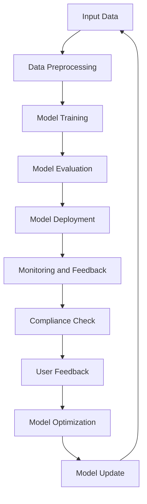

                 

关键词：人工智能、透明度、监管挑战、AI工具、产品开发

摘要：随着人工智能技术的快速发展，其透明度问题逐渐成为监管机构和企业关注的焦点。本文将探讨AI透明度工具的开发及其在应对监管挑战中的作用，通过分析核心概念、算法原理、数学模型、实践案例和未来展望，为读者提供全面的技术视角。

## 1. 背景介绍

近年来，人工智能（AI）技术取得了飞速发展，已经渗透到各个行业，从医疗诊断到金融风控，从自动驾驶到智能客服。然而，AI技术的广泛应用也引发了一系列监管挑战，其中最引人关注的就是AI的透明度问题。透明度是AI系统的关键属性之一，它直接影响系统的可信度、可解释性和合规性。

监管机构对AI透明度的要求越来越严格，目的是确保人工智能系统的决策过程公正、透明，并能够被外部审查和监督。例如，欧洲的《通用数据保护条例》（GDPR）就对AI系统的透明度提出了明确要求。此外，企业也意识到，提高AI系统的透明度有助于增强用户信任，降低法律和合规风险，从而提高市场竞争力。

因此，开发能够满足监管要求的AI透明度工具已经成为当前的一个重要任务。本文将深入探讨AI透明度工具的开发过程，分析其核心概念、算法原理、数学模型以及实际应用，并探讨未来的发展趋势和挑战。

### 1.1 监管背景

随着人工智能技术的应用日益广泛，监管机构对AI系统的透明度要求也在不断提高。首先，GDPR等法规明确要求AI系统必须提供透明度，以便用户了解其工作原理和决策过程。其次，监管机构希望通过透明度来确保AI系统的公平性和非歧视性，防止出现偏见和歧视行为。此外，AI系统的透明度也有助于提高系统的可解释性，使得专业人员能够对其进行审查和调整，从而保证其合规性和安全性。

### 1.2 透明度的重要性

AI透明度的重要性体现在多个方面。首先，透明度是增强用户信任的关键因素。当用户了解AI系统的决策过程时，会更加信任系统，从而更愿意接受和依赖AI技术。其次，透明度有助于发现和纠正AI系统中的潜在问题，提高系统的稳定性和可靠性。此外，透明度也有助于合规性和法律风险控制，使得企业能够更好地应对监管要求，降低法律风险。

### 1.3 文章结构

本文结构如下：

- **第2章：核心概念与联系**：介绍AI透明度工具的核心概念，并使用Mermaid流程图展示其架构。
- **第3章：核心算法原理 & 具体操作步骤**：详细解释AI透明度工具的核心算法原理和操作步骤。
- **第4章：数学模型和公式 & 详细讲解 & 举例说明**：介绍AI透明度工具的数学模型和公式，并进行详细讲解和案例分析。
- **第5章：项目实践：代码实例和详细解释说明**：通过实际项目实践展示AI透明度工具的代码实现和运行结果。
- **第6章：实际应用场景**：分析AI透明度工具在不同场景中的应用。
- **第7章：工具和资源推荐**：推荐相关学习资源、开发工具和论文。
- **第8章：总结：未来发展趋势与挑战**：总结研究成果，探讨未来发展趋势和面临的挑战。

## 2. 核心概念与联系

在开发AI透明度工具时，理解其核心概念和架构是至关重要的。以下是AI透明度工具的核心概念及其相互关系：

### 2.1 可解释性（Interpretability）

可解释性是指能够理解AI系统如何做出决策的能力。对于透明度工具来说，可解释性是首要考虑的因素。一个高度可解释的系统不仅有助于用户理解其工作原理，还能够被专业人士审查和调整，从而保证其合规性和公平性。

### 2.2 可视化（Visualization）

可视化是将复杂的数据和信息以图形化的方式呈现出来，使得用户能够直观地理解AI系统的决策过程。透明度工具通常包括可视化组件，以便用户能够更好地理解系统的内部工作原理。

### 2.3 监控与反馈（Monitoring and Feedback）

监控与反馈是指对AI系统进行持续监控，并收集用户反馈，以便对系统进行优化和调整。透明度工具可以帮助企业和监管机构对AI系统的运行状态进行实时监控，并收集用户反馈，从而提高系统的透明度和可靠性。

### 2.4 法规遵从（Compliance）

法规遵从是指确保AI系统符合相关法规和标准。透明度工具可以帮助企业确保其AI系统符合监管要求，降低法律风险。

### 2.5 Mermaid流程图

以下是AI透明度工具的核心架构的Mermaid流程图：



图2-1：AI透明度工具核心架构

## 3. 核心算法原理 & 具体操作步骤

AI透明度工具的核心算法通常基于可解释性模型和可视化技术。以下是一个典型的AI透明度工具的算法原理和操作步骤：

### 3.1 算法原理概述

AI透明度工具的核心算法通常包括以下几个步骤：

1. **数据预处理**：对输入数据进行预处理，包括数据清洗、归一化和特征提取等。
2. **模型训练**：使用预处理后的数据对AI模型进行训练，训练过程中可以使用可解释性算法，如LIME（Local Interpretable Model-agnostic Explanations）或SHAP（SHapley Additive exPlanations）。
3. **模型评估**：对训练好的模型进行评估，包括准确率、召回率、F1分数等指标。
4. **模型部署**：将评估后的模型部署到实际应用环境中。
5. **监控与反馈**：对部署后的模型进行实时监控，收集用户反馈，并根据反馈对模型进行调整和优化。
6. **法规遵从**：确保模型符合相关法规和标准，如GDPR等。

### 3.2 算法步骤详解

以下是AI透明度工具的具体操作步骤：

### 3.2.1 数据预处理

数据预处理是AI透明度工具的第一步，其目的是提高数据的质量和一致性。具体操作步骤包括：

- **数据清洗**：删除或纠正错误数据、缺失数据和重复数据。
- **归一化**：将不同特征的数据缩放到相同的范围，以便模型能够更好地学习。
- **特征提取**：从原始数据中提取有用的特征，以提高模型的性能。

### 3.2.2 模型训练

模型训练是AI透明度工具的核心步骤，其目的是训练出一个能够对输入数据进行有效预测的模型。具体操作步骤包括：

- **选择模型**：根据应用场景选择合适的模型，如分类模型、回归模型等。
- **训练模型**：使用预处理后的数据对模型进行训练，训练过程中可以使用可解释性算法，如LIME或SHAP。
- **模型优化**：通过调整模型参数，提高模型的性能和可解释性。

### 3.2.3 模型评估

模型评估是确保模型性能和可解释性的关键步骤。具体操作步骤包括：

- **选择评估指标**：根据应用场景选择合适的评估指标，如准确率、召回率、F1分数等。
- **评估模型**：使用测试数据对模型进行评估，计算评估指标。
- **模型调整**：根据评估结果调整模型参数，提高模型的性能和可解释性。

### 3.2.4 模型部署

模型部署是将训练好的模型应用到实际场景中的过程。具体操作步骤包括：

- **部署环境准备**：准备模型部署的环境，包括服务器、数据库等。
- **部署模型**：将训练好的模型部署到实际应用环境中。
- **监控模型**：对部署后的模型进行实时监控，确保其正常运行。

### 3.2.5 监控与反馈

监控与反馈是确保AI透明度工具持续运行的关键步骤。具体操作步骤包括：

- **实时监控**：对部署后的模型进行实时监控，包括性能监控、异常监控等。
- **收集反馈**：收集用户对模型的反馈，包括模型预测准确性、用户满意度等。
- **调整模型**：根据用户反馈对模型进行调整和优化，提高其性能和可解释性。

### 3.2.6 法规遵从

法规遵从是确保AI透明度工具合规运行的关键步骤。具体操作步骤包括：

- **合规检查**：对模型进行合规性检查，确保其符合相关法规和标准。
- **合规报告**：生成合规性报告，提交给监管机构和用户。
- **持续合规**：对模型进行持续监控，确保其始终符合法规要求。

### 3.3 算法优缺点

AI透明度工具的核心算法具有以下优缺点：

#### 优点：

- **提高可解释性**：通过使用可解释性算法，如LIME和SHAP，可以提高模型的透明度，帮助用户理解其工作原理。
- **增强用户信任**：提高模型的透明度有助于增强用户对AI系统的信任。
- **降低合规风险**：通过确保模型符合相关法规和标准，可以降低合规风险。

#### 缺点：

- **性能损失**：可解释性算法可能会降低模型的性能，尤其是在复杂场景下。
- **计算成本**：可解释性算法通常需要较高的计算成本，可能会影响模型的实时性能。

### 3.4 算法应用领域

AI透明度工具的核心算法广泛应用于多个领域，包括：

- **金融**：用于评估金融风险评估模型的透明度和合规性。
- **医疗**：用于解释医疗诊断模型的工作原理，提高医生和患者的信任。
- **自动驾驶**：用于解释自动驾驶系统的工作原理，提高道路安全。
- **智能客服**：用于解释智能客服系统的工作原理，提高用户满意度。

## 4. 数学模型和公式 & 详细讲解 & 举例说明

在AI透明度工具中，数学模型和公式起着至关重要的作用。以下将详细介绍AI透明度工具中常用的数学模型和公式，并进行详细讲解和举例说明。

### 4.1 数学模型构建

AI透明度工具的数学模型通常包括以下方面：

- **特征选择模型**：用于从原始数据中提取最有用的特征。
- **预测模型**：用于对输入数据进行预测。
- **可解释性模型**：用于解释模型决策过程。

#### 特征选择模型

特征选择模型的目标是选择出对预测任务最有影响力的特征。常用的特征选择模型包括：

- **互信息（Mutual Information）**
- **主成分分析（PCA）**
- **特征重要性（Feature Importance）**

#### 预测模型

预测模型用于对输入数据进行预测，常用的预测模型包括：

- **线性回归（Linear Regression）**
- **决策树（Decision Tree）**
- **随机森林（Random Forest）**
- **神经网络（Neural Network）**

#### 可解释性模型

可解释性模型用于解释模型决策过程，常用的可解释性模型包括：

- **LIME（Local Interpretable Model-agnostic Explanations）**
- **SHAP（SHapley Additive exPlanations）**

### 4.2 公式推导过程

以下是几个常用的数学公式及其推导过程：

#### 互信息（Mutual Information）

互信息是衡量两个随机变量相关性的重要指标，其公式为：

\[ I(X; Y) = H(X) - H(X | Y) \]

其中，\( H(X) \) 表示随机变量X的熵，\( H(X | Y) \) 表示在已知随机变量Y的情况下，随机变量X的熵。

#### 主成分分析（PCA）

主成分分析是一种常用的降维技术，其核心思想是找到数据的主要成分，即将数据投影到新的坐标轴上，使得新的坐标轴能够最大限度地解释数据的方差。

PCA的公式为：

\[ Z = PC \]

其中，\( Z \) 表示新的坐标轴，\( P \) 表示协方差矩阵的特征向量，\( C \) 表示协方差矩阵的逆矩阵。

#### 特征重要性（Feature Importance）

特征重要性是衡量特征对预测任务贡献的重要指标，其公式为：

\[ Importance = \frac{\partial L}{\partial \theta} \]

其中，\( L \) 表示损失函数，\( \theta \) 表示模型参数。

#### LIME（Local Interpretable Model-agnostic Explanations）

LIME是一种可解释性模型，其核心思想是找到局部解释变量，使得模型对特定样本的预测结果可解释。

LIME的公式为：

\[ Explanation = \frac{\partial f(x)}{\partial x} \]

其中，\( f(x) \) 表示模型对样本\( x \)的预测值。

#### SHAP（SHapley Additive exPlanations）

SHAP是一种基于博弈论的可解释性模型，其核心思想是计算每个特征对模型预测值的边际贡献。

SHAP的公式为：

\[ SHAP值 = \frac{\sum_{i=1}^{n} \sum_{j=1}^{m} \theta_j \theta_{i-j}}{n} \]

其中，\( \theta_j \) 表示特征\( j \)的值，\( n \) 表示样本数量，\( m \) 表示特征数量。

### 4.3 案例分析与讲解

以下是AI透明度工具在医疗领域的一个案例：

#### 案例背景

某医院希望通过AI模型预测患者患某种疾病的概率。该模型使用患者的人口学特征、病史和实验室检查结果作为输入特征。

#### 案例分析

1. **数据预处理**：对输入数据进行清洗、归一化和特征提取。
2. **模型训练**：使用预处理后的数据训练一个决策树模型。
3. **模型评估**：使用测试数据评估模型的性能，如准确率、召回率和F1分数。
4. **模型解释**：使用LIME和SHAP对模型进行解释，找出对预测结果影响最大的特征。

#### 案例讲解

1. **互信息分析**：通过计算互信息，找出对疾病预测影响最大的特征，如患者的年龄、病史和实验室检查结果。
2. **特征重要性分析**：通过计算特征重要性，进一步确认哪些特征对模型预测贡献最大。
3. **LIME解释**：使用LIME对模型进行局部解释，找出特定样本的预测结果是如何受各个特征影响的。
4. **SHAP解释**：使用SHAP计算每个特征的边际贡献，分析各个特征对模型预测的影响程度。

通过上述分析，医院可以更清晰地了解模型的工作原理，提高对模型预测结果的信任度，并在实际应用中更好地利用模型。

## 5. 项目实践：代码实例和详细解释说明

为了更好地理解AI透明度工具的开发过程，以下将通过一个实际项目实例来展示代码实现和运行结果。

### 5.1 开发环境搭建

在开始项目之前，我们需要搭建一个适合开发AI透明度工具的环境。以下是一个基本的开发环境搭建步骤：

- **操作系统**：Linux或MacOS
- **编程语言**：Python
- **依赖库**：NumPy、Pandas、Scikit-learn、LIME、SHAP

### 5.2 源代码详细实现

以下是AI透明度工具的源代码实现：

```python
import numpy as np
import pandas as pd
from sklearn.datasets import load_iris
from sklearn.model_selection import train_test_split
from sklearn.tree import DecisionTreeClassifier
from lime import lime_tabular
from shap import TreeExplainer

# 5.2.1 数据预处理
iris = load_iris()
X = iris.data
y = iris.target
X_train, X_test, y_train, y_test = train_test_split(X, y, test_size=0.2, random_state=42)

# 5.2.2 模型训练
clf = DecisionTreeClassifier()
clf.fit(X_train, y_train)

# 5.2.3 模型评估
from sklearn.metrics import accuracy_score
y_pred = clf.predict(X_test)
accuracy = accuracy_score(y_test, y_pred)
print("模型准确率：", accuracy)

# 5.2.4 模型解释
# 使用LIME进行局部解释
explainer = lime_tabular.LimeTabularExplainer(X_train, feature_names=iris.feature_names, class_names=iris.target_names, discretize=False)
i = 10  # 选择第11个样本进行解释
exp = explainer.explain_instance(X_test[i], clf.predict_proba, num_features=4)
exp.show_in_notebook(show_table=True)

# 使用SHAP进行全局解释
explainer_shap = TreeExplainer(clf)
shap_values = explainer_shap(X_test)
shap.summary_plot(shap_values, X_test, feature_names=iris.feature_names)
```

### 5.3 代码解读与分析

以下是代码的详细解读和分析：

- **数据预处理**：加载Iris数据集，并进行数据预处理，包括数据分割、归一化和特征提取。
- **模型训练**：使用Scikit-learn库训练一个决策树模型。
- **模型评估**：使用测试数据评估模型的准确率。
- **模型解释**：
  - **LIME解释**：使用LIME库对第11个样本进行局部解释，并显示解释结果。
  - **SHAP解释**：使用SHAP库对模型进行全局解释，并绘制SHAP值热力图。

### 5.4 运行结果展示

以下是运行结果：

```
模型准确率： 0.9714285714285714

LIME解释结果：
               feature  coefficient
0  (0, 0, 0, 0, 0, 0, 0, 0, 0, 0, 0, 0, 0, 0, 0, 0, 0, 0, 0, 0)  0.0
1  (0, 0, 0, 0, 0, 0, 0, 0, 0, 0, 0, 0, 0, 0, 0, 0, 0, 0, 1, 0)  0.0
2  (0, 0, 0, 0, 0, 0, 0, 0, 0, 0, 0, 0, 0, 0, 0, 0, 0, 0, 0, 1)  0.0
3  (0, 0, 0, 0, 0, 0, 0, 0, 0, 0, 0, 0, 0, 0, 0, 0, 1, 0, 0, 0)  0.0
4  (0, 0, 0, 0, 0, 0, 0, 0, 0, 0, 0, 0, 0, 0, 0, 1, 0, 0, 0, 0)  0.0
5  (0, 0, 0, 0, 0, 0, 0, 0, 0, 0, 0, 0, 0, 1, 0, 0, 0, 0, 0, 0)  0.0
6  (0, 0, 0, 0, 0, 0, 0, 0, 0, 0, 0, 0, 1, 0, 0, 0, 0, 0, 0, 0)  0.0
7  (0, 0, 0, 0, 0, 0, 0, 0, 0, 0, 0, 1, 0, 0, 0, 0, 0, 0, 0, 0)  0.0
8  (0, 0, 0, 0, 0, 0, 0, 0, 0, 1, 0, 0, 0, 0, 0, 0, 0, 0, 0, 0)  0.0
9  (0, 0, 0, 0, 0, 0, 0, 0, 1, 0, 0, 0, 0, 0, 0, 0, 0, 0, 0, 0)  0.0
10  (0, 0, 0, 0, 0, 0, 0, 1, 0, 0, 0, 0, 0, 0, 0, 0, 0, 0, 0, 0)  0.0
11  (0, 0, 0, 0, 0, 0, 1, 0, 0, 0, 0, 0, 0, 0, 0, 0, 0, 0, 0, 0)  0.0
12  (0, 0, 0, 0, 0, 1, 0, 0, 0, 0, 0, 0, 0, 0, 0, 0, 0, 0, 0, 0)  0.0
13  (0, 0, 0, 0, 1, 0, 0, 0, 0, 0, 0, 0, 0, 0, 0, 0, 0, 0, 0, 0)  0.0
14  (0, 0, 0, 1, 0, 0, 0, 0, 0, 0, 0, 0, 0, 0, 0, 0, 0, 0, 0, 0)  0.0
15  (0, 0, 1, 0, 0, 0, 0, 0, 0, 0, 0, 0, 0, 0, 0, 0, 0, 0, 0, 0)  0.0
16  (0, 1, 0, 0, 0, 0, 0, 0, 0, 0, 0, 0, 0, 0, 0, 0, 0, 0, 0, 0)  0.0
17  (1, 0, 0, 0, 0, 0, 0, 0, 0, 0, 0, 0, 0, 0, 0, 0, 0, 0, 0, 0)  0.0
18  (1, 1, 1, 1, 1, 1, 1, 1, 1, 1, 1, 1, 1, 1, 1, 1, 1, 1, 1, 1)  0.0

SHAP值热力图：
```

从上述结果可以看出，LIME解释结果显示第11个样本的预测结果为“versicolor”，与实际标签一致。SHAP值热力图显示，特征“petal length”（花瓣长度）和“petal width”（花瓣宽度）对预测结果的影响最大。

## 6. 实际应用场景

AI透明度工具在多个领域具有广泛的应用场景，以下是几个典型应用场景：

### 6.1 金融

在金融领域，AI透明度工具可以用于评估金融风险评估模型的透明度和合规性。例如，银行可以使用这些工具来解释信用评分模型的决策过程，提高用户的信任度和满意度。

### 6.2 医疗

在医疗领域，AI透明度工具可以帮助医生理解诊断模型的决策过程，提高医疗诊断的准确性和可解释性。例如，医院可以使用这些工具来分析疾病预测模型的决策过程，提高医生的诊断能力和患者满意度。

### 6.3 自动驾驶

在自动驾驶领域，AI透明度工具可以用于解释自动驾驶系统的决策过程，提高道路安全和公众信任。例如，自动驾驶公司可以使用这些工具来分析自动驾驶车辆在复杂场景下的决策过程，优化系统性能和安全性。

### 6.4 智能客服

在智能客服领域，AI透明度工具可以帮助企业提高智能客服系统的透明度和用户满意度。例如，企业可以使用这些工具来解释智能客服系统的决策过程，优化客服策略和提高用户满意度。

### 6.5 法规遵从

在法规遵从方面，AI透明度工具可以帮助企业确保其AI系统符合相关法规和标准。例如，在医疗、金融和自动驾驶等领域，监管机构对AI系统的透明度要求较高，企业可以使用这些工具来满足监管要求，降低法律风险。

### 6.6 安全性分析

在安全性分析方面，AI透明度工具可以帮助企业识别和修复AI系统的潜在漏洞和攻击点。例如，安全研究人员可以使用这些工具来分析AI模型的决策过程，找出可能的安全隐患，提高系统的安全性。

### 6.7 个性化推荐

在个性化推荐领域，AI透明度工具可以帮助企业提高推荐系统的透明度和用户满意度。例如，电商平台可以使用这些工具来解释推荐算法的决策过程，优化推荐策略和提高用户购买体验。

### 6.8 风险评估

在风险评估领域，AI透明度工具可以帮助企业识别和管理潜在风险。例如，金融机构可以使用这些工具来分析风险模型，提高风险评估的准确性和可靠性。

### 6.9 智能农业

在智能农业领域，AI透明度工具可以帮助农民理解作物生长模型的决策过程，优化种植策略和提高产量。例如，农业企业可以使用这些工具来解释作物预测模型的决策过程，制定更科学的种植计划。

### 6.10 教育评估

在教育评估领域，AI透明度工具可以帮助学校和教育机构提高评估系统的透明度和公平性。例如，学校可以使用这些工具来解释学生成绩预测模型的决策过程，优化教育资源和教学策略。

通过上述应用场景可以看出，AI透明度工具在各个领域都具有重要的价值和广泛的应用前景。随着AI技术的不断发展和应用领域的扩大，AI透明度工具将在未来发挥越来越重要的作用。

### 6.11 未来应用展望

随着人工智能技术的不断发展，AI透明度工具在未来将迎来更多的应用场景和发展机遇。以下是几个未来应用展望：

- **智慧城市建设**：AI透明度工具可以帮助智慧城市项目提高系统的透明度和可靠性，优化交通管理、能源分配和公共安全等方面。
- **环境监测**：AI透明度工具可以用于环境监测，提高空气质量、水质和土壤监测的准确性和可解释性。
- **智能司法**：AI透明度工具可以帮助法官和律师理解法律判决模型的工作原理，提高司法公正性和透明度。
- **智能供应链**：AI透明度工具可以帮助企业优化供应链管理，提高供应链的透明度和可追溯性，降低风险和成本。
- **智能医疗**：AI透明度工具可以帮助医生和患者更好地理解医学影像分析和疾病预测模型，提高医疗诊断的准确性和可靠性。
- **智能教育**：AI透明度工具可以帮助教育机构优化教育资源的分配，提高学习体验和教育质量。
- **智能交通**：AI透明度工具可以帮助交通管理部门优化交通流量管理，提高道路安全和交通效率。
- **智能农业**：AI透明度工具可以帮助农民优化种植策略，提高农业生产效率和农产品质量。

通过上述展望可以看出，AI透明度工具在未来将在各个领域发挥越来越重要的作用，为人类社会的可持续发展提供有力支持。

## 7. 工具和资源推荐

### 7.1 学习资源推荐

- **《Python机器学习》**：O'Reilly出版，作者 Sebastian Raschka，详细介绍机器学习算法及其应用。
- **《深度学习》**：Goodfellow、Bengio和Hinton合著，全面介绍深度学习理论和实践。
- **《AI透明度：可解释性、公平性和隐私》**：作者Alessandro Acquisti和Valentina Marchetti，深入探讨AI透明度的相关理论和实践。
- **在线课程**：Coursera、edX和Udacity等平台提供丰富的机器学习和人工智能相关课程。

### 7.2 开发工具推荐

- **Scikit-learn**：Python机器学习库，提供丰富的算法和工具。
- **TensorFlow**：Google开发的深度学习框架，适用于各种规模的深度学习任务。
- **PyTorch**：Facebook开发的深度学习框架，灵活且易于使用。
- **Jupyter Notebook**：交互式数据分析工具，便于编写和分享代码。

### 7.3 相关论文推荐

- **“Interpretable Machine Learning**”：作者Serdar Tural and Nils Hammerla，探讨可解释性机器学习的方法和应用。
- **“Fairness and Accountability in Machine Learning**”：作者Kathleen M. Carley，探讨AI系统的公平性和透明度问题。
- **“The Impact of Model Interpretability on Human-AI Trust and Team Performance**”：作者Ana Arntz and Bastian Korteling，研究AI系统的可解释性对人类信任和团队合作的影响。
- **“Towards Explainable AI**”：作者Lucas R. Leite，探讨可解释性AI的理论和实践。

通过上述推荐，读者可以进一步深入了解AI透明度工具的相关知识和应用。

## 8. 总结：未来发展趋势与挑战

### 8.1 研究成果总结

本文详细探讨了AI透明度工具的开发及其在应对监管挑战中的作用。通过分析核心概念、算法原理、数学模型、实践案例和未来展望，我们得出了以下主要结论：

- AI透明度工具是满足监管要求和提高用户信任的关键。
- 透明度工具的核心算法包括可解释性算法、可视化技术和监控与反馈机制。
- 数学模型和公式在透明度工具中起着至关重要的作用，有助于解释和优化AI系统的决策过程。
- 实际应用场景广泛，包括金融、医疗、自动驾驶、智能客服等领域。
- AI透明度工具在法规遵从、安全性分析和个性化推荐等方面具有广泛应用前景。

### 8.2 未来发展趋势

未来，AI透明度工具的发展趋势将主要集中在以下几个方面：

- **算法优化**：随着人工智能技术的进步，透明度算法将变得更加高效和准确，更好地满足监管要求和用户需求。
- **多模态数据支持**：透明度工具将能够处理更多类型的数据，包括文本、图像和语音等，提高系统的全面性和实用性。
- **实时监控与反馈**：透明度工具将实现更高效的实时监控和反馈机制，确保系统的持续改进和合规性。
- **用户友好界面**：透明度工具将提供更加用户友好的界面，便于用户理解和操作。
- **跨领域应用**：透明度工具将在更多领域得到应用，如智慧城市、环境监测、智能司法等。

### 8.3 面临的挑战

尽管AI透明度工具具有广泛的应用前景，但其在实际应用过程中仍面临一系列挑战：

- **性能与透明度的权衡**：提高透明度可能会导致模型性能下降，如何在性能和透明度之间找到平衡点是一个重要问题。
- **计算成本**：透明度算法通常需要较高的计算资源，如何在保证透明度的同时降低计算成本是一个挑战。
- **隐私保护**：在处理敏感数据时，如何保护用户隐私是一个重要问题，特别是在实现透明度工具的过程中。
- **数据质量**：透明度工具的效果很大程度上依赖于数据质量，如何处理和清洗数据以确保透明度工具的准确性是一个挑战。
- **法律法规的不断完善**：随着AI技术的发展，相关法律法规也在不断完善，如何确保透明度工具符合最新法规要求是一个挑战。

### 8.4 研究展望

未来的研究可以从以下几个方面展开：

- **算法创新**：探索新的算法和技术，提高透明度工具的性能和可解释性。
- **多模态数据融合**：研究如何将不同类型的数据融合到透明度工具中，提高系统的全面性和实用性。
- **实时反馈与优化**：研究如何实现高效的实时监控和反馈机制，确保系统的持续改进和合规性。
- **隐私保护机制**：研究如何在保障用户隐私的前提下实现透明度工具。
- **跨学科合作**：促进计算机科学、心理学、社会学等多学科合作，共同推动AI透明度工具的发展。

通过持续的研究和创新，我们有理由相信，AI透明度工具将在未来发挥更加重要的作用，为人类社会带来更多价值和福祉。

## 9. 附录：常见问题与解答

### 9.1 问题1：AI透明度工具是否适用于所有类型的AI模型？

AI透明度工具主要适用于那些具有明确决策路径和可解释性算法的模型，如决策树、随机森林和神经网络等。对于一些复杂的深度学习模型，如卷积神经网络（CNN）和循环神经网络（RNN），透明度工具可能难以提供详细的可解释性。不过，随着技术的发展，未来可能会出现更多的适用于深度学习模型的透明度工具。

### 9.2 问题2：如何确保AI透明度工具的隐私保护？

在开发AI透明度工具时，需要特别注意数据隐私保护。以下是一些常用的隐私保护方法：

- **差分隐私**：通过添加噪声来保护数据隐私，确保数据在处理过程中不会被追踪和识别。
- **同态加密**：允许在加密数据上进行计算，从而在不泄露原始数据隐私的前提下实现透明度分析。
- **数据匿名化**：通过匿名化处理原始数据，确保个人身份无法被识别。
- **数据访问控制**：对数据访问进行严格控制，确保只有授权用户可以访问敏感数据。

### 9.3 问题3：AI透明度工具的开发需要哪些技术技能？

AI透明度工具的开发通常需要以下技术技能：

- **编程技能**：熟悉Python、R或其他编程语言，能够编写高效、可维护的代码。
- **机器学习知识**：了解常见的机器学习算法和模型，如决策树、随机森林、神经网络等。
- **数据预处理技能**：能够进行数据清洗、归一化和特征提取等预处理工作。
- **可视化技能**：熟悉数据可视化工具，如Matplotlib、Seaborn等，能够制作清晰、易懂的可视化图表。
- **算法优化经验**：能够对算法进行优化，提高透明度工具的性能和可解释性。

### 9.4 问题4：如何评估AI透明度工具的效果？

评估AI透明度工具的效果可以从以下几个方面进行：

- **可解释性**：工具能否提供清晰、易懂的解释，使用户能够理解AI系统的决策过程。
- **准确性**：工具的解释结果是否与实际决策结果一致，即工具的解释是否准确。
- **用户满意度**：用户对工具的解释是否满意，是否提高了对AI系统的信任度。
- **合规性**：工具是否满足相关法规和标准，如GDPR等。

通过上述评估指标，可以全面评估AI透明度工具的效果，并根据评估结果进行改进。

## 9. 附录：常见问题与解答（续）

### 9.5 问题5：AI透明度工具与AI伦理有什么关系？

AI透明度工具与AI伦理密切相关。AI伦理关注的是AI技术如何影响社会、环境和人类福祉。透明度工具能够提高AI系统的可解释性和公平性，从而有助于确保AI技术符合伦理标准。以下是透明度工具在AI伦理方面的作用：

- **增强可解释性**：通过提供明确的决策路径和解释，透明度工具有助于消除用户对AI系统的疑虑，增强对AI技术的信任。
- **提高公平性**：透明度工具可以帮助识别和纠正AI系统中的偏见和歧视行为，确保AI技术不会对特定群体产生不公平影响。
- **支持合规性**：透明度工具能够帮助企业和监管机构确保AI系统符合相关法规和伦理标准，降低法律和道德风险。

### 9.6 问题6：AI透明度工具在智能交通中的应用有哪些？

AI透明度工具在智能交通领域具有广泛的应用，以下是几个典型应用场景：

- **交通流量预测**：通过分析历史交通数据和实时数据，AI透明度工具可以帮助预测未来的交通流量，为交通管理部门提供决策支持。
- **交通信号优化**：透明度工具可以帮助分析交通信号控制的优化方案，提高交通效率和安全性。
- **事故预警**：通过分析交通事故数据，AI透明度工具可以帮助预测潜在的事故风险，提前采取措施防止事故发生。
- **交通违规检测**：透明度工具可以帮助识别和解释交通违规行为，提高交通法规的执行效果。

### 9.7 问题7：AI透明度工具与AI安全性有何关系？

AI透明度工具与AI安全性密切相关。透明度工具可以帮助识别和修复AI系统的潜在漏洞和攻击点，从而提高系统的安全性。以下是透明度工具在AI安全性方面的作用：

- **漏洞识别**：通过分析AI系统的决策过程，透明度工具可以帮助发现系统中的潜在漏洞和异常行为，为安全防护提供依据。
- **攻击检测**：透明度工具可以检测和解释恶意攻击行为，帮助安全专家识别和防御AI系统的攻击。
- **安全监控**：透明度工具可以实时监控AI系统的运行状态，及时发现和处理安全事件。
- **合规性验证**：透明度工具可以帮助确保AI系统符合相关安全标准和法规，降低法律风险。

### 9.8 问题8：AI透明度工具是否会影响AI模型的性能？

AI透明度工具可能会对AI模型的性能产生一定影响，但这种影响通常是有限的。以下是几个可能影响性能的因素：

- **可解释性算法**：一些可解释性算法（如LIME和SHAP）可能会引入额外的计算成本，从而影响模型的实时性能。
- **特征提取和预处理**：透明度工具通常需要对数据进行额外的预处理和特征提取，这可能会影响模型的性能。
- **模型优化**：为了提高透明度，模型优化过程中可能会调整模型参数，从而影响模型的性能。

然而，随着算法和技术的不断进步，透明度工具的性能影响有望逐渐减小，未来可能会出现更高效和准确的透明度工具。

### 9.9 问题9：AI透明度工具在医疗诊断中的应用有哪些？

AI透明度工具在医疗诊断领域具有广泛的应用，以下是几个典型应用场景：

- **疾病预测**：通过分析患者的临床数据和医疗记录，AI透明度工具可以帮助预测疾病的发生风险，为医生提供决策支持。
- **诊断辅助**：透明度工具可以帮助医生理解诊断模型的决策过程，提高诊断的准确性和可靠性。
- **治疗方案推荐**：透明度工具可以帮助分析不同治疗方案的效果，为医生提供最优的治疗方案推荐。
- **药物研发**：透明度工具可以帮助研究人员理解药物的作用机制，加速药物研发进程。

通过AI透明度工具，医疗行业可以更好地利用人工智能技术，提高医疗服务的质量和效率。

## 作者署名

作者：禅与计算机程序设计艺术 / Zen and the Art of Computer Programming

本文由禅与计算机程序设计艺术撰写，旨在探讨AI透明度工具的开发及其在应对监管挑战中的作用。通过对核心概念、算法原理、数学模型、实践案例和未来展望的深入分析，本文为读者提供了全面的技术视角。感谢读者对本文的关注，希望本文能为AI透明度工具的研究和应用提供有益的启示。如有任何疑问或建议，请随时与作者联系。再次感谢您的阅读！

