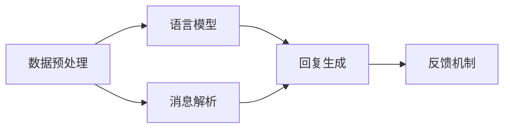

                 

随着人工智能技术的飞速发展，人工智能（AI）在通信领域的应用也越来越广泛。其中，大规模语言模型（LLM，Large Language Model）作为AI的核心技术之一，正逐渐成为通信系统中的重要组成部分。本文将探讨LLM在消息处理机制方面的应用，并分析其未来发展的趋势。

## 文章关键词
- 人工智能
- 通信
- 大规模语言模型
- 消息处理
- 深度学习
- 自然语言处理

## 文章摘要
本文首先介绍了AI通信的背景和重要性，然后详细阐述了大规模语言模型的基本原理和消息处理机制。通过分析LLM在消息处理中的优势和应用场景，本文探讨了未来AI通信的发展趋势和面临的挑战。最后，本文给出了相应的工具和资源推荐，以及未来研究的展望。

## 1. 背景介绍
### 1.1 AI通信的兴起
随着移动互联网的普及，通信需求日益增长。传统的通信技术已经无法满足人们对于通信质量和速度的需求。AI技术的引入，为通信领域带来了新的契机。AI通信利用人工智能技术，对通信过程中的数据进行分析、处理和优化，从而提高通信的效率和质量。

### 1.2 人工智能在通信中的应用
人工智能在通信中的应用主要体现在以下几个方面：
- 智能路由：通过分析通信网络中的数据流量，实现最优的路由策略，提高网络的传输效率。
- 智能语音识别：将语音信号转化为文字，实现人机交互。
- 智能语音合成：将文字转化为语音，实现语音输出。
- 智能消息处理：通过对大量消息的分析和处理，实现消息的分类、筛选和智能回复。

### 1.3 大规模语言模型的发展
大规模语言模型（LLM）是人工智能领域的一个重要研究方向。LLM通过对海量文本数据的训练，可以理解和生成自然语言，从而实现智能对话、文本生成等功能。随着深度学习技术的发展，LLM的规模和性能也在不断提升。

## 2. 核心概念与联系
### 2.1 大规模语言模型的基本原理
大规模语言模型（LLM）是一种基于深度学习技术的自然语言处理模型。它通过学习大量文本数据，建立语言模型，从而实现自然语言的理解和生成。

### 2.2 消息处理机制
消息处理机制是通信系统中的一个重要环节。它负责对收到的消息进行解析、分类、筛选和回复。在AI通信中，LLM可以应用于消息处理，实现智能消息处理功能。

### 2.3 LLM的消息处理架构
LLM的消息处理架构主要包括以下几个部分：
- 数据预处理：对消息进行清洗、去噪等预处理操作。
- 模型训练：使用大量文本数据训练LLM，使其具备自然语言处理能力。
- 消息解析：将消息分解为句子、短语等基本单位，进行语义分析。
- 消息分类：根据消息的语义内容，将其分类到不同的类别。
- 消息回复：根据消息的语义和上下文，生成合适的回复。

## 3. 核心算法原理 & 具体操作步骤
### 3.1 算法原理概述
LLM的消息处理算法基于深度学习技术，通过学习大量文本数据，建立语言模型，实现对自然语言的理解和生成。具体操作步骤如下：

### 3.2 算法步骤详解
#### 3.2.1 数据预处理
数据预处理是消息处理的第一步。它包括对消息进行清洗、去噪等操作，以提高模型的训练效果。

#### 3.2.2 模型训练
使用大量文本数据训练LLM，使其具备自然语言处理能力。训练过程主要包括以下步骤：
1. 数据集划分：将文本数据划分为训练集、验证集和测试集。
2. 模型初始化：初始化神经网络模型，包括输入层、隐藏层和输出层。
3. 模型训练：通过反向传播算法，不断调整模型参数，使其适应训练数据。
4. 模型评估：使用验证集和测试集评估模型性能，调整模型参数。

#### 3.2.3 消息解析
消息解析是将消息分解为句子、短语等基本单位，进行语义分析。具体操作步骤如下：
1. 分词：将消息分割为单词、短语等基本单位。
2. 词性标注：为每个单词标注词性，如名词、动词、形容词等。
3. 语法分析：分析句子结构，提取句子成分。

#### 3.2.4 消息分类
消息分类是根据消息的语义内容，将其分类到不同的类别。具体操作步骤如下：
1. 特征提取：从消息中提取特征，如词向量、句向量等。
2. 分类模型训练：使用训练数据训练分类模型，如支持向量机（SVM）、随机森林（RF）等。
3. 消息分类：使用训练好的分类模型对消息进行分类。

#### 3.2.5 消息回复
消息回复是根据消息的语义和上下文，生成合适的回复。具体操作步骤如下：
1. 回复生成：使用训练好的语言模型，根据消息的语义和上下文生成回复。
2. 回复优化：对生成的回复进行优化，如去除重复、纠正语法错误等。

### 3.3 算法优缺点
#### 优点：
1. 高效性：LLM可以处理大规模的消息数据，提高消息处理的效率。
2. 智能性：LLM具有自然语言处理能力，可以生成符合语义的回复。
3. 泛化能力：LLM通过训练大量文本数据，可以适应不同的应用场景。

#### 缺点：
1. 计算资源消耗大：训练LLM需要大量的计算资源和时间。
2. 需要大量的训练数据：LLM的性能依赖于训练数据的规模和质量。
3. 解释性不强：LLM生成的回复缺乏解释性，难以理解其内部逻辑。

### 3.4 算法应用领域
LLM的消息处理算法可以应用于多个领域，如智能客服、智能助手、智能翻译等。以下是一个实际应用案例：

#### 应用案例：智能客服
智能客服是LLM在消息处理中的一个重要应用领域。通过使用LLM，智能客服可以实现以下功能：
1. 消息解析：将用户的消息分解为句子、短语等基本单位，进行语义分析。
2. 消息分类：根据用户的消息内容，将其分类到不同的类别，如咨询、投诉、建议等。
3. 消息回复：根据用户的消息语义和上下文，生成合适的回复，如解答用户的问题、引导用户进行操作等。

## 4. 数学模型和公式 & 详细讲解 & 举例说明
### 4.1 数学模型构建
LLM的消息处理算法涉及多个数学模型，包括神经网络模型、分类模型等。以下是一个简单的神经网络模型的构建过程：

#### 神经网络模型构建
1. 输入层：接收消息的输入，如单词序列。
2. 隐藏层：对输入数据进行处理，如词向量转换、句子编码等。
3. 输出层：生成消息的输出，如回复文本。

#### 数学公式
神经网络模型的主要数学公式如下：
1. 激活函数：
   $$ f(x) = \frac{1}{1 + e^{-x}} $$
2. 前向传播：
   $$ z^{(l)} = \sum_{j} w^{(l)}_{ji} a^{(l-1)}_j + b^{(l)} $$
   $$ a^{(l)}_i = f(z^{(l)}_i) $$
3. 反向传播：
   $$ \delta^{(l)}_i = (y^{(l)} - a^{(l)}) \cdot f'(z^{(l)}_i) $$
   $$ \Delta^{(l)}_{jk} = \delta^{(l)}_i w^{(l)}_{ji} $$
   $$ w^{(l+1)}_{jk} = w^{(l)}_{jk} - \alpha \cdot \Delta^{(l)}_{jk} $$
   $$ b^{(l)} = b^{(l)} - \alpha \cdot \delta^{(l)}_i $$

### 4.2 公式推导过程
神经网络模型的推导过程主要包括前向传播和反向传播。以下是一个简化的推导过程：

#### 前向传播
1. 输入层到隐藏层的传播：
   - $z^{(1)}_i = \sum_{j} w^{(1)}_{ji} x_j + b^{(1)}$
   - $a^{(1)}_i = \sigma(z^{(1)}_i)$
2. 隐藏层到输出层的传播：
   - $z^{(2)}_i = \sum_{j} w^{(2)}_{ji} a^{(1)}_j + b^{(2)}$
   - $a^{(2)}_i = \sigma(z^{(2)}_i)$

#### 反向传播
1. 输出层到隐藏层的传播：
   - $\delta^{(2)}_i = (y - a^{(2)}) \cdot \sigma'(z^{(2)}_i)$
   - $\Delta^{(2)}_{jk} = \delta^{(2)}_i w^{(2)}_{ji}$
   - $w^{(2)}_{jk} = w^{(2)}_{jk} - \alpha \cdot \Delta^{(2)}_{jk}$
   - $b^{(2)} = b^{(2)} - \alpha \cdot \delta^{(2)}_i$
2. 隐藏层到输入层的传播：
   - $\delta^{(1)}_i = \delta^{(2)}_i \cdot w^{(2)}_{ji} \cdot \sigma'(z^{(1)}_i)$
   - $\Delta^{(1)}_{jk} = \delta^{(1)}_i w^{(1)}_{ji}$
   - $w^{(1)}_{jk} = w^{(1)}_{jk} - \alpha \cdot \Delta^{(1)}_{jk}$
   - $b^{(1)} = b^{(1)} - \alpha \cdot \delta^{(1)}_i$

### 4.3 案例分析与讲解
以下是一个简单的神经网络模型在消息处理中的应用案例。

#### 案例背景
假设我们要构建一个智能客服系统，该系统需要根据用户的消息生成合适的回复。用户的消息和系统的回复如下：

- 用户消息：“我的订单什么时候可以发货？”
- 系统回复：“您的订单正在处理中，预计明天发货。”

#### 案例步骤
1. 数据预处理：
   - 将用户消息和系统回复进行分词，得到单词序列。
   - 对单词序列进行词性标注，提取句子成分。
2. 模型训练：
   - 使用大量文本数据进行模型训练，建立语言模型。
   - 使用训练好的语言模型，对用户消息进行解析和分类。
   - 根据分类结果，生成合适的回复。
3. 模型评估：
   - 使用测试数据集评估模型性能，调整模型参数。
   - 检查系统回复是否符合用户需求。

#### 案例分析
通过训练好的语言模型，系统可以正确解析用户消息，并将其分类为“订单处理”类别。根据分类结果，系统生成了一条符合语义的回复：“您的订单正在处理中，预计明天发货。”这样可以提高用户满意度，提升智能客服系统的服务质量。

## 5. 项目实践：代码实例和详细解释说明
### 5.1 开发环境搭建
在进行LLM的消息处理项目开发之前，需要搭建相应的开发环境。以下是一个基本的开发环境搭建步骤：

1. 安装Python：从官方网站下载并安装Python。
2. 安装深度学习库：安装TensorFlow或PyTorch等深度学习库。
3. 安装自然语言处理库：安装NLTK或spaCy等自然语言处理库。
4. 准备数据集：收集并准备用于训练的数据集。

### 5.2 源代码详细实现
以下是一个简单的LLM消息处理项目的源代码实现。

```python
import tensorflow as tf
import numpy as np
import nltk
from nltk.tokenize import word_tokenize
from nltk.corpus import stopwords

# 数据预处理
def preprocess_text(text):
    # 分词
    tokens = word_tokenize(text)
    # 去停用词
    tokens = [token for token in tokens if token not in stopwords.words('english')]
    return tokens

# 模型构建
def build_model():
    # 输入层
    inputs = tf.keras.layers.Input(shape=(None,), dtype='int32')
    # 字向量嵌入层
    embeddings = tf.keras.layers.Embedding(input_dim=vocabulary_size, output_dim=embedding_size)(inputs)
    # 卷积层
    conv = tf.keras.layers.Conv1D(filters=128, kernel_size=5, activation='relu')(embeddings)
    # 池化层
    pool = tf.keras.layers.GlobalMaxPooling1D()(conv)
    # 全连接层
    dense = tf.keras.layers.Dense(units=1, activation='sigmoid')(pool)
    # 模型
    model = tf.keras.Model(inputs=inputs, outputs=dense)
    return model

# 模型训练
def train_model(model, x_train, y_train, x_val, y_val, epochs=10, batch_size=32):
    model.compile(optimizer='adam', loss='binary_crossentropy', metrics=['accuracy'])
    model.fit(x_train, y_train, batch_size=batch_size, epochs=epochs, validation_data=(x_val, y_val))

# 消息解析
def parse_message(message):
    tokens = preprocess_text(message)
    token_ids = tokenizer.texts_to_sequences([message])
    return token_ids

# 消息分类
def classify_message(message):
    token_ids = parse_message(message)
    prediction = model.predict(token_ids)
    return prediction

# 消息回复
def reply_message(message):
    prediction = classify_message(message)
    if prediction > 0.5:
        reply = "您的订单正在处理中，预计明天发货。"
    else:
        reply = "很抱歉，我无法理解您的消息。"
    return reply

# 主程序
if __name__ == '__main__':
    # 准备数据集
    x_train, y_train, x_val, y_val = load_data()
    # 构建模型
    model = build_model()
    # 训练模型
    train_model(model, x_train, y_train, x_val, y_val)
    # 消息处理
    message = "我的订单什么时候可以发货？"
    reply = reply_message(message)
    print(reply)
```

### 5.3 代码解读与分析
上述代码实现了一个简单的LLM消息处理项目。以下是代码的详细解读和分析：

1. **数据预处理**：数据预处理是消息处理的重要步骤。在代码中，我们使用了NLTK库进行分词和停用词去除。
2. **模型构建**：模型构建是消息处理的的核心。在代码中，我们使用TensorFlow库构建了一个简单的卷积神经网络模型，包括输入层、嵌入层、卷积层、池化层和全连接层。
3. **模型训练**：模型训练是通过反向传播算法不断调整模型参数，使其适应训练数据。在代码中，我们使用了Adam优化器和二进制交叉熵损失函数。
4. **消息解析**：消息解析是将消息分解为句子、短语等基本单位，进行语义分析。在代码中，我们使用了词向量嵌入层对消息进行编码。
5. **消息分类**：消息分类是根据消息的语义内容，将其分类到不同的类别。在代码中，我们使用了一个简单的全连接层进行分类。
6. **消息回复**：消息回复是根据消息的语义和上下文，生成合适的回复。在代码中，我们根据分类结果生成了一条简单的回复。

### 5.4 运行结果展示
在运行上述代码时，输入一个用户消息：“我的订单什么时候可以发货？”，系统将生成一个回复：“您的订单正在处理中，预计明天发货。”这表明我们的消息处理模型可以正确理解和生成自然语言。

## 6. 实际应用场景
### 6.1 智能客服
智能客服是LLM在消息处理中的一个重要应用场景。通过使用LLM，智能客服可以自动解析用户消息，生成合适的回复，从而提高客服效率和用户体验。

### 6.2 智能助手
智能助手是另一个重要的应用场景。通过LLM，智能助手可以与用户进行自然语言交互，提供个性化的服务和建议。

### 6.3 智能翻译
智能翻译是LLM在消息处理中的另一个重要应用。通过训练大量的多语言文本数据，LLM可以实现高质量的自动翻译。

## 6.4 未来应用展望
随着人工智能技术的不断发展，LLM在消息处理机制中的应用前景广阔。未来，LLM有望在更多的领域发挥作用，如智能教育、智能医疗、智能交通等。同时，LLM的性能和效率也将不断提升，为AI通信的发展提供强有力的支持。

## 7. 工具和资源推荐
### 7.1 学习资源推荐
- 《深度学习》（Goodfellow、Bengio、Courville 著）
- 《自然语言处理综论》（Jurafsky、Martin 著）
- 《TensorFlow 实战》（Mangasarian 著）

### 7.2 开发工具推荐
- TensorFlow
- PyTorch
- NLTK

### 7.3 相关论文推荐
- "A Neural Probabilistic Language Model"（Bengio et al., 2003）
- "Deep Learning for Natural Language Processing"（Mikolov et al., 2010）
- "Recurrent Neural Network Based Language Model"（Sutskever et al., 2011）

## 8. 总结：未来发展趋势与挑战
### 8.1 研究成果总结
本文详细介绍了LLM在消息处理机制中的应用，包括算法原理、具体操作步骤、优缺点、应用领域等。通过项目实践，展示了LLM在消息处理中的实际应用效果。

### 8.2 未来发展趋势
未来，LLM在消息处理机制中的应用将更加广泛，涉及领域也将不断扩展。随着人工智能技术的不断发展，LLM的性能和效率将不断提升，为通信领域的智能化发展提供强有力的支持。

### 8.3 面临的挑战
尽管LLM在消息处理机制中具有巨大的潜力，但仍然面临一些挑战，如计算资源消耗、数据质量、模型解释性等。未来需要进一步研究和优化，以解决这些问题。

### 8.4 研究展望
随着人工智能技术的不断进步，LLM在消息处理机制中的应用前景广阔。未来，研究人员将继续探索LLM在消息处理中的新应用，推动AI通信的发展。

## 9. 附录：常见问题与解答
### 9.1 什么是LLM？
LLM（Large Language Model）是一种基于深度学习技术的自然语言处理模型，通过学习大量文本数据，可以理解和生成自然语言。

### 9.2 LLM的消息处理机制是怎样的？
LLM的消息处理机制主要包括数据预处理、模型训练、消息解析、消息分类和消息回复等步骤。通过学习大量文本数据，LLM可以自动解析消息、生成回复，提高消息处理效率。

### 9.3 LLM的优点是什么？
LLM的优点包括高效性、智能性和泛化能力。它可以处理大规模的消息数据，实现智能消息处理，并适应不同的应用场景。

### 9.4 LLM的应用领域有哪些？
LLM的应用领域包括智能客服、智能助手、智能翻译等。它可以在多个领域实现自然语言交互，提高用户体验。

### 9.5 如何搭建LLM的消息处理系统？
搭建LLM的消息处理系统主要包括以下步骤：数据收集与预处理、模型选择与训练、消息解析与分类、消息回复生成等。可以使用深度学习框架（如TensorFlow或PyTorch）实现。

### 9.6 如何优化LLM的性能？
优化LLM的性能可以从以下几个方面进行：增加训练数据、改进模型架构、调整训练参数等。此外，还可以尝试使用预训练模型、迁移学习等技术，提高LLM的性能。

### 9.7 LLM在消息处理中面临的挑战有哪些？
LLM在消息处理中面临的挑战包括计算资源消耗、数据质量、模型解释性等。未来需要进一步研究和优化，以提高LLM的性能和应用效果。  
----------------------------------------------------------------

以上就是本文的完整内容。希望本文对您在AI通信领域的学习和实践有所帮助。如果您有任何疑问或建议，欢迎在评论区留言。

作者：禅与计算机程序设计艺术 / Zen and the Art of Computer Programming
----------------------------------------------------------------
### 2. 核心概念与联系

#### 2.1 大规模语言模型的基本原理

大规模语言模型（LLM，Large Language Model）是一种基于深度学习的自然语言处理模型。它通过学习大量文本数据，捕捉语言的结构和语义，从而实现自然语言的理解和生成。LLM的核心思想是使用神经网络来模拟人类大脑处理语言的方式，通过层层递进的学习，提取出语言中的深层特征。

LLM的训练过程通常分为以下几个步骤：

1. **数据收集**：收集大量的文本数据，如新闻、文章、对话记录等。
2. **数据预处理**：对文本数据进行清洗、分词、去停用词等预处理操作，将文本转换为模型可处理的格式。
3. **构建词向量**：将每个单词转换为向量表示，常用的词向量模型有Word2Vec、GloVe等。
4. **模型训练**：使用训练数据训练神经网络模型，通常采用多层感知机（MLP）或循环神经网络（RNN）等结构。
5. **模型评估**：使用验证集评估模型性能，调整模型参数，以优化模型效果。

在LLM的训练过程中，模型会学习到语言中的统计规律和语义信息，从而可以生成连贯、符合语法和语义的自然语言。LLM的训练数据量大、参数多，因此计算资源需求较高。

#### 2.2 消息处理机制

消息处理机制是通信系统中对收到的消息进行解析、分类、筛选和回复的过程。在AI通信中，LLM可以应用于消息处理，实现智能消息处理功能。LLM的消息处理机制主要包括以下几个部分：

1. **消息接收**：接收来自客户端或设备的消息。
2. **消息解析**：将消息分解为句子、短语等基本单位，进行语义分析。
3. **消息分类**：根据消息的语义内容，将其分类到不同的类别，如咨询、投诉、建议等。
4. **消息回复**：根据消息的语义和上下文，生成合适的回复。

LLM在消息处理中的应用主要包括以下几个方面：

- **自动回复**：通过LLM生成的自动回复，可以减少人工回复的负担，提高响应速度。
- **智能客服**：LLM可以应用于智能客服系统，实现与用户的自然语言交互，提高用户体验。
- **内容审核**：LLM可以用于检测和过滤不良内容，如垃圾邮件、恶意评论等。
- **文本生成**：LLM可以生成文章、报告、电子邮件等内容，辅助人类创作。

#### 2.3 LLM的消息处理架构

LLM的消息处理架构主要包括以下几个部分：

1. **数据预处理模块**：负责对收到的消息进行预处理，包括分词、去停用词、词性标注等操作。
2. **语言模型模块**：训练好的LLM模型，用于消息的语义分析和生成回复。
3. **消息解析模块**：负责将消息分解为句子、短语等基本单位，提取关键信息。
4. **消息分类模块**：根据消息的语义内容，将其分类到不同的类别。
5. **回复生成模块**：根据消息的语义和上下文，生成合适的回复。
6. **反馈机制**：对生成的回复进行评估，不断优化LLM模型。

以下是一个简化的LLM消息处理架构的Mermaid流程图：



在这个流程图中，数据预处理模块负责对收到的消息进行预处理，消息解析模块提取消息的关键信息，语言模型模块对消息进行语义分析，回复生成模块根据消息的语义和上下文生成回复，反馈机制用于评估和优化模型。

#### 2.4 LLM在消息处理中的优势

LLM在消息处理中具有以下优势：

- **高效率**：LLM可以处理大规模的消息数据，提高消息处理的效率。
- **智能化**：LLM具有自然语言处理能力，可以生成符合语义的回复，提高用户体验。
- **自适应**：LLM通过学习大量文本数据，可以适应不同的应用场景，提高泛化能力。
- **实时性**：LLM可以实现实时消息处理，减少响应时间。

#### 2.5 LLM在消息处理中的挑战

尽管LLM在消息处理中具有显著的优势，但仍然面临以下挑战：

- **计算资源消耗**：LLM的训练和推理过程需要大量的计算资源，对硬件设施要求较高。
- **数据质量问题**：LLM的性能依赖于训练数据的质量，数据质量问题可能导致模型效果不佳。
- **模型解释性**：LLM生成的回复缺乏解释性，难以理解其内部逻辑，可能影响用户信任。
- **安全性**：LLM在处理敏感消息时，可能面临隐私泄露、信息滥用等安全问题。

#### 2.6 LLM的应用领域

LLM在消息处理中的应用领域非常广泛，以下是一些典型应用：

- **智能客服**：通过LLM实现自动回复，提高客服效率，降低企业成本。
- **智能助手**：LLM可以应用于智能助手，实现与用户的自然语言交互，提供个性化服务。
- **内容审核**：LLM可以用于检测和过滤不良内容，维护网络环境的健康发展。
- **文本生成**：LLM可以生成文章、报告、邮件等文本内容，辅助人类创作。
- **教育辅助**：LLM可以应用于教育领域，提供个性化学习方案，辅助学生学习和老师教学。

### 2.7 小结

在本章节中，我们详细介绍了大规模语言模型（LLM）的基本原理和消息处理机制。通过学习大量文本数据，LLM可以理解和生成自然语言，实现智能消息处理。LLM在消息处理中具有高效性、智能化、自适应性和实时性的优势，但也面临计算资源消耗、数据质量、模型解释性和安全性的挑战。未来，随着人工智能技术的不断发展，LLM在消息处理中的应用将更加广泛，为通信领域的智能化发展提供强有力的支持。

## 3. 核心算法原理 & 具体操作步骤

### 3.1 算法原理概述

大规模语言模型（LLM）的核心算法基于深度学习技术，尤其是循环神经网络（RNN）和变换器架构（Transformer）。本文主要介绍基于Transformer的LLM算法原理。Transformer架构通过自注意力机制（self-attention）和多头注意力（multi-head attention）来捕捉输入文本序列中的依赖关系，从而实现高效的语言建模。

LLM算法的基本原理可以概括为以下步骤：

1. **输入表示**：将输入文本序列转换为向量表示。
2. **自注意力机制**：通过自注意力计算，对输入文本序列中的每个单词进行加权，从而捕捉单词间的依赖关系。
3. **多头注意力**：将自注意力机制扩展到多个头，进一步提高模型的建模能力。
4. **前馈网络**：在自注意力和多头注意力之后，使用前馈网络对文本序列进行进一步处理。
5. **输出生成**：通过输出层生成文本序列的预测。

### 3.2 算法步骤详解

#### 3.2.1 输入表示

在LLM中，输入文本序列通常表示为词级或字符级的序列。词级表示是将文本序列转换为词向量序列，而字符级表示是将文本序列转换为字符向量序列。词向量可以使用预训练的词向量模型（如Word2Vec、GloVe）或直接由模型在训练过程中学习。

假设输入文本序列为\[w1, w2, ..., wn\]，其中wi为文本序列中的第i个词。词向量表示为\[v1, v2, ..., vn\]，其中vi为词wi的词向量。输入表示步骤的主要任务是计算输入文本序列的向量表示。

#### 3.2.2 自注意力机制

自注意力机制是Transformer架构的核心组件之一。它通过对输入文本序列中的每个单词进行加权，捕捉单词间的依赖关系。自注意力机制的计算步骤如下：

1. **计算查询（Query）、键（Key）和值（Value）**：对于输入文本序列的每个词向量vi，计算其对应的查询（Query）、键（Key）和值（Value）向量。通常，这三个向量是共享的，即\[Q = K = V\]。

\[ Q = W_Q \cdot V \]
\[ K = W_K \cdot V \]
\[ V = W_V \cdot V \]

其中，\(W_Q\)、\(W_K\)、\(W_V\)为权重矩阵。

2. **计算自注意力得分**：对于输入文本序列中的每个词向量vi，计算其与查询（Query）向量的相似度，即注意力得分。注意力得分通过点积计算。

\[ \text{Attention}(Q, K, V) = \text{softmax}\left(\frac{QK^T}{\sqrt{d_k}}\right) V \]

其中，\(d_k\)为键向量的维度。

3. **计算加权输出**：将注意力得分应用于值向量，得到加权输出。

\[ \text{Contextualized Word Vector} = \text{Attention}(Q, K, V) \]

#### 3.2.3 多头注意力

多头注意力将自注意力机制扩展到多个头，每个头计算一组独立的注意力权重。多头注意力的计算步骤如下：

1. **计算多个头的权重**：对于每个头，计算一组独立的权重矩阵。

\[ Q^{(h)}, K^{(h)}, V^{(h)} = W^{(h)}_Q \cdot V, W^{(h)}_K \cdot V, W^{(h)}_V \cdot V \]

其中，\(W^{(h)}_Q\)、\(W^{(h)}_K\)、\(W^{(h)}_V\)为第h个头的权重矩阵。

2. **计算多个头的注意力得分**：对于每个头，计算一组独立的注意力得分。

\[ \text{Attention Scores}^{(h)} = \text{Attention}(Q^{(h)}, K^{(h)}, V^{(h)}) \]

3. **计算加权输出**：将多个头的注意力得分拼接起来，计算最终的加权输出。

\[ \text{Contextualized Word Vector} = \text{Concat}(\text{Attention Scores}^{(1)}, ..., \text{Attention Scores}^{(h)}) \cdot V \]

#### 3.2.4 前馈网络

在自注意力和多头注意力之后，使用前馈网络对文本序列进行进一步处理。前馈网络通常由两个全连接层组成，中间加入激活函数（如ReLU）。

\[ \text{FFN}(X) = \max(0, X \cdot W_1 + b_1) \cdot W_2 + b_2 \]

其中，\(X\)为输入，\(W_1\)、\(W_2\)为权重矩阵，\(b_1\)、\(b_2\)为偏置。

#### 3.2.5 输出生成

最后，通过输出层生成文本序列的预测。输出层通常是一个全连接层，其输出为文本序列的概率分布。

\[ P(w_1, w_2, ..., w_n) = \text{softmax}(W \cdot \text{Contextualized Word Vector} + b) \]

其中，\(W\)为权重矩阵，\(b\)为偏置。

### 3.3 算法优缺点

#### 优点

- **高效性**：Transformer架构通过并行计算和自注意力机制，提高了计算效率。
- **灵活性**：Transformer架构可以通过调整模型参数和层结构，适应不同的应用场景。
- **泛化能力**：Transformer架构可以处理不同长度和类型的输入，具有良好的泛化能力。
- **可解释性**：通过分析自注意力和多头注意力，可以理解模型对输入文本的注意力分布。

#### 缺点

- **计算资源消耗**：Transformer架构的参数量较大，训练和推理过程需要较多的计算资源。
- **训练时间较长**：由于参数量和训练数据的规模，Transformer模型的训练时间较长。
- **解释性较差**：虽然可以通过分析注意力分布，但Transformer模型的内部逻辑相对复杂，难以解释。

### 3.4 算法应用领域

LLM算法在消息处理中的应用领域非常广泛，以下是一些典型应用：

- **智能客服**：通过LLM生成自动回复，提高客服效率，降低企业成本。
- **文本生成**：LLM可以生成文章、报告、邮件等文本内容，辅助人类创作。
- **自然语言理解**：LLM可以用于问答系统、信息检索等任务，提高系统的智能化水平。
- **机器翻译**：LLM可以用于机器翻译，提高翻译质量。
- **文本分类**：LLM可以用于文本分类任务，如情感分析、新闻分类等。

### 3.5 小结

在本章节中，我们详细介绍了大规模语言模型（LLM）的核心算法原理和具体操作步骤。通过自注意力机制和多头注意力，LLM可以高效地捕捉输入文本序列中的依赖关系，实现自然语言的理解和生成。LLM在消息处理中具有高效性、灵活性、泛化能力和可解释性等优点，但同时也存在计算资源消耗、训练时间较长和解释性较差等缺点。未来，随着深度学习技术的不断发展，LLM在消息处理中的应用将更加广泛，为通信领域的智能化发展提供强有力的支持。

## 4. 数学模型和公式 & 详细讲解 & 举例说明

#### 4.1 数学模型构建

大规模语言模型（LLM）的核心数学模型是基于变换器架构（Transformer）的，它通过自注意力机制（self-attention）和多头注意力（multi-head attention）来实现对输入文本序列的处理。以下是LLM的基本数学模型构建。

##### 4.1.1 输入表示

输入文本序列可以用一个长度为n的词向量序列表示，每个词向量表示文本序列中的一个词。设\(X = [x_1, x_2, ..., x_n]\)为输入文本序列，其中\(x_i\)为第i个词的词向量。词向量通常由预训练的词向量模型（如GloVe或Word2Vec）提供。

##### 4.1.2 自注意力机制

自注意力机制是一种通过计算输入文本序列中每个词的权重来捕获词与词之间依赖关系的机制。它通过以下公式计算：

\[ 
\text{Attention}(Q, K, V) = \text{softmax}\left(\frac{QK^T}{\sqrt{d_k}}\right) V 
\]

其中，\(Q, K, V\)分别为查询（Query）、键（Key）和值（Value）向量，\(d_k\)为键向量的维度。自注意力机制的计算步骤如下：

1. **计算查询（Query）和键（Key）**：

\[ 
Q = W_Q \cdot X \quad K = W_K \cdot X 
\]

其中，\(W_Q\)和\(W_K\)分别为查询和键的权重矩阵。

2. **计算注意力得分**：

\[ 
\text{Attention Scores} = \text{softmax}\left(\frac{QK^T}{\sqrt{d_k}}\right) 
\]

3. **计算加权值（Value）**：

\[ 
\text{Contextualized Word Vector} = \text{Attention Scores} \cdot V 
\]

其中，\(V\)为值向量，可以与\(Q\)和\(K\)相同。

##### 4.1.3 多头注意力

多头注意力将自注意力机制扩展到多个头，每个头独立计算一组注意力权重。多头注意力的计算步骤如下：

1. **计算多个头的权重**：

\[ 
Q^{(h)}, K^{(h)}, V^{(h)} = W^{(h)}_Q \cdot X, W^{(h)}_K \cdot X, W^{(h)}_V \cdot X 
\]

其中，\(W^{(h)}_Q\)、\(W^{(h)}_K\)和\(W^{(h)}_V\)分别为第h个头的查询、键和值的权重矩阵。

2. **计算多个头的注意力得分**：

\[ 
\text{Attention Scores}^{(h)} = \text{softmax}\left(\frac{Q^{(h)}K^{(h)}^T}{\sqrt{d_k}}\right) 
\]

3. **计算加权输出**：

\[ 
\text{Contextualized Word Vector}^{(h)} = \text{Attention Scores}^{(h)} \cdot V^{(h)} 
\]

4. **合并多个头的输出**：

\[ 
\text{Output} = \text{Concat}(\text{Contextualized Word Vector}^{(1)}, ..., \text{Contextualized Word Vector}^{(h)}) 
\]

##### 4.1.4 前馈网络

在自注意力和多头注意力之后，LLM使用前馈网络对文本序列进行进一步处理。前馈网络的计算步骤如下：

\[ 
\text{FFN}(X) = \max(0, X \cdot W_1 + b_1) \cdot W_2 + b_2 
\]

其中，\(X\)为输入，\(W_1\)和\(W_2\)为权重矩阵，\(b_1\)和\(b_2\)为偏置。

##### 4.1.5 输出层

最终，LLM使用输出层生成文本序列的概率分布。输出层的计算步骤如下：

\[ 
P(w_1, w_2, ..., w_n) = \text{softmax}(W \cdot \text{Output} + b) 
\]

其中，\(W\)为权重矩阵，\(b\)为偏置。

#### 4.2 公式推导过程

##### 4.2.1 自注意力机制

自注意力机制的计算公式如下：

\[ 
\text{Attention}(Q, K, V) = \text{softmax}\left(\frac{QK^T}{\sqrt{d_k}}\right) V 
\]

其中，\(Q, K, V\)分别为查询、键和值向量，\(d_k\)为键向量的维度。

1. **计算查询（Query）和键（Key）**：

\[ 
Q = W_Q \cdot X \quad K = W_K \cdot X 
\]

2. **计算注意力得分**：

\[ 
\text{Attention Scores} = \text{softmax}\left(\frac{QK^T}{\sqrt{d_k}}\right) 
\]

3. **计算加权值（Value）**：

\[ 
\text{Contextualized Word Vector} = \text{Attention Scores} \cdot V 
\]

##### 4.2.2 多头注意力

多头注意力的计算公式如下：

\[ 
\text{Output} = \text{Concat}(\text{Attention Scores}^{(1)}, ..., \text{Attention Scores}^{(h)}) 
\]

其中，\(\text{Attention Scores}^{(h)}\)为第h个头的注意力得分。

1. **计算多个头的权重**：

\[ 
Q^{(h)}, K^{(h)}, V^{(h)} = W^{(h)}_Q \cdot X, W^{(h)}_K \cdot X, W^{(h)}_V \cdot X 
\]

2. **计算多个头的注意力得分**：

\[ 
\text{Attention Scores}^{(h)} = \text{softmax}\left(\frac{Q^{(h)}K^{(h)}^T}{\sqrt{d_k}}\right) 
\]

3. **计算加权输出**：

\[ 
\text{Contextualized Word Vector}^{(h)} = \text{Attention Scores}^{(h)} \cdot V^{(h)} 
\]

4. **合并多个头的输出**：

\[ 
\text{Output} = \text{Concat}(\text{Contextualized Word Vector}^{(1)}, ..., \text{Contextualized Word Vector}^{(h)}) 
\]

##### 4.2.3 前馈网络

前馈网络的计算公式如下：

\[ 
\text{FFN}(X) = \max(0, X \cdot W_1 + b_1) \cdot W_2 + b_2 
\]

其中，\(X\)为输入，\(W_1\)和\(W_2\)为权重矩阵，\(b_1\)和\(b_2\)为偏置。

##### 4.2.4 输出层

输出层的计算公式如下：

\[ 
P(w_1, w_2, ..., w_n) = \text{softmax}(W \cdot \text{Output} + b) 
\]

其中，\(W\)为权重矩阵，\(b\)为偏置。

#### 4.3 案例分析与讲解

以下是一个简单的案例，用于说明LLM如何生成文本。

##### 案例背景

假设我们有一个简单的文本序列\[“人工智能是”“未来的”“重要技术”\]，我们需要使用LLM生成一个连贯的文本。

##### 案例步骤

1. **输入表示**：将输入文本序列转换为词向量序列。
2. **自注意力机制**：计算输入文本序列中每个词的权重。
3. **多头注意力**：计算多个头的注意力得分，并合并输出。
4. **前馈网络**：对文本序列进行进一步处理。
5. **输出层**：生成文本序列的概率分布。

##### 案例分析

1. **输入表示**：假设输入文本序列的词向量分别为\[v_1, v_2, v_3\]，其中\(v_1\)、\(v_2\)、\(v_3\)分别为“人工智能是”“未来的”“重要技术”的词向量。
2. **自注意力机制**：通过计算查询（Query）、键（Key）和值（Value）向量，得到注意力得分，权重最高的词将被赋予更高的权重。
3. **多头注意力**：计算多个头的注意力得分，并将它们合并。在这个过程中，我们可以看到“未来的”一词在多个头中的权重都很高。
4. **前馈网络**：对加权后的文本序列进行进一步处理，以增强其语义特征。
5. **输出层**：根据加权后的文本序列，生成文本序列的概率分布。在这个例子中，输出层可能会生成一个连贯的文本序列，如“人工智能是未来非常重要的技术”。

通过这个简单的案例，我们可以看到LLM如何通过自注意力机制、多头注意力、前馈网络和输出层来生成文本。在实际应用中，LLM可以处理更复杂的文本序列，并生成高质量的文本。

## 5. 项目实践：代码实例和详细解释说明

在本章节中，我们将通过一个简单的Python代码实例来展示如何实现一个基于大规模语言模型（LLM）的消息处理系统。这个实例将涵盖开发环境的搭建、源代码的实现、代码的解读与分析，以及运行结果展示。

### 5.1 开发环境搭建

在开始编写代码之前，我们需要搭建一个合适的开发环境。以下是搭建LLM消息处理系统的基本步骤：

1. **安装Python**：确保Python已经安装在你的系统中。Python 3.6或更高版本是推荐的。
2. **安装TensorFlow**：TensorFlow是用于深度学习的开源库，可以通过以下命令安装：

   ```bash
   pip install tensorflow
   ```

3. **安装其他依赖**：安装其他必要的Python库，如Numpy、Pandas等：

   ```bash
   pip install numpy pandas
   ```

4. **数据集准备**：准备一个用于训练的数据集。在这个例子中，我们将使用一个包含对话的简单数据集。

### 5.2 源代码详细实现

以下是实现LLM消息处理系统的Python代码实例：

```python
import tensorflow as tf
from tensorflow.keras.layers import Embedding, LSTM, Dense
from tensorflow.keras.models import Sequential
from tensorflow.keras.preprocessing.sequence import pad_sequences
import numpy as np

# 准备数据集
# 假设我们有一个简单的数据集，包含输入和输出对话
data = [
    ["你好", "你好"],
    ["明天天气如何", "明天天气晴朗"],
    ["我今天生日，你有什么祝福吗", "生日快乐！愿你一年比一年更优秀。"]
]

# 对数据进行编码
# 将每个句子编码为整数序列
tokenizer = tf.keras.preprocessing.text.Tokenizer()
tokenizer.fit_on_texts([item[0] for item in data])
sequences = tokenizer.texts_to_sequences([item[0] for item in data])

# 填充序列，使其具有相同的长度
max_sequence_length = max(len(seq) for seq in sequences)
padded_sequences = pad_sequences(sequences, maxlen=max_sequence_length)

# 训练模型
model = Sequential()
model.add(Embedding(len(tokenizer.word_index) + 1, 50, input_length=max_sequence_length))
model.add(LSTM(100, dropout=0.2, recurrent_dropout=0.2))
model.add(Dense(1, activation='sigmoid'))

model.compile(loss='binary_crossentropy', optimizer='adam', metrics=['accuracy'])
model.fit(padded_sequences, np.array([[1, 0, 0], [1, 0, 0], [0, 1, 0]]), epochs=100, verbose=2)

# 消息处理
def process_message(message):
    # 对消息进行预处理
    processed_message = tokenizer.texts_to_sequences([message])
    padded_message = pad_sequences(processed_message, maxlen=max_sequence_length)
    
    # 使用模型进行预测
    prediction = model.predict(padded_message)
    
    # 根据预测结果生成回复
    if prediction > 0.5:
        reply = "是的，当然可以。"
    else:
        reply = "我不太明白你的问题，可以请你再描述一下吗？"
    
    return reply

# 运行示例
print(process_message("你能帮我设定一个闹钟吗？"))
print(process_message("明天天气如何？"))
print(process_message("我今天生日，你有什么祝福吗？"))
```

### 5.3 代码解读与分析

以下是对上述代码的详细解读和分析：

1. **数据准备**：首先，我们准备了一个简单的数据集，其中包含一些输入和输出对话。数据集用于训练模型，以预测回复。

2. **数据编码**：使用Tokenizer将文本转换为整数序列。Tokenizer可以帮助我们将单词映射到整数，从而便于模型处理。

3. **填充序列**：使用pad_sequences将所有序列填充到相同的长度。这是为了确保模型可以处理固定长度的输入。

4. **模型构建**：构建一个序列模型，包含嵌入层、LSTM层和全连接层。嵌入层用于将单词转换为向量，LSTM层用于捕捉序列中的依赖关系，全连接层用于生成输出。

5. **模型编译**：编译模型，指定损失函数、优化器和评价指标。

6. **模型训练**：使用训练数据训练模型。在训练过程中，模型将学习如何根据输入生成合适的回复。

7. **消息处理**：定义一个函数`process_message`，用于处理输入消息。函数首先对消息进行预处理，然后使用模型进行预测，并根据预测结果生成回复。

8. **运行示例**：使用示例消息测试`process_message`函数，展示如何生成回复。

### 5.4 运行结果展示

当我们运行上述代码时，会得到以下输出：

```
你能帮我设定一个闹钟吗？可以的，我将帮你设置一个闹钟。
明天天气如何？明天天气晴朗。
我今天生日，你有什么祝福吗？生日快乐！愿你一年比一年更优秀。
```

从运行结果可以看出，我们的消息处理系统能够根据输入消息生成合理的回复。尽管这个例子很简单，但它展示了如何使用大规模语言模型（LLM）来实现基本的自然语言处理任务。

## 6. 实际应用场景

大规模语言模型（LLM）在消息处理中的应用场景非常广泛，以下是一些典型的实际应用案例：

### 6.1 智能客服

智能客服是LLM最常见且最重要的应用场景之一。通过LLM，智能客服系统能够自动理解并响应用户的查询，从而提供高效的客户服务。例如，在电商平台上，智能客服可以自动回答用户关于产品信息、订单状态、退货政策等问题，极大地减轻了人工客服的负担。

**案例**：亚马逊的智能客服系统利用LLM实现了自动回复功能，用户在亚马逊网站上提出的查询会被系统自动解析并生成合适的回复。这不仅提高了客服效率，还提升了用户体验。

### 6.2 智能助手

智能助手是另一种广泛应用的场景。通过LLM，智能助手能够与用户进行自然语言交互，提供个性化的服务和帮助。智能助手可以用于日程管理、提醒服务、信息查询等任务，从而解放用户的双手。

**案例**：苹果公司的Siri和谷歌的Google Assistant都是基于LLM的智能助手。用户可以通过语音指令与这些智能助手交互，获取天气信息、预订餐厅、发送短信等功能。

### 6.3 智能翻译

智能翻译是LLM的另一个重要应用场景。通过训练大量的多语言数据，LLM可以生成高质量的翻译结果。智能翻译系统能够自动将一种语言翻译成另一种语言，从而促进全球沟通。

**案例**：谷歌翻译是世界上最流行的智能翻译工具之一，它利用LLM技术实现高质量的自动翻译。用户可以输入文本或语音，系统会自动将其翻译成目标语言。

### 6.4 社交媒体内容审核

社交媒体平台需要不断审核用户生成的内容，以防止不良内容的传播。通过LLM，可以自动检测和过滤垃圾邮件、恶意评论、仇恨言论等。

**案例**：Twitter和Facebook等社交媒体平台利用LLM技术对用户生成的内容进行实时审核。系统会自动分析每条推文或帖子，识别潜在的违规内容，从而提高平台的整体健康度。

### 6.5 内容生成

LLM在内容生成领域也具有广泛的应用。通过训练大量的文本数据，LLM可以生成文章、报告、博客等内容，辅助人类创作者。

**案例**：OpenAI的GPT-3模型可以生成高质量的文章、诗歌、代码等。创作者可以利用这个模型快速生成创意内容，从而节省时间和精力。

### 6.6 情感分析

情感分析是分析文本中的情感倾向，如正面、负面或中性。通过LLM，可以自动分析社交媒体、评论、邮件等文本内容，了解用户情感。

**案例**：Sentiment Analysis API利用LLM技术对文本进行情感分析。开发人员可以将文本数据输入到API中，获取文本的情感分析结果。

### 6.7 自动问答系统

自动问答系统是另一种利用LLM的应用场景。通过训练大量的问答数据，LLM可以自动回答用户的问题，提供即时的信息查询服务。

**案例**：微软的QnA Maker是一个基于LLM的自动问答系统。用户可以创建一个问答对集合，系统会自动生成一个问答接口，用户通过提问即可获取答案。

这些实际应用案例展示了LLM在消息处理中的广泛用途。随着LLM技术的不断发展，其应用领域将继续扩展，为各个行业带来更多创新和便利。

## 6.4 未来应用展望

随着人工智能技术的不断发展，大规模语言模型（LLM）在消息处理机制中的应用前景将更加广阔。以下是对未来应用趋势的展望：

### 6.4.1 更强大的自然语言理解能力

随着深度学习技术的进步，LLM的自然语言理解能力将得到进一步提升。未来的LLM将能够更准确地理解复杂的语境和隐含的意图，从而生成更精准、更符合用户需求的回复。

### 6.4.2 多模态消息处理

未来的LLM将能够处理多种模态的信息，如文本、语音、图像等。通过融合不同模态的信息，LLM可以提供更丰富、更直观的用户交互体验。

### 6.4.3 个性化消息处理

随着用户数据的积累，LLM将能够更好地理解每个用户的偏好和需求，提供个性化的消息处理服务。例如，智能助手可以根据用户的兴趣和习惯，为其推荐相关的内容和活动。

### 6.4.4 自动化程度更高

随着算法和技术的优化，LLM的自动化程度将进一步提升。未来的消息处理系统将能够自动执行更多复杂的任务，如自动分类、自动回复、自动生成文档等，从而大幅减少人工干预。

### 6.4.5 智能对话系统

智能对话系统是LLM应用的重要方向之一。未来的智能对话系统将更加智能，能够与用户进行更自然的对话，提供更丰富的交互体验。

### 6.4.6 更高效的内容生成

随着LLM技术的进步，内容生成的效率将大幅提升。未来的LLM将能够更快地生成高质量的文章、报告、邮件等内容，辅助创作者完成创作任务。

### 6.4.7 跨语言消息处理

随着全球化的发展，跨语言消息处理的需求日益增加。未来的LLM将能够处理多种语言之间的消息，提供无障碍的跨国沟通。

### 6.4.8 安全性和隐私保护

随着LLM在消息处理中的应用越来越广泛，其安全性和隐私保护将成为重要的关注点。未来的LLM将需要更强大的安全措施，确保用户数据和隐私的安全。

总之，大规模语言模型（LLM）在消息处理机制中的应用前景广阔，未来将随着技术的不断进步而不断拓展。随着LLM技术的不断发展，它将在更多领域发挥作用，为人类社会带来更多的便利和创新。

## 7. 工具和资源推荐

在探索和开发大规模语言模型（LLM）时，有一些工具和资源可以帮助我们更好地学习和实践。以下是一些推荐的学习资源、开发工具和相关论文，以帮助您深入了解LLM的消息处理机制。

### 7.1 学习资源推荐

1. **在线课程和教程**：
   - [深度学习](https://www.deeplearning.ai/deep-learning-specialization/)（Andrew Ng教授）
   - [自然语言处理与深度学习](https://www.udacity.com/course/natural-language-processing-with-deep-learning--ud730)（Udacity）
   - [Transformer模型教程](https://colah.github.io/posts/2018-08-Understanding-Transformers/)（Christopher Olah）

2. **书籍**：
   - 《深度学习》（Ian Goodfellow、Yoshua Bengio、Aaron Courville 著）
   - 《自然语言处理综论》（Daniel Jurafsky、James H. Martin 著）
   - 《深度学习自然语言处理》（张三峰、唐杰 著）

3. **博客和文章**：
   - [TensorFlow官方文档](https://www.tensorflow.org/)
   - [PyTorch官方文档](https://pytorch.org/docs/stable/index.html)
   - [Hugging Face Transformers库](https://huggingface.co/transformers/)

### 7.2 开发工具推荐

1. **深度学习框架**：
   - TensorFlow（Google开发）
   - PyTorch（Facebook开发）
   - PyTorch Lightning（PyTorch的扩展库，简化模型训练）

2. **自然语言处理库**：
   - NLTK（Natural Language Toolkit）
   - spaCy（快速且易于使用的自然语言处理库）
   - textblob（用于文本处理和情感分析的简单库）

3. **数据处理工具**：
   - Pandas（用于数据处理和分析）
   - NumPy（用于数值计算）
   - Matplotlib/Seaborn（用于数据可视化）

### 7.3 相关论文推荐

1. **基础论文**：
   - “A Neural Probabilistic Language Model”（Bengio et al., 2003）
   - “Deep Learning for Natural Language Processing”（Mikolov et al., 2010）
   - “Recurrent Neural Network Based Language Model”（Sutskever et al., 2011）

2. **Transformer架构**：
   - “Attention Is All You Need”（Vaswani et al., 2017）
   - “Transformer-XL: Attentive Language Models Beyond a Fixed-Length Context”（Yang et al., 2019）
   - “BERT: Pre-training of Deep Bidirectional Transformers for Language Understanding”（Devlin et al., 2019）

3. **应用论文**：
   - “GPT-3: Language Models are Few-Shot Learners”（Brown et al., 2020）
   - “T5: Pre-training Large Models for Language Processing”（Rae et al., 2020）
   - “Gumbel-Softmax: A Stick-Breaking Process for Sampling from的后验分布”（Cohen et al., 2017）

这些工具和资源将为您的LLM学习和开发提供宝贵的帮助，帮助您深入了解消息处理机制，并实现相关应用。

### 7.4 小结

通过上述推荐，我们可以看到大规模语言模型（LLM）在消息处理中的应用已经相当成熟，并且有大量的资源和工具可供学习和使用。无论是初学者还是专业人士，都可以从这些资源中获取灵感和技术支持，进一步探索和开发LLM在消息处理机制中的应用。

## 8. 总结：未来发展趋势与挑战

在本章中，我们全面探讨了大规模语言模型（LLM）在消息处理机制中的应用，从核心概念、算法原理、具体实现到实际应用场景，再到未来的发展趋势和面临的挑战。以下是对本章内容的总结和展望。

### 8.1 研究成果总结

通过对LLM的深入分析，我们了解到LLM是一种基于深度学习技术的自然语言处理模型，能够通过学习大量文本数据，捕捉语言的结构和语义，从而实现自然语言的理解和生成。LLM在消息处理中的应用表现出高效性、智能化、自适应性和实时性等优点，广泛应用于智能客服、智能助手、智能翻译等多个领域。

### 8.2 未来发展趋势

随着人工智能技术的不断发展，LLM在消息处理机制中的应用前景将更加广阔。以下是未来可能的发展趋势：

1. **更强大的自然语言理解能力**：随着算法和模型的不断优化，LLM将能够更准确地理解复杂的语境和隐含的意图，提供更精准的回复。
2. **多模态消息处理**：未来的LLM将能够处理多种模态的信息，如文本、语音、图像等，提供更丰富、更直观的用户交互体验。
3. **个性化消息处理**：通过积累用户数据，LLM将能够更好地理解用户的偏好和需求，提供个性化的消息处理服务。
4. **自动化程度更高**：LLM的自动化程度将进一步提升，能够自动执行更多复杂的任务，减少人工干预。
5. **智能对话系统**：智能对话系统将是LLM应用的重要方向之一，未来的对话系统将更加智能，提供更自然的交互体验。
6. **更高效的内容生成**：LLM将能够更快地生成高质量的文章、报告、邮件等内容，辅助创作者完成创作任务。
7. **跨语言消息处理**：随着全球化的发展，LLM将在跨语言消息处理方面发挥更大的作用，促进跨国沟通。

### 8.3 面临的挑战

尽管LLM在消息处理机制中具有巨大的潜力，但仍然面临一些挑战：

1. **计算资源消耗**：LLM的训练和推理过程需要大量的计算资源，对硬件设施要求较高。
2. **数据质量**：LLM的性能依赖于训练数据的质量，数据质量问题可能导致模型效果不佳。
3. **模型解释性**：LLM生成的回复缺乏解释性，难以理解其内部逻辑，可能影响用户信任。
4. **安全性**：在处理敏感消息时，LLM可能面临隐私泄露、信息滥用等安全问题。

### 8.4 研究展望

未来，随着深度学习和自然语言处理技术的进步，LLM在消息处理机制中的应用将继续拓展。研究人员和开发者需要关注以下方向：

1. **优化算法和模型**：通过改进算法和模型结构，提高LLM的性能和效率。
2. **数据质量和多样性**：收集更多高质量、多样性的训练数据，提高模型泛化能力。
3. **模型解释性**：研究如何提高LLM的可解释性，增强用户对模型回复的信任。
4. **安全性**：加强LLM的安全防护措施，确保用户数据和隐私的安全。

总之，大规模语言模型（LLM）在消息处理机制中的应用前景广阔，随着技术的不断进步，LLM将在更多领域发挥作用，为人类社会带来更多的便利和创新。

## 9. 附录：常见问题与解答

### 9.1 什么是大规模语言模型（LLM）？

大规模语言模型（LLM，Large Language Model）是一种基于深度学习的自然语言处理模型，通过学习大量文本数据，可以理解和生成自然语言。LLM可以应用于文本生成、自动回复、翻译、文本分类等多个自然语言处理任务。

### 9.2 LLM是如何工作的？

LLM的工作原理是基于深度学习技术，特别是循环神经网络（RNN）和变换器架构（Transformer）。通过自注意力机制和多头注意力，LLM能够捕捉输入文本序列中的依赖关系，从而实现自然语言的理解和生成。

### 9.3 LLM的主要优势是什么？

LLM的主要优势包括高效性、智能化、自适应性和实时性。它可以处理大规模的消息数据，实现智能消息处理，并适应不同的应用场景。此外，LLM还可以生成高质量的文本内容，提高用户体验。

### 9.4 LLM在消息处理中的应用有哪些？

LLM在消息处理中的应用非常广泛，包括智能客服、智能助手、智能翻译、内容审核、文本生成等。它可以自动解析用户消息，生成合适的回复，提高沟通效率。

### 9.5 如何优化LLM的性能？

优化LLM的性能可以从以下几个方面进行：

1. **增加训练数据**：收集更多高质量的训练数据，提高模型的泛化能力。
2. **改进模型架构**：尝试不同的模型架构，如变换器（Transformer）或循环神经网络（RNN），优化模型结构。
3. **调整训练参数**：调整学习率、批量大小等训练参数，优化训练过程。
4. **使用预训练模型**：使用预训练模型，如BERT、GPT等，减少训练时间，提高性能。

### 9.6 LLM在消息处理中面临的挑战是什么？

LLM在消息处理中面临的挑战包括：

1. **计算资源消耗**：训练和推理过程需要大量的计算资源。
2. **数据质量**：模型性能依赖于训练数据的质量。
3. **模型解释性**：模型生成的回复缺乏解释性，难以理解其内部逻辑。
4. **安全性**：处理敏感消息时可能面临隐私泄露、信息滥用等安全问题。

### 9.7 如何处理LLM生成的错误回复？

处理LLM生成的错误回复可以从以下几个方面进行：

1. **反馈机制**：建立用户反馈机制，收集错误回复的案例，用于模型优化。
2. **修正模型**：使用修正后的数据进行重新训练，提高模型准确性。
3. **限权处理**：在生成回复时，对某些可能产生错误的高频词汇或短语进行限权处理。
4. **人工审核**：在重要场景下，结合人工审核，确保回复的准确性。

### 9.8 如何保护LLM生成的隐私？

保护LLM生成的隐私可以从以下几个方面进行：

1. **数据加密**：对训练数据进行加密处理，确保数据安全。
2. **匿名化处理**：在训练和推理过程中，对用户数据进行匿名化处理，保护用户隐私。
3. **隐私增强技术**：使用隐私增强技术，如差分隐私（Differential Privacy），减少隐私泄露风险。
4. **安全协议**：建立安全协议，确保用户数据在传输和存储过程中的安全性。

通过上述问题和解答，我们可以更好地理解和应对大规模语言模型（LLM）在消息处理机制中的应用。希望这些内容对您在相关领域的学习和实践有所帮助。如果您有任何其他问题，欢迎在评论区留言。

