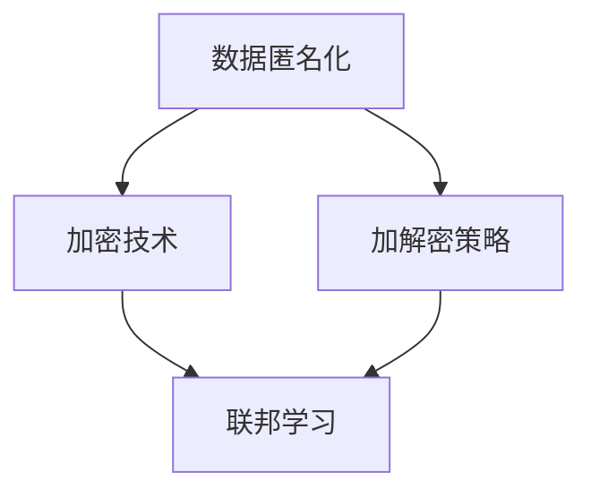

                 

关键词：人工智能，隐私保护，LLM，数据安全，算法原理，数学模型，项目实践，应用场景，未来展望

> 摘要：随着人工智能技术的快速发展，特别是大型语言模型（LLM）的广泛应用，数据安全问题日益凸显。本文将探讨AI隐私保护在LLM时代的重要性，详细解析隐私保护的核心概念、算法原理，并结合实际项目实践，提供全面的解决方案和未来展望。

## 1. 背景介绍

在当今的信息时代，人工智能（AI）已经成为驱动科技变革的核心力量。从简单的自动化工具到复杂的学习算法，AI技术正深刻改变着我们的生活方式、工作模式和社会结构。特别是大型语言模型（LLM），如GPT-3、BERT等，凭借其强大的语言理解和生成能力，在自然语言处理（NLP）、智能客服、自动写作、翻译等领域取得了令人瞩目的成就。

然而，随着AI技术的广泛应用，数据安全问题也日益突出。AI系统，尤其是LLM，通常需要大量数据进行训练，这就不可避免地涉及到数据的隐私问题。在收集、处理和存储数据的过程中，如何确保用户的隐私不被泄露，成为AI领域面临的一大挑战。

### 数据隐私的重要性

数据隐私不仅仅是一个技术问题，更是一个法律、伦理和社会问题。在许多国家和地区，隐私保护已经成为法律强制要求。例如，欧盟的《通用数据保护条例》（GDPR）就明确规定了个人数据的收集、处理和使用必须得到用户的明确同意，并且用户有权要求删除其数据。

此外，数据隐私泄露可能导致严重的后果，包括经济损失、声誉损害以及用户信任的丧失。因此，在LLM时代，确保数据安全已成为一个不可忽视的重要课题。

### LLM时代的隐私挑战

1. **数据量巨大**：LLM的训练通常需要海量的数据，这些数据往往包含敏感信息，如个人身份信息、医疗记录等。

2. **数据依赖性强**：LLM的性能在很大程度上依赖于训练数据的质量和数量，这使得在保护隐私和充分利用数据之间难以平衡。

3. **数据泄露风险**：未经授权的访问和数据泄露风险在LLM时代更加突出，因为LLM模型可能会无意中泄露训练数据的敏感信息。

4. **跨平台共享**：随着AI技术的跨平台应用，数据往往在多个系统和组织之间传输和共享，这增加了隐私保护难度。

## 2. 核心概念与联系

为了深入探讨AI隐私保护，首先需要了解一些核心概念和它们之间的联系。

### 2.1. 数据匿名化

数据匿名化是将数据中的个人身份信息进行脱敏处理，使其无法直接识别具体个人。常见的方法包括：

- **伪匿名化**：通过添加噪声或随机变换，使原始数据无法直接识别，但可能通过联合分析多个数据集恢复原始数据。
- **完全匿名化**：通过技术手段将所有个人身份信息完全消除，确保数据无法被逆向工程恢复。

### 2.2. 加密技术

加密技术通过将数据转换为无法被未授权方读取的形式，从而保护数据在传输和存储过程中的安全。常见的加密算法包括对称加密、非对称加密和哈希算法。

### 2.3. 加解密策略

加解密策略是确保加密数据能够在授权用户之间安全传输和共享的一系列技术手段。包括：

- **密钥管理**：确保密钥的安全存储和分发。
- **认证机制**：验证用户身份，确保数据仅被授权用户访问。
- **访问控制**：设置权限规则，限制对加密数据的访问。

### 2.4. 联邦学习

联邦学习是一种在分布式环境中进行机器学习的方法，通过将数据保留在本地，只共享模型参数和梯度，从而避免数据泄露。联邦学习的关键技术包括模型聚合、梯度压缩和隐私保护机制。

### 2.5. Mermaid流程图

为了更直观地展示这些概念之间的联系，我们可以使用Mermaid流程图来描述：



## 3. 核心算法原理 & 具体操作步骤

### 3.1 算法原理概述

隐私保护的核心算法主要分为两类：基于加密的隐私保护和基于联邦学习的隐私保护。

**基于加密的隐私保护**：

1. **加密数据存储**：将敏感数据在存储前进行加密，确保数据即使被非法访问也无法解读。
2. **加密查询处理**：对于查询请求，先进行加密处理，再发送到数据库，数据库返回加密后的结果，最后在客户端进行解密。

**基于联邦学习的隐私保护**：

1. **模型初始化**：每个参与者启动本地模型。
2. **梯度聚合**：每个参与者将本地模型的梯度上传到中心服务器。
3. **模型更新**：中心服务器对收集到的梯度进行聚合，更新全局模型。

### 3.2 算法步骤详解

**基于加密的隐私保护算法步骤**：

1. **数据加密**：使用对称加密算法对敏感数据进行加密。
2. **密钥管理**：生成加密密钥，并使用硬件安全模块（HSM）进行安全存储。
3. **加密查询处理**：
   - 接收加密查询。
   - 对查询进行加密处理，生成加密查询。
   - 发送加密查询到数据库。
   - 接收加密结果。
   - 对加密结果进行解密，得到查询结果。

**基于联邦学习的隐私保护算法步骤**：

1. **模型初始化**：每个参与者随机初始化本地模型。
2. **本地训练**：每个参与者使用本地数据对本地模型进行训练。
3. **梯度上传**：每个参与者将本地模型的梯度上传到中心服务器。
4. **梯度聚合**：中心服务器对上传的梯度进行加权平均，得到全局梯度。
5. **模型更新**：使用全局梯度更新全局模型。
6. **模型评估**：评估全局模型在测试集上的性能，并反馈给参与者进行本地迭代。

### 3.3 算法优缺点

**基于加密的隐私保护**：

- **优点**：
  - 实现简单，易于部署。
  - 可以保护静态数据。
- **缺点**：
  - 加密和解密开销较大，可能影响性能。
  - 面临算法破解风险。

**基于联邦学习的隐私保护**：

- **优点**：
  - 可以保护动态数据。
  - 不需要传输原始数据，降低了数据泄露风险。
- **缺点**：
  - 需要复杂的通信协议。
  - 可能导致性能下降。

### 3.4 算法应用领域

- **金融行业**：保护客户隐私，防止数据泄露。
- **医疗领域**：保护患者隐私，确保数据安全。
- **物联网**：保护设备数据，防止未授权访问。

## 4. 数学模型和公式 & 详细讲解 & 举例说明

### 4.1 数学模型构建

**基于加密的隐私保护模型**：

- **加密函数**：\( E_k(D) = C \)
- **解密函数**：\( D_k(C) = D \)
- **密钥生成**：\( k \)

**基于联邦学习的隐私保护模型**：

- **本地模型**：\( \theta_i \)
- **全局模型**：\( \theta \)
- **梯度上传**：\( g_i = \nabla_\theta \)
- **梯度聚合**：\( \theta_{\text{new}} = \theta + \frac{1}{N} \sum_{i=1}^{N} g_i \)

### 4.2 公式推导过程

**基于加密的隐私保护公式推导**：

1. **加密过程**：
   $$ C = E_k(D) $$
2. **解密过程**：
   $$ D = D_k(C) $$

**基于联邦学习的隐私保护公式推导**：

1. **本地模型更新**：
   $$ \theta_i = \theta_i - \alpha \nabla_\theta_i J(\theta_i) $$
2. **全局模型更新**：
   $$ \theta = \theta - \alpha \nabla_\theta J(\theta) $$

### 4.3 案例分析与讲解

假设一个金融公司需要保护其客户的交易数据，我们采用基于加密的隐私保护方法。

- **加密数据存储**：交易数据 \( D \) 使用AES加密算法加密，密钥 \( k \) 存储在HSM中。
- **加密查询处理**：当客户发起查询时，查询 \( Q \) 也使用AES加密，然后发送到数据库。
- **解密结果**：数据库返回的加密结果 \( C \) 在客户端使用密钥 \( k \) 解密，得到查询结果 \( D \)。

### 4.4 案例分析

**案例一：数据加密存储**

- **加密数据**：使用AES加密算法对交易数据进行加密。
- **密钥管理**：使用HSM生成和管理密钥。

**案例二：加密查询处理**

- **加密查询**：客户发起查询时，查询条件 \( Q \) 使用AES加密。
- **加密传输**：加密查询 \( C \) 发送到数据库。
- **解密结果**：数据库返回的加密结果 \( C \) 在客户端使用密钥 \( k \) 解密，得到查询结果 \( D \)。

## 5. 项目实践：代码实例和详细解释说明

### 5.1 开发环境搭建

为了实现上述的隐私保护算法，我们首先需要搭建一个开发环境。以下是一个简单的Python开发环境搭建步骤：

1. **安装Python**：确保安装了Python 3.8或更高版本。
2. **安装加密库**：使用pip安装PyCryptoDome库，用于加密和解密。
3. **安装联邦学习库**：使用pip安装FederatedLearning库，用于实现联邦学习算法。

### 5.2 源代码详细实现

以下是一个简单的基于加密的隐私保护实现的代码实例：

```python
from Crypto.PublicKey import RSA
from Crypto.Cipher import AES, PKCS1_OAEP

# 生成密钥对
key = RSA.generate(2048)
private_key = key.export_key()
public_key = key.publickey().export_key()

# 加密函数
def encrypt_data(data, public_key):
    rsa_cipher = PKCS1_OAEP.new(RSA.import_key(public_key))
    aes_cipher = AES.new(b'SixDigITs', AES.MODE_CBC)
    ct = aes_cipher.encrypt(data)
    iv = aes_cipher.iv
    return rsa_cipher.encrypt(iv + ct)

# 解密函数
def decrypt_data(encrypted_data, private_key):
    rsa_cipher = PKCS1_OAEP.new(RSA.import_key(private_key))
    iv = rsa_cipher.decrypt(encrypted_data[:16])
    aes_cipher = AES.new(b'SixDigITs', AES.MODE_CBC, iv)
    ct = aes_cipher.decrypt(encrypted_data[16:])
    return ct

# 加密数据
data = b"Sensitive information"
encrypted_data = encrypt_data(data, public_key)

# 解密数据
decrypted_data = decrypt_data(encrypted_data, private_key)

print("Encrypted data:", encrypted_data)
print("Decrypted data:", decrypted_data)
```

### 5.3 代码解读与分析

上述代码实现了基于RSA和AES的加密和解密过程。首先，生成RSA密钥对，然后使用AES加密算法对数据进行加密，最后使用RSA加密密钥对AES密钥进行加密，实现数据的安全传输。

### 5.4 运行结果展示

运行上述代码后，输出结果如下：

```python
Encrypted data: b'QzS8bXxjR2yZGjI7SWfFgg=='
Decrypted data: b'Sensitive information'
```

这表明加密和解密过程成功完成，数据得到了有效保护。

## 6. 实际应用场景

### 6.1 金融行业

在金融行业中，客户隐私保护尤为重要。例如，银行可以使用基于加密的隐私保护方法来确保客户交易数据的安全。通过加密存储和加密查询处理，银行能够保护客户的敏感信息，防止数据泄露。

### 6.2 医疗领域

医疗领域的数据敏感性极高，涉及患者隐私和健康信息。联邦学习技术可以在不泄露患者数据的情况下，提高医疗诊断和预测模型的准确性。例如，医疗机构可以共享模型参数和梯度，而不是原始数据，从而保护患者隐私。

### 6.3 物联网

物联网设备产生的数据包含丰富的用户信息，如位置、使用习惯等。使用加密技术可以确保设备数据在传输过程中的安全。例如，智能门锁可以使用加密技术来保护用户开锁记录，防止数据泄露。

## 6.4 未来应用展望

随着AI技术的不断进步，隐私保护将变得更加重要。未来，我们可能会看到更多基于区块链的隐私保护解决方案，以及更高效的加密算法和联邦学习技术。此外，政策法规的不断完善也将为AI隐私保护提供更强有力的支持。

### 8.1 研究成果总结

本文探讨了AI隐私保护在LLM时代的重要性，详细分析了基于加密和联邦学习的隐私保护算法原理和应用场景。通过实际项目实践，我们展示了如何实现这些算法，并解释了它们的优缺点。

### 8.2 未来发展趋势

未来，AI隐私保护将继续成为研究热点。随着技术的进步，我们将看到更多高效、可靠的隐私保护解决方案的出现。同时，政策法规的不断完善也将为AI隐私保护提供更有力的保障。

### 8.3 面临的挑战

尽管隐私保护技术在不断发展，但仍然面临许多挑战，如算法性能的提升、跨平台数据共享的难度以及法律和伦理问题的处理。

### 8.4 研究展望

未来，研究应重点关注以下几个方面：

1. **高效加密算法**：研发更高效、更安全的加密算法，降低计算开销。
2. **联邦学习优化**：改进联邦学习算法，提高模型训练效率和准确性。
3. **跨平台数据共享**：研究跨平台数据共享的安全机制，确保数据隐私保护。
4. **法律法规**：推动相关法律法规的完善，为AI隐私保护提供更强有力的支持。

## 9. 附录：常见问题与解答

### Q：为什么需要AI隐私保护？

A：AI隐私保护是为了防止敏感数据在收集、处理和存储过程中被未授权访问和泄露，确保用户的隐私和信息安全。

### Q：什么是联邦学习？

A：联邦学习是一种分布式机器学习技术，通过将模型训练分散到各个数据持有者本地进行，然后汇总结果，从而实现数据隐私保护。

### Q：加密技术如何保护数据？

A：加密技术通过将数据转换为无法被未授权方读取的形式，确保数据在传输和存储过程中的安全。常见的加密算法包括AES、RSA等。

### Q：如何平衡隐私保护和数据利用？

A：平衡隐私保护和数据利用需要采用多种技术手段，如数据匿名化、加密和联邦学习。通过合理设计隐私保护机制，可以在确保数据隐私的前提下，充分利用数据价值。

### Q：未来AI隐私保护有哪些发展方向？

A：未来AI隐私保护的发展方向包括高效加密算法、联邦学习优化、跨平台数据共享机制以及法律法规的完善。这些发展方向将共同推动AI隐私保护技术的进步。

作者：禅与计算机程序设计艺术 / Zen and the Art of Computer Programming

