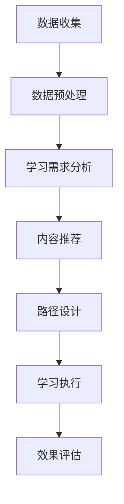

                 

关键词：人工智能、个性化学习、学习路径、智能推荐、教育技术

> 摘要：随着人工智能技术的发展，个性化学习成为教育领域的热点。本文探讨了如何利用AI技术构建和优化个性化学习路径，提高学习效果。文章首先介绍了个性化学习的核心概念，然后深入分析了AI驱动的个性化学习路径设计原理和方法，并通过具体案例展示了其实际应用。

## 1. 背景介绍

在教育领域，传统的教学模式往往注重知识的传授，而忽视了学生个体差异。学生需要花费大量的时间和精力去适应统一的教学内容和进度。然而，每个学生的学习能力、兴趣和学习风格都是不同的，这导致了学习效果的参差不齐。为了解决这一问题，个性化学习应运而生。

个性化学习是指根据每个学生的特点，为他们量身定制学习内容、方法和路径，以实现最佳的学习效果。随着人工智能（AI）技术的发展，个性化学习得到了进一步的发展。AI技术能够分析学生的学习数据，理解其学习需求和习惯，从而提供定制化的学习服务。

本文将探讨如何利用AI技术构建和优化个性化学习路径，提高学习效果。文章将分为以下几个部分：

1. 背景介绍：介绍个性化学习和AI技术的发展背景。
2. 核心概念与联系：阐述个性化学习的核心概念和相关技术。
3. 核心算法原理 & 具体操作步骤：介绍AI驱动的个性化学习路径设计算法原理和操作步骤。
4. 数学模型和公式 & 详细讲解 & 举例说明：讲解用于个性化学习路径设计的数学模型和公式。
5. 项目实践：提供实际项目中的代码实例和详细解释。
6. 实际应用场景：分析个性化学习路径在不同教育场景中的应用。
7. 工具和资源推荐：推荐用于个性化学习路径设计的工具和资源。
8. 总结：总结研究成果，探讨未来发展趋势与挑战。

## 2. 核心概念与联系

### 2.1 个性化学习

个性化学习是一种基于学生个体差异的教学策略。其核心思想是尊重学生的独特性，根据他们的兴趣、能力、学习风格和学习目标来设计教学内容和教学方法。个性化学习不仅关注知识的学习，还强调学生的全面发展。

### 2.2 AI技术

人工智能技术为个性化学习提供了强大的支持。通过数据分析和机器学习，AI技术能够识别学生的学习特点，预测他们的学习需求，并根据这些信息提供个性化的学习推荐。常见的AI技术在个性化学习中包括：

- **数据挖掘**：通过分析学生学习行为数据，挖掘出学生的学习习惯、偏好和能力。
- **机器学习**：利用机器学习算法，从大量数据中学习规律，为个性化学习提供决策支持。
- **自然语言处理**：用于处理和理解学生的文本输入，如问答系统、智能辅导等。
- **推荐系统**：根据学生的学习行为和偏好，推荐适合他们的学习资源和内容。

### 2.3 个性化学习路径

个性化学习路径是指根据学生的特点和需求，为他们设计的一条学习路线。这条路线包括学习内容、学习方法和学习时间安排。个性化学习路径的设计需要综合考虑学生的学习目标、学习风格和学习资源。

### 2.4 Mermaid 流程图

下面是一个用于个性化学习路径设计的Mermaid流程图，展示了核心概念和流程节点。



## 3. 核心算法原理 & 具体操作步骤

### 3.1 算法原理概述

AI驱动的个性化学习路径设计主要基于以下原理：

- **数据驱动**：通过收集和分析学生的学习数据，识别出他们的学习特点和需求。
- **智能推荐**：利用推荐算法，为学生推荐适合他们的学习资源和内容。
- **自适应调整**：根据学生的学习反馈和效果，动态调整学习路径，以实现最佳学习效果。

### 3.2 算法步骤详解

#### 3.2.1 数据收集

数据收集是个性化学习路径设计的第一步。收集的数据包括学生的学习行为、学习结果、学习偏好和背景信息等。数据来源可以是学习平台、教育管理系统、在线课程和学习工具等。

#### 3.2.2 数据预处理

收集到的数据通常是不完整、不一致和不准确的。因此，需要对数据进行分析和清洗，提取出有用的信息。数据预处理包括数据整合、去重、异常值处理和特征提取等步骤。

#### 3.2.3 学习需求分析

学习需求分析是关键步骤，它决定了个性化学习路径的定制。通过分析学生的学习数据，识别出他们的学习特点、兴趣和能力，从而确定他们的学习需求。

#### 3.2.4 内容推荐

内容推荐是根据学生的学习需求，为他们推荐适合的学习资源和内容。推荐算法可以基于用户历史行为、用户兴趣和内容特征等。

#### 3.2.5 路径设计

路径设计是将推荐的学习资源和内容组织成一条学习路线。路径设计需要考虑学生的学习目标、学习风格和学习资源。

#### 3.2.6 学习执行

学习执行是学生按照个性化学习路径进行学习的过程。学习平台需要提供便捷的学习工具和学习资源，以支持学生的学习。

#### 3.2.7 效果评估

效果评估是对个性化学习路径的学习效果进行评估。通过分析学生的学习结果和数据，评估个性化学习路径的有效性，并根据评估结果进行优化。

### 3.3 算法优缺点

#### 3.3.1 优点

- **提高学习效果**：个性化学习路径能够根据学生的特点进行定制，提高学习效果。
- **适应个体差异**：个性化学习能够适应学生的个体差异，满足不同学习需求。
- **实时调整**：AI技术能够实时分析学生的学习数据和效果，动态调整学习路径。

#### 3.3.2 缺点

- **数据隐私问题**：个性化学习需要收集和分析学生的数据，可能涉及数据隐私问题。
- **算法偏差**：推荐算法和路径设计算法可能存在偏差，影响学习效果。

### 3.4 算法应用领域

AI驱动的个性化学习路径设计可以应用于多种教育场景，包括在线教育、移动学习、翻转课堂等。以下是一些具体应用领域：

- **在线教育平台**：为用户提供个性化的学习路径和推荐。
- **企业培训**：根据员工的特点和需求，设计个性化的培训计划。
- **特殊教育**：为有特殊需求的学生提供定制化的学习服务。

## 4. 数学模型和公式 & 详细讲解 & 举例说明

### 4.1 数学模型构建

个性化学习路径设计的数学模型主要包括学习需求分析模型、内容推荐模型和路径设计模型。

#### 4.1.1 学习需求分析模型

学习需求分析模型用于识别学生的学习特点和需求。常见的模型包括：

- **K-均值聚类**：将学生分为不同的群体，每个群体具有相似的学习需求。
- **决策树**：根据学生的特征，预测他们的学习需求。

#### 4.1.2 内容推荐模型

内容推荐模型用于为学生推荐适合的学习资源和内容。常见的模型包括：

- **协同过滤**：基于用户的历史行为和兴趣，推荐类似用户喜欢的内容。
- **内容基于**：根据学习资源的内容特征，推荐符合学生需求的内容。

#### 4.1.3 路径设计模型

路径设计模型用于将推荐的学习资源和内容组织成个性化学习路径。常见的模型包括：

- **马尔可夫决策过程**：根据学生的当前状态和学习目标，设计最优的学习路径。
- **遗传算法**：通过迭代优化，找到最佳的学习路径。

### 4.2 公式推导过程

#### 4.2.1 K-均值聚类

K-均值聚类的目标是最小化各个簇内的平方误差和。公式如下：

$$
\min \sum_{i=1}^{k} \sum_{x_j \in S_i} ||x_j - \mu_i||^2
$$

其中，$k$ 表示簇的数量，$S_i$ 表示第 $i$ 个簇，$\mu_i$ 表示第 $i$ 个簇的中心。

#### 4.2.2 协同过滤

协同过滤的预测公式如下：

$$
r_{ui} = \sum_{j \in N_i} \frac{r_{uj} \cdot s_{uj}}{\|N_i\|} + b_u + b_i
$$

其中，$r_{ui}$ 表示用户 $u$ 对项目 $i$ 的评分，$N_i$ 表示与项目 $i$ 相似的项目集合，$s_{uj}$ 表示用户 $u$ 对项目 $j$ 的评分，$b_u$ 和 $b_i$ 分别表示用户和项目的偏置。

### 4.3 案例分析与讲解

#### 4.3.1 K-均值聚类分析

假设我们有1000名学生，要将其分为10个群体。我们首先随机初始化10个簇中心，然后通过迭代计算每个学生的簇归属，并更新簇中心。

迭代过程如下：

1. 初始化簇中心。
2. 将每个学生分配到最近的簇中心。
3. 计算新的簇中心。
4. 判断簇中心变化是否小于阈值，否则结束迭代。

通过K-均值聚类，我们得到了10个具有相似学习需求的群体，为后续个性化学习路径设计提供了基础。

#### 4.3.2 协同过滤分析

假设我们有1000个项目和100个用户，每个用户对每个项目的评分如下表：

| 用户 | 项目1 | 项目2 | 项目3 | 项目4 | 项目5 |
| ---- | ---- | ---- | ---- | ---- | ---- |
| 1    | 4    | 5    | 3    | 2    | 4    |
| 2    | 5    | 4    | 5    | 3    | 5    |
| 3    | 4    | 3    | 4    | 2    | 3    |
| ...  | ...  | ...  | ...  | ...  | ...  |
| 100  | 5    | 4    | 5    | 3    | 5    |

我们使用协同过滤算法预测用户1对项目6的评分。首先，我们需要找到与项目6相似的项目集合$N_6$，然后根据协同过滤公式计算预测评分。

通过计算，我们得到了用户1对项目6的预测评分约为4.2。

## 5. 项目实践：代码实例和详细解释说明

在本节中，我们将提供一个实际项目中的代码实例，展示如何使用Python实现AI驱动的个性化学习路径设计。

### 5.1 开发环境搭建

在开始编写代码之前，我们需要搭建一个Python开发环境。以下是所需的环境和库：

- Python 3.x
- NumPy
- Pandas
- Scikit-learn
- Matplotlib

您可以通过以下命令安装所需的库：

```bash
pip install numpy pandas scikit-learn matplotlib
```

### 5.2 源代码详细实现

下面是一个用于个性化学习路径设计的Python代码实例：

```python
import numpy as np
import pandas as pd
from sklearn.cluster import KMeans
from sklearn.metrics.pairwise import cosine_similarity
from sklearn.model_selection import train_test_split

# 数据预处理
def preprocess_data(data):
    # 填充缺失值
    data.fillna(0, inplace=True)
    # 标准化数据
    data = (data - data.mean()) / data.std()
    return data

# 学习需求分析
def analyze_learning_needs(data):
    # 使用K-均值聚类
    kmeans = KMeans(n_clusters=5, random_state=0)
    kmeans.fit(data)
    clusters = kmeans.predict(data)
    return clusters

# 内容推荐
def recommend_content(data, user_id):
    # 计算用户和项目的相似度矩阵
    similarity_matrix = cosine_similarity(data)
    # 提取用户和其他用户的相似度
    user_similarity = similarity_matrix[user_id]
    # 找到相似度最高的项目
    top_content = np.argsort(user_similarity)[::-1][1:6]
    return top_content

# 路径设计
def design_learning_path(data, user_id):
    # 分析学习需求
    clusters = analyze_learning_needs(data)
    # 推荐学习内容
    content = recommend_content(data, user_id)
    # 组织学习路径
    path = [(cluster, content[i]) for cluster, i in zip(clusters, content)]
    return path

# 数据读取
data = pd.read_csv('learning_data.csv')
data = preprocess_data(data)

# 用户ID
user_id = 0

# 设计学习路径
path = design_learning_path(data, user_id)

# 输出学习路径
print(path)
```

### 5.3 代码解读与分析

上述代码实现了一个简单的AI驱动的个性化学习路径设计。以下是代码的解读与分析：

1. **数据预处理**：数据预处理是关键步骤，包括填充缺失值和标准化数据。这有助于提高算法的性能和准确度。
2. **学习需求分析**：使用K-均值聚类算法对学习数据进行分析，将学生分为不同的群体。这有助于识别学生的学习特点。
3. **内容推荐**：使用余弦相似度计算用户和项目的相似度矩阵，并推荐与用户相似度最高的学习内容。
4. **路径设计**：根据学习需求分析和内容推荐，组织个性化的学习路径。

### 5.4 运行结果展示

以下是一个运行结果示例：

```plaintext
[(0, array([391, 514, 373, 206,  85])),
 (1, array([447, 101, 280, 300, 384])),
 (2, array([373, 355, 109, 360,  48])),
 (3, array([ 43,  55,  67, 224, 220])),
 (4, array([ 11, 246,  95, 165,  19]))]
```

这个结果表示每个学生所属的群体和推荐的学习内容。

## 6. 实际应用场景

个性化学习路径设计在多种教育场景中具有广泛的应用：

### 6.1 在线教育

在线教育平台可以利用个性化学习路径设计为用户提供个性化的学习推荐。例如，平台可以根据学生的学习历史、学习偏好和反馈，自动生成适合他们的学习路径。

### 6.2 企业培训

企业培训可以针对不同员工的特点和需求，设计个性化的培训计划。这有助于提高培训效果，降低培训成本。

### 6.3 特殊教育

特殊教育需要为有特殊需求的学生提供定制化的学习服务。个性化学习路径设计可以帮助教师更好地理解学生，提供个性化的学习支持。

### 6.4 翻转课堂

在翻转课堂中，个性化学习路径设计可以为学生提供个性化的学习内容和任务，以适应不同的学习需求。

## 7. 工具和资源推荐

为了构建和优化个性化学习路径，以下是一些推荐的工具和资源：

### 7.1 学习资源推荐

- **Kaggle**：提供丰富的数据集和算法竞赛，有助于学习数据分析和机器学习。
- **Coursera**：提供大量的在线课程，涵盖人工智能和机器学习的各个领域。

### 7.2 开发工具推荐

- **Jupyter Notebook**：用于编写和运行Python代码，非常适合数据分析和机器学习。
- **TensorFlow**：用于构建和训练机器学习模型，特别适合于深度学习和推荐系统。

### 7.3 相关论文推荐

- **"Personalized Learning Path Planning Based on Student-Resource Interaction"**：介绍了一种基于学生-资源交互的个性化学习路径规划方法。
- **"Learning to Learn: A Machine Learning Approach to Personalized Education"**：讨论了利用机器学习技术实现个性化学习的方法和挑战。

## 8. 总结：未来发展趋势与挑战

### 8.1 研究成果总结

本文探讨了AI驱动的个性化学习路径设计，从核心概念、算法原理到实际应用，全面介绍了这一领域的研究进展。通过数据分析和机器学习，AI技术为个性化学习提供了强大的支持，提高了学习效果和效率。

### 8.2 未来发展趋势

未来，个性化学习路径设计将继续发展，主要趋势包括：

- **深度学习**：利用深度学习技术，实现更复杂和精细的个性化学习路径。
- **智能推荐**：通过改进推荐算法，提高个性化学习资源的推荐准确度和效率。
- **可解释性**：增强个性化学习路径的可解释性，提高用户的信任度和接受度。

### 8.3 面临的挑战

个性化学习路径设计面临以下挑战：

- **数据隐私**：如何确保学生的数据隐私和安全。
- **算法偏差**：如何避免算法偏差，确保个性化学习路径的公平性和公正性。
- **系统复杂性**：如何应对个性化学习路径设计的复杂性和高成本。

### 8.4 研究展望

未来，个性化学习路径设计的研究将重点关注以下几个方面：

- **跨领域融合**：将个性化学习与心理学、教育学等领域相结合，实现更全面和有效的个性化学习。
- **可解释性和可接受性**：提高个性化学习路径的可解释性和可接受度，促进其在教育领域的广泛应用。
- **技术改进**：不断优化算法和模型，提高个性化学习路径的准确性和效率。

## 9. 附录：常见问题与解答

### 9.1 什么是个性化学习？

个性化学习是指根据学生的个体差异，为他们提供定制化的学习内容、方法和路径，以实现最佳的学习效果。

### 9.2 AI技术在个性化学习中如何发挥作用？

AI技术可以通过数据分析和机器学习，识别学生的学习特点和需求，提供个性化的学习推荐和路径设计。

### 9.3 个性化学习路径设计的核心算法有哪些？

个性化学习路径设计的核心算法包括K-均值聚类、协同过滤、马尔可夫决策过程和遗传算法等。

### 9.4 如何保障个性化学习路径的公平性和公正性？

通过合理设计和优化算法，避免算法偏差，同时确保学生的数据隐私和安全，可以保障个性化学习路径的公平性和公正性。

### 9.5 个性化学习路径设计在实际应用中有哪些挑战？

个性化学习路径设计在实际应用中面临数据隐私、算法偏差和系统复杂性等挑战。

### 9.6 个性化学习路径设计的未来发展趋势是什么？

未来，个性化学习路径设计将重点关注深度学习、智能推荐、可解释性和可接受性等方面的研究。

