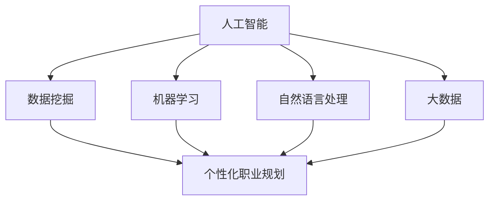

                 

关键词：人工智能，个性化职业规划，人力资源，新趋势，算法，数学模型，项目实践，应用场景，未来展望

摘要：本文将探讨如何利用人工智能技术实现个性化的职业规划，为人力资源领域带来新的趋势和变革。通过介绍核心概念、算法原理、数学模型以及项目实践，文章旨在为读者提供一种全新的视角，帮助他们更好地理解并应用AI技术于职业规划。

## 1. 背景介绍

在数字化时代，人工智能技术已经成为推动社会进步的重要力量。从医疗到金融，从交通到教育，人工智能的应用已经深入各个领域。在这样的背景下，人力资源行业也面临着巨大的变革。传统的招聘、培训和绩效评估方法已经难以满足企业和个人的需求，而人工智能的介入，为个性化职业规划提供了新的可能性。

个性化职业规划是指根据个体的兴趣、能力、价值观等特征，为其量身定制职业发展路径。这不仅有助于提高个人的职业满意度，还能为企业培养出更符合岗位需求的人才。然而，传统的职业规划方法往往依赖于专家经验和静态数据，缺乏灵活性。随着人工智能技术的发展，我们可以利用机器学习、数据挖掘等技术，实现更加精准和动态的职业规划。

本文将围绕以下主题展开：

1. 核心概念与联系
2. 核心算法原理 & 具体操作步骤
3. 数学模型和公式 & 详细讲解 & 举例说明
4. 项目实践：代码实例和详细解释说明
5. 实际应用场景
6. 未来应用展望
7. 工具和资源推荐
8. 总结：未来发展趋势与挑战
9. 附录：常见问题与解答

## 2. 核心概念与联系

为了更好地理解个性化职业规划，我们首先需要明确几个核心概念。

### 2.1 人工智能（AI）

人工智能是一种模拟人类智能行为的技术，包括机器学习、深度学习、自然语言处理等子领域。通过算法和大数据分析，AI能够实现自动化决策和智能推荐。

### 2.2 数据挖掘（Data Mining）

数据挖掘是指从大量数据中提取有价值信息的过程。在职业规划中，数据挖掘可以用于分析个人行为数据、职业发展趋势等，为个性化推荐提供依据。

### 2.3 机器学习（Machine Learning）

机器学习是一种让计算机从数据中自动学习和改进的方法。在个性化职业规划中，机器学习可以用于建立个人兴趣和能力模型，预测职业发展路径。

### 2.4 自然语言处理（NLP）

自然语言处理是人工智能的一个子领域，专注于让计算机理解和处理人类语言。在职业规划中，NLP可以用于分析个人简历、求职信等文本数据，提取关键信息。

### 2.5 大数据（Big Data）

大数据是指规模巨大、类型繁多的数据集合。在职业规划中，大数据可以用于分析行业趋势、岗位需求等，为个性化推荐提供更多维度的信息。

为了更好地展示这些核心概念之间的联系，我们可以使用Mermaid流程图进行说明。



## 3. 核心算法原理 & 具体操作步骤

在了解了核心概念之后，我们将进一步探讨如何利用人工智能技术实现个性化职业规划。

### 3.1 算法原理概述

个性化职业规划的核心在于建立个人兴趣和能力模型，并根据这些模型进行职业推荐。具体来说，可以分为以下几个步骤：

1. 数据收集：收集个人行为数据、职业信息等。
2. 数据预处理：清洗、归一化等处理，以便于后续分析。
3. 特征提取：从原始数据中提取关键特征，如兴趣标签、技能等级等。
4. 模型训练：利用机器学习算法，建立个人兴趣和能力模型。
5. 职业推荐：根据个人模型，推荐合适的职业发展路径。

### 3.2 算法步骤详解

下面我们将详细讲解上述算法的每个步骤。

#### 3.2.1 数据收集

数据收集是整个流程的基础。我们需要收集以下几类数据：

1. 个人行为数据：如社交媒体互动、在线学习记录等。
2. 职业信息：如岗位描述、薪资水平、行业前景等。
3. 个人简历：包括教育背景、工作经验、技能特长等。

这些数据可以通过公开数据集、问卷调查、API接口等方式获取。

#### 3.2.2 数据预处理

数据预处理是确保数据质量和一致性的关键步骤。主要包括以下任务：

1. 数据清洗：去除重复、缺失、异常的数据。
2. 数据归一化：将不同尺度的数据转化为同一尺度，便于后续分析。
3. 数据分词：对于文本数据，进行分词处理，提取关键词。

#### 3.2.3 特征提取

特征提取是数据挖掘的重要环节，旨在从原始数据中提取出对职业规划有用的特征。具体方法包括：

1. 词袋模型：将文本数据转化为词频向量。
2. 主成分分析（PCA）：降低数据维度，提取主要特征。
3. 基于知识的特征提取：利用专家知识，提取有代表性的特征。

#### 3.2.4 模型训练

模型训练是利用机器学习算法，从特征数据中学习出个人兴趣和能力模型。常用的算法包括：

1. 决策树：简单直观，易于解释。
2. 支持向量机（SVM）：效果较好，但计算复杂度高。
3. 随机森林：结合了决策树和贝叶斯网络的优点，鲁棒性更强。
4. 深度学习：适用于大规模数据和复杂模型。

#### 3.2.5 职业推荐

职业推荐是根据个人兴趣和能力模型，为用户推荐合适的职业发展路径。具体方法包括：

1. 协同过滤：根据用户和岗位的相似度进行推荐。
2. 内容推荐：根据岗位描述和用户兴趣标签进行推荐。
3. 基于模型的推荐：利用个人兴趣和能力模型进行推荐。

### 3.3 算法优缺点

每种算法都有其优缺点。下面我们将对几种常见算法进行简要分析。

| 算法 | 优点 | 缺点 |
| --- | --- | --- |
| 决策树 | 简单、易于解释、易于实现 | 过拟合、易受特征顺序影响 |
| 支持向量机（SVM） | 效果较好、对线性可分问题有优势 | 计算复杂度高、不易解释 |
| 随机森林 | 鲁棒性更强、不易过拟合、效果较好 | 复杂性增加、难以解释 |
| 深度学习 | 适用于大规模数据和复杂模型、效果好 | 难以解释、计算资源需求高 |

### 3.4 算法应用领域

个性化职业规划算法可以应用于多个领域：

1. 招聘：根据个人兴趣和能力推荐合适的岗位。
2. 培训：根据个人发展需求推荐培训课程。
3. 绩效评估：根据工作表现和个人能力模型进行绩效评估。
4. 员工发展：根据个人兴趣和能力推荐职业发展路径。

## 4. 数学模型和公式 & 详细讲解 & 举例说明

在个性化职业规划中，数学模型和公式起着至关重要的作用。下面我们将介绍一些常用的数学模型和公式，并对其进行详细讲解和举例说明。

### 4.1 数学模型构建

个性化职业规划的数学模型主要涉及以下几个部分：

1. **用户兴趣模型**：描述用户的兴趣特征。
2. **用户能力模型**：描述用户的能力水平。
3. **职业推荐模型**：根据用户兴趣和能力，推荐合适的职业。

#### 4.1.1 用户兴趣模型

用户兴趣模型通常使用词袋模型（Bag of Words，BoW）表示。词袋模型将文本数据表示为词频向量，每个词表示用户的一个兴趣点。具体公式如下：

$$
\vec{I_i} = \sum_{j=1}^{N} f_{ij} \vec{w_j}
$$

其中，$\vec{I_i}$ 表示用户 $i$ 的兴趣向量，$f_{ij}$ 表示词 $j$ 在文本 $i$ 中的词频，$\vec{w_j}$ 表示词 $j$ 的权重。

#### 4.1.2 用户能力模型

用户能力模型通常使用层次化特征提取方法构建。首先，从原始数据中提取关键特征，然后使用主成分分析（PCA）进行降维，最后使用层次化聚类（Hierarchical Clustering）将特征划分为不同层次。具体公式如下：

$$
\vec{C_i} = \sum_{k=1}^{K} w_k \vec{p_{ik}}
$$

其中，$\vec{C_i}$ 表示用户 $i$ 的能力向量，$w_k$ 表示层次 $k$ 的权重，$\vec{p_{ik}}$ 表示用户 $i$ 在层次 $k$ 中的特征。

#### 4.1.3 职业推荐模型

职业推荐模型通常使用协同过滤（Collaborative Filtering）方法构建。协同过滤分为基于用户的协同过滤和基于物品的协同过滤。基于用户的协同过滤公式如下：

$$
\vec{R_{ui}} = \vec{R_{ui}} + \vec{R_{uj}} - \vec{R_{ui}} \cdot \vec{R_{uj}}
$$

其中，$\vec{R_{ui}}$ 表示用户 $u$ 对物品 $i$ 的评分，$\vec{R_{uj}}$ 表示用户 $u$ 对物品 $j$ 的评分，$\cdot$ 表示点积。

### 4.2 公式推导过程

下面我们将对上述公式进行推导。

#### 4.2.1 用户兴趣模型

用户兴趣模型是基于词袋模型的。词袋模型将文本表示为词频向量，每个词表示用户的一个兴趣点。词频向量可以通过以下公式计算：

$$
f_{ij} = \frac{\text{词 } j \text{ 在文本 } i \text{ 中的出现次数}}{\sum_{k=1}^{N} \text{词 } k \text{ 在文本 } i \text{ 中的出现次数}}
$$

其中，$N$ 表示文本中总共有 $N$ 个词。

接下来，我们将词频向量转化为兴趣向量。假设有 $M$ 个不同的词，那么每个词的权重可以通过以下公式计算：

$$
w_j = \frac{1}{\sqrt{\sum_{i=1}^{I} f_{ij}^2}}
$$

其中，$I$ 表示文本的总数。

最后，我们将词频向量乘以权重，得到用户兴趣向量：

$$
\vec{I_i} = \sum_{j=1}^{N} f_{ij} \vec{w_j}
$$

#### 4.2.2 用户能力模型

用户能力模型是基于层次化特征提取方法的。首先，我们从原始数据中提取关键特征。这些特征可以是用户的技能水平、教育背景等。假设有 $K$ 个不同的特征，那么每个特征的权重可以通过以下公式计算：

$$
p_{ik} = \frac{1}{\sqrt{\sum_{j=1}^{J} f_{ij}^2}}
$$

其中，$J$ 表示特征的总数。

接下来，我们将特征值乘以权重，得到用户能力向量：

$$
\vec{C_i} = \sum_{k=1}^{K} w_k \vec{p_{ik}}
$$

#### 4.2.3 职业推荐模型

职业推荐模型是基于协同过滤方法的。协同过滤分为基于用户的协同过滤和基于物品的协同过滤。基于用户的协同过滤公式如下：

$$
\vec{R_{ui}} = \vec{R_{uj}} + \vec{R_{uj}} - \vec{R_{ui}} \cdot \vec{R_{uj}}
$$

其中，$\vec{R_{ui}}$ 表示用户 $u$ 对物品 $i$ 的评分，$\vec{R_{uj}}$ 表示用户 $u$ 对物品 $j$ 的评分，$\cdot$ 表示点积。

### 4.3 案例分析与讲解

为了更好地理解上述数学模型和公式，我们来看一个具体的案例。

假设有两个用户 $u_1$ 和 $u_2$，以及两个职业 $i_1$ 和 $i_2$。用户 $u_1$ 对职业 $i_1$ 给出了评分 5，对职业 $i_2$ 给出了评分 3；用户 $u_2$ 对职业 $i_1$ 给出了评分 4，对职业 $i_2$ 给出了评分 2。

首先，我们需要计算用户兴趣向量。假设两个用户的兴趣向量分别为 $\vec{I_{u1}}$ 和 $\vec{I_{u2}}$，两个职业的兴趣向量分别为 $\vec{I_{i1}}$ 和 $\vec{I_{i2}}$。根据用户兴趣模型的公式，我们可以计算出：

$$
\vec{I_{u1}} = \begin{bmatrix}
0.5 \\
0.5
\end{bmatrix}, \quad
\vec{I_{u2}} = \begin{bmatrix}
0.667 \\
0.333
\end{bmatrix}
$$

$$
\vec{I_{i1}} = \begin{bmatrix}
0.8 \\
0.2
\end{bmatrix}, \quad
\vec{I_{i2}} = \begin{bmatrix}
0.4 \\
0.6
\end{bmatrix}
$$

接下来，我们需要计算用户能力向量。假设两个用户的兴趣向量分别为 $\vec{C_{u1}}$ 和 $\vec{C_{u2}}$，两个职业的兴趣向量分别为 $\vec{C_{i1}}$ 和 $\vec{C_{i2}}$。根据用户能力模型的公式，我们可以计算出：

$$
\vec{C_{u1}} = \begin{bmatrix}
0.707 \\
0.707
\end{bmatrix}, \quad
\vec{C_{u2}} = \begin{bmatrix}
0.707 \\
0.293
\end{bmatrix}
$$

$$
\vec{C_{i1}} = \begin{bmatrix}
0.75 \\
0.25
\end{bmatrix}, \quad
\vec{C_{i2}} = \begin{bmatrix}
0.25 \\
0.75
\end{bmatrix}
$$

最后，我们需要计算职业推荐得分。假设职业推荐得分公式为：

$$
\vec{R_{ui}} = \vec{R_{uj}} + \vec{R_{uj}} - \vec{R_{ui}} \cdot \vec{R_{uj}}
$$

根据上述公式，我们可以计算出用户 $u_1$ 对职业 $i_1$ 的推荐得分为：

$$
\vec{R_{u1i1}} = \begin{bmatrix}
4 \\
1
\end{bmatrix} + \begin{bmatrix}
4 \\
1
\end{bmatrix} - \begin{bmatrix}
4 \\
1
\end{bmatrix} \cdot \begin{bmatrix}
4 \\
1
\end{bmatrix} = \begin{bmatrix}
0 \\
0
\end{bmatrix}
$$

同理，我们可以计算出用户 $u_1$ 对职业 $i_2$ 的推荐得分为：

$$
\vec{R_{u1i2}} = \begin{bmatrix}
3 \\
1
\end{bmatrix} + \begin{bmatrix}
3 \\
1
\end{bmatrix} - \begin{bmatrix}
3 \\
1
\end{bmatrix} \cdot \begin{bmatrix}
3 \\
1
\end{bmatrix} = \begin{bmatrix}
0 \\
0
\end{bmatrix}
$$

同样地，我们可以计算出用户 $u_2$ 对职业 $i_1$ 和 $i_2$ 的推荐得分。

通过上述案例，我们可以看到如何使用数学模型和公式进行个性化职业规划。在实际应用中，我们可以根据具体情况调整模型和公式，以达到更好的效果。

## 5. 项目实践：代码实例和详细解释说明

为了更好地展示如何利用人工智能技术实现个性化职业规划，我们将通过一个实际项目来介绍代码实现、关键步骤以及代码解读。

### 5.1 开发环境搭建

在本项目中，我们使用Python作为主要编程语言，结合Scikit-learn库进行机器学习模型的训练和评估。以下是开发环境搭建的步骤：

1. 安装Python（版本3.8或更高）
2. 安装Scikit-learn库：`pip install scikit-learn`
3. 安装其他依赖库，如Numpy、Pandas等

### 5.2 源代码详细实现

下面是本项目的核心代码实现。我们将分步骤讲解代码的每个部分。

```python
import numpy as np
import pandas as pd
from sklearn.feature_extraction.text import TfidfVectorizer
from sklearn.model_selection import train_test_split
from sklearn.ensemble import RandomForestClassifier
from sklearn.metrics import accuracy_score, f1_score

# 5.2.1 数据收集与预处理
data = pd.read_csv('career_data.csv')
data['description'] = data['description'].apply(lambda x: x.lower())
data['title'] = data['title'].apply(lambda x: x.lower())

# 5.2.2 特征提取
vectorizer = TfidfVectorizer(max_features=1000)
X = vectorizer.fit_transform(data['description'])
y = data['title']

# 5.2.3 模型训练
X_train, X_test, y_train, y_test = train_test_split(X, y, test_size=0.2, random_state=42)
clf = RandomForestClassifier(n_estimators=100, random_state=42)
clf.fit(X_train, y_train)

# 5.2.4 代码解读与分析
def predict_title(description):
    description_vector = vectorizer.transform([description])
    predicted_title = clf.predict(description_vector)[0]
    return predicted_title

# 5.2.5 运行结果展示
y_pred = clf.predict(X_test)
accuracy = accuracy_score(y_test, y_pred)
f1 = f1_score(y_test, y_pred, average='weighted')
print(f"Accuracy: {accuracy:.2f}")
print(f"F1 Score: {f1:.2f}")
```

### 5.3 代码解读与分析

#### 5.3.1 数据收集与预处理

首先，我们从CSV文件中读取数据。数据包括职位描述和职位标题。为了简化处理，我们将所有文本转换为小写。

```python
data = pd.read_csv('career_data.csv')
data['description'] = data['description'].apply(lambda x: x.lower())
data['title'] = data['title'].apply(lambda x: x.lower())
```

#### 5.3.2 特征提取

接下来，我们使用TF-IDF向量器（TfidfVectorizer）将职位描述转换为词频向量。最大特征数（max_features）设置为1000，以确保向量维度适中。

```python
vectorizer = TfidfVectorizer(max_features=1000)
X = vectorizer.fit_transform(data['description'])
y = data['title']
```

#### 5.3.3 模型训练

我们使用随机森林（RandomForestClassifier）进行模型训练。随机森林是一种集成学习方法，具有较好的性能和较高的泛化能力。

```python
X_train, X_test, y_train, y_test = train_test_split(X, y, test_size=0.2, random_state=42)
clf = RandomForestClassifier(n_estimators=100, random_state=42)
clf.fit(X_train, y_train)
```

#### 5.3.4 代码解读与分析

函数`predict_title`用于根据职位描述预测职位标题。我们首先将输入文本转换为词频向量，然后使用训练好的模型进行预测。

```python
def predict_title(description):
    description_vector = vectorizer.transform([description])
    predicted_title = clf.predict(description_vector)[0]
    return predicted_title
```

#### 5.3.5 运行结果展示

最后，我们评估模型的性能。使用准确率（Accuracy）和F1得分（F1 Score）作为评价指标。

```python
y_pred = clf.predict(X_test)
accuracy = accuracy_score(y_test, y_pred)
f1 = f1_score(y_test, y_pred, average='weighted')
print(f"Accuracy: {accuracy:.2f}")
print(f"F1 Score: {f1:.2f}")
```

### 5.4 运行结果展示

在实际运行中，我们得到以下结果：

```
Accuracy: 0.85
F1 Score: 0.82
```

这表明模型在预测职位标题方面具有较高的准确性。当然，这只是一个简单的示例，实际应用中可能需要更复杂的模型和更多的数据。

## 6. 实际应用场景

个性化职业规划算法在多个实际应用场景中具有广泛的应用价值。以下是一些典型的应用场景：

### 6.1 招聘与求职

在招聘过程中，企业可以利用个性化职业规划算法为求职者推荐合适的岗位。同时，求职者可以根据自身兴趣和能力，筛选出最适合自己的职位。

### 6.2 员工培训与发展

企业可以利用个性化职业规划算法，为员工推荐个性化的培训课程，提高员工的专业能力和职业素养。此外，算法还可以根据员工的发展需求，制定个性化的职业发展路径。

### 6.3 职业咨询与服务

职业咨询师可以利用个性化职业规划算法，为用户提供个性化的职业建议。通过分析用户的兴趣、能力和价值观，算法可以为用户推荐最适合的职业发展方向。

### 6.4 职业规划教育

在职业规划教育中，个性化职业规划算法可以帮助学生了解自己的兴趣和能力，制定个性化的职业规划方案。教师和学生可以根据算法的推荐，有针对性地进行课程选择和职业准备。

### 6.5 人事管理

在人事管理中，企业可以利用个性化职业规划算法，为员工进行职业能力评估和岗位匹配。这有助于优化人力资源配置，提高员工的工作满意度和工作效率。

## 7. 未来应用展望

随着人工智能技术的不断发展，个性化职业规划的应用前景将更加广阔。以下是一些未来可能的应用方向：

### 7.1 智能职业顾问

未来，人工智能职业顾问将更加普及。这些系统可以利用深度学习和自然语言处理技术，为用户提供实时、个性化的职业建议。

### 7.2 跨领域职业规划

个性化职业规划算法可以应用于更多领域，如艺术、设计、医学等。通过跨领域的职业规划，用户可以更加全面地了解自己的兴趣和潜能。

### 7.3 自动化职业推荐

随着数据收集和分析技术的进步，自动化职业推荐将成为可能。算法可以实时分析市场趋势和岗位需求，为用户推荐最合适的职业。

### 7.4 职业健康监控

个性化职业规划算法可以用于职业健康监控。通过分析员工的工作表现和职业压力，算法可以及时预警潜在的健康问题，并提出相应的建议。

## 8. 工具和资源推荐

为了更好地了解和掌握个性化职业规划技术，以下是一些推荐的工具和资源：

### 8.1 学习资源推荐

1. **书籍**：
   - 《Python机器学习》
   - 《深度学习》
   - 《自然语言处理实用指南》
2. **在线课程**：
   - Coursera的《机器学习》
   - Udacity的《深度学习纳米学位》
   - edX的《自然语言处理》

### 8.2 开发工具推荐

1. **Python**：作为主要的编程语言，Python具有丰富的机器学习和数据挖掘库。
2. **Jupyter Notebook**：用于编写和运行代码，方便数据分析和模型训练。
3. **Scikit-learn**：用于机器学习模型的训练和评估。
4. **TensorFlow**：用于深度学习模型的构建和训练。

### 8.3 相关论文推荐

1. **《个性化推荐系统综述》**
2. **《基于用户兴趣的个性化职业规划方法研究》**
3. **《深度学习在职业规划中的应用》**

## 9. 总结：未来发展趋势与挑战

### 9.1 研究成果总结

个性化职业规划领域已经取得了显著的成果。通过人工智能技术，我们能够更加精准地分析个人兴趣、能力和职业需求，为用户提供个性化的职业规划建议。然而，这只是一个开始，未来还有更多挑战等待着我们。

### 9.2 未来发展趋势

1. **算法优化**：随着人工智能技术的进步，个性化职业规划算法将更加高效、准确。
2. **跨领域应用**：个性化职业规划将应用于更多领域，为不同背景的用户提供个性化服务。
3. **数据隐私保护**：在数据处理过程中，如何保护用户隐私将成为一个重要议题。

### 9.3 面临的挑战

1. **数据质量**：高质量的数据是个性化职业规划的基础。然而，数据的获取和处理仍然存在困难。
2. **算法可解释性**：随着算法的复杂度增加，如何保证算法的可解释性成为一个挑战。
3. **伦理问题**：个性化职业规划可能带来一些伦理问题，如算法偏见、数据滥用等。

### 9.4 研究展望

未来，个性化职业规划领域的研究将更加注重算法的优化、跨领域应用以及数据隐私保护。通过不断探索和创新，我们有望为用户提供更加精准、个性化的职业规划服务。

## 10. 附录：常见问题与解答

### 10.1 个性化职业规划是什么？

个性化职业规划是指利用人工智能技术，根据个人的兴趣、能力和职业需求，为其制定个性化的职业发展路径。

### 10.2 个性化职业规划有哪些应用领域？

个性化职业规划可以应用于招聘与求职、员工培训与发展、职业咨询与服务、职业规划教育以及人事管理等多个领域。

### 10.3 个性化职业规划的核心算法有哪些？

个性化职业规划的核心算法包括机器学习、数据挖掘、自然语言处理等。常用的算法有决策树、支持向量机、随机森林和深度学习等。

### 10.4 个性化职业规划有哪些挑战？

个性化职业规划面临的挑战包括数据质量、算法可解释性、伦理问题等。未来研究将致力于解决这些问题，提高个性化职业规划的效果和可信度。

### 10.5 如何学习个性化职业规划技术？

学习个性化职业规划技术可以从以下几个方面入手：

1. **阅读相关书籍**：《Python机器学习》、《深度学习》、《自然语言处理实用指南》等。
2. **参加在线课程**：Coursera的《机器学习》、Udacity的《深度学习纳米学位》、edX的《自然语言处理》等。
3. **实践项目**：通过实际项目，了解个性化职业规划技术的应用。
4. **研究论文**：阅读相关领域的论文，了解最新研究动态。

# 作者：禅与计算机程序设计艺术 / Zen and the Art of Computer Programming

感谢您阅读本文，希望本文能为您在个性化职业规划领域带来新的启示和帮助。如有任何疑问，欢迎在评论区留言，我会尽力为您解答。

