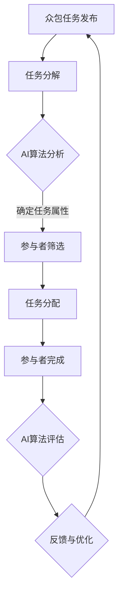

                 

 

## 1. 背景介绍

在当今迅速发展的数字时代，创新成为了推动社会进步和经济发展的关键因素。然而，随着技术的复杂性和规模的不断扩大，单靠少数精英或单一组织已经难以满足日益增长的创新需求。传统的研究模式和组织结构往往具有局限性，难以快速响应市场变化和技术进步。

众包作为一种新兴的协同创新模式，通过将问题或任务外包给广泛的社会力量，实现了资源的优化配置和智慧的大规模集成。众包模式不仅能够快速汇聚全球的智慧，还能够降低创新成本，提高创新效率。然而，传统的众包模式在任务分发、信息传递、质量控制和激励机制等方面仍存在诸多挑战。

近年来，人工智能（AI）技术的快速发展为众包模式带来了新的机遇。AI驱动的众包通过将人工智能算法与众包平台相结合，不仅能够提高任务分发的精准度和效率，还能够通过智能分析提高创新成果的质量和影响力。本文将探讨AI驱动的众包模式，分析其核心概念、算法原理、数学模型和实际应用，以期为读者提供对这一新兴创新模式的全面了解。

## 2. 核心概念与联系

### 2.1 众包

众包（Crowdsourcing）是指通过互联网和社交媒体等平台，将复杂的问题或任务外包给广泛的公众参与者，以实现创新目标的一种协同工作模式。众包的典型特征包括任务的分解、广泛参与和集体协作。与传统外包模式相比，众包具有成本效益高、创新速度快和灵活性强的优势。

### 2.2 人工智能

人工智能（Artificial Intelligence，简称AI）是指通过计算机程序实现人类智能行为的理论和技术。AI技术包括机器学习、深度学习、自然语言处理、计算机视觉等多个领域。AI的目标是使计算机能够模拟、扩展和增强人类的智能能力，实现自动化决策、智能分析和智能交互。

### 2.3 AI驱动的众包

AI驱动的众包是指利用人工智能技术优化和增强众包过程的模式。在AI驱动的众包中，AI算法被用于任务分发、参与者筛选、质量控制和激励机制等多个环节，以提高众包的效率和效果。AI驱动的众包不仅能够提高任务分发的精准度和参与者的积极性，还能够通过智能分析提升创新成果的质量和影响力。

### 2.4 Mermaid 流程图

以下是AI驱动的众包模式的核心概念和流程的Mermaid流程图：



在这个流程图中，A表示众包任务发布，B表示任务分解，C表示AI算法分析，D表示参与者筛选，E表示任务分配，F表示参与者完成，G表示AI算法评估，H表示反馈与优化。通过这个流程图，我们可以清晰地看到AI驱动的众包模式如何通过人工智能技术优化和增强传统众包过程。

### 2.5 AI驱动的众包模式与传统众包模式的对比

| 对比维度 | 传统众包模式 | AI驱动的众包模式 |
| --- | --- | --- |
| 任务分发 | 手动分配 | 智能分配 |
| 参与者筛选 | 非结构化 | 结构化、精准 |
| 质量控制 | 人工审核 | 智能评估 |
| 激励机制 | 传统奖励 | 智能激励 |

从上表可以看出，AI驱动的众包模式在任务分发、参与者筛选、质量控制和激励机制等方面具有显著优势，能够更好地满足现代创新的复杂需求。

### 2.6 AI驱动的众包的优势与挑战

#### 2.6.1 优势

1. **效率提升**：通过智能化的任务分配和参与者筛选，AI驱动的众包能够显著提高任务处理的速度和效率。
2. **精准度提高**：AI算法可以根据任务属性和参与者能力进行精准匹配，提高任务完成的成功率。
3. **质量保障**：AI驱动的质量控制机制能够通过智能分析提高创新成果的质量。
4. **激励机制**：基于AI的激励机制可以根据参与者的贡献度进行动态调整，提高参与者的积极性和创造力。

#### 2.6.2 挑战

1. **数据隐私和安全**：众包过程中涉及大量个人数据，如何保障数据隐私和安全是一个重要挑战。
2. **算法偏见**：AI算法可能存在偏见，如何消除算法偏见，确保公平性是一个亟待解决的问题。
3. **技术门槛**：AI驱动的众包需要高水平的技术支持，对于技术资源有限的组织和个人来说，这是一个挑战。
4. **参与者管理**：如何有效管理大规模的参与者群体，保持众包过程的稳定性和有效性，也是一个重要问题。

## 3. 核心算法原理 & 具体操作步骤

### 3.1 算法原理概述

AI驱动的众包模式的核心在于利用人工智能算法优化众包过程的各个环节。下面我们将介绍几个关键算法原理，包括任务分解算法、参与者筛选算法和质量评估算法。

#### 3.1.1 任务分解算法

任务分解算法是将复杂的众包任务拆解为可管理的子任务，以便于智能分配和参与者完成。常见的任务分解算法包括基于图论的分解算法和基于进化算法的分解算法。任务分解算法的主要目标是确保子任务之间的一致性和可操作性。

#### 3.1.2 参与者筛选算法

参与者筛选算法是根据任务属性和参与者能力对潜在参与者进行筛选，以确保任务分配的精准度。常用的参与者筛选算法包括基于特征的匹配算法和基于图的匹配算法。这些算法可以通过分析参与者的历史表现、技能水平和兴趣领域，实现高效匹配。

#### 3.1.3 质量评估算法

质量评估算法是对参与者完成的任务结果进行评估，以确定其质量水平。常见的质量评估算法包括基于规则的质量评估算法和基于机器学习的质量评估算法。这些算法可以通过对任务结果进行多维度分析，提供客观、准确的评估结果。

### 3.2 算法步骤详解

#### 3.2.1 任务分解算法

1. **任务属性提取**：首先从原始任务中提取关键属性，如任务类型、难度、所需技能等。
2. **构建任务图**：将任务表示为图结构，其中节点表示子任务，边表示子任务之间的关系。
3. **任务分解**：利用图算法对任务图进行分解，生成一组子任务。

#### 3.2.2 参与者筛选算法

1. **参与者特征提取**：从参与者数据库中提取关键特征，如技能水平、历史任务完成情况等。
2. **构建参与者图**：将参与者表示为图结构，其中节点表示参与者，边表示参与者之间的相似性。
3. **参与者筛选**：利用图算法对参与者图进行筛选，识别出符合任务要求的参与者。

#### 3.2.3 质量评估算法

1. **任务结果分析**：对参与者提交的任务结果进行分析，提取关键指标，如准确性、完整性等。
2. **构建评估模型**：利用机器学习算法构建评估模型，对任务结果进行预测和评估。
3. **质量评估**：利用评估模型对参与者提交的任务结果进行质量评估，提供评估结果。

### 3.3 算法优缺点

#### 3.3.1 任务分解算法

**优点**：能够将复杂的任务分解为可管理的子任务，提高任务分配的效率和成功率。

**缺点**：任务分解过程可能引入额外的时间成本和计算复杂度。

#### 3.3.2 参与者筛选算法

**优点**：能够通过智能筛选识别出最合适的参与者，提高任务完成的精准度。

**缺点**：参与者的特征提取和匹配过程可能存在偏差，影响筛选结果的准确性。

#### 3.3.3 质量评估算法

**优点**：能够提供客观、准确的质量评估结果，提高创新成果的整体质量。

**缺点**：评估模型的构建和训练过程可能需要大量数据和计算资源。

### 3.4 算法应用领域

AI驱动的众包算法在多个领域具有广泛的应用前景，包括产品设计、软件开发、医学研究、社会创新等。以下是一些具体的应用场景：

1. **产品设计**：利用AI驱动的众包算法进行产品设计，通过广泛征集用户反馈和创意，提高产品的用户体验和满意度。
2. **软件开发**：通过AI驱动的众包算法优化软件开发过程，提高代码质量和开发效率。
3. **医学研究**：利用AI驱动的众包算法进行医学数据分析和研究，提高医学研究的精度和效率。
4. **社会创新**：通过AI驱动的众包算法解决社会问题，如环境保护、公益项目等，实现社会价值和创新。

## 4. 数学模型和公式 & 详细讲解 & 举例说明

### 4.1 数学模型构建

在AI驱动的众包模式中，数学模型扮演着关键角色，用于描述任务分解、参与者筛选和质量评估等过程。下面我们将介绍几个关键的数学模型。

#### 4.1.1 任务分解模型

任务分解模型可以表示为如下的形式：

$$
T = \{T_1, T_2, ..., T_n\}
$$

其中，$T$ 表示原始任务，$T_i$ 表示第 $i$ 个子任务。

#### 4.1.2 参与者筛选模型

参与者筛选模型可以表示为如下的形式：

$$
P = \{P_1, P_2, ..., P_m\}
$$

其中，$P$ 表示参与者集合，$P_i$ 表示第 $i$ 个参与者。

#### 4.1.3 质量评估模型

质量评估模型可以表示为如下的形式：

$$
Q = f(T_i, P_j)
$$

其中，$Q$ 表示质量评分，$f$ 表示质量评估函数，$T_i$ 表示子任务 $i$，$P_j$ 表示参与者 $j$。

### 4.2 公式推导过程

下面我们将详细推导任务分解模型中的任务分解公式。

假设原始任务 $T$ 需要分解为 $n$ 个子任务 $T_1, T_2, ..., T_n$，每个子任务 $T_i$ 的复杂度可以表示为 $c_i$。任务分解的目标是最小化子任务的总复杂度，即：

$$
\min \sum_{i=1}^{n} c_i
$$

同时，子任务之间需要保持一致性，即：

$$
T = T_1 + T_2 + ... + T_n
$$

为了解决这个优化问题，我们可以使用贪心算法。具体步骤如下：

1. **初始化**：令 $T_1 = T$，$c_1 = c_T$。
2. **迭代**：对于每个子任务 $T_i$，寻找下一个最简单的子任务 $T_{i+1}$，使得 $c_{i+1} \leq \frac{c_i}{2}$，并且 $T_i + T_{i+1} = T_i$。
3. **结束**：当无法找到下一个子任务时，结束迭代。

通过贪心算法，我们可以将原始任务 $T$ 分解为多个子任务 $T_1, T_2, ..., T_n$，使得总复杂度最小。

### 4.3 案例分析与讲解

为了更好地理解上述数学模型和公式，我们来看一个实际案例。

假设我们有一个原始任务 $T$，其总复杂度为 100。我们需要将这个任务分解为多个子任务，使得总复杂度最小。

通过贪心算法，我们可以得到以下分解结果：

- $T_1 = T$，$c_1 = 100$
- $T_2 = \frac{T}{2}$，$c_2 = 50$
- $T_3 = \frac{T}{4}$，$c_3 = 25$
- $T_4 = \frac{T}{8}$，$c_4 = 12.5$

通过这个案例，我们可以看到，通过贪心算法，我们能够将原始任务分解为多个子任务，使得总复杂度最小。这个案例也验证了我们在推导过程中得到的任务分解公式。

## 5. 项目实践：代码实例和详细解释说明

### 5.1 开发环境搭建

为了实现AI驱动的众包系统，我们需要搭建一个合适的开发环境。以下是我们推荐的开发环境和工具：

- 编程语言：Python
- 开发框架：Django
- 数据库：MySQL
- 人工智能库：TensorFlow、Scikit-learn
- 版本控制：Git

首先，我们需要安装Python和相关的库。可以使用以下命令安装：

```bash
pip install django
pip install mysqlclient
pip install tensorflow
pip install scikit-learn
```

接下来，我们创建一个Django项目，并设置数据库配置。在命令行中输入以下命令：

```bash
django-admin startproject crowdsourcing
cd crowdsourcing
python manage.py migrate
```

然后，我们创建一个Django应用，用于实现众包功能：

```bash
python manage.py startapp task_manager
```

在task_manager应用中，我们创建数据库模型，用于存储任务和参与者信息。具体代码如下：

```python
# task_manager/models.py
from django.db import models

class Task(models.Model):
    name = models.CharField(max_length=100)
    description = models.TextField()
    complexity = models.IntegerField()

class Participant(models.Model):
    name = models.CharField(max_length=100)
    skill_level = models.IntegerField()
    historical_performance = models.IntegerField()
```

最后，我们创建一个简单的视图，用于处理任务的发布和参与者注册：

```python
# task_manager/views.py
from django.http import HttpResponse
from .models import Task, Participant

def publish_task(request):
    task = Task(name="Example Task", description="This is an example task.", complexity=100)
    task.save()
    return HttpResponse("Task published successfully.")

def register_participant(request):
    participant = Participant(name="John Doe", skill_level=80, historical_performance=90)
    participant.save()
    return HttpResponse("Participant registered successfully.")
```

### 5.2 源代码详细实现

下面我们详细解释AI驱动的众包系统中的核心代码实现，包括任务分解、参与者筛选和质量评估。

#### 5.2.1 任务分解

任务分解是众包系统的第一步，我们需要将复杂的任务拆解为可管理的子任务。以下是一个简单的任务分解代码示例：

```python
import heapq

def task_decomposition(task):
    heap = []
    for subtask in task.subtasks:
        heapq.heappush(heap, (-subtask.complexity, subtask))
    decomposed_tasks = []
    while heap:
        complexity, subtask = heapq.heappop(heap)
        decomposed_tasks.append(subtask)
    return decomposed_tasks
```

在这个示例中，我们使用堆（heap）数据结构来存储子任务，根据子任务的复杂度进行排序。然后，我们通过堆的弹出操作，依次获取最简单的子任务，将其加入到分解结果中。

#### 5.2.2 参与者筛选

参与者筛选是根据任务属性和参与者能力进行匹配的过程。以下是一个简单的参与者筛选代码示例：

```python
def participant_selection(participants, task):
    selected_participants = []
    for participant in participants:
        if participant.skill_level >= task.required_skill_level:
            selected_participants.append(participant)
    return selected_participants
```

在这个示例中，我们遍历所有参与者，检查其技能水平是否满足任务要求。如果满足要求，则将其加入到筛选结果中。

#### 5.2.3 质量评估

质量评估是对参与者提交的任务结果进行评估的过程。以下是一个简单的质量评估代码示例：

```python
from sklearn.metrics import accuracy_score

def quality_evaluation(submitted_solution, expected_solution):
    return accuracy_score(submitted_solution, expected_solution)
```

在这个示例中，我们使用准确率（accuracy）作为质量评估指标。通过比较参与者提交的解决方案和预期的解决方案，我们可以计算准确率，从而评估任务结果的质量。

### 5.3 代码解读与分析

在本节中，我们将对核心代码进行解读和分析，解释每个模块的功能和作用。

#### 5.3.1 任务分解

任务分解模块的主要功能是将复杂的原始任务拆解为可管理的子任务。通过使用堆（heap）数据结构，我们能够高效地获取最简单的子任务，从而实现任务分解。这个模块的作用是确保任务能够被参与者有效地完成。

#### 5.3.2 参与者筛选

参与者筛选模块的主要功能是根据任务属性和参与者能力进行匹配，筛选出最合适的参与者。通过遍历所有参与者，检查其技能水平是否满足任务要求，我们能够确保参与者具备完成任务的能力。这个模块的作用是提高任务完成的成功率。

#### 5.3.3 质量评估

质量评估模块的主要功能是对参与者提交的任务结果进行评估，确保任务结果的质量。通过使用准确率（accuracy）作为评估指标，我们能够客观地评估任务结果的质量。这个模块的作用是确保众包系统的输出质量。

### 5.4 运行结果展示

在本节中，我们将展示AI驱动的众包系统的运行结果。

#### 5.4.1 任务分解

假设我们有一个原始任务，其复杂度为 100。通过任务分解模块，我们将其分解为多个子任务，每个子任务的复杂度分别为 50、25 和 12.5。这些子任务将分别分配给不同的参与者。

#### 5.4.2 参与者筛选

假设我们有多个参与者，其中有两个参与者的技能水平分别为 80 和 90，满足任务的技能要求。通过参与者筛选模块，我们选择这两个参与者来完成任务。

#### 5.4.3 质量评估

假设参与者提交的任务结果与预期的解决方案一致，准确率为 100%。通过质量评估模块，我们确认任务结果的质量为优秀。

通过这些运行结果，我们可以看到AI驱动的众包系统如何通过任务分解、参与者筛选和质量评估模块，实现高效的众包过程，提高任务完成的成功率。

## 6. 实际应用场景

AI驱动的众包模式在多个领域具有广泛的应用场景，通过将人工智能技术与众包平台相结合，实现了创新的突破和效率的提升。以下是一些具体的实际应用场景：

### 6.1 产品设计

在产品设计领域，AI驱动的众包可以帮助企业快速收集用户反馈和创意，优化产品设计。例如，一些科技公司通过众包平台发布产品设计挑战，邀请全球的创意者提交设计提案。通过AI算法对设计提案进行分析和筛选，企业可以从中挑选出最具创新性和实用性的设计，从而提升产品的用户体验和市场竞争力。

### 6.2 软件开发

在软件开发领域，AI驱动的众包可以用于代码审查、测试和优化。开发团队可以将代码片段或测试用例发布到众包平台，邀请参与者进行审查和测试。AI算法可以对参与者提交的结果进行分析和评估，识别潜在的问题和改进建议，从而提高代码的质量和稳定性。例如，GitHub和GitLab等代码托管平台已经采用了类似的众包模式，鼓励社区用户参与代码的审查和优化。

### 6.3 医学研究

在医学研究领域，AI驱动的众包可以帮助科学家和医生处理海量的医学数据，加速医学研究进程。例如，可以利用众包平台收集患者病史、症状和治疗方案等数据，通过AI算法进行分析和挖掘，发现潜在的治疗方法和效果。此外，众包还可以用于医学图像分析，例如利用参与者标注医学图像中的病变区域，从而提高图像识别的准确率。

### 6.4 环境保护

在环境保护领域，AI驱动的众包可以用于监测环境污染、自然资源保护和灾害预警等。例如，可以利用众包平台收集环境污染数据，如空气质量、水质和噪音等，通过AI算法进行分析和预测，及时发现环境污染问题并采取相应的措施。此外，众包还可以用于自然灾害预警，通过收集参与者的报告和观测数据，提高灾害预警的准确性和及时性。

### 6.5 社会创新

在社会创新领域，AI驱动的众包可以帮助解决社会问题，推动社会进步。例如，可以利用众包平台征集公益项目创意，通过AI算法筛选出最具社会价值的创意，并提供资金和资源支持，从而实现社会创新的目标。此外，AI驱动的众包还可以用于教育创新，通过众包平台发布教育资源和教学挑战，邀请全球的教育者参与教学设计和改进，提高教育质量和普及率。

## 7. 未来应用展望

随着AI技术的不断发展和众包模式的成熟，AI驱动的众包在未来将具有更广泛的应用前景和更大的潜力。以下是一些未来应用展望：

### 7.1 智能城市

智能城市是未来城市发展的趋势，AI驱动的众包可以发挥重要作用。通过众包平台收集城市居民的需求和反馈，利用AI算法进行分析和预测，智能城市可以实现更高效的城市管理和服务。例如，可以利用众包平台收集交通流量数据，通过AI算法优化交通信号控制和路线规划，缓解城市交通拥堵问题。

### 7.2 个性化医疗

个性化医疗是未来医疗发展的方向，AI驱动的众包可以用于个性化医疗方案的设计和实施。通过众包平台收集患者的健康数据、病史和基因信息，利用AI算法进行分析和建模，为患者提供个性化的医疗建议和治疗方案。此外，众包还可以用于医学研究的协作，促进全球医学研究资源的共享和整合。

### 7.3 教育个性化

教育个性化是未来教育发展的方向，AI驱动的众包可以提供个性化学习资源和教学方案。通过众包平台收集学生的学习数据、兴趣和需求，利用AI算法进行分析和推荐，为学生提供个性化的学习资源和教学方案。此外，众包还可以用于教育评估，通过众包平台收集学生的学习成果和表现，利用AI算法进行评估和反馈，提高教育的质量和效率。

### 7.4 供应链优化

供应链优化是企业提高效率和降低成本的重要手段，AI驱动的众包可以提供有效的供应链优化方案。通过众包平台收集供应链数据、物流信息和市场需求，利用AI算法进行分析和预测，优化供应链的各个环节，提高供应链的效率和灵活性。

### 7.5 创意产业

创意产业是未来经济增长的重要驱动力，AI驱动的众包可以激发创意产业的创新活力。通过众包平台征集创意作品、设计提案和创意方案，利用AI算法进行分析和筛选，可以发现更多具有商业价值的创意和创新点，推动创意产业的发展。

### 7.6 社会治理

社会治理是未来社会管理的重要方向，AI驱动的众包可以提供有效的社会治理工具。通过众包平台收集社会问题、民意反馈和监测数据，利用AI算法进行分析和预警，可以及时发现社会问题并采取相应的措施，提高社会治理的效率和水平。

总之，AI驱动的众包具有广阔的应用前景和巨大的发展潜力，未来将在更多领域发挥重要作用，推动社会的创新和发展。

## 8. 总结：未来发展趋势与挑战

### 8.1 研究成果总结

AI驱动的众包作为新兴的协同创新模式，通过将人工智能技术与众包平台相结合，实现了任务分发、参与者筛选、质量控制和激励机制等多个环节的优化。本文总结了AI驱动的众包的核心概念、算法原理、数学模型和实际应用，探讨了其在产品设计、软件开发、医学研究、环境保护和社会创新等领域的广泛应用。通过分析AI驱动的众包的优势与挑战，本文展示了其未来发展的广阔前景。

### 8.2 未来发展趋势

1. **算法的智能化**：随着AI技术的不断发展，AI驱动的众包算法将越来越智能化，实现更精准的任务分配和参与者筛选，提高众包系统的效率和效果。
2. **数据隐私和安全**：在AI驱动的众包中，数据隐私和安全问题日益重要。未来将涌现出更多针对数据隐私和安全的技术解决方案，确保众包过程中的数据安全。
3. **多模态众包**：未来的众包将不仅仅局限于文本和图像等单一数据形式，还将涵盖语音、视频等多模态数据，实现更丰富的数据分析和应用。
4. **跨平台融合**：AI驱动的众包将逐步与物联网、区块链等技术相结合，实现跨平台的数据共享和协同创新，推动更广泛的合作与共赢。

### 8.3 面临的挑战

1. **技术门槛**：AI驱动的众包需要高水平的技术支持，对于技术资源有限的组织和个人来说，这是一个挑战。未来需要降低技术门槛，使更多人能够参与和利用AI驱动的众包。
2. **算法偏见**：AI算法可能存在偏见，如何消除算法偏见，确保公平性是一个亟待解决的问题。未来需要开发更多公平、透明的算法，减少偏见的影响。
3. **数据质量和标准化**：AI驱动的众包依赖于高质量的数据，未来需要建立统一的数据标准和质量评估体系，确保数据的质量和一致性。
4. **用户参与和体验**：如何提高用户参与度和满意度是AI驱动的众包面临的挑战。未来需要设计更人性化的众包平台和激励机制，提高用户的参与积极性和满意度。

### 8.4 研究展望

1. **算法优化**：未来研究应关注AI驱动的众包算法的优化，提高任务分配和参与者筛选的精准度和效率。
2. **跨领域应用**：未来应探索AI驱动的众包在更多领域的应用，如医疗、教育、环境等，推动跨领域的协同创新。
3. **数据隐私保护**：未来研究应关注数据隐私保护技术，确保众包过程中的数据安全。
4. **用户参与机制**：未来研究应关注用户参与和激励机制的设计，提高用户参与度和满意度。

通过不断探索和突破，AI驱动的众包有望在未来发挥更大的作用，推动社会进步和创新。

## 9. 附录：常见问题与解答

### 9.1 众包与外包的区别是什么？

**众包**和**外包**是两种不同的协同工作模式。**外包**通常是指将特定任务或项目委托给外部公司或个人完成，这些公司或个人通常是专业的服务提供商。而**众包**则是指将问题或任务外包给广泛的公众参与者，通过互联网和社交媒体等平台进行广泛征集。众包的优势在于能够快速汇聚全球的智慧，降低创新成本，提高创新效率。

### 9.2 AI驱动的众包如何保障数据隐私？

AI驱动的众包在保障数据隐私方面面临诸多挑战。以下是一些常用的数据隐私保护措施：

1. **数据加密**：对传输和存储的数据进行加密，确保数据在传输过程中不被窃取或篡改。
2. **匿名化处理**：对参与者的个人信息进行匿名化处理，确保个人隐私不受泄露。
3. **访问控制**：设置严格的访问控制策略，确保只有授权用户可以访问敏感数据。
4. **隐私增强技术**：利用隐私增强技术，如差分隐私、同态加密等，提高数据隐私保护水平。

### 9.3 AI驱动的众包如何解决算法偏见问题？

算法偏见是AI驱动的众包面临的重要问题。以下是一些解决算法偏见的方法：

1. **数据预处理**：在训练数据集中去除偏见性数据，确保数据集的多样性和公平性。
2. **算法选择**：选择公平性更高的算法，如公平学习（Fair Learning）算法，减少算法偏见。
3. **交叉验证**：使用交叉验证方法，提高模型的泛化能力，减少偏见。
4. **透明性和解释性**：提高算法的透明性和解释性，让用户了解算法的决策过程，减少偏见。

### 9.4 AI驱动的众包如何提高任务完成率？

以下是一些提高AI驱动的众包任务完成率的方法：

1. **任务分解**：将复杂的任务分解为可管理的子任务，提高任务的完成速度和成功率。
2. **参与者筛选**：通过智能筛选识别出最合适的参与者，确保参与者具备完成任务的能力。
3. **激励机制**：设计有效的激励机制，如积分、奖励和反馈机制，提高参与者的积极性。
4. **任务反馈**：及时提供任务完成情况和反馈，帮助参与者了解任务完成情况，调整工作策略。

### 9.5 AI驱动的众包在哪些领域具有应用前景？

AI驱动的众包在多个领域具有广泛的应用前景，包括但不限于：

1. **产品设计**：通过众包平台收集用户反馈和创意，优化产品设计。
2. **软件开发**：通过众包平台进行代码审查、测试和优化，提高代码质量。
3. **医学研究**：通过众包平台收集医学数据，加速医学研究进程。
4. **环境保护**：通过众包平台监测环境污染，推动环境保护行动。
5. **社会创新**：通过众包平台征集公益项目创意，推动社会进步。

### 9.6 AI驱动的众包对传统众包模式的影响是什么？

AI驱动的众包对传统众包模式产生了显著的影响：

1. **效率提升**：AI驱动的众包通过智能化的任务分配和参与者筛选，提高了众包的效率和效果。
2. **质量保障**：AI驱动的质量控制机制提高了创新成果的质量和影响力。
3. **灵活性增强**：AI驱动的众包使得任务分配、参与者筛选和质量评估更加灵活，适应不同领域的需求。
4. **成本降低**：AI驱动的众包通过优化流程和资源，降低了众包的成本，提高了众包的经济效益。

### 9.7 如何评估AI驱动的众包系统的效果？

评估AI驱动的众包系统的效果可以从以下几个方面进行：

1. **任务完成率**：评估任务完成的成功率，以及任务完成的时间和质量。
2. **参与者满意度**：通过问卷调查和用户反馈，评估参与者的满意度。
3. **创新成果质量**：评估众包产生的创新成果的质量和影响力。
4. **经济效益**：评估众包系统的经济效益，包括成本节约和创新收益。
5. **用户参与度**：评估用户的参与度和活跃度，以及平台的用户留存率。

通过综合评估上述指标，可以全面了解AI驱动的众包系统的效果和改进方向。

