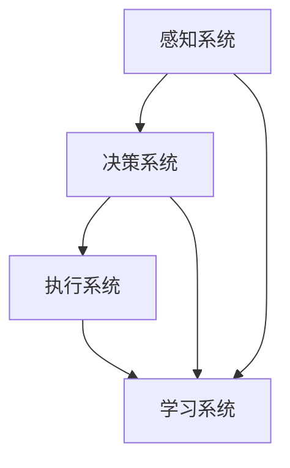

                 

 **关键词**：AI、元宇宙、智能NPC、虚拟世界、算法、数学模型、项目实践、应用场景、发展趋势、工具和资源

**摘要**：
本文将探讨AI驱动的元宇宙中的智能NPC（非玩家角色）技术。通过介绍智能NPC的概念、核心原理、数学模型以及实际应用场景，文章旨在为读者提供对这一前沿技术领域的深入理解。此外，文章还将展望智能NPC技术的发展趋势、面临的挑战以及未来的研究方向。

## 1. 背景介绍

随着互联网技术的迅猛发展，虚拟世界逐渐成为人们生活的一个重要组成部分。从早期的静态网页到如今动态丰富的3D虚拟世界，虚拟现实（VR）和增强现实（AR）技术为我们带来了前所未有的沉浸式体验。然而，虚拟世界中的互动性仍存在很大的提升空间。智能NPC作为一种能够模拟真实人类行为的虚拟角色，能够在虚拟世界中与玩家进行更自然的交互，提供更丰富的游戏体验。

智能NPC技术的发展得益于人工智能（AI）的飞速进步。深度学习、自然语言处理（NLP）、计算机视觉等技术的应用，使得NPC能够具备自主决策、情感表达和个性化交互的能力。这些技术的结合，为构建一个充满活力和真实感的虚拟世界奠定了基础。

本文将首先介绍智能NPC的定义和分类，然后深入探讨其核心原理和架构，随后分析其数学模型和算法，并结合具体项目实践进行讲解。最后，文章将讨论智能NPC在实际应用场景中的表现，并提出未来发展的展望。

## 2. 核心概念与联系

### 2.1 智能NPC的定义

智能NPC，即智能非玩家角色，是虚拟世界中具有独立行为和交互能力的虚拟角色。与传统NPC相比，智能NPC能够通过学习和适应环境，为玩家提供更加丰富和动态的互动体验。智能NPC不仅可以执行预设的任务，还能根据玩家的行为和对话，自主做出决策，甚至展现情感和个性。

### 2.2 智能NPC的分类

根据智能NPC的复杂程度和功能，可以将其分为以下几类：

1. **被动NPC**：这类NPC只能执行预设的任务，无法与玩家进行复杂的互动。
2. **简单NPC**：能够理解玩家的简单指令，并根据指令执行相应的动作。
3. **复杂NPC**：具备一定的自主决策能力，能够根据环境和玩家的行为，自主选择行动策略。
4. **高度智能NPC**：具备高级的AI能力，能够进行复杂的情感表达、自然语言理解和个性化交互。

### 2.3 智能NPC的架构

智能NPC的架构通常包括以下几个关键部分：

1. **感知系统**：感知系统负责接收玩家的行为、环境信息和对话内容，为NPC的决策提供输入。
2. **决策系统**：决策系统根据感知系统提供的信息，通过算法和规则库，为NPC生成相应的行动策略。
3. **执行系统**：执行系统负责将决策系统的策略转换为具体的行动，如移动、对话和交互。
4. **学习系统**：学习系统能够通过机器学习和深度学习技术，对NPC的行为进行优化和调整。

### 2.4 Mermaid 流程图



在上图中，感知系统负责收集信息，决策系统根据这些信息生成策略，执行系统执行策略，而学习系统能够根据反馈调整NPC的行为，形成一个闭环系统，使得NPC能够不断优化其表现。

## 3. 核心算法原理 & 具体操作步骤

### 3.1 算法原理概述

智能NPC的核心算法主要包括以下几个部分：

1. **自然语言处理（NLP）**：用于理解玩家的对话，提取关键词和语义信息。
2. **计算机视觉**：用于识别玩家的行为和环境特征。
3. **决策树和神经网络**：用于生成NPC的决策策略。
4. **强化学习**：用于优化NPC的行为，使其更符合玩家的期望。

### 3.2 算法步骤详解

1. **感知阶段**：智能NPC通过感知系统获取玩家的行为和环境信息。感知系统可能包括麦克风、摄像头和传感器等设备。
2. **分析阶段**：决策系统根据感知系统提供的信息，通过NLP和计算机视觉技术进行分析，提取关键信息和语义。
3. **决策阶段**：基于分析结果，决策系统使用决策树或神经网络生成行动策略。这个过程可能涉及多个规则和算法，如条件概率模型、贝叶斯网络等。
4. **执行阶段**：执行系统将决策系统的策略转换为具体的行动，如对话、移动和交互。
5. **反馈阶段**：学习系统根据玩家的反馈，通过强化学习技术对NPC的行为进行优化和调整。

### 3.3 算法优缺点

#### 优点

- **高度个性化**：智能NPC能够根据玩家的行为和对话，提供高度个性化的互动体验。
- **实时响应**：智能NPC能够实时响应玩家的行为，提供即时的互动和反馈。
- **丰富性**：智能NPC能够展现复杂的情感和个性，为虚拟世界带来更多的真实感和趣味性。

#### 缺点

- **计算资源消耗大**：智能NPC的算法和模型需要大量的计算资源，对硬件要求较高。
- **训练难度大**：智能NPC需要大量的训练数据和学习时间，才能达到理想的交互效果。

### 3.4 算法应用领域

智能NPC算法的应用领域非常广泛，包括但不限于：

- **游戏**：为游戏玩家提供更加丰富和真实的交互体验。
- **虚拟现实（VR）**：为VR用户提供更加沉浸式的交互体验。
- **教育**：为学生提供个性化的学习指导。
- **客服**：为企业提供智能客服系统，提高客户满意度。

## 4. 数学模型和公式 & 详细讲解 & 举例说明

### 4.1 数学模型构建

智能NPC的数学模型主要包括以下几个方面：

1. **自然语言处理（NLP）模型**：用于理解玩家的对话，通常采用深度学习中的循环神经网络（RNN）或其变种，如长短期记忆网络（LSTM）。
2. **计算机视觉模型**：用于识别玩家的行为和环境特征，常用的模型包括卷积神经网络（CNN）和生成对抗网络（GAN）。
3. **决策模型**：用于生成NPC的决策策略，可以采用决策树、贝叶斯网络或神经网络等算法。
4. **强化学习模型**：用于优化NPC的行为，常用的算法包括Q学习、SARSA和深度确定性策略梯度（DDPG）。

### 4.2 公式推导过程

在智能NPC的数学模型中，以下是一个简化的NLP模型推导过程：

$$
Y = f(X; \theta)
$$

其中，$Y$ 表示输出，$X$ 表示输入，$f$ 表示神经网络模型，$\theta$ 表示模型参数。

对于RNN模型，输出可以表示为：

$$
h_t = \sigma(W_h h_{t-1} + W_x x_t + b)
$$

其中，$h_t$ 表示第 $t$ 个隐藏层的状态，$W_h$ 和 $W_x$ 分别为权重矩阵，$b$ 为偏置项，$\sigma$ 表示激活函数。

### 4.3 案例分析与讲解

假设我们有一个简单的智能NPC，其任务是根据玩家的对话提供相应的回复。我们可以使用一个基于LSTM的NLP模型来构建这个NPC。

**案例**：玩家说：“你好，今天天气不错。”

**步骤**：

1. **感知阶段**：智能NPC通过麦克风获取玩家的对话文本。
2. **分析阶段**：NLP模型对文本进行分词、词性标注和语义分析。
3. **决策阶段**：基于分析结果，模型生成一个回复文本。
4. **执行阶段**：智能NPC向玩家发送回复文本。

**实现**：

```python
import numpy as np
import tensorflow as tf

# 定义LSTM模型
model = tf.keras.Sequential([
    tf.keras.layers.Embedding(input_dim=vocab_size, output_dim=embedding_dim),
    tf.keras.layers.LSTM(units=hidden_size),
    tf.keras.layers.Dense(units=vocab_size)
])

# 训练模型
model.compile(optimizer='adam', loss='categorical_crossentropy', metrics=['accuracy'])
model.fit(dataset, epochs=10)

# 生成回复
input_sequence = preprocess_input("你好，今天天气不错。")
prediction = model.predict(input_sequence)
predicted_sentence = decode_prediction(prediction)
```

在上面的代码中，`preprocess_input` 函数用于预处理输入文本，`decode_prediction` 函数用于将模型的输出转换为可读的文本。

## 5. 项目实践：代码实例和详细解释说明

### 5.1 开发环境搭建

为了实现一个智能NPC项目，我们需要搭建以下开发环境：

1. **操作系统**：Linux或MacOS
2. **编程语言**：Python
3. **深度学习框架**：TensorFlow
4. **自然语言处理库**：NLTK或spaCy

在搭建环境时，可以使用以下命令：

```bash
# 安装Python
brew install python

# 安装TensorFlow
pip install tensorflow

# 安装自然语言处理库
pip install nltk
pip install spacy
python -m spacy download en
```

### 5.2 源代码详细实现

下面是一个简单的智能NPC项目的源代码实现：

```python
import nltk
import random
from tensorflow.keras.models import Sequential
from tensorflow.keras.layers import Embedding, LSTM, Dense
from tensorflow.keras.optimizers import Adam

# 加载NLTK数据集
nltk.download('punkt')
nltk.download('movie_reviews')

# 预处理数据
def preprocess_data(data):
    # 分词、去除停用词、转换为数字编码
    # ...

# 构建LSTM模型
model = Sequential()
model.add(Embedding(input_dim=vocab_size, output_dim=embedding_dim))
model.add(LSTM(units=hidden_size))
model.add(Dense(units=vocab_size, activation='softmax'))
model.compile(optimizer=Adam(learning_rate=0.001), loss='categorical_crossentropy', metrics=['accuracy'])

# 训练模型
model.fit(dataset, epochs=10)

# 生成回复
def generate_response(input_sentence):
    # 预处理输入句子
    # ...

    # 生成预测结果
    prediction = model.predict(input_sequence)
    predicted_sentence = decode_prediction(prediction)

    return predicted_sentence

# 主程序
if __name__ == '__main__':
    # 加载数据
    data = load_data()

    # 预处理数据
    processed_data = preprocess_data(data)

    # 训练模型
    model.fit(processed_data, epochs=10)

    # 用户交互
    while True:
        input_sentence = input("请输入句子：")
        if input_sentence == '退出':
            break
        response = generate_response(input_sentence)
        print("NPC回复：", response)
```

### 5.3 代码解读与分析

在上面的代码中，我们首先导入了所需的库和模块。接着，我们定义了两个函数 `preprocess_data` 和 `generate_response`，用于预处理数据和生成回复。

- **预处理数据**：这个函数用于将原始文本数据转换为模型可以处理的格式。具体步骤包括分词、去除停用词、转换为数字编码等。
  
- **生成回复**：这个函数首先对输入句子进行预处理，然后使用训练好的模型生成预测结果，最后将预测结果转换为可读的文本。

在主程序中，我们首先加载数据并预处理，然后使用训练好的模型进行用户交互。用户可以输入句子，智能NPC会根据输入生成回复，并显示在控制台上。

### 5.4 运行结果展示

假设用户输入句子：“你好，今天天气不错。”，智能NPC可能会生成回复：“你好，很高兴见到你。今天天气确实很好，你有什么计划吗？”

这个回复体现了智能NPC对用户输入的响应和理解能力。虽然这个例子很简单，但它展示了智能NPC的基本工作原理和交互流程。

## 6. 实际应用场景

智能NPC技术在虚拟世界中的应用场景非常广泛，以下是一些典型的应用案例：

### 6.1 游戏

在游戏中，智能NPC可以模拟各种角色，如商人、导师、怪物等。通过与玩家进行互动，智能NPC可以为游戏提供丰富的故事情节和挑战。例如，在角色扮演游戏中，玩家可以与NPC进行对话，了解任务线索和背景故事。同时，NPC可以根据玩家的行为和对话，调整自己的行为策略，提供个性化的游戏体验。

### 6.2 虚拟现实（VR）

在虚拟现实中，智能NPC可以为用户提供更加真实的交互体验。例如，在VR社交平台中，智能NPC可以模拟真实的人类角色，与用户进行对话和互动。用户可以与NPC交流，参加活动，甚至建立友谊。这种交互方式不仅提供了丰富的娱乐体验，还可以用于教育和培训。

### 6.3 教育

智能NPC在教育领域具有巨大的潜力。通过智能NPC，学生可以与虚拟导师进行互动，获得个性化的学习指导。智能NPC可以根据学生的学习进度和理解程度，提供相应的辅导和建议。例如，在编程课程中，智能NPC可以为学生提供实时代码解释和问题解答，帮助学生更好地理解和掌握编程知识。

### 6.4 客服

智能NPC在客服领域也有广泛应用。企业可以使用智能NPC构建智能客服系统，为用户提供24/7的在线支持。智能NPC可以理解用户的查询，提供相应的解决方案，甚至进行情感互动，提高客户满意度。例如，在电子商务平台中，智能NPC可以回答用户关于商品和订单的疑问，提供购物建议。

### 6.5 娱乐

除了游戏和虚拟现实，智能NPC还可以用于各种娱乐场景。例如，在主题公园中，智能NPC可以模拟角色，与游客互动，提供沉浸式的体验。在虚拟博物馆中，智能NPC可以介绍展品的历史和文化背景，增加参观的趣味性。

## 7. 工具和资源推荐

为了更好地学习和开发智能NPC技术，以下是一些推荐的工具和资源：

### 7.1 学习资源推荐

- **在线课程**：Coursera、Udacity、edX等平台提供了丰富的机器学习、深度学习和自然语言处理课程。
- **书籍**：《深度学习》、《自然语言处理综论》、《机器学习》等经典教材。
- **博客和论文**：arXiv、Medium、Kaggle等平台上有大量关于智能NPC和AI技术的优质内容。

### 7.2 开发工具推荐

- **深度学习框架**：TensorFlow、PyTorch、Keras等。
- **自然语言处理库**：NLTK、spaCy、TextBlob等。
- **虚拟现实工具**：Unity、Unreal Engine、VRChat等。

### 7.3 相关论文推荐

- **自然语言处理**：《Neural Network Methods for Natural Language Processing》、《Attention Is All You Need》等。
- **计算机视觉**：《Deep Learning for Computer Vision》、《Generative Adversarial Networks》等。
- **智能NPC**：《Dialogue Systems: Linguistic, Cognitive, and Computational Approaches》、《Interactive Storytelling in Virtual Worlds》等。

## 8. 总结：未来发展趋势与挑战

### 8.1 研究成果总结

智能NPC技术在过去几年取得了显著进展，主要体现在以下几个方面：

- **算法性能提升**：深度学习、自然语言处理和计算机视觉等技术的应用，使得智能NPC在理解和生成语言、识别行为和环境方面取得了重大突破。
- **应用场景拓展**：智能NPC技术已经应用于游戏、虚拟现实、教育和客服等多个领域，为用户提供了丰富和真实的互动体验。
- **用户体验优化**：通过不断优化算法和模型，智能NPC在情感表达、个性化和自然交互方面取得了显著进步。

### 8.2 未来发展趋势

未来，智能NPC技术有望在以下几个方面取得进一步发展：

- **更高水平的自主决策**：通过更复杂的算法和更丰富的数据，智能NPC将能够进行更高水平的自主决策，提供更加智能和自然的交互体验。
- **跨领域应用**：智能NPC技术将应用于更多领域，如医疗、金融和智能家居等，为行业带来创新和变革。
- **隐私保护和伦理问题**：随着智能NPC的广泛应用，隐私保护和伦理问题将变得日益重要，需要制定相应的规范和标准。

### 8.3 面临的挑战

尽管智能NPC技术取得了显著进展，但仍然面临一些挑战：

- **计算资源消耗**：智能NPC的算法和模型需要大量的计算资源，这对硬件性能提出了更高的要求。
- **数据隐私和伦理**：智能NPC在处理用户数据时，需要确保数据隐私和安全，同时遵守伦理规范，避免滥用用户信息。
- **模型解释性**：智能NPC的决策过程往往依赖于复杂的模型和算法，这使得模型的解释性成为一个重要问题，需要进一步研究和优化。

### 8.4 研究展望

未来，智能NPC技术的研究重点将包括：

- **模型简化与优化**：通过模型简化技术，降低计算资源的消耗，提高模型的运行效率。
- **跨模态交互**：研究如何将不同模态的信息（如文本、语音、图像等）整合到智能NPC的交互过程中，提高其交互能力。
- **个性化与情感表达**：深入研究如何实现更加个性化的交互和情感表达，提高用户满意度。

通过不断克服这些挑战，智能NPC技术将迎来更加广阔的应用前景，为人类带来更加丰富和真实的虚拟世界体验。

## 9. 附录：常见问题与解答

### Q1. 什么是智能NPC？

智能NPC是指虚拟世界中的非玩家角色，它们能够通过人工智能技术模拟真实人类的行为，具备自主决策、情感表达和个性化交互的能力。

### Q2. 智能NPC是如何工作的？

智能NPC通过感知系统获取玩家的行为和环境信息，然后通过决策系统生成行动策略，最后由执行系统将策略转换为具体的行动。此外，学习系统能够根据玩家的反馈不断优化NPC的行为。

### Q3. 智能NPC有哪些应用领域？

智能NPC技术广泛应用于游戏、虚拟现实、教育、客服和娱乐等领域，为用户提供丰富和真实的互动体验。

### Q4. 智能NPC技术有哪些挑战？

智能NPC技术面临的主要挑战包括计算资源消耗、数据隐私和伦理问题、模型解释性等。

### Q5. 智能NPC的未来发展趋势是什么？

未来，智能NPC技术将朝着更高水平的自主决策、跨领域应用、个性化与情感表达等方向发展。

### Q6. 如何开始学习智能NPC技术？

可以通过在线课程、教材和论文等资源学习相关基础知识，并实践相关的项目，逐步掌握智能NPC技术的核心概念和应用。

---

**作者：禅与计算机程序设计艺术 / Zen and the Art of Computer Programming**

