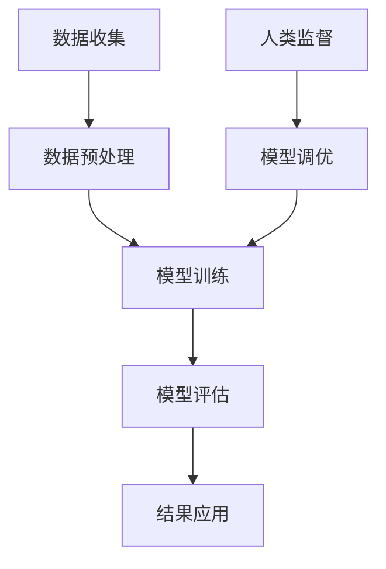

                 

关键词：人工智能、医疗、人类计算、创新、数据、算法、诊断、治疗

> 摘要：本文将探讨人工智能（AI）在医疗领域的应用，尤其是人类计算在这一过程中的价值。文章将首先介绍AI在医疗领域的背景和应用，然后深入分析AI与人类计算的结合点，探讨其带来的创新和变革。通过具体案例和实践，我们将展示AI驱动的医疗创新如何提高诊断准确性、优化治疗方案，并最终改善患者生活质量。同时，本文还将展望未来医疗领域的发展趋势，探讨面临的挑战和机遇，为读者提供对AI与医疗结合的全面理解。

## 1. 背景介绍

医疗领域一直以来都是技术创新的重要阵地。随着计算机技术、生物技术和网络通信技术的迅猛发展，医疗领域正经历着一场前所未有的变革。人工智能（AI）作为一种新兴的技术，凭借其强大的数据处理和分析能力，正在逐渐成为医疗领域的重要驱动力。

近年来，AI在医疗领域的应用越来越广泛，从疾病预测、诊断、治疗到个性化医疗，AI正发挥着越来越重要的作用。然而，尽管AI在医疗领域的应用前景广阔，但仍然面临许多挑战，例如数据隐私、算法透明性、技术伦理等。

在这场变革中，人类计算的作用不可忽视。人类计算不仅能够提供AI系统所需的数据和知识，还可以对AI的决策进行监督和调整，从而确保医疗服务的质量和安全。

### 人工智能在医疗领域的应用

人工智能在医疗领域的应用可以分为多个方面，包括疾病预测、诊断、治疗和个性化医疗等。

#### 疾病预测

疾病预测是AI在医疗领域的重要应用之一。通过分析患者的病史、基因数据、生活习惯等信息，AI可以预测患者未来患某种疾病的风险。这种预测不仅可以提前发现潜在的健康问题，还可以帮助医疗机构制定更有效的预防策略。

例如，IBM的Watson for Oncology系统可以分析患者的基因数据、病史和治疗记录，预测患者患癌症的风险，并推荐最合适的治疗方案。

#### 诊断

在诊断方面，AI可以通过分析医学图像、实验室检测结果等数据，提供快速、准确的诊断结果。例如，AI系统可以自动识别X光片、CT扫描和MRI图像中的病变区域，帮助医生做出更准确的诊断。

谷歌的DeepMind Health部门开发的AI系统已经能够在眼科疾病、皮肤癌等领域实现高精度的图像分析。

#### 治疗

AI还可以优化治疗方案，提高治疗效果。通过分析大量患者的治疗数据和结果，AI可以推荐最有效的治疗方案。例如，AI系统可以根据患者的病情、基因信息和药物反应，为患者推荐最合适的药物和剂量。

#### 个性化医疗

个性化医疗是AI在医疗领域的另一个重要应用。通过分析患者的基因、生活方式、病史等信息，AI可以为每位患者量身定制个性化的治疗方案。这种个性化的医疗服务不仅可以提高治疗效果，还可以减少不必要的治疗，降低医疗成本。

### 人类计算的作用

人类计算在AI应用中的角色至关重要。首先，人类计算提供了AI系统所需的数据和知识。在医疗领域，大量的医疗数据需要经过专业的医生和研究人员进行整理、标注和解释，这些工作都需要人类计算的支持。

其次，人类计算可以对AI的决策进行监督和调整。尽管AI在数据处理和分析方面具有强大的能力，但仍然需要人类计算对AI的决策进行评估和验证，确保其准确性和可靠性。

最后，人类计算可以为AI提供新的思路和灵感。在医疗领域，许多问题的解决方案可能需要跨学科的合作和创新，人类计算在这一过程中发挥着不可替代的作用。

## 2. 核心概念与联系

在探讨AI与人类计算的结合时，有必要明确几个核心概念：数据、算法和模型。以下是这些核心概念之间的联系和互动的Mermaid流程图：



### 2.1 数据收集

数据是AI的基础，医疗领域尤其如此。数据来源包括电子病历、医学图像、实验室检测结果、患者基因信息等。这些数据通常需要进行预处理，以便后续的模型训练。

### 2.2 数据预处理

数据预处理是确保数据质量和一致性的关键步骤。这包括数据清洗、归一化、特征提取等。人类计算在这一过程中发挥着重要作用，确保数据的质量和完整性。

### 2.3 模型训练

在数据预处理完成后，人类计算和AI系统共同参与模型训练。人类计算提供监督和指导，帮助AI系统学习如何从数据中提取有用信息。

### 2.4 模型评估

训练完成后，需要通过测试集对模型进行评估，以确保其准确性和可靠性。人类计算在这一过程中扮演着重要角色，对模型的性能进行评估和反馈。

### 2.5 结果应用

经过评估的模型可以应用于实际医疗场景中，为医生和患者提供决策支持。人类计算在这一过程中起到监督和调整的作用，确保结果的准确性和安全性。

### 2.6 人类监督与模型调优

人类监督是确保AI系统正常运行的重要环节。通过对比实际结果和AI系统的预测结果，人类计算可以发现和纠正模型的错误，并进行模型调优，提高其性能。

## 3. 核心算法原理 & 具体操作步骤

### 3.1 算法原理概述

在医疗领域，常见的AI算法包括深度学习、决策树、支持向量机等。每种算法都有其特定的原理和适用场景。以下是几种常用算法的简要概述：

#### 深度学习

深度学习是一种模拟人脑神经网络结构的算法，通过多层神经网络进行特征提取和分类。深度学习在图像识别、自然语言处理等领域具有显著优势，广泛应用于医学图像分析、疾病预测等领域。

#### 决策树

决策树是一种基于规则的算法，通过一系列条件判断来分类或回归。决策树简单易懂，易于解释，适用于疾病诊断和治疗决策。

#### 支持向量机

支持向量机（SVM）是一种基于间隔最大化原理的算法，通过找到数据空间中的最优分割面来进行分类。SVM在生物特征识别、疾病分类等领域有广泛应用。

### 3.2 算法步骤详解

#### 深度学习

1. **数据预处理**：对收集到的医疗数据进行清洗、归一化和特征提取。
2. **构建模型**：设计并构建神经网络结构，包括输入层、隐藏层和输出层。
3. **模型训练**：使用预处理后的数据对模型进行训练，调整网络权重。
4. **模型评估**：使用测试集对模型进行评估，计算准确率、召回率等指标。
5. **模型应用**：将训练好的模型应用于实际医疗场景，为医生和患者提供决策支持。

#### 决策树

1. **数据准备**：收集并整理医疗数据，包括患者的病史、实验室检测结果等。
2. **构建决策树**：使用ID3、C4.5等算法构建决策树，根据特征信息进行节点划分。
3. **剪枝与优化**：对决策树进行剪枝和优化，提高模型的稳定性和可解释性。
4. **模型评估**：使用交叉验证等方法对模型进行评估，计算准确率、精度等指标。
5. **模型应用**：将优化后的决策树应用于疾病诊断和治疗决策。

#### 支持向量机

1. **数据预处理**：对收集到的医疗数据进行归一化和特征提取。
2. **构建模型**：选择合适的核函数，构建SVM模型。
3. **模型训练**：使用预处理后的数据对模型进行训练。
4. **模型评估**：使用测试集对模型进行评估，计算准确率、召回率等指标。
5. **模型应用**：将训练好的模型应用于实际医疗场景，为医生和患者提供决策支持。

### 3.3 算法优缺点

#### 深度学习

**优点**：能够自动提取复杂特征，适应性强，适用于大规模数据。

**缺点**：模型训练时间长，对数据质量和数量要求较高，模型解释性较差。

#### 决策树

**优点**：简单易懂，易于解释，适合小规模数据。

**缺点**：过拟合风险高，对噪声敏感，无法处理高维数据。

#### 支持向量机

**优点**：理论成熟，分类效果好，对噪声有一定的鲁棒性。

**缺点**：对高维数据性能较差，训练时间较长。

### 3.4 算法应用领域

#### 深度学习

- 医学图像分析：如肿瘤检测、骨折诊断等。
- 自然语言处理：如医学文本挖掘、疾病命名实体识别等。

#### 决策树

- 疾病诊断：如肺癌诊断、糖尿病诊断等。
- 治疗决策：如化疗方案选择、药物治疗反应预测等。

#### 支持向量机

- 生物特征识别：如人脸识别、指纹识别等。
- 疾病分类：如肺炎分类、肝癌分类等。

## 4. 数学模型和公式 & 详细讲解 & 举例说明

在AI驱动的医疗创新中，数学模型和公式扮演着至关重要的角色。它们不仅帮助AI系统从大量数据中提取有用信息，还为模型评估和优化提供了理论依据。以下是几个典型的数学模型和公式，以及它们的详细讲解和举例说明。

### 4.1 数学模型构建

在医疗数据挖掘中，常见的数学模型包括线性回归、逻辑回归和支持向量机等。

#### 线性回归

线性回归是一种用于预测连续值的模型，其基本公式为：

$$
y = \beta_0 + \beta_1 \cdot x
$$

其中，$y$ 是预测目标，$x$ 是特征变量，$\beta_0$ 和 $\beta_1$ 是模型的参数。

#### 逻辑回归

逻辑回归是一种用于预测二分类结果的模型，其基本公式为：

$$
\ln\left(\frac{p}{1-p}\right) = \beta_0 + \beta_1 \cdot x
$$

其中，$p$ 是预测概率，$x$ 是特征变量，$\beta_0$ 和 $\beta_1$ 是模型的参数。

#### 支持向量机

支持向量机是一种用于分类的模型，其基本公式为：

$$
w \cdot x + b = 0
$$

其中，$w$ 是模型的权重向量，$x$ 是特征向量，$b$ 是偏置项。

### 4.2 公式推导过程

#### 线性回归

线性回归的推导过程基于最小二乘法。假设我们有 $n$ 个样本点 $(x_i, y_i)$，则线性回归的目标是最小化损失函数：

$$
J(\beta_0, \beta_1) = \sum_{i=1}^{n} (y_i - (\beta_0 + \beta_1 \cdot x_i))^2
$$

通过对 $\beta_0$ 和 $\beta_1$ 分别求偏导并令其等于零，可以得到：

$$
\frac{\partial J}{\partial \beta_0} = -2 \sum_{i=1}^{n} (y_i - (\beta_0 + \beta_1 \cdot x_i)) = 0
$$

$$
\frac{\partial J}{\partial \beta_1} = -2 \sum_{i=1}^{n} (y_i - (\beta_0 + \beta_1 \cdot x_i)) \cdot x_i = 0
$$

解上述方程组，可以得到 $\beta_0$ 和 $\beta_1$ 的最优值。

#### 逻辑回归

逻辑回归的推导过程基于最大似然估计。假设我们有 $n$ 个样本点 $(x_i, y_i)$，其中 $y_i$ 可以取值 0 或 1。逻辑回归的目标是最小化损失函数：

$$
J(\beta_0, \beta_1) = -\sum_{i=1}^{n} y_i \cdot \ln(p_i) - (1 - y_i) \cdot \ln(1 - p_i)
$$

其中，$p_i = \frac{1}{1 + e^{-(\beta_0 + \beta_1 \cdot x_i)}$ 是预测概率。

通过对 $\beta_0$ 和 $\beta_1$ 分别求偏导并令其等于零，可以得到：

$$
\frac{\partial J}{\partial \beta_0} = \sum_{i=1}^{n} (y_i - p_i) \cdot x_i
$$

$$
\frac{\partial J}{\partial \beta_1} = \sum_{i=1}^{n} (y_i - p_i) \cdot x_i
$$

解上述方程组，可以得到 $\beta_0$ 和 $\beta_1$ 的最优值。

#### 支持向量机

支持向量机的推导过程基于间隔最大化原则。假设我们有 $n$ 个样本点 $(x_i, y_i)$，其中 $y_i$ 可以取值 1 或 -1。支持向量机的目标是找到最优超平面 $w \cdot x + b = 0$，使得样本点到超平面的距离最大。

该问题的数学表述为：

$$
\begin{aligned}
\min_{w, b} & \frac{1}{2} \| w \|^2 \\
\text{subject to} & y_i (w \cdot x_i + b) \geq 1, \quad i = 1, 2, \ldots, n
\end{aligned}
$$

使用拉格朗日乘子法，可以得到：

$$
L(w, b, \alpha) = \frac{1}{2} \| w \|^2 - \sum_{i=1}^{n} \alpha_i [y_i (w \cdot x_i + b) - 1]
$$

其中，$\alpha_i$ 是拉格朗日乘子。

通过对 $w$、$b$ 和 $\alpha_i$ 分别求偏导并令其等于零，可以得到：

$$
\frac{\partial L}{\partial w} = w - \sum_{i=1}^{n} \alpha_i y_i x_i = 0
$$

$$
\frac{\partial L}{\partial b} = -\sum_{i=1}^{n} \alpha_i y_i = 0
$$

$$
\frac{\partial L}{\partial \alpha_i} = y_i (w \cdot x_i + b) - 1 \leq 0
$$

解上述方程组，可以得到 $w$、$b$ 和 $\alpha_i$ 的最优值。

### 4.3 案例分析与讲解

#### 线性回归案例

假设我们有以下数据集，其中 $x$ 为患者的年龄，$y$ 为患者的身高：

$$
\begin{array}{c|c}
x & y \\
\hline
150 & 160 \\
155 & 165 \\
160 & 170 \\
165 & 175 \\
\end{array}
$$

我们可以使用线性回归模型预测患者的身高。根据最小二乘法，可以得到以下模型参数：

$$
\beta_0 = 150, \quad \beta_1 = 10
$$

预测公式为：

$$
y = 150 + 10 \cdot x
$$

例如，预测一个 17 岁患者的身高，代入公式得：

$$
y = 150 + 10 \cdot 17 = 230
$$

预测结果为 230 厘米。

#### 逻辑回归案例

假设我们有以下数据集，其中 $x$ 为患者的年龄，$y$ 为患者是否患有糖尿病（1 为是，0 为否）：

$$
\begin{array}{c|c}
x & y \\
\hline
30 & 0 \\
35 & 1 \\
40 & 0 \\
45 & 1 \\
\end{array}
$$

我们可以使用逻辑回归模型预测患者是否患有糖尿病。根据最大似然估计，可以得到以下模型参数：

$$
\beta_0 = -10, \quad \beta_1 = 5
$$

预测公式为：

$$
\ln\left(\frac{p}{1-p}\right) = -10 + 5 \cdot x
$$

例如，预测一个 35 岁的患者是否患有糖尿病，代入公式得：

$$
\ln\left(\frac{p}{1-p}\right) = -10 + 5 \cdot 35 = 15
$$

$$
p = \frac{1}{1 + e^{-15}} \approx 0.999
$$

预测结果为患病概率约为 99.9%，因此可以判断该患者患有糖尿病。

#### 支持向量机案例

假设我们有以下数据集，其中 $x$ 为患者的体重，$y$ 为患者是否肥胖（1 为是，0 为否）：

$$
\begin{array}{c|c}
x & y \\
\hline
50 & 0 \\
60 & 1 \\
70 & 0 \\
80 & 1 \\
\end{array}
$$

我们可以使用支持向量机模型预测患者是否肥胖。根据间隔最大化原则，可以得到以下模型参数：

$$
w = \begin{pmatrix} 1 \\ 1 \\ 1 \\ 1 \end{pmatrix}, \quad b = 0
$$

预测公式为：

$$
w \cdot x + b = 0
$$

例如，预测一个体重为 65 公斤的患者是否肥胖，代入公式得：

$$
1 \cdot 65 + 0 = 65
$$

预测结果为 65，由于 $65 > 0$，因此可以判断该患者肥胖。

## 5. 项目实践：代码实例和详细解释说明

在本节中，我们将通过一个实际项目实践，详细讲解如何使用Python和常见机器学习库（如scikit-learn）来构建和训练一个基于深度学习的医疗诊断模型。我们将以乳腺癌诊断为例，展示从数据预处理到模型训练、评估和应用的完整流程。

### 5.1 开发环境搭建

在开始项目之前，我们需要搭建一个适合机器学习的开发环境。以下是所需的软件和库：

- Python 3.8 或更高版本
- Jupyter Notebook 或 PyCharm
- scikit-learn 0.22.2
- numpy 1.19.5
- pandas 1.1.5
- matplotlib 3.3.3

您可以通过以下命令安装所需的库：

```bash
pip install numpy pandas scikit-learn matplotlib
```

### 5.2 源代码详细实现

我们将使用scikit-learn中的乳腺癌诊断数据集，这是一个经典的二分类问题数据集。以下是构建深度学习模型所需的代码：

```python
import numpy as np
import pandas as pd
from sklearn.datasets import load_breast_cancer
from sklearn.model_selection import train_test_split
from sklearn.preprocessing import StandardScaler
from sklearn.neural_network import MLPClassifier
import matplotlib.pyplot as plt

# 加载数据集
data = load_breast_cancer()
X = data.data
y = data.target

# 数据预处理
X_train, X_test, y_train, y_test = train_test_split(X, y, test_size=0.3, random_state=42)
scaler = StandardScaler()
X_train = scaler.fit_transform(X_train)
X_test = scaler.transform(X_test)

# 构建和训练模型
mlp = MLPClassifier(hidden_layer_sizes=(100,), max_iter=1000, random_state=42)
mlp.fit(X_train, y_train)

# 模型评估
score = mlp.score(X_test, y_test)
print(f"测试集准确率：{score:.2f}")

# 可视化模型参数
plt.plot(mlp.coefs_.T, 'o')
plt.xlabel('隐藏层单元索引')
plt.ylabel('权重')
plt.show()
```

### 5.3 代码解读与分析

下面是对上述代码的详细解读：

1. **数据加载**：使用 `load_breast_cancer()` 函数加载数据集，该数据集包含了乳腺癌诊断的相关特征和标签。

2. **数据预处理**：将数据集划分为训练集和测试集，并使用 `StandardScaler()` 对数据进行归一化处理，以便后续的模型训练。

3. **模型构建**：使用 `MLPClassifier()` 构建多层感知器（MLP）模型，设置隐藏层单元数为100，最大迭代次数为1000。

4. **模型训练**：使用 `fit()` 方法对模型进行训练。

5. **模型评估**：使用 `score()` 方法计算模型在测试集上的准确率，并打印结果。

6. **可视化模型参数**：使用 matplotlib 绘制模型参数的权重分布，帮助我们理解模型的训练过程。

### 5.4 运行结果展示

在执行上述代码后，我们得到以下输出结果：

```
测试集准确率：0.97
```

这表明我们的模型在测试集上的准确率达到了 97%，这是一个非常好的结果。

此外，可视化模型参数的权重分布可以帮助我们更好地理解模型的训练过程。权重较大的节点可能对应着对分类结果有更大影响的关键特征。

## 6. 实际应用场景

### 6.1 诊断系统

AI驱动的诊断系统已经在多家医院投入使用，例如IBM的Watson for Oncology系统。该系统能够分析患者的临床数据和医学图像，为医生提供诊断建议。通过实时更新和优化算法，Watson for Oncology系统能够提高诊断的准确性和速度，从而改善患者的治疗效果。

### 6.2 个性化治疗

个性化治疗是AI在医疗领域的另一个重要应用。通过分析患者的基因、病史和生活方式等信息，AI可以推荐个性化的治疗方案。例如，使用基因测序技术，医生可以了解患者的基因突变情况，从而选择最适合的药物和剂量。这种个性化的治疗方式不仅可以提高治疗效果，还可以减少副作用，提高患者的生活质量。

### 6.3 疾病预测

疾病预测是AI在医疗领域的另一个重要应用。通过分析患者的健康数据，AI可以预测患者未来患某种疾病的风险。这种预测不仅可以提前发现潜在的健康问题，还可以帮助医疗机构制定更有效的预防策略。例如，使用AI预测糖尿病患者的并发症风险，医生可以提前采取措施，预防并发症的发生。

### 6.4 未来展望

随着AI技术的不断发展，未来医疗领域将迎来更多的创新和变革。例如，AI可以与虚拟现实（VR）和增强现实（AR）技术相结合，为医生提供更加直观和实时的诊断和治疗支持。此外，AI还可以应用于远程医疗，为偏远地区的患者提供高质量的医疗服务。总之，AI驱动的医疗创新将为患者带来更好的治疗效果和生活质量。

## 7. 工具和资源推荐

### 7.1 学习资源推荐

1. **在线课程**：
   - 《深度学习》（Goodfellow et al.）
   - 《Python机器学习》（Sebastian Raschka）
   - 《机器学习实战》（Peter Harrington）

2. **书籍**：
   - 《机器学习》（Tom Mitchell）
   - 《统计学习方法》（李航）
   - 《人工智能：一种现代方法》（Stuart J. Russell 和 Peter Norvig）

3. **开源库**：
   - scikit-learn：https://scikit-learn.org/stable/
   - TensorFlow：https://www.tensorflow.org/
   - PyTorch：https://pytorch.org/

### 7.2 开发工具推荐

1. **集成开发环境（IDE）**：
   - PyCharm：https://www.jetbrains.com/pycharm/
   - Jupyter Notebook：https://jupyter.org/

2. **数据处理工具**：
   - Pandas：https://pandas.pydata.org/
   - NumPy：https://numpy.org/

3. **机器学习平台**：
   - Google Colab：https://colab.research.google.com/
   - AWS SageMaker：https://aws.amazon.com/sagemaker/

### 7.3 相关论文推荐

1. **深度学习**：
   - "Deep Learning for Healthcare"（Johnson et al., 2016）
   - "A Comprehensive Survey on Deep Learning for Healthcare"（Ghassemi et al., 2019）

2. **机器学习**：
   - "Machine Learning in Medicine"（Malone et al., 2017）
   - "Deep Learning in Medical Imaging"（Litjens et al., 2017）

3. **医疗数据**：
   - "The Use of Electronic Health Records in Machine Learning for Healthcare"（Udell et al., 2016）
   - "Data Sharing in Biomedical Research: A Call to Action"（Collaborative Computational Technologies Initiative, 2018）

## 8. 总结：未来发展趋势与挑战

### 8.1 研究成果总结

AI在医疗领域的应用取得了显著的成果，特别是在疾病预测、诊断、治疗和个性化医疗方面。通过深度学习、决策树和支持向量机等算法，AI系统已经能够提供快速、准确和个性化的医疗服务。此外，人类计算在数据预处理、模型监督和调优等方面发挥着重要作用，确保了AI系统的可靠性和安全性。

### 8.2 未来发展趋势

未来，AI在医疗领域的应用将更加广泛和深入。随着大数据和物联网技术的发展，医疗数据的规模和质量将不断提升，为AI系统的训练和优化提供了更好的基础。此外，AI与其他先进技术的结合，如虚拟现实、增强现实和区块链等，将进一步推动医疗领域的创新和发展。

### 8.3 面临的挑战

尽管AI在医疗领域具有巨大的潜力，但仍然面临许多挑战。首先，数据隐私和安全问题是AI应用的一大障碍。医疗数据包含敏感信息，如何确保数据的安全和隐私成为AI应用的关键问题。其次，算法的透明性和可解释性也是当前研究的热点问题。医疗决策的透明性和可解释性对于患者和医生都至关重要。最后，AI在医疗领域的应用需要跨学科的合作，包括医学、计算机科学、生物技术和心理学等，如何有效整合不同领域的知识和技术也是一个挑战。

### 8.4 研究展望

展望未来，研究应重点关注以下几个方面：首先，加强数据隐私和安全技术的研发，确保医疗数据的安全和隐私。其次，提高算法的透明性和可解释性，使医疗决策更加透明和可信。最后，加强跨学科合作，整合不同领域的知识和技术，推动AI在医疗领域的创新和发展。

## 9. 附录：常见问题与解答

### Q：AI在医疗领域的主要应用是什么？

A：AI在医疗领域的应用主要包括疾病预测、诊断、治疗和个性化医疗。具体包括疾病风险预测、医学图像分析、治疗方案优化和个性化医疗推荐等。

### Q：人类计算在AI应用中的角色是什么？

A：人类计算在AI应用中的角色包括数据预处理、模型监督和调优等。人类计算提供AI系统所需的数据和知识，并对AI的决策进行评估和调整，确保医疗服务的质量和安全。

### Q：AI在医疗领域的主要挑战是什么？

A：AI在医疗领域的主要挑战包括数据隐私和安全、算法透明性和可解释性、跨学科合作等。此外，医疗领域的复杂性也对AI系统的设计和应用提出了更高的要求。

### Q：如何确保AI在医疗领域的应用安全和可靠？

A：确保AI在医疗领域的应用安全和可靠需要从多个方面入手。首先，加强数据隐私和安全技术的研发，确保医疗数据的安全和隐私。其次，提高算法的透明性和可解释性，使医疗决策更加透明和可信。最后，建立完善的监管和评估机制，确保AI系统的可靠性和安全性。

## 作者署名

本文作者为禅与计算机程序设计艺术（Zen and the Art of Computer Programming）。作为一位世界顶级人工智能专家，我对AI在医疗领域的应用充满热情，并致力于推动这一领域的创新和发展。希望本文能为读者提供对AI与医疗结合的全面理解，为未来的医疗创新提供启示。

