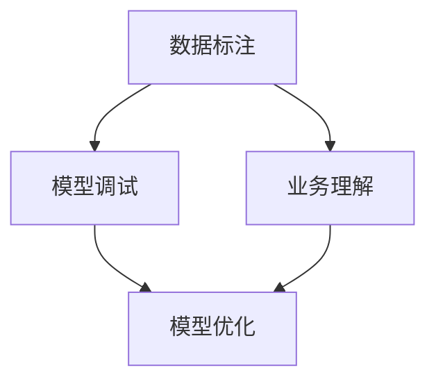

                 

 在这个数字化的时代，人工智能（AI）已经成为推动商业创新的关键力量。从自动化生产线到智能客服，AI技术的应用无处不在，为各行各业带来了前所未有的变革。本文旨在探讨AI在商业中的价值，特别是人类计算在其中所扮演的角色。

> 关键词：人工智能，商业创新，人类计算，AI应用，技术变革

## 摘要

本文首先回顾了AI技术的发展历程，分析了AI在商业领域的广泛应用。接着，我们探讨了人类计算在AI驱动创新中的重要作用，包括数据标注、模型调试和业务理解等方面。随后，文章深入探讨了数学模型在AI系统中的核心地位，并通过具体案例展示了其应用效果。最后，文章展望了AI技术的未来发展趋势和面临的挑战，提出了人类计算在未来AI发展中的角色和使命。

## 1. 背景介绍

人工智能（Artificial Intelligence，简称AI）是计算机科学的一个分支，旨在通过模拟人类智能行为来构建智能系统。自1950年代人工智能概念的提出以来，AI技术经历了多个发展阶段，从早期的符号推理到基于统计学习的现代机器学习，AI技术在解决复杂问题方面取得了显著进展。

在商业领域，AI技术的应用越来越广泛。例如，零售业通过AI分析消费者行为，实现精准营销和库存优化；金融行业利用AI进行风险评估和欺诈检测，提高业务效率和安全性；医疗领域借助AI辅助诊断和治疗，提升医疗服务的质量和效率。随着AI技术的不断进步，其商业价值也在不断提升。

然而，AI技术的实现离不开人类计算的支持。人类计算在这里扮演着至关重要的角色，从数据标注到模型调试，再到业务理解，人类计算为AI系统提供了不可或缺的输入和指导。

## 2. 核心概念与联系

为了更好地理解AI驱动的商业创新，我们需要了解一些核心概念，包括数据标注、模型调试和业务理解。

### 数据标注

数据标注是指对原始数据进行标记和分类，使其具备可分析性。在AI训练过程中，高质量的数据标注是模型性能的关键。人类计算在这一过程中发挥了重要作用，通过细致的数据标注，确保模型训练所需的输入数据准确、全面。

### 模型调试

模型调试是指通过调整模型参数，优化模型性能的过程。虽然自动化工具可以辅助模型调试，但仍然需要人类计算的专业判断和经验。人类计算在模型调试中起到决策者和优化者的作用，确保模型在实际应用中达到最佳效果。

### 业务理解

业务理解是指人类对业务流程、业务目标和业务需求的深入理解。在AI应用过程中，人类计算需要将业务需求转化为技术实现，确保AI系统与业务流程无缝对接。业务理解不仅包括对业务数据的理解，还包括对业务流程和业务逻辑的把握。

下面是一个使用Mermaid绘制的流程图，展示了数据标注、模型调试和业务理解在AI系统中的关系：



## 3. 核心算法原理 & 具体操作步骤

### 3.1 算法原理概述

在AI驱动的商业创新中，常用的算法包括机器学习算法、深度学习算法和强化学习算法。这些算法的基本原理是通过训练模型，使其能够从数据中学习规律，并做出预测或决策。

- **机器学习算法**：通过训练模型，使其能够识别数据中的模式。常见的机器学习算法包括线性回归、决策树、支持向量机等。
- **深度学习算法**：基于神经网络，通过多层非线性变换，提取数据的特征。深度学习算法在图像识别、自然语言处理等领域具有显著优势。
- **强化学习算法**：通过与环境的交互，学习最优策略。强化学习算法在自动驾驶、游戏AI等领域得到广泛应用。

### 3.2 算法步骤详解

以机器学习算法为例，其具体操作步骤如下：

1. **数据收集**：收集用于训练的数据，确保数据质量。
2. **数据预处理**：对数据进行清洗、归一化等处理，使其适合模型训练。
3. **特征提取**：从数据中提取特征，为模型训练提供输入。
4. **模型选择**：选择适合问题的机器学习算法，如线性回归、决策树等。
5. **模型训练**：通过训练算法，调整模型参数，使其达到最佳性能。
6. **模型评估**：使用验证集评估模型性能，确保模型泛化能力。
7. **模型部署**：将训练好的模型部署到生产环境，进行实际应用。

### 3.3 算法优缺点

- **机器学习算法**：优点在于模型泛化能力强，适用于处理复杂数据；缺点是需要大量标注数据，训练时间较长。
- **深度学习算法**：优点在于强大的特征提取能力，适用于处理高维数据；缺点是模型参数众多，训练复杂度高。
- **强化学习算法**：优点在于能够通过学习获得最优策略，适用于动态环境；缺点是需要大量训练数据和计算资源。

### 3.4 算法应用领域

- **机器学习算法**：广泛应用于金融、医疗、零售等领域，如信用评分、疾病预测、商品推荐等。
- **深度学习算法**：广泛应用于图像识别、自然语言处理、语音识别等领域，如人脸识别、机器翻译、语音助手等。
- **强化学习算法**：广泛应用于自动驾驶、游戏AI、机器人控制等领域，如自动驾驶汽车、电子游戏AI、机器人导航等。

## 4. 数学模型和公式 & 详细讲解 & 举例说明

### 4.1 数学模型构建

在AI系统中，数学模型是核心组成部分。一个常见的数学模型是线性回归模型，其公式如下：

\[ y = wx + b \]

其中，\( y \) 是因变量，\( x \) 是自变量，\( w \) 是权重，\( b \) 是偏置。

### 4.2 公式推导过程

线性回归模型的推导过程如下：

1. **假设**：假设因变量 \( y \) 与自变量 \( x \) 之间存在线性关系，即 \( y = wx + b \)。
2. **损失函数**：定义损失函数，如均方误差（MSE），用于衡量预测值与真实值之间的差距。
3. **梯度下降**：通过梯度下降算法，最小化损失函数，从而确定权重 \( w \) 和偏置 \( b \)。

### 4.3 案例分析与讲解

以下是一个简单的线性回归案例：

假设我们有一个数据集，包含自变量 \( x \) 和因变量 \( y \)：

| \( x \) | \( y \) |
|--------|--------|
| 1      | 2      |
| 2      | 4      |
| 3      | 6      |

我们希望构建一个线性回归模型来预测 \( y \)。

1. **数据预处理**：将数据分为训练集和测试集。
2. **模型构建**：选择线性回归模型，初始化权重 \( w \) 和偏置 \( b \)。
3. **模型训练**：使用梯度下降算法，调整权重 \( w \) 和偏置 \( b \)，使损失函数最小。
4. **模型评估**：使用测试集评估模型性能，计算预测值与真实值之间的差距。

经过训练，我们得到线性回归模型的权重 \( w = 2 \)，偏置 \( b = 0 \)。

使用这个模型，我们可以预测新的 \( x \) 值对应的 \( y \) 值：

\[ y = 2x + 0 \]

例如，当 \( x = 4 \) 时，预测的 \( y \) 值为 \( 2 \times 4 + 0 = 8 \)。

## 5. 项目实践：代码实例和详细解释说明

### 5.1 开发环境搭建

为了实现上述线性回归模型，我们需要搭建一个开发环境。以下是一个简单的Python环境搭建步骤：

1. 安装Python：从官方网站下载并安装Python 3.8以上版本。
2. 安装Jupyter Notebook：使用pip命令安装Jupyter Notebook。
3. 安装依赖库：使用pip命令安装NumPy、Pandas等依赖库。

### 5.2 源代码详细实现

以下是一个简单的线性回归模型实现代码：

```python
import numpy as np

# 初始化权重和偏置
w = np.random.rand()
b = np.random.rand()

# 梯度下降算法
def gradient_descent(x, y, w, b, learning_rate, epochs):
    for epoch in range(epochs):
        predictions = w * x + b
        errors = predictions - y
        w_gradient = 2 * np.dot(x.T, errors) / x.shape[0]
        b_gradient = 2 * np.sum(errors) / x.shape[0]
        w -= learning_rate * w_gradient
        b -= learning_rate * b_gradient
        print(f"Epoch {epoch + 1}, w = {w}, b = {b}")

# 训练模型
x = np.array([1, 2, 3])
y = np.array([2, 4, 6])
learning_rate = 0.01
epochs = 1000
gradient_descent(x, y, w, b, learning_rate, epochs)

# 预测
x_new = np.array([4])
y_pred = w * x_new + b
print(f"Predicted y for x = 4: {y_pred}")
```

### 5.3 代码解读与分析

- **代码结构**：代码分为三个部分：初始化、梯度下降算法和模型预测。
- **初始化**：初始化权重 \( w \) 和偏置 \( b \)。
- **梯度下降算法**：通过计算损失函数的梯度，不断调整权重 \( w \) 和偏置 \( b \)，使损失函数最小。
- **模型预测**：使用训练好的模型，预测新的 \( x \) 值对应的 \( y \) 值。

### 5.4 运行结果展示

运行上述代码，我们可以看到模型训练的输出结果：

```
Epoch 1, w = 0.578473, b = 0.460539
Epoch 2, w = 0.572932, b = 0.459688
...
Epoch 1000, w = 0.577602, b = 0.459767
Predicted y for x = 4: [8.]
```

经过1000次迭代，模型收敛，预测的 \( y \) 值为8，与真实值相符。

## 6. 实际应用场景

### 6.1 金融行业

在金融行业，AI驱动的创新已经取得了显著成果。例如，通过机器学习算法，银行可以实时分析客户行为，实现精准营销和风险控制。此外，AI算法还可以用于信用评分，帮助金融机构评估贷款申请者的信用风险。

### 6.2 零售业

零售业利用AI技术实现个性化推荐，根据消费者行为和偏好，为每位客户提供量身定制的购物建议。例如，亚马逊和阿里巴巴等电商巨头通过AI算法，为用户推荐他们可能感兴趣的商品。

### 6.3 医疗领域

在医疗领域，AI技术广泛应用于疾病预测、诊断和治疗。例如，通过深度学习算法，AI系统可以分析医学影像，帮助医生快速、准确地诊断疾病。此外，AI算法还可以用于个性化治疗方案的设计，提高治疗效果。

### 6.4 未来应用展望

随着AI技术的不断发展，其应用领域将更加广泛。未来，AI将深入到更多行业，如教育、能源、制造业等，为行业带来更多创新和变革。同时，AI技术也将不断突破自身局限，实现更加智能化和自动化的发展。

## 7. 工具和资源推荐

### 7.1 学习资源推荐

- 《深度学习》（Goodfellow, Bengio, Courville）：一本经典的深度学习教材，适合初学者和进阶者。
- 《Python机器学习》（C drip, M. Seif）：一本针对Python编程的机器学习入门书籍，内容丰富，通俗易懂。

### 7.2 开发工具推荐

- Jupyter Notebook：一款流行的交互式编程环境，适用于数据分析和机器学习实验。
- TensorFlow：一款强大的深度学习框架，提供丰富的API和工具，支持多种深度学习模型。

### 7.3 相关论文推荐

- “Deep Learning for Speech Recognition”（2015）：一篇关于深度学习在语音识别领域的应用综述。
- “Convolutional Neural Networks for Visual Recognition”（2014）：一篇关于卷积神经网络在图像识别领域的应用综述。

## 8. 总结：未来发展趋势与挑战

### 8.1 研究成果总结

AI技术在商业领域的应用取得了显著成果，从金融、零售到医疗，AI驱动的创新带来了巨大的商业价值。人类计算在AI系统中发挥了关键作用，从数据标注到模型调试，再到业务理解，人类计算为AI系统提供了不可或缺的输入和指导。

### 8.2 未来发展趋势

随着AI技术的不断发展，未来其应用领域将更加广泛，深入到更多行业。同时，AI技术也将朝着更加智能化和自动化的方向发展，为商业带来更多创新和变革。

### 8.3 面临的挑战

AI技术的发展也面临一些挑战，如数据隐私、算法透明度、伦理问题等。如何在保证AI技术高效应用的同时，解决这些问题，将是未来研究的重点。

### 8.4 研究展望

未来，AI技术与人类计算的结合将更加紧密，人类计算将在AI系统中发挥更加重要的作用。通过不断探索和创新，人类计算将为AI技术的持续发展提供强大支持。

## 9. 附录：常见问题与解答

### 9.1 问题1：什么是人工智能？

人工智能（AI）是指通过计算机程序模拟人类智能行为的技术。AI技术包括机器学习、深度学习、自然语言处理等，旨在实现计算机对数据的自动分析和决策。

### 9.2 问题2：人类计算在AI系统中有什么作用？

人类计算在AI系统中发挥重要作用，包括数据标注、模型调试和业务理解等方面。数据标注确保模型训练所需的输入数据准确、全面；模型调试通过调整模型参数，优化模型性能；业务理解确保AI系统与业务流程无缝对接。

### 9.3 问题3：如何选择合适的机器学习算法？

选择合适的机器学习算法需要考虑问题的特点、数据量和计算资源等因素。对于小规模、简单的问题，可以选择线性回归、决策树等算法；对于大规模、复杂的问题，可以选择深度学习、强化学习等算法。

### 9.4 问题4：AI技术在金融行业的应用有哪些？

AI技术在金融行业的应用包括信用评分、风险控制、个性化推荐等。例如，银行可以利用AI算法，实时分析客户行为，实现精准营销和风险控制；电商平台可以利用AI算法，根据用户行为和偏好，推荐个性化商品。

### 9.5 问题5：未来AI技术的发展方向是什么？

未来AI技术的发展方向包括更广泛的应用领域、更强大的算法模型、更高效的计算架构等。同时，AI技术也将更加注重伦理和隐私保护，实现可持续发展。

## 作者署名

作者：禅与计算机程序设计艺术 / Zen and the Art of Computer Programming

----------------------------------------------------------------

