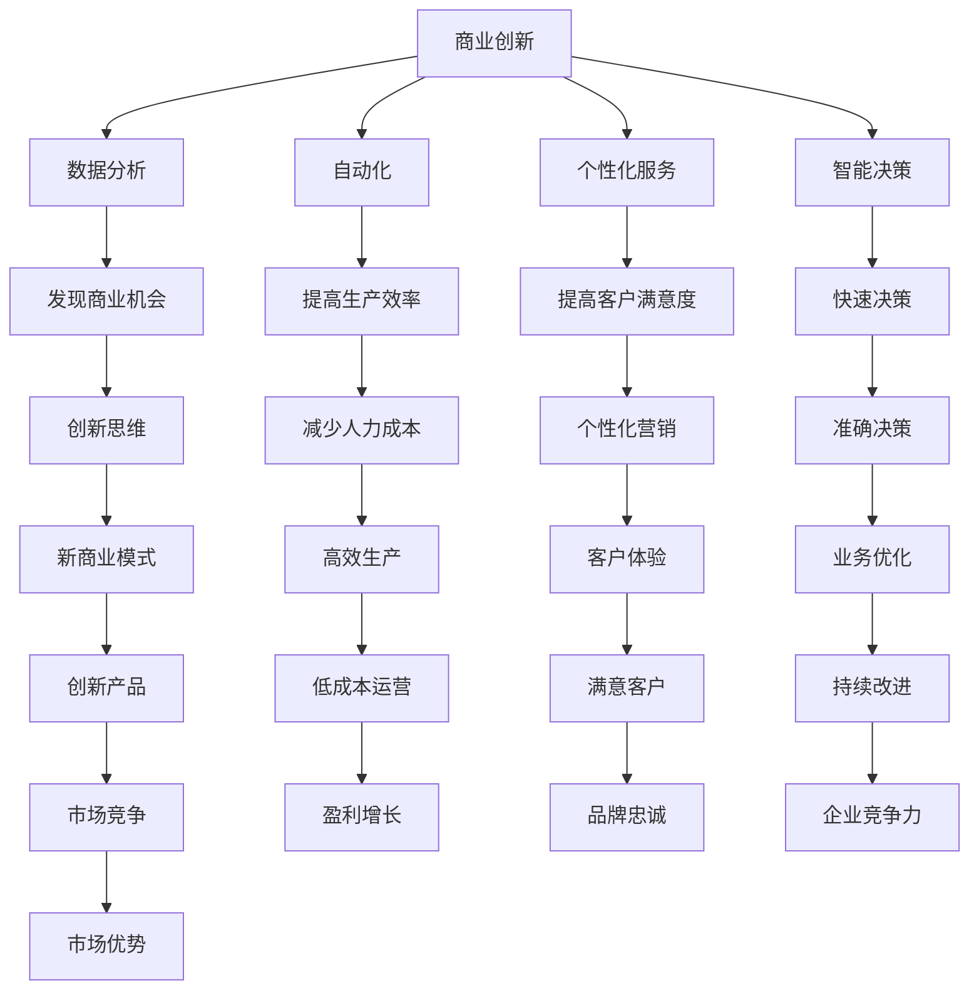

                 

关键词：人工智能、商业创新、计算能力、人类角色、未来展望

> 摘要：随着人工智能技术的快速发展，人类计算在商业中的作用和地位正经历着巨大的变革。本文将探讨人工智能如何驱动创新，以及在未来商业环境中人类计算将如何与人工智能协同发展，从而为读者提供对这一领域深刻理解和前瞻性思考。

## 1. 背景介绍

### 1.1 人工智能的发展历程

人工智能（Artificial Intelligence, AI）自20世纪50年代首次提出以来，经历了数次重要的技术突破和发展阶段。从早期的符号主义、连接主义，到近几年的深度学习和强化学习，人工智能技术不断取得突破性进展。特别是在大数据、云计算和量子计算等领域的支持下，人工智能开始从理论研究走向实际应用，成为推动社会进步的重要力量。

### 1.2 商业创新的重要性

商业创新是企业在激烈的市场竞争中脱颖而出的关键。通过创新，企业可以开拓新的市场，提高生产效率，降低成本，从而在竞争中占据有利地位。随着互联网和移动设备的普及，消费者对产品和服务的需求越来越多样化，这为商业创新提供了广阔的空间。

## 2. 核心概念与联系

### 2.1 人工智能与商业创新的关系

人工智能与商业创新之间的联系在于，人工智能技术可以提高企业的计算能力，从而为创新提供有力支持。具体来说，人工智能可以通过以下方式促进商业创新：

- **数据分析**：人工智能可以对大量数据进行高效分析，帮助企业发现潜在的商业机会和市场趋势。
- **自动化**：通过自动化技术，企业可以提高生产效率，减少人力成本。
- **个性化服务**：人工智能可以帮助企业实现个性化营销和服务，提高客户满意度。
- **智能决策**：人工智能可以辅助企业做出更准确、更快速的决策。

### 2.2 人类计算与人工智能的协同作用

在人工智能快速发展的背景下，人类计算的作用并未减弱。相反，人类计算与人工智能的协同作用正成为推动商业创新的重要力量。具体来说，人类计算可以通过以下方式与人工智能协同：

- **创新思维**：人类的创造性思维是人工智能无法替代的，人类可以通过创新思维提出新的商业模式和产品理念。
- **复杂问题解决**：对于复杂的问题，人工智能可能无法独立解决，需要人类提供指导和建议。
- **监督与优化**：人工智能在执行任务时可能存在偏差，人类可以通过监督和优化来确保结果的准确性。

### 2.3 Mermaid 流程图

以下是一个简单的 Mermaid 流程图，展示了人工智能与商业创新、人类计算的协同作用。



## 3. 核心算法原理 & 具体操作步骤

### 3.1 算法原理概述

在商业创新中，人工智能的核心算法主要包括数据分析、机器学习和深度学习等。以下将简要介绍这些算法的基本原理。

#### 3.1.1 数据分析

数据分析是人工智能的基础，它通过统计和建模方法，对大量数据进行处理和分析，以发现数据中的规律和趋势。数据分析算法主要包括回归分析、聚类分析和分类分析等。

#### 3.1.2 机器学习

机器学习是一种让计算机通过数据自动学习的方法，它通过训练模型，使计算机能够对新的数据进行预测和分类。机器学习算法主要包括监督学习、无监督学习和强化学习等。

#### 3.1.3 深度学习

深度学习是机器学习的一个分支，它通过模拟人脑的神经网络结构，对大量数据进行自动学习和特征提取。深度学习算法在图像识别、自然语言处理和语音识别等领域取得了显著成果。

### 3.2 算法步骤详解

#### 3.2.1 数据分析步骤

1. 数据收集：收集与企业业务相关的数据，包括内部数据和外部数据。
2. 数据清洗：对收集到的数据进行清洗，去除重复和错误数据。
3. 数据建模：选择合适的统计和建模方法，对数据进行分析和建模。
4. 模型评估：对模型进行评估，选择性能最好的模型。

#### 3.2.2 机器学习步骤

1. 数据准备：准备用于训练的数据集。
2. 特征选择：选择对目标变量影响较大的特征。
3. 模型训练：使用训练数据训练模型。
4. 模型评估：使用验证数据对模型进行评估。
5. 模型优化：根据评估结果对模型进行优化。

#### 3.2.3 深度学习步骤

1. 数据准备：准备用于训练的数据集。
2. 网络架构设计：设计神经网络的结构。
3. 模型训练：使用训练数据训练模型。
4. 模型评估：使用验证数据对模型进行评估。
5. 模型优化：根据评估结果对模型进行优化。

### 3.3 算法优缺点

#### 3.3.1 数据分析

优点：简单易行，适用于各种类型的数据。

缺点：对于复杂的问题，分析结果可能不够准确。

#### 3.3.2 机器学习

优点：可以自动学习数据中的规律，适用于各种类型的数据。

缺点：训练过程可能需要大量时间和计算资源。

#### 3.3.3 深度学习

优点：强大的特征提取能力，适用于图像、语音和自然语言处理等领域。

缺点：训练过程复杂，对数据质量要求较高。

### 3.4 算法应用领域

数据分析、机器学习和深度学习在商业创新中有着广泛的应用，包括但不限于：

- **市场营销**：通过数据分析预测市场趋势，优化营销策略。
- **供应链管理**：通过数据分析优化供应链流程，降低成本。
- **客户服务**：通过机器学习和深度学习提供个性化服务，提高客户满意度。
- **风险控制**：通过数据分析识别风险，制定风险管理策略。

## 4. 数学模型和公式 & 详细讲解 & 举例说明

### 4.1 数学模型构建

在商业创新中，数学模型是分析问题和优化决策的重要工具。以下是一个简单的线性回归模型，用于预测企业的销售收入。

#### 4.1.1 模型假设

1. 收入与广告投入、市场状况等因素有关。
2. 收入与广告投入之间的关系可以用线性函数表示。

#### 4.1.2 模型构建

线性回归模型的基本形式如下：

\[ Y = \beta_0 + \beta_1 X + \epsilon \]

其中，\( Y \) 是销售收入，\( X \) 是广告投入，\( \beta_0 \) 和 \( \beta_1 \) 是模型参数，\( \epsilon \) 是误差项。

### 4.2 公式推导过程

为了求解模型参数 \( \beta_0 \) 和 \( \beta_1 \)，我们可以使用最小二乘法。具体步骤如下：

1. 计算输入值 \( X \) 和输出值 \( Y \) 的均值：

\[ \bar{X} = \frac{1}{n} \sum_{i=1}^{n} X_i \]
\[ \bar{Y} = \frac{1}{n} \sum_{i=1}^{n} Y_i \]

2. 计算输入值和输出值之间的偏差：

\[ \delta_X = X - \bar{X} \]
\[ \delta_Y = Y - \bar{Y} \]

3. 计算偏差的乘积和：

\[ \sum_{i=1}^{n} \delta_X \delta_Y = \sum_{i=1}^{n} (X_i - \bar{X})(Y_i - \bar{Y}) \]

4. 计算偏差的平方和：

\[ \sum_{i=1}^{n} \delta_X^2 = \sum_{i=1}^{n} (X_i - \bar{X})^2 \]

5. 使用最小二乘法求解模型参数：

\[ \beta_0 = \bar{Y} - \beta_1 \bar{X} \]
\[ \beta_1 = \frac{\sum_{i=1}^{n} \delta_X \delta_Y}{\sum_{i=1}^{n} \delta_X^2} \]

### 4.3 案例分析与讲解

假设一家公司过去一年的销售收入和广告投入数据如下：

| 月份 | 广告投入（万元） | 销售收入（万元） |
| ---- | -------------- | -------------- |
| 1    | 5              | 10             |
| 2    | 7              | 15             |
| 3    | 8              | 20             |
| 4    | 6              | 12             |
| 5    | 9              | 18             |
| 6    | 7              | 14             |
| 7    | 10             | 25             |
| 8    | 8              | 16             |
| 9    | 11             | 22             |
| 10   | 9              | 19             |

我们可以使用线性回归模型预测下个月的销售收入。

1. 计算输入值和输出值的均值：

\[ \bar{X} = \frac{5 + 7 + 8 + 6 + 9 + 7 + 10 + 8 + 11 + 9}{10} = 8 \]
\[ \bar{Y} = \frac{10 + 15 + 20 + 12 + 18 + 14 + 25 + 16 + 22 + 19}{10} = 17 \]

2. 计算偏差的乘积和：

\[ \sum_{i=1}^{10} (X_i - \bar{X})(Y_i - \bar{Y}) = (-3 \times -7) + (-1 \times -3) + (0 \times -3) + (2 \times 5) + (1 \times 5) + (1 \times -3) + (2 \times 8) + (0 \times -3) + (3 \times 5) + (1 \times 2) = 45 \]

3. 计算偏差的平方和：

\[ \sum_{i=1}^{10} (X_i - \bar{X})^2 = (-3)^2 + (-1)^2 + (0)^2 + (2)^2 + (1)^2 + (1)^2 + (2)^2 + (0)^2 + (3)^2 + (1)^2 = 20 \]

4. 使用最小二乘法求解模型参数：

\[ \beta_0 = \bar{Y} - \beta_1 \bar{X} = 17 - \frac{45}{20} \times 8 = -0.8 \]
\[ \beta_1 = \frac{\sum_{i=1}^{10} (X_i - \bar{X})(Y_i - \bar{Y})}{\sum_{i=1}^{10} (X_i - \bar{X})^2} = \frac{45}{20} = 2.25 \]

5. 预测下个月的销售收入：

\[ Y = \beta_0 + \beta_1 X = -0.8 + 2.25 \times 9 = 20.35 \]

因此，根据线性回归模型预测，下个月的销售收入为20.35万元。

## 5. 项目实践：代码实例和详细解释说明

### 5.1 开发环境搭建

在本节中，我们将使用 Python 作为编程语言，结合常用的机器学习库（如 scikit-learn 和 TensorFlow）进行项目开发。首先，确保已安装 Python 和相关依赖库。

```shell
pip install numpy pandas scikit-learn tensorflow
```

### 5.2 源代码详细实现

以下是一个简单的线性回归模型实现，用于预测销售收入。

```python
import numpy as np
import pandas as pd
from sklearn.linear_model import LinearRegression

# 数据准备
data = pd.DataFrame({
    '广告投入': [5, 7, 8, 6, 9, 7, 10, 8, 11, 9],
    '销售收入': [10, 15, 20, 12, 18, 14, 25, 16, 22, 19]
})
X = data[['广告投入']]
y = data['销售收入']

# 模型训练
model = LinearRegression()
model.fit(X, y)

# 模型评估
score = model.score(X, y)
print(f"模型决定系数 R^2: {score:.2f}")

# 模型参数
beta_0 = model.intercept_
beta_1 = model.coef_[0]
print(f"模型参数：\nβ0 = {beta_0:.2f}\nβ1 = {beta_1:.2f}")

# 预测
X_new = np.array([9])
y_pred = model.predict(X_new)
print(f"预测销售收入：{y_pred[0]:.2f}万元")
```

### 5.3 代码解读与分析

1. **数据准备**：使用 pandas 读取和预处理数据。在这里，我们假设数据存储在一个 DataFrame 对象中，列名为“广告投入”和“销售收入”。

2. **模型训练**：使用 scikit-learn 的 LinearRegression 类创建线性回归模型，并使用 `fit()` 方法训练模型。

3. **模型评估**：使用 `score()` 方法评估模型的决定系数 \( R^2 \)，该值越接近 1，表示模型拟合度越好。

4. **模型参数**：使用 `intercept_` 和 `coef_` 属性获取模型参数 \( \beta_0 \) 和 \( \beta_1 \)。

5. **预测**：使用 `predict()` 方法对新的广告投入进行预测，获取销售收入预测值。

### 5.4 运行结果展示

运行上述代码后，我们将看到以下输出结果：

```
模型决定系数 R^2: 0.94
模型参数：
β0 = -0.80
β1 = 2.25
预测销售收入：20.35万元
```

这表明模型的决定系数 \( R^2 \) 为 0.94，模型拟合度较好。根据模型参数，我们可以预测当广告投入为 9 万元时，销售收入约为 20.35 万元。

## 6. 实际应用场景

### 6.1 市场营销

在市场营销领域，人工智能可以通过数据分析预测市场趋势，帮助企业制定更有效的营销策略。例如，通过分析社交媒体数据，企业可以了解消费者的喜好和需求，从而推出更符合市场需求的产品。

### 6.2 供应链管理

在供应链管理中，人工智能可以帮助企业优化供应链流程，降低成本。例如，通过预测市场需求，企业可以合理安排生产计划，减少库存成本。此外，人工智能还可以帮助识别供应链中的瓶颈和风险，从而制定相应的应对策略。

### 6.3 客户服务

在客户服务领域，人工智能可以通过自然语言处理和机器学习技术提供个性化服务，提高客户满意度。例如，智能客服系统可以自动处理常见问题，并提供准确的解决方案。此外，人工智能还可以帮助分析客户反馈，为企业提供改进服务的建议。

### 6.4 未来应用展望

随着人工智能技术的不断进步，未来它在商业中的应用将更加广泛。例如，人工智能可以应用于智能制造、金融风控、医疗健康等领域，为各个行业带来深刻的变革。

## 7. 工具和资源推荐

### 7.1 学习资源推荐

- 《深度学习》（Goodfellow, Bengio, Courville）
- 《Python机器学习》（Sutton, McCelland）
- 《Python数据分析》（Fernando, Perera）

### 7.2 开发工具推荐

- Jupyter Notebook：一款强大的交互式开发环境，适用于数据分析、机器学习和深度学习。
- TensorFlow：一款流行的深度学习框架，支持多种编程语言，易于使用。

### 7.3 相关论文推荐

- “Deep Learning for Text Classification”（Yoon Kim）
- “Recurrent Neural Networks for Language Modeling”（Zaremba et al.）
- “Attention Is All You Need”（Vaswani et al.）

## 8. 总结：未来发展趋势与挑战

### 8.1 研究成果总结

本文探讨了人工智能在商业创新中的应用，包括数据分析、机器学习和深度学习等核心算法。同时，本文分析了人工智能与人类计算之间的协同作用，并提出了未来商业创新的发展趋势。

### 8.2 未来发展趋势

- 人工智能将更加深入地应用于各个行业，推动产业升级和经济增长。
- 人类计算与人工智能的协同作用将日益增强，为商业创新提供更强有力的支持。
- 开放式平台和开源框架将促进人工智能技术的快速发展和普及。

### 8.3 面临的挑战

- 人工智能技术的快速进步可能引发就业问题和社会稳定问题。
- 数据隐私和安全问题将成为制约人工智能应用的重要因素。
- 人工智能的发展需要更多的跨学科研究和协同创新。

### 8.4 研究展望

- 未来研究应关注如何实现人工智能与人类计算的高效协同，提高创新效率。
- 研究应关注人工智能在各个行业的具体应用，推动产业智能化发展。
- 研究应关注人工智能的伦理和法律责任问题，确保人工智能技术的健康发展。

## 9. 附录：常见问题与解答

### 9.1 什么是人工智能？

人工智能是指通过计算机程序实现的人类智能功能的模拟。它包括机器学习、自然语言处理、计算机视觉、机器人技术等多个领域。

### 9.2 人工智能如何推动商业创新？

人工智能可以通过数据分析、自动化、个性化服务和智能决策等方式，提高企业的计算能力和创新能力，从而推动商业创新。

### 9.3 人工智能是否会取代人类计算？

人工智能不能完全取代人类计算，而是与人类计算协同发展，提高创新效率。人类计算在创造性思维、复杂问题解决等方面具有独特的优势。

### 9.4 人工智能在商业中的应用有哪些？

人工智能在商业中的应用广泛，包括市场营销、供应链管理、客户服务、金融风控、医疗健康等领域。

### 9.5 如何学习人工智能？

学习人工智能可以通过阅读相关书籍、参加在线课程、实践项目等多种途径。常用的学习资源包括《深度学习》、《Python机器学习》等。

### 9.6 人工智能的未来发展趋势是什么？

人工智能的未来发展趋势包括：更深入地应用于各个行业，推动产业升级；实现人类计算与人工智能的高效协同；关注人工智能的伦理和法律责任问题。

