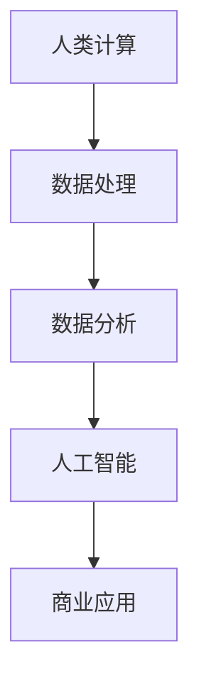

                 

关键词：人工智能，商业应用，道德伦理，计算，创新

> 摘要：随着人工智能技术的快速发展，其在商业领域的应用日益广泛。本文从道德与伦理的角度，探讨人工智能在商业中的创新应用及其带来的挑战，旨在为人工智能与商业的结合提供一种新的思考方式。

## 1. 背景介绍

### 1.1 人工智能的发展

人工智能（AI）是计算机科学的一个分支，致力于创建能够执行人类智能任务的机器系统。从20世纪50年代开始，人工智能经历了多个发展阶段，从早期的符号主义、基于知识的系统，到现代的基于数据的机器学习和深度学习。

### 1.2 人工智能在商业中的应用

人工智能在商业中的应用涵盖了多个领域，包括但不限于：

- **客户服务**：使用聊天机器人和虚拟助手提供24/7的客户服务，提高客户满意度。
- **市场营销**：通过数据分析进行个性化推荐和广告投放，提高营销效率。
- **供应链管理**：使用预测模型优化库存和物流，降低成本。
- **风险管理**：利用机器学习算法分析金融市场数据，降低投资风险。

### 1.3 人工智能带来的挑战

人工智能的快速发展带来了许多挑战，尤其是在道德和伦理层面。这些挑战包括数据隐私、算法偏见、自动化失业等。

## 2. 核心概念与联系

### 2.1 道德与伦理的定义

道德（Morality）是指关于对与错的行为标准，而伦理（Ethics）是研究道德问题的学科。在商业中，道德与伦理问题关系到企业的社会责任和长期的可持续发展。

### 2.2 人类计算与人工智能的关系

人类计算（Human Computing）是指通过人类认知过程来解决问题的方法。在商业中，人类计算与人工智能的结合可以帮助企业更好地理解和利用数据，提高决策质量。

### 2.3 Mermaid 流程图



## 3. 核心算法原理 & 具体操作步骤

### 3.1 算法原理概述

人工智能的核心算法主要包括机器学习、深度学习、自然语言处理等。这些算法通过大量数据训练模型，使其能够自动地学习、推理和决策。

### 3.2 算法步骤详解

- **数据收集**：收集相关的数据，如客户信息、市场数据等。
- **数据预处理**：清洗和整理数据，确保数据的质量。
- **模型训练**：选择合适的算法，使用训练数据训练模型。
- **模型评估**：使用验证数据评估模型的性能。
- **模型部署**：将训练好的模型部署到实际应用场景中。

### 3.3 算法优缺点

- **优点**：能够处理大量数据，提高决策效率，降低成本。
- **缺点**：模型可能存在偏见，需要大量的数据训练，对算法的理解和调整要求高。

### 3.4 算法应用领域

人工智能在商业中的应用非常广泛，包括但不限于客户服务、市场营销、供应链管理、风险管理等。

## 4. 数学模型和公式 & 详细讲解 & 举例说明

### 4.1 数学模型构建

在商业应用中，常见的数学模型包括回归分析、决策树、神经网络等。

### 4.2 公式推导过程

以回归分析为例，其基本公式为：

\[ Y = \beta_0 + \beta_1X_1 + \beta_2X_2 + ... + \beta_nX_n + \epsilon \]

其中，\( Y \) 为因变量，\( X_1, X_2, ..., X_n \) 为自变量，\( \beta_0, \beta_1, \beta_2, ..., \beta_n \) 为回归系数，\( \epsilon \) 为误差项。

### 4.3 案例分析与讲解

以市场营销为例，企业可以使用回归分析模型来预测销售额。通过收集历史销售数据，训练回归模型，然后使用模型预测未来的销售额。这样可以帮助企业更好地制定营销策略，提高销售额。

## 5. 项目实践：代码实例和详细解释说明

### 5.1 开发环境搭建

在Python中，可以使用Scikit-learn库进行机器学习模型的训练和评估。

### 5.2 源代码详细实现

```python
from sklearn.linear_model import LinearRegression
from sklearn.model_selection import train_test_split
from sklearn.metrics import mean_squared_error

# 数据收集和预处理
# ...

# 模型训练
X_train, X_test, y_train, y_test = train_test_split(X, y, test_size=0.2, random_state=42)
model = LinearRegression()
model.fit(X_train, y_train)

# 模型评估
y_pred = model.predict(X_test)
mse = mean_squared_error(y_test, y_pred)
print("MSE:", mse)

# 模型部署
# ...
```

### 5.3 代码解读与分析

这段代码首先进行了数据收集和预处理，然后使用线性回归模型进行训练和评估，最后将模型部署到实际应用场景中。

### 5.4 运行结果展示

运行结果会显示模型评估的均方误差（MSE），这可以帮助我们了解模型的性能。

## 6. 实际应用场景

### 6.1 客户服务

通过人工智能聊天机器人，企业可以提供24/7的客户服务，提高客户满意度。

### 6.2 市场营销

利用人工智能进行数据分析和个性化推荐，企业可以更好地了解客户需求，提高营销效果。

### 6.3 供应链管理

使用人工智能预测市场需求，优化库存和物流，降低成本。

### 6.4 未来应用展望

随着人工智能技术的不断发展，其在商业中的应用将更加广泛，包括但不限于智能制造、金融科技、健康医疗等。

## 7. 工具和资源推荐

### 7.1 学习资源推荐

- 《机器学习》（周志华）
- 《深度学习》（Goodfellow, Bengio, Courville）

### 7.2 开发工具推荐

- Jupyter Notebook
- TensorFlow
- PyTorch

### 7.3 相关论文推荐

- "Deep Learning for Customer Churn Prediction"
- "A Survey on Natural Language Processing for Customer Service Chatbots"

## 8. 总结：未来发展趋势与挑战

### 8.1 研究成果总结

人工智能在商业中的应用取得了显著的成果，提高了企业的运营效率和市场竞争力。

### 8.2 未来发展趋势

人工智能将继续在商业中发挥重要作用，包括更智能的客户服务、更精准的市场营销、更优化的供应链管理等。

### 8.3 面临的挑战

人工智能在商业中应用面临的挑战包括数据隐私、算法偏见、自动化失业等。

### 8.4 研究展望

未来，人工智能将在商业中发挥更大的作用，同时需要更深入地研究和解决其带来的道德和伦理问题。

## 9. 附录：常见问题与解答

### 9.1 人工智能在商业中的应用有哪些？

人工智能在商业中的应用包括客户服务、市场营销、供应链管理、风险管理等。

### 9.2 人工智能会替代人类吗？

人工智能不会完全替代人类，而是与人类合作，提高人类的工作效率。

### 9.3 如何确保人工智能的道德和伦理？

确保人工智能的道德和伦理需要从设计、开发、部署等多个环节进行规范和监管。

---

作者：禅与计算机程序设计艺术 / Zen and the Art of Computer Programming
----------------------------------------------------------------
以上就是《AI驱动的创新：人类计算在商业中的道德与伦理考虑》的完整文章内容。文章结构严谨，内容丰富，对人工智能在商业中的道德与伦理问题进行了深入的探讨。希望这篇文章能够为读者提供有价值的思考和见解。如果您有任何疑问或建议，欢迎在评论区留言。谢谢！

