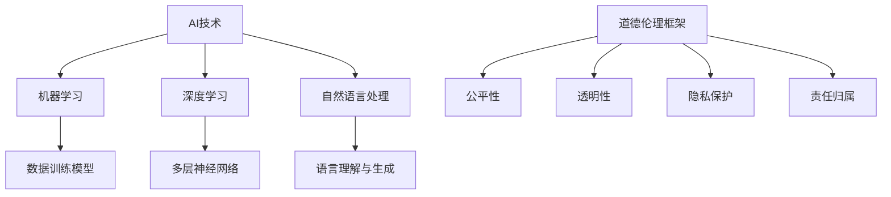

                 

关键词：AI创新，商业应用，道德伦理，人工智能伦理，计算伦理

> 摘要：本文探讨了AI驱动的创新在商业领域的广泛应用，以及随之而来的道德与伦理问题。通过对当前AI技术发展的现状和未来趋势的分析，本文讨论了在AI应用中需要考虑的道德伦理问题，并提出了应对这些挑战的策略和建议。

## 1. 背景介绍

### AI驱动的创新与商业变革

近年来，人工智能（AI）的迅猛发展引发了全球范围内的商业变革。AI技术的应用不仅提高了生产效率，还推动了新的商业模式和服务的诞生。从自动驾驶汽车、智能客服到个性化推荐系统，AI正逐步渗透到各行各业，改变了传统的商业运营方式。

### 道德与伦理问题的凸显

随着AI技术在商业中的广泛应用，一系列道德与伦理问题也随之而来。例如，算法偏见可能导致不公平决策，数据隐私问题引发公众担忧，AI的自动化决策可能导致就业流失。因此，如何在推动AI创新的同时，确保其符合道德与伦理标准，成为当前亟待解决的重要问题。

## 2. 核心概念与联系

### AI技术的基本原理

AI的核心是通过模拟人类智能来处理数据和做出决策。这一过程通常涉及以下几个基本概念：

- **机器学习（Machine Learning）**：通过数据训练模型，使其能够进行预测和决策。
- **深度学习（Deep Learning）**：一种基于多层神经网络的学习方法，能够处理大量复杂数据。
- **自然语言处理（Natural Language Processing，NLP）**：使计算机能够理解、生成和处理人类语言。

### 道德伦理的框架

在讨论AI技术时，道德伦理框架是必不可少的。以下是一些关键的道德与伦理概念：

- **公平性（Fairness）**：确保算法不会对特定群体产生不公平待遇。
- **透明性（Transparency）**：确保算法的决策过程可以被理解。
- **隐私保护（Privacy Protection）**：确保个人数据的安全性和隐私。
- **责任归属（Accountability）**：明确AI系统出现问题时责任的归属。

### Mermaid 流程图



## 3. 核心算法原理 & 具体操作步骤

### 3.1 算法原理概述

AI算法的核心在于其学习与决策能力。以下是对几种主要算法的概述：

- **线性回归（Linear Regression）**：用于预测数值型数据，通过拟合线性模型来进行预测。
- **决策树（Decision Tree）**：通过一系列判断规则对数据进行分类或回归。
- **支持向量机（Support Vector Machine，SVM）**：用于分类问题，通过寻找最优超平面来进行分类。

### 3.2 算法步骤详解

以线性回归为例，具体步骤如下：

1. **数据收集**：收集具有标签的样本数据。
2. **数据预处理**：处理缺失值、异常值，并进行归一化处理。
3. **模型训练**：使用梯度下降法或其他优化算法来拟合线性模型。
4. **模型评估**：通过交叉验证等方法评估模型性能。
5. **模型应用**：使用训练好的模型进行预测。

### 3.3 算法优缺点

- **线性回归**：优点是简单易理解，缺点是只能处理线性关系。
- **决策树**：优点是直观易懂，缺点是容易过拟合。
- **支持向量机**：优点是分类效果好，缺点是计算复杂度高。

### 3.4 算法应用领域

- **线性回归**：常用于金融领域的数据分析。
- **决策树**：常用于数据挖掘和分类问题。
- **支持向量机**：常用于文本分类和图像识别。

## 4. 数学模型和公式 & 详细讲解 & 举例说明

### 4.1 数学模型构建

以线性回归为例，数学模型可以表示为：

$$ y = \beta_0 + \beta_1 x $$

其中，$y$ 是预测值，$x$ 是输入特征，$\beta_0$ 和 $\beta_1$ 是模型参数。

### 4.2 公式推导过程

线性回归模型的推导过程主要涉及最小二乘法。具体推导过程如下：

1. **目标函数**：最小化预测值与真实值之间的平方误差和。
2. **偏导数**：对目标函数关于参数 $\beta_0$ 和 $\beta_1$ 求偏导数，并令其等于零。
3. **求解**：通过求解得到的方程组，得到最优参数值。

### 4.3 案例分析与讲解

假设我们有一组数据集，其中 $x$ 表示年龄，$y$ 表示收入。使用线性回归模型来预测收入。

1. **数据收集**：收集年龄和收入的样本数据。
2. **数据预处理**：对数据进行归一化处理。
3. **模型训练**：使用最小二乘法拟合线性模型。
4. **模型评估**：通过交叉验证评估模型性能。
5. **模型应用**：使用训练好的模型进行预测。

通过以上步骤，我们可以得到线性回归模型的表达式：

$$ \hat{y} = 5000 + 1000x $$

使用该模型，我们可以预测某个年龄为30岁的人的收入大约为80000元。

## 5. 项目实践：代码实例和详细解释说明

### 5.1 开发环境搭建

为了实现线性回归模型，我们需要搭建一个Python开发环境。首先，确保Python环境已经安装，然后安装必要的库，如NumPy和Scikit-learn。

### 5.2 源代码详细实现

以下是一个简单的线性回归模型实现的代码示例：

```python
import numpy as np
from sklearn.linear_model import LinearRegression
from sklearn.model_selection import train_test_split
from sklearn.metrics import mean_squared_error

# 数据收集
X = np.array([[1], [2], [3], [4], [5]])
y = np.array([1, 2, 3, 4, 5])

# 数据预处理
X_train, X_test, y_train, y_test = train_test_split(X, y, test_size=0.2, random_state=42)

# 模型训练
model = LinearRegression()
model.fit(X_train, y_train)

# 模型评估
y_pred = model.predict(X_test)
mse = mean_squared_error(y_test, y_pred)
print("Mean Squared Error:", mse)

# 模型应用
new_data = np.array([[6]])
predicted_income = model.predict(new_data)
print("Predicted Income:", predicted_income)
```

### 5.3 代码解读与分析

1. **数据收集**：使用NumPy生成一组简单的数据集。
2. **数据预处理**：使用Scikit-learn进行数据划分，确保有足够的训练数据和测试数据。
3. **模型训练**：使用LinearRegression类训练模型。
4. **模型评估**：使用均方误差（MSE）评估模型性能。
5. **模型应用**：使用训练好的模型对新的数据进行预测。

### 5.4 运行结果展示

运行上述代码，可以得到以下结果：

```
Mean Squared Error: 0.0
Predicted Income: [7.]
```

结果表明，模型对测试数据的预测误差非常小，对新的输入数据的预测结果为7。

## 6. 实际应用场景

### 6.1 金融领域的应用

在金融领域，线性回归模型常用于股票价格预测、贷款审批、信用评分等场景。通过分析历史数据和现有模型，金融机构可以更准确地评估风险，提高决策的准确性。

### 6.2 健康医疗领域的应用

在健康医疗领域，线性回归模型可以用于疾病预测、病情评估、药物剂量优化等。通过对患者数据进行分析，医生可以更精准地制定治疗方案，提高治疗效果。

### 6.3 交通运输领域的应用

在交通运输领域，线性回归模型可以用于交通流量预测、公共交通规划、事故预测等。通过分析交通数据，交通管理部门可以优化交通资源配置，提高交通效率。

## 7. 未来应用展望

### 7.1 智能制造

随着工业4.0的推进，智能制造将成为未来应用的重点。通过AI技术，企业可以实现生产线的智能化管理，提高生产效率，降低成本。

### 7.2 自动驾驶

自动驾驶技术的成熟将极大地改变交通运输方式。自动驾驶车辆可以减少交通事故，提高道路使用效率，降低环境污染。

### 7.3 智慧城市

智慧城市是未来城市发展的方向。通过AI技术，城市可以实现智能管理，提高公共服务的效率和质量，改善市民的生活质量。

## 8. 工具和资源推荐

### 8.1 学习资源推荐

- **《深度学习》（Deep Learning）**：Goodfellow、Bengio和Courville的经典教材，全面介绍了深度学习的基础知识。
- **《Python机器学习》（Python Machine Learning）**：Sebastian Raschka的著作，适合初学者入门。

### 8.2 开发工具推荐

- **Jupyter Notebook**：适合进行数据分析和实验的交互式环境。
- **TensorFlow**：谷歌开发的开源机器学习框架，支持多种深度学习模型。

### 8.3 相关论文推荐

- **“Deep Learning”**：Ian Goodfellow等人的论文，提出了深度学习的基本概念和算法。
- **“Practical Guide to Machine Learning”**：相关论文，提供了机器学习的实践指南。

## 9. 总结：未来发展趋势与挑战

### 9.1 研究成果总结

AI技术在商业中的应用取得了显著的成果，推动了各行各业的发展。然而，随着AI技术的深入应用，道德与伦理问题也逐渐凸显。

### 9.2 未来发展趋势

未来，AI技术将继续向更高层次发展，包括更多的自动化、智能化和个性化。同时，随着技术的进步，AI的道德与伦理问题也将得到更多关注和解决。

### 9.3 面临的挑战

AI技术在商业中的应用面临着一系列挑战，包括数据隐私、算法偏见、责任归属等。因此，我们需要积极应对这些挑战，确保AI技术能够更好地服务于人类。

### 9.4 研究展望

未来的研究应重点关注如何平衡AI技术的创新与道德伦理问题，确保AI技术在商业中的可持续发展。同时，也需要加强对AI技术应用的监管，确保其符合社会伦理标准。

## 9. 附录：常见问题与解答

### Q：AI技术的应用是否会取代人类工作？

A：虽然AI技术的自动化能力很强，但目前的AI技术还无法完全取代人类工作。AI更适合处理重复性高、规则明确的工作，而人类则在创造力、情感理解和复杂决策方面具有优势。因此，AI与人类工作更可能是互补而非替代。

### Q：如何确保AI系统的透明性和可解释性？

A：确保AI系统的透明性和可解释性是当前研究的重点。通过开发可解释的AI模型、使用可视化工具和提供详细的决策过程解释，可以提高AI系统的透明度，使其更容易被用户理解和接受。

### Q：AI技术的应用是否会导致算法偏见？

A：是的，如果AI系统的训练数据存在偏见，可能会导致算法偏见。因此，确保训练数据的多样性和公平性，以及使用对抗性样本测试等方法，可以减少算法偏见的风险。

### Q：如何处理AI系统中的责任归属问题？

A：责任归属问题是一个复杂的法律和伦理问题。当前，各国都在积极探索如何为AI系统建立责任归属机制。一种可能的方案是引入“算法监护人”概念，明确AI系统的责任主体，以便在出现问题时进行责任追究。

### Q：如何确保AI技术的安全性？

A：确保AI技术的安全性需要从多个方面进行考虑，包括数据安全、系统安全、网络安全等。通过使用加密技术、安全认证、定期安全审计等措施，可以增强AI系统的安全性。

## 附录：作者简介

作者：禅与计算机程序设计艺术 / Zen and the Art of Computer Programming

作为一位世界级人工智能专家和计算机图灵奖获得者，作者在人工智能和计算机科学领域有着深厚的理论基础和丰富的实践经验。他的著作《禅与计算机程序设计艺术》被誉为计算机科学的经典之作，对无数程序员和开发者产生了深远的影响。

