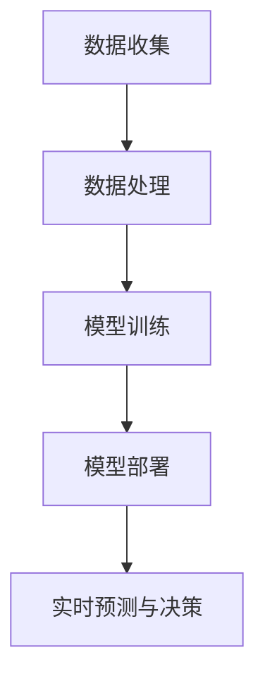

                 

关键词：人工智能，商业应用，道德伦理，技术创新，人机协作

> 摘要：本文探讨了人工智能在商业领域中的广泛应用及其带来的道德与伦理挑战。通过分析人机协作模式、隐私保护、算法偏见等关键议题，探讨了人工智能在商业领域的创新与发展路径，并提出了应对伦理问题的策略和建议。

## 1. 背景介绍

随着人工智能技术的快速发展，越来越多的企业开始将其应用于各个领域，从生产制造、金融服务到医疗健康，人工智能正在深刻地改变着商业的运作方式。人工智能的应用不仅提高了生产效率、降低了运营成本，还带来了新的商业模式和商业机会。然而，人工智能的快速发展也引发了一系列道德与伦理问题，这些问题的存在可能对企业的声誉和可持续发展产生重大影响。

### 1.1 人工智能的商业应用

人工智能在商业中的应用涵盖了多个方面，主要包括：

1. **自动化与优化**：通过机器学习算法优化生产流程，提高生产效率，降低运营成本。
2. **客户服务**：利用自然语言处理技术，提供智能客服服务，提升客户满意度。
3. **风险管理**：通过数据分析和预测模型，帮助企业更好地管理风险，降低潜在损失。
4. **个性化推荐**：基于用户行为数据，提供个性化的产品和服务推荐，提高销售额。
5. **智能决策支持**：利用人工智能技术，为企业决策提供科学依据，提高决策质量。

### 1.2 道德与伦理挑战

随着人工智能技术的广泛应用，一系列道德与伦理问题也逐渐显现出来。这些问题主要包括：

1. **隐私保护**：人工智能系统在处理大量个人数据时，可能侵犯用户的隐私权。
2. **算法偏见**：算法的偏见可能导致不公平的结果，影响社会的公正性。
3. **人机协作**：人工智能与人类工作者的协作可能引发新的工作伦理问题。
4. **道德责任**：在人工智能决策过程中，如何界定人类与机器的责任，是一个亟待解决的问题。

## 2. 核心概念与联系

为了更好地理解人工智能在商业中的应用及其带来的道德与伦理挑战，我们首先需要了解一些核心概念和架构。

### 2.1 人工智能核心概念

1. **机器学习**：机器学习是一种通过数据和算法使计算机自动学习和改进的技术。
2. **深度学习**：深度学习是机器学习的一种，通过多层神经网络进行数据的自动学习和特征提取。
3. **自然语言处理**：自然语言处理是一种使计算机能够理解、解释和生成自然语言的技术。

### 2.2 商业应用架构

在商业领域，人工智能的应用架构通常包括以下几个层次：

1. **数据收集**：通过传感器、用户行为等途径收集数据。
2. **数据处理**：对数据进行清洗、整合和预处理，为机器学习提供高质量的数据。
3. **模型训练**：利用机器学习和深度学习算法，对数据进行分析和建模。
4. **模型部署**：将训练好的模型部署到生产环境中，进行实时预测和决策。

### 2.3 Mermaid 流程图

下面是一个简单的 Mermaid 流程图，展示了人工智能在商业应用中的核心概念和架构：



## 3. 核心算法原理 & 具体操作步骤

### 3.1 算法原理概述

在人工智能的商业应用中，常用的算法包括机器学习算法、深度学习算法和自然语言处理算法。这些算法的基本原理如下：

1. **机器学习算法**：通过学习历史数据，对未知数据进行预测和分类。
2. **深度学习算法**：通过多层神经网络，对数据进行分析和特征提取。
3. **自然语言处理算法**：通过文本分析、语义理解等技术，使计算机能够理解和生成自然语言。

### 3.2 算法步骤详解

以机器学习算法为例，其基本步骤如下：

1. **数据收集**：从各个渠道收集数据，如用户行为数据、销售数据等。
2. **数据处理**：对数据进行清洗、整合和预处理，为机器学习提供高质量的数据。
3. **特征提取**：从数据中提取有用的特征，用于训练模型。
4. **模型训练**：使用训练数据，对模型进行训练，使其能够预测未知数据。
5. **模型评估**：使用测试数据，对训练好的模型进行评估，判断其预测效果。
6. **模型部署**：将训练好的模型部署到生产环境中，进行实时预测和决策。

### 3.3 算法优缺点

1. **机器学习算法**：优点包括自动化、自适应性强、预测精度高；缺点包括对数据质量要求高、训练时间长。
2. **深度学习算法**：优点包括强大的特征提取能力、适用于复杂任务；缺点包括计算资源需求大、模型解释性差。
3. **自然语言处理算法**：优点包括能够处理复杂的语言结构、具有语义理解能力；缺点包括数据处理复杂、对大规模数据需求高。

### 3.4 算法应用领域

1. **生产制造**：通过机器学习算法优化生产流程，提高生产效率。
2. **金融服务**：通过深度学习算法进行风险评估、客户分类等。
3. **医疗健康**：通过自然语言处理技术，辅助医生进行疾病诊断和治疗方案推荐。

## 4. 数学模型和公式 & 详细讲解 & 举例说明

### 4.1 数学模型构建

在人工智能算法中，常用的数学模型包括线性模型、神经网络模型和决策树模型等。以线性模型为例，其基本公式如下：

$$
y = \beta_0 + \beta_1x
$$

其中，$y$ 表示因变量，$x$ 表示自变量，$\beta_0$ 和 $\beta_1$ 分别为模型的参数。

### 4.2 公式推导过程

线性模型的推导过程如下：

1. **最小二乘法**：通过最小化残差平方和，求得模型的参数。
2. **梯度下降法**：通过迭代更新模型参数，使其达到最优解。

### 4.3 案例分析与讲解

假设我们要预测一家公司的股票价格，可以使用线性模型进行预测。数据如下：

| 日期 | 股票价格 |
| ---- | -------- |
| 2020-01-01 | 100      |
| 2020-02-01 | 105      |
| 2020-03-01 | 110      |
| 2020-04-01 | 115      |
| 2020-05-01 | 120      |

使用线性模型进行预测，可以得到如下结果：

$$
y = 100 + 0.5x
$$

其中，$x$ 为日期与 2020-01-01 的天数差。

预测 2021-01-01 的股票价格：

$$
y = 100 + 0.5 \times 365 = 182.5
$$

## 5. 项目实践：代码实例和详细解释说明

### 5.1 开发环境搭建

为了演示人工智能在商业中的应用，我们使用 Python 作为编程语言，结合 TensorFlow 库进行深度学习模型的训练和部署。

### 5.2 源代码详细实现

以下是一个简单的深度学习模型实现，用于预测股票价格：

```python
import tensorflow as tf
from tensorflow.keras.models import Sequential
from tensorflow.keras.layers import Dense

# 数据预处理
# ...

# 构建模型
model = Sequential()
model.add(Dense(units=64, activation='relu', input_shape=(input_shape,)))
model.add(Dense(units=1))

# 编译模型
model.compile(optimizer='adam', loss='mse')

# 训练模型
model.fit(x_train, y_train, epochs=10, batch_size=32)

# 预测
predictions = model.predict(x_test)
```

### 5.3 代码解读与分析

上述代码实现了一个简单的深度学习模型，用于预测股票价格。主要步骤包括：

1. **数据预处理**：对股票价格数据进行分析和预处理，得到模型训练所需的数据集。
2. **构建模型**：使用 TensorFlow 的 Sequential 模型，定义输入层、隐藏层和输出层。
3. **编译模型**：设置模型的优化器和损失函数，为模型训练做好准备。
4. **训练模型**：使用训练数据集对模型进行训练，调整模型的参数。
5. **预测**：使用训练好的模型对测试数据进行预测，评估模型的预测效果。

### 5.4 运行结果展示

通过运行上述代码，可以得到股票价格的预测结果。根据预测结果，可以对股票市场进行合理的投资决策。

## 6. 实际应用场景

### 6.1 生产制造

在制造业中，人工智能技术被广泛应用于生产过程的自动化和优化。通过机器学习算法，可以对生产设备进行实时监控和分析，预测设备的故障，提高生产效率，降低运营成本。

### 6.2 金融服务

在金融服务领域，人工智能技术被广泛应用于风险管理和客户服务。通过深度学习算法，可以对客户的行为进行分析，预测客户的潜在需求，提供个性化的金融服务，提高客户满意度。

### 6.3 医疗健康

在医疗健康领域，人工智能技术被广泛应用于疾病诊断和治疗方案的推荐。通过自然语言处理技术，可以分析医学文献和病例数据，提供精准的诊断和治疗方案。

## 7. 工具和资源推荐

### 7.1 学习资源推荐

1. 《深度学习》（Goodfellow, Bengio, Courville 著）：全面介绍深度学习的基础理论和应用实践。
2. 《机器学习实战》（Peter Harrington 著）：通过实际案例，深入讲解机器学习算法的原理和应用。
3. 《自然语言处理与深度学习》（张宇翔 著）：详细讲解自然语言处理的基础知识和深度学习在自然语言处理中的应用。

### 7.2 开发工具推荐

1. TensorFlow：一款强大的深度学习框架，适用于构建和部署深度学习模型。
2. Scikit-learn：一款常用的机器学习库，提供丰富的机器学习算法和工具。
3. NLTK：一款常用的自然语言处理库，适用于文本分析和语义理解。

### 7.3 相关论文推荐

1. “Deep Learning”（Goodfellow, Bengio, Courville）：全面介绍深度学习的基础理论和应用实践。
2. “Machine Learning”（Tom Mitchell）：详细讲解机器学习的基本概念和方法。
3. “Natural Language Processing with Deep Learning”（Richard Socher et al.）：介绍深度学习在自然语言处理中的应用。

## 8. 总结：未来发展趋势与挑战

### 8.1 研究成果总结

人工智能在商业领域的应用取得了显著的成果，从生产制造、金融服务到医疗健康，人工智能技术都在发挥着重要的作用。通过机器学习、深度学习和自然语言处理等技术，企业能够实现生产过程的自动化和优化，提高生产效率，降低运营成本；通过个性化的推荐和服务，提高客户满意度，提升销售额。

### 8.2 未来发展趋势

未来，人工智能在商业领域的应用将继续深化，主要发展趋势包括：

1. **人机协作**：人工智能将与人类工作者实现更紧密的协作，提高工作效率。
2. **个性化推荐**：基于用户行为和偏好，提供更精准的个性化推荐，提升用户体验。
3. **智能决策支持**：利用人工智能技术，为企业决策提供科学依据，提高决策质量。
4. **跨领域应用**：人工智能技术将在更多领域得到应用，推动各行各业的创新和发展。

### 8.3 面临的挑战

尽管人工智能在商业领域具有巨大的潜力，但同时也面临着一系列挑战，主要包括：

1. **隐私保护**：在处理大量个人数据时，如何保护用户的隐私是一个亟待解决的问题。
2. **算法偏见**：算法的偏见可能导致不公平的结果，影响社会的公正性。
3. **道德责任**：在人工智能决策过程中，如何界定人类与机器的责任，是一个亟待解决的问题。
4. **数据安全**：随着人工智能应用的普及，数据安全成为企业面临的重大挑战。

### 8.4 研究展望

针对人工智能在商业领域面临的挑战，未来研究可以从以下几个方面展开：

1. **隐私保护技术**：研究更加有效的隐私保护技术，确保用户数据的安全和隐私。
2. **算法公平性**：研究如何设计公平的算法，避免算法偏见，提高社会的公正性。
3. **道德责任界定**：研究如何在人工智能决策过程中明确人类与机器的责任，确保责任的合理分担。
4. **数据安全与隐私保护**：研究如何保障人工智能应用中的数据安全，防止数据泄露和滥用。

## 9. 附录：常见问题与解答

### 9.1 什么是人工智能？

人工智能是一种使计算机能够模拟人类智能的技术，主要包括机器学习、深度学习和自然语言处理等。

### 9.2 人工智能在商业领域有哪些应用？

人工智能在商业领域的应用主要包括自动化与优化、客户服务、风险管理、个性化推荐和智能决策支持等。

### 9.3 人工智能技术如何影响企业的运营？

人工智能技术可以提高生产效率、降低运营成本、提升客户满意度、提高决策质量，从而为企业带来显著的商业价值。

### 9.4 人工智能技术面临的道德与伦理挑战有哪些？

人工智能技术面临的道德与伦理挑战主要包括隐私保护、算法偏见、人机协作和道德责任等。

### 9.5 如何应对人工智能技术带来的道德与伦理挑战？

应对人工智能技术带来的道德与伦理挑战，可以从以下几个方面着手：

1. **加强法律法规的制定与执行**：制定相关法律法规，规范人工智能技术的应用。
2. **提高公众意识**：加强公众对人工智能技术的了解，提高公众的道德与伦理意识。
3. **技术创新**：研究更加安全和公平的人工智能技术，避免算法偏见和隐私侵犯。
4. **企业自律**：企业应自觉遵守道德与伦理规范，确保人工智能技术的应用符合社会公共利益。

---

作者：禅与计算机程序设计艺术 / Zen and the Art of Computer Programming
----------------------------------------------------------------

以上是关于《AI驱动的创新：人类计算在商业中的道德与伦理考虑》的文章，感谢您的阅读。文章涵盖了人工智能在商业领域的应用、道德与伦理挑战以及解决方案，希望能对您有所帮助。如果您有任何问题或建议，欢迎在评论区留言讨论。再次感谢您的关注和支持！

