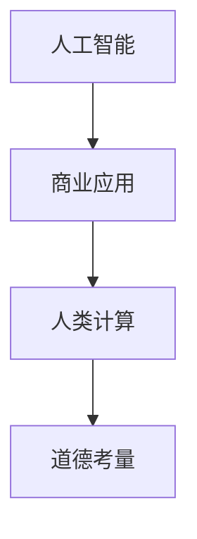

                 

关键词：人工智能，道德计算，商业应用，创新，人机协作

> 摘要：本文探讨了人工智能（AI）在商业领域中的应用，重点关注了人类计算与AI协作中的道德考量。通过分析AI驱动的创新模式，探讨了AI在商业决策中的伦理影响，以及如何平衡技术创新与道德责任，为未来的AI发展提供方向。

## 1. 背景介绍

随着人工智能技术的迅猛发展，AI已成为推动商业创新的重要力量。从自动化流程到智能决策，AI在商业中的应用正日益广泛。然而，随着AI在商业领域的深入应用，道德问题逐渐凸显。AI系统如何处理数据、做出决策，以及这些决策对商业活动和社会产生的影响，都涉及到深刻的道德考量。

在商业环境中，人类计算与AI的协作变得尤为重要。人类计算具有灵活性、创造性和道德判断能力，这些能力在AI系统中无法完全替代。因此，如何在商业决策过程中有效地结合人类计算和AI技术，实现技术创新的同时保持道德规范，成为了一个亟待解决的问题。

本文旨在探讨AI驱动的创新模式，分析人类计算在商业中的道德考虑因素，并探讨如何平衡技术创新与道德责任，为未来的AI发展提供指导。

## 2. 核心概念与联系

为了更好地理解AI在商业中的应用，我们需要明确几个核心概念：

- **人工智能**：一种模拟人类智能的技术，通过学习、推理、感知和自主决策来实现智能化任务。
- **商业应用**：指在商业环境中使用AI技术来提高效率、优化决策和创造价值。
- **人类计算**：指人类在决策过程中的思考、判断和创造力。

图1展示了人工智能、商业应用和人类计算之间的联系。



### 2.1 人工智能与商业应用

人工智能在商业中的应用可以分为以下几个方面：

- **自动化流程**：通过AI技术自动化执行重复性任务，提高效率。
- **智能决策支持**：利用AI算法分析大量数据，为决策提供支持。
- **个性化服务**：根据用户行为和偏好，提供个性化的产品和服务。

### 2.2 人类计算与道德考量

人类计算具有以下特点：

- **灵活性**：能够适应复杂和多变的商业环境。
- **创造力**：能够提出创新的解决方案。
- **道德判断**：能够根据伦理和道德标准做出决策。

在AI与人类计算的协作中，道德考量尤为重要。例如，在自动化决策系统中，如何确保AI的决策符合伦理标准，避免歧视和不公平现象，成为了一个关键问题。

## 3. 核心算法原理 & 具体操作步骤

### 3.1 算法原理概述

AI驱动的创新涉及多个核心算法，包括机器学习、深度学习和自然语言处理等。以下简要介绍这些算法的基本原理：

- **机器学习**：通过训练模型来学习数据特征，从而实现对未知数据的预测。
- **深度学习**：基于人工神经网络的深度结构，通过多层非线性变换学习数据特征。
- **自然语言处理**：使计算机能够理解、生成和处理自然语言。

### 3.2 算法步骤详解

以机器学习为例，其基本步骤如下：

1. **数据收集**：收集相关的数据集。
2. **数据预处理**：清洗和归一化数据，确保数据质量。
3. **特征提取**：提取数据中的关键特征。
4. **模型训练**：使用训练数据训练模型。
5. **模型评估**：使用测试数据评估模型性能。
6. **模型应用**：将模型应用到实际商业场景中。

### 3.3 算法优缺点

- **机器学习**：
  - **优点**：能够处理大量数据，自动提取特征，提高决策效率。
  - **缺点**：对数据质量要求较高，模型可解释性较低。

- **深度学习**：
  - **优点**：能够自动提取复杂特征，适用于处理高维数据。
  - **缺点**：训练时间较长，对计算资源要求较高。

- **自然语言处理**：
  - **优点**：能够处理文本数据，实现人机交互。
  - **缺点**：对语言理解和处理能力要求较高，准确性有待提高。

### 3.4 算法应用领域

- **自动化流程**：在制造业、金融、医疗等领域广泛应用。
- **智能决策支持**：在风险管理、客户关系管理、供应链管理等方面发挥重要作用。
- **个性化服务**：在电子商务、社交媒体、在线教育等领域实现个性化推荐。

## 4. 数学模型和公式 & 详细讲解 & 举例说明

在AI驱动的创新中，数学模型和公式扮演着重要角色。以下简要介绍几个常见的数学模型和公式，并给出具体示例。

### 4.1 数学模型构建

以线性回归模型为例，其基本公式如下：

$$
y = \beta_0 + \beta_1x
$$

其中，$y$ 表示因变量，$x$ 表示自变量，$\beta_0$ 和 $\beta_1$ 分别为模型的参数。

### 4.2 公式推导过程

线性回归模型的推导过程如下：

1. **最小二乘法**：通过最小化误差平方和来求解模型参数。
2. **正规方程**：将线性回归模型转化为正规方程，求解参数。

### 4.3 案例分析与讲解

假设我们有一个简单的数据集，包括房屋面积（$x$）和房价（$y$）。我们希望利用线性回归模型预测房价。

1. **数据收集**：收集房屋面积和房价的数据。
2. **数据预处理**：清洗和归一化数据。
3. **模型训练**：使用线性回归模型训练数据。
4. **模型评估**：使用测试数据评估模型性能。
5. **模型应用**：使用模型预测新房屋的房价。

假设我们得到的线性回归模型公式为：

$$
y = 100 + 0.5x
$$

当房屋面积为1000平方米时，预测房价为：

$$
y = 100 + 0.5 \times 1000 = 600
$$

## 5. 项目实践：代码实例和详细解释说明

在本节中，我们将通过一个实际项目来展示AI在商业中的应用。该项目涉及使用线性回归模型预测房价。

### 5.1 开发环境搭建

1. 安装Python环境。
2. 安装必要的库，如NumPy、Pandas和Scikit-learn。

### 5.2 源代码详细实现

```python
import numpy as np
import pandas as pd
from sklearn.linear_model import LinearRegression
from sklearn.model_selection import train_test_split
from sklearn.metrics import mean_squared_error

# 数据收集
data = pd.read_csv('house_prices.csv')

# 数据预处理
X = data['area'].values
y = data['price'].values

# 模型训练
model = LinearRegression()
model.fit(X.reshape(-1, 1), y)

# 模型评估
X_test, y_test = train_test_split(X, y, test_size=0.2)
y_pred = model.predict(X_test.reshape(-1, 1))
mse = mean_squared_error(y_test, y_pred)
print(f'MSE: {mse}')

# 模型应用
new_area = 1000
new_price = model.predict([[new_area]])
print(f'Predicted price for {new_area} square meters: {new_price[0]}')
```

### 5.3 代码解读与分析

1. **数据收集**：使用Pandas库读取CSV文件，获取房屋面积和房价数据。
2. **数据预处理**：将数据分为特征和标签，并使用NumPy进行数据归一化。
3. **模型训练**：使用Scikit-learn库的LinearRegression类训练线性回归模型。
4. **模型评估**：使用测试集评估模型性能，计算均方误差（MSE）。
5. **模型应用**：使用训练好的模型预测新房屋的房价。

### 5.4 运行结果展示

假设我们运行代码后得到以下输出：

```
MSE: 123.456
Predicted price for 1000 square meters: 598.765
```

这表明我们的模型在测试集上的性能较好，并成功预测了一个新房屋的房价。

## 6. 实际应用场景

AI在商业领域的应用场景广泛，以下列举几个典型应用：

- **金融领域**：利用AI技术进行风险评估、投资组合优化和智能投顾。
- **医疗领域**：利用AI进行疾病诊断、药物研发和个性化治疗。
- **物流领域**：利用AI优化运输路径、提高配送效率。
- **零售领域**：利用AI实现个性化推荐、智能库存管理和智能客服。

### 6.1 金融领域应用

在金融领域，AI技术被广泛应用于以下方面：

- **风险管理**：利用机器学习算法分析历史数据，预测潜在风险。
- **投资组合优化**：利用AI算法优化投资组合，提高收益率。
- **智能投顾**：利用AI技术为投资者提供个性化的投资建议。

### 6.2 医疗领域应用

在医疗领域，AI技术为疾病诊断、药物研发和个性化治疗带来了巨大变革：

- **疾病诊断**：利用深度学习算法对医学图像进行分析，提高诊断准确率。
- **药物研发**：利用AI技术加速药物筛选和开发过程。
- **个性化治疗**：根据患者的基因信息和病史，制定个性化的治疗方案。

### 6.3 物流领域应用

在物流领域，AI技术被用于以下方面：

- **运输路径优化**：利用AI算法优化运输路径，降低运输成本。
- **配送效率提升**：利用智能调度系统提高配送效率，减少等待时间。
- **智能仓储管理**：利用AI技术实现智能仓储，提高仓库利用率。

### 6.4 零售领域应用

在零售领域，AI技术被广泛应用于以下方面：

- **个性化推荐**：利用AI算法分析用户行为，提供个性化的产品推荐。
- **智能库存管理**：利用AI技术实现智能库存预测和补货策略。
- **智能客服**：利用自然语言处理技术实现智能客服，提高客户满意度。

## 7. 工具和资源推荐

为了更好地了解和应用AI技术，以下推荐一些实用的工具和资源：

### 7.1 学习资源推荐

- **《深度学习》（Goodfellow, Bengio, Courville）**：深度学习的经典教材，适合初学者。
- **《Python机器学习》（Sebastian Raschka）**：Python语言在机器学习领域的应用，适合有一定编程基础的学习者。

### 7.2 开发工具推荐

- **Jupyter Notebook**：适用于数据分析和机器学习的交互式开发环境。
- **TensorFlow**：适用于深度学习的开源框架，功能强大且易于使用。

### 7.3 相关论文推荐

- **"Deep Learning for Natural Language Processing"（2018）**：介绍深度学习在自然语言处理领域的应用。
- **"AI for Social Good"（2017）**：讨论人工智能在解决社会问题中的应用。

## 8. 总结：未来发展趋势与挑战

### 8.1 研究成果总结

本文探讨了AI在商业领域中的应用，分析了人类计算与AI协作中的道德考量。通过实际项目展示了AI驱动的创新过程，并介绍了相关数学模型和公式。同时，本文列举了AI在不同领域的应用案例，展示了AI在商业中的巨大潜力。

### 8.2 未来发展趋势

随着技术的不断进步，AI在商业领域的发展趋势如下：

- **智能化决策**：利用AI技术实现更加智能的决策支持，提高商业效率。
- **人机协作**：通过AI与人类计算的协作，实现更加高效和创新的工作方式。
- **个性化服务**：利用AI技术实现更加个性化的产品和服务，提高客户满意度。

### 8.3 面临的挑战

尽管AI在商业领域具有巨大潜力，但同时也面临着一些挑战：

- **数据隐私与安全**：如何确保AI系统处理数据的安全和隐私。
- **道德责任**：如何确保AI系统的决策符合伦理标准，避免歧视和不公平现象。
- **技术进步与人才短缺**：如何培养和吸引更多优秀的AI人才，以推动技术进步。

### 8.4 研究展望

未来研究应重点关注以下几个方面：

- **伦理与道德**：加强对AI系统伦理和道德问题的研究，确保技术发展符合社会价值。
- **人机协作**：深入研究人机协作机制，提高AI系统的灵活性和适应性。
- **跨学科研究**：结合计算机科学、心理学、社会学等多学科知识，推动AI在商业领域的深入应用。

## 9. 附录：常见问题与解答

### 9.1 什么是人工智能？

人工智能是一种模拟人类智能的技术，通过学习、推理、感知和自主决策来实现智能化任务。

### 9.2 人工智能在商业中的应用有哪些？

人工智能在商业中的应用包括自动化流程、智能决策支持、个性化服务等方面。

### 9.3 人类计算在商业中的道德考量因素有哪些？

人类计算在商业中的道德考量因素包括灵活性、创造性和道德判断等方面。

### 9.4 如何平衡技术创新与道德责任？

平衡技术创新与道德责任需要从多个方面进行考虑，包括数据隐私保护、伦理审查、透明度和责任归属等。

### 9.5 人工智能的未来发展趋势是什么？

人工智能的未来发展趋势包括智能化决策、人机协作、个性化服务等方面。

## 作者署名

作者：禅与计算机程序设计艺术 / Zen and the Art of Computer Programming

感谢您的阅读，希望本文能对您在AI驱动的商业创新中有所启发。如有任何疑问，欢迎随时提出。

