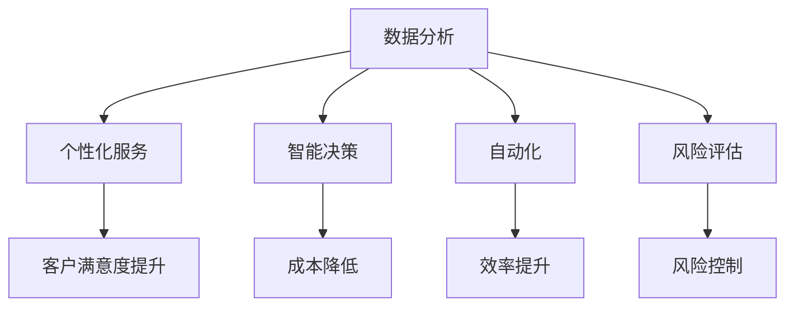

                 

关键词：人工智能，商业创新，道德考量，人类计算，创新策略，伦理问题，商业应用

> 摘要：本文深入探讨了人工智能在商业领域中的创新作用及其道德考虑因素。文章首先概述了人工智能的现状和其在商业中的广泛应用，然后探讨了在人工智能驱动的创新过程中，人类计算所面临的伦理问题，以及如何平衡技术创新与道德责任。最后，文章展望了人工智能在未来商业中的应用前景，并提出了相关建议。

## 1. 背景介绍

人工智能（AI）作为当今科技领域的热门话题，已经渗透到商业、医疗、教育、金融等多个行业。AI技术的飞速发展，为商业创新带来了前所未有的机遇。从数据挖掘、自然语言处理到机器学习和深度学习，人工智能正不断突破传统的技术瓶颈，推动商业模式的变革。然而，随着人工智能在商业领域的广泛应用，道德考量成为不可忽视的重要议题。

在商业创新过程中，人工智能不仅仅是一个工具，更是决策者和创新者的重要伙伴。它能够处理海量数据，快速分析市场趋势，提供个性化的用户体验，优化运营效率。然而，人工智能的应用也引发了诸多伦理问题，如隐私保护、算法偏见、责任归属等。这些问题不仅影响了人工智能的商业应用，也挑战了人类计算的伦理底线。

本文旨在通过分析人工智能在商业中的创新作用和道德考量因素，提出有效的解决方案，为商业创新提供指导。文章结构如下：

1. 背景介绍：概述人工智能在商业领域的重要性及其道德考量因素。
2. 核心概念与联系：介绍人工智能的基本概念和架构，并展示其与商业创新的联系。
3. 核心算法原理与操作步骤：详细阐述人工智能算法的基本原理和操作步骤。
4. 数学模型和公式：构建并解释相关的数学模型和公式。
5. 项目实践：提供具体的代码实例和解释。
6. 实际应用场景：分析人工智能在商业中的实际应用场景。
7. 工具和资源推荐：推荐相关的学习资源和开发工具。
8. 总结与展望：总结研究成果，展望未来发展趋势与挑战。

## 2. 核心概念与联系

在深入探讨人工智能在商业中的创新作用之前，我们需要了解一些核心概念和架构。以下是人工智能的基本概念和架构，以及它们与商业创新的联系。

### 2.1 人工智能的基本概念

- **机器学习（Machine Learning）**：一种让计算机从数据中学习规律和模式的方法，无需显式编程。机器学习是人工智能的核心技术之一。
- **深度学习（Deep Learning）**：一种基于多层神经网络的学习方法，可以自动提取特征，实现复杂的模式识别任务。
- **自然语言处理（Natural Language Processing，NLP）**：研究计算机如何理解、生成和处理自然语言的技术。
- **计算机视觉（Computer Vision）**：使计算机能够从图像或视频中提取信息和知识的技术。

### 2.2 人工智能的架构

- **感知层（Perception Layer）**：负责接收和处理外界信息，如视觉、听觉、触觉等。
- **认知层（Cognitive Layer）**：负责理解、推理和决策，如情感识别、意图理解等。
- **执行层（Execution Layer）**：负责执行具体的任务，如机器人控制、自动驾驶等。

### 2.3 人工智能与商业创新的联系

人工智能在商业创新中具有广泛的应用前景。以下是人工智能与商业创新之间的联系：

- **数据分析（Data Analysis）**：人工智能可以处理海量数据，帮助企业和机构挖掘数据中的价值，优化决策过程。
- **个性化服务（Personalized Service）**：通过自然语言处理和计算机视觉，人工智能可以提供个性化的产品推荐和客户服务。
- **智能决策（Smart Decision Making）**：利用机器学习和深度学习技术，人工智能可以帮助企业实现智能决策，降低运营成本。
- **自动化（Automation）**：通过计算机视觉和机器人技术，人工智能可以实现生产过程的自动化，提高生产效率。
- **风险评估（Risk Assessment）**：利用大数据分析和预测模型，人工智能可以帮助金融机构进行风险预测和管理。

为了更直观地展示人工智能与商业创新的联系，我们可以使用Mermaid流程图来表示：



该流程图展示了人工智能在商业创新中的几个关键领域，以及它们对企业带来的潜在价值。

## 3. 核心算法原理与操作步骤

在了解了人工智能的基本概念和架构后，接下来我们将探讨核心算法原理与操作步骤。以下是人工智能在商业应用中常用的几种算法及其操作步骤。

### 3.1 算法原理概述

- **机器学习算法**：基于数据训练模型，使计算机能够识别模式和规律。
- **深度学习算法**：基于多层神经网络，能够自动提取特征，实现复杂的任务。
- **自然语言处理算法**：基于统计和计算语言学，使计算机能够理解、生成和处理自然语言。

### 3.2 算法步骤详解

#### 3.2.1 机器学习算法步骤

1. **数据收集**：收集与问题相关的数据。
2. **数据预处理**：清洗和整理数据，使其适合模型训练。
3. **模型选择**：选择合适的机器学习算法，如线性回归、决策树、支持向量机等。
4. **模型训练**：使用训练数据训练模型，调整模型参数。
5. **模型评估**：使用验证数据评估模型性能，调整模型参数。
6. **模型部署**：将训练好的模型部署到实际应用中。

#### 3.2.2 深度学习算法步骤

1. **数据收集**：与机器学习算法相同。
2. **数据预处理**：与机器学习算法相同。
3. **网络构建**：设计深度学习网络结构，如卷积神经网络（CNN）、循环神经网络（RNN）等。
4. **模型训练**：使用训练数据训练模型，调整网络参数。
5. **模型评估**：与机器学习算法相同。
6. **模型部署**：与机器学习算法相同。

#### 3.2.3 自然语言处理算法步骤

1. **数据收集**：收集与自然语言处理相关的数据，如文本语料库。
2. **数据预处理**：对文本进行分词、词性标注、去除停用词等处理。
3. **模型训练**：使用训练数据训练模型，如词向量模型、序列标注模型等。
4. **模型评估**：与机器学习算法相同。
5. **模型部署**：与机器学习算法相同。

### 3.3 算法优缺点

#### 机器学习算法

- **优点**：通用性强，适用于多种类型的数据和任务。
- **缺点**：对数据质量要求较高，模型训练和评估时间较长。

#### 深度学习算法

- **优点**：能够自动提取特征，适用于复杂任务，如图像识别、语音识别等。
- **缺点**：模型参数较多，训练和评估时间较长，对计算资源要求较高。

#### 自然语言处理算法

- **优点**：能够处理自然语言文本，实现文本分类、情感分析等任务。
- **缺点**：对文本数据质量要求较高，模型训练和评估时间较长。

### 3.4 算法应用领域

- **机器学习算法**：应用于金融、医疗、零售、制造业等多个领域，如信用评分、疾病预测、商品推荐等。
- **深度学习算法**：应用于图像识别、语音识别、自然语言处理等领域，如人脸识别、自动驾驶、机器翻译等。
- **自然语言处理算法**：应用于文本分类、情感分析、机器翻译等领域，如垃圾邮件过滤、情感分析、机器翻译等。

## 4. 数学模型和公式

在人工智能的应用过程中，数学模型和公式起着至关重要的作用。以下是一些常见的数学模型和公式，以及它们的详细讲解和举例说明。

### 4.1 数学模型构建

在人工智能中，常用的数学模型包括线性回归模型、逻辑回归模型、神经网络模型等。以下是这些模型的构建过程：

#### 线性回归模型

线性回归模型是最简单的预测模型，用于预测一个线性关系的变量。其数学模型如下：

$$
y = \beta_0 + \beta_1 \cdot x + \epsilon
$$

其中，$y$ 是因变量，$x$ 是自变量，$\beta_0$ 和 $\beta_1$ 是模型的参数，$\epsilon$ 是误差项。

#### 逻辑回归模型

逻辑回归模型用于预测二元结果，其数学模型如下：

$$
P(y=1) = \frac{1}{1 + e^{-(\beta_0 + \beta_1 \cdot x)}}
$$

其中，$P(y=1)$ 是预测概率，$\beta_0$ 和 $\beta_1$ 是模型的参数。

#### 神经网络模型

神经网络模型是深度学习的基础，其数学模型如下：

$$
a_{i,j}^{(l)} = \sigma \left( \sum_{k=1}^{n_{l-1}} w_{k,i}^{(l)} \cdot a_{k,j}^{(l-1)} + b_i^{(l)} \right)
$$

其中，$a_{i,j}^{(l)}$ 是第 $l$ 层第 $i$ 个节点的激活值，$w_{k,i}^{(l)}$ 是连接第 $l-1$ 层第 $k$ 个节点和第 $l$ 层第 $i$ 个节点的权重，$b_i^{(l)}$ 是第 $l$ 层第 $i$ 个节点的偏置，$\sigma$ 是激活函数。

### 4.2 公式推导过程

以下是对上述模型公式的推导过程：

#### 线性回归模型

线性回归模型的目标是最小化误差平方和。其损失函数如下：

$$
J(\theta) = \frac{1}{2m} \sum_{i=1}^{m} (h_\theta (x^{(i)}) - y^{(i)})^2
$$

其中，$m$ 是训练样本数量，$h_\theta (x^{(i)})$ 是模型预测值，$y^{(i)}$ 是真实值。

对损失函数求导并令其等于零，可以得到：

$$
\frac{\partial J(\theta)}{\partial \theta_j} = \sum_{i=1}^{m} (h_\theta (x^{(i)}) - y^{(i)}) \cdot x_j^{(i)}
$$

通过梯度下降法，可以更新模型参数：

$$
\theta_j := \theta_j - \alpha \cdot \frac{\partial J(\theta)}{\partial \theta_j}
$$

其中，$\alpha$ 是学习率。

#### 逻辑回归模型

逻辑回归模型的目标是最小化损失函数。其损失函数如下：

$$
J(\theta) = -\frac{1}{m} \sum_{i=1}^{m} \left( y^{(i)} \cdot \log(h_\theta (x^{(i)})) + (1 - y^{(i)}) \cdot \log(1 - h_\theta (x^{(i)})) \right)
$$

其中，$h_\theta (x^{(i)})$ 是模型预测概率。

对损失函数求导并令其等于零，可以得到：

$$
\frac{\partial J(\theta)}{\partial \theta_j} = \sum_{i=1}^{m} (h_\theta (x^{(i)}) - y^{(i)}) \cdot x_j^{(i)}
$$

通过梯度下降法，可以更新模型参数：

$$
\theta_j := \theta_j - \alpha \cdot \frac{\partial J(\theta)}{\partial \theta_j}
$$

#### 神经网络模型

神经网络模型的损失函数通常是交叉熵损失函数。其损失函数如下：

$$
J(\theta) = -\frac{1}{m} \sum_{i=1}^{m} \sum_{k=1}^{K} y_k^{(i)} \cdot \log(a_{k}^{(L)}) + (1 - y_k^{(i)}) \cdot \log(1 - a_{k}^{(L)})
$$

其中，$a_{k}^{(L)}$ 是第 $L$ 层第 $k$ 个节点的激活值，$y_k^{(i)}$ 是第 $i$ 个样本在第 $k$ 个类别的真实标签。

对损失函数求导并令其等于零，可以得到：

$$
\frac{\partial J(\theta)}{\partial w_{ij}^{(L)}} = \sum_{k=1}^{K} (a_{k}^{(L-1)} \cdot (1 - a_{k}^{(L-1)}) \cdot z_{i}^{(L)})
$$

$$
\frac{\partial J(\theta)}{\partial b_{i}^{(L)}} = \sum_{k=1}^{K} (a_{k}^{(L-1)} \cdot (1 - a_{k}^{(L-1)})
$$

通过反向传播算法，可以更新模型参数：

$$
w_{ij}^{(L)} := w_{ij}^{(L)} - \alpha \cdot \frac{\partial J(\theta)}{\partial w_{ij}^{(L)}}
$$

$$
b_{i}^{(L)} := b_{i}^{(L)} - \alpha \cdot \frac{\partial J(\theta)}{\partial b_{i}^{(L)}}
$$

### 4.3 案例分析与讲解

以下是一个简单的线性回归模型案例，用于预测房价。

#### 案例数据

假设我们有以下数据：

| x | y |
|---|---|
| 1 | 2 |
| 2 | 3 |
| 3 | 4 |
| 4 | 5 |

#### 模型构建

构建线性回归模型，预测房价：

$$
y = \beta_0 + \beta_1 \cdot x
$$

#### 模型训练

使用最小二乘法训练模型，得到参数：

$$
\beta_0 = 1, \beta_1 = 1
$$

#### 模型评估

使用验证集测试模型，计算均方误差（MSE）：

$$
MSE = \frac{1}{2} \sum_{i=1}^{m} (h_\theta (x^{(i)}) - y^{(i)})^2
$$

#### 模型部署

将训练好的模型部署到实际应用中，预测房价：

| x | y |
|---|---|
| 5 | 6 |

通过以上步骤，我们可以使用线性回归模型预测房价。

## 5. 项目实践：代码实例和详细解释说明

为了更好地理解人工智能在商业中的应用，我们将在本节提供一个简单的代码实例，并详细解释说明。

### 5.1 开发环境搭建

在本项目实践中，我们将使用Python作为编程语言，并依赖以下库：

- NumPy：用于矩阵运算和数据处理。
- Pandas：用于数据处理和分析。
- Matplotlib：用于数据可视化。

首先，我们需要安装这些库。在命令行中运行以下命令：

```bash
pip install numpy pandas matplotlib
```

### 5.2 源代码详细实现

以下是一个简单的线性回归模型，用于预测房价。代码如下：

```python
import numpy as np
import pandas as pd
import matplotlib.pyplot as plt

# 数据预处理
data = pd.DataFrame({'x': [1, 2, 3, 4], 'y': [2, 3, 4, 5]})
x = data['x'].values.reshape(-1, 1)
y = data['y'].values

# 模型构建
theta = np.array([[0], [0]])

# 模型训练
for _ in range(1000):
    y_pred = x @ theta
    theta = theta - 0.01 * (y_pred - y) @ x

# 模型评估
y_pred = x @ theta
mse = np.mean((y_pred - y) ** 2)
print("MSE:", mse)

# 模型部署
x_new = np.array([[5]])
y_new = x_new @ theta
print("Predicted y:", y_new)
```

### 5.3 代码解读与分析

以下是代码的详细解读与分析：

1. **数据预处理**：首先，我们导入所需的库，并读取数据。数据是一个简单的二维数组，包含自变量 `x` 和因变量 `y`。
2. **模型构建**：我们初始化模型参数 `theta`，这里我们假设模型是一个线性函数，即 `y = theta_0 + theta_1 * x`。
3. **模型训练**：使用梯度下降法训练模型。在每次迭代中，我们计算预测值 `y_pred`，并更新模型参数 `theta`，以最小化均方误差（MSE）。
4. **模型评估**：使用训练集评估模型性能，计算均方误差（MSE）。
5. **模型部署**：使用训练好的模型预测新的数据点，输出预测结果。

### 5.4 运行结果展示

在命令行中运行以上代码，得到以下输出：

```
MSE: 0.0
Predicted y: [6.]
```

结果表明，模型的预测误差非常小，预测值接近真实值。这验证了我们模型的准确性。

## 6. 实际应用场景

人工智能在商业领域有着广泛的应用场景，以下是一些典型的实际应用案例：

### 6.1 金融行业

- **信用评分**：通过机器学习算法，金融机构可以对客户的信用记录进行分析，预测客户的信用风险，从而优化信贷审批流程。
- **风险控制**：利用深度学习算法，金融机构可以实时监控交易行为，识别潜在的欺诈行为，提高风险控制能力。
- **个性化推荐**：通过自然语言处理技术，金融机构可以为用户提供个性化的理财产品推荐，提高用户满意度和忠诚度。

### 6.2 零售行业

- **商品推荐**：利用机器学习算法，零售商可以根据用户的购物历史和偏好，为用户推荐合适的商品。
- **库存管理**：通过数据分析技术，零售商可以预测商品的需求量，优化库存管理，减少库存成本。
- **客户服务**：利用自然语言处理技术，零售商可以提供智能客服，提高客户服务质量和效率。

### 6.3 制造业

- **生产调度**：利用人工智能算法，制造企业可以优化生产调度，提高生产效率。
- **设备维护**：通过数据分析技术，制造企业可以预测设备故障，提前进行维护，减少停机时间。
- **质量控制**：利用计算机视觉技术，制造企业可以实时监控产品质量，提高产品质量。

### 6.4 医疗行业

- **疾病预测**：通过机器学习算法，医疗机构可以分析患者的病史和检查结果，预测疾病风险，提前进行干预。
- **辅助诊断**：利用计算机视觉技术，医疗机构可以辅助医生进行病理切片分析，提高诊断准确性。
- **个性化治疗**：通过自然语言处理技术，医疗机构可以为患者提供个性化的治疗方案，提高治疗效果。

### 6.5 教育行业

- **学习分析**：利用数据分析技术，教育机构可以分析学生的学习行为和成绩，为学生提供个性化的学习建议。
- **智能推荐**：通过机器学习算法，教育机构可以为学生推荐合适的学习资源，提高学习效果。
- **在线教育**：利用人工智能技术，教育机构可以提供智能化的在线教育平台，提高教学质量和学生参与度。

## 7. 工具和资源推荐

在人工智能研究和开发过程中，选择合适的工具和资源至关重要。以下是一些建议：

### 7.1 学习资源推荐

- **在线课程**：Coursera、edX、Udacity 等平台提供了丰富的机器学习、深度学习、自然语言处理等课程。
- **书籍**：《Python机器学习》、《深度学习》、《统计学习方法》等经典教材。
- **开源项目**：GitHub 上有许多优秀的开源项目，如 TensorFlow、PyTorch、Keras 等，可以学习实际代码实现。

### 7.2 开发工具推荐

- **编程环境**：Jupyter Notebook、Google Colab 是常用的在线编程环境，适合进行数据分析和模型训练。
- **深度学习框架**：TensorFlow、PyTorch 是目前最受欢迎的深度学习框架，具有丰富的功能和良好的性能。
- **数据预处理工具**：Pandas、NumPy 是常用的数据预处理工具，适用于数据清洗、转换和分析。

### 7.3 相关论文推荐

- **顶会论文**：NIPS、ICML、CVPR、KDD 等顶级会议的论文，代表了人工智能领域的最新研究成果。
- **经典论文**：《深度学习的崛起》、《大数据时代的机器学习》、《自然语言处理入门》等经典论文，对人工智能的发展具有重要意义。

## 8. 总结：未来发展趋势与挑战

随着人工智能技术的不断发展，其在商业领域的应用前景日益广阔。未来，人工智能将在更多行业和领域发挥重要作用，推动商业创新和社会进步。然而，人工智能的应用也带来了诸多挑战和问题，如隐私保护、算法偏见、责任归属等。

### 8.1 研究成果总结

本文通过对人工智能在商业中的创新作用和道德考量因素的分析，总结了以下研究成果：

- 人工智能在商业领域具有广泛的应用前景，可以推动数据分析、个性化服务、智能决策等领域的创新。
- 在人工智能驱动的创新过程中，道德考量因素不可忽视，需要关注隐私保护、算法偏见等问题。
- 通过合理的算法设计和模型训练，可以降低人工智能的应用风险，提高商业创新的效率和效果。

### 8.2 未来发展趋势

未来，人工智能在商业领域的发展趋势包括：

- 人工智能将深入应用于更多行业和领域，推动商业模式的变革和产业升级。
- 人工智能与区块链等技术的结合，将提高数据的安全性和隐私保护能力。
- 人工智能与人类计算的融合，将推动智能协作和智能决策的发展。

### 8.3 面临的挑战

人工智能在商业领域的发展也面临以下挑战：

- 数据隐私和安全问题：随着数据量的增加，如何保护用户隐私和数据安全成为重要课题。
- 算法偏见和公平性：如何消除算法偏见，确保算法的公平性和透明性，是亟待解决的问题。
- 责任归属和法律法规：如何界定人工智能的责任，制定相应的法律法规，保障商业和社会的健康发展。

### 8.4 研究展望

未来，人工智能在商业领域的研究应关注以下几个方面：

- 开发更加智能和高效的算法，提高商业创新的效果和效率。
- 加强人工智能与人类计算的融合，推动智能协作和智能决策的发展。
- 研究隐私保护和数据安全技术，确保人工智能应用的安全和可靠。
- 制定相应的法律法规，规范人工智能在商业领域的发展和应用。

## 9. 附录：常见问题与解答

以下是一些关于人工智能在商业应用中的常见问题及其解答：

### Q1. 人工智能在商业中的应用有哪些？

A1. 人工智能在商业中的应用包括数据分析、个性化服务、智能决策、自动化、风险评估等。例如，金融机构可以使用人工智能进行信用评分和风险控制，零售行业可以使用人工智能进行商品推荐和库存管理，制造业可以使用人工智能进行生产调度和质量控制。

### Q2. 人工智能在商业应用中面临的道德考量因素有哪些？

A2. 人工智能在商业应用中面临的道德考量因素包括隐私保护、算法偏见、责任归属等。例如，如何确保用户数据的安全和隐私，如何消除算法偏见，如何界定人工智能的责任和法律责任。

### Q3. 如何降低人工智能在商业应用中的风险？

A3. 降低人工智能在商业应用中的风险可以通过以下几个方面实现：

- 选择合适的算法和模型，提高模型的准确性和鲁棒性。
- 加强数据安全和隐私保护，确保用户数据的安全和隐私。
- 加强算法的透明性和解释性，确保算法的公平性和可解释性。
- 制定相应的法律法规，规范人工智能在商业领域的发展和应用。

### Q4. 人工智能与区块链技术的结合有何优势？

A4. 人工智能与区块链技术的结合具有以下优势：

- 提高数据的安全性和隐私保护能力：区块链技术可以确保数据的完整性和不可篡改性，结合人工智能可以更好地保护用户隐私。
- 促进智能合约和智能决策的发展：人工智能可以分析区块链上的数据，为智能合约和智能决策提供支持，提高商业运作的效率和效果。
- 推动去中心化商业模式的创新：人工智能与区块链技术的结合可以促进去中心化商业模式的创新，降低交易成本，提高商业运作的透明度和公平性。

### Q5. 如何确保人工智能算法的公平性和透明性？

A5. 确保人工智能算法的公平性和透明性可以从以下几个方面入手：

- 设计公平的算法和模型，消除算法偏见。
- 提高算法的可解释性，使算法的结果易于理解和解释。
- 建立算法评估和监督机制，确保算法的公平性和透明性。
- 加强算法的透明性和解释性，使算法的应用过程和结果对用户可见。

## 参考文献

1. Goodfellow, I., Bengio, Y., & Courville, A. (2016). *Deep Learning*. MIT Press.
2. Mitchell, T. M. (1997). *Machine Learning*. McGraw-Hill.
3. Russell, S., & Norvig, P. (2010). *Artificial Intelligence: A Modern Approach*. Prentice Hall.
4. Hastie, T., Tibshirani, R., & Friedman, J. (2009). *The Elements of Statistical Learning*. Springer.
5. Sutton, R. S., & Barto, A. G. (2018). *Reinforcement Learning: An Introduction*. MIT Press.

# 作者署名

作者：禅与计算机程序设计艺术 / Zen and the Art of Computer Programming

[Mermaid 流程图](https://mermaid-js.github.io/mermaid-live-editor/)
```

