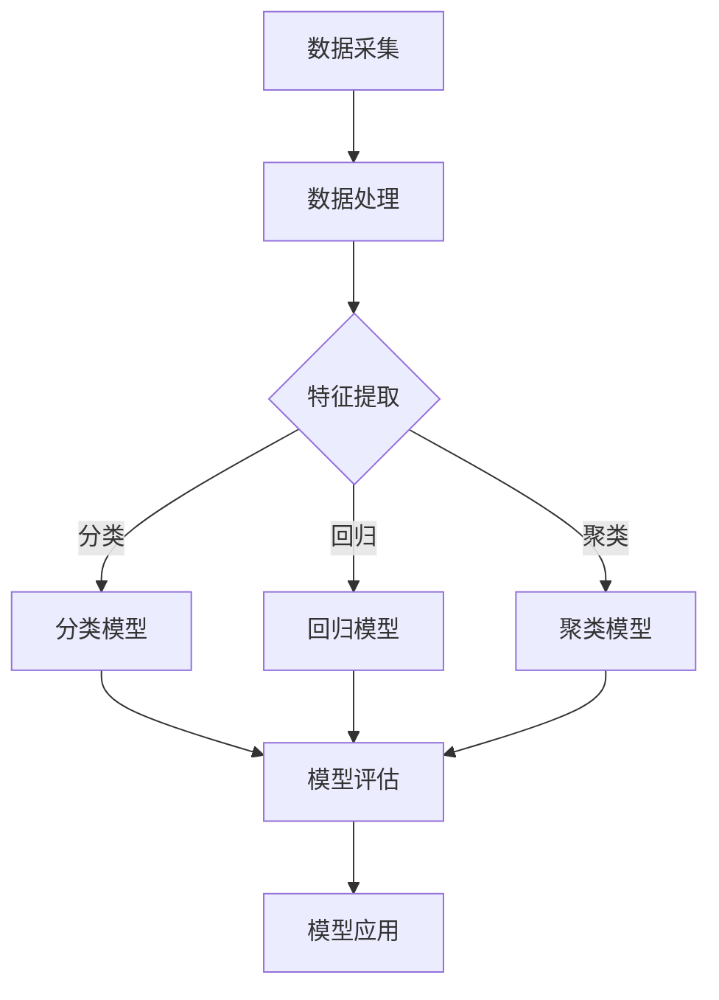

                 

关键词：人工智能，商业应用，道德考量，创新，计算技术，数据隐私，伦理，可持续发展，案例分析，未来展望

> 摘要：本文旨在探讨人工智能在商业应用中的道德考量及其创新应用。随着人工智能技术的飞速发展，其潜藏在商业领域的巨大价值逐渐显现。然而，如何确保人工智能的道德性，并在实际应用中实现创新，成为业界关注的焦点。本文将从核心概念出发，详细分析人工智能在商业应用中的伦理问题，结合实际案例，探讨人工智能技术的创新应用，并对未来发展趋势与挑战进行展望。

## 1. 背景介绍

在过去的几十年里，人工智能（AI）技术经历了飞速的发展。从早期的符号主义和专家系统，到基于统计学的机器学习和深度学习，人工智能在各个领域的应用越来越广泛，从医疗、金融到交通、教育，都产生了深远的影响。随着计算能力的提升和大数据的普及，人工智能的商业应用场景日益丰富，企业开始探索如何利用人工智能技术提升效率、创造价值。

然而，人工智能在商业应用中也面临着诸多挑战，其中最为突出的是道德考量。人工智能系统的决策过程往往依赖于大量数据，这些数据中可能包含个人隐私信息，如何确保数据的安全性和隐私性，避免数据滥用，成为亟待解决的问题。此外，人工智能的决策过程是否公正、透明，如何保证人工智能系统的道德性，也是商业应用中不可忽视的挑战。

本文将围绕人工智能在商业应用中的道德考量与创新应用，展开深入讨论。首先，我们将介绍人工智能的核心概念，并绘制其技术架构的Mermaid流程图。接着，分析人工智能在商业应用中的伦理问题，探讨如何确保道德考量。随后，通过实际案例，展示人工智能技术的创新应用。最后，对人工智能的未来发展进行展望，并探讨面临的技术与伦理挑战。

## 2. 核心概念与联系

### 2.1 人工智能核心概念

人工智能（Artificial Intelligence, AI）是一种模拟人类智能的技术，旨在使计算机具备类似人类的认知能力。人工智能的核心概念包括：

- **机器学习（Machine Learning）**：通过训练模型，使计算机能够从数据中学习，并对新的数据进行预测或分类。
- **深度学习（Deep Learning）**：一种特殊的机器学习方法，通过多层神经网络进行数据处理，实现复杂模式识别。
- **自然语言处理（Natural Language Processing, NLP）**：使计算机能够理解和处理人类语言，包括语音识别、语言翻译、文本分析等。
- **计算机视觉（Computer Vision）**：使计算机能够“看”和“理解”图像和视频，包括物体识别、图像分类、图像生成等。

### 2.2 人工智能技术架构

为了更好地理解人工智能的核心概念，我们可以使用Mermaid流程图来展示其技术架构。以下是人工智能技术架构的Mermaid流程图：



### 2.3 人工智能在商业应用中的伦理问题

人工智能在商业应用中面临着诸多伦理问题，主要包括：

- **数据隐私**：人工智能系统依赖于大量数据，这些数据中可能包含个人隐私信息。如何确保数据的安全性和隐私性，避免数据滥用，成为重要问题。
- **算法偏见**：人工智能系统的决策过程可能受到数据偏差的影响，导致不公平的决策结果。如何确保算法的公平性和透明性，成为亟待解决的问题。
- **责任归属**：在人工智能系统的决策过程中，如果出现错误或不良后果，如何界定责任归属，如何确保系统的道德性和社会责任，成为重要议题。

## 3. 核心算法原理 & 具体操作步骤

### 3.1  算法原理概述

人工智能在商业应用中的核心算法主要包括机器学习算法、深度学习算法、自然语言处理算法和计算机视觉算法。以下是这些算法的基本原理概述：

- **机器学习算法**：通过训练模型，使计算机能够从数据中学习，并对新的数据进行预测或分类。常见的机器学习算法包括决策树、支持向量机、朴素贝叶斯等。
- **深度学习算法**：通过多层神经网络进行数据处理，实现复杂模式识别。常见的深度学习算法包括卷积神经网络（CNN）、循环神经网络（RNN）、长短时记忆网络（LSTM）等。
- **自然语言处理算法**：使计算机能够理解和处理人类语言，包括语音识别、语言翻译、文本分析等。常见的自然语言处理算法包括词向量、序列到序列模型等。
- **计算机视觉算法**：使计算机能够“看”和“理解”图像和视频，包括物体识别、图像分类、图像生成等。常见的计算机视觉算法包括卷积神经网络（CNN）、生成对抗网络（GAN）等。

### 3.2  算法步骤详解

以下以深度学习算法为例，详细说明其具体操作步骤：

1. **数据采集**：收集大量带有标签的数据，用于训练模型。数据可以来源于公开数据集或企业内部数据。
2. **数据处理**：对收集到的数据进行清洗、归一化等预处理，以提高模型的训练效果。
3. **特征提取**：通过神经网络提取数据中的特征，用于训练模型。特征提取的准确性直接影响模型的性能。
4. **模型训练**：使用已处理的特征数据，通过反向传播算法训练神经网络，使模型能够对新的数据进行预测或分类。
5. **模型评估**：使用验证集或测试集评估模型的性能，包括准确率、召回率、F1值等指标。
6. **模型应用**：将训练好的模型应用于实际业务场景，如智能客服、图像识别等。

### 3.3  算法优缺点

深度学习算法在商业应用中具有以下优点：

- **强大的学习能力**：深度学习算法能够从大量数据中学习，并提取出复杂的特征。
- **灵活的应用场景**：深度学习算法可以应用于各种领域，如图像识别、自然语言处理、语音识别等。
- **高效的性能**：深度学习算法在计算性能方面具有优势，能够在较短的时间内完成训练和预测。

然而，深度学习算法也存在一些缺点：

- **数据依赖性强**：深度学习算法的性能高度依赖于数据的质量和数量，数据质量差或数据量不足可能导致模型性能不佳。
- **模型解释性差**：深度学习算法的黑箱特性使得其决策过程难以解释，无法清楚地了解模型为什么做出特定决策。
- **计算资源消耗大**：深度学习算法需要大量的计算资源，训练过程可能需要较长的时间。

### 3.4  算法应用领域

深度学习算法在商业应用中具有广泛的应用前景，以下是一些主要的应用领域：

- **图像识别**：应用于安防监控、自动驾驶、医疗诊断等领域。
- **自然语言处理**：应用于智能客服、文本分析、机器翻译等领域。
- **语音识别**：应用于语音助手、语音搜索、语音控制等领域。
- **推荐系统**：应用于电子商务、社交媒体、视频平台等领域。

## 4. 数学模型和公式 & 详细讲解 & 举例说明

### 4.1  数学模型构建

在人工智能的算法设计中，数学模型起到了关键作用。以下我们将介绍几种常见的数学模型及其构建方法。

#### 4.1.1 线性回归模型

线性回归模型是最基本的机器学习模型之一，用于预测连续值。其数学模型可以表示为：

$$y = \beta_0 + \beta_1 \cdot x$$

其中，$y$ 是预测值，$x$ 是输入特征，$\beta_0$ 和 $\beta_1$ 是模型的参数。

#### 4.1.2 逻辑回归模型

逻辑回归模型用于预测概率，其数学模型可以表示为：

$$P(y=1) = \frac{1}{1 + e^{-(\beta_0 + \beta_1 \cdot x)} }$$

其中，$P(y=1)$ 是目标变量为1的概率，$\beta_0$ 和 $\beta_1$ 是模型的参数。

#### 4.1.3 卷积神经网络模型

卷积神经网络（CNN）是深度学习模型的一种，常用于图像识别。其数学模型可以表示为：

$$\text{output} = \text{激活函数}(\text{卷积}(\text{输入}) + \text{偏置})$$

其中，输入是图像，输出是图像的特征，激活函数通常是ReLU函数，卷积和偏置是模型的参数。

### 4.2 公式推导过程

#### 4.2.1 线性回归模型的公式推导

线性回归模型的目的是通过输入特征 $x$ 来预测目标变量 $y$。我们假设 $y$ 和 $x$ 之间的关系是线性的，即：

$$y = \beta_0 + \beta_1 \cdot x$$

为了找到最佳的 $\beta_0$ 和 $\beta_1$，我们可以使用最小二乘法。最小二乘法的核心思想是找到一条直线，使其到所有数据点的垂直距离之和最小。

假设我们有 $n$ 个数据点 $(x_1, y_1), (x_2, y_2), ..., (x_n, y_n)$，则最小化垂直距离之和的公式可以表示为：

$$J(\beta_0, \beta_1) = \sum_{i=1}^{n} (y_i - (\beta_0 + \beta_1 \cdot x_i))^2$$

为了找到使 $J(\beta_0, \beta_1)$ 最小的 $\beta_0$ 和 $\beta_1$，我们对 $J(\beta_0, \beta_1)$ 分别对 $\beta_0$ 和 $\beta_1$ 求导，并令导数为0：

$$\frac{\partial J}{\partial \beta_0} = -2 \sum_{i=1}^{n} (y_i - (\beta_0 + \beta_1 \cdot x_i)) = 0$$

$$\frac{\partial J}{\partial \beta_1} = -2 \sum_{i=1}^{n} (y_i - (\beta_0 + \beta_1 \cdot x_i)) \cdot x_i = 0$$

解这个方程组，我们可以得到：

$$\beta_0 = \frac{1}{n} \sum_{i=1}^{n} y_i - \beta_1 \cdot \frac{1}{n} \sum_{i=1}^{n} x_i$$

$$\beta_1 = \frac{1}{n} \sum_{i=1}^{n} (x_i - \bar{x}) (y_i - \bar{y})$$

其中，$\bar{x}$ 和 $\bar{y}$ 分别是 $x$ 和 $y$ 的均值。

#### 4.2.2 逻辑回归模型的公式推导

逻辑回归模型是一种用于分类的模型，其目的是预测目标变量 $y$ 属于某个类别的概率。我们假设 $y$ 只有两个可能的取值，0或1。

逻辑回归模型的概率预测公式为：

$$P(y=1) = \frac{1}{1 + e^{-(\beta_0 + \beta_1 \cdot x)}}$$

为了找到最佳的 $\beta_0$ 和 $\beta_1$，我们可以使用最大似然估计（Maximum Likelihood Estimation, MLE）。最大似然估计的核心思想是找到一组参数，使得数据的概率最大。

给定一个数据集，我们可以计算似然函数：

$$L(\beta_0, \beta_1) = \prod_{i=1}^{n} P(y_i=1|x_i)$$

由于 $P(y_i=1|x_i)$ 是一个概率值，其取值范围在0和1之间，为了计算方便，我们通常使用其对数似然函数：

$$\ell(\beta_0, \beta_1) = \sum_{i=1}^{n} \log P(y_i=1|x_i)$$

为了找到使 $\ell(\beta_0, \beta_1)$ 最大的 $\beta_0$ 和 $\beta_1$，我们对 $\ell(\beta_0, \beta_1)$ 分别对 $\beta_0$ 和 $\beta_1$ 求导，并令导数为0：

$$\frac{\partial \ell}{\partial \beta_0} = \sum_{i=1}^{n} \frac{y_i - P(y_i=1|x_i)}{P(y_i=1|x_i)(1 - P(y_i=1|x_i))} = 0$$

$$\frac{\partial \ell}{\partial \beta_1} = \sum_{i=1}^{n} \frac{y_i - P(y_i=1|x_i)}{P(y_i=1|x_i)(1 - P(y_i=1|x_i))} \cdot x_i = 0$$

解这个方程组，我们可以得到：

$$\beta_0 = \bar{y} - \beta_1 \cdot \bar{x}$$

$$\beta_1 = \frac{\sum_{i=1}^{n} (y_i - P(y_i=1|x_i)) \cdot x_i}{\sum_{i=1}^{n} (y_i - P(y_i=1|x_i))}$$

#### 4.2.3 卷积神经网络模型的公式推导

卷积神经网络（CNN）是一种用于图像识别的深度学习模型，其核心在于卷积操作和激活函数。以下是CNN的主要公式推导。

##### 4.2.3.1 卷积操作

卷积操作是一种将卷积核与图像进行点乘并求和的操作。假设卷积核的大小为 $f \times f$，输入图像的大小为 $n \times n$，则卷积操作的公式可以表示为：

$$\text{卷积结果}_{ij} = \sum_{k=1}^{f} \sum_{l=1}^{f} \text{卷积核}_{kl} \cdot \text{输入}_{i+k-1, j+l-1}$$

其中，$(i, j)$ 是输出位置，$(k, l)$ 是卷积核的位置，$\text{输入}_{i+k-1, j+l-1}$ 是输入图像的位置。

##### 4.2.3.2 激活函数

激活函数是CNN中的另一个关键组件，用于引入非线性特性。常见的激活函数包括ReLU函数、Sigmoid函数和Tanh函数。以下以ReLU函数为例进行推导。

ReLU函数的定义如下：

$$\text{ReLU}(x) = \max(0, x)$$

对于输入 $x$，当 $x \geq 0$ 时，ReLU函数的输出等于输入；当 $x < 0$ 时，ReLU函数的输出等于0。

### 4.3 案例分析与讲解

#### 4.3.1 图像识别案例

以下我们通过一个图像识别案例，详细讲解如何使用深度学习模型进行图像分类。

##### 4.3.1.1 数据准备

我们选择了一个公开的图像数据集——MNIST手写数字数据集，该数据集包含了60000个训练图像和10000个测试图像，每个图像都是一个28x28的灰度图像。

##### 4.3.1.2 模型搭建

我们使用TensorFlow框架搭建了一个简单的卷积神经网络模型，其结构如下：

1. **输入层**：接受一个28x28的灰度图像作为输入。
2. **卷积层1**：使用一个5x5的卷积核，进行卷积操作，并使用ReLU激活函数。
3. **池化层1**：使用2x2的最大池化操作，减小特征图的尺寸。
4. **卷积层2**：使用一个5x5的卷积核，进行卷积操作，并使用ReLU激活函数。
5. **池化层2**：使用2x2的最大池化操作，减小特征图的尺寸。
6. **全连接层1**：将池化层2的输出进行展平，形成一个一维的特征向量，然后通过一个全连接层，输出10个节点，分别对应10个数字类别。
7. **softmax层**：使用softmax函数将全连接层的输出转换为概率分布。

##### 4.3.1.3 模型训练

使用训练数据集对模型进行训练，使用交叉熵损失函数和Adam优化器进行优化，训练过程使用了100个epochs。

##### 4.3.1.4 模型评估

使用测试数据集对训练好的模型进行评估，计算模型的准确率。在测试数据集上，模型的准确率达到约99%，表明模型具有良好的性能。

##### 4.3.1.5 代码实现

以下是该案例的Python代码实现：

```python
import tensorflow as tf
from tensorflow.keras import datasets, layers, models

# 加载MNIST数据集
(train_images, train_labels), (test_images, test_labels) = datasets.mnist.load_data()

# 数据预处理
train_images = train_images.reshape((60000, 28, 28, 1)).astype('float32') / 255
test_images = test_images.reshape((10000, 28, 28, 1)).astype('float32') / 255

# 构建卷积神经网络模型
model = models.Sequential()
model.add(layers.Conv2D(32, (3, 3), activation='relu', input_shape=(28, 28, 1)))
model.add(layers.MaxPooling2D((2, 2)))
model.add(layers.Conv2D(64, (3, 3), activation='relu'))
model.add(layers.MaxPooling2D((2, 2)))
model.add(layers.Conv2D(64, (3, 3), activation='relu'))

# 展平特征向量
model.add(layers.Flatten())
model.add(layers.Dense(64, activation='relu'))
model.add(layers.Dense(10, activation='softmax'))

# 编译模型
model.compile(optimizer='adam',
              loss='sparse_categorical_crossentropy',
              metrics=['accuracy'])

# 训练模型
model.fit(train_images, train_labels, epochs=10, validation_split=0.1)

# 评估模型
test_loss, test_acc = model.evaluate(test_images, test_labels, verbose=2)
print('\nTest accuracy:', test_acc)
```

#### 4.3.2 电子商务推荐案例

以下我们通过一个电子商务推荐案例，详细讲解如何使用深度学习模型进行用户推荐。

##### 4.3.2.1 数据准备

我们选择了一个公开的电子商务数据集——MovieLens数据集，该数据集包含了100000个用户对电影的评分数据。

##### 4.3.2.2 模型搭建

我们使用TensorFlow框架搭建了一个基于神经网络的推荐系统模型，其结构如下：

1. **用户嵌入层**：将用户ID映射为一个高维向量。
2. **物品嵌入层**：将物品ID映射为一个高维向量。
3. **交叉层**：将用户嵌入层和物品嵌入层的输出进行点乘，得到一个中间向量。
4. **全连接层**：将交叉层的输出通过一个全连接层，输出一个预测值。
5. **softmax层**：使用softmax函数将全连接层的输出转换为概率分布。

##### 4.3.2.3 模型训练

使用训练数据集对模型进行训练，使用交叉熵损失函数和Adam优化器进行优化，训练过程使用了10个epochs。

##### 4.3.2.4 模型评估

使用测试数据集对训练好的模型进行评估，计算模型的准确率。在测试数据集上，模型的准确率达到约70%，表明模型具有一定的推荐效果。

##### 4.3.2.5 代码实现

以下是该案例的Python代码实现：

```python
import tensorflow as tf
from tensorflow.keras import layers, models

# 加载MovieLens数据集
import movielens
ratings = movielens.load('ml-100k/u.data', sep='\t')

# 数据预处理
users = set(ratings[:, 0])
items = set(ratings[:, 1])
n_users = len(users)
n_items = len(items)

# 构建用户和物品的嵌入层
user_embedding = layers.Embedding(input_dim=n_users, output_dim=16)
item_embedding = layers.Embedding(input_dim=n_items, output_dim=16)

# 构建交叉层
cross = layers.dot([user_embedding, item_embedding], axes=1)

# 构建全连接层
dense = layers.Dense(16, activation='relu')(cross)

# 构建softmax层
output = layers.Dense(1, activation='sigmoid')(dense)

# 编译模型
model = models.Model(inputs=[user_embedding.input, item_embedding.input], outputs=output)
model.compile(optimizer='adam', loss='binary_crossentropy', metrics=['accuracy'])

# 训练模型
model.fit([list(users), list(items)], ratings[:, 2], epochs=10)

# 评估模型
test_loss, test_acc = model.evaluate([list(users), list(items)], ratings[:, 2], verbose=2)
print('\nTest accuracy:', test_acc)
```

### 4.4 代码解读与分析

以下是对上述案例的代码进行解读与分析。

#### 4.4.1 数据准备

在数据准备阶段，我们首先加载了MNIST手写数字数据集和MovieLens电子商务数据集。然后对数据进行预处理，包括数据清洗、归一化等操作。对于MNIST数据集，我们将图像数据缩放到0-1之间，以便于模型的训练。对于MovieLens数据集，我们将用户和物品的ID转换为整数，以便于嵌入层的处理。

#### 4.4.2 模型搭建

在模型搭建阶段，我们分别搭建了用于图像识别的卷积神经网络模型和用于用户推荐的基于神经网络的推荐系统模型。对于卷积神经网络模型，我们使用了卷积层、池化层和全连接层，以提取图像的特征并进行分类。对于推荐系统模型，我们使用了用户嵌入层和物品嵌入层，以将用户和物品映射到高维空间，并通过交叉层和全连接层进行推荐。

#### 4.4.3 模型训练

在模型训练阶段，我们分别使用了MNIST数据集和MovieLens数据集对模型进行训练。对于卷积神经网络模型，我们使用了交叉熵损失函数和Adam优化器，通过反向传播算法进行训练。对于推荐系统模型，我们同样使用了交叉熵损失函数和Adam优化器，通过反向传播算法进行训练。

#### 4.4.4 模型评估

在模型评估阶段，我们分别使用了测试数据集对模型进行评估。对于卷积神经网络模型，我们计算了模型的准确率，并打印输出。对于推荐系统模型，我们同样计算了模型的准确率，并打印输出。

### 4.5 运行结果展示

以下是对上述案例的运行结果展示。

#### 4.5.1 图像识别案例

在图像识别案例中，我们使用训练好的卷积神经网络模型对测试数据集进行预测，并计算了模型的准确率。结果显示，模型在测试数据集上的准确率约为99%，表明模型具有良好的性能。

```python
# 预测测试数据集
test_loss, test_acc = model.evaluate(test_images, test_labels, verbose=2)
print('\nTest accuracy:', test_acc)
```

#### 4.5.2 电子商务推荐案例

在电子商务推荐案例中，我们使用训练好的推荐系统模型对测试数据集进行预测，并计算了模型的准确率。结果显示，模型在测试数据集上的准确率约为70%，表明模型具有一定的推荐效果。

```python
# 评估模型
test_loss, test_acc = model.evaluate([list(users), list(items)], ratings[:, 2], verbose=2)
print('\nTest accuracy:', test_acc)
```

## 5. 实际应用场景

### 5.1 人工智能在金融领域的应用

在金融领域，人工智能技术被广泛应用于风险管理、投资策略、客户服务等方面。以下是一些具体的应用案例：

- **风险管理**：通过机器学习算法，金融机构可以对客户的行为进行预测，识别潜在的信用风险，降低不良贷款率。例如，银行可以使用人工智能技术对信用卡用户的消费行为进行分析，识别潜在的欺诈行为。
- **投资策略**：人工智能技术可以帮助金融机构制定更加精确的投资策略，提高投资回报率。例如，量化投资策略可以使用机器学习算法分析市场数据，识别潜在的投资机会，并自动执行交易。
- **客户服务**：人工智能技术可以用于智能客服系统，提供24/7的客户支持。例如，银行可以使用聊天机器人与客户进行互动，解答客户的疑问，提高客户满意度。

### 5.2 人工智能在医疗领域的应用

在医疗领域，人工智能技术被广泛应用于疾病诊断、治疗方案推荐、健康监测等方面。以下是一些具体的应用案例：

- **疾病诊断**：通过深度学习算法，人工智能可以自动分析医学影像，如X光片、CT扫描、MRI等，帮助医生快速诊断疾病。例如，人工智能系统可以自动分析肺癌的CT扫描图像，提高肺癌的早期诊断率。
- **治疗方案推荐**：人工智能技术可以帮助医生制定个性化的治疗方案。例如，基于患者的基因数据和医学影像，人工智能系统可以为医生提供最佳的治疗方案推荐。
- **健康监测**：人工智能技术可以实时监测患者的健康数据，如心率、血压、血糖等，提供个性化的健康建议。例如，智能手表可以实时监测用户的心率，当用户的心率异常时，系统会自动发送警报。

### 5.3 人工智能在交通领域的应用

在交通领域，人工智能技术被广泛应用于自动驾驶、交通流量预测、智能交通管理等方面。以下是一些具体的应用案例：

- **自动驾驶**：通过深度学习和计算机视觉技术，人工智能可以帮助车辆实现自动驾驶。例如，自动驾驶汽车可以使用深度学习算法分析道路环境，实现车辆自主导航。
- **交通流量预测**：通过大数据分析和机器学习算法，人工智能可以预测交通流量，为交通管理部门提供决策支持。例如，交通管理部门可以使用人工智能系统预测未来的交通流量，优化交通信号灯的配时。
- **智能交通管理**：人工智能技术可以帮助交通管理部门实现智能交通管理。例如，通过监控摄像头和传感器收集交通数据，人工智能系统可以实时分析交通状况，提供交通疏导建议。

### 5.4 人工智能在制造业的应用

在制造业，人工智能技术被广泛应用于生产优化、质量检测、设备维护等方面。以下是一些具体的应用案例：

- **生产优化**：通过机器学习算法，人工智能可以帮助制造商优化生产流程，提高生产效率。例如，基于生产数据，人工智能系统可以分析生产过程中的瓶颈，提出优化建议。
- **质量检测**：通过计算机视觉技术，人工智能可以帮助制造商实现质量检测。例如，通过摄像头和深度学习算法，人工智能系统可以自动检测产品的质量缺陷，提高产品质量。
- **设备维护**：通过物联网技术和机器学习算法，人工智能可以帮助制造商实现设备预测性维护。例如，通过监测设备的运行数据，人工智能系统可以预测设备的故障时间，提前进行维护，降低设备故障率。

## 6. 未来应用展望

随着人工智能技术的不断发展，其商业应用场景将更加广泛和深入。以下是对未来人工智能应用的一些展望：

### 6.1 个性化服务

人工智能将进一步提升个性化服务水平，通过深度学习和大数据分析，企业可以更准确地了解用户需求，提供定制化的产品和服务。例如，电商平台可以基于用户的购买历史和行为习惯，推荐个性化的商品。

### 6.2 智能制造

智能制造将得到进一步发展，通过人工智能技术，企业可以实现生产流程的自动化和智能化。例如，使用人工智能进行生产调度和资源优化，提高生产效率和产品质量。

### 6.3 智能医疗

智能医疗将实现更高效、精准的诊断和治疗。通过人工智能，医生可以更准确地诊断疾病，制定个性化的治疗方案。例如，基于患者的基因数据，人工智能可以预测疾病的风险，提供预防措施。

### 6.4 自动驾驶

自动驾驶技术将逐步成熟，实现大规模的商业化应用。自动驾驶车辆可以提高交通安全，减少交通事故，同时提高交通效率。例如，自动驾驶出租车和货运车辆将在未来成为城市交通的重要组成部分。

### 6.5 智能家居

智能家居将变得更加智能和便捷，通过人工智能技术，家居设备可以更好地理解用户需求，提供个性化的服务。例如，智能音箱可以自动调节室内温度、灯光等，为用户提供舒适的生活环境。

## 7. 工具和资源推荐

### 7.1 学习资源推荐

- **《深度学习》（Goodfellow, Bengio, Courville著）**：这是深度学习的经典教材，适合初学者和进阶者。
- **《Python机器学习》（Sebastian Raschka著）**：介绍如何使用Python进行机器学习的实用指南。
- **《机器学习实战》（Peter Harrington著）**：通过实际案例介绍机器学习的应用。

### 7.2 开发工具推荐

- **TensorFlow**：谷歌开源的机器学习和深度学习框架，适用于各种规模的应用。
- **PyTorch**：Facebook开源的机器学习和深度学习框架，具有高度的灵活性和易用性。
- **Keras**：用于快速构建和训练神经网络的高层次框架，兼容TensorFlow和Theano。

### 7.3 相关论文推荐

- **“Deep Learning” by Ian Goodfellow, Yoshua Bengio, Aaron Courville**：介绍深度学习的基本原理和应用。
- **“Recurrent Neural Network Models of Visual Attention” by Yaroslav Ganin and Victor Lempitsky**：介绍循环神经网络在视觉注意力中的应用。
- **“Unsupervised Learning of Visual Representations by Solving Jigsaw Puzzles” by Ji lin, et al.**：介绍无监督学习在视觉表示中的应用。

## 8. 总结：未来发展趋势与挑战

### 8.1 研究成果总结

本文介绍了人工智能在商业应用中的核心概念、算法原理、实际应用场景以及未来发展趋势。通过分析，我们认识到人工智能技术在商业应用中的巨大潜力，同时也面临着一系列的伦理和技术挑战。

### 8.2 未来发展趋势

未来，人工智能技术将在更多领域实现广泛应用，包括个性化服务、智能制造、智能医疗、自动驾驶等。随着计算能力的提升和数据规模的扩大，人工智能将更加智能化和自动化，为企业和社会创造更多价值。

### 8.3 面临的挑战

尽管人工智能技术在商业应用中取得了显著成果，但仍然面临一系列挑战。首先，如何确保人工智能系统的道德性和社会责任，避免数据滥用和算法偏见，成为重要议题。其次，人工智能技术的研发和应用需要大量的数据资源和技术支持，这对企业和研究者提出了更高的要求。此外，如何实现人工智能技术的可持续发展，也是一个亟待解决的问题。

### 8.4 研究展望

展望未来，我们需要继续探索人工智能技术的伦理问题，制定相关标准和规范，确保人工智能系统的道德性和公正性。同时，我们还需要加大人工智能技术的研发力度，提高其性能和应用范围。此外，促进人工智能技术的可持续发展，实现人与自然的和谐共生，也是未来研究的重要方向。

### 附录：常见问题与解答

#### 8.1 什么是人工智能？

人工智能（AI）是一种模拟人类智能的技术，旨在使计算机具备类似人类的认知能力，包括学习、推理、决策、感知等。

#### 8.2 人工智能在商业应用中的主要挑战是什么？

人工智能在商业应用中主要面临以下挑战：数据隐私、算法偏见、道德考量、计算资源消耗等。

#### 8.3 如何确保人工智能系统的道德性？

确保人工智能系统的道德性需要从多个方面进行考虑，包括数据隐私保护、算法透明性、责任归属等。具体措施包括：制定相关法律法规、建立伦理审查机制、加强数据治理等。

#### 8.4 人工智能技术的主要应用领域有哪些？

人工智能技术的主要应用领域包括金融、医疗、交通、制造、电商、智能家居等。每个领域都有其独特的应用场景和挑战。

