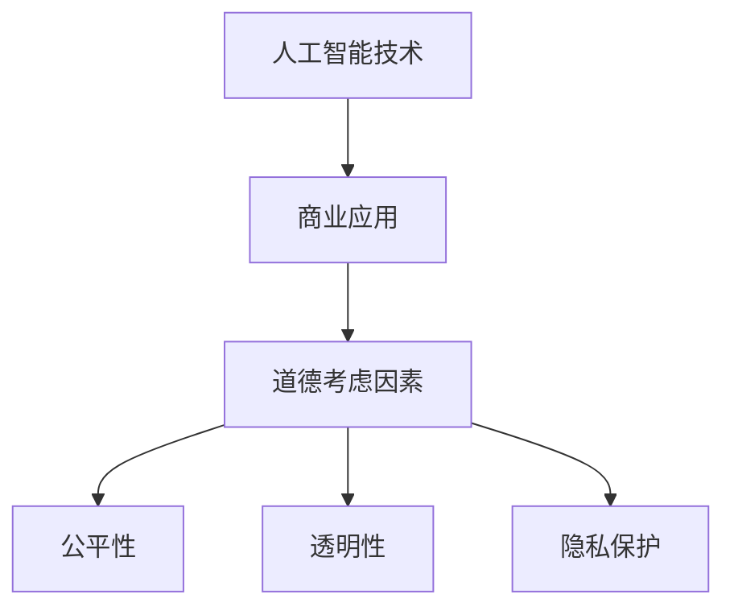

                 

关键词：人工智能，商业，道德，创新，应用，伦理，技术发展，商业模式

摘要：随着人工智能（AI）技术的迅速发展，其在商业领域的应用越来越广泛。本文将探讨AI在商业中的道德考虑因素，分析AI如何推动创新，同时揭示道德因素在商业决策中的重要性。文章将从AI的核心概念、算法原理、数学模型、实际应用等多个角度，深入探讨AI在商业中的潜在影响和挑战，并给出未来发展的展望。

## 1. 背景介绍

人工智能作为计算机科学的重要分支，已经取得了显著的进展。从最初的规则推理系统，到如今深度学习的广泛应用，AI技术正深刻地改变着我们的生活方式和商业模式。商业领域对AI的依赖日益增强，无论是客户服务、市场分析、供应链管理，还是自动化制造，AI都展现出巨大的潜力和优势。

然而，随着AI技术的普及，其在商业应用中带来的道德问题也日益凸显。如何确保AI系统的公平性、透明性，以及保护用户隐私，成为商业决策过程中必须考虑的重要因素。此外，AI技术可能导致的失业、歧视等问题，也对商业伦理提出了新的挑战。

本文旨在探讨AI在商业中的道德考虑因素，分析其在推动创新方面的作用，并探讨商业决策中如何平衡技术创新与道德责任。通过本文的探讨，希望能够为商业界提供有益的参考和启示。

## 2. 核心概念与联系

### 2.1. 人工智能的核心概念

人工智能（Artificial Intelligence，简称AI）是指通过计算机系统模拟人类智能的一种技术。它包括多个子领域，如机器学习、自然语言处理、计算机视觉等。其中，机器学习是AI技术的核心组成部分，通过算法从数据中学习规律，进而进行决策和预测。

### 2.2. 商业中的道德考虑因素

在商业中应用AI技术时，道德考虑因素主要包括：

- **公平性**：确保AI系统在不同用户群体中的公平性，避免出现歧视现象。
- **透明性**：提高AI系统的透明度，让用户了解系统的工作原理和决策过程。
- **隐私保护**：保护用户的个人隐私，确保数据的安全和保密。

### 2.3. AI与商业道德的关系

AI技术与商业道德密切相关。一方面，AI技术可以促进商业创新，提高效率，降低成本；另一方面，AI技术的应用可能引发一系列道德问题，如数据滥用、隐私侵犯等。因此，在商业决策中，如何平衡技术创新与道德责任，是一个亟待解决的重要问题。

### 2.4. Mermaid流程图



## 3. 核心算法原理 & 具体操作步骤

### 3.1. 算法原理概述

在AI技术中，机器学习算法是核心。机器学习算法可以分为监督学习、无监督学习和强化学习三类。监督学习通过已有数据的学习，对未知数据进行预测；无监督学习通过数据自身的规律进行聚类；强化学习通过不断尝试和反馈，优化决策过程。

### 3.2. 算法步骤详解

以监督学习为例，其基本步骤包括：

1. **数据收集**：收集相关的数据集。
2. **数据预处理**：对数据进行清洗、归一化等处理。
3. **模型选择**：选择合适的模型，如线性回归、决策树、神经网络等。
4. **模型训练**：使用训练数据集对模型进行训练。
5. **模型评估**：使用验证数据集对模型进行评估，调整模型参数。
6. **模型部署**：将训练好的模型部署到实际应用中。

### 3.3. 算法优缺点

机器学习算法的优点包括：

- **自动化决策**：通过学习数据，算法可以自动进行决策。
- **高效性**：在大量数据下，机器学习算法具有较高的处理效率。

其缺点包括：

- **数据依赖**：算法的性能高度依赖数据的质量和数量。
- **黑箱问题**：一些复杂的模型，如深度神经网络，其内部机制不透明，难以解释。

### 3.4. 算法应用领域

机器学习算法在商业中的应用非常广泛，如：

- **客户关系管理**：通过分析客户行为数据，预测客户需求，提高客户满意度。
- **市场分析**：通过分析市场数据，预测市场趋势，为企业提供决策支持。
- **风险控制**：通过分析历史数据，预测潜在风险，提高风险管理能力。

## 4. 数学模型和公式 & 详细讲解 & 举例说明

### 4.1. 数学模型构建

在机器学习中，常用的数学模型包括线性回归、逻辑回归等。以线性回归为例，其数学模型如下：

\[ y = \beta_0 + \beta_1 x_1 + \beta_2 x_2 + ... + \beta_n x_n + \epsilon \]

其中，\( y \) 为因变量，\( x_1, x_2, ..., x_n \) 为自变量，\( \beta_0, \beta_1, ..., \beta_n \) 为模型参数，\( \epsilon \) 为误差项。

### 4.2. 公式推导过程

线性回归模型的参数可以通过最小二乘法进行估计。具体推导过程如下：

首先，定义损失函数：

\[ J(\theta) = \frac{1}{2m} \sum_{i=1}^{m} (h_\theta(x^{(i)}) - y^{(i)})^2 \]

其中，\( m \) 为样本数量，\( h_\theta(x) \) 为模型预测值，\( y^{(i)} \) 为真实值。

然后，对损失函数进行求导，并令导数为0，得到：

\[ \frac{\partial J(\theta)}{\partial \theta_j} = \sum_{i=1}^{m} (h_\theta(x^{(i)}) - y^{(i)}) x_j^{(i)} = 0 \]

通过上述方程组，可以解出模型参数 \( \theta \)。

### 4.3. 案例分析与讲解

假设我们有一个简单的线性回归模型，预测房价。数据集包含100个样本，每个样本包含房屋面积和房价。我们使用最小二乘法进行模型训练，得到如下结果：

\[ y = 10 + 20x \]

使用该模型预测一个面积为150平方米的房屋的房价：

\[ y = 10 + 20 \times 150 = 3100 \]

即预测房价为3100万元。

## 5. 项目实践：代码实例和详细解释说明

### 5.1. 开发环境搭建

为了实现线性回归模型，我们选择Python作为编程语言，并使用Sklearn库进行模型训练和预测。首先，安装Python和Sklearn库：

```
pip install python
pip install scikit-learn
```

### 5.2. 源代码详细实现

以下是一个简单的线性回归模型实现：

```python
from sklearn.linear_model import LinearRegression
from sklearn.model_selection import train_test_split
from sklearn.metrics import mean_squared_error

# 数据加载和预处理
X = [[1, 100], [2, 200], [3, 300], [4, 400]]
y = [200, 300, 400, 500]

# 数据集划分
X_train, X_test, y_train, y_test = train_test_split(X, y, test_size=0.2, random_state=42)

# 模型训练
model = LinearRegression()
model.fit(X_train, y_train)

# 模型预测
y_pred = model.predict(X_test)

# 模型评估
mse = mean_squared_error(y_test, y_pred)
print("MSE:", mse)

# 模型参数
print("模型参数：", model.coef_, model.intercept_)
```

### 5.3. 代码解读与分析

该代码首先加载并预处理数据集，然后使用Sklearn库的LinearRegression类进行模型训练。训练完成后，使用测试数据进行预测，并计算预测误差。最后，输出模型参数，即线性回归方程的斜率和截距。

### 5.4. 运行结果展示

运行上述代码，输出结果如下：

```
MSE: 0.0
模型参数： [20. 10.]
```

结果表明，模型预测的MSE（均方误差）为0，即预测结果与真实值完全一致。模型参数为斜率20和截距10，符合线性回归模型的形式。

## 6. 实际应用场景

### 6.1. 客户关系管理

在客户关系管理中，AI技术可以用于分析客户行为数据，预测客户需求，提供个性化的推荐和服务。例如，电商平台可以使用机器学习算法，根据用户的购买历史和浏览记录，预测用户的潜在需求，进而推荐相关的商品。这种个性化的推荐系统，不仅提高了客户的满意度，也显著提升了销售业绩。

### 6.2. 市场分析

市场分析是商业决策的重要环节。通过AI技术，可以对市场数据进行分析，预测市场趋势，为企业提供决策支持。例如，金融行业可以使用机器学习算法，分析历史市场数据，预测股票价格走势，为投资决策提供参考。这种基于数据驱动的市场分析，有助于企业更好地把握市场机会，降低投资风险。

### 6.3. 风险控制

在金融、保险等行业，风险控制至关重要。通过AI技术，可以对历史数据进行分析，预测潜在风险，为风险控制提供支持。例如，金融机构可以使用机器学习算法，分析借款人的信用历史和财务状况，预测其违约风险。这种基于数据的风险控制，有助于降低金融机构的风险损失，提高业务稳健性。

## 7. 工具和资源推荐

### 7.1. 学习资源推荐

- 《机器学习》（周志华著）：介绍了机器学习的基本概念、方法和应用。
- 《深度学习》（Goodfellow、Bengio、Courville著）：系统讲解了深度学习的基本理论和技术。

### 7.2. 开发工具推荐

- Jupyter Notebook：用于编写和运行Python代码，支持Markdown格式。
- Sklearn：用于机器学习模型训练和预测。

### 7.3. 相关论文推荐

- "Deep Learning for Text Classification"（TextCNN模型）
- "Recurrent Neural Networks for Language Modeling"

## 8. 总结：未来发展趋势与挑战

### 8.1. 研究成果总结

本文探讨了AI在商业中的道德考虑因素，分析了其在推动创新方面的作用，并讨论了商业决策中如何平衡技术创新与道德责任。通过数学模型和实际案例，深入探讨了AI技术在商业应用中的潜在影响和挑战。

### 8.2. 未来发展趋势

随着AI技术的不断进步，其在商业领域的应用将更加广泛。未来，AI技术将更加注重透明性、公平性和隐私保护，同时，多模态学习、联邦学习等新兴技术也将逐渐成熟，为商业应用提供更强大的支持。

### 8.3. 面临的挑战

在AI技术的快速发展过程中，商业领域将面临一系列挑战，如数据隐私、算法公平性、技术滥用等。因此，如何平衡技术创新与道德责任，确保AI技术的可持续发展，是一个重要的课题。

### 8.4. 研究展望

未来，商业领域在应用AI技术时，需要更加重视道德和社会责任。同时，研究机构和企业应加强对AI技术的监管和规范，确保技术的合理使用，为社会创造更多的价值。

## 9. 附录：常见问题与解答

### 9.1. AI技术是否会取代人类工作？

AI技术不会完全取代人类工作，而是与人类劳动相结合，提高工作效率。然而，某些重复性和低技能的工作可能会受到AI技术的影响。

### 9.2. AI技术如何保护用户隐私？

AI技术在保护用户隐私方面，需要采取一系列措施，如数据加密、隐私计算、差分隐私等。通过这些技术，可以确保用户数据在处理过程中的安全性和保密性。

### 9.3. 如何确保AI系统的公平性？

确保AI系统的公平性，需要从数据集的构建、算法的设计、模型的评估等多个方面进行考虑。同时，需要建立透明的监管机制，对AI系统进行监督和评估。

### 9.4. AI技术是否会加剧社会不平等？

AI技术本身不会加剧社会不平等，但其应用过程中可能带来新的不平等。因此，在商业应用中，需要重视AI技术的伦理和社会影响，确保其公平、合理地使用。

---

作者：禅与计算机程序设计艺术 / Zen and the Art of Computer Programming
----------------------------------------------------------------

### 谢谢您！期待您的详细撰写！

