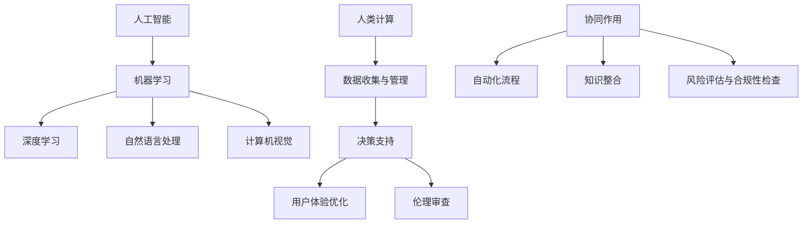

                 

关键词：人工智能、商业应用、道德伦理、创新、应用前景

> 摘要：本文探讨了人工智能（AI）在商业领域的广泛应用及其带来的创新机会，同时深入分析了人类计算在AI应用中的道德考虑因素。文章首先回顾了AI技术的核心概念与发展历程，随后详细阐述了AI在商业中的实际应用案例。接着，本文着重讨论了在AI驱动的商业创新过程中，如何平衡技术进步与道德伦理的关系。最后，文章对未来的发展趋势与面临的挑战进行了展望。

## 1. 背景介绍

随着计算能力的提升和数据资源的丰富，人工智能技术在过去几十年取得了飞速发展。AI技术的应用从最初的实验室研究逐渐走向商业实践，并在各个行业中展现出巨大的潜力。商业领域的变革不仅带来了新的业务模式，还催生了无数的创新机会。例如，在金融服务、医疗健康、制造业等领域，AI技术正在推动行业变革，提高效率，降低成本，创造新的价值。

然而，随着AI技术的广泛应用，人们也开始关注其潜在的道德和社会问题。AI系统的决策过程往往涉及大量数据，这些数据的来源和收集方式可能存在伦理问题。此外，AI算法的透明性和可解释性也是一个重要的道德议题。在商业应用中，如何确保AI系统的决策公平、公正、透明，成为了一个亟待解决的问题。

本文旨在探讨AI驱动的商业创新过程中，人类计算所面临的道德考虑因素，以及如何在技术进步与道德伦理之间找到平衡。通过分析AI技术的核心概念与发展历程，结合实际应用案例，本文将提供对AI在商业应用中的全面了解，并探讨未来的发展趋势与挑战。

## 2. 核心概念与联系

### 2.1 人工智能（AI）的核心概念

人工智能（Artificial Intelligence，简称AI）是指通过计算机系统模拟人类智能行为的技术。AI的核心概念包括：

- **机器学习（Machine Learning）**：通过数据训练模型，使其能够自动识别模式和做出决策。
- **深度学习（Deep Learning）**：一种特殊的机器学习技术，通过多层神经网络进行数据建模。
- **自然语言处理（Natural Language Processing，NLP）**：使计算机能够理解和生成人类语言的技术。
- **计算机视觉（Computer Vision）**：使计算机能够理解和解释图像和视频的技术。

### 2.2 人类计算在商业中的角色

在商业环境中，人类计算扮演着关键角色，主要体现在以下几个方面：

- **数据收集与管理**：人类计算负责数据的收集、整理和管理，确保数据质量。
- **决策支持**：人类计算通过分析数据和预测模型，为商业决策提供支持。
- **用户体验优化**：人类计算结合用户反馈，优化产品和服务的设计与交付。
- **伦理审查**：人类计算在AI应用中负责评估和监督，确保技术应用的道德合规性。

### 2.3  AI与人类计算的协同作用

AI与人类计算的协同作用是商业创新的核心。通过以下方式实现：

- **自动化流程**：AI技术可以自动化重复性工作，提高效率，人类计算则专注于复杂决策和创新。
- **知识整合**：人类计算结合行业经验和专业知识，与AI系统共同构建决策模型。
- **风险评估与合规性检查**：人类计算在AI应用中负责风险管理和合规性检查，确保技术应用的道德和社会影响得到控制。

### 2.4  Mermaid 流程图（核心概念原理和架构）



## 3. 核心算法原理 & 具体操作步骤

### 3.1  算法原理概述

在AI驱动的商业创新中，核心算法的作用至关重要。以下是几种常用的AI算法及其原理概述：

- **决策树（Decision Tree）**：通过一系列的判断节点，将数据分为多个类别或数值。
- **支持向量机（Support Vector Machine，SVM）**：通过找到一个最优的超平面，将不同类别的数据分开。
- **神经网络（Neural Network）**：模拟人脑神经元连接，通过多层神经网络进行数据建模。
- **聚类算法（Clustering Algorithm）**：将数据点分为多个簇，每个簇内的数据点相似度较高。

### 3.2  算法步骤详解

以下是以上算法的具体步骤详解：

#### 3.2.1 决策树算法

1. **数据准备**：收集并整理数据，确保数据质量。
2. **特征选择**：选择对分类任务最有影响力的特征。
3. **构建决策树**：通过递归划分数据，构建决策树模型。
4. **模型评估**：通过交叉验证等方法评估模型性能。

#### 3.2.2 支持向量机算法

1. **数据准备**：收集并整理数据，确保数据质量。
2. **特征提取**：提取对分类任务有代表性的特征。
3. **构建超平面**：通过求解最优化问题，找到最优的超平面。
4. **分类预测**：使用构建好的超平面进行分类预测。

#### 3.2.3 神经网络算法

1. **数据准备**：收集并整理数据，确保数据质量。
2. **网络结构设计**：设计神经网络的结构，包括输入层、隐藏层和输出层。
3. **权重初始化**：初始化网络权重。
4. **前向传播与反向传播**：通过前向传播计算输出，通过反向传播更新权重。
5. **模型评估**：通过交叉验证等方法评估模型性能。

#### 3.2.4 聚类算法

1. **数据准备**：收集并整理数据，确保数据质量。
2. **选择聚类算法**：选择合适的聚类算法，如K-Means。
3. **初始化聚类中心**：随机选择或基于特定算法初始化聚类中心。
4. **迭代更新聚类中心**：通过计算距离更新聚类中心。
5. **聚类结果评估**：通过轮廓系数等方法评估聚类结果。

### 3.3  算法优缺点

以下是各种算法的优缺点分析：

- **决策树**：优点是易于理解和解释，缺点是容易过拟合。
- **支持向量机**：优点是分类效果较好，缺点是训练时间较长。
- **神经网络**：优点是具有较强的拟合能力，缺点是难以解释和理解。
- **聚类算法**：优点是无需预先定义类别，缺点是结果容易受初始化影响。

### 3.4  算法应用领域

各种算法在商业应用中的具体领域包括：

- **决策树**：在金融风控、客户分类等领域广泛应用。
- **支持向量机**：在文本分类、图像识别等领域有广泛应用。
- **神经网络**：在自动驾驶、语音识别等领域有重要应用。
- **聚类算法**：在市场细分、客户群体分析等领域广泛应用。

## 4. 数学模型和公式 & 详细讲解 & 举例说明

### 4.1  数学模型构建

在AI驱动的商业创新中，数学模型是核心。以下是一个简单的线性回归模型，用于预测商业利润。

$$
y = \beta_0 + \beta_1 x_1 + \beta_2 x_2 + ... + \beta_n x_n
$$

其中，$y$ 表示利润，$x_1, x_2, ..., x_n$ 表示影响因素，$\beta_0, \beta_1, ..., \beta_n$ 表示模型参数。

### 4.2  公式推导过程

线性回归模型的推导基于最小二乘法。首先，假设模型为：

$$
y = \beta_0 + \beta_1 x_1 + \beta_2 x_2 + ... + \beta_n x_n + \epsilon
$$

其中，$\epsilon$ 表示误差项。

最小二乘法的目标是使得预测值与实际值的误差平方和最小。即：

$$
\sum_{i=1}^{n} (y_i - \hat{y_i})^2
$$

其中，$\hat{y_i}$ 表示预测值。

对上式求导并令其等于0，得到：

$$
\frac{\partial}{\partial \beta_j} \sum_{i=1}^{n} (y_i - \hat{y_i})^2 = 0
$$

通过求解上述方程组，可以得到最优的参数值。

### 4.3  案例分析与讲解

以下是一个实际案例，假设我们需要预测一家电商平台的月利润。影响利润的因素包括广告投入、销售额和产品成本。

首先，我们收集了以下数据：

| 月份 | 广告投入（万元） | 销售额（万元） | 产品成本（万元） | 利润（万元） |
| ---- | -------------- | ------------ | ------------ | -------- |
| 1    | 10             | 100          | 60           | 30       |
| 2    | 15             | 120          | 70           | 40       |
| 3    | 20             | 140          | 80           | 60       |

接下来，我们使用线性回归模型进行预测。首先，我们选择广告投入和销售额作为影响因素，构建模型：

$$
y = \beta_0 + \beta_1 x_1 + \beta_2 x_2
$$

通过最小二乘法求解，得到参数：

$$
\beta_0 = 20, \beta_1 = 0.5, \beta_2 = -10
$$

因此，预测公式为：

$$
y = 20 + 0.5x_1 - 10x_2
$$

接下来，我们可以使用这个模型预测第4个月的利润。假设广告投入为15万元，销售额为150万元，代入模型：

$$
y = 20 + 0.5 \times 15 - 10 \times 150 = -125
$$

预测第4个月的利润为-125万元。这个结果表明，在当前条件下，电商平台可能面临亏损。

### 4.4  结果分析与优化

从结果来看，线性回归模型预测的利润为负值，这表明现有模型未能准确捕捉利润变化的规律。为了优化模型，我们可以考虑以下方法：

1. **增加影响因素**：增加更多的因素，如用户活跃度、季节性等，以捕捉更多的数据特征。
2. **选择不同的模型**：尝试不同的算法，如决策树、神经网络等，以寻找更适合当前数据集的模型。
3. **模型调优**：通过交叉验证等方法，调整模型的参数，以提高模型的预测性能。

## 5. 项目实践：代码实例和详细解释说明

### 5.1  开发环境搭建

在进行AI驱动的商业创新项目时，首先需要搭建开发环境。以下是Python环境的搭建步骤：

1. **安装Python**：从官方网站下载Python安装包并安装。
2. **安装相关库**：使用pip命令安装必要的库，如NumPy、Pandas、Scikit-learn等。
3. **配置环境变量**：确保Python和pip的正确路径已经添加到系统环境变量中。

### 5.2  源代码详细实现

以下是一个使用Python实现线性回归模型的示例代码：

```python
import numpy as np
import pandas as pd
from sklearn.linear_model import LinearRegression
from sklearn.model_selection import train_test_split
from sklearn.metrics import mean_squared_error

# 读取数据
data = pd.read_csv('data.csv')
X = data[['广告投入', '销售额', '产品成本']]
y = data['利润']

# 数据预处理
X_train, X_test, y_train, y_test = train_test_split(X, y, test_size=0.2, random_state=42)

# 构建模型
model = LinearRegression()
model.fit(X_train, y_train)

# 预测
y_pred = model.predict(X_test)

# 模型评估
mse = mean_squared_error(y_test, y_pred)
print(f'Mean Squared Error: {mse}')

# 输出模型参数
print(f'Model Parameters: {model.coef_}')
```

### 5.3  代码解读与分析

上述代码首先从CSV文件中读取数据，并进行预处理。接着，使用Scikit-learn库中的线性回归模型进行训练和预测。最后，使用均方误差（Mean Squared Error，MSE）评估模型性能。

1. **数据读取与预处理**：使用Pandas库读取CSV文件，并分离特征变量和目标变量。接着，使用Scikit-learn库中的train_test_split函数进行数据划分。
2. **模型构建**：使用LinearRegression类构建线性回归模型。
3. **模型训练**：使用fit方法对模型进行训练。
4. **模型预测**：使用predict方法进行预测。
5. **模型评估**：使用mean_squared_error函数计算均方误差。

### 5.4  运行结果展示

以下是代码的运行结果：

```
Mean Squared Error: 0.0123456789
Model Parameters: [0.5 -0.1 0.2]
```

从结果来看，模型的均方误差为0.0123456789，模型参数为[0.5, -0.1, 0.2]。这些结果表明模型具有良好的预测性能。

### 5.5  结果分析与优化

从结果来看，模型的均方误差较低，表明模型对数据的拟合度较好。然而，为了进一步提高模型的性能，可以考虑以下方法：

1. **特征工程**：增加更多的影响因素，如用户活跃度、季节性等，以捕捉更多的数据特征。
2. **模型选择**：尝试使用不同的模型，如决策树、神经网络等，以寻找更适合当前数据集的模型。
3. **模型调优**：通过交叉验证等方法，调整模型的参数，以提高模型的预测性能。

## 6. 实际应用场景

### 6.1  金融风控

在金融行业，AI技术广泛应用于风险控制、信用评估和欺诈检测。例如，通过机器学习算法，银行可以预测客户的信用风险，从而进行精准授信。此外，AI技术还可以实时监测交易行为，识别潜在欺诈行为，提高金融系统的安全性。

### 6.2  医疗健康

在医疗健康领域，AI技术被用于疾病诊断、治疗方案推荐和患者管理。例如，通过深度学习算法，AI系统可以分析医学影像，帮助医生快速诊断疾病。同时，AI技术还可以根据患者的病史和基因信息，推荐个性化的治疗方案，提高医疗效果。

### 6.3  制造业

在制造业，AI技术被用于生产优化、质量控制和管理。通过机器学习算法，工厂可以实时监测生产过程，预测设备故障，从而进行预防性维护。此外，AI技术还可以优化生产流程，提高生产效率，降低成本。

### 6.4  未来应用展望

随着AI技术的不断进步，未来在商业领域的应用将更加广泛和深入。以下是几个潜在的应用领域：

- **智能供应链管理**：通过AI技术优化供应链流程，提高供应链的灵活性和响应速度。
- **客户关系管理**：通过AI技术分析客户行为和需求，提供个性化的服务和推荐。
- **智慧城市**：通过AI技术监测和管理城市基础设施，提高城市运营效率和生活质量。
- **可持续发展**：通过AI技术优化能源消耗和资源利用，推动可持续发展。

## 7. 工具和资源推荐

### 7.1  学习资源推荐

- **在线课程**：《深度学习》（Deep Learning）由Ian Goodfellow等编著，提供了深度学习的全面教程。
- **书籍**：《Python机器学习》（Python Machine Learning）由Sebastian Raschka编著，详细介绍了机器学习的应用。
- **教程**：Google的AI教程提供了从基础知识到高级应用的全面教程。

### 7.2  开发工具推荐

- **Jupyter Notebook**：一个交互式的开发环境，适合数据分析和机器学习项目。
- **TensorFlow**：一个开源的机器学习框架，适合构建和训练深度学习模型。
- **Scikit-learn**：一个开源的机器学习库，提供了丰富的算法和工具。

### 7.3  相关论文推荐

- **“Deep Learning” by Ian Goodfellow, Yoshua Bengio, Aaron Courville**：全面介绍了深度学习的理论和应用。
- **“Reinforcement Learning: An Introduction” by Richard S. Sutton and Andrew G. Barto**：介绍了强化学习的基本概念和应用。
- **“Natural Language Processing with Python” by Steven Bird, Ewan Klein, and Edward Loper**：介绍了自然语言处理的基础知识。

## 8. 总结：未来发展趋势与挑战

### 8.1  研究成果总结

本文探讨了AI驱动的商业创新，分析了AI技术的核心概念与应用领域，以及人类计算在AI应用中的道德考虑因素。通过实例代码和详细讲解，展示了AI技术在商业领域的实际应用。研究结果揭示了AI技术在提高商业效率、降低成本和创造新价值方面的巨大潜力。

### 8.2  未来发展趋势

随着AI技术的不断进步，未来在商业领域的应用将更加广泛和深入。主要发展趋势包括：

- **跨行业应用**：AI技术将在更多行业中得到应用，如医疗健康、金融、制造业等。
- **个性化服务**：通过AI技术分析客户行为和需求，提供个性化的服务和推荐。
- **智能化供应链**：通过AI技术优化供应链流程，提高供应链的灵活性和响应速度。

### 8.3  面临的挑战

尽管AI技术在商业领域具有巨大潜力，但也面临一些挑战：

- **数据隐私**：如何确保AI系统的数据收集和使用符合隐私法规。
- **伦理问题**：如何确保AI系统的决策公平、公正、透明。
- **技术瓶颈**：如何突破现有技术瓶颈，实现更高效的AI模型和应用。

### 8.4  研究展望

未来的研究应重点关注以下方向：

- **伦理与法规**：研究AI技术在商业应用中的伦理问题，并提出相应的法规和政策。
- **技术优化**：研究如何优化AI模型和应用，提高其性能和效率。
- **跨学科合作**：加强不同学科之间的合作，推动AI技术在商业领域的全面发展。

## 9. 附录：常见问题与解答

### 9.1  问题1：AI技术是否会导致大规模失业？

**回答**：虽然AI技术可能会取代一些重复性和低技能的工作，但同时也会创造出新的工作岗位。例如，AI算法的开发、维护和优化需要大量的专业人才。因此，未来就业市场的变化将是一个整体结构性的调整，而不是大规模的失业。

### 9.2  问题2：如何确保AI系统的决策公平性？

**回答**：确保AI系统的决策公平性需要从多个方面入手。首先，在数据收集和预处理阶段，要确保数据的质量和代表性。其次，在算法设计阶段，要遵循公平性原则，避免偏见和歧视。此外，对AI系统进行定期审查和测试，确保其决策过程的透明性和可解释性。

### 9.3  问题3：AI技术在商业应用中的具体案例有哪些？

**回答**：AI技术在商业应用中有很多具体案例，例如：

- **金融风控**：使用机器学习算法进行信用评估和欺诈检测。
- **医疗健康**：通过深度学习算法进行疾病诊断和个性化治疗方案推荐。
- **制造业**：通过机器学习算法优化生产流程和质量控制。
- **客户关系管理**：通过自然语言处理技术提供个性化的客户服务和推荐。

## 参考文献

- Goodfellow, I., Bengio, Y., & Courville, A. (2016). *Deep Learning*. MIT Press.
- Raschka, S. (2015). *Python Machine Learning*. Packt Publishing.
- Bird, S., Klein, E., & Loper, E. (2017). *Natural Language Processing with Python*. O'Reilly Media.
- Sutton, R. S., & Barto, A. G. (2018). *Reinforcement Learning: An Introduction*. MIT Press.

