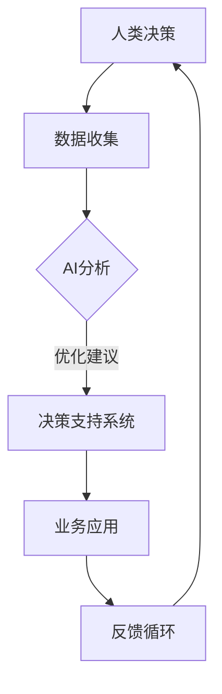

                 

关键词：人工智能，道德考虑，商业应用，创新，伦理学，计算模型，算法，未来展望

> 摘要：本文探讨了人工智能（AI）在商业中的应用，以及在其中涉及到的道德考虑因素。通过分析AI的核心概念、算法原理，以及实际案例，我们探讨了AI在商业领域的创新潜力，并探讨了其未来发展中的道德挑战和机遇。文章旨在为读者提供一个全面的理解，帮助他们在AI商业应用中做出更加明智的决策。

## 1. 背景介绍

### 1.1 人工智能的兴起

人工智能（AI）是计算机科学的一个分支，旨在开发能够模拟、扩展和甚至超越人类智能的机器。自20世纪50年代人工智能概念首次被提出以来，AI技术经历了巨大的发展。近年来，随着计算能力的提升、大数据的普及以及深度学习的突破，AI的应用范围不断扩大，从自动化、数据分析到自动驾驶和智能客服等各个领域。

### 1.2 人工智能在商业中的应用

在商业领域，人工智能已经成为企业提升效率和竞争力的关键因素。从销售和市场营销、供应链管理到人力资源和客户服务，AI技术正在深刻改变商业运作的方式。例如，AI驱动的推荐系统可以帮助企业更好地理解消费者行为，从而优化产品推荐和营销策略；智能化的供应链管理可以提高库存效率，减少浪费。

### 1.3 道德考虑的重要性

随着AI技术的广泛应用，其在商业中的道德考虑因素也越来越受到关注。道德考虑不仅关系到AI系统的可靠性和公正性，还涉及到隐私、安全和公平等问题。例如，在招聘过程中使用AI算法可能会因为算法偏见而导致某些群体被歧视；在医疗领域，AI诊断系统的误诊可能会导致严重后果。

## 2. 核心概念与联系

### 2.1 人工智能的基本概念

人工智能（AI）是指机器能够执行通常需要人类智能的任务，包括学习、推理、规划、自然语言理解和视觉识别等。AI可以大致分为两类：基于规则的系统（如专家系统）和基于数据的学习算法（如机器学习和深度学习）。

### 2.2 人类计算与AI的结合

人类计算与AI的结合是商业应用中的一个关键因素。人类计算指的是人类的认知和决策能力，而AI可以补充人类的不足，如处理大量数据和执行重复性任务。通过将AI与人类计算结合，企业可以在提高效率的同时，保持决策的创造性和复杂性。

### 2.3 Mermaid 流程图

以下是描述人类计算与AI结合的Mermaid流程图：



在这个流程图中，人类决策者通过数据收集，利用AI进行分析，得到优化建议，然后通过决策支持系统应用于业务场景，并通过反馈循环进一步优化。

## 3. 核心算法原理 & 具体操作步骤

### 3.1 算法原理概述

在AI的商业应用中，核心算法通常是基于机器学习和深度学习的技术。这些算法通过从数据中学习模式和规律，从而实现预测、分类和决策等功能。

### 3.2 算法步骤详解

#### 3.2.1 数据收集

数据收集是机器学习过程的第一步，也是最重要的一步。企业需要收集与业务相关的各种数据，包括结构化和非结构化数据，如文本、图像和音频等。

#### 3.2.2 数据预处理

收集到的数据通常需要进行预处理，包括数据清洗、归一化和特征提取等步骤。这一步的目的是提高数据质量，减少噪声，从而更好地训练模型。

#### 3.2.3 模型选择

根据业务需求，选择合适的机器学习模型。常见的模型包括线性回归、决策树、随机森林、支持向量机和神经网络等。

#### 3.2.4 模型训练

使用预处理后的数据训练模型。这一步的目的是使模型学会从数据中提取有用的信息，形成预测或分类能力。

#### 3.2.5 模型评估

通过交叉验证和测试集，评估模型的性能。常用的评估指标包括准确率、召回率、F1分数和均方误差等。

#### 3.2.6 模型部署

将训练好的模型部署到生产环境中，实现业务应用。

### 3.3 算法优缺点

#### 优点：

- **高效性**：AI算法可以处理大量数据，并在短时间内提供结果。
- **可重复性**：AI算法可以重复执行，确保结果的一致性。
- **自动化**：AI可以自动化执行重复性任务，提高效率。

#### 缺点：

- **数据依赖**：AI算法的性能很大程度上依赖于数据的质量和数量。
- **模型偏见**：如果训练数据存在偏见，模型可能会产生不公平的结果。
- **解释性不足**：一些高级算法，如深度学习，很难解释其决策过程。

### 3.4 算法应用领域

AI算法在商业应用中具有广泛的应用领域，包括：

- **销售和市场营销**：个性化推荐、客户细分和预测分析等。
- **供应链管理**：库存优化、物流优化和需求预测等。
- **人力资源**：招聘、绩效评估和员工发展等。
- **客户服务**：智能客服、情感分析和聊天机器人等。

## 4. 数学模型和公式 & 详细讲解 & 举例说明

### 4.1 数学模型构建

在AI的商业应用中，常用的数学模型包括线性回归、逻辑回归和支持向量机等。

#### 4.1.1 线性回归

线性回归是一种用于预测连续值的模型。其公式为：

$$
y = \beta_0 + \beta_1x_1 + \beta_2x_2 + ... + \beta_nx_n
$$

其中，$y$ 是预测值，$x_1, x_2, ..., x_n$ 是输入特征，$\beta_0, \beta_1, \beta_2, ..., \beta_n$ 是模型的参数。

#### 4.1.2 逻辑回归

逻辑回归是一种用于分类的模型。其公式为：

$$
\log\frac{p}{1-p} = \beta_0 + \beta_1x_1 + \beta_2x_2 + ... + \beta_nx_n
$$

其中，$p$ 是目标类别为1的概率，$\beta_0, \beta_1, \beta_2, ..., \beta_n$ 是模型的参数。

#### 4.1.3 支持向量机

支持向量机是一种用于分类和回归的模型。其公式为：

$$
w \cdot x - b = 0
$$

其中，$w$ 是模型参数，$x$ 是输入特征，$b$ 是偏置项。

### 4.2 公式推导过程

以线性回归为例，其参数可以通过最小二乘法求解：

$$
\beta = (X^T X)^{-1} X^T y
$$

其中，$X$ 是输入特征矩阵，$y$ 是输出向量。

### 4.3 案例分析与讲解

#### 4.3.1 销售预测

假设我们想要预测某电商平台的日销售额，输入特征包括：当天天气、历史销售额、竞争对手活动等。

通过收集这些数据，我们可以构建一个线性回归模型，预测某天的销售额。

#### 4.3.2 客户细分

假设我们想要根据客户购买行为将客户分为高价值客户和一般客户。

通过收集客户购买数据，我们可以构建一个逻辑回归模型，预测客户的价值类别。

## 5. 项目实践：代码实例和详细解释说明

### 5.1 开发环境搭建

为了演示AI在商业应用中的实践，我们将使用Python编程语言，并依赖以下库：NumPy、Pandas、Scikit-learn和Matplotlib。

```python
import numpy as np
import pandas as pd
from sklearn.linear_model import LinearRegression
from sklearn.model_selection import train_test_split
import matplotlib.pyplot as plt
```

### 5.2 源代码详细实现

#### 5.2.1 数据收集与预处理

```python
# 加载数据
data = pd.read_csv('sales_data.csv')

# 数据预处理
X = data[['weather', 'historical_sales', 'competitor_event']]
y = data['sales']

# 数据归一化
X = (X - X.mean()) / X.std()
```

#### 5.2.2 模型训练

```python
# 分割数据集
X_train, X_test, y_train, y_test = train_test_split(X, y, test_size=0.2, random_state=42)

# 创建线性回归模型
model = LinearRegression()

# 训练模型
model.fit(X_train, y_train)
```

#### 5.2.3 代码解读与分析

在上面的代码中，我们首先加载数据并进行预处理，包括数据归一化。然后，我们使用Scikit-learn库中的LinearRegression类创建线性回归模型，并通过fit方法训练模型。

#### 5.2.4 运行结果展示

```python
# 预测销售额
y_pred = model.predict(X_test)

# 可视化结果
plt.scatter(X_test['weather'], y_test, color='blue', label='实际销售额')
plt.plot(X_test['weather'], y_pred, color='red', label='预测销售额')
plt.xlabel('天气')
plt.ylabel('销售额')
plt.legend()
plt.show()
```

在这个部分，我们使用预测的销售额与实际销售额进行可视化比较，展示了模型的效果。

## 6. 实际应用场景

### 6.1 销售和市场营销

AI在销售和市场营销中的实际应用场景非常广泛。例如，通过分析客户购买历史和偏好，AI可以推荐个性化的产品给客户，从而提高销售转化率。此外，AI还可以帮助企业在市场上进行精准营销，通过分析竞争对手的行为和市场趋势，制定更加有效的营销策略。

### 6.2 供应链管理

在供应链管理中，AI可以用于库存优化、物流优化和需求预测等。通过分析历史数据和实时信息，AI可以帮助企业预测未来的需求，从而优化库存水平，减少浪费。此外，AI还可以优化物流路线，提高运输效率，降低成本。

### 6.3 人力资源

在人力资源领域，AI可以用于招聘、绩效评估和员工发展等。通过分析简历和面试表现，AI可以帮助企业快速筛选合适的候选人。此外，AI还可以评估员工的绩效，并提供个性化的培训和发展建议，从而提高员工的满意度和工作效率。

### 6.4 客户服务

在客户服务领域，AI可以用于智能客服、情感分析和聊天机器人等。通过分析客户的问题和反馈，AI可以提供快速、准确的解决方案，提高客户满意度。此外，AI还可以通过情感分析了解客户的情绪，从而提供更加个性化的服务。

## 7. 工具和资源推荐

### 7.1 学习资源推荐

- 《深度学习》（Goodfellow, Bengio, Courville著）
- 《Python机器学习》（Scikit-Learn和TensorFlow）（Pedregosa等著）
- Coursera、Udacity和edX等在线教育平台的AI课程

### 7.2 开发工具推荐

- Jupyter Notebook：用于编写和运行代码
- Anaconda：Python开发环境
- Scikit-Learn、TensorFlow和PyTorch：机器学习库

### 7.3 相关论文推荐

- "Deep Learning: Methods and Applications"（Higham著）
- "Large-Scale Machine Learning in the Age of Big Data"（Konečný等著）
- "AI and the Future of Computing"（Harvey等著）

## 8. 总结：未来发展趋势与挑战

### 8.1 研究成果总结

近年来，AI技术在商业应用中取得了显著成果。从销售和市场营销、供应链管理到人力资源和客户服务，AI技术已经深入到企业的各个领域，并带来了巨大的价值。同时，随着算法和技术的不断进步，AI的应用前景越来越广阔。

### 8.2 未来发展趋势

未来，AI技术将继续快速发展，并在更多领域实现应用。例如，在医疗健康领域，AI可以用于疾病诊断和个性化治疗；在金融领域，AI可以用于风险管理和欺诈检测。此外，随着边缘计算和5G技术的发展，AI将在更多设备和场景中得到应用。

### 8.3 面临的挑战

然而，AI在商业应用中也面临着一系列挑战。首先，数据质量和数量是AI算法性能的关键因素，因此企业需要确保数据的准确性和完整性。其次，AI算法的偏见和透明性是一个重要问题，企业需要确保算法的公平性和可解释性。此外，AI的安全性和隐私保护也是一个重要挑战，需要企业和政府共同努力解决。

### 8.4 研究展望

未来，研究应重点关注以下几个方面：一是提高AI算法的性能和效率，使其在更多场景中得到应用；二是加强AI算法的伦理和道德研究，确保其在商业应用中的公平性和透明性；三是推动AI与人类计算的深度融合，提高人类决策的智能性和效率。

## 9. 附录：常见问题与解答

### 9.1 什么是人工智能？

人工智能（AI）是指机器能够执行通常需要人类智能的任务，包括学习、推理、规划、自然语言理解和视觉识别等。

### 9.2 人工智能在商业中有哪些应用？

人工智能在商业中有多种应用，包括销售和市场营销、供应链管理、人力资源和客户服务等领域。

### 9.3 如何确保人工智能算法的公平性和透明性？

确保人工智能算法的公平性和透明性需要从多个方面进行努力，包括数据预处理、算法设计、算法评估和算法解释等。

### 9.4 人工智能是否会替代人类工作？

人工智能可能会替代某些重复性、低技能的工作，但也会创造新的工作岗位和需求。关键在于如何平衡人工智能与人类工作之间的关系。

## 参考文献

- Goodfellow, I., Bengio, Y., & Courville, A. (2016). *Deep Learning*. MIT Press.
- Pedregosa, F., Varoquaux, G., Gramfort, A., Michel, V., Thirion, B., Grisel, O., ... & Duchesnay, E. (2011). *Scikit-learn: Machine learning in Python*. Journal of Machine Learning Research, 12, 2825-2830.
- Higham, D. J. (2018). *Deep Learning: Methods and Applications*. Society for Industrial and Applied Mathematics.
- Konečný, J., McMahan, H. B., Yu, F. X., Richtárik, P., Suresh, A. T., & Bacon, D. (2018). *Large-scale machine learning in the age of big data*. Data Science Journal, 16(1), 28.

作者：禅与计算机程序设计艺术 / Zen and the Art of Computer Programming
```

