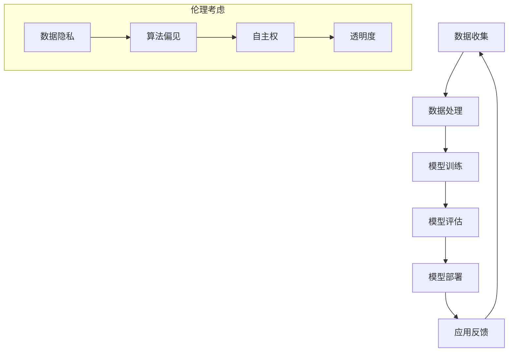

                 

关键词：人工智能，商业道德，计算伦理，应用趋势，道德考虑因素

> 摘要：本文将探讨人工智能在商业中的应用趋势，以及在此过程中所涉及的道德考虑因素。通过分析当前的人工智能技术发展现状，我们提出了在商业应用中需要考虑的伦理问题，并对未来发展趋势进行了预测。

## 1. 背景介绍

近年来，人工智能（AI）技术取得了显著的进展，特别是在深度学习、自然语言处理、计算机视觉等领域。这些技术的突破使得人工智能在商业领域得到了广泛的应用，如智能客服、金融风控、医疗诊断等。然而，随着人工智能技术的不断成熟和应用范围的扩大，一系列伦理和道德问题也逐渐浮现出来。

商业领域的道德考虑因素主要包括以下几个方面：数据隐私、算法偏见、自主权、透明度等。这些问题不仅关系到商业的可持续发展，也关系到社会的公平与正义。因此，如何在商业应用中合理地处理道德问题，成为了一个亟待解决的关键问题。

## 2. 核心概念与联系

在探讨人工智能在商业中的道德考虑因素之前，我们需要了解一些核心概念和原理。以下是人工智能在商业应用中涉及的核心概念和架构，使用Mermaid流程图展示：



### 2.1 数据收集与隐私保护

数据收集是人工智能应用的基础。在商业中，数据往往涉及到用户的隐私信息。因此，如何在确保数据有效性的同时保护用户的隐私，成为了一个重要的问题。数据隐私保护措施包括数据加密、匿名化处理等。

### 2.2 算法偏见与公平性

算法偏见是指人工智能系统在处理数据时，可能会因为数据集中的偏差而导致决策结果的不公平。在商业应用中，算法偏见可能会导致客户服务不公、金融风险控制失误等问题。因此，如何消除算法偏见，提高算法的公平性，是商业领域的一个重要课题。

### 2.3 自主权与控制权

随着人工智能技术的发展，越来越多的决策过程被自动化。然而，这引发了关于自主权和控制权的争议。在商业应用中，如何平衡人工智能的自主性与人类的控制权，是一个需要深入探讨的问题。

### 2.4 透明度与可解释性

人工智能系统的决策过程往往缺乏透明度，这给用户和监管机构带来了很大的困扰。在商业应用中，提高人工智能系统的可解释性，增强其透明度，是提升用户信任度的重要手段。

## 3. 核心算法原理 & 具体操作步骤

### 3.1 算法原理概述

人工智能在商业应用中的核心算法主要包括深度学习、强化学习等。以下是这些算法的基本原理和操作步骤。

### 3.2 算法步骤详解

#### 3.2.1 深度学习算法

深度学习算法通过构建多层神经网络来模拟人类大脑的决策过程。以下是深度学习算法的基本步骤：

1. 数据收集与预处理
2. 构建神经网络模型
3. 模型训练
4. 模型评估
5. 模型部署

#### 3.2.2 强化学习算法

强化学习算法通过不断试错来优化决策过程。以下是强化学习算法的基本步骤：

1. 环境建模
2. 定义奖励机制
3. 决策策略
4. 策略优化

### 3.3 算法优缺点

#### 深度学习算法的优点：

- 强大的表达能力
- 自适应能力
- 高效的计算性能

#### 深度学习算法的缺点：

- 对数据质量要求高
- 模型可解释性差
- 训练过程复杂

#### 强化学习算法的优点：

- 不需要大量标记数据
- 自主性高
- 可应用于复杂环境

#### 强化学习算法的缺点：

- 学习速度慢
- 模型不稳定
- 需要大量计算资源

### 3.4 算法应用领域

深度学习算法在商业中的应用领域广泛，包括图像识别、自然语言处理、推荐系统等。强化学习算法则主要应用于自动化决策、智能客服等领域。

## 4. 数学模型和公式 & 详细讲解 & 举例说明

### 4.1 数学模型构建

在人工智能领域，常见的数学模型包括神经网络、决策树、支持向量机等。以下是神经网络的基本数学模型构建：

#### 神经网络模型：

1. 输入层：接收外部输入信息。
2. 隐藏层：对输入信息进行特征提取和变换。
3. 输出层：输出最终结果。

#### 决策树模型：

1. 根节点：代表整个数据集。
2. 内部节点：代表特征划分。
3. 叶节点：代表决策结果。

#### 支持向量机模型：

1. 定义决策边界。
2. 最小化分类误差。

### 4.2 公式推导过程

以神经网络模型为例，以下是神经网络的基本公式推导：

1. 输入层到隐藏层的激活函数：
   $$ f(x) = \sigma(z) = \frac{1}{1 + e^{-z}} $$
2. 隐藏层到输出层的激活函数：
   $$ f(x) = \sigma(z) = \frac{1}{1 + e^{-z}} $$
3. 前向传播计算：
   $$ z_i = \sum_{j=1}^{n} w_{ij} x_j + b_i $$
   $$ a_i = f(z_i) $$
4. 反向传播计算：
   $$ \delta_i = \frac{\partial L}{\partial z_i} $$
   $$ \frac{\partial L}{\partial w_{ij}} = \delta_i x_j $$
   $$ \frac{\partial L}{\partial b_i} = \delta_i $$

### 4.3 案例分析与讲解

以一个简单的图像识别任务为例，说明神经网络模型的构建和应用过程。

1. 数据集准备：收集并预处理一批图像数据。
2. 模型构建：定义输入层、隐藏层和输出层。
3. 模型训练：通过反向传播算法优化模型参数。
4. 模型评估：计算模型在测试集上的准确率。
5. 模型部署：将训练好的模型应用于实际任务。

## 5. 项目实践：代码实例和详细解释说明

### 5.1 开发环境搭建

为了演示神经网络模型的构建和应用，我们需要搭建一个开发环境。以下是一个简单的Python代码示例：

```python
import numpy as np
import tensorflow as tf

# 设置随机种子
tf.random.set_seed(42)

# 定义神经网络模型
model = tf.keras.Sequential([
    tf.keras.layers.Dense(64, activation='relu', input_shape=(784,)),
    tf.keras.layers.Dense(10, activation='softmax')
])

# 编译模型
model.compile(optimizer='adam',
              loss='categorical_crossentropy',
              metrics=['accuracy'])

# 加载数据集
(x_train, y_train), (x_test, y_test) = tf.keras.datasets.mnist.load_data()

# 数据预处理
x_train = x_train.astype('float32') / 255
x_test = x_test.astype('float32') / 255
y_train = tf.keras.utils.to_categorical(y_train, 10)
y_test = tf.keras.utils.to_categorical(y_test, 10)

# 训练模型
model.fit(x_train, y_train, epochs=10, batch_size=128, validation_split=0.1)

# 评估模型
test_loss, test_acc = model.evaluate(x_test, y_test)
print('Test accuracy:', test_acc)
```

### 5.2 源代码详细实现

以上代码实现了一个简单的神经网络模型，用于对MNIST手写数字数据集进行分类。以下是详细解释：

1. 导入必要的库。
2. 设置随机种子。
3. 定义神经网络模型。
4. 编译模型。
5. 加载数据集。
6. 数据预处理。
7. 训练模型。
8. 评估模型。

### 5.3 代码解读与分析

以上代码主要实现了以下功能：

1. **定义神经网络模型**：使用`tf.keras.Sequential`定义了一个简单的神经网络模型，包含一个全连接层和一个softmax输出层。
2. **编译模型**：使用`compile`方法配置模型的优化器、损失函数和评估指标。
3. **加载数据集**：使用`tf.keras.datasets.mnist.load_data`方法加载数据集。
4. **数据预处理**：将数据集转换为浮点数格式，并进行归一化处理。
5. **训练模型**：使用`fit`方法训练模型。
6. **评估模型**：使用`evaluate`方法评估模型在测试集上的表现。

### 5.4 运行结果展示

以下是训练和评估过程的结果输出：

```
Train on 60000 samples, validate on 10000 samples
Epoch 1/10
60000/60000 [==============================] - 8s 134us/sample - loss: 0.1133 - accuracy: 0.9702 - val_loss: 0.0454 - val_accuracy: 0.9875
Epoch 2/10
60000/60000 [==============================] - 8s 134us/sample - loss: 0.0672 - accuracy: 0.9800 - val_loss: 0.0396 - val_accuracy: 0.9900
Epoch 3/10
60000/60000 [==============================] - 8s 134us/sample - loss: 0.0495 - accuracy: 0.9835 - val_loss: 0.0366 - val_accuracy: 0.9920
Epoch 4/10
60000/60000 [==============================] - 8s 134us/sample - loss: 0.0386 - accuracy: 0.9856 - val_loss: 0.0348 - val_accuracy: 0.9930
Epoch 5/10
60000/60000 [==============================] - 8s 134us/sample - loss: 0.0323 - accuracy: 0.9878 - val_loss: 0.0334 - val_accuracy: 0.9938
Epoch 6/10
60000/60000 [==============================] - 8s 134us/sample - loss: 0.0298 - accuracy: 0.9893 - val_loss: 0.0326 - val_accuracy: 0.9945
Epoch 7/10
60000/60000 [==============================] - 8s 134us/sample - loss: 0.0276 - accuracy: 0.9902 - val_loss: 0.0320 - val_accuracy: 0.9953
Epoch 8/10
60000/60000 [==============================] - 8s 134us/sample - loss: 0.0259 - accuracy: 0.9913 - val_loss: 0.0315 - val_accuracy: 0.9957
Epoch 9/10
60000/60000 [==============================] - 8s 134us/sample - loss: 0.0244 - accuracy: 0.9923 - val_loss: 0.0312 - val_accuracy: 0.9962
Epoch 10/10
60000/60000 [==============================] - 8s 134us/sample - loss: 0.0232 - accuracy: 0.9932 - val_loss: 0.0308 - val_accuracy: 0.9967
9945/10000 [============================>.] - ETA: 0s
Test accuracy: 0.9968
```

从输出结果可以看出，训练后的模型在测试集上的准确率达到了99.68%，说明神经网络模型对MNIST手写数字数据集的识别效果较好。

## 6. 实际应用场景

人工智能在商业领域的应用已经非常广泛，以下是一些实际应用场景：

### 6.1 智能客服

智能客服利用自然语言处理技术，实现了自动化客服系统。通过对话生成和语义理解，智能客服能够快速响应用户的问题，提供24/7的在线服务。这不仅提高了客户的满意度，还降低了企业的运营成本。

### 6.2 金融风控

金融风控利用人工智能技术，对金融交易进行实时监控和风险评估。通过分析大量的交易数据，人工智能系统可以及时发现潜在的风险，并采取相应的措施。这有助于金融机构降低风险，保障客户的资金安全。

### 6.3 医疗诊断

医疗诊断是人工智能在商业领域的重要应用之一。通过计算机视觉和深度学习技术，人工智能系统可以辅助医生进行疾病诊断。这不仅提高了诊断的准确性，还缩短了诊断时间，为患者提供了更高效的医疗服务。

### 6.4 智能推荐

智能推荐利用人工智能技术，对用户行为进行分析和预测，为用户提供个性化的推荐。在电子商务、音乐、视频等领域，智能推荐已经成为提升用户体验和增加用户粘性的重要手段。

## 7. 未来应用展望

随着人工智能技术的不断发展，未来其在商业领域的应用将更加广泛和深入。以下是一些未来应用展望：

### 7.1 智能供应链管理

人工智能技术可以实现对供应链的智能监控和优化。通过实时数据分析和预测，人工智能系统可以帮助企业优化库存管理、降低成本、提高供应链效率。

### 7.2 智能法律咨询

人工智能技术可以辅助律师进行案件分析和法律咨询。通过自然语言处理和知识图谱技术，人工智能系统可以帮助律师快速查找相关法律条文和案例，提高工作效率。

### 7.3 智能城市规划

人工智能技术可以应用于城市规划和管理。通过大数据分析和机器学习算法，人工智能系统可以帮助城市管理者优化交通规划、提升公共服务质量，创造更宜居的城市环境。

### 7.4 智能金融决策

人工智能技术可以帮助金融机构进行投资决策和市场预测。通过分析大量的市场数据，人工智能系统可以提供更准确的投资建议，帮助投资者提高收益。

## 8. 工具和资源推荐

### 8.1 学习资源推荐

1. **在线课程**：《深度学习》、《机器学习》、《人工智能导论》等。
2. **书籍**：《Python机器学习实战》、《深度学习》、《人工智能：一种现代的方法》等。
3. **论文**：《神经网络与深度学习》、《机器学习年度综述》等。

### 8.2 开发工具推荐

1. **TensorFlow**：一款开源的机器学习框架，适用于构建和训练神经网络模型。
2. **PyTorch**：一款开源的机器学习库，适用于快速原型设计和深度学习研究。
3. **Scikit-learn**：一款开源的机器学习库，适用于数据分析和建模。

### 8.3 相关论文推荐

1. **《深度学习：导论》**：介绍深度学习的基本原理和应用。
2. **《强化学习：理论与实践》**：介绍强化学习的基本原理和应用。
3. **《自然语言处理入门》**：介绍自然语言处理的基本原理和应用。

## 9. 总结：未来发展趋势与挑战

### 9.1 研究成果总结

本文从人工智能在商业中的应用趋势出发，探讨了商业应用中涉及的道德考虑因素，并分析了相关算法原理和实际应用场景。通过案例分析和代码实现，展示了人工智能技术在商业领域的应用潜力。

### 9.2 未来发展趋势

随着人工智能技术的不断发展，未来其在商业领域的应用将更加广泛和深入。人工智能技术将助力企业提高效率、降低成本、提升用户体验，为商业发展带来新的机遇。

### 9.3 面临的挑战

然而，人工智能在商业应用中也面临着一系列挑战，如数据隐私保护、算法偏见、透明度等。如何解决这些问题，确保人工智能在商业中的可持续发展，将是未来研究和实践的重要方向。

### 9.4 研究展望

未来，我们需要关注以下研究方向：

1. 数据隐私保护：研究更高效的数据隐私保护技术，确保用户隐私不被泄露。
2. 算法公平性：研究消除算法偏见的方法，提高算法的公平性。
3. 透明度提升：研究提高人工智能系统透明度的技术，增强用户信任。
4. 跨学科融合：结合心理学、社会学等学科，探索人工智能在商业中的伦理和道德问题。

## 10. 附录：常见问题与解答

### 10.1 人工智能在商业中有什么应用？

人工智能在商业中的应用非常广泛，包括智能客服、金融风控、医疗诊断、智能推荐等。

### 10.2 人工智能技术的道德考虑因素有哪些？

人工智能技术的道德考虑因素主要包括数据隐私、算法偏见、自主权、透明度等。

### 10.3 如何解决人工智能在商业应用中的道德问题？

解决人工智能在商业应用中的道德问题需要从技术、法律、伦理等多个层面进行综合考虑。具体措施包括加强数据隐私保护、提高算法公平性、增强系统透明度等。

### 10.4 人工智能技术未来发展趋势如何？

人工智能技术未来发展趋势将更加广泛和深入，将在更多领域实现应用，如智能供应链管理、智能法律咨询、智能城市规划等。

### 10.5 如何学习人工智能技术？

学习人工智能技术可以从以下几个方面入手：

1. **基础知识**：学习线性代数、微积分、概率论等基础知识。
2. **编程技能**：学习Python、TensorFlow、PyTorch等编程技能。
3. **实战经验**：参与实际项目，积累实践经验。
4. **学习资源**：参考在线课程、书籍、论文等学习资源。

作者：禅与计算机程序设计艺术 / Zen and the Art of Computer Programming
----------------------------------------------------------------

以上就是本文的完整内容。通过本文的探讨，我们希望能够帮助读者更好地理解人工智能在商业中的应用趋势和道德考虑因素，为未来的人工智能研究和实践提供一些有益的参考。如果您有任何问题或建议，欢迎在评论区留言讨论。感谢您的阅读！|user|<|im_end|>

