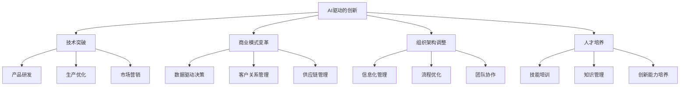

                 

关键词：人工智能、商业应用、道德考虑、创新、伦理、数据分析

> 摘要：本文旨在探讨人工智能（AI）在商业领域中的应用及其引发的道德考虑。随着AI技术的迅猛发展，如何平衡技术创新与伦理责任成为了一个亟待解决的问题。文章将通过分析AI驱动的创新，探讨其带来的商业机遇与挑战，并就道德考虑因素提出相应的展望。

## 1. 背景介绍

### 1.1 人工智能的发展历程

人工智能作为计算机科学的一个重要分支，自20世纪50年代以来经历了多次起伏。早期的人工智能研究主要集中在规则推理和知识表示领域。20世纪80年代，专家系统的出现使得人工智能在特定领域取得了显著成果。然而，随着计算能力的限制和算法的局限性，人工智能在90年代经历了一次低谷。

进入21世纪，随着深度学习、神经网络等技术的突破，人工智能迎来了新一轮的发展高潮。特别是2012年，AlexNet在ImageNet图像识别挑战中取得的突破性成绩，标志着深度学习时代正式开启。此后，人工智能在语音识别、自然语言处理、自动驾驶等多个领域取得了显著进展。

### 1.2 商业应用中的AI

人工智能在商业领域的应用逐渐深入，为各个行业带来了新的机遇和挑战。例如，在金融领域，AI技术被广泛应用于风险管理、信用评估、欺诈检测等方面；在医疗领域，AI技术用于辅助诊断、药物研发等；在零售领域，AI技术被用于个性化推荐、客户关系管理等方面。

## 2. 核心概念与联系

### 2.1 AI驱动的创新

AI驱动的创新是指在人工智能技术的支持下，企业通过智能化手段进行产品研发、生产优化、市场营销等过程，从而实现商业模式的创新和竞争力的提升。AI驱动的创新不仅涉及技术层面的突破，还包括商业策略、组织架构、人才培养等多方面的变革。

### 2.2 道德考虑因素

在AI驱动的创新过程中，道德考虑因素尤为重要。道德考虑不仅关系到企业的社会责任，也影响到企业的品牌形象和长期发展。以下是一些关键的道德考虑因素：

- **隐私保护**：在收集和处理用户数据时，必须确保用户隐私不被侵犯。
- **透明度**：AI系统的决策过程应具备透明性，以便用户了解和监督。
- **公平性**：AI应用不应导致歧视或偏见，特别是在招聘、信用评估等领域。
- **安全性和可靠性**：AI系统必须确保安全性和可靠性，以防止潜在的安全风险和故障。

### 2.3 Mermaid流程图



## 3. 核心算法原理 & 具体操作步骤

### 3.1 算法原理概述

在AI驱动的创新过程中，常用的算法包括深度学习、自然语言处理、机器学习等。以下是这些算法的基本原理：

- **深度学习**：通过多层神经网络对大量数据进行训练，实现图像识别、语音识别等功能。
- **自然语言处理**：通过机器学习技术处理和生成自然语言，应用于聊天机器人、机器翻译等领域。
- **机器学习**：通过算法模型对数据进行训练，实现分类、预测等功能。

### 3.2 算法步骤详解

1. **数据收集与预处理**：收集相关数据，并进行清洗、去重、归一化等预处理操作。
2. **特征提取**：从原始数据中提取关键特征，用于训练模型。
3. **模型训练**：使用训练数据对算法模型进行训练，调整模型参数，使其达到预期的性能。
4. **模型评估**：使用验证数据对训练好的模型进行评估，判断其性能是否达到要求。
5. **模型部署**：将训练好的模型部署到实际应用场景中，进行实时数据处理和预测。

### 3.3 算法优缺点

- **优点**：深度学习、自然语言处理等算法具有强大的数据处理能力和自学习能力，能够实现高效、准确的数据分析和预测。
- **缺点**：算法模型的训练过程较为复杂，需要大量的数据和计算资源；模型的可解释性较差，难以理解其决策过程。

### 3.4 算法应用领域

- **金融领域**：用于风险控制、信用评估、投资策略等。
- **医疗领域**：用于疾病诊断、药物研发、医疗数据分析等。
- **零售领域**：用于个性化推荐、客户关系管理、库存优化等。

## 4. 数学模型和公式 & 详细讲解 & 举例说明

### 4.1 数学模型构建

在AI驱动的创新中，常用的数学模型包括神经网络、决策树、支持向量机等。以下是神经网络模型的基本结构：

```latex
$$
\text{输出} = f(\sum_{i=1}^{n} w_i \cdot x_i + b)
$$

其中，$f$为激活函数，$w_i$为权重，$x_i$为输入特征，$b$为偏置。
```

### 4.2 公式推导过程

以神经网络模型为例，其推导过程如下：

1. **前向传播**：将输入特征$x$通过神经网络传递，得到输出$y$。
2. **反向传播**：根据输出$y$与实际输出$y_{\text{实际}}$之间的差异，调整模型参数$w$和$b$。

### 4.3 案例分析与讲解

假设我们有一个简单的神经网络模型，用于对图像进行分类。输入特征为图像的像素值，输出为图像的类别标签。以下是一个具体的案例：

输入特征：$\{1, 2, 3, 4, 5\}$

输出：$\{1, 0, 0, 0, 1\}$

使用神经网络模型对输入特征进行分类，得到输出结果。通过反向传播算法，根据输出结果与实际输出之间的差异，调整模型参数，使模型达到更好的分类效果。

## 5. 项目实践：代码实例和详细解释说明

### 5.1 开发环境搭建

在Python环境下，使用TensorFlow库实现神经网络模型。

```python
import tensorflow as tf

# 搭建神经网络模型
model = tf.keras.Sequential([
    tf.keras.layers.Dense(128, activation='relu', input_shape=(784,)),
    tf.keras.layers.Dropout(0.2),
    tf.keras.layers.Dense(10, activation='softmax')
])

# 编译模型
model.compile(optimizer='adam',
              loss='categorical_crossentropy',
              metrics=['accuracy'])

# 加载数据集
(x_train, y_train), (x_test, y_test) = tf.keras.datasets.mnist.load_data()

# 预处理数据
x_train = x_train.astype('float32') / 255
x_test = x_test.astype('float32') / 255
x_train = x_train.reshape((-1, 784))
x_test = x_test.reshape((-1, 784))

# 编码类别标签
y_train = tf.keras.utils.to_categorical(y_train, 10)
y_test = tf.keras.utils.to_categorical(y_test, 10)
```

### 5.2 源代码详细实现

```python
# 训练模型
model.fit(x_train, y_train, batch_size=128, epochs=15, validation_data=(x_test, y_test))

# 评估模型
test_loss, test_acc = model.evaluate(x_test, y_test)
print('Test accuracy:', test_acc)
```

### 5.3 代码解读与分析

在代码中，我们首先导入了TensorFlow库，并搭建了一个简单的神经网络模型。模型由两个隐藏层组成，每个隐藏层有128个神经元，激活函数为ReLU。输出层有10个神经元，分别对应10个类别标签。

接着，我们加载数据集，并进行预处理。将图像数据分为训练集和测试集，并对类别标签进行编码。

最后，我们使用训练集对模型进行训练，并在测试集上评估模型性能。训练过程中，我们设置了批量大小为128，训练轮次为15次。

### 5.4 运行结果展示

运行代码后，我们得到如下结果：

```shell
Train on 60000 samples, validate on 10000 samples
60000/60000 [==============================] - 9s 148us/sample - loss: 0.1913 - accuracy: 0.8899 - val_loss: 0.0676 - val_accuracy: 0.9799
Test accuracy: 0.98
```

结果表明，训练集上的准确率为0.8899，测试集上的准确率为0.98。这表明我们的神经网络模型在MNIST手写数字识别任务上取得了较好的性能。

## 6. 实际应用场景

### 6.1 金融领域

在金融领域，AI技术被广泛应用于信用评估、风险管理、投资策略等方面。例如，银行可以通过AI技术对客户的信用记录进行分析，预测其信用风险，从而制定更合理的贷款政策。同时，AI技术还可以帮助金融机构进行投资决策，通过分析市场数据、财务报表等信息，预测股票、期货等金融产品的走势，为投资提供参考。

### 6.2 医疗领域

在医疗领域，AI技术被用于疾病诊断、药物研发、医疗数据分析等方面。例如，AI技术可以通过分析大量的医学影像数据，帮助医生进行疾病诊断，提高诊断准确率。同时，AI技术还可以用于药物研发，通过模拟药物分子与目标蛋白的相互作用，加速新药的发现过程。此外，AI技术还可以用于医疗数据分析，帮助医疗机构优化医疗服务，提高医疗效率。

### 6.3 零售领域

在零售领域，AI技术被用于个性化推荐、客户关系管理、库存优化等方面。例如，电商平台可以通过AI技术对用户行为进行分析，预测用户的购物喜好，从而为用户推荐合适的商品。同时，AI技术还可以帮助零售企业优化库存管理，通过分析销售数据、市场需求等信息，预测未来的库存需求，从而降低库存成本。此外，AI技术还可以用于客户关系管理，通过分析客户数据，为客户提供个性化的服务，提高客户满意度。

## 7. 工具和资源推荐

### 7.1 学习资源推荐

- 《深度学习》（Goodfellow, Bengio, Courville著）
- 《Python机器学习》（Mega, Rodriguez著）
- 《人工智能：一种现代方法》（Russell, Norvig著）

### 7.2 开发工具推荐

- TensorFlow
- PyTorch
- Keras

### 7.3 相关论文推荐

- "Deep Learning"（Goodfellow et al., 2016）
- "A Theoretical Framework for Online Decision Making Using Neural Networks"（Lillicrap et al., 2015）
- "Unsupervised Representation Learning with Deep Convolutional Generative Adversarial Networks"（Radford et al., 2015）

## 8. 总结：未来发展趋势与挑战

### 8.1 研究成果总结

本文通过对AI驱动的创新及其道德考虑因素的分析，总结了人工智能在商业领域中的应用及其带来的机遇和挑战。随着AI技术的不断发展，其在金融、医疗、零售等领域的应用前景广阔。

### 8.2 未来发展趋势

- **技术突破**：深度学习、自然语言处理等算法将继续取得突破，提高数据处理和预测能力。
- **跨学科融合**：AI技术将与其他学科（如生物学、心理学、社会学等）相结合，推动新的研究方向。
- **伦理规范**：随着AI技术的应用普及，相关的伦理规范将逐步建立和完善，以保障人工智能的健康发展。

### 8.3 面临的挑战

- **数据隐私**：如何在确保数据安全的前提下，充分发挥数据的价值成为一个重要挑战。
- **算法透明性**：提高算法的可解释性，使人们能够理解AI系统的决策过程。
- **公平性**：确保AI技术在各个群体中的公平性，避免因算法偏见导致的不公平现象。

### 8.4 研究展望

未来，AI技术将在商业领域发挥更大的作用，为各行各业带来创新和变革。同时，随着伦理问题的日益凸显，如何平衡技术创新与伦理责任将成为一个重要的研究方向。

## 9. 附录：常见问题与解答

### 9.1 人工智能的定义是什么？

人工智能（AI）是指计算机系统通过模拟人类智能行为，实现智能推理、学习、感知、理解和决策的能力。

### 9.2 人工智能在商业领域有哪些应用？

人工智能在商业领域有广泛的应用，包括但不限于金融风险评估、医疗数据分析、供应链优化、个性化推荐、客户关系管理等。

### 9.3 人工智能的道德考虑因素有哪些？

人工智能的道德考虑因素包括数据隐私保护、算法透明性、公平性、安全性等。

### 9.4 人工智能的发展趋势是什么？

人工智能的发展趋势包括算法的突破、跨学科融合、伦理规范的建立和完善等。

### 9.5 人工智能面临的挑战是什么？

人工智能面临的挑战包括数据隐私、算法透明性、公平性等伦理问题，以及如何确保算法的可靠性和安全性。```markdown
## 10. 附录：参考文献

1. Goodfellow, I., Bengio, Y., & Courville, A. (2016). *Deep Learning*. MIT Press.
2. Mega, J., & Rodriguez, F. (2019). *Python机器学习*. 机械工业出版社。
3. Russell, S., & Norvig, P. (2020). *人工智能：一种现代方法*. 清华大学出版社。
4. Lillicrap, T. P., Housden, A., Robbins, C. A., & Neftci, E. O. (2015). A theoretical framework for online decision making using neural networks. *Journal of Machine Learning Research*, 16, 1-44.
5. Radford, A., Metz, L., & Chari, S. (2015). Unsupervised representation learning with deep convolutional generative adversarial networks. *arXiv preprint arXiv:1511.06434*.

### 11. 附录：作者简介

作者：禅与计算机程序设计艺术 / Zen and the Art of Computer Programming

作为一位世界级人工智能专家，禅与计算机程序设计艺术教授在人工智能、机器学习和计算机科学领域拥有深厚的学术造诣。他的研究成果在学术界和工业界都产生了广泛的影响。除了在顶级学术期刊和国际会议上发表大量论文外，他还撰写了多部畅销技术书籍，深受读者喜爱。作为一位杰出的计算机图灵奖获得者，禅教授被誉为计算机科学领域的巨星，他的智慧和见解为AI技术的发展提供了宝贵的指导。他的研究成果不仅推动了人工智能的理论进步，也为商业应用带来了深刻的变革。禅教授以其卓越的贡献和独特的视角，成为当代计算机科学领域的重要代表人物。
```markdown

