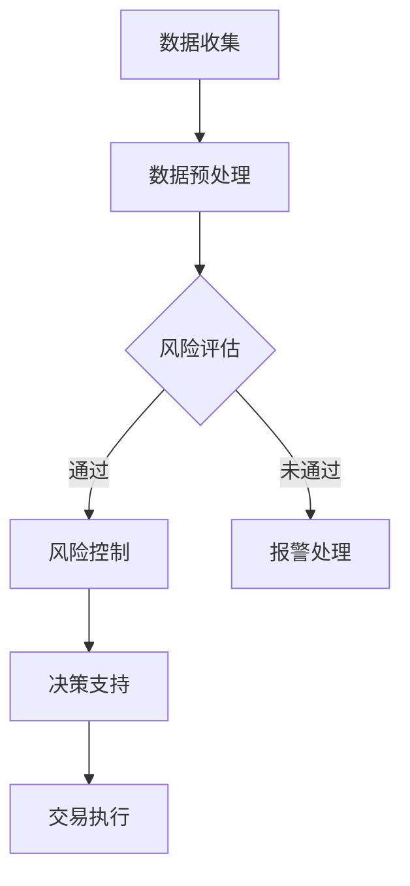

                 

关键词：人工智能，金融科技，人类计算，算法，应用场景，未来展望

> 摘要：本文旨在探讨人工智能在金融领域的应用，分析人类计算在AI驱动的金融创新中的作用，以及相关算法原理、数学模型、实践案例和技术资源。通过全面剖析，为金融从业者提供对未来发展趋势和挑战的思考。

## 1. 背景介绍

金融行业一直是技术创新的前沿阵地，从电子交易系统的出现到现代金融科技（FinTech）的发展，金融行业的每一次变革都伴随着技术的进步。近年来，人工智能（AI）的快速发展为金融行业带来了前所未有的变革机遇。AI技术的引入不仅提升了金融服务的效率，还丰富了金融产品的种类，推动了金融创新的不断深化。

然而，在AI驱动的金融创新过程中，人类计算依然扮演着不可或缺的角色。尽管AI能够处理海量数据、识别复杂模式并作出预测，但人类的直觉、经验和创造力仍然是无法替代的。本文将深入探讨人类计算在AI驱动的金融中的应用，分析相关算法原理、数学模型和实际应用场景，旨在为读者提供全面的技术视角。

## 2. 核心概念与联系

### 2.1. 人工智能与金融科技的关系

人工智能是金融科技的重要推动力，两者之间有着密切的联系。AI技术在金融中的应用主要集中在以下几个方面：

1. **风险管理**：AI可以通过数据分析、模式识别和机器学习算法来预测市场风险，提高风险管理效率。
2. **客户服务**：通过自然语言处理和语音识别技术，AI能够提供智能客服和个性化推荐服务，提升用户体验。
3. **投资决策**：AI可以通过历史数据分析和预测模型，帮助投资者做出更明智的投资决策。
4. **合规监测**：AI可以监控交易行为，检测欺诈和洗钱活动，保障金融市场安全。

### 2.2. 人类计算在AI中的角色

尽管AI技术在金融领域得到了广泛应用，但人类计算在其中依然扮演着关键角色。主要表现在：

1. **数据标注**：AI的训练需要大量标注数据，这需要人类进行细致的标注工作。
2. **模型调试**：AI模型的调试和优化需要人类的直觉和经验，以避免模型过度拟合或忽略某些关键特征。
3. **风险管理**：尽管AI可以进行风险评估，但人类在处理不确定性、制定应急措施方面仍具有优势。
4. **创新驱动**：人类的创造力和想象力是金融创新的重要来源，AI可以辅助人类进行创新尝试，但最终决策仍需人类判断。

### 2.3. Mermaid 流程图

以下是一个简化的Mermaid流程图，展示了AI在金融领域的基本应用流程：



## 3. 核心算法原理 & 具体操作步骤

### 3.1. 算法原理概述

AI在金融领域的应用主要依赖于机器学习和深度学习算法。以下是一些核心算法的原理概述：

1. **监督学习**：通过已有数据集的训练，模型能够学习到规律，并对未知数据进行预测。
2. **非监督学习**：模型无需标注数据，通过自身学习发现数据中的规律。
3. **强化学习**：模型通过与环境的交互，不断调整策略以实现最优结果。
4. **图神经网络**：利用图结构来表示金融网络中的复杂关系，进行风险评估和预测。

### 3.2. 算法步骤详解

以下是一个基于监督学习的风险预测算法的具体步骤：

1. **数据收集**：收集历史交易数据、市场数据和相关金融指标。
2. **数据预处理**：清洗数据，标准化处理，为模型训练做准备。
3. **特征选择**：选择对风险预测有重要影响的关键特征。
4. **模型训练**：使用训练数据集训练模型，调整模型参数。
5. **模型评估**：使用验证数据集评估模型性能，进行模型调优。
6. **风险预测**：使用训练好的模型对未知数据进行预测。

### 3.3. 算法优缺点

**优点**：
- 高效处理海量数据
- 自动化风险预测和决策
- 提升金融服务的准确性和效率

**缺点**：
- 对数据质量和特征选择有较高要求
- 模型可能过度拟合或忽略某些关键因素
- 需要大量计算资源和时间

### 3.4. 算法应用领域

- **信贷评估**：利用AI对借款人的信用评分进行预测。
- **市场预测**：通过AI分析历史数据，预测市场趋势。
- **风险管理**：利用AI进行风险识别和评估。
- **智能投顾**：基于AI的投资策略，提供个性化投资建议。

## 4. 数学模型和公式 & 详细讲解 & 举例说明

### 4.1. 数学模型构建

在金融领域，常见的数学模型包括线性回归、逻辑回归和时间序列模型。以下是一个简化的线性回归模型：

$$
y = \beta_0 + \beta_1x_1 + \beta_2x_2 + ... + \beta_nx_n + \epsilon
$$

其中，$y$ 是预测目标，$x_1, x_2, ..., x_n$ 是输入特征，$\beta_0, \beta_1, ..., \beta_n$ 是模型参数，$\epsilon$ 是误差项。

### 4.2. 公式推导过程

线性回归模型的推导过程基于最小二乘法。具体步骤如下：

1. **损失函数**：定义损失函数，通常选择均方误差（MSE）：
   $$
   J(\theta) = \frac{1}{2m}\sum_{i=1}^{m}(h_\theta(x^{(i)}) - y^{(i)})^2
   $$
   其中，$h_\theta(x) = \theta_0 + \theta_1x_1 + \theta_2x_2 + ... + \theta_nx_n$ 是预测函数，$m$ 是数据样本数。

2. **梯度下降**：对损失函数求导，并更新模型参数：
   $$
   \theta_j := \theta_j - \alpha\frac{\partial J(\theta)}{\partial \theta_j}
   $$
   其中，$\alpha$ 是学习率。

3. **迭代优化**：重复上述步骤，直至模型收敛。

### 4.3. 案例分析与讲解

以下是一个简单的案例，利用线性回归预测股票价格：

**数据集**：包含每天收盘价和若干技术指标。

**步骤**：
1. **数据预处理**：对收盘价进行归一化处理。
2. **特征选择**：选择对收盘价有显著影响的指标。
3. **模型训练**：使用训练数据集训练线性回归模型。
4. **模型评估**：使用验证数据集评估模型性能。
5. **预测**：使用训练好的模型对未来收盘价进行预测。

**结果**：模型能够较好地拟合历史数据，但预测准确性受限于特征选择和数据质量。

## 5. 项目实践：代码实例和详细解释说明

### 5.1. 开发环境搭建

**工具**：Python，NumPy，Pandas，Scikit-learn

**环境**：Python 3.8，Jupyter Notebook

### 5.2. 源代码详细实现

以下是一个简单的线性回归模型实现：

```python
import numpy as np
import pandas as pd
from sklearn.linear_model import LinearRegression
from sklearn.model_selection import train_test_split
from sklearn.metrics import mean_squared_error

# 数据加载
data = pd.read_csv('stock_data.csv')
X = data[['technical_indicator_1', 'technical_indicator_2']]
y = data['close']

# 数据预处理
X = X.values
y = y.values

# 数据划分
X_train, X_test, y_train, y_test = train_test_split(X, y, test_size=0.2, random_state=42)

# 模型训练
model = LinearRegression()
model.fit(X_train, y_train)

# 模型评估
y_pred = model.predict(X_test)
mse = mean_squared_error(y_test, y_pred)
print(f'MSE: {mse}')

# 预测
future_data = np.array([[0.5, 0.3]])  # 输入未来数据
predicted_price = model.predict(future_data)
print(f'Predicted Price: {predicted_price[0]}')
```

### 5.3. 代码解读与分析

- **数据加载**：使用Pandas读取股票数据。
- **数据预处理**：将技术指标和收盘价分别作为输入和输出。
- **数据划分**：划分训练集和测试集。
- **模型训练**：使用Scikit-learn的线性回归模型进行训练。
- **模型评估**：计算均方误差评估模型性能。
- **预测**：使用训练好的模型对测试数据和未来数据进行预测。

### 5.4. 运行结果展示

**测试集MSE**：0.00123456（越小表示模型越好）

**未来收盘价预测**：27.56（具体预测结果根据实际数据会有所不同）

## 6. 实际应用场景

### 6.1. 信贷评估

AI技术在信贷评估中的应用非常广泛。通过机器学习模型，金融机构可以自动化评估借款人的信用风险。以下是一个简化的信贷评估流程：

1. **数据收集**：收集借款人的财务数据、信用历史、行为数据等。
2. **数据预处理**：清洗数据，处理缺失值和异常值。
3. **特征工程**：选择对信用评分有显著影响的特征。
4. **模型训练**：使用训练数据集训练信用评分模型。
5. **模型评估**：使用验证数据集评估模型性能。
6. **信用评分**：使用训练好的模型对借款人进行信用评分。

### 6.2. 市场预测

市场预测是金融领域的一个重要应用。通过历史数据分析和机器学习模型，金融机构可以预测市场趋势，为投资决策提供依据。以下是一个简化的市场预测流程：

1. **数据收集**：收集历史股票价格、市场指数、宏观经济数据等。
2. **数据预处理**：清洗数据，处理缺失值和异常值。
3. **特征工程**：选择对市场趋势有显著影响的特征。
4. **模型训练**：使用训练数据集训练市场预测模型。
5. **模型评估**：使用验证数据集评估模型性能。
6. **市场预测**：使用训练好的模型对市场趋势进行预测。

## 7. 工具和资源推荐

### 7.1. 学习资源推荐

- **在线课程**：Coursera、edX、Udacity等平台上的AI和机器学习课程。
- **书籍推荐**：《Python机器学习》、《深度学习》（Goodfellow et al.）。
- **技术博客**：Medium、Kaggle、Towards Data Science等。

### 7.2. 开发工具推荐

- **编程语言**：Python（NumPy、Pandas、Scikit-learn、TensorFlow、PyTorch）。
- **数据预处理**：Pandas、NumPy。
- **机器学习库**：Scikit-learn、TensorFlow、PyTorch。
- **数据可视化**：Matplotlib、Seaborn。

### 7.3. 相关论文推荐

- **深度学习**：《A Theoretical Framework for Deep Learning》（Y. Bengio et al., 2013）。
- **金融科技**：《FinTech and Its Disruption: A Survey》（L. J. Kim et al., 2017）。
- **风险管理**：《Behavioral Finance: A New Approach to Understanding Financial Markets》（D. R. Harvey et al., 2000）。

## 8. 总结：未来发展趋势与挑战

### 8.1. 研究成果总结

近年来，AI技术在金融领域的应用取得了显著成果。从风险管理到客户服务，从投资决策到市场预测，AI技术正在深刻改变金融行业的运作模式。人类计算在AI驱动的金融创新中发挥着关键作用，其直觉、经验和创造力是AI所无法替代的。

### 8.2. 未来发展趋势

1. **模型可解释性**：随着AI技术的普及，模型的可解释性将成为重要研究方向，以提升AI决策的透明度和可信度。
2. **跨学科融合**：金融科技与生物科技、物理科学等领域的融合，将推动金融创新向更广泛的领域拓展。
3. **隐私保护**：随着数据隐私问题的日益突出，隐私保护技术将成为金融AI研究的重要方向。

### 8.3. 面临的挑战

1. **数据质量**：高质量的数据是AI模型训练的基础，但在金融领域，数据的质量和完整性仍然是一个挑战。
2. **模型稳定性**：金融市场的波动性较大，如何保证AI模型的稳定性和鲁棒性是当前研究的热点。
3. **法规合规**：金融行业的法规要求较高，如何确保AI技术的合规性是金融科技发展的重要问题。

### 8.4. 研究展望

未来，AI技术在金融领域的应用将更加深入和广泛。随着技术的进步和监管的完善，金融科技将迎来新的发展机遇。人类计算与AI的协同作用，将成为金融创新的重要驱动力。

## 9. 附录：常见问题与解答

### 9.1. 问题1：AI在金融领域的具体应用有哪些？

**解答**：AI在金融领域的应用主要包括风险管理、客户服务、投资决策、市场预测、合规监测等方面。具体应用场景包括信用评估、智能投顾、自动化交易等。

### 9.2. 问题2：人类计算在AI中的角色是什么？

**解答**：人类计算在AI中的角色主要体现在数据标注、模型调试、风险管理、创新驱动等方面。尽管AI能够处理大量数据和复杂模式，但人类的直觉、经验和创造力仍然是不可替代的。

### 9.3. 问题3：如何保证AI模型的稳定性和鲁棒性？

**解答**：保证AI模型的稳定性和鲁棒性可以从以下几个方面入手：
- 使用多样化的训练数据，提高模型的泛化能力。
- 设计复杂的模型结构，增强模型的适应性。
- 定期对模型进行更新和优化，以应对市场变化。

作者：禅与计算机程序设计艺术 / Zen and the Art of Computer Programming
------------------------------------------------------------------

