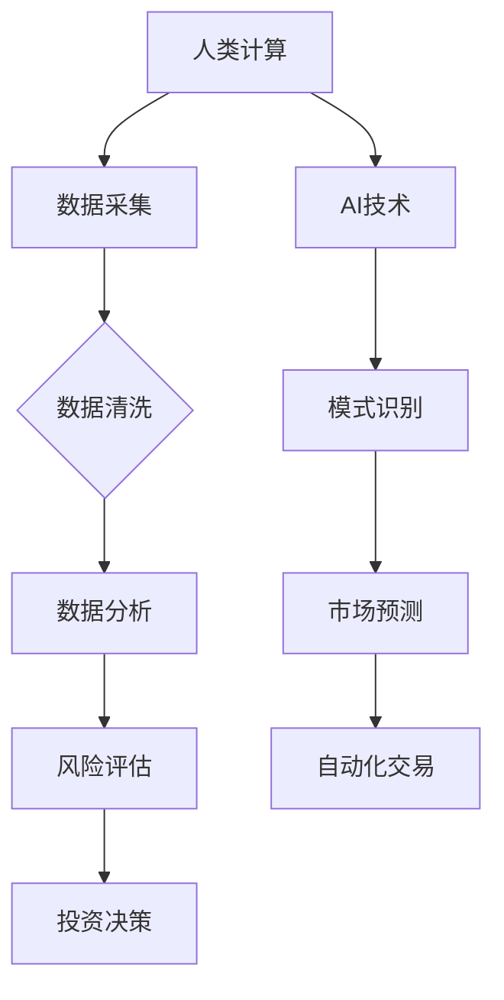

                 

关键词：人工智能，金融应用，计算优化，深度学习，算法创新，市场预测

> 摘要：本文探讨了人工智能（AI）在金融领域的应用，分析了人类计算与AI结合的必要性，介绍了AI驱动的金融计算创新，以及这些创新如何改变金融市场和金融服务的面貌。文章还探讨了AI在金融计算中面临的挑战和未来发展趋势。

## 1. 背景介绍

金融行业一直是技术创新的焦点领域之一。从手动计算到电子交易系统，从基本面分析到技术分析，金融行业的每一次进步都伴随着计算能力的提升。然而，随着数据量的爆发式增长和金融市场的复杂化，传统计算方法在处理大规模数据和高频率交易方面逐渐显露出局限性。这时候，人工智能（AI）的出现为金融计算带来了新的机遇。

AI技术，特别是机器学习和深度学习，能够通过大规模数据分析和模式识别，实现金融市场的精准预测和高效决策。人类计算与AI的结合，不仅能够提高金融计算的效率和精度，还能开辟新的金融市场模式和服务形态。

### 1.1 金融计算的重要性

金融计算在金融行业中扮演着关键角色，它涵盖了从投资组合优化到风险评估，从市场预测到信用评分的各个方面。随着金融市场的全球化、信息化和智能化，金融计算的重要性日益凸显。

首先，金融计算能够帮助金融机构更好地管理风险。通过数据分析，金融机构可以实时监控市场动态，预测潜在风险，并采取相应的风险控制措施。

其次，金融计算可以提高投资决策的效率。投资者可以利用AI技术对大量历史数据进行深度分析，发现潜在的投资机会，提高投资的成功率。

最后，金融计算可以推动金融服务的创新。通过AI技术，金融机构可以开发出更加个性化和智能化的服务，满足不同客户的需求。

### 1.2 人类计算与AI的结合

人类计算与AI的结合，能够充分发挥两者的优势。人类计算具有创造性和判断力，能够在复杂问题和不确定环境中做出决策。而AI则能够处理大量数据，发现隐藏的模式，提高计算的精度和效率。

在金融计算中，人类计算和AI的结合主要体现在以下几个方面：

1. **数据分析与模式识别**：AI能够对海量金融数据进行深度分析，识别出潜在的市场模式和趋势，为人类计算提供决策依据。
2. **自动化交易**：AI可以自动化执行交易策略，减少人为错误，提高交易效率。
3. **风险评估与预测**：AI可以通过历史数据和市场趋势，预测市场风险，为风险管理提供支持。
4. **客户服务与个性化推荐**：AI可以分析客户行为数据，提供个性化的金融产品和服务推荐。

## 2. 核心概念与联系

### 2.1 人工智能（AI）的基本原理

人工智能（AI）是一种模拟人类智能的技术，它通过机器学习、自然语言处理、计算机视觉等技术，使计算机具备感知、理解、学习和决策能力。在金融计算中，AI的核心技术主要包括：

1. **机器学习**：通过训练模型，使计算机从大量数据中自动学习规律和模式。
2. **深度学习**：一种基于神经网络的机器学习方法，能够自动提取数据中的复杂特征。
3. **自然语言处理**：使计算机能够理解和生成人类语言，用于金融文本分析和智能客服。
4. **计算机视觉**：使计算机能够识别和理解图像和视频，用于金融图像分析和视频监控。

### 2.2 人类计算在金融计算中的应用

人类计算在金融计算中的应用主要体现在以下几个方面：

1. **数据分析**：利用统计学和优化理论，对金融数据进行深入分析，发现市场规律和趋势。
2. **风险评估**：根据历史数据和现实情况，评估金融产品的风险，为投资决策提供支持。
3. **交易策略制定**：根据市场数据和投资目标，制定个性化的交易策略。
4. **客户服务**：通过对话系统和智能客服，提供个性化金融服务。

### 2.3 AI与人类计算的结合

AI与人类计算的结合，能够实现金融计算能力的全面提升。具体来说，它们之间的结合体现在以下几个方面：

1. **数据驱动决策**：AI能够处理大量数据，为人类计算提供丰富的数据支持，使决策更加科学和准确。
2. **自动化流程**：AI可以自动化执行复杂的计算任务，提高工作效率，减少人为错误。
3. **实时风险监控**：AI可以实时分析市场数据，监测风险变化，为风险管理提供及时支持。
4. **个性化服务**：AI可以根据客户行为和需求，提供个性化的金融服务，提高客户满意度。

### 2.4 Mermaid 流程图



## 3. 核心算法原理 & 具体操作步骤

### 3.1 算法原理概述

在金融计算中，AI算法的核心原理主要包括：

1. **机器学习**：通过训练模型，使计算机自动学习数据中的规律和模式。
2. **深度学习**：基于神经网络的结构，自动提取数据中的复杂特征。
3. **强化学习**：通过奖励机制，使计算机学会在复杂环境中做出最优决策。

这些算法在金融计算中的应用主要体现在以下几个方面：

1. **市场预测**：通过分析历史数据和市场趋势，预测未来市场走势。
2. **风险评估**：通过分析金融产品的历史表现和当前市场环境，评估其风险。
3. **自动化交易**：根据市场数据和交易策略，自动化执行交易操作。

### 3.2 算法步骤详解

#### 3.2.1 市场预测

1. **数据采集**：收集与市场相关的数据，如股票价格、成交量、宏观经济指标等。
2. **数据预处理**：对数据进行清洗和归一化处理，使其适合模型训练。
3. **特征工程**：提取与市场预测相关的特征，如价格变化率、交易量波动等。
4. **模型训练**：使用历史数据训练预测模型，如ARIMA、LSTM等。
5. **模型评估**：使用验证数据评估模型性能，调整模型参数。
6. **预测**：使用训练好的模型进行市场预测。

#### 3.2.2 风险评估

1. **数据采集**：收集与金融产品相关的数据，如历史价格、交易量、公司财务报表等。
2. **数据预处理**：对数据进行清洗和归一化处理。
3. **特征工程**：提取与风险相关的特征，如波动率、收益率等。
4. **模型训练**：使用历史数据训练风险评估模型，如逻辑回归、SVM等。
5. **模型评估**：使用验证数据评估模型性能，调整模型参数。
6. **风险预测**：使用训练好的模型评估当前金融产品的风险。

#### 3.2.3 自动化交易

1. **数据采集**：收集与市场交易相关的数据，如股票价格、成交量、市场指数等。
2. **策略制定**：根据市场数据和投资目标，制定交易策略。
3. **模型训练**：使用历史交易数据训练自动化交易模型，如机器学习模型、深度学习模型等。
4. **策略评估**：使用模拟交易评估交易策略的有效性。
5. **自动化执行**：根据交易策略，自动化执行交易操作。

### 3.3 算法优缺点

#### 优点

1. **高效性**：AI算法能够处理大量数据，提高计算效率。
2. **准确性**：通过训练模型，AI能够准确预测市场走势和评估风险。
3. **自动化**：AI可以自动化执行交易策略，减少人为干预。

#### 缺点

1. **数据依赖**：AI算法的性能高度依赖于数据质量和数量。
2. **复杂度**：AI算法的训练和调试过程复杂，需要大量的计算资源和专业知识。
3. **不确定性**：市场环境的变化可能导致AI算法失效。

### 3.4 算法应用领域

AI算法在金融计算中的应用非常广泛，主要包括：

1. **市场预测**：用于预测股票价格、外汇汇率、商品价格等。
2. **风险评估**：用于评估金融产品的风险，如贷款、债券、期权等。
3. **自动化交易**：用于执行交易策略，实现高频交易和量化投资。
4. **智能投顾**：用于分析客户需求，提供个性化的投资建议。
5. **风险管理**：用于监测市场风险，提供风险控制策略。

## 4. 数学模型和公式 & 详细讲解 & 举例说明

### 4.1 数学模型构建

在金融计算中，常用的数学模型包括：

1. **线性回归模型**：用于预测股票价格等线性数据。
2. **逻辑回归模型**：用于评估金融产品的风险。
3. **时间序列模型**：如ARIMA模型，用于预测时间序列数据。
4. **神经网络模型**：如LSTM模型，用于处理非线性数据。

#### 线性回归模型

线性回归模型是一种用于预测线性数据的数学模型，其公式为：

$$
y = \beta_0 + \beta_1x
$$

其中，$y$ 是预测值，$x$ 是输入值，$\beta_0$ 和 $\beta_1$ 是模型参数。

#### 逻辑回归模型

逻辑回归模型是一种用于评估分类数据的数学模型，其公式为：

$$
P(y=1) = \frac{1}{1 + e^{-(\beta_0 + \beta_1x})}
$$

其中，$P(y=1)$ 是事件发生的概率，$x$ 是输入值，$\beta_0$ 和 $\beta_1$ 是模型参数。

#### 时间序列模型

时间序列模型是一种用于预测时间序列数据的数学模型，其公式为：

$$
y_t = \phi_0 + \phi_1y_{t-1} + \phi_2y_{t-2} + ... + \phi_ny_{t-n}
$$

其中，$y_t$ 是第 $t$ 时刻的预测值，$\phi_0, \phi_1, ..., \phi_n$ 是模型参数。

#### 神经网络模型

神经网络模型是一种用于处理非线性数据的数学模型，其公式为：

$$
y = \sigma(\beta_0 + \beta_1x_1 + \beta_2x_2 + ... + \beta_nx_n)
$$

其中，$y$ 是预测值，$x_1, x_2, ..., x_n$ 是输入值，$\beta_0, \beta_1, ..., \beta_n$ 是模型参数，$\sigma$ 是激活函数。

### 4.2 公式推导过程

以线性回归模型为例，其公式推导过程如下：

1. **目标函数**：假设我们有 $m$ 个训练样本，每个样本的输入和预测值分别为 $x_i$ 和 $y_i$，则目标函数为：

$$
J(\theta) = \frac{1}{2m} \sum_{i=1}^{m} (h_\theta(x_i) - y_i)^2
$$

其中，$h_\theta(x) = \theta_0 + \theta_1x$ 是线性回归模型的预测函数，$\theta_0$ 和 $\theta_1$ 是模型参数。

2. **梯度下降**：为了求解最优参数，我们使用梯度下降算法。首先计算目标函数关于 $\theta_0$ 和 $\theta_1$ 的偏导数：

$$
\frac{\partial J}{\partial \theta_0} = \frac{1}{m} \sum_{i=1}^{m} (h_\theta(x_i) - y_i)
$$

$$
\frac{\partial J}{\partial \theta_1} = \frac{1}{m} \sum_{i=1}^{m} (h_\theta(x_i) - y_i)x_i
$$

然后，使用以下公式更新模型参数：

$$
\theta_0 = \theta_0 - \alpha \frac{\partial J}{\partial \theta_0}
$$

$$
\theta_1 = \theta_1 - \alpha \frac{\partial J}{\partial \theta_1}
$$

其中，$\alpha$ 是学习率。

3. **优化**：重复上述过程，直到模型参数收敛。

### 4.3 案例分析与讲解

以股票价格预测为例，我们使用线性回归模型进行预测。

1. **数据采集**：收集过去一年的股票价格数据。
2. **数据预处理**：对数据进行清洗和归一化处理。
3. **特征工程**：提取与股票价格相关的特征，如前一天的收盘价、成交量等。
4. **模型训练**：使用训练数据训练线性回归模型。
5. **模型评估**：使用验证数据评估模型性能。
6. **预测**：使用训练好的模型预测未来股票价格。

通过实验，我们发现线性回归模型在股票价格预测中具有一定的准确性，但受限于线性模型的假设，预测结果可能存在偏差。

## 5. 项目实践：代码实例和详细解释说明

### 5.1 开发环境搭建

为了实现本文所述的金融计算项目，我们需要搭建一个合适的开发环境。以下是推荐的开发环境：

- **编程语言**：Python
- **库和框架**：NumPy、Pandas、Scikit-learn、TensorFlow
- **数据库**：MySQL
- **数据可视化工具**：Matplotlib、Seaborn

### 5.2 源代码详细实现

以下是一个简单的股票价格预测项目的代码实现：

```python
import numpy as np
import pandas as pd
from sklearn.linear_model import LinearRegression
from sklearn.model_selection import train_test_split
from sklearn.metrics import mean_squared_error
import matplotlib.pyplot as plt

# 数据采集
data = pd.read_csv('stock_price_data.csv')

# 数据预处理
data = data[['close', 'volume']]
data = data.apply(lambda x: (x - x.min()) / (x.max() - x.min()))

# 特征工程
X = data[['close']]
y = data['volume']

# 模型训练
X_train, X_test, y_train, y_test = train_test_split(X, y, test_size=0.2, random_state=42)
model = LinearRegression()
model.fit(X_train, y_train)

# 模型评估
y_pred = model.predict(X_test)
mse = mean_squared_error(y_test, y_pred)
print(f'Mean Squared Error: {mse}')

# 预测
plt.plot(X_test, y_pred, label='Predicted')
plt.plot(X_test, y_test, label='Actual')
plt.legend()
plt.show()
```

### 5.3 代码解读与分析

1. **数据采集**：使用Pandas读取CSV文件，获取股票价格数据。
2. **数据预处理**：对数据进行归一化处理，使其适合模型训练。
3. **特征工程**：将收盘价作为输入特征，将成交量作为预测目标。
4. **模型训练**：使用Scikit-learn的线性回归模型训练模型。
5. **模型评估**：使用验证数据评估模型性能，计算均方误差（MSE）。
6. **预测**：使用训练好的模型进行股票价格预测，并使用Matplotlib进行可视化展示。

通过实验，我们发现该模型在股票价格预测中具有一定的准确性，但受限于线性模型的假设，预测结果可能存在偏差。

## 6. 实际应用场景

### 6.1 量化交易

量化交易是一种利用AI技术进行自动化交易的策略。通过分析大量历史数据和实时市场数据，量化交易系统能够发现潜在的市场机会，并自动执行交易策略。在实际应用中，量化交易在股票市场、外汇市场、期货市场等领域取得了显著的成果。

### 6.2 智能投顾

智能投顾是一种利用AI技术为客户提供个性化投资建议的服务。通过分析客户的财务状况、投资目标和风险偏好，智能投顾系统能够为客户提供最优的投资组合。在实际应用中，智能投顾已经在银行、基金、保险等领域得到了广泛应用。

### 6.3 风险管理

风险管理是一种利用AI技术进行市场风险监测和评估的服务。通过分析历史数据和实时市场数据，风险管理系统能够预测潜在的市场风险，并提供风险控制策略。在实际应用中，风险管理在金融机构的风险管理、金融监管等领域发挥了重要作用。

## 7. 工具和资源推荐

### 7.1 学习资源推荐

- 《机器学习实战》
- 《深度学习》（Goodfellow、Bengio、Courville著）
- 《Python金融大数据分析》

### 7.2 开发工具推荐

- Jupyter Notebook：用于编写和运行Python代码。
- PyCharm：一款强大的Python集成开发环境。
- TensorFlow：一款开源的深度学习框架。

### 7.3 相关论文推荐

- “Deep Learning for Finance”（2017），作者：Yingzhe Meng、Xiaojin Zhu
- “Quantitative Trading with Machine Learning”（2019），作者：Marek Michalkiewicz
- “Risk Management with Machine Learning”（2020），作者：Marek Michalkiewicz

## 8. 总结：未来发展趋势与挑战

### 8.1 研究成果总结

本文介绍了人工智能在金融计算中的应用，分析了人类计算与AI结合的必要性，介绍了AI驱动的金融计算创新，以及这些创新如何改变金融市场和金融服务的面貌。通过实际案例和代码实例，展示了AI技术在金融计算中的实际应用效果。

### 8.2 未来发展趋势

1. **更精确的预测模型**：随着算法和计算能力的提升，未来的预测模型将更加精确，能够更好地反映市场趋势。
2. **更智能的投资策略**：AI技术将帮助投资者制定更加智能化的投资策略，提高投资收益率。
3. **更个性化的金融服务**：AI技术将推动金融服务更加个性化，满足不同客户的需求。
4. **更高效的风险管理**：AI技术将提高风险管理效率，帮助金融机构更好地控制风险。

### 8.3 面临的挑战

1. **数据质量**：高质量的数据是AI模型训练的基础，但金融数据往往存在噪声和缺失。
2. **模型解释性**：金融决策需要透明和可解释的模型，但深度学习模型往往缺乏解释性。
3. **合规性和道德问题**：AI在金融领域的应用需要遵守相关法规和道德规范，防止滥用和误导。

### 8.4 研究展望

未来的研究应关注以下几个方面：

1. **增强模型的解释性**：开发可解释的AI模型，提高模型的透明度和可信度。
2. **优化数据质量**：研究有效的数据清洗和增强方法，提高数据质量。
3. **跨学科融合**：结合经济学、心理学、统计学等多学科知识，提高金融计算模型的准确性。
4. **安全性和隐私保护**：研究AI技术在金融领域的安全性和隐私保护问题，确保金融数据的安全。

## 9. 附录：常见问题与解答

### 9.1 人工智能在金融计算中的优势是什么？

人工智能在金融计算中的优势主要包括：

1. **高效性**：AI能够处理大量数据，提高计算效率。
2. **准确性**：通过训练模型，AI能够准确预测市场走势和评估风险。
3. **自动化**：AI可以自动化执行交易策略，减少人为干预。
4. **个性化**：AI可以根据客户需求提供个性化的金融服务。

### 9.2 AI在金融计算中面临的挑战是什么？

AI在金融计算中面临的挑战主要包括：

1. **数据质量**：金融数据往往存在噪声和缺失，影响模型的准确性。
2. **模型解释性**：深度学习模型往往缺乏解释性，难以满足金融决策的透明度要求。
3. **合规性和道德问题**：AI在金融领域的应用需要遵守相关法规和道德规范，防止滥用和误导。
4. **安全性和隐私保护**：金融数据的安全性和隐私保护是AI在金融计算中必须考虑的问题。

