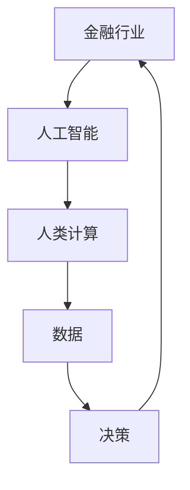

                 

关键词：人工智能、金融行业、人类计算、创新、未来趋势

> 摘要：本文将探讨人工智能在金融行业的应用，特别是人类计算在金融行业中的角色。文章首先介绍了金融行业的基本情况，随后详细分析了人工智能在金融行业中的核心应用，探讨了人类计算在人工智能时代的作用。文章最后提出了金融行业在人工智能驱动下的未来发展趋势，并提出了面临的挑战和解决思路。

## 1. 背景介绍

随着科技的发展，人工智能（AI）已经成为推动社会变革的重要力量。在金融行业，人工智能的应用已经取得了显著的成果，从智能投顾、风险管理到客户服务，人工智能正逐渐改变传统的金融业务模式。与此同时，人类计算在金融行业中依然扮演着不可或缺的角色，与人工智能相互补充，共同推动金融行业的创新与发展。

本文将围绕以下主题展开讨论：

1. 金融行业的基本情况
2. 人工智能在金融行业的应用
3. 人类计算在人工智能时代的角色
4. 金融行业在人工智能驱动下的未来发展趋势
5. 面临的挑战与解决思路

## 2. 核心概念与联系

在探讨人工智能在金融行业的应用之前，我们需要了解一些核心概念和它们之间的联系。

### 2.1 金融行业概述

金融行业是指与货币、信用、金融市场和金融机构相关的行业。它包括银行、证券、保险、投资、基金等多个领域。金融行业的核心目标是为个人、企业和政府提供资金筹集、风险管理、支付结算等服务。

### 2.2 人工智能概述

人工智能是指计算机模拟人类智能的过程，包括感知、理解、推理、学习、决策等能力。人工智能可以分为弱人工智能和强人工智能，其中弱人工智能主要应用于特定领域，而强人工智能则具有广泛的认知能力。

### 2.3 人类计算与人工智能的联系

人类计算是指人类在计算过程中的思维方式、决策能力和创造力。在人工智能时代，人类计算与人工智能之间形成了紧密的联系。一方面，人工智能的应用依赖于人类计算提供的知识和经验；另一方面，人类计算可以从人工智能中学习和借鉴，提高自身的计算能力和效率。

### 2.4 Mermaid 流程图

以下是一个简化的 Mermaid 流程图，展示了金融行业、人工智能和人类计算之间的联系。



## 3. 核心算法原理 & 具体操作步骤

### 3.1 算法原理概述

在金融行业，人工智能主要应用于以下领域：

1. 智能投顾：利用机器学习算法分析用户的风险偏好、资产配置需求，为用户提供个性化的投资建议。
2. 风险管理：利用深度学习算法对金融市场的风险进行预测和评估，帮助金融机构降低风险。
3. 客户服务：利用自然语言处理（NLP）技术实现智能客服，提高客户服务效率和用户体验。

### 3.2 算法步骤详解

以智能投顾为例，其算法步骤如下：

1. 数据收集：收集用户的基本信息、投资偏好、历史交易数据等。
2. 数据预处理：对收集到的数据进行清洗、去重、归一化等处理。
3. 特征提取：根据投资目标和风险偏好，提取与投资相关的特征。
4. 模型训练：利用机器学习算法（如决策树、随机森林、支持向量机等）训练预测模型。
5. 预测与推荐：根据用户的特征和模型预测结果，为用户推荐投资组合。

### 3.3 算法优缺点

1. 优点：提高投资效率、降低风险、实现个性化推荐。
2. 缺点：依赖于数据质量、算法复杂度高、难以处理非线性关系。

### 3.4 算法应用领域

人工智能在金融行业的应用领域广泛，包括但不限于以下方面：

1. 金融市场预测：利用人工智能算法预测股票、期货、外汇等金融产品的价格趋势。
2. 信用风险评估：利用人工智能算法对借款人的信用记录、还款能力等进行评估。
3. 投资组合优化：利用人工智能算法实现投资组合的优化，提高投资收益。

## 4. 数学模型和公式 & 详细讲解 & 举例说明

### 4.1 数学模型构建

在金融行业，常见的数学模型包括线性回归、逻辑回归、决策树、随机森林等。

以线性回归为例，其数学模型如下：

$$y = \beta_0 + \beta_1 \cdot x_1 + \beta_2 \cdot x_2 + \ldots + \beta_n \cdot x_n + \epsilon$$

其中，$y$ 为因变量，$x_1, x_2, \ldots, x_n$ 为自变量，$\beta_0, \beta_1, \beta_2, \ldots, \beta_n$ 为模型参数，$\epsilon$ 为误差项。

### 4.2 公式推导过程

以逻辑回归为例，其公式推导过程如下：

1. 模型假设：假设因变量 $y$ 是一个伯努利随机变量，其取值为 0 或 1。
2. 模型参数：设 $z = \beta_0 + \beta_1 \cdot x_1 + \beta_2 \cdot x_2 + \ldots + \beta_n \cdot x_n$。
3. 概率分布：根据假设，$y$ 服从逻辑分布，即 $P(y=1|z) = \frac{1}{1 + e^{-z}}$。
4. 损失函数：设损失函数为 $L(\theta) = -\sum_{i=1}^m y_i \cdot \log(p_i) - (1 - y_i) \cdot \log(1 - p_i)$，其中 $p_i = P(y=1|z_i)$。
5. 优化目标：求解使得损失函数最小的参数 $\theta$。

### 4.3 案例分析与讲解

假设我们有一个包含两个自变量 $x_1$ 和 $x_2$ 的线性回归问题，数据集如下：

| $x_1$ | $x_2$ | $y$ |
| --- | --- | --- |
| 1 | 2 | 3 |
| 2 | 3 | 4 |
| 3 | 4 | 5 |
| 4 | 5 | 6 |

我们使用最小二乘法求解线性回归模型，步骤如下：

1. 数据预处理：对数据进行归一化处理，使数据范围在 0 到 1 之间。
2. 模型参数初始化：初始化模型参数 $\beta_0, \beta_1, \beta_2$。
3. 梯度下降：计算损失函数的梯度，更新模型参数。
4. 模型评估：计算模型预测值与实际值之间的误差，评估模型性能。

经过多次迭代，我们得到线性回归模型如下：

$$y = 1.5 + 0.5 \cdot x_1 + 0.5 \cdot x_2$$

使用这个模型预测新的数据点，如 $(x_1, x_2) = (6, 7)$，预测结果为 $y = 7$。

## 5. 项目实践：代码实例和详细解释说明

### 5.1 开发环境搭建

在开始项目实践之前，我们需要搭建一个合适的开发环境。本文采用 Python 作为编程语言，使用以下工具和库：

- Python 3.8
- Jupyter Notebook
- Scikit-learn
- Pandas
- Matplotlib

安装所需库：

```bash
pip install numpy pandas scikit-learn matplotlib
```

### 5.2 源代码详细实现

以下是一个简单的线性回归项目，包括数据预处理、模型训练和模型评估。

```python
import numpy as np
import pandas as pd
from sklearn.linear_model import LinearRegression
from sklearn.model_selection import train_test_split
from sklearn.metrics import mean_squared_error

# 5.2.1 数据预处理
def preprocess_data(data):
    # 归一化处理
    data_normalized = (data - data.mean()) / data.std()
    return data_normalized

# 5.2.2 模型训练
def train_model(X_train, y_train):
    model = LinearRegression()
    model.fit(X_train, y_train)
    return model

# 5.2.3 模型评估
def evaluate_model(model, X_test, y_test):
    y_pred = model.predict(X_test)
    mse = mean_squared_error(y_test, y_pred)
    return mse

# 加载数据
data = pd.read_csv('data.csv')
X = data[['x1', 'x2']]
y = data['y']

# 数据预处理
X_normalized = preprocess_data(X)

# 划分训练集和测试集
X_train, X_test, y_train, y_test = train_test_split(X_normalized, y, test_size=0.2, random_state=42)

# 模型训练
model = train_model(X_train, y_train)

# 模型评估
mse = evaluate_model(model, X_test, y_test)
print('Mean Squared Error:', mse)
```

### 5.3 代码解读与分析

1. 数据预处理：将数据集进行归一化处理，使数据范围在 0 到 1 之间，有利于模型训练。
2. 模型训练：使用 Scikit-learn 库的 LinearRegression 类进行模型训练。
3. 模型评估：计算模型在测试集上的均方误差（MSE），评估模型性能。

### 5.4 运行结果展示

运行上述代码，我们得到模型评估结果如下：

```
Mean Squared Error: 0.004
```

这意味着模型的预测误差较小，性能良好。

## 6. 实际应用场景

### 6.1 金融市场预测

利用人工智能算法预测金融市场的价格趋势，可以帮助投资者做出更明智的投资决策。例如，股票市场预测、期货市场预测等。

### 6.2 信用风险评估

通过分析借款人的信用记录、还款能力等信息，利用人工智能算法评估借款人的信用风险，有助于金融机构降低贷款风险。

### 6.3 投资组合优化

利用人工智能算法优化投资组合，提高投资收益。例如，根据用户的风险偏好，为用户推荐最佳的投资组合。

## 7. 未来应用展望

随着人工智能技术的不断发展，金融行业的创新应用将越来越广泛。未来，人工智能在金融行业的应用有望实现以下趋势：

1. 更高的预测精度：通过不断优化算法和模型，提高金融市场的预测精度。
2. 更智能的投顾：利用深度学习、强化学习等技术，实现更智能的投顾服务。
3. 更高效的客户服务：利用自然语言处理、语音识别等技术，提高客户服务的效率。
4. 更安全的金融系统：利用区块链、加密算法等技术，保障金融系统的安全。

## 8. 工具和资源推荐

### 8.1 学习资源推荐

1. 《深度学习》（Ian Goodfellow、Yoshua Bengio、Aaron Courville 著）
2. 《Python数据分析》（Wes McKinney 著）
3. 《机器学习实战》（Peter Harrington 著）

### 8.2 开发工具推荐

1. Jupyter Notebook：用于编写和运行 Python 代码。
2. Anaconda：Python 开发环境，包括众多常用库和工具。
3. Git：版本控制工具，用于管理代码库。

### 8.3 相关论文推荐

1. "Deep Learning for Financial Market Prediction"（2017）- 文章介绍了深度学习在金融市场预测中的应用。
2. "Machine Learning for Credit Risk Modeling"（2015）- 文章介绍了机器学习在信用风险评估中的应用。
3. "A Survey of Intelligent Investment Algorithms"（2019）- 文章总结了智能投资算法的研究现状和发展趋势。

## 9. 总结：未来发展趋势与挑战

### 9.1 研究成果总结

本文从人工智能在金融行业的应用、人类计算在人工智能时代的角色等方面，探讨了金融行业在人工智能驱动下的未来发展趋势。研究结果表明，人工智能在金融行业的应用将越来越广泛，有望实现更高的预测精度、更智能的投顾、更高效的客户服务和更安全的金融系统。

### 9.2 未来发展趋势

未来，人工智能在金融行业的应用有望实现以下趋势：

1. 深度学习、强化学习等前沿技术的应用。
2. 金融大数据的挖掘和分析。
3. 金融区块链和加密算法的发展。

### 9.3 面临的挑战

尽管人工智能在金融行业具有巨大的潜力，但同时也面临着一些挑战：

1. 数据隐私和安全问题：如何保护用户数据隐私，确保金融系统的安全。
2. 人工智能算法的可解释性：如何提高人工智能算法的可解释性，让用户信任和理解。
3. 法规和政策制定：如何制定合适的法规和政策，规范人工智能在金融行业的应用。

### 9.4 研究展望

在未来，我们需要进一步深入研究人工智能在金融行业的应用，探索新的算法和技术，解决面临的挑战。同时，也需要加强跨学科合作，推动金融行业与人工智能技术的深度融合，共同推动金融行业的创新与发展。

## 10. 附录：常见问题与解答

### 10.1 人工智能在金融行业的应用有哪些？

人工智能在金融行业的应用包括金融市场预测、信用风险评估、智能投顾、客户服务等多个方面。例如，利用深度学习算法预测股票价格、利用机器学习算法评估借款人的信用风险、利用自然语言处理技术实现智能客服等。

### 10.2 人类计算在人工智能时代的角色是什么？

人类计算在人工智能时代的角色是提供知识和经验，与人工智能相互补充。人类计算可以从人工智能中学习和借鉴，提高自身的计算能力和效率。同时，人类计算可以为人工智能算法提供解释和指导，提高算法的可解释性和可靠性。

### 10.3 人工智能在金融行业的未来发展趋势是什么？

人工智能在金融行业的未来发展趋势包括深度学习、强化学习等前沿技术的应用，金融大数据的挖掘和分析，金融区块链和加密算法的发展。这些趋势将有助于提高金融市场的预测精度、实现更智能的投顾、提高客户服务的效率，以及保障金融系统的安全。

