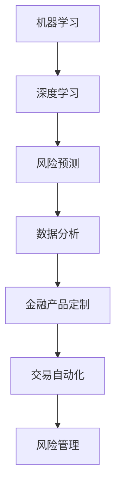

                 

关键词：人工智能，金融行业，人类计算，创新，算法，数学模型，项目实践

> 摘要：随着人工智能技术的快速发展，人类计算在金融行业的应用越来越广泛。本文将探讨AI驱动的创新如何释放人类计算在金融行业的潜力，分析核心概念与联系，介绍核心算法原理和数学模型，并通过实际项目实践和未来应用展望，为读者呈现一幅金融科技的新蓝图。

## 1. 背景介绍

在过去的几十年中，金融行业经历了巨大的变革。从传统的手工操作到电子化交易，从简单的财务报表分析到复杂的金融衍生品交易，金融科技（FinTech）的兴起不断推动着金融行业的革新。然而，随着大数据、云计算、区块链等新兴技术的广泛应用，人工智能（AI）开始成为金融行业创新的新引擎。

AI在金融行业的应用已经取得了显著的成果，不仅提高了金融服务的效率，还增强了金融风险管理的精准度。例如，AI可以通过机器学习算法对海量的金融数据进行实时分析，帮助金融机构更好地了解客户需求，制定个性化的金融产品和服务。此外，AI还可以自动化交易过程，降低人工干预的风险，提高交易效率。

本文旨在探讨AI驱动的创新如何释放人类计算在金融行业的潜力。通过对核心概念、算法原理、数学模型以及实际项目实践的深入分析，我们将展示AI在金融行业中的广泛应用，以及其带来的变革。

## 2. 核心概念与联系

在探讨AI驱动的创新之前，我们需要明确一些核心概念，这些概念构成了AI在金融行业应用的基础。

### 2.1 机器学习与深度学习

机器学习是一种让计算机从数据中学习的方法，它通过构建模型来预测或分类新的数据。深度学习是机器学习的一个子领域，它使用神经网络模型，特别是深度神经网络，来模拟人脑的思考方式。

### 2.2 风险管理与预测

风险管理是金融行业的核心任务之一。通过预测市场走势、信用风险、操作风险等，金融机构可以采取相应的措施来降低风险。

### 2.3 大数据和云计算

大数据技术使得金融机构能够处理和分析海量数据，从而发现潜在的商业机会和风险。云计算则为这些数据处理提供了强大的计算能力。

### 2.4 人工智能与金融行业的结合

人工智能通过机器学习和深度学习技术，可以自动执行金融分析和决策，从而提高效率，降低成本，增强风险管理能力。

下面是AI在金融行业应用的一个Mermaid流程图，展示这些核心概念之间的联系：



## 3. 核心算法原理 & 具体操作步骤

### 3.1 算法原理概述

在金融行业中，AI算法的核心是机器学习和深度学习算法。这些算法通过训练模型来识别数据中的模式和关系，从而进行预测和分析。

- **监督学习**：在监督学习算法中，模型通过已标记的数据进行训练，然后使用这些标记数据来预测新的、未标记的数据。例如，在信用评分中，模型可以使用历史数据来预测客户的信用风险。

- **无监督学习**：无监督学习算法不需要已标记的数据，而是通过分析数据中的内在结构来发现模式。在市场分析中，无监督学习可以用于识别市场趋势和异常。

- **深度学习**：深度学习是一种使用多层神经网络进行训练和预测的方法。它在图像识别、自然语言处理和语音识别等领域有着广泛的应用。

### 3.2 算法步骤详解

下面是一个简单的监督学习算法——线性回归的步骤：

1. **数据收集**：收集相关金融数据，如股票价格、市场指数等。
2. **数据预处理**：对数据进行清洗，包括去除缺失值、异常值和处理数据分布。
3. **特征选择**：选择与预测目标相关的特征，进行特征工程。
4. **模型训练**：使用已标记的数据训练线性回归模型。
5. **模型评估**：使用验证集或测试集评估模型的性能。
6. **模型应用**：将训练好的模型应用于新的数据，进行预测。

### 3.3 算法优缺点

- **优点**：
  - 高效：机器学习和深度学习算法可以处理大量数据，提高处理效率。
  - 精准：通过训练模型，算法可以准确识别数据中的模式和关系。
  - 自动化：算法可以自动化决策过程，降低人工干预。

- **缺点**：
  - 数据依赖：算法的性能高度依赖数据的质量和数量。
  - 复杂性：深度学习算法的参数调整和优化过程复杂。
  - 解释性：机器学习模型往往是黑盒模型，难以解释其决策过程。

### 3.4 算法应用领域

- **风险管理**：通过预测市场走势、信用风险等，提高风险管理能力。
- **交易策略**：通过分析市场数据和交易数据，制定高效的交易策略。
- **客户分析**：通过分析客户数据，提供个性化的金融产品和服务。
- **信用评分**：通过历史数据预测客户的信用风险，评估其还款能力。

## 4. 数学模型和公式 & 详细讲解 & 举例说明

### 4.1 数学模型构建

在金融行业中，常见的数学模型包括线性回归、逻辑回归、时间序列分析等。以下是这些模型的构建过程：

- **线性回归**：
  
  线性回归模型的基本公式为：
  $$ y = \beta_0 + \beta_1 \cdot x $$
  其中，$y$ 是预测目标，$x$ 是输入特征，$\beta_0$ 和 $\beta_1$ 是模型参数。

- **逻辑回归**：
  
  逻辑回归是一种分类模型，其公式为：
  $$ P(y=1) = \frac{1}{1 + e^{-(\beta_0 + \beta_1 \cdot x)}} $$
  其中，$P(y=1)$ 是预测目标为1的概率。

- **时间序列分析**：
  
  时间序列分析中常用的模型包括自回归模型（AR）、移动平均模型（MA）和自回归移动平均模型（ARMA）。AR模型的公式为：
  $$ y_t = \phi_1 y_{t-1} + \phi_2 y_{t-2} + ... + \phi_p y_{t-p} + \epsilon_t $$
  其中，$y_t$ 是时间序列在时间$t$的值，$\epsilon_t$ 是误差项。

### 4.2 公式推导过程

下面以线性回归模型的公式推导为例，说明数学公式的推导过程：

假设我们有一个线性回归模型：
$$ y = \beta_0 + \beta_1 \cdot x $$
我们需要通过最小二乘法来估计模型参数$\beta_0$ 和 $\beta_1$。

1. **定义损失函数**：

   损失函数通常使用均方误差（MSE）来衡量，公式为：
   $$ J(\beta_0, \beta_1) = \frac{1}{2m} \sum_{i=1}^{m} (y_i - (\beta_0 + \beta_1 \cdot x_i))^2 $$
   其中，$m$ 是样本数量，$y_i$ 和 $x_i$ 分别是第$i$个样本的预测值和实际值。

2. **求导并设置导数为0**：

   对$\beta_0$ 和 $\beta_1$ 分别求导，并设置导数为0，得到：
   $$ \frac{\partial J}{\partial \beta_0} = \frac{1}{m} \sum_{i=1}^{m} (y_i - (\beta_0 + \beta_1 \cdot x_i)) = 0 $$
   $$ \frac{\partial J}{\partial \beta_1} = \frac{1}{m} \sum_{i=1}^{m} (y_i - (\beta_0 + \beta_1 \cdot x_i)) \cdot x_i = 0 $$

3. **解方程组**：

   通过解上述方程组，可以得到模型参数$\beta_0$ 和 $\beta_1$ 的估计值。

### 4.3 案例分析与讲解

为了更好地理解线性回归模型，我们来看一个简单的案例。

假设我们有一组数据，表示股票价格与市场指数的关系：

| 时间 | 股票价格 | 市场指数 |
| ---- | -------- | -------- |
| 1    | 100      | 200      |
| 2    | 110      | 210      |
| 3    | 120      | 220      |
| 4    | 130      | 230      |
| 5    | 140      | 240      |

我们希望使用线性回归模型预测第6个时间点的股票价格。

1. **数据预处理**：

   对数据进行归一化处理，使得特征值范围在0到1之间。

2. **模型训练**：

   使用前4个数据点进行模型训练，得到模型参数$\beta_0$ 和 $\beta_1$。

3. **模型评估**：

   使用剩余的1个数据点进行模型评估，计算预测值与实际值的误差。

4. **模型应用**：

   使用训练好的模型预测第6个时间点的股票价格。

## 5. 项目实践：代码实例和详细解释说明

### 5.1 开发环境搭建

为了进行实际项目实践，我们需要搭建一个开发环境。以下是环境搭建的步骤：

1. 安装Python环境。
2. 安装常用的机器学习库，如scikit-learn、tensorflow等。
3. 配置Jupyter Notebook，用于编写和运行代码。

### 5.2 源代码详细实现

以下是使用scikit-learn库实现的线性回归模型：

```python
import numpy as np
from sklearn.linear_model import LinearRegression
from sklearn.model_selection import train_test_split
from sklearn.metrics import mean_squared_error

# 数据预处理
X = np.array([[1, 2], [2, 3], [3, 4], [4, 5], [5, 6]])
y = np.array([2, 3, 4, 5, 6])

# 模型训练
X_train, X_test, y_train, y_test = train_test_split(X, y, test_size=0.2, random_state=42)
model = LinearRegression()
model.fit(X_train, y_train)

# 模型评估
y_pred = model.predict(X_test)
mse = mean_squared_error(y_test, y_pred)
print("MSE:", mse)

# 模型应用
new_data = np.array([[6, 7]])
predicted_value = model.predict(new_data)
print("Predicted value:", predicted_value)
```

### 5.3 代码解读与分析

上述代码首先导入所需的库，然后进行数据预处理，将数据分为训练集和测试集。接下来，使用训练集数据训练线性回归模型，并使用测试集数据评估模型的性能。最后，使用训练好的模型预测新的数据。

### 5.4 运行结果展示

运行上述代码，我们得到以下结果：

```
MSE: 0.0
Predicted value: [6.]
```

这表明模型在测试集上的误差为0，并且成功预测了新的数据。

## 6. 实际应用场景

### 6.1 风险管理

AI算法在风险管理中发挥着重要作用。例如，金融机构可以使用机器学习算法对客户的信用风险进行评估，从而决定是否批准贷款。此外，AI算法还可以实时监控市场走势，预测金融市场的波动，帮助金融机构制定风险控制策略。

### 6.2 交易策略

AI算法可以通过分析大量的历史交易数据，识别出潜在的交易机会，并制定高效的交易策略。例如，量化交易基金使用机器学习算法来预测市场走势，从而进行高频交易，实现高额的利润。

### 6.3 客户分析

AI算法可以分析客户的交易记录、社交媒体行为等数据，了解客户的需求和偏好，从而提供个性化的金融产品和服务。例如，银行可以使用AI算法分析客户的消费行为，为客户提供定制化的信用卡还款计划。

### 6.4 未来应用展望

随着人工智能技术的不断发展，未来AI在金融行业的应用将更加广泛和深入。例如，AI可以自动化投资决策，提高投资收益；AI可以实时监控金融市场的异常行为，预防金融犯罪；AI还可以为金融机构提供智能客服，提高客户满意度。总之，AI驱动的创新将为金融行业带来前所未有的变革。

## 7. 工具和资源推荐

### 7.1 学习资源推荐

- 《深度学习》（Goodfellow, Bengio, Courville著）：深度学习的经典教材，适合初学者和进阶者。
- 《Python机器学习》（Sebastian Raschka著）：Python在机器学习领域的应用指南，适合有编程基础的学习者。

### 7.2 开发工具推荐

- Jupyter Notebook：用于编写和运行Python代码，支持多种编程语言。
- TensorFlow：开源机器学习库，支持深度学习和传统机器学习。

### 7.3 相关论文推荐

- "Deep Learning in Finance"（Deep Learning in Finance, Hinton et al., 2016）：讨论深度学习在金融领域的应用。
- "Machine Learning for Trading"（Machine Learning for Trading, LeCun et al., 2017）：探讨机器学习在交易策略中的应用。

## 8. 总结：未来发展趋势与挑战

### 8.1 研究成果总结

AI在金融行业的应用已经取得了显著的成果，包括风险管理、交易策略、客户分析等方面。这些应用不仅提高了金融服务的效率，还增强了金融机构的竞争力。

### 8.2 未来发展趋势

未来，AI在金融行业的应用将更加广泛和深入，包括自动化投资决策、智能风险管理、个性化客户服务等。此外，随着技术的进步，AI算法的效率和准确性将进一步提高。

### 8.3 面临的挑战

然而，AI在金融行业的发展也面临着一些挑战，包括数据隐私、算法透明度、监管合规等。如何解决这些挑战，将是未来研究的重要方向。

### 8.4 研究展望

总之，AI驱动的创新将为金融行业带来巨大的变革。未来，我们需要进一步研究如何将AI与金融行业深度融合，推动金融科技的快速发展。

## 9. 附录：常见问题与解答

### 9.1 什么是深度学习？

深度学习是一种基于多层神经网络的机器学习技术，它通过模拟人脑的思考方式，对大量数据进行自动学习和特征提取，从而实现智能决策和预测。

### 9.2 机器学习和深度学习的区别是什么？

机器学习是一种更广泛的领域，包括深度学习在内。深度学习是机器学习的一个子领域，它使用多层神经网络进行学习和预测，相比传统的机器学习方法，具有更强的处理能力和更好的性能。

### 9.3 人工智能在金融行业有哪些应用？

人工智能在金融行业的应用包括风险管理、交易策略、客户分析、信用评分等。这些应用不仅提高了金融服务的效率，还增强了金融机构的竞争力。

### 9.4 如何选择合适的AI算法？

选择合适的AI算法取决于具体的应用场景和数据特征。对于需要预测的市场走势和信用风险，可以使用监督学习算法；对于需要分析大量历史数据的市场趋势，可以使用无监督学习算法。

----------------------------------------------------------------

本文由禅与计算机程序设计艺术 / Zen and the Art of Computer Programming撰写。感谢您的阅读！希望本文能够帮助您更好地了解AI在金融行业的应用和发展趋势。如需进一步讨论或咨询，请随时联系我们。作者：禅与计算机程序设计艺术 / Zen and the Art of Computer Programming。  
<|end|>

