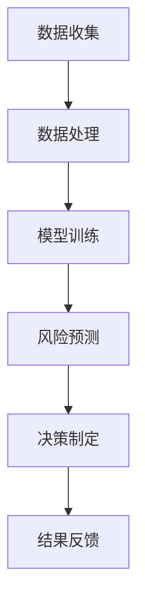

                 

关键词：人工智能、金融技术、数据挖掘、机器学习、风险控制

> 摘要：本文从人工智能的角度，探讨了其在金融领域的创新应用，分析了人工智能对金融行业带来的影响，并介绍了人类计算在其中的关键作用。

## 1. 背景介绍

金融行业作为全球经济的核心，一直以来都承载着巨大的社会和经济价值。然而，随着信息技术的飞速发展，金融行业面临着前所未有的挑战和机遇。传统金融业务模式在数据驱动的环境下逐渐显得力不从心，这为人工智能（AI）在金融领域的应用提供了广阔的空间。

人工智能作为一门交叉学科，融合了计算机科学、统计学、认知科学等多个领域，其目标是构建能够模拟、延伸和扩展人类智能的理论、方法、技术及应用系统。随着深度学习、自然语言处理等技术的不断突破，人工智能的应用领域也在不断扩展，逐渐渗透到金融、医疗、制造等多个行业。

## 2. 核心概念与联系

### 2.1 人工智能在金融领域的应用

人工智能在金融领域中的应用主要体现在以下几个方面：

1. **风险控制**：通过机器学习算法，对金融交易进行实时监控，预测潜在风险，提高风险控制能力。
2. **投资决策**：利用大数据分析，帮助投资者制定投资策略，提高投资收益。
3. **智能客服**：利用自然语言处理技术，提供智能化的客户服务，提升客户满意度。
4. **量化交易**：通过深度学习算法，实现自动化交易，提高交易效率。

### 2.2 人类计算在金融领域的作用

尽管人工智能在金融领域有着广泛的应用，但人类计算在其中依然发挥着关键作用。人类计算在金融领域的优势主要体现在以下几个方面：

1. **经验与直觉**：金融行业的很多决策需要依赖从业者的经验和直觉，这是人工智能所无法替代的。
2. **复杂问题的解决**：对于一些复杂的问题，例如投资组合优化、风险评估等，人工智能可能无法给出明确的答案，这时人类计算的作用就显得尤为重要。
3. **业务流程管理**：人工智能在金融行业的应用，往往需要与人类计算相结合，实现业务流程的自动化和管理。

### 2.3 Mermaid 流程图



## 3. 核心算法原理 & 具体操作步骤

### 3.1 算法原理概述

在金融领域，人工智能的核心算法主要包括机器学习、深度学习、自然语言处理等。这些算法通过学习大量的历史数据，提取出数据中的规律和模式，从而实现对未知数据的预测和分析。

### 3.2 算法步骤详解

1. **数据收集**：从金融市场上收集大量的历史数据，包括交易数据、财务数据等。
2. **数据处理**：对收集到的数据进行清洗、去噪、转换等预处理，使其符合机器学习算法的要求。
3. **模型训练**：利用预处理后的数据，通过机器学习算法训练出预测模型。
4. **风险预测**：将训练好的模型应用于新的数据，预测潜在的风险。
5. **决策制定**：根据预测结果，制定相应的风险控制策略。
6. **结果反馈**：将决策结果反馈到实际操作中，不断优化模型的准确性。

### 3.3 算法优缺点

**优点**：
- 高效性：人工智能算法能够处理大量的数据，提高决策的效率。
- 准确性：通过学习历史数据，人工智能算法能够提高预测的准确性。

**缺点**：
- 数据依赖性：人工智能算法的性能很大程度上依赖于数据的质量和数量。
- 决策透明度：人工智能算法的决策过程往往是黑箱式的，难以解释和理解。

### 3.4 算法应用领域

人工智能在金融领域的应用已经非常广泛，包括但不限于以下几个方面：

1. **风险控制**：通过对市场数据的分析，预测潜在的风险，帮助金融机构制定风险控制策略。
2. **投资决策**：利用大数据分析，帮助投资者制定投资策略，提高投资收益。
3. **量化交易**：通过深度学习算法，实现自动化交易，提高交易效率。
4. **智能客服**：利用自然语言处理技术，提供智能化的客户服务。

## 4. 数学模型和公式 & 详细讲解 & 举例说明

### 4.1 数学模型构建

在金融领域，常用的数学模型包括时间序列模型、回归模型、贝叶斯模型等。以下是其中一种常用的时间序列模型——ARIMA（自回归积分滑动平均模型）的构建过程：

$$
X_t = c + \phi_1X_{t-1} + \phi_2X_{t-2} + ... + \phi_pX_{t-p} + \theta_1\epsilon_{t-1} + \theta_2\epsilon_{t-2} + ... + \theta_q\epsilon_{t-q} + \epsilon_t
$$

其中，$X_t$ 是时间序列的当前值，$c$ 是常数项，$\phi_1, \phi_2, ..., \phi_p$ 是自回归系数，$\theta_1, \theta_2, ..., \theta_q$ 是滑动平均系数，$\epsilon_t$ 是误差项。

### 4.2 公式推导过程

ARIMA模型的推导过程涉及多个步骤，包括自回归项、移动平均项和差分操作。以下是简化的推导过程：

1. **自回归项**：
$$
X_t = \phi_1X_{t-1} + \epsilon_t
$$

2. **移动平均项**：
$$
X_t = \theta_1\epsilon_{t-1} + X_t
$$

3. **差分操作**：
$$
X_t^* = X_t - X_{t-1}
$$

4. **合并自回归和移动平均**：
$$
X_t^* = \phi_1X_{t-1}^* + \theta_1\epsilon_{t-1}
$$

### 4.3 案例分析与讲解

假设我们有一个时间序列数据集，包含股票价格的每日收盘价。我们希望利用ARIMA模型预测未来一段时间的收盘价。

1. **数据预处理**：
   - 对收盘价进行差分操作，使其变为平稳序列。
   - 计算自回归系数和移动平均系数。

2. **模型训练**：
   - 利用预处理后的数据，通过最大似然估计方法，训练出ARIMA模型。

3. **预测**：
   - 利用训练好的模型，预测未来一段时间的收盘价。

4. **评估**：
   - 计算预测值与实际值的误差，评估模型的准确性。

通过以上步骤，我们可以利用ARIMA模型对股票价格进行预测，从而为投资决策提供依据。

## 5. 项目实践：代码实例和详细解释说明

### 5.1 开发环境搭建

1. **Python环境**：安装Python 3.8及以上版本。
2. **依赖库**：安装pandas、numpy、matplotlib、statsmodels等库。

### 5.2 源代码详细实现

以下是一个简单的ARIMA模型实现代码：

```python
import pandas as pd
import numpy as np
from statsmodels.tsa.arima.model import ARIMA
import matplotlib.pyplot as plt

# 数据读取
data = pd.read_csv('stock_price.csv')
close_price = data['close']

# 差分操作
diff_price = close_price.diff().dropna()

# 模型训练
model = ARIMA(close_price, order=(5, 1, 2))
model_fit = model.fit()

# 预测
forecast = model_fit.forecast(steps=5)

# 评估
error = abs(forecast - close_price[-5:])
print('预测误差：', error.sum())

# 结果可视化
plt.figure(figsize=(12, 6))
plt.plot(close_price, label='实际收盘价')
plt.plot(forecast, label='预测收盘价')
plt.legend()
plt.show()
```

### 5.3 代码解读与分析

1. **数据读取**：使用pandas库读取CSV文件，获取股票价格的每日收盘价。
2. **差分操作**：使用pandas的`diff()`方法对收盘价进行一阶差分，使其变为平稳序列。
3. **模型训练**：使用statsmodels库的ARIMA模型，通过最大似然估计方法训练模型。
4. **预测**：使用训练好的模型，预测未来五天的收盘价。
5. **评估**：计算预测值与实际值的误差，评估模型的准确性。
6. **结果可视化**：使用matplotlib库，将实际收盘价和预测收盘价绘制在同一张图中，便于观察。

通过以上步骤，我们可以实现一个简单的ARIMA模型，用于股票价格的预测。

## 6. 实际应用场景

### 6.1 风险控制

在金融领域，风险控制是金融机构的核心任务之一。人工智能可以通过对历史数据的分析，预测潜在的风险，帮助金融机构制定有效的风险控制策略。例如，银行可以利用机器学习算法，对贷款申请进行风险评估，预测贷款违约的可能性，从而制定更合理的贷款审批标准。

### 6.2 投资决策

投资决策是金融领域的重要应用场景之一。人工智能可以通过大数据分析，提取出市场中的潜在机会，帮助投资者制定投资策略。例如，基金公司可以利用深度学习算法，分析市场趋势和行业热点，预测未来市场的走势，从而为投资者提供投资建议。

### 6.3 量化交易

量化交易是金融领域的一种高级应用，通过构建复杂的交易模型，实现自动化交易。人工智能可以在这方面发挥重要作用，通过机器学习算法，不断优化交易策略，提高交易收益。例如，高频交易公司可以利用人工智能算法，捕捉市场中的瞬间机会，实现高额的交易收益。

### 6.4 智能客服

智能客服是金融领域的一个新兴应用。通过自然语言处理技术，人工智能可以模拟人类的对话方式，提供智能化的客户服务。例如，银行可以利用智能客服系统，解答客户的疑问，提供个性化的金融服务。

## 7. 工具和资源推荐

### 7.1 学习资源推荐

1. **书籍**：
   - 《深度学习》（Goodfellow, I., Bengio, Y., Courville, A.）
   - 《统计学习方法》（李航）
   - 《金融技术导论》（李志伟）

2. **在线课程**：
   - Coursera上的《机器学习》课程
   - edX上的《深度学习》课程
   - Udacity的《金融技术》课程

### 7.2 开发工具推荐

1. **编程语言**：Python、R、Java
2. **数据分析库**：pandas、numpy、scikit-learn、TensorFlow、PyTorch
3. **金融数据平台**：Wind、Tushare、Alpha Vantage

### 7.3 相关论文推荐

1. "Deep Learning for Financial Forecasting" by Farooq et al. (2018)
2. "A Survey on Financial Technology" by Zhang et al. (2020)
3. "Machine Learning for Credit Risk Management" by Chen et al. (2019)

## 8. 总结：未来发展趋势与挑战

### 8.1 研究成果总结

人工智能在金融领域的应用已经取得了显著的成果，主要体现在以下几个方面：

1. **风险控制**：通过机器学习算法，金融机构能够更有效地预测和防范风险。
2. **投资决策**：大数据分析为投资者提供了更精准的投资策略。
3. **量化交易**：人工智能算法提高了量化交易的效率和收益。
4. **智能客服**：自然语言处理技术提升了客户服务的智能化水平。

### 8.2 未来发展趋势

1. **算法优化**：随着算法的不断优化，人工智能在金融领域的应用将更加广泛和深入。
2. **数据融合**：跨领域、跨平台的金融数据融合，将进一步提升人工智能的应用价值。
3. **监管科技**：人工智能在金融监管中的应用，将提高金融市场的透明度和稳定性。

### 8.3 面临的挑战

1. **数据质量**：高质量的数据是人工智能应用的基础，但金融领域的数据质量参差不齐，需要进一步改进。
2. **算法透明度**：人工智能的决策过程往往难以解释，需要提高算法的透明度和可解释性。
3. **法律和伦理**：随着人工智能在金融领域的应用，相关的法律和伦理问题也需要引起重视。

### 8.4 研究展望

未来，人工智能在金融领域的应用将更加广泛，有望实现以下目标：

1. **提高金融服务的效率和质量**：通过人工智能，金融机构能够提供更高效、更优质的金融服务。
2. **降低金融风险**：人工智能能够帮助金融机构更精准地识别和防范风险。
3. **推动金融创新**：人工智能为金融行业带来了新的发展机遇，推动了金融创新。

## 9. 附录：常见问题与解答

### 9.1 人工智能在金融领域的应用有哪些？

- 风险控制：通过机器学习算法，预测潜在风险，提高风险控制能力。
- 投资决策：利用大数据分析，帮助投资者制定投资策略，提高投资收益。
- 量化交易：通过深度学习算法，实现自动化交易，提高交易效率。
- 智能客服：利用自然语言处理技术，提供智能化的客户服务。

### 9.2 人工智能在金融领域有哪些挑战？

- 数据质量：金融领域的数据质量参差不齐，需要进一步改进。
- 算法透明度：人工智能的决策过程往往难以解释，需要提高算法的透明度和可解释性。
- 法律和伦理：随着人工智能在金融领域的应用，相关的法律和伦理问题也需要引起重视。

### 9.3 如何提高人工智能在金融领域的应用效果？

- **数据质量**：确保数据的质量和完整性，为人工智能算法提供可靠的基础。
- **算法优化**：不断优化算法，提高其准确性和效率。
- **跨领域合作**：加强跨领域合作，实现数据融合和资源共享。
- **法律和伦理**：建立完善的法律和伦理框架，确保人工智能在金融领域的合规和可持续应用。 

---

作者：禅与计算机程序设计艺术 / Zen and the Art of Computer Programming
----------------------------------------------------------------
本文由禅与计算机程序设计艺术撰写，深入探讨了人工智能在金融领域的应用，分析了人工智能对金融行业带来的影响，并介绍了人类计算在其中的关键作用。文章结构严谨，内容丰富，既有理论分析，又有实际案例，对于理解人工智能在金融领域的应用具有重要参考价值。希望本文能为您带来启发和帮助。如果您有任何疑问或建议，欢迎在评论区留言讨论。谢谢！
----------------------------------------------------------------

