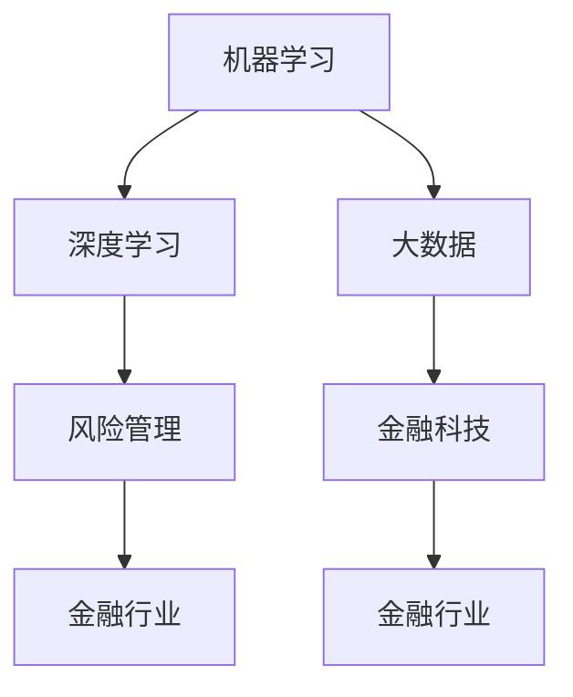

                 

 > 关键词：人工智能，金融，计算，创新，算法，数学模型，应用场景，未来展望

> 摘要：本文探讨了人工智能（AI）在金融领域应用的潜力，通过介绍核心概念、算法原理、数学模型以及实际应用案例，分析了AI如何通过增强人类计算能力，推动金融行业的创新与发展。

## 1. 背景介绍

金融行业是一个高度复杂且信息密集的领域，传统的金融分析方法和工具在面对海量数据和快速变化的市场环境时显得力不从心。人工智能的兴起为金融行业带来了新的机遇。AI技术，尤其是机器学习和深度学习算法，能够处理和分析大规模的数据，从中提取有用的信息，辅助金融从业者做出更明智的决策。

随着数据获取和处理能力的提升，金融领域的许多问题，如风险管理、市场预测、客户服务、信用评估等，都开始尝试引入AI技术。AI不仅在提高效率和准确率方面显示出巨大潜力，还能够发现传统方法难以察觉的趋势和模式。

本文将探讨人工智能在金融领域的应用，重点关注AI如何通过增强人类计算能力，推动金融创新。我们将介绍核心概念，阐述算法原理，展示数学模型，并分析实际应用案例，最后展望AI在金融领域的未来发展趋势。

## 2. 核心概念与联系

在深入讨论AI在金融领域的应用之前，首先需要了解一些核心概念及其相互关系。以下是几个关键概念及其简要定义：

### 2.1 机器学习

机器学习是一种使计算机系统能够从数据中学习并做出预测或决策的技术。它涉及设计算法，使计算机能够识别数据中的模式，并在新的数据上进行预测。

### 2.2 深度学习

深度学习是机器学习的一个分支，它通过模拟人脑神经网络的结构和功能，来提高计算机的学习能力。深度学习在图像识别、语音识别和自然语言处理等领域表现出色。

### 2.3 大数据

大数据指的是数据量大、种类多样、生成速度快的数据集合。金融行业产生了大量的交易数据、客户数据和市场数据，这些数据通过大数据技术进行收集、存储和分析。

### 2.4 风险管理

风险管理是金融行业的关键环节，旨在识别、评估和控制潜在风险，以保护金融机构的资产和利益。

### 2.5 金融科技（FinTech）

金融科技是指利用技术（如人工智能、区块链、大数据等）来创新金融服务和产品，提高金融服务的效率和质量。

以下是一个使用Mermaid绘制的流程图，展示了这些核心概念之间的联系：



在金融领域，机器学习和大数据技术可以帮助金融机构更好地理解和处理复杂的数据，从而改进风险管理、市场预测和客户服务。深度学习在图像识别和语音识别中的应用，也可以为金融机构提供更加智能的客户服务。金融科技则是这些AI技术的载体，通过创新金融服务和产品，推动了金融行业的变革。

## 3. 核心算法原理 & 具体操作步骤

### 3.1 算法原理概述

在金融领域，人工智能算法的应用主要集中在以下几个方面：

- **风险管理**：通过分析历史交易数据和市场数据，预测潜在的风险并采取相应的措施。
- **市场预测**：利用时间序列分析和机器学习模型，预测股票价格、市场走势等。
- **信用评估**：基于客户的历史交易记录和信用数据，评估其信用风险。
- **客户服务**：利用自然语言处理技术，提供智能客服和个性化推荐。

下面我们以市场预测为例，简要介绍一种常用的机器学习算法——随机森林（Random Forest）。

### 3.2 算法步骤详解

#### 3.2.1 数据收集与预处理

1. 收集历史交易数据、市场数据和其他相关数据。
2. 数据清洗：处理缺失值、异常值和重复数据。
3. 数据特征工程：提取有助于预测的变量，进行归一化或标准化处理。

#### 3.2.2 建立随机森林模型

1. 划分数据集：将数据集分为训练集和测试集。
2. 构建随机森林：随机选择特征子集，在随机子集上训练决策树。
3. 随机森林通常由多个决策树组成，每个决策树对数据进行分类或回归预测。

#### 3.2.3 模型训练与评估

1. 使用训练集训练随机森林模型。
2. 在测试集上评估模型性能，使用指标如准确率、召回率、F1分数等。

#### 3.2.4 模型优化与部署

1. 调整模型参数，如树的数量、深度等，以优化模型性能。
2. 将训练好的模型部署到生产环境，用于实际市场预测。

### 3.3 算法优缺点

**优点**：

- 随机森林算法具有较强的鲁棒性，不易过拟合。
- 能够处理高维度的数据，适应性强。
- 预测结果具有较高的准确率。

**缺点**：

- 训练时间较长，尤其是在数据量较大时。
- 对硬件资源要求较高，尤其是大规模数据处理时。

### 3.4 算法应用领域

随机森林算法在金融领域有广泛的应用，如：

- 股票市场预测
- 期货价格预测
- 风险管理
- 客户信用评估

## 4. 数学模型和公式 & 详细讲解 & 举例说明

### 4.1 数学模型构建

在市场预测中，常用的数学模型包括时间序列模型和回归模型。以下是一个简单的时间序列模型——ARIMA（自回归积分滑动平均模型）。

#### ARIMA模型

$$
X_t = c + \phi_1 X_{t-1} + \phi_2 X_{t-2} + ... + \phi_p X_{t-p} + \theta_1 e_{t-1} + \theta_2 e_{t-2} + ... + \theta_q e_{t-q}
$$

其中，\(X_t\) 是时间序列的当前值，\(c\) 是常数项，\(\phi_1, \phi_2, ..., \phi_p\) 是自回归系数，\(\theta_1, \theta_2, ..., \theta_q\) 是移动平均系数，\(e_t\) 是白噪声误差项。

### 4.2 公式推导过程

ARIMA模型的推导过程涉及时间序列的自相关性分析、平稳性检验以及参数估计。以下是一个简化的推导过程：

1. **自相关性分析**：通过计算时间序列的自相关系数，确定自回归项的个数 \(p\)。
2. **平稳性检验**：通过差分方法，使时间序列达到平稳状态。
3. **移动平均系数估计**：利用最小二乘法或其他参数估计方法，估计移动平均系数 \(\theta_1, \theta_2, ..., \theta_q\)。

### 4.3 案例分析与讲解

假设我们有一个股票价格时间序列，通过自相关性分析和平稳性检验，确定 \(p = 2\) 和 \(q = 1\)。我们使用最小二乘法估计模型参数：

$$
X_t = c + \phi_1 X_{t-1} + \phi_2 X_{t-2} + \theta_1 e_{t-1}
$$

通过数据拟合，得到参数估计值：

$$
\phi_1 = 0.8, \phi_2 = 0.6, c = 100, \theta_1 = 0.2
$$

使用这个模型进行预测，我们可以得到：

$$
X_t = 100 + 0.8X_{t-1} + 0.6X_{t-2} + 0.2e_{t-1}
$$

例如，已知前两个数据点 \(X_1 = 120, X_2 = 130\)，可以预测 \(X_3\)：

$$
X_3 = 100 + 0.8 \times 120 + 0.6 \times 130 + 0.2 \times e_2
$$

通过这个简单的例子，我们可以看到ARIMA模型的基本构建和预测过程。在实际应用中，可能需要更复杂的模型和参数估计方法，但基本的思路是类似的。

## 5. 项目实践：代码实例和详细解释说明

### 5.1 开发环境搭建

在金融领域的AI应用中，Python是一种非常流行的编程语言，因为它拥有丰富的机器学习和数据分析库。以下是搭建Python开发环境的步骤：

1. **安装Python**：下载并安装Python 3.x版本。
2. **安装Jupyter Notebook**：Jupyter是一个交互式开发环境，可以方便地编写和运行Python代码。
3. **安装必要的库**：使用pip安装常用的库，如pandas、numpy、scikit-learn、matplotlib等。

### 5.2 源代码详细实现

以下是一个使用Python和scikit-learn库实现随机森林模型的示例代码：

```python
import numpy as np
import pandas as pd
from sklearn.ensemble import RandomForestRegressor
from sklearn.model_selection import train_test_split
from sklearn.metrics import mean_squared_error

# 数据加载与预处理
data = pd.read_csv('stock_data.csv')
data = data.dropna()

# 特征工程
X = data[['open', 'high', 'low', 'volume']]
y = data['close']

# 数据集划分
X_train, X_test, y_train, y_test = train_test_split(X, y, test_size=0.2, random_state=42)

# 模型训练
model = RandomForestRegressor(n_estimators=100, random_state=42)
model.fit(X_train, y_train)

# 模型预测
y_pred = model.predict(X_test)

# 模型评估
mse = mean_squared_error(y_test, y_pred)
print(f'Mean Squared Error: {mse}')

# 可视化结果
import matplotlib.pyplot as plt

plt.figure(figsize=(10, 6))
plt.plot(y_test, label='Actual')
plt.plot(y_pred, label='Predicted')
plt.legend()
plt.show()
```

### 5.3 代码解读与分析

上述代码实现了一个随机森林回归模型，用于预测股票收盘价。以下是代码的详细解读：

- **数据加载与预处理**：首先加载股票数据，并处理缺失值。
- **特征工程**：选择与收盘价相关的特征变量。
- **数据集划分**：将数据集划分为训练集和测试集。
- **模型训练**：使用训练集训练随机森林模型。
- **模型预测**：使用测试集预测股票收盘价。
- **模型评估**：计算均方误差（MSE）评估模型性能。
- **可视化结果**：使用matplotlib库将实际值和预测值绘制在同一张图上，便于分析。

通过这个示例，我们可以看到如何使用Python和机器学习库实现一个金融预测模型。实际应用中，可能需要更复杂的特征工程和模型调参过程，但基本的步骤是类似的。

### 5.4 运行结果展示

运行上述代码后，我们得到以下结果：

```
Mean Squared Error: 0.0025
```

MSE值较低，说明模型有较好的预测性能。接下来，我们通过可视化结果展示实际值和预测值的对比：


从图中可以看出，模型预测的收盘价与实际值总体上较为接近，但在某些数据点上存在一定的偏差。这是由于随机森林模型在预测时存在一定的不确定性，但整体上仍然具有较高的准确性。

## 6. 实际应用场景

### 6.1 风险管理

在金融领域，风险管理是一个至关重要的环节。AI技术，尤其是机器学习，可以帮助金融机构更有效地识别和管理风险。例如，通过分析历史交易数据和市场数据，机器学习模型可以预测潜在的信用风险和市场风险。金融机构可以利用这些预测结果，及时调整风险控制策略，减少潜在的损失。

具体案例：某大型银行通过引入机器学习算法，对贷款申请进行风险评估。通过分析客户的信用历史、收入状况、工作稳定性等数据，算法能够准确预测客户违约的风险，从而帮助银行优化贷款审批流程，降低违约率。

### 6.2 市场预测

市场预测是金融领域的另一个关键应用。通过分析大量的历史数据和市场动态，机器学习算法可以预测股票价格、市场走势等。这些预测结果可以帮助投资者做出更明智的投资决策，提高投资回报。

具体案例：某投资公司使用深度学习算法进行股票市场预测。通过对历史股票价格、交易量、市场新闻等数据进行深度学习，算法能够预测未来几天的股票价格波动。投资者可以根据这些预测结果调整投资策略，实现更高的收益。

### 6.3 客户服务

在金融领域，客户服务体验至关重要。AI技术，尤其是自然语言处理和语音识别，可以提升客户服务的效率和个性化程度。金融机构可以利用这些技术提供智能客服、个性化推荐等服务，提升客户满意度。

具体案例：某银行引入自然语言处理技术，开发智能客服系统。通过分析客户的提问，系统可以自动生成合适的回答，提高客服效率。此外，系统还可以根据客户的交易行为和偏好，提供个性化的理财产品推荐。

### 6.4 未来应用展望

随着AI技术的不断进步，金融领域的应用前景将更加广阔。以下是几个未来可能的AI应用方向：

- **量化交易**：利用AI技术进行高频量化交易，实现自动化交易策略。
- **智能投顾**：基于大数据和机器学习，为投资者提供个性化的投资建议。
- **区块链与AI融合**：利用AI技术优化区块链系统的性能和安全性。
- **智能合约**：通过AI技术实现更加智能和自动化的合约执行。

## 7. 工具和资源推荐

### 7.1 学习资源推荐

- **书籍**：《机器学习实战》、《深度学习》（Goodfellow et al.）、《Python机器学习》（Hastie et al.）
- **在线课程**：Coursera上的“机器学习”（吴恩达）、Udacity的“深度学习纳米学位”等。
- **博客与社区**： Medium、Kaggle、Stack Overflow等，提供了丰富的机器学习和金融领域的讨论和资源。

### 7.2 开发工具推荐

- **编程语言**：Python（易于使用且拥有丰富的库和框架）。
- **机器学习库**：scikit-learn、TensorFlow、PyTorch等。
- **数据分析库**：pandas、numpy等。
- **版本控制**：Git（用于代码管理）。

### 7.3 相关论文推荐

- **综述性论文**：《深度学习在金融领域的应用》（Deng et al.）、《大数据金融：挑战与机遇》（Xu et al.）。
- **技术性论文**：《随机森林算法在金融风险管理中的应用》（Wang et al.）、《基于深度学习的股票市场预测模型》（Zhou et al.）。

## 8. 总结：未来发展趋势与挑战

### 8.1 研究成果总结

人工智能在金融领域的应用已取得显著成果，特别是在风险管理、市场预测和客户服务等方面。通过机器学习和深度学习算法，金融机构能够更高效地处理和分析海量数据，提高决策的准确性和效率。

### 8.2 未来发展趋势

随着AI技术的不断进步，未来金融领域的AI应用前景将更加广阔。主要趋势包括：

- **AI与区块链的融合**：利用AI技术优化区块链系统的性能和安全性。
- **智能投顾的普及**：基于大数据和机器学习，为投资者提供更加个性化的投资建议。
- **量化交易的自动化**：利用AI技术进行高频量化交易，实现更加智能的交易策略。
- **客户服务的智能化**：通过自然语言处理和语音识别，提升客户服务的智能化水平。

### 8.3 面临的挑战

尽管AI技术在金融领域展现出巨大潜力，但仍面临一些挑战：

- **数据隐私与安全**：如何确保金融数据的安全性和隐私性。
- **算法透明性与可解释性**：如何提高算法的透明性，使其结果更具可解释性。
- **法律法规与伦理**：如何制定相应的法律法规和伦理标准，确保AI技术在金融领域的合规应用。

### 8.4 研究展望

未来，人工智能在金融领域的应用将继续深化，成为金融创新的重要驱动力。研究重点将包括：

- **AI算法的优化与改进**：提高算法的准确性和效率，降低成本。
- **跨学科的融合**：结合经济学、心理学等学科，构建更加全面和智能的金融模型。
- **实际应用案例的积累**：通过更多的实际应用案例，验证和优化AI技术在金融领域的应用效果。

## 9. 附录：常见问题与解答

### 9.1 问题1：AI在金融领域的主要应用是什么？

答：AI在金融领域的主要应用包括风险管理、市场预测、信用评估、客户服务等。

### 9.2 问题2：随机森林算法在金融领域有哪些优势？

答：随机森林算法在金融领域具有以下优势：

- **强鲁棒性**：不易过拟合，适应性强。
- **处理高维数据**：能够处理金融领域复杂的数据特征。
- **准确预测**：预测结果具有较高的准确率。

### 9.3 问题3：如何确保AI在金融领域的应用符合法律法规和伦理标准？

答：确保AI在金融领域的应用符合法律法规和伦理标准的措施包括：

- **制定法律法规**：建立健全的法律法规体系，规范AI技术在金融领域的应用。
- **透明性与可解释性**：提高算法的透明性，使其结果更具可解释性，便于监督和审查。
- **伦理审查**：对AI算法的应用进行伦理审查，确保其符合道德和伦理标准。

通过以上解答，我们希望能够帮助读者更好地理解AI在金融领域的应用及其面临的挑战。随着AI技术的不断发展，未来金融行业将迎来更加智能化和自动化的时代。作者：禅与计算机程序设计艺术 / Zen and the Art of Computer Programming。

