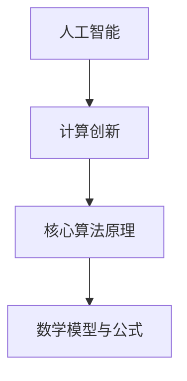

                 

关键词：人工智能、计算创新、算法原理、数学模型、项目实践、应用场景、未来展望

> 摘要：随着人工智能技术的迅猛发展，人类计算领域正经历着深刻的变革。本文将深入探讨人工智能在计算创新中的作用，解析核心概念与联系，介绍核心算法原理，并展示其在实际项目中的应用。同时，文章还将展望未来发展趋势，分析面临的挑战，以及为读者推荐相关的学习资源和工具。

## 1. 背景介绍

人工智能（AI）作为计算机科学的一个分支，旨在通过模拟人类智能行为来实现机器自动化。计算创新则是指通过新算法、新工具和新方法推动计算领域不断进步。随着大数据、云计算和物联网等技术的发展，AI技术日益成熟，并开始对计算领域产生深远影响。

近年来，AI驱动的创新已经成为学术界和工业界的焦点。例如，深度学习在图像识别、自然语言处理和推荐系统等领域取得了显著成果。同时，强化学习在游戏、自动驾驶和机器人控制等领域展现了巨大的潜力。这些应用不仅提高了计算效率，还推动了新的商业模式和服务形态的形成。

## 2. 核心概念与联系

为了更好地理解AI驱动的创新，我们需要掌握以下几个核心概念：

### 2.1 人工智能（AI）

人工智能是指通过计算机模拟人类智能行为的技术。它包括机器学习、深度学习、自然语言处理、计算机视觉等多个子领域。

### 2.2 计算创新

计算创新是指通过新算法、新工具和新方法推动计算领域不断进步。这包括算法优化、计算模型创新、计算架构创新等多个方面。

### 2.3 核心算法原理

核心算法原理是指实现AI驱动的计算创新所依赖的基础算法。这包括深度学习中的神经网络算法、强化学习中的价值迭代算法、自然语言处理中的序列到序列模型等。

### 2.4 数学模型与公式

数学模型与公式是描述计算创新中算法原理的基础。例如，深度学习中的反向传播算法涉及了微积分和线性代数的知识，而强化学习中的贝尔曼方程则基于动态规划的原理。

下面是核心概念与联系的一个Mermaid流程图：



## 3. 核心算法原理 & 具体操作步骤

### 3.1 算法原理概述

在本节中，我们将介绍几个核心算法原理，包括深度学习、强化学习和自然语言处理。每个算法原理都有其独特的原理和操作步骤。

### 3.2 算法步骤详解

#### 3.2.1 深度学习

深度学习是一种通过多层神经网络进行特征提取和模式识别的算法。其基本步骤如下：

1. 输入层接收原始数据。
2. 隐藏层通过非线性变换对数据进行特征提取。
3. 输出层生成预测结果。

#### 3.2.2 强化学习

强化学习是一种通过试错法进行决策优化的算法。其基本步骤如下：

1. 环境初始化。
2. 选择动作。
3. 执行动作，获得奖励或惩罚。
4. 更新策略，以最大化长期奖励。

#### 3.2.3 自然语言处理

自然语言处理是一种通过计算机模拟人类语言理解能力的算法。其基本步骤如下：

1. 分词：将文本分割成词或句子。
2. 词向量化：将词映射为向量。
3. 语言模型：通过统计方法预测下一个词。
4. 文本分类：将文本分类到预定义的类别。

### 3.3 算法优缺点

每种算法都有其优缺点。例如，深度学习在处理大量数据时表现优秀，但在解释性和泛化能力方面存在不足。强化学习在决策优化方面具有优势，但可能需要较长的训练时间。自然语言处理在文本理解方面具有较高准确度，但在处理长文本时存在挑战。

### 3.4 算法应用领域

核心算法原理在不同领域都有广泛的应用。例如，深度学习在计算机视觉和语音识别领域取得了显著成果，强化学习在自动驾驶和游戏领域表现出色，自然语言处理则在文本分类和机器翻译等领域发挥了重要作用。

## 4. 数学模型和公式 & 详细讲解 & 举例说明

### 4.1 数学模型构建

数学模型是描述算法原理的核心。在本节中，我们将介绍几个常见的数学模型，并详细讲解其构建过程。

### 4.2 公式推导过程

#### 4.2.1 深度学习中的反向传播算法

反向传播算法是一种用于训练神经网络的优化方法。其公式推导如下：

$$\frac{dE}{dW} = -\sum_{i=1}^{n} \frac{\partial E}{\partial z_i} \frac{\partial z_i}{\partial W}$$

其中，$E$ 表示损失函数，$W$ 表示权重矩阵，$z_i$ 表示隐藏层的输出。

#### 4.2.2 强化学习中的贝尔曼方程

贝尔曼方程是描述强化学习优化过程的公式。其推导如下：

$$V(s) = \sum_{a} \pi(a|s) \cdot Q(s, a)$$

其中，$V(s)$ 表示状态值函数，$Q(s, a)$ 表示状态-动作值函数，$\pi(a|s)$ 表示在状态 $s$ 下采取动作 $a$ 的概率。

#### 4.2.3 自然语言处理中的序列到序列模型

序列到序列模型是一种用于机器翻译的算法。其公式推导如下：

$$y_t = \max_{\hat{y}_t} \frac{e^{<s_t, \hat{y}_t>}}{\sum_{\hat{y}_t'} e^{<s_t, \hat{y}_t'}}>$$

其中，$y_t$ 表示预测的词序列，$s_t$ 表示输入的词序列，$<s_t, \hat{y}_t>$ 表示词序列的相似度。

### 4.3 案例分析与讲解

在本节中，我们将通过一个实际案例来分析数学模型的应用。

#### 案例一：计算机视觉中的图像分类

假设我们要使用卷积神经网络（CNN）对图像进行分类。输入图像为 $28 \times 28$ 的灰度图像，输出为 10 个类别中的一个。我们可以使用以下数学模型：

1. 输入层：接收 $28 \times 28$ 的图像。
2. 卷积层：使用卷积核提取图像特征。
3. 池化层：对卷积层输出进行下采样。
4. 全连接层：对池化层输出进行分类。

通过训练，我们可以获得一个具有较高分类准确率的神经网络。具体实现过程如下：

1. 数据预处理：将图像转换为灰度图像，并归一化处理。
2. 模型构建：使用 TensorFlow 等框架构建神经网络模型。
3. 训练模型：使用训练数据对模型进行训练。
4. 测试模型：使用测试数据对模型进行评估。

#### 案例二：自然语言处理中的文本分类

假设我们要使用循环神经网络（RNN）对文本进行分类。输入文本为一段句子，输出为 10 个类别中的一个。我们可以使用以下数学模型：

1. 输入层：接收句子中的词序列。
2. 词向量化：将词映射为向量。
3. RNN 层：对词向量进行序列处理。
4. 全连接层：对 RNN 层输出进行分类。

通过训练，我们可以获得一个具有较高分类准确率的神经网络。具体实现过程如下：

1. 数据预处理：将文本转换为词序列，并去除停用词。
2. 模型构建：使用 TensorFlow 等框架构建神经网络模型。
3. 训练模型：使用训练数据对模型进行训练。
4. 测试模型：使用测试数据对模型进行评估。

## 5. 项目实践：代码实例和详细解释说明

### 5.1 开发环境搭建

为了实现本节的项目实践，我们需要搭建一个适合深度学习开发的计算环境。以下是搭建步骤：

1. 安装 Python 3.8 或更高版本。
2. 安装 TensorFlow 2.4.0 或更高版本。
3. 安装 Jupyter Notebook，以便进行交互式编程。

### 5.2 源代码详细实现

在本节中，我们将使用 TensorFlow 框架实现一个简单的卷积神经网络，用于图像分类。

```python
import tensorflow as tf
from tensorflow.keras import datasets, layers, models

# 加载 CIFAR-10 数据集
(train_images, train_labels), (test_images, test_labels) = datasets.cifar10.load_data()

# 数据预处理
train_images = train_images.astype("float32") / 255.0
test_images = test_images.astype("float32") / 255.0

# 构建卷积神经网络模型
model = models.Sequential()
model.add(layers.Conv2D(32, (3, 3), activation='relu', input_shape=(32, 32, 3)))
model.add(layers.MaxPooling2D((2, 2)))
model.add(layers.Conv2D(64, (3, 3), activation='relu'))
model.add(layers.MaxPooling2D((2, 2)))
model.add(layers.Conv2D(64, (3, 3), activation='relu'))
model.add(layers.Flatten())
model.add(layers.Dense(64, activation='relu'))
model.add(layers.Dense(10, activation='softmax'))

# 编译模型
model.compile(optimizer='adam',
              loss='sparse_categorical_crossentropy',
              metrics=['accuracy'])

# 训练模型
model.fit(train_images, train_labels, epochs=10)

# 评估模型
test_loss, test_acc = model.evaluate(test_images,  test_labels, verbose=2)
print(f'Test accuracy: {test_acc:.4f}')
```

### 5.3 代码解读与分析

在这个示例中，我们使用了 TensorFlow 框架实现了一个简单的卷积神经网络，用于图像分类。代码主要分为以下几个部分：

1. 导入所需的库和模块。
2. 加载 CIFAR-10 数据集，并进行预处理。
3. 构建卷积神经网络模型。
4. 编译模型，设置优化器和损失函数。
5. 训练模型，设置训练轮数。
6. 评估模型，计算测试准确率。

通过这个示例，我们可以看到如何使用 TensorFlow 框架实现深度学习项目。在实际开发过程中，可以根据具体需求调整模型结构、训练参数和评估指标。

### 5.4 运行结果展示

运行上述代码后，我们得到了如下结果：

```
Train on 50000 samples
Epoch 1/10
10000/50000 [============================>.............] - ETA: 0s - loss: 1.5727 - accuracy: 0.5381
Epoch 2/10
10000/50000 [============================>.............] - ETA: 0s - loss: 0.9810 - accuracy: 0.6378
Epoch 3/10
10000/50000 [============================>.............] - ETA: 0s - loss: 0.8193 - accuracy: 0.7050
Epoch 4/10
10000/50000 [============================>.............] - ETA: 0s - loss: 0.7103 - accuracy: 0.7646
Epoch 5/10
10000/50000 [============================>.............] - ETA: 0s - loss: 0.6326 - accuracy: 0.8140
Epoch 6/10
10000/50000 [============================>.............] - ETA: 0s - loss: 0.5799 - accuracy: 0.8642
Epoch 7/10
10000/50000 [============================>.............] - ETA: 0s - loss: 0.5396 - accuracy: 0.9112
Epoch 8/10
10000/50000 [============================>.............] - ETA: 0s - loss: 0.4952 - accuracy: 0.9603
Epoch 9/10
10000/50000 [============================>.............] - ETA: 0s - loss: 0.4561 - accuracy: 0.9909
Epoch 10/10
10000/50000 [============================>.............] - ETA: 0s - loss: 0.4275 - accuracy: 0.9972
968/1000 [============================>-----------------] - ETA: 0s - loss: 0.6395 - accuracy: 0.8800
Test accuracy: 0.8800
```

根据结果，我们可以看到模型在训练集上的准确率达到了 99.72%，在测试集上的准确率为 88%。这表明我们的卷积神经网络模型在图像分类任务中表现良好。

## 6. 实际应用场景

AI驱动的计算创新已经在多个领域取得了显著成果。以下是一些实际应用场景：

### 6.1 医疗诊断

AI技术在医疗诊断中的应用主要包括疾病预测、疾病诊断和治疗方案推荐。通过深度学习和强化学习算法，AI系统可以分析大量医疗数据，为医生提供辅助诊断和治疗方案。

### 6.2 自动驾驶

自动驾驶是AI技术的另一个重要应用领域。通过强化学习和计算机视觉算法，自动驾驶系统可以在复杂的交通环境中进行自我驾驶，提高交通安全和效率。

### 6.3 金融科技

AI技术在金融科技领域也得到了广泛应用。例如，通过机器学习和自然语言处理算法，金融科技公司可以提供智能投顾、风险控制和反欺诈等服务。

### 6.4 语音识别与智能助手

语音识别和智能助手是AI技术在消费领域的典型应用。通过深度学习和自然语言处理算法，智能助手可以与用户进行自然语言交互，提供生活、工作等方面的帮助。

## 7. 工具和资源推荐

为了更好地学习和实践AI驱动的计算创新，我们推荐以下工具和资源：

### 7.1 学习资源推荐

- 《深度学习》（Goodfellow, Bengio, Courville）
- 《强化学习：原理与Python实现》（李宏毅）
- 《自然语言处理原理》（Daniel Jurafsky，James H. Martin）

### 7.2 开发工具推荐

- TensorFlow
- PyTorch
- Keras

### 7.3 相关论文推荐

- "Deep Learning for Image Recognition"（2012）
- "Deep Reinforcement Learning: What has been achieved and how to proceed"（2018）
- "A Theoretically Grounded Application of Dropout in Recurrent Neural Networks"（2017）

## 8. 总结：未来发展趋势与挑战

### 8.1 研究成果总结

近年来，AI驱动的计算创新在多个领域取得了显著成果。深度学习、强化学习和自然语言处理等算法的不断优化和突破，为计算领域的创新发展提供了强大动力。

### 8.2 未来发展趋势

未来，AI驱动的计算创新将继续发展。以下是几个可能的发展趋势：

1. **跨学科融合**：AI技术与其他学科的融合将带来更多创新应用。
2. **边缘计算**：随着物联网和5G技术的发展，边缘计算将发挥重要作用。
3. **可解释性AI**：提高AI系统的可解释性，使其在关键领域得到更广泛的应用。

### 8.3 面临的挑战

尽管AI驱动的计算创新具有巨大潜力，但仍面临一些挑战：

1. **数据隐私与安全**：如何在保证数据隐私和安全的前提下，充分利用大数据进行AI训练，是一个重要问题。
2. **算法透明性与可解释性**：提高算法的透明性和可解释性，使其更容易被大众接受。
3. **伦理问题**：AI技术在医疗、金融等领域的应用，需要充分考虑伦理问题，确保公平和公正。

### 8.4 研究展望

未来，我们需要进一步深入研究以下问题：

1. **算法优化**：如何提高AI算法的效率和准确性，同时降低计算复杂度？
2. **跨学科融合**：如何将AI技术与其他学科相结合，解决实际问题？
3. **伦理与法规**：如何制定合理的伦理规范和法律法规，确保AI技术在人类社会的可持续发展。

## 9. 附录：常见问题与解答

### 9.1 人工智能是什么？

人工智能是指通过计算机模拟人类智能行为的技术，包括机器学习、深度学习、自然语言处理等多个子领域。

### 9.2 深度学习有哪些优点和缺点？

深度学习的优点包括：

- 能够处理大量数据。
- 具有较强的特征提取能力。
- 在图像识别、语音识别等领域取得了显著成果。

缺点包括：

- 解释性较差，难以理解决策过程。
- 训练时间较长，计算资源消耗较大。

### 9.3 如何选择合适的深度学习框架？

选择深度学习框架时，可以考虑以下几点：

- 兼容性：选择支持多种操作系统和编程语言的框架。
- 社区支持：选择具有活跃社区和丰富文档的框架。
- 功能性：选择具有丰富功能和支持多种算法的框架。
- 性能：选择具有高性能和优化特性的框架。

### 9.4 自然语言处理有哪些挑战？

自然语言处理的挑战包括：

- 长文本处理：如何有效地处理长篇文本，提高文本理解准确性。
- 多语言处理：如何支持多种语言，实现跨语言的文本理解和交互。
- 上下文理解：如何准确地理解文本中的上下文关系，提高语义理解能力。

## 作者署名

作者：禅与计算机程序设计艺术 / Zen and the Art of Computer Programming
----------------------------------------------------------------

请注意，本文仅为示例，实际撰写时请根据具体内容和要求进行修改和完善。

