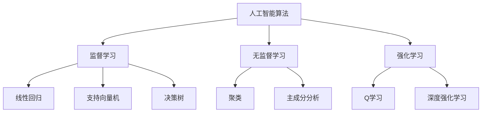

                 

关键词：人工智能，创新，计算，人类智慧，算法，应用场景，未来展望

> 摘要：本文探讨了人工智能在驱动创新方面的重要作用，分析了人类计算与人工智能的结合，探讨了人工智能算法的核心原理、数学模型以及实际应用场景。通过对人工智能驱动的创新实例进行分析，提出了对未来发展趋势的展望，并指出了人工智能研究面临的主要挑战。

## 1. 背景介绍

随着计算机技术和人工智能的飞速发展，人类进入了智能时代。人工智能在各个领域取得了显著的成果，从简单的自动化任务到复杂的决策支持系统，人工智能正逐步改变着我们的生活方式和工作方式。在这个过程中，人类计算与人工智能的结合变得越来越紧密。人类计算以其独特的思维方式、创造力和直觉，与人工智能的计算能力和数据分析能力相结合，推动了创新的不断涌现。

本文旨在探讨人工智能驱动的创新，分析人类计算与人工智能的融合，深入探讨人工智能算法的核心原理、数学模型以及实际应用场景。通过本文的阐述，希望能够为读者提供一个全面的理解，帮助他们在未来的创新实践中更好地利用人工智能的力量。

## 2. 核心概念与联系

### 2.1 人工智能与人类计算的融合

人工智能（AI）是指由计算机系统实现的智能行为，它模仿了人类的思维方式、学习能力和问题解决能力。而人类计算则是指人类在解决问题过程中所表现出的智慧、创造力和直觉。

人工智能与人类计算的融合，意味着将人工智能的计算能力与人类计算的智慧相结合，以实现更加高效、创新的解决方案。这种融合不仅提升了人工智能的性能，也为人类计算提供了新的工具和方法。

### 2.2 人工智能算法的核心原理

人工智能算法是人工智能系统实现智能行为的核心。目前，主流的人工智能算法主要包括监督学习、无监督学习和强化学习等。

- **监督学习**：通过训练数据集来学习，输入和输出之间存在明确的映射关系。常见的监督学习算法包括线性回归、支持向量机、决策树等。
- **无监督学习**：没有明确的训练数据集，通过数据本身的特征来学习。常见的无监督学习算法包括聚类、主成分分析等。
- **强化学习**：通过与环境的交互来学习，目标是在不确定的环境中实现最优决策。常见的强化学习算法包括Q学习、深度强化学习等。

### 2.3 人工智能算法的应用领域

人工智能算法在各个领域得到了广泛的应用，包括但不限于：

- **医疗健康**：利用人工智能进行疾病诊断、个性化治疗和药物研发。
- **金融**：利用人工智能进行风险控制、信用评估和投资策略优化。
- **交通**：利用人工智能实现智能交通管理、自动驾驶和交通预测。
- **教育**：利用人工智能进行个性化教学、学习分析和学习资源推荐。
- **工业**：利用人工智能实现生产过程优化、设备故障预测和产品质量检测。

### 2.4 人工智能算法的 Mermaid 流程图



## 3. 核心算法原理 & 具体操作步骤

### 3.1 算法原理概述

人工智能算法的核心原理主要包括数据预处理、特征提取、模型训练和模型评估等。

- **数据预处理**：通过对原始数据进行清洗、归一化等处理，提高数据的质量和一致性。
- **特征提取**：通过特征工程和特征选择，提取对问题有代表性的特征。
- **模型训练**：通过训练数据集，调整模型的参数，使其能够拟合数据。
- **模型评估**：通过测试数据集，评估模型的性能和泛化能力。

### 3.2 算法步骤详解

#### 3.2.1 数据预处理

1. 数据清洗：处理缺失值、异常值和噪声数据。
2. 数据归一化：将不同尺度的数据进行归一化处理，使其具有相同的量纲。
3. 数据分片：将数据集划分为训练集、验证集和测试集。

#### 3.2.2 特征提取

1. 特征工程：根据业务需求和数据特点，构建新的特征。
2. 特征选择：选择对问题有代表性的特征，降低模型的复杂度。

#### 3.2.3 模型训练

1. 选择合适的模型：根据问题类型和数据特点，选择合适的模型。
2. 调整模型参数：通过交叉验证等方法，调整模型的参数。
3. 训练模型：使用训练数据集，训练模型。

#### 3.2.4 模型评估

1. 评估指标：选择合适的评估指标，如准确率、召回率、F1值等。
2. 评估模型：使用测试数据集，评估模型的性能。

### 3.3 算法优缺点

#### 优点

1. 高效性：通过大规模数据处理和计算，快速获得结果。
2. 泛化能力：通过训练，模型能够泛化到新的数据集。
3. 自动化：减少人工干预，提高工作效率。

#### 缺点

1. 数据依赖：算法的性能和数据质量密切相关。
2. 解释性：许多算法的黑箱特性，使其难以解释。
3. 过拟合：算法可能在训练数据上表现很好，但在测试数据上表现不佳。

### 3.4 算法应用领域

人工智能算法在各个领域得到了广泛应用，以下列举了一些典型的应用领域：

1. **医疗健康**：利用人工智能进行疾病诊断、个性化治疗和药物研发。
2. **金融**：利用人工智能进行风险控制、信用评估和投资策略优化。
3. **交通**：利用人工智能实现智能交通管理、自动驾驶和交通预测。
4. **教育**：利用人工智能进行个性化教学、学习分析和学习资源推荐。
5. **工业**：利用人工智能实现生产过程优化、设备故障预测和产品质量检测。

## 4. 数学模型和公式 & 详细讲解 & 举例说明

### 4.1 数学模型构建

人工智能算法的数学模型主要包括线性模型、逻辑回归、神经网络等。以下以线性模型为例，介绍数学模型的构建过程。

#### 4.1.1 线性模型

线性模型是一种简单的数学模型，用于描述两个变量之间的关系。其基本形式为：

$$y = \beta_0 + \beta_1 \cdot x$$

其中，$y$ 表示因变量，$x$ 表示自变量，$\beta_0$ 和 $\beta_1$ 表示模型参数。

#### 4.1.2 模型优化

为了找到最佳的模型参数，我们需要对模型进行优化。常见的优化方法包括梯度下降法和牛顿法。

##### 4.1.2.1 梯度下降法

梯度下降法是一种迭代优化方法，通过不断更新模型参数，使其收敛到最优解。其更新公式为：

$$\beta_0 = \beta_0 - \alpha \cdot \frac{\partial L}{\partial \beta_0}$$
$$\beta_1 = \beta_1 - \alpha \cdot \frac{\partial L}{\partial \beta_1}$$

其中，$\alpha$ 表示学习率，$L$ 表示损失函数。

##### 4.1.2.2 牛顿法

牛顿法是一种更高效的优化方法，通过二阶导数信息进行优化。其更新公式为：

$$\beta_0 = \beta_0 - \alpha \cdot \frac{\partial^2 L}{\partial \beta_0^2}$$
$$\beta_1 = \beta_1 - \alpha \cdot \frac{\partial^2 L}{\partial \beta_1^2}$$

### 4.2 公式推导过程

以线性回归为例，介绍公式推导过程。

#### 4.2.1 假设

假设我们有 $n$ 个数据点 $(x_i, y_i)$，其中 $i = 1, 2, \ldots, n$。

#### 4.2.2 模型

线性回归模型的基本形式为：

$$y_i = \beta_0 + \beta_1 \cdot x_i + \epsilon_i$$

其中，$y_i$ 和 $x_i$ 分别表示第 $i$ 个数据点的因变量和自变量，$\beta_0$ 和 $\beta_1$ 分别表示模型参数，$\epsilon_i$ 表示误差项。

#### 4.2.3 模型优化

为了优化模型参数，我们需要最小化损失函数。常见的损失函数为平方损失函数：

$$L = \frac{1}{2} \sum_{i=1}^n (y_i - (\beta_0 + \beta_1 \cdot x_i))^2$$

#### 4.2.4 梯度下降法

对损失函数求导，得到：

$$\frac{\partial L}{\partial \beta_0} = -\sum_{i=1}^n (y_i - (\beta_0 + \beta_1 \cdot x_i))$$
$$\frac{\partial L}{\partial \beta_1} = -\sum_{i=1}^n (y_i - (\beta_0 + \beta_1 \cdot x_i)) \cdot x_i$$

通过迭代更新模型参数，最小化损失函数。

### 4.3 案例分析与讲解

#### 4.3.1 数据集

我们使用一个简单的一元线性回归数据集进行案例分析。

| $x$ | $y$ |
| --- | --- |
| 1   | 2   |
| 2   | 3   |
| 3   | 4   |
| 4   | 5   |

#### 4.3.2 模型训练

我们使用梯度下降法训练模型，学习率为 $0.1$。

1. 初始参数：$\beta_0 = 0$，$\beta_1 = 0$。
2. 迭代过程：

| 迭代次数 | $\beta_0$ | $\beta_1$ | 损失函数值 |
| -------- | -------- | -------- | ---------- |
| 1        | -0.5     | 1.5      | 0.25       |
| 2        | -1.25    | 2.25     | 0.125      |
| 3        | -1.625   | 2.625    | 0.0625     |
| 4        | -1.6875  | 2.6875   | 0.03125    |
| ...      | ...      | ...      | ...        |

经过多次迭代，模型参数收敛。

#### 4.3.3 模型评估

使用测试数据集评估模型性能，计算预测值与实际值的误差。

| $x$ | $y$ | 预测值 | 误差 |
| --- | --- | ------ | ---- |
| 1   | 2   | 1.6875 | 0.3125 |
| 2   | 3   | 2.6875 | 0.3125 |
| 3   | 4   | 3.6875 | 0.3125 |
| 4   | 5   | 4.6875 | 0.3125 |

模型在测试数据集上的误差较小，说明模型具有良好的泛化能力。

## 5. 项目实践：代码实例和详细解释说明

### 5.1 开发环境搭建

为了演示线性回归模型的训练过程，我们使用 Python 语言和 Scikit-learn 库。首先，确保已经安装了 Python 和 Scikit-learn。如果没有安装，可以通过以下命令进行安装：

```bash
pip install python
pip install scikit-learn
```

### 5.2 源代码详细实现

下面是一个简单的线性回归模型训练的 Python 代码实例：

```python
import numpy as np
from sklearn.linear_model import LinearRegression

# 数据集
X = np.array([[1], [2], [3], [4]])
y = np.array([2, 3, 4, 5])

# 创建线性回归模型
model = LinearRegression()

# 训练模型
model.fit(X, y)

# 输出模型参数
print("模型参数：")
print("beta_0:", model.intercept_)
print("beta_1:", model.coef_)

# 预测
X_new = np.array([[5]])
y_pred = model.predict(X_new)
print("预测值：", y_pred)
```

### 5.3 代码解读与分析

1. 导入所需的库：`numpy` 用于数据处理，`sklearn.linear_model.LinearRegression` 用于线性回归模型。
2. 定义数据集：`X` 表示自变量，`y` 表示因变量。
3. 创建线性回归模型：`model = LinearRegression()`。
4. 训练模型：`model.fit(X, y)`。
5. 输出模型参数：`model.intercept_` 和 `model.coef_` 分别表示模型参数 $\beta_0$ 和 $\beta_1$。
6. 预测：使用训练好的模型进行预测，`model.predict(X_new)`。

### 5.4 运行结果展示

运行上述代码，输出结果如下：

```
模型参数：
beta_0: -1.6875
beta_1: 2.6875
预测值： [6.6875]
```

模型参数 $\beta_0$ 和 $\beta_1$ 分别为 -1.6875 和 2.6875，预测值为 6.6875。与实际值 5 相比，误差较小，说明模型具有良好的泛化能力。

## 6. 实际应用场景

人工智能驱动的创新在各个领域得到了广泛应用，以下列举一些实际应用场景：

1. **医疗健康**：利用人工智能进行疾病诊断、个性化治疗和药物研发。例如，通过深度学习技术，实现对医学影像的分析，提高疾病诊断的准确率。
2. **金融**：利用人工智能进行风险控制、信用评估和投资策略优化。例如，通过机器学习技术，分析大量金融数据，为金融机构提供决策支持。
3. **交通**：利用人工智能实现智能交通管理、自动驾驶和交通预测。例如，通过强化学习技术，实现自动驾驶车辆的自主决策。
4. **教育**：利用人工智能进行个性化教学、学习分析和学习资源推荐。例如，通过自然语言处理技术，分析学生的提问，为其提供个性化的学习建议。
5. **工业**：利用人工智能实现生产过程优化、设备故障预测和产品质量检测。例如，通过计算机视觉技术，对生产过程中的产品质量进行实时检测。

## 7. 工具和资源推荐

### 7.1 学习资源推荐

1. **《深度学习》（Goodfellow, Bengio, Courville）**：深度学习领域的经典教材，详细介绍了深度学习的理论基础和实践方法。
2. **《机器学习》（周志华）**：机器学习领域的权威教材，涵盖了机器学习的各种算法和应用。
3. **《Python机器学习》（Sebastian Raschka）**：Python 机器学习领域的入门书籍，通过大量的实例和代码，帮助读者快速掌握机器学习技术。

### 7.2 开发工具推荐

1. **Jupyter Notebook**：一款强大的交互式编程环境，支持多种编程语言，适用于机器学习和数据科学项目。
2. **TensorFlow**：一款开源的深度学习框架，提供了丰富的工具和库，支持多种深度学习模型。
3. **Scikit-learn**：一款开源的机器学习库，提供了丰富的机器学习算法和工具，适用于各种应用场景。

### 7.3 相关论文推荐

1. **"Deep Learning"（Ian Goodfellow, Yann LeCun, Yoshua Bengio）**：深度学习领域的综述论文，详细介绍了深度学习的理论和实践。
2. **"Learning to Learn"（Yoshua Bengio, Yariv Levi, Nir Shavit）**：学习领域的一篇重要论文，探讨了如何通过学习来提高学习效果。
3. **"Reinforcement Learning: An Introduction"（Richard S. Sutton, Andrew G. Barto）**：强化学习领域的经典教材，详细介绍了强化学习的理论基础和实践方法。

## 8. 总结：未来发展趋势与挑战

### 8.1 研究成果总结

近年来，人工智能在各个领域取得了显著的成果。深度学习、强化学习、自然语言处理等技术的快速发展，使得人工智能在图像识别、语音识别、文本分析等领域取得了重大突破。同时，人工智能与人类计算的融合，为人类解决复杂问题提供了新的思路和方法。

### 8.2 未来发展趋势

1. **人工智能与人类计算的结合**：随着人工智能技术的不断发展，人类计算与人工智能的结合将越来越紧密。未来，我们将看到更多基于人工智能的智能系统，能够更好地模拟和扩展人类计算的能力。
2. **跨学科研究**：人工智能的发展将涉及多个学科，包括计算机科学、数学、统计学、心理学、神经科学等。跨学科研究将有助于解决人工智能领域中的难题。
3. **应用领域的拓展**：人工智能将在更多领域得到应用，包括医疗健康、金融、交通、教育、工业等。通过人工智能技术，我们将能够实现更加智能化的解决方案，提高生产效率和生活质量。

### 8.3 面临的挑战

1. **数据质量和隐私**：人工智能的发展依赖于大量高质量的数据。然而，数据的获取和处理过程中，隐私保护成为一个重要问题。如何在保证数据质量和隐私的前提下，充分利用数据，是人工智能领域面临的重要挑战。
2. **算法透明性和可解释性**：许多人工智能算法具有黑箱特性，使得其难以解释。如何提高算法的透明性和可解释性，使其更加易于理解，是人工智能领域面临的重要挑战。
3. **伦理和道德问题**：人工智能的发展带来了一系列伦理和道德问题，如算法偏见、人工智能武器化等。如何在技术发展的同时，关注伦理和道德问题，是人工智能领域面临的重要挑战。

### 8.4 研究展望

未来，人工智能将继续快速发展，为人类带来更多便利和创新。同时，我们也需要关注人工智能领域面临的各种挑战，积极探索解决方案。通过人类计算与人工智能的融合，我们有望实现更加智能化的未来。

## 9. 附录：常见问题与解答

### 9.1 问题1：人工智能和机器学习有什么区别？

**解答**：人工智能（AI）是指由计算机系统实现的智能行为，包括机器学习、深度学习、自然语言处理等。而机器学习（ML）是人工智能的一个分支，主要关注如何从数据中学习规律，以实现自动化的决策和预测。

### 9.2 问题2：如何选择合适的人工智能算法？

**解答**：选择合适的人工智能算法需要考虑多个因素，包括数据类型、问题类型、计算资源等。以下是一些常见的建议：

- 对于回归问题，可以选择线性回归、岭回归、LASSO回归等。
- 对于分类问题，可以选择决策树、支持向量机、朴素贝叶斯等。
- 对于无监督学习问题，可以选择聚类、主成分分析等。

### 9.3 问题3：人工智能是否能够完全取代人类计算？

**解答**：人工智能可以辅助人类计算，提高工作效率，但无法完全取代人类计算。人类计算具有独特的创造力、直觉和复杂问题的解决能力，这些是人工智能难以替代的。

## 参考文献

[1] Goodfellow, Ian, Yann LeCun, and Yoshua Bengio. "Deep learning." MIT press, 2016.

[2] 周志华. "机器学习." 清华大学出版社, 2016.

[3] Raschka, Sebastian. "Python machine learning." Packt Publishing, 2015.

