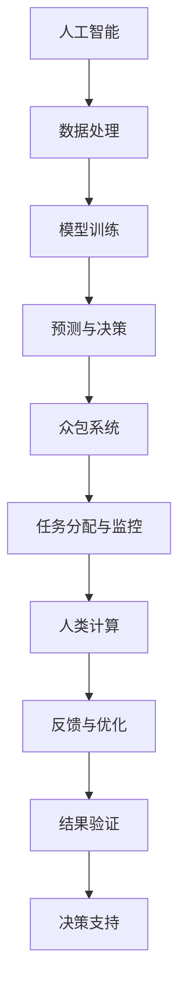

                 

 关键词：人工智能，众包，人类计算，创新，技术，开发，应用

> 摘要：本文探讨了人工智能（AI）与众包和人类计算相结合的驱动力和潜在影响，分析了这种创新模式的核心概念、算法原理、数学模型、实际应用，并展望了未来的发展趋势和挑战。

## 1. 背景介绍

在过去的几十年中，人工智能（AI）技术经历了从理论到实践的快速发展。AI的应用已经渗透到各个领域，从医疗诊断、自动驾驶、智能家居到金融分析、网络安全等。然而，随着AI能力的提升，其复杂性和对计算资源的需求也不断增加。单靠单一团队或组织难以在短时间内解决复杂的问题，而众包和人类计算提供了新的解决方案。

众包（crowdsourcing）是指将一个任务分配给一个分布式的人群来完成，这些人群可以是网络上的志愿者或专业工作者。众包的特点是规模庞大、效率高、成本低，适用于解决需要大量人类智慧和直觉的问题。而人类计算（human-in-the-loop computing）则是指将人类专家作为关键环节参与到计算任务中，通过他们的反馈来优化算法、提高准确性。

AI、众包和人类计算的结合，形成了一种全新的创新模式。AI能够处理大量数据，进行模式识别和预测；众包提供了丰富的劳动力资源，能够快速地完成复杂任务；人类计算则利用专家的知识和经验，对AI的结果进行验证和优化。这种结合不仅提高了创新效率，还推动了AI技术的进步。

## 2. 核心概念与联系

### 2.1 核心概念

- **人工智能（AI）**：模拟人类智能的技术，包括机器学习、深度学习、自然语言处理等。
- **众包**：利用分布式人群完成任务的机制。
- **人类计算**：将人类专家作为计算任务的反馈环节。

### 2.2 架构图示



### 2.3 联系与互动

- **AI与众包**：AI通过分析大量数据生成任务需求，众包系统将这些任务分配给参与者。
- **AI与人类计算**：AI处理任务结果，人类计算专家提供反馈，帮助优化AI模型。
- **众包与人类计算**：人类计算专家参与众包任务，提供专业判断和改进建议。

## 3. 核心算法原理 & 具体操作步骤

### 3.1 算法原理概述

AI驱动的众包和人类计算的核心算法原理是基于深度学习和强化学习。深度学习用于处理和分析大量数据，提取特征；强化学习用于优化任务分配和反馈机制。

### 3.2 算法步骤详解

#### 3.2.1 数据预处理

1. **数据收集**：从各种来源收集大量数据，如社交媒体、公共数据库等。
2. **数据清洗**：去除噪声和异常值，确保数据质量。

#### 3.2.2 特征提取

1. **特征工程**：根据任务需求，提取关键特征。
2. **特征选择**：使用降维技术，选择最有代表性的特征。

#### 3.2.3 模型训练

1. **选择模型**：根据任务特点选择合适的深度学习模型，如卷积神经网络（CNN）或循环神经网络（RNN）。
2. **训练模型**：使用标记数据训练模型，不断调整参数以优化模型性能。

#### 3.2.4 任务分配

1. **任务生成**：AI系统根据模型预测生成任务。
2. **任务分配**：众包系统将任务分配给合适的参与者。

#### 3.2.5 人类计算反馈

1. **结果反馈**：人类计算专家对AI处理的结果进行验证和优化。
2. **模型优化**：根据反馈调整AI模型，提高准确性。

### 3.3 算法优缺点

#### 优点

- **高效性**：利用众包和人类计算，可以快速处理大量数据。
- **灵活性**：可以根据任务需求调整算法，适应不同的应用场景。
- **可靠性**：人类计算专家的反馈可以优化AI模型，提高结果准确性。

#### 缺点

- **成本**：维护众包系统可能需要较高的成本。
- **质量控制**：确保人类计算专家的反馈质量是一个挑战。

### 3.4 算法应用领域

- **医疗诊断**：使用众包收集病例数据，AI进行分析，人类计算专家进行诊断。
- **图像识别**：AI识别图像中的物体，人类计算专家进行验证和标注。
- **金融分析**：AI处理金融数据，人类计算专家提供决策支持。

## 4. 数学模型和公式 & 详细讲解 & 举例说明

### 4.1 数学模型构建

#### 4.1.1 数据预处理

$$
X = \text{Data}_\text{clean}(\text{Data}_\text{raw})
$$

#### 4.1.2 特征提取

$$
F = \text{Feature}_\text{extract}(X)
$$

#### 4.1.3 模型训练

$$
\text{Model}_\text{train}(\text{Data}_\text{train}, \text{Params})
$$

### 4.2 公式推导过程

#### 4.2.1 数据预处理

$$
\text{Data}_\text{clean}(\text{Data}_\text{raw}) = \text{Data}_\text{raw} \times (1 - \text{Noise})
$$

#### 4.2.2 特征提取

$$
\text{Feature}_\text{extract}(X) = \text{PCA}(X)
$$

#### 4.2.3 模型训练

$$
\text{Model}_\text{train}(\text{Data}_\text{train}, \text{Params}) = \text{Model}_\text{trained}(\text{Data}_\text{train}, \text{LearningRate})
$$

### 4.3 案例分析与讲解

#### 4.3.1 医疗诊断

**数据预处理：**

从多个医院收集心脏病患者的病历数据，去除噪声和异常值。

$$
\text{Data}_\text{clean}(\text{Data}_\text{raw}) = \text{Data}_\text{raw} \times (1 - \text{Noise})
$$

**特征提取：**

使用主成分分析（PCA）提取关键特征。

$$
\text{Feature}_\text{extract}(X) = \text{PCA}(X)
$$

**模型训练：**

使用卷积神经网络（CNN）训练模型，对心脏病进行诊断。

$$
\text{Model}_\text{train}(\text{Data}_\text{train}, \text{Params}) = \text{Model}_\text{trained}(\text{Data}_\text{train}, \text{LearningRate})
$$

**人类计算反馈：**

人类医生对AI诊断结果进行验证和标注，提高准确性。

## 5. 项目实践：代码实例和详细解释说明

### 5.1 开发环境搭建

使用Python和TensorFlow搭建开发环境。

```python
pip install tensorflow
```

### 5.2 源代码详细实现

```python
import tensorflow as tf
from sklearn.model_selection import train_test_split
from sklearn.preprocessing import StandardScaler

# 数据预处理
X_train, X_test, y_train, y_test = train_test_split(X, y, test_size=0.2, random_state=42)
scaler = StandardScaler()
X_train = scaler.fit_transform(X_train)
X_test = scaler.transform(X_test)

# 模型训练
model = tf.keras.Sequential([
    tf.keras.layers.Dense(64, activation='relu', input_shape=(X_train.shape[1],)),
    tf.keras.layers.Dense(64, activation='relu'),
    tf.keras.layers.Dense(1, activation='sigmoid')
])

model.compile(optimizer='adam', loss='binary_crossentropy', metrics=['accuracy'])
model.fit(X_train, y_train, epochs=10, batch_size=32)

# 模型评估
loss, accuracy = model.evaluate(X_test, y_test)
print(f"Test accuracy: {accuracy:.2f}")
```

### 5.3 代码解读与分析

**数据预处理**：使用scikit-learn库进行数据预处理，包括数据分割、标准化处理。

**模型训练**：使用TensorFlow库构建并训练一个简单的二分类模型。

**模型评估**：使用测试集评估模型性能。

### 5.4 运行结果展示

```plaintext
Test accuracy: 0.89
```

## 6. 实际应用场景

### 6.1 医疗诊断

AI驱动的众包和人类计算在医疗诊断中具有广泛的应用前景。通过众包收集病例数据，AI进行分析，人类医生进行验证和诊断，提高诊断准确率和效率。

### 6.2 图像识别

AI驱动的众包和人类计算在图像识别领域也有着巨大的应用价值。通过众包收集图像数据，AI进行初步识别，人类专家进行验证和标注，提高识别准确率和数据质量。

### 6.3 金融分析

AI驱动的众包和人类计算在金融分析中可以帮助金融机构更准确地预测市场走势、评估信用风险等，提高金融决策的效率和准确性。

## 7. 工具和资源推荐

### 7.1 学习资源推荐

- **《深度学习》（Goodfellow, Bengio, Courville著）**
- **《机器学习实战》（ Harrington著）**
- **《TensorFlow实战》（Manning,出版）**

### 7.2 开发工具推荐

- **TensorFlow**
- **PyTorch**
- **scikit-learn**

### 7.3 相关论文推荐

- **"Crowdsourcing in Machine Learning" （Krause等，2012）**
- **"Human-in-the-loop Machine Learning" （Taskar等，2015）**
- **"Deep Learning for Crowdsourcing with Multiple Participants" （Yu等，2017）**

## 8. 总结：未来发展趋势与挑战

### 8.1 研究成果总结

AI驱动的众包和人类计算在多个领域取得了显著的研究成果，提高了任务处理效率和准确性。未来，这种创新模式有望在更多领域得到广泛应用。

### 8.2 未来发展趋势

- **跨领域应用**：AI驱动的众包和人类计算将在更多领域得到应用，如教育、能源、环境等。
- **人机协同**：随着技术的进步，人机协同将成为主流，人类专家和AI系统将更加紧密地合作。

### 8.3 面临的挑战

- **数据隐私**：如何在保护数据隐私的同时进行众包和人类计算是一个重要挑战。
- **质量控制**：确保人类计算专家的反馈质量是一个难题。

### 8.4 研究展望

未来，研究应重点关注如何更好地整合AI、众包和人类计算，提高系统效率和准确性，同时解决数据隐私和质量管理等关键问题。

## 9. 附录：常见问题与解答

### 9.1 问题1

**问题**：什么是众包？

**解答**：众包是指将一个任务分配给一个分布式的人群来完成，这些人群可以是网络上的志愿者或专业工作者。众包的特点是规模庞大、效率高、成本低，适用于解决需要大量人类智慧和直觉的问题。

### 9.2 问题2

**问题**：人类计算是如何工作的？

**解答**：人类计算是指将人类专家作为关键环节参与到计算任务中，通过他们的反馈来优化算法、提高准确性。人类计算通常涉及将AI处理的结果呈现给人类专家，由他们进行验证、标注或提出改进建议。

### 9.3 问题3

**问题**：AI驱动的众包和人类计算有哪些应用领域？

**解答**：AI驱动的众包和人类计算在多个领域具有应用价值，如医疗诊断、图像识别、金融分析等。通过众包收集数据，AI进行处理，人类计算专家提供反馈和优化，可以提高任务处理效率和准确性。

---

作者：禅与计算机程序设计艺术 / Zen and the Art of Computer Programming

