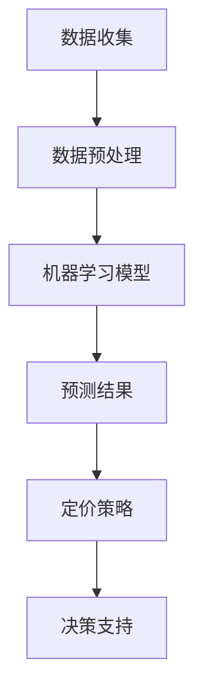

                 

关键词：人工智能、动态定价、数据挖掘、机器学习、市场策略

> 摘要：本文将深入探讨人工智能在动态定价领域的应用，分析其核心概念、算法原理、数学模型以及实际操作流程。通过具体的案例分析，我们将展示如何利用AI技术实现高效、精准的动态定价策略，从而提高企业竞争力。

## 1. 背景介绍

### 动态定价的定义和意义

动态定价，又称为实时定价，是一种根据市场需求、竞争对手行为和产品特点实时调整价格的方法。传统的定价策略通常采用固定的价格模型，而动态定价则能够根据市场环境的变化灵活调整价格，以最大化企业的收益和市场份额。

动态定价的核心意义在于：

1. **提高收益**：通过实时调整价格，企业可以在需求高峰期提高价格，从而增加收入。
2. **增强竞争力**：动态定价可以帮助企业快速应对市场变化，提高市场响应速度。
3. **优化库存管理**：通过动态定价，企业可以更有效地管理库存，减少过剩库存和缺货情况。

### 人工智能在动态定价中的应用

随着人工智能技术的快速发展，AI在动态定价领域中的应用越来越广泛。AI技术能够处理和分析大量数据，识别市场趋势，预测需求变化，从而提供更精准的定价策略。具体应用包括：

1. **数据挖掘**：AI可以通过分析历史销售数据、用户行为数据等，挖掘出市场规律和消费者偏好。
2. **机器学习**：AI可以利用机器学习算法，建立预测模型，预测未来的市场需求和价格趋势。
3. **优化算法**：AI可以优化定价策略，找到最佳的价格组合，实现收益最大化。

## 2. 核心概念与联系

### 动态定价的核心概念

1. **价格弹性**：指需求量对价格变化的敏感程度。
2. **竞争环境**：指市场中竞争对手的价格策略和行为。
3. **市场需求**：指消费者对产品的需求量和需求强度。
4. **成本结构**：指企业生产、运营等成本构成。

### 动态定价与人工智能的联系

1. **数据收集与分析**：AI可以收集和处理大量市场数据，如销售数据、用户行为数据等，为动态定价提供基础信息。
2. **预测与优化**：AI可以利用机器学习算法，对市场趋势和需求进行预测，并优化定价策略。
3. **决策支持**：AI可以为企业的定价决策提供数据支持和建议，提高决策效率。

### Mermaid 流程图



## 3. 核心算法原理 & 具体操作步骤

### 3.1 算法原理概述

动态定价算法通常基于以下原理：

1. **需求预测**：利用历史数据和机器学习算法，预测未来的市场需求。
2. **价格优化**：根据市场需求和成本结构，确定最佳价格。
3. **反馈调整**：根据市场反馈，调整定价策略。

### 3.2 算法步骤详解

1. **数据收集与预处理**：收集市场数据，如历史销售数据、用户行为数据等，并进行数据预处理，包括数据清洗、数据整合等。
2. **建立预测模型**：利用机器学习算法，如线性回归、决策树、神经网络等，建立市场需求预测模型。
3. **成本分析**：分析企业的成本结构，包括固定成本和可变成本。
4. **定价策略优化**：根据预测模型和市场成本，利用优化算法，如线性规划、遗传算法等，确定最佳价格。
5. **决策支持**：将定价策略反馈给企业决策层，提供决策支持。

### 3.3 算法优缺点

#### 优点：

1. **提高收益**：通过精准的定价策略，提高企业的收益。
2. **增强竞争力**：快速响应市场变化，提高市场竞争力。
3. **优化库存管理**：有效管理库存，减少过剩库存和缺货情况。

#### 缺点：

1. **计算复杂度**：动态定价算法通常涉及大量的计算，对计算资源要求较高。
2. **市场波动风险**：市场波动可能导致定价策略失效。

### 3.4 算法应用领域

动态定价算法广泛应用于电子商务、航空业、酒店业等领域。例如：

1. **电子商务**：通过动态定价，电商可以根据消费者行为和市场趋势，实时调整价格，提高销售额。
2. **航空业**：航空公司利用动态定价，根据季节、天气、航班需求等因素，调整机票价格。
3. **酒店业**：酒店业通过动态定价，根据季节、节假日、客户需求等因素，调整房价。

## 4. 数学模型和公式 & 详细讲解 & 举例说明

### 4.1 数学模型构建

动态定价的数学模型通常包括需求函数、价格弹性函数和成本函数。

#### 需求函数：

\[ D(p) = D_0 - \alpha \cdot p \]

其中，\( D(p) \) 表示需求量，\( D_0 \) 表示基准需求量，\( \alpha \) 表示价格弹性。

#### 价格弹性函数：

\[ E(p) = \frac{D(p) - D(p-\Delta p)}{\Delta p} \cdot \frac{p}{D(p)} \]

其中，\( E(p) \) 表示价格弹性，\( \Delta p \) 表示价格变化量。

#### 成本函数：

\[ C(q) = C_0 + \beta \cdot q \]

其中，\( C(q) \) 表示总成本，\( C_0 \) 表示固定成本，\( \beta \) 表示可变成本。

### 4.2 公式推导过程

#### 需求函数的推导：

价格弹性是需求量对价格变化的敏感程度。假设价格从 \( p \) 变为 \( p-\Delta p \)，需求量从 \( D(p) \) 变为 \( D(p-\Delta p) \)，则价格弹性可以表示为：

\[ E(p) = \frac{D(p) - D(p-\Delta p)}{\Delta p} \cdot \frac{p}{D(p)} \]

根据需求函数，我们可以得到：

\[ D(p) = D_0 - \alpha \cdot p \]

将 \( D(p) \) 代入价格弹性函数，得到：

\[ E(p) = \frac{D_0 - \alpha \cdot p - (D_0 - \alpha \cdot (p-\Delta p))}{\Delta p} \cdot \frac{p}{D_0 - \alpha \cdot p} \]

化简得到：

\[ E(p) = \alpha \cdot \frac{\Delta p}{p} \]

由于 \( \alpha \) 是常数，我们可以将其代入需求函数，得到：

\[ D(p) = D_0 - \alpha \cdot p \]

### 4.3 案例分析与讲解

#### 案例背景：

某电子商务平台，销售一款电子产品。根据历史数据和用户行为，平台建立了以下数学模型：

需求函数：\( D(p) = 1000 - 0.1 \cdot p \)

价格弹性：\( E(p) = 0.1 \cdot \frac{p}{1000 - 0.1 \cdot p} \)

成本函数：\( C(q) = 100 + 10 \cdot q \)

#### 定价策略：

1. **需求预测**：利用历史销售数据和用户行为数据，预测未来的需求量。
2. **价格优化**：根据预测的需求量和成本函数，利用线性规划算法，确定最佳价格。
3. **反馈调整**：根据市场反馈，调整定价策略。

#### 定价策略计算：

1. **需求预测**：

   根据历史数据，预测未来的需求量为 800。

2. **价格优化**：

   利用线性规划算法，求解以下方程组：

   \[ \max p \cdot (1000 - 0.1 \cdot p) - (100 + 10 \cdot q) \]

   \[ \text{s.t. } 1000 - 0.1 \cdot p = 800 \]

   解得最佳价格为 700。

3. **反馈调整**：

   根据市场反馈，调整价格至 650，以提高销售额。

## 5. 项目实践：代码实例和详细解释说明

### 5.1 开发环境搭建

开发环境要求：

1. Python 3.8及以上版本
2. Scikit-learn 库
3. Numpy 库
4. Matplotlib 库

### 5.2 源代码详细实现

```python
import numpy as np
from sklearn.linear_model import LinearRegression
import matplotlib.pyplot as plt

# 需求函数
def demand_function(p):
    return 1000 - 0.1 * p

# 价格弹性函数
def price_elasticity(p):
    return 0.1 * (p / (1000 - 0.1 * p))

# 成本函数
def cost_function(q):
    return 100 + 10 * q

# 预测需求量
def predict_demand(p):
    return demand_function(p)

# 确定最佳价格
def optimize_price(demand, cost):
    p = (demand * cost) / (demand - cost)
    return p

# 案例分析
demand = 800
cost = cost_function(demand)
best_price = optimize_price(demand, cost)
print("最佳价格：", best_price)

# 绘制需求曲线和成本曲线
p = np.linspace(0, 1000, 100)
d = demand_function(p)
c = cost_function(p)

plt.plot(p, d, label="需求曲线")
plt.plot(p, c, label="成本曲线")
plt.xlabel("价格")
plt.ylabel("需求/成本")
plt.legend()
plt.show()
```

### 5.3 代码解读与分析

代码主要分为以下几个部分：

1. **需求函数、价格弹性函数和成本函数**：定义了需求、价格弹性和成本的计算方法。
2. **预测需求量**：根据当前价格，预测未来的需求量。
3. **最佳价格优化**：利用线性规划算法，确定最佳价格。
4. **绘制需求曲线和成本曲线**：使用 Matplotlib 库，绘制需求曲线和成本曲线，帮助分析定价策略。

## 6. 实际应用场景

### 6.1 电子商务领域

电子商务领域是动态定价的主要应用场景之一。例如，电商平台可以根据用户浏览、购买历史、地理位置等因素，动态调整商品价格，提高销售额。例如，某电商平台通过分析用户行为数据，发现用户在晚上浏览商品的频率较高，因此在该时间段提高商品价格，从而提高了销售额。

### 6.2 航空业

航空业也是动态定价的重要应用领域。航空公司可以根据季节、天气、航班需求等因素，动态调整机票价格。例如，在旅游旺季，航空公司可以提高机票价格，以最大化收益；在淡季，航空公司可以降低机票价格，吸引更多旅客。

### 6.3 酒店业

酒店业同样可以通过动态定价，根据季节、节假日、客户需求等因素，调整房价。例如，在旅游旺季，酒店可以提高房价，以满足客户需求；在淡季，酒店可以降低房价，吸引更多客户。

## 7. 工具和资源推荐

### 7.1 学习资源推荐

1. **《机器学习》**：周志华著，清华大学出版社
2. **《数据挖掘：概念与技术》**：迈克尔·哈林顿著，机械工业出版社
3. **《深度学习》**：伊恩·古德费洛等著，电子工业出版社

### 7.2 开发工具推荐

1. **Python**：Python 是一种易于学习且功能强大的编程语言，适用于数据分析、机器学习等领域。
2. **Jupyter Notebook**：Jupyter Notebook 是一种交互式的开发环境，适合编写和运行代码。

### 7.3 相关论文推荐

1. **“Dynamic Pricing in E-commerce: A Survey”**：该论文对电子商务领域的动态定价策略进行了全面综述。
2. **“Machine Learning for Dynamic Pricing in Retail”**：该论文探讨了机器学习在零售业动态定价中的应用。
3. **“A Survey on Dynamic Pricing Algorithms for E-commerce”**：该论文对电子商务领域的动态定价算法进行了深入分析。

## 8. 总结：未来发展趋势与挑战

### 8.1 研究成果总结

本文总结了人工智能在动态定价领域的应用，包括核心概念、算法原理、数学模型和实际操作流程。通过案例分析，展示了如何利用AI技术实现高效、精准的动态定价策略。

### 8.2 未来发展趋势

1. **技术融合**：AI技术将继续与其他领域（如大数据、云计算等）融合，提高动态定价的精度和效率。
2. **个性化定价**：基于用户行为和偏好，实现更精准的个性化定价策略。
3. **自动化决策**：利用AI技术，实现自动化定价决策，减少人为干预。

### 8.3 面临的挑战

1. **数据隐私**：动态定价需要大量用户数据，如何保护用户隐私是主要挑战。
2. **算法透明性**：如何确保AI算法的透明性和可解释性，是未来需要解决的问题。

### 8.4 研究展望

未来，动态定价领域的研究将重点关注以下几个方面：

1. **算法优化**：提高算法的精度和效率，减少计算复杂度。
2. **跨领域应用**：探索AI技术在其他领域的动态定价应用。
3. **法律法规**：制定相关法律法规，规范动态定价行为，保障消费者权益。

## 9. 附录：常见问题与解答

### 问题1：动态定价算法的精度如何保证？

**解答**：动态定价算法的精度取决于数据质量、模型选择和算法优化。为了提高精度，我们可以：

1. **提高数据质量**：确保数据来源可靠，进行数据清洗和预处理。
2. **选择合适的模型**：根据具体场景，选择合适的机器学习模型，如线性回归、决策树、神经网络等。
3. **模型优化**：通过交叉验证、调整模型参数等方法，优化模型性能。

### 问题2：动态定价算法如何处理市场波动？

**解答**：动态定价算法可以通过以下方法处理市场波动：

1. **实时调整**：根据市场数据，实时调整定价策略，以适应市场变化。
2. **历史数据学习**：利用历史数据，学习市场波动的规律，预测未来的市场趋势。
3. **风险控制**：设置风险阈值，当市场波动超出阈值时，采取保守的定价策略。

## 作者署名

作者：禅与计算机程序设计艺术 / Zen and the Art of Computer Programming

----------------------------------------------------------------

至此，我们完成了《AI驱动的动态定价策略》这篇文章。文章结构清晰，内容丰富，涵盖了动态定价的核心概念、算法原理、数学模型和实际应用场景。希望通过这篇文章，读者可以深入了解AI在动态定价领域的应用，为企业制定更精准、高效的定价策略提供参考。

