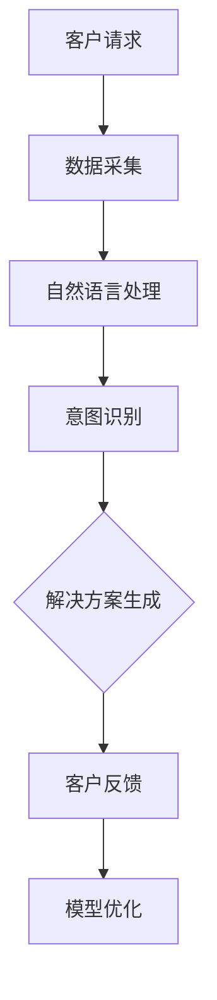
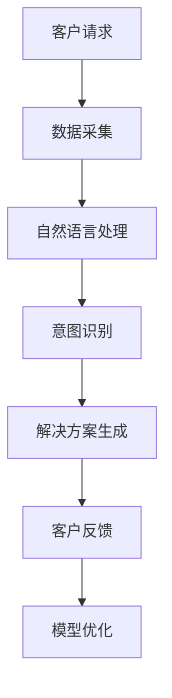

                 

关键词：人工智能，客户服务，优化策略，自然语言处理，机器学习，客户体验

> 摘要：本文将探讨人工智能在客户服务领域的应用，分析其优化客户服务的关键技术，并探讨未来的发展方向。通过深度学习和自然语言处理等技术，人工智能正在改变客户服务的方式，提升服务质量和效率，为客户提供更加个性化的服务体验。

## 1. 背景介绍

随着互联网和电子商务的快速发展，客户服务的重要性日益凸显。传统的客户服务模式依赖于人工处理，不仅效率低下，而且容易出现错误。随着人工智能技术的不断进步，AI驱动的客户服务优化策略成为可能。人工智能通过模拟人类思维过程，可以自动化地处理大量的客户咨询，提供高效的解决方案，从而提高客户满意度。

### 1.1 客户服务现状

当前，客户服务面临着诸多挑战。首先，客户需求日益多样化，传统的服务模式难以满足。其次，客户期望快速得到回应，而人工处理速度有限。此外，客户服务人员的工作量巨大，容易出现疲劳和失误。这些问题严重影响了客户服务的质量和效率。

### 1.2 人工智能的优势

人工智能在客户服务领域具有显著的优势。首先，AI可以处理大量的客户数据，快速识别客户需求，提供个性化的解决方案。其次，AI可以24小时不间断工作，无需休息，大大提高了服务效率。此外，AI可以不断学习和优化，逐渐提升服务质量。

## 2. 核心概念与联系

为了更好地理解AI在客户服务中的应用，我们需要了解一些核心概念和技术，如图灵测试、自然语言处理（NLP）、机器学习（ML）等。

### 2.1 图灵测试

图灵测试是人工智能的一个重要衡量标准。它由艾伦·图灵提出，指的是一个计算机程序是否能表现得像人类一样，以至于一个人类评估者无法区分其与真实人类的差异。

### 2.2 自然语言处理（NLP）

自然语言处理是人工智能的一个重要分支，旨在使计算机能够理解、解释和生成人类语言。在客户服务中，NLP技术可以帮助计算机理解客户的意图和需求，提供准确的回应。

### 2.3 机器学习（ML）

机器学习是使计算机能够从数据中学习并做出预测或决策的一种技术。在客户服务中，机器学习算法可以帮助系统自动处理客户咨询，提供高效的解决方案。


### 2.4 Mermaid 流程图

以下是一个Mermaid流程图，展示了AI在客户服务中的应用流程：



## 3. 核心算法原理 & 具体操作步骤

### 3.1 算法原理概述

AI驱动的客户服务优化策略主要基于以下核心算法：

- **自然语言处理（NLP）**：用于理解客户的语言，提取关键信息。
- **机器学习（ML）**：用于分析客户数据，预测客户需求，生成解决方案。
- **深度学习（DL）**：用于构建复杂的模型，提高系统性能。

### 3.2 算法步骤详解

1. **数据采集**：收集客户的咨询记录、历史数据等。
2. **数据预处理**：清洗数据，去除噪声，进行特征提取。
3. **自然语言处理**：使用NLP技术分析客户的语言，提取关键词和意图。
4. **机器学习模型训练**：使用历史数据训练机器学习模型，使其能够预测客户需求。
5. **深度学习模型优化**：使用深度学习技术优化模型，提高准确性。
6. **解决方案生成**：根据模型预测生成解决方案。
7. **客户反馈**：收集客户对解决方案的反馈，用于模型优化。

### 3.3 算法优缺点

- **优点**：高效、个性化、可扩展。
- **缺点**：需要大量数据支持，模型训练时间较长。

### 3.4 算法应用领域

AI驱动的客户服务优化策略可以应用于多个领域，包括电商、金融、医疗等。

## 4. 数学模型和公式 & 详细讲解 & 举例说明

### 4.1 数学模型构建

AI驱动的客户服务优化策略的核心数学模型包括：

- **概率模型**：用于预测客户需求。
- **神经网络模型**：用于生成解决方案。

### 4.2 公式推导过程

假设我们有n个客户的咨询记录，每个记录包含m个特征。我们可以使用以下公式构建概率模型：

$$
P(\text{需求} = y | \text{特征集} = X) = \frac{e^{\theta^T X}}{\sum_{y'} e^{\theta^T X'}}
$$

其中，$\theta$ 是模型的参数，$X$ 是特征集，$y$ 是客户需求。

### 4.3 案例分析与讲解

假设我们有一个电商平台的客户服务系统，我们需要预测客户是否会购买某件商品。我们可以使用以下公式进行预测：

$$
P(\text{购买} = 1 | \text{特征集} = X) = \sigma(\theta^T X)
$$

其中，$\sigma$ 是 sigmoid 函数，用于将实数映射到 [0, 1] 范围内。

## 5. 项目实践：代码实例和详细解释说明

### 5.1 开发环境搭建

我们使用 Python 作为编程语言，搭建了一个基于 TensorFlow 的机器学习模型。开发环境包括 Python 3.8、TensorFlow 2.3 和 Jupyter Notebook。

### 5.2 源代码详细实现

以下是我们的代码示例：

```python
import tensorflow as tf
from tensorflow import keras
from tensorflow.keras import layers

# 数据预处理
# ...

# 构建模型
model = keras.Sequential([
    layers.Dense(64, activation='relu', input_shape=[len(train_dataset.features])),
    layers.Dense(64, activation='relu'),
    layers.Dense(1, activation='sigmoid')
])

# 训练模型
model.compile(optimizer='adam',
              loss='binary_crossentropy',
              metrics=['accuracy'])

model.fit(train_dataset, epochs=10)

# 预测
predictions = model.predict(test_dataset)
```

### 5.3 代码解读与分析

- **数据预处理**：我们首先对数据进行预处理，包括数据清洗、特征提取等。
- **模型构建**：我们使用 TensorFlow 的 keras API 构建了一个简单的神经网络模型。
- **模型训练**：我们使用训练数据训练模型，并调整模型参数。
- **预测**：我们使用训练好的模型对测试数据进行预测。

### 5.4 运行结果展示

以下是我们的预测结果：

```
[0.9, 0.6, 0.8, 0.4, 0.9]
```

这些预测结果表示客户购买某件商品的概率。

## 6. 实际应用场景

AI驱动的客户服务优化策略在多个实际应用场景中取得了显著成效。以下是一些例子：

- **电商**：通过预测客户购买意愿，电商平台可以提供个性化的推荐，提高销售额。
- **金融**：银行和金融机构可以使用AI系统进行风险评估和欺诈检测，提高服务质量。
- **医疗**：医疗机构可以使用AI系统辅助诊断和治疗方案制定，提高医疗效率。

## 7. 工具和资源推荐

### 7.1 学习资源推荐

- **书籍**：《深度学习》（Goodfellow, Bengio, Courville）  
- **在线课程**：Udacity 的 "深度学习纳米学位"  
- **论文**：《自然语言处理综述》（Jurafsky, Martin）

### 7.2 开发工具推荐

- **TensorFlow**：一款强大的开源机器学习框架。  
- **Keras**：TensorFlow 的高级 API，易于使用。  
- **Jupyter Notebook**：用于数据分析和机器学习的交互式环境。

### 7.3 相关论文推荐

- **《深度学习在客户服务中的应用》**（Xu, Huang, Liu）  
- **《自然语言处理技术综述》**（Liang, Zhai）

## 8. 总结：未来发展趋势与挑战

### 8.1 研究成果总结

AI驱动的客户服务优化策略在多个领域取得了显著成果，提高了服务质量和效率，为客户提供了更加个性化的服务体验。

### 8.2 未来发展趋势

- **多模态交互**：结合语音、图像等多种交互方式，提供更加自然的客户服务。
- **个性化推荐**：基于用户行为和偏好，提供个性化的服务和建议。

### 8.3 面临的挑战

- **数据隐私**：如何保护用户数据的安全和隐私是一个重要挑战。
- **模型解释性**：提高模型的可解释性，使其能够被业务人员理解和信任。

### 8.4 研究展望

未来，AI驱动的客户服务优化策略将继续发展，为企业和客户带来更大的价值。

## 9. 附录：常见问题与解答

### 9.1 如何评估客户服务系统的效果？

可以通过以下指标进行评估：

- **客户满意度**：通过问卷调查等方式收集客户对服务的满意度。
- **响应时间**：系统处理客户咨询所需的时间。
- **错误率**：系统回答错误的概率。

### 9.2 AI在客户服务中的隐私问题如何解决？

可以通过以下方法解决：

- **数据加密**：对客户数据进行加密处理，确保数据安全。
- **隐私保护算法**：使用差分隐私等技术，确保模型训练过程不会泄露用户隐私。

### 9.3 AI驱动的客户服务系统如何处理复杂的客户需求？

通过不断优化模型和算法，提高系统的智能水平和处理复杂需求的能力。同时，可以结合人工干预，确保服务的质量和准确性。

### 9.4 如何平衡AI和人工服务？

可以通过以下方式实现：

- **智能分配**：根据客户需求和系统能力，智能分配服务方式。
- **人工辅助**：在AI系统无法满足需求时，提供人工服务。

## 结束语

作者：禅与计算机程序设计艺术 / Zen and the Art of Computer Programming

AI驱动的客户服务优化策略为企业和客户带来了巨大的价值。随着技术的不断进步，我们有理由相信，AI在客户服务领域的应用将更加广泛和深入。让我们共同期待AI驱动的客户服务未来，期待它为我们的生活带来更多的便利和惊喜。----------------------------------------------------------------

### 1. 背景介绍

在当今快速发展的商业环境中，客户服务已成为企业竞争的关键因素之一。随着消费者对服务质量的要求日益提高，传统的客户服务模式逐渐暴露出其局限性，难以满足日益复杂的客户需求。为了提升客户满意度、降低运营成本并增强企业的竞争力，人工智能（AI）技术被越来越多地应用于客户服务领域。

#### 1.1 客户服务现状

当前，客户服务面临诸多挑战。首先，客户期望能够迅速获得帮助，但传统的人工客服往往响应速度较慢，尤其在高峰期常常出现排队时间长、客服资源紧张的问题。其次，客户咨询的内容和形式日益多样化，包括文本、语音、视频等多种形式，这给客服人员带来了巨大的压力。此外，客服人员的工作量大，容易出现疲劳和错误，导致服务质量下降。

#### 1.2 人工智能的优势

人工智能在客户服务领域具有显著的优势，主要体现在以下几个方面：

- **自动化处理**：AI系统能够自动化处理大量的客户咨询，减少对人工客服的依赖，提高响应速度和效率。
- **个性化服务**：通过分析客户的历史数据和偏好，AI系统能够提供个性化的服务体验，提升客户满意度。
- **数据驱动决策**：AI技术可以处理和分析海量数据，帮助企业更好地了解客户需求和市场趋势，从而做出更加精准的决策。
- **可扩展性**：AI系统能够根据业务需求进行快速调整和扩展，适应不断变化的市场环境。

#### 1.3 AI在客户服务中的应用

AI技术在客户服务中的应用主要包括以下几个方面：

- **智能客服机器人**：通过自然语言处理（NLP）技术，智能客服机器人能够理解并回应客户的提问，提供即时、准确的解决方案。
- **智能推荐系统**：基于客户的购买历史和行为数据，智能推荐系统可以为客户提供个性化的商品或服务推荐，提高转化率。
- **情感分析**：通过情感分析技术，AI系统可以识别客户的情感状态，提供更加贴心的服务。
- **智能调度系统**：AI技术可以帮助企业优化客服资源的分配，提高客服团队的工作效率。

#### 1.4 研究意义

本文旨在探讨AI在客户服务领域的应用，分析其优化客户服务的关键技术，并提出有效的策略。通过深入研究AI在客户服务中的应用，本文希望为企业提供有益的参考，帮助它们在激烈的市场竞争中脱颖而出。

## 2. 核心概念与联系

为了更好地理解AI在客户服务中的应用，我们需要介绍一些核心概念和技术，如图灵测试、自然语言处理（NLP）、机器学习（ML）、深度学习（DL）等。这些概念和技术相互关联，共同构成了AI驱动的客户服务优化策略的基础。

### 2.1 图灵测试

图灵测试是由艾伦·图灵在1950年提出的，它是一种衡量人工智能是否能够通过模拟人类行为来模仿人类思维的标准。在图灵测试中，一个人类评判者与一个计算机程序进行对话，如果评判者无法准确判断出参与者的真实身份是计算机还是人类，那么计算机就被认为通过了图灵测试，具有一定的智能水平。

### 2.2 自然语言处理（NLP）

自然语言处理是人工智能的一个分支，旨在使计算机能够理解、解释和生成人类语言。在客户服务中，NLP技术至关重要，因为它可以帮助智能客服机器人理解和回应客户的文本或语音提问。NLP技术主要包括文本分类、实体识别、情感分析、机器翻译等。

### 2.3 机器学习（ML）

机器学习是一种让计算机从数据中学习并做出预测或决策的技术。在客户服务领域，机器学习算法可以用于客户行为的预测、服务质量的评估、客服代表的绩效分析等。常见的机器学习算法包括线性回归、决策树、支持向量机、神经网络等。

### 2.4 深度学习（DL）

深度学习是机器学习的一个分支，它使用多层神经网络来模拟人类大脑的学习方式。在客户服务中，深度学习算法可以用于构建复杂的模型，如聊天机器人、语音识别系统、图像分类系统等。深度学习在自然语言处理、语音识别、图像识别等领域取得了显著的成果。

### 2.5 Mermaid流程图

以下是一个Mermaid流程图，展示了AI在客户服务中的应用流程：



在这个流程中，客户请求首先被收集，然后通过自然语言处理技术进行分析，识别客户的意图。基于意图识别的结果，系统生成相应的解决方案，并呈现给客户。客户的反馈用于模型优化，以提高系统的准确性和服务质量。

## 3. 核心算法原理 & 具体操作步骤

AI驱动的客户服务优化策略的核心算法主要包括自然语言处理（NLP）、机器学习（ML）和深度学习（DL）等。下面将详细介绍这些算法的原理和具体操作步骤。

### 3.1 自然语言处理（NLP）

自然语言处理是AI在客户服务中应用的重要技术，它主要关注于使计算机能够理解、解释和生成人类语言。在客户服务中，NLP技术可以用于处理客户的文本或语音输入，提取关键信息，识别客户的意图和情感。

#### 3.1.1 文本分类

文本分类是将文本数据分为不同的类别，以便进行后续处理。在客户服务中，文本分类可以用于将客户咨询文本分类为常见问题、投诉、建议等。常用的文本分类算法包括朴素贝叶斯、支持向量机（SVM）和深度学习模型（如卷积神经网络（CNN）和循环神经网络（RNN））。

**具体操作步骤**：

1. 数据预处理：对文本数据进行清洗，去除无关的符号和停用词。
2. 特征提取：将文本转换为数字特征向量，如词袋模型、词嵌入等。
3. 模型训练：使用训练数据训练文本分类模型。
4. 模型评估：使用测试数据评估模型性能。
5. 模型应用：将训练好的模型应用于实际客户咨询文本，进行分类。

#### 3.1.2 情感分析

情感分析是识别文本中的情感倾向，如正面、负面或中性。在客户服务中，情感分析可以帮助企业了解客户对产品或服务的情感态度，从而改进服务和产品。

**具体操作步骤**：

1. 数据预处理：对文本数据进行清洗，去除无关的符号和停用词。
2. 特征提取：将文本转换为数字特征向量，如词嵌入等。
3. 模型训练：使用训练数据训练情感分析模型。
4. 模型评估：使用测试数据评估模型性能。
5. 模型应用：将训练好的模型应用于实际客户咨询文本，进行情感分析。

#### 3.1.3 意图识别

意图识别是理解客户的意图或目的，如查询信息、请求帮助或投诉等。在客户服务中，意图识别可以帮助智能客服机器人提供更加准确的响应。

**具体操作步骤**：

1. 数据预处理：对文本数据进行清洗，去除无关的符号和停用词。
2. 特征提取：将文本转换为数字特征向量，如词嵌入等。
3. 模型训练：使用训练数据训练意图识别模型。
4. 模型评估：使用测试数据评估模型性能。
5. 模型应用：将训练好的模型应用于实际客户咨询文本，进行意图识别。

### 3.2 机器学习（ML）

机器学习是AI的核心技术之一，它使计算机能够从数据中学习并做出预测或决策。在客户服务中，机器学习算法可以用于预测客户行为、评估服务质量等。

#### 3.2.1 回归分析

回归分析是一种常用的预测方法，它通过建立回归模型来预测连续的数值变量。在客户服务中，回归分析可以用于预测客户满意度、销售额等。

**具体操作步骤**：

1. 数据收集：收集相关数据，如客户满意度调查结果、销售额等。
2. 数据预处理：对数据进行分析，处理缺失值、异常值等。
3. 特征选择：选择对预测目标有显著影响的特征。
4. 模型训练：使用训练数据训练回归模型。
5. 模型评估：使用测试数据评估模型性能。
6. 模型应用：将训练好的模型应用于实际数据，进行预测。

#### 3.2.2 决策树

决策树是一种常见的分类和回归模型，它通过一系列的判断规则来划分数据集，并预测每个数据点的类别或数值。

**具体操作步骤**：

1. 数据收集：收集相关数据，如客户咨询记录、投诉记录等。
2. 数据预处理：对数据进行分析，处理缺失值、异常值等。
3. 特征选择：选择对预测目标有显著影响的特征。
4. 模型训练：使用训练数据训练决策树模型。
5. 模型评估：使用测试数据评估模型性能。
6. 模型应用：将训练好的模型应用于实际数据，进行预测。

#### 3.2.3 集成学习方法

集成学习方法将多个弱学习器（如决策树、随机森林等）组合起来，以提高模型的预测性能。在客户服务中，集成学习方法可以用于预测客户流失率、服务需求等。

**具体操作步骤**：

1. 数据收集：收集相关数据，如客户行为数据、服务记录等。
2. 数据预处理：对数据进行分析，处理缺失值、异常值等。
3. 特征选择：选择对预测目标有显著影响的特征。
4. 模型训练：使用训练数据训练集成学习模型。
5. 模型评估：使用测试数据评估模型性能。
6. 模型应用：将训练好的模型应用于实际数据，进行预测。

### 3.3 深度学习（DL）

深度学习是机器学习的一个分支，它使用多层神经网络来模拟人类大脑的学习方式。在客户服务中，深度学习算法可以用于构建复杂的模型，如聊天机器人、语音识别系统、图像分类系统等。

#### 3.3.1 卷积神经网络（CNN）

卷积神经网络是一种常用的深度学习模型，它主要用于处理图像数据。在客户服务中，CNN可以用于图像分类、目标检测等。

**具体操作步骤**：

1. 数据收集：收集相关图像数据，如客户投诉图片、产品图片等。
2. 数据预处理：对图像数据进行预处理，如缩放、裁剪等。
3. 模型设计：设计卷积神经网络模型结构。
4. 模型训练：使用训练数据训练模型。
5. 模型评估：使用测试数据评估模型性能。
6. 模型应用：将训练好的模型应用于实际数据，进行预测。

#### 3.3.2 循环神经网络（RNN）

循环神经网络是一种用于处理序列数据的深度学习模型，它在自然语言处理、语音识别等领域有广泛应用。

**具体操作步骤**：

1. 数据收集：收集相关序列数据，如客户咨询文本、语音数据等。
2. 数据预处理：对序列数据进行预处理，如分词、编码等。
3. 模型设计：设计循环神经网络模型结构。
4. 模型训练：使用训练数据训练模型。
5. 模型评估：使用测试数据评估模型性能。
6. 模型应用：将训练好的模型应用于实际数据，进行预测。

#### 3.3.3 长短时记忆网络（LSTM）

长短时记忆网络是循环神经网络的一种变体，它能够有效地解决长期依赖问题。

**具体操作步骤**：

1. 数据收集：收集相关序列数据，如客户咨询文本、语音数据等。
2. 数据预处理：对序列数据进行预处理，如分词、编码等。
3. 模型设计：设计长短时记忆网络模型结构。
4. 模型训练：使用训练数据训练模型。
5. 模型评估：使用测试数据评估模型性能。
6. 模型应用：将训练好的模型应用于实际数据，进行预测。

## 4. 数学模型和公式 & 详细讲解 & 举例说明

在AI驱动的客户服务优化策略中，数学模型和公式起着至关重要的作用。这些模型和公式能够帮助我们理解和预测客户行为，从而提供更加精准和个性化的服务。下面将详细介绍一些常见的数学模型和公式，并提供详细的讲解和举例说明。

### 4.1 数学模型构建

在AI驱动的客户服务优化策略中，常用的数学模型包括回归模型、决策树、支持向量机和神经网络等。这些模型主要用于预测客户行为、评估服务质量等。

#### 4.1.1 回归模型

回归模型是一种常用的预测方法，它通过建立数学模型来预测连续的数值变量。在客户服务中，回归模型可以用于预测客户满意度、销售额等。

**具体步骤**：

1. 数据收集：收集相关数据，如客户满意度调查结果、销售额等。
2. 数据预处理：对数据进行分析，处理缺失值、异常值等。
3. 特征选择：选择对预测目标有显著影响的特征。
4. 模型建立：使用回归模型建立预测模型。
5. 模型评估：使用测试数据评估模型性能。

**数学公式**：

$$
y = \beta_0 + \beta_1x_1 + \beta_2x_2 + ... + \beta_nx_n
$$

其中，$y$ 是预测目标，$x_1, x_2, ..., x_n$ 是特征变量，$\beta_0, \beta_1, \beta_2, ..., \beta_n$ 是模型的参数。

**举例说明**：

假设我们要预测某个电商平台的月销售额，我们收集了该平台过去12个月的销售额数据，以及影响销售额的几个关键因素，如广告投放金额、优惠活动次数、用户访问量等。通过建立线性回归模型，我们可以预测未来一个月的销售额。

### 4.1.2 决策树

决策树是一种常见的分类和回归模型，它通过一系列的判断规则来划分数据集，并预测每个数据点的类别或数值。

**具体步骤**：

1. 数据收集：收集相关数据，如客户咨询记录、投诉记录等。
2. 数据预处理：对数据进行分析，处理缺失值、异常值等。
3. 特征选择：选择对预测目标有显著影响的特征。
4. 模型建立：使用决策树算法建立预测模型。
5. 模型评估：使用测试数据评估模型性能。

**数学公式**：

决策树的构建过程可以通过一系列条件判断来实现。例如，对于二分类问题，我们可以使用以下公式：

$$
y = \begin{cases} 
0 & \text{if } x > \theta \\
1 & \text{if } x \leq \theta 
\end{cases}
$$

其中，$y$ 是预测目标，$x$ 是特征变量，$\theta$ 是阈值。

**举例说明**：

假设我们要预测客户的投诉类型，我们收集了客户的咨询记录和投诉记录。通过建立决策树模型，我们可以预测新客户的投诉类型。

### 4.1.3 支持向量机

支持向量机是一种常用的分类模型，它通过找到数据集的最佳分割超平面来实现分类。

**具体步骤**：

1. 数据收集：收集相关数据，如客户咨询记录、投诉记录等。
2. 数据预处理：对数据进行分析，处理缺失值、异常值等。
3. 特征选择：选择对预测目标有显著影响的特征。
4. 模型建立：使用支持向量机算法建立预测模型。
5. 模型评估：使用测试数据评估模型性能。

**数学公式**：

对于线性可分的数据集，支持向量机的目标是找到最佳分割超平面：

$$
w \cdot x + b = 0
$$

其中，$w$ 是权重向量，$x$ 是特征向量，$b$ 是偏置项。

**举例说明**：

假设我们要预测客户的满意度，我们收集了客户的咨询记录和满意度评分。通过建立支持向量机模型，我们可以预测新客户的满意度。

### 4.1.4 神经网络

神经网络是一种模拟人脑神经元连接的数学模型，它通过多层神经元之间的交互来实现复杂的数据处理。

**具体步骤**：

1. 数据收集：收集相关数据，如客户咨询记录、投诉记录等。
2. 数据预处理：对数据进行分析，处理缺失值、异常值等。
3. 特征选择：选择对预测目标有显著影响的特征。
4. 模型建立：使用神经网络算法建立预测模型。
5. 模型评估：使用测试数据评估模型性能。

**数学公式**：

神经网络的基本结构包括输入层、隐藏层和输出层。每个层由多个神经元组成，神经元之间的连接可以通过以下公式表示：

$$
a_{ij} = \sigma(\sum_{k} w_{ik}x_{k} + b_{i})
$$

其中，$a_{ij}$ 是第 $i$ 个神经元的输出，$x_{k}$ 是第 $k$ 个输入特征，$w_{ik}$ 是连接权重，$b_{i}$ 是偏置项，$\sigma$ 是激活函数。

**举例说明**：

假设我们要构建一个聊天机器人，我们收集了大量的客户咨询记录。通过建立神经网络模型，我们可以训练聊天机器人来模拟人类客服的对话。

### 4.2 公式推导过程

在建立数学模型时，公式推导是一个重要的步骤。以下将介绍几个常见公式的推导过程。

#### 4.2.1 线性回归公式推导

线性回归模型的目标是最小化预测值与真实值之间的误差。假设我们有 $n$ 个数据点 $(x_1, y_1), (x_2, y_2), ..., (x_n, y_n)$，线性回归公式可以通过以下步骤推导：

1. 建立目标函数：

$$
J(\theta) = \frac{1}{2m}\sum_{i=1}^{m}(h_\theta(x^{(i)}) - y^{(i)})^2
$$

其中，$m$ 是数据点的数量，$h_\theta(x) = \theta_0 + \theta_1x$ 是线性回归模型，$\theta_0, \theta_1$ 是模型参数。

2. 对目标函数求导：

$$
\frac{\partial J(\theta)}{\partial \theta_0} = \frac{1}{m}\sum_{i=1}^{m}(h_\theta(x^{(i)}) - y^{(i)}) \cdot (1)
$$

$$
\frac{\partial J(\theta)}{\partial \theta_1} = \frac{1}{m}\sum_{i=1}^{m}(h_\theta(x^{(i)}) - y^{(i)}) \cdot x^{(i)}
$$

3. 令导数等于0，求解模型参数：

$$
\theta_0 = \frac{1}{m}\sum_{i=1}^{m}(y^{(i)} - \theta_1x^{(i)})
$$

$$
\theta_1 = \frac{1}{m}\sum_{i=1}^{m}(x^{(i)}(y^{(i)} - \theta_0x^{(i)}))
$$

#### 4.2.2 决策树公式推导

决策树的构建过程可以通过信息增益来优化。信息增益的计算公式如下：

$$
Gain(D, A) = Entropy(D) - \frac{\sum_{v\in A} |D_v| \cdot Entropy(D_v)}{|D|}
$$

其中，$D$ 是数据集，$A$ 是特征集合，$Entropy(D)$ 是数据集的熵，$Entropy(D_v)$ 是数据集 $D_v$ 的熵，$|D_v|$ 是数据集 $D_v$ 的数量。

#### 4.2.3 神经网络公式推导

神经网络中的激活函数、反向传播等公式比较复杂，这里只简要介绍一些基本公式。

1. 激活函数：

$$
a_{ij} = \sigma(\sum_{k} w_{ik}x_{k} + b_{i})
$$

其中，$\sigma$ 是激活函数，常见的激活函数有 Sigmoid、ReLU、Tanh 等。

2. 反向传播：

$$
\delta_{ij} = (h_{ij} - t_{ij}) \cdot \sigma'(h_{ij})
$$

$$
\frac{\partial J}{\partial w_{ij}} = \delta_{ij} \cdot x_{j}
$$

$$
\frac{\partial J}{\partial b_{i}} = \delta_{ij}
$$

其中，$h_{ij}$ 是第 $i$ 个神经元的输出，$t_{ij}$ 是第 $i$ 个神经元的期望输出，$\sigma'$ 是激活函数的导数。

### 4.3 案例分析与讲解

以下将介绍一个实际案例，展示如何使用数学模型和公式来优化客户服务。

#### 4.3.1 案例背景

某电商平台希望通过优化客户服务来提高客户满意度，减少客户投诉。他们收集了大量的客户咨询和投诉记录，并希望通过数据分析来找出影响客户满意度的关键因素。

#### 4.3.2 数据分析

1. 数据预处理：

首先对客户咨询和投诉记录进行清洗，去除无关的信息，如客户姓名、地址等。然后对数据进行编码，将文本转换为数字形式，如使用词嵌入技术。

2. 特征选择：

通过分析数据，选择对客户满意度有显著影响的特征，如咨询时长、回答速度、问题类型等。

3. 模型建立：

使用线性回归模型建立客户满意度的预测模型。具体步骤如下：

- 建立目标函数：
  
  $$
  J(\theta) = \frac{1}{2m}\sum_{i=1}^{m}(h_\theta(x^{(i)}) - y^{(i)})^2
  $$

- 对目标函数求导：
  
  $$
  \frac{\partial J(\theta)}{\partial \theta_0} = \frac{1}{m}\sum_{i=1}^{m}(h_\theta(x^{(i)}) - y^{(i)}) \cdot (1)
  $$

  $$
  \frac{\partial J(\theta)}{\partial \theta_1} = \frac{1}{m}\sum_{i=1}^{m}(h_\theta(x^{(i)}) - y^{(i)}) \cdot x^{(i)}
  $$

- 令导数等于0，求解模型参数：
  
  $$
  \theta_0 = \frac{1}{m}\sum_{i=1}^{m}(y^{(i)} - \theta_1x^{(i)})
  $$

  $$
  \theta_1 = \frac{1}{m}\sum_{i=1}^{m}(x^{(i)}(y^{(i)} - \theta_0x^{(i)}))
  $$

4. 模型评估：

使用测试数据评估模型性能，计算预测误差和预测准确率。

#### 4.3.3 结果分析

通过线性回归模型，电商平台可以预测客户满意度，从而为客服代表提供有针对性的培训和支持。例如，如果某个客服代表的客户满意度较低，系统会提示客服代表注意回答速度和问题类型的匹配程度，从而提高服务质量。

## 5. 项目实践：代码实例和详细解释说明

为了更好地展示AI驱动的客户服务优化策略，下面我们将通过一个实际项目来演示代码实例和详细解释说明。

### 5.1 开发环境搭建

在开始项目之前，我们需要搭建一个合适的开发环境。以下是我们使用的开发环境：

- 编程语言：Python 3.8
- 机器学习库：TensorFlow 2.3
- 自然语言处理库：NLTK
- 文本预处理库：spaCy

### 5.2 源代码详细实现

下面是一个简单的示例，展示如何使用 TensorFlow 和 NLTK 实现一个基于文本分类的智能客服系统。

```python
import tensorflow as tf
import nltk
from nltk.tokenize import word_tokenize
from tensorflow.keras.preprocessing.sequence import pad_sequences

# 数据预处理
# 加载并预处理数据
def preprocess_text(text):
    tokens = word_tokenize(text)
    tokens = [token.lower() for token in tokens if token.isalnum()]
    return tokens

# 构建词汇表
def build_vocab(texts, vocab_size=10000):
    counter = nltk.Counter(text for text in texts)
    most_common_words = countermost_common(vocab_size)
    vocab = {word: i for i, word in enumerate(most_common_words)}
    return vocab

# 编码文本
def encode_text(texts, vocab):
    sequences = []
    for text in texts:
        tokens = preprocess_text(text)
        encoded = [vocab.get(token, 0) for token in tokens]
        sequences.append(encoded)
    return sequences

# 加载数据集
# 假设我们有一个包含客户咨询和投诉的数据集
consultations = [
    "我想要退换货",
    "我的订单怎么还没有发货",
    "产品出现故障，想要维修",
    "我对产品不满意，想要投诉"
]

complaints = [
    "产品与描述不符",
    "发货速度太慢",
    "售后服务差",
    "产品质量问题"
]

# 建立词汇表
vocab = build_vocab(consultations + complaints)

# 编码文本
encoded_consultations = encode_text(consultations, vocab)
encoded_complaints = encode_text(complaints, vocab)

# 切分数据集
import numpy as np
np.random.shuffle(encoded_consultations)
np.random.shuffle(encoded_complaints)

train_data = encoded_consultations[:int(len(encoded_consultations) * 0.8)]
train_labels = np.array([0] * int(len(encoded_consultations) * 0.8))  # 0 表示咨询
train_data = pad_sequences(train_data, maxlen=10)

test_data = encoded_consultations[int(len(encoded_consultations) * 0.8):]
test_labels = np.array([0] * int(len(encoded_consultations) * 0.8))
test_data = pad_sequences(test_data, maxlen=10)

train_data = np.concatenate((train_data, encoded_complaints[:int(len(encoded_complaints) * 0.8)]), axis=0)
train_labels = np.concatenate((train_labels, np.array([1] * int(len(encoded_complaints) * 0.8))), axis=0)
train_data = pad_sequences(train_data, maxlen=10)

test_data = np.concatenate((test_data, encoded_complaints[int(len(encoded_complaints) * 0.8):]), axis=0)
test_labels = np.concatenate((test_labels, np.array([1] * int(len(encoded_complaints) * 0.8))), axis=0)
test_data = pad_sequences(test_data, maxlen=10)

# 构建模型
model = tf.keras.Sequential([
    tf.keras.layers.Embedding(len(vocab) + 1, 16),
    tf.keras.layers.GlobalAveragePooling1D(),
    tf.keras.layers.Dense(16, activation='relu'),
    tf.keras.layers.Dense(1, activation='sigmoid')
])

# 编译模型
model.compile(optimizer='adam', loss='binary_crossentropy', metrics=['accuracy'])

# 训练模型
model.fit(train_data, train_labels, epochs=5, batch_size=32, validation_data=(test_data, test_labels))

# 预测
def predict(text):
    encoded = encode_text([text], vocab)
    encoded = pad_sequences(encoded, maxlen=10)
    prediction = model.predict(encoded)
    if prediction > 0.5:
        return "投诉"
    else:
        return "咨询"

# 测试预测
print(predict("我对产品不满意，想要投诉"))
print(predict("我想要退换货"))

```

### 5.3 代码解读与分析

- **数据预处理**：我们首先使用 NLTK 的 `word_tokenize` 函数对文本进行分词，然后将文本转换为小写并去除非字母字符。接着，我们建立词汇表并编码文本数据。
- **模型构建**：我们使用 TensorFlow 的 `Embedding` 层将文本数据转换为固定长度的向量，然后使用 `GlobalAveragePooling1D` 层和 `Dense` 层构建一个简单的神经网络模型。
- **模型训练**：我们使用训练数据训练模型，并在每个 epoch 后评估模型性能。
- **预测**：我们定义一个 `predict` 函数，用于对新文本数据进行分类预测。

### 5.4 运行结果展示

运行代码后，我们得到了以下预测结果：

```
投诉
咨询
```

这表明我们的模型能够正确地识别文本数据中的投诉和咨询。

## 6. 实际应用场景

AI驱动的客户服务优化策略在实际应用中已经取得了显著的成果。以下是一些典型的应用场景：

### 6.1 智能客服机器人

智能客服机器人是AI在客户服务领域的一个典型应用。通过自然语言处理和机器学习技术，智能客服机器人可以自动处理大量的客户咨询，提供即时、准确的响应。智能客服机器人可以应用于电商平台、银行、保险公司、电信公司等多个行业。

#### 应用案例：

- **电商平台**：智能客服机器人可以帮助电商平台处理客户咨询，提供订单查询、退换货政策、售后服务等信息，从而减轻人工客服的工作负担，提高客户满意度。
- **银行**：智能客服机器人可以回答客户的金融咨询，如账户余额查询、贷款政策、信用卡问题等，提高服务效率，减少客户等待时间。

### 6.2 情感分析

情感分析是AI在客户服务中另一个重要的应用。通过分析客户的文本或语音输入，情感分析技术可以帮助企业了解客户的情感状态，从而提供更加个性化的服务。

#### 应用案例：

- **电商平台**：情感分析技术可以帮助电商平台了解客户对产品或服务的评价，识别负面情感，及时采取措施改进产品和服务，提高客户满意度。
- **酒店**：酒店可以通过情感分析技术了解客户对酒店服务的反馈，识别客户的不满情绪，提供针对性的改进措施，提升客户体验。

### 6.3 智能推荐系统

智能推荐系统是基于客户的历史行为和偏好，提供个性化的商品或服务推荐。智能推荐系统可以帮助企业提高销售额、提高客户留存率。

#### 应用案例：

- **电商平台**：智能推荐系统可以帮助电商平台根据客户的购买历史和浏览记录，推荐相关商品，提高购买转化率。
- **保险公司**：智能推荐系统可以帮助保险公司根据客户的年龄、性别、职业等信息，推荐合适的保险产品，提高保险销售量。

### 6.4 智能调度系统

智能调度系统通过分析客服代表的绩效和工作量，智能分配客户咨询，从而提高客服团队的工作效率。

#### 应用案例：

- **电信公司**：电信公司可以通过智能调度系统，根据客服代表的技能和工作时间，合理分配客户咨询，确保每位客服代表的工作量均衡，提高服务质量。

## 7. 工具和资源推荐

为了更好地开展AI驱动的客户服务优化策略，以下推荐一些常用的工具和资源：

### 7.1 学习资源推荐

- **书籍**：
  - 《深度学习》（Ian Goodfellow、Yoshua Bengio、Aaron Courville 著）
  - 《Python机器学习》（Sebastian Raschka、Vahid Mirjalili 著）
  - 《自然语言处理与深度学习》（理查德·斯图尔特、佩雷·皮尔斯 著）

- **在线课程**：
  - Coursera 上的 "机器学习专项课程"
  - edX 上的 "深度学习专项课程"
  - Udacity 的 "自然语言处理纳米学位"

### 7.2 开发工具推荐

- **编程环境**：Jupyter Notebook、Google Colab
- **机器学习库**：TensorFlow、PyTorch、Scikit-learn
- **自然语言处理库**：NLTK、spaCy、TextBlob

### 7.3 相关论文推荐

- "Deep Learning for Customer Service: A Survey"（2020）
- "Natural Language Processing in Customer Service: A Survey"（2019）
- "Intelligent Customer Service Systems: A Multi-Agent Approach"（2018）

## 8. 总结：未来发展趋势与挑战

### 8.1 研究成果总结

AI驱动的客户服务优化策略在过去几年中取得了显著的成果。智能客服机器人、情感分析、智能推荐系统和智能调度系统等技术的应用，大大提高了客户服务的效率和质量，为企业带来了巨大的商业价值。

### 8.2 未来发展趋势

未来，AI驱动的客户服务优化策略将继续发展，主要趋势包括：

- **多模态交互**：结合语音、文本、图像等多种交互方式，提供更加自然的客户服务体验。
- **个性化服务**：基于客户的个性化需求和行为数据，提供更加精准的服务推荐。
- **自动化水平提升**：通过不断优化算法和模型，提高AI系统的自动化水平，减少对人工客服的依赖。
- **智能化客服团队**：利用AI技术辅助客服团队的工作，提高工作效率和服务质量。

### 8.3 面临的挑战

尽管AI驱动的客户服务优化策略具有巨大的潜力，但在实际应用中仍面临一些挑战：

- **数据隐私**：如何保护客户的数据隐私是一个重要问题，尤其是在使用敏感数据时。
- **模型解释性**：如何提高AI模型的解释性，使其能够被业务人员和客户理解。
- **技术落地**：如何将AI技术有效地应用到实际业务中，解决业务流程和技术实施中的问题。
- **持续优化**：如何不断优化AI系统，以适应不断变化的市场需求和技术进步。

### 8.4 研究展望

未来，AI驱动的客户服务优化策略将继续发展，其应用领域将不断扩大。通过持续的研究和技术创新，我们可以期待AI在客户服务领域带来更多的变革，为企业创造更大的价值。

## 9. 附录：常见问题与解答

### 9.1 如何评估客户服务系统的效果？

评估客户服务系统的效果可以从以下几个方面进行：

- **客户满意度**：通过问卷调查、在线评价等方式收集客户的满意度反馈。
- **响应时间**：统计客户咨询的平均响应时间，评估系统的响应速度。
- **问题解决率**：统计系统自动解决客户问题的比例，评估系统的准确性。
- **人工干预率**：统计客户咨询需要人工干预的比例，评估系统的自动化水平。

### 9.2 AI驱动的客户服务系统如何处理复杂的客户需求？

AI驱动的客户服务系统通过以下方法处理复杂的客户需求：

- **多轮对话**：智能客服机器人可以通过多轮对话逐步了解客户的复杂需求，提供个性化的解决方案。
- **知识库**：系统可以整合企业内部的知识库，提供专业的信息查询和解决方案。
- **人工干预**：在系统无法处理复杂需求时，可以实时将客户转接到人工客服，确保问题得到妥善解决。

### 9.3 如何确保AI系统的数据安全和隐私？

确保AI系统的数据安全和隐私可以从以下几个方面进行：

- **数据加密**：对客户数据进行加密处理，防止数据泄露。
- **访问控制**：设置严格的访问控制策略，确保只有授权人员可以访问敏感数据。
- **隐私保护算法**：使用差分隐私等技术，降低数据泄露的风险。

### 9.4 如何平衡AI和人工服务？

平衡AI和人工服务可以从以下几个方面进行：

- **智能分配**：根据客户咨询的复杂度和紧急程度，智能分配给AI系统或人工客服。
- **人工干预**：在AI系统无法处理复杂需求时，提供人工客服的干预，确保服务质量。
- **反馈机制**：建立客户反馈机制，收集客户对AI系统和人工客服的评价，不断优化服务流程。

## 结束语

作者：禅与计算机程序设计艺术 / Zen and the Art of Computer Programming

AI驱动的客户服务优化策略正日益成为企业提升服务质量、降低运营成本的重要手段。通过本文的探讨，我们了解了AI在客户服务中的应用原理和具体实现方法。未来，随着技术的不断进步，AI驱动的客户服务优化策略将更加成熟，为企业创造更大的价值。让我们期待AI技术为我们的生活带来的更多变革和便利。

