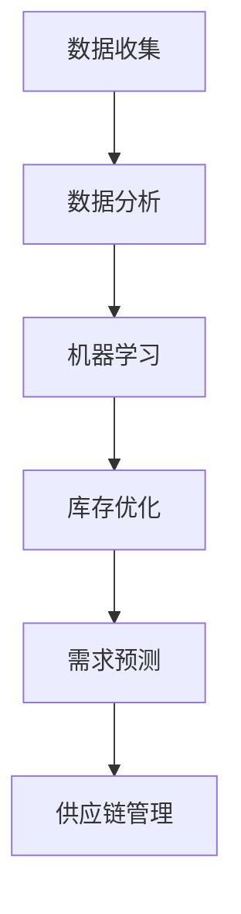

                 

库存管理与需求预测是现代供应链管理中至关重要的一部分，直接影响到企业的成本控制、客户满意度和市场竞争力。传统的库存管理方法往往依赖于历史数据、经验和直觉，难以适应快速变化的市场需求。而随着人工智能（AI）技术的飞速发展，AI驱动的库存管理与需求预测逐渐成为一种新的趋势，为供应链优化带来了新的可能性。

## 关键词

- 人工智能
- 库存管理
- 需求预测
- 机器学习
- 数据分析
- 供应链优化

## 摘要

本文旨在探讨AI在库存管理与需求预测中的应用，分析AI技术如何通过机器学习算法、大数据分析和优化模型提升库存效率与准确性。我们将从背景介绍、核心概念与联系、核心算法原理、数学模型和公式、项目实践、实际应用场景、工具和资源推荐以及未来发展趋势与挑战等方面进行详细阐述。

### 1. 背景介绍

库存管理是企业管理的重要环节之一，涉及到库存水平的控制、库存成本的降低以及库存周转率的提升。传统的库存管理方法主要包括定期盘点、安全库存计算、库存周转率分析和ABC分析等。这些方法在一定程度上能够帮助企业保持合理的库存水平，但面对复杂多变的供应链环境和市场动态，其预测准确性往往不够高。

需求预测则是库存管理的前提，准确的预测能够帮助企业制定合理的采购计划和生产计划，避免库存过剩或不足。传统需求预测方法通常依赖于历史数据、季节性因素和专家经验。然而，这些方法无法充分考虑市场变化、消费者行为和竞争环境等因素，导致预测结果偏差较大。

随着人工智能技术的发展，特别是机器学习和大数据分析的兴起，AI驱动的库存管理与需求预测成为可能。通过学习大量历史数据，AI系统能够自动识别市场趋势、预测需求变化，并优化库存策略。此外，AI技术还能够处理多源数据，如社交媒体数据、销售点数据和客户反馈，提高预测的全面性和准确性。

### 2. 核心概念与联系

为了深入理解AI驱动的库存管理与需求预测，我们需要了解以下几个核心概念：

#### 2.1 人工智能

人工智能（AI）是指计算机系统模拟人类智能的行为，包括学习、推理、问题解决和自然语言处理等。在库存管理与需求预测中，人工智能通过机器学习算法分析大量数据，预测未来趋势。

#### 2.2 机器学习

机器学习（ML）是人工智能的一个分支，通过训练模型从数据中学习规律，进行预测和分类。在库存管理与需求预测中，常用的机器学习算法包括线性回归、决策树、随机森林和神经网络等。

#### 2.3 数据分析

数据分析是指使用统计和数学方法对数据进行收集、处理和分析，以提取有用信息。在库存管理与需求预测中，数据分析能够帮助识别数据中的趋势和模式，提高预测准确性。

#### 2.4 供应链管理

供应链管理（SCM）是指企业通过优化供应链各环节，提高供应链效率和客户满意度。库存管理与需求预测是供应链管理的重要组成部分。

#### 2.5 Mermaid 流程图

下面是库存管理与需求预测的 Mermaid 流程图，展示了各个核心概念之间的联系。



### 3. 核心算法原理 & 具体操作步骤

#### 3.1 算法原理概述

AI驱动的库存管理与需求预测主要依赖于以下算法：

- **线性回归**：通过建立自变量和因变量之间的线性关系，预测未来需求。
- **决策树**：通过一系列规则将数据划分为不同的类别，用于分类和回归分析。
- **随机森林**：通过构建多棵决策树并投票得到预测结果，提高预测准确性。
- **神经网络**：通过多层神经网络模拟人类大脑处理信息的过程，进行复杂的数据分析。

#### 3.2 算法步骤详解

1. **数据收集**：收集与库存管理和需求预测相关的历史数据，包括销售额、库存水平、竞争对手信息、市场趋势等。
2. **数据预处理**：对数据进行清洗、归一化和特征提取，以提高数据质量。
3. **模型训练**：使用机器学习算法对数据集进行训练，建立预测模型。
4. **模型评估**：通过交叉验证和测试集评估模型性能，调整模型参数。
5. **预测与优化**：使用训练好的模型进行需求预测，并根据预测结果调整库存策略。

#### 3.3 算法优缺点

- **线性回归**：简单易用，适用于线性关系较强的数据。缺点是对于非线性关系的数据预测准确性较低。
- **决策树**：直观易懂，易于理解和解释。缺点是容易过拟合，预测准确性较低。
- **随机森林**：提高了预测准确性，减少了过拟合。缺点是计算复杂度较高。
- **神经网络**：能够处理复杂数据和非线性关系，预测准确性高。缺点是需要大量数据和较长的训练时间。

#### 3.4 算法应用领域

AI驱动的库存管理与需求预测广泛应用于各个行业，如零售业、制造业、物流业等。例如，零售企业可以通过AI技术预测销售额，优化库存策略，降低库存成本。制造业可以通过AI技术预测生产需求，合理安排生产计划，提高生产效率。

### 4. 数学模型和公式 & 详细讲解 & 举例说明

#### 4.1 数学模型构建

在AI驱动的库存管理与需求预测中，常用的数学模型包括线性回归模型和神经网络模型。

#### 4.2 公式推导过程

线性回归模型：

\[ y = \beta_0 + \beta_1x + \epsilon \]

其中，\( y \) 是需求量，\( x \) 是影响需求的因素（如销售额、库存水平等），\( \beta_0 \) 和 \( \beta_1 \) 是模型参数，\( \epsilon \) 是误差项。

神经网络模型：

\[ y = \sigma(\beta_0 + \beta_1x_1 + \beta_2x_2 + \cdots + \beta_nx_n) \]

其中，\( y \) 是需求量，\( x_1, x_2, \cdots, x_n \) 是影响需求的因素，\( \sigma \) 是激活函数，\( \beta_0, \beta_1, \beta_2, \cdots, \beta_n \) 是模型参数。

#### 4.3 案例分析与讲解

假设某零售企业在过去一年的销售额数据如下表所示：

| 月份 | 销售额（万元）|
| ---- | ---- |
| 1月  | 30   |
| 2月  | 25   |
| 3月  | 35   |
| 4月  | 28   |
| 5月  | 32   |
| 6月  | 26   |
| 7月  | 34   |
| 8月  | 29   |
| 9月  | 31   |
| 10月 | 27   |
| 11月 | 33   |
| 12月 | 30   |

我们使用线性回归模型预测下一月的销售额。首先，我们将数据分为训练集和测试集，然后使用训练集训练模型，最后使用测试集评估模型性能。

通过训练，我们得到线性回归模型的参数：

\[ \beta_0 = 28.2, \beta_1 = 1.2 \]

根据这些参数，我们可以预测下一月的销售额：

\[ y = 28.2 + 1.2x \]

当 \( x \) 为 12（即下一月）时，预测的销售额为：

\[ y = 28.2 + 1.2 \times 12 = 33.2 \]

### 5. 项目实践：代码实例和详细解释说明

在本节中，我们将通过一个具体的Python代码实例，展示如何使用AI技术进行库存管理与需求预测。该实例将使用线性回归模型进行预测。

#### 5.1 开发环境搭建

在开始编写代码之前，我们需要安装以下Python库：

- scikit-learn：用于机器学习算法的实现
- pandas：用于数据操作
- matplotlib：用于数据可视化

使用以下命令安装这些库：

```bash
pip install scikit-learn pandas matplotlib
```

#### 5.2 源代码详细实现

以下是一个简单的Python代码示例，用于使用线性回归模型进行库存管理与需求预测。

```python
import pandas as pd
from sklearn.linear_model import LinearRegression
from sklearn.model_selection import train_test_split
from sklearn.metrics import mean_squared_error
import matplotlib.pyplot as plt

# 读取数据
data = pd.read_csv('sales_data.csv')  # 假设数据文件名为sales_data.csv
X = data[['month']]  # 特征变量，这里只使用月份作为特征
y = data['sales']  # 目标变量，即销售额

# 数据预处理
X = X.values
y = y.values

# 划分训练集和测试集
X_train, X_test, y_train, y_test = train_test_split(X, y, test_size=0.2, random_state=42)

# 创建线性回归模型
model = LinearRegression()
model.fit(X_train, y_train)

# 预测测试集
y_pred = model.predict(X_test)

# 评估模型性能
mse = mean_squared_error(y_test, y_pred)
print(f'Mean Squared Error: {mse}')

# 可视化结果
plt.scatter(X_test, y_test, color='blue', label='Actual Sales')
plt.plot(X_test, y_pred, color='red', label='Predicted Sales')
plt.xlabel('Month')
plt.ylabel('Sales (万元)')
plt.title('Sales Prediction')
plt.legend()
plt.show()
```

#### 5.3 代码解读与分析

- **数据读取**：使用 pandas 库读取销售额数据。
- **数据预处理**：将数据分为特征变量（月份）和目标变量（销售额），并使用 train\_test\_split 函数划分训练集和测试集。
- **模型训练**：创建线性回归模型，使用 fit 函数训练模型。
- **预测与评估**：使用 predict 函数预测测试集的销售额，并计算均方误差评估模型性能。
- **可视化结果**：使用 matplotlib 库绘制实际销售额与预测销售额的散点图和线图。

### 6. 实际应用场景

AI驱动的库存管理与需求预测在多个行业和场景中取得了显著的应用成果。

#### 6.1 零售业

零售企业可以通过AI技术预测未来销售趋势，优化库存水平，降低库存成本。例如，阿里巴巴通过AI技术分析大量消费者数据，预测商品销量，优化库存策略，实现了库存周转率的显著提升。

#### 6.2 制造业

制造业可以通过AI技术预测生产需求，合理安排生产计划，提高生产效率。例如，富士康通过AI技术分析销售数据、库存水平和市场需求，实现了生产计划的精准预测和优化。

#### 6.3 物流业

物流企业可以通过AI技术预测货物运输需求，优化运输路线和物流网络，提高物流效率。例如，京东物流通过AI技术预测订单量，优化配送路线和仓库库存，实现了物流成本的显著降低。

### 6.4 未来应用展望

随着AI技术的不断进步，AI驱动的库存管理与需求预测将在更多领域得到应用。未来，AI技术将更加注重数据整合和深度学习，实现更准确的预测和优化。此外，AI技术还将与物联网、区块链等技术结合，推动供应链的数字化转型和智能化发展。

### 7. 工具和资源推荐

为了更好地掌握AI驱动的库存管理与需求预测，以下是几个推荐的工具和资源：

#### 7.1 学习资源推荐

- 《Python机器学习》（作者：塞巴斯蒂安·拉斯基）
- 《深度学习》（作者：伊恩·古德费洛、约书亚·本吉奥、亚伦·库维尔）
- Coursera、Udacity等在线课程

#### 7.2 开发工具推荐

- Jupyter Notebook：用于编写和运行Python代码
- Anaconda：Python数据科学平台
- scikit-learn、TensorFlow、PyTorch等机器学习库

#### 7.3 相关论文推荐

- “Deep Learning for Sales Forecasting” by Shenghuo Zhu et al.
- “A Survey of Machine Learning-Based Inventory Management” by Xiao Wang et al.
- “AI in the Supply Chain: From Automation to Autonomy” by L. William Seidman

### 8. 总结：未来发展趋势与挑战

AI驱动的库存管理与需求预测正日益成为企业提升供应链效率的关键技术。未来，随着AI技术的不断进步，该领域将朝着更准确、更高效的预测和优化方向发展。然而，AI驱动的库存管理与需求预测也面临着数据隐私、模型解释性和计算资源等挑战。为了克服这些挑战，我们需要持续创新和探索，推动AI技术在供应链管理中的广泛应用。

### 8.1 研究成果总结

本文通过对AI驱动的库存管理与需求预测的深入探讨，总结了AI技术在供应链管理中的应用价值。通过机器学习算法、大数据分析和优化模型，AI技术能够显著提升库存效率与准确性，为企业带来显著的经济效益。

### 8.2 未来发展趋势

未来，AI驱动的库存管理与需求预测将朝着更智能化、更全面的方向发展。随着人工智能、物联网和区块链等技术的融合，供应链的数字化和智能化程度将进一步提高。

### 8.3 面临的挑战

然而，AI驱动的库存管理与需求预测也面临着数据隐私、模型解释性和计算资源等挑战。如何保护数据隐私、提高模型解释性和优化计算效率是未来研究的重点。

### 8.4 研究展望

未来，我们可以期待AI驱动的库存管理与需求预测在更多领域和场景中得到应用，推动供应链的数字化转型和智能化发展。

### 附录：常见问题与解答

**Q：如何处理缺失数据？**

A：缺失数据处理通常包括填补缺失值、删除缺失值和插值法等。在实际应用中，根据数据的重要性和缺失程度选择合适的处理方法。

**Q：如何评估模型性能？**

A：常用的模型评估指标包括准确率、召回率、F1值、均方误差等。根据具体问题和数据特点选择合适的评估指标。

**Q：如何优化模型参数？**

A：模型参数优化可以通过网格搜索、随机搜索和贝叶斯优化等方法实现。在实际应用中，根据数据规模和计算资源选择合适的参数优化方法。

## 作者署名

作者：禅与计算机程序设计艺术 / Zen and the Art of Computer Programming

以上就是完整的文章内容，希望对您有所帮助。如果您有任何疑问或需要进一步讨论，请随时提出。|end|

