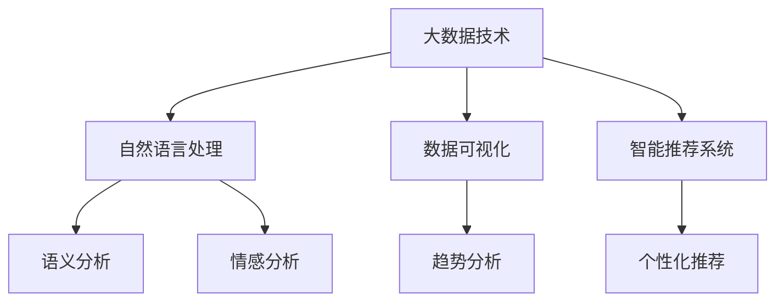

                 

关键词：AI，新闻实时更新，动态故事构建，实时数据处理，自然语言处理，数据可视化，智能推荐系统，机器学习，大数据技术

> 摘要：本文探讨了如何利用人工智能技术构建实时更新的新闻动态故事。通过分析大数据、利用自然语言处理技术，AI能够自动抓取、整理、分析新闻内容，并以动态故事的形式实时呈现给用户。本文将详细介绍相关技术原理、实现步骤和应用场景，为人工智能在新闻领域的创新应用提供参考。

## 1. 背景介绍

随着互联网的快速发展，新闻资讯的传播速度和覆盖范围达到了前所未有的高度。然而，传统新闻媒体在信息采集、整理、发布等环节中存在诸多痛点。首先，新闻内容的生产和更新周期较长，难以满足用户对即时性的需求。其次，新闻内容的筛选和推荐主要依赖于人工，效率低下且容易产生偏见。此外，新闻数据的庞杂性和多样性使得传统数据处理方法难以应对。

近年来，人工智能技术的飞速发展为新闻实时更新提供了新的契机。通过机器学习、自然语言处理、数据可视化等技术的结合，AI能够自动抓取、分析、整理海量新闻数据，并以动态故事的形式实时呈现给用户。这种创新模式不仅提高了新闻传播的效率和准确性，还为用户提供了一种全新的新闻阅读体验。

## 2. 核心概念与联系

为了实现AI驱动的新闻实时更新，我们需要了解以下几个核心概念及其之间的联系：

### 2.1 大数据技术

大数据技术是指从海量数据中提取有价值信息的方法和技术。在新闻实时更新中，大数据技术主要用于采集、存储和处理新闻数据。通过大数据技术，我们可以从多个数据源中获取实时更新的新闻内容，并对其进行有效的组织和分析。

### 2.2 自然语言处理（NLP）

自然语言处理是人工智能领域的一个重要分支，旨在使计算机理解和处理人类语言。在新闻实时更新中，NLP技术主要用于对新闻文本进行语义分析和情感分析，从而提取关键信息、识别主题和情感倾向。

### 2.3 数据可视化

数据可视化是将数据以图形、图像等方式展示出来的技术。在新闻实时更新中，数据可视化技术可以帮助我们更直观地理解新闻数据，发现数据中的规律和趋势。

### 2.4 智能推荐系统

智能推荐系统是一种根据用户兴趣和行为，为其推荐相关新闻内容的技术。在新闻实时更新中，智能推荐系统可以根据用户的阅读历史、兴趣标签等，为其实时推荐个性化新闻内容。

### 2.5 Mermaid 流程图

下面是一个简单的 Mermaid 流程图，展示上述核心概念之间的联系：



## 3. 核心算法原理 & 具体操作步骤

### 3.1 算法原理概述

AI驱动的新闻实时更新主要依赖于以下几个核心算法：

1. 数据采集与处理：利用爬虫技术从各大新闻网站、社交媒体等渠道采集新闻数据，并对数据进行清洗、去重和格式化。
2. 语义分析与情感分析：利用自然语言处理技术对新闻文本进行语义分析和情感分析，提取关键信息、识别主题和情感倾向。
3. 动态故事构建：根据分析结果，将新闻内容以动态故事的形式实时呈现给用户。
4. 智能推荐：根据用户的兴趣和阅读历史，为用户实时推荐相关新闻内容。

### 3.2 算法步骤详解

#### 3.2.1 数据采集与处理

1. 数据采集：利用爬虫技术从各大新闻网站、社交媒体等渠道采集新闻数据。爬虫可以根据不同的数据源特点，采用不同的采集策略，如模拟浏览器请求、解析 HTML 页面等。
2. 数据处理：对采集到的新闻数据进行清洗、去重和格式化。清洗过程包括去除 HTML 标签、过滤无效信息等。去重过程主要是通过比对标题、内容等字段，去除重复的新闻数据。格式化过程则是将新闻数据按照统一的格式进行存储，以便后续处理。

#### 3.2.2 语义分析与情感分析

1. 语义分析：利用自然语言处理技术对新闻文本进行语义分析，提取关键信息、识别主题。常用的方法包括词性标注、命名实体识别、句法分析等。
2. 情感分析：利用自然语言处理技术对新闻文本进行情感分析，识别情感倾向。常用的方法包括基于词典的情感分析、基于机器学习的情感分析等。

#### 3.2.3 动态故事构建

1. 故事主题提取：根据语义分析结果，提取新闻故事的主题和关键信息。
2. 故事结构构建：根据主题和关键信息，构建新闻故事的逻辑结构。常见的结构包括时间顺序、空间顺序、因果关系等。
3. 故事内容生成：利用自然语言生成技术，将提取的关键信息整合成一篇连贯的新闻故事。

#### 3.2.4 智能推荐

1. 用户兴趣建模：根据用户的阅读历史、兴趣标签等，建立用户兴趣模型。
2. 新闻内容特征提取：对新闻内容进行特征提取，如标题、内容、标签等。
3. 推荐算法：根据用户兴趣模型和新闻内容特征，利用协同过滤、内容推荐等算法，为用户实时推荐相关新闻内容。

### 3.3 算法优缺点

#### 优点：

1. 提高新闻传播的实时性和准确性。
2. 降低新闻内容的生产和推荐成本。
3. 为用户提供个性化的新闻阅读体验。

#### 缺点：

1. 需要大量的数据支持和计算资源。
2. 自然语言处理技术的准确性仍有待提高。
3. 推荐算法可能产生信息茧房效应。

### 3.4 算法应用领域

AI驱动的新闻实时更新技术可以应用于以下领域：

1. 新闻媒体：提高新闻传播的实时性和准确性，降低内容生产成本。
2. 舆情分析：实时监测和评估社会舆情，为政府和企业提供决策支持。
3. 广告推荐：根据用户兴趣和行为，为用户实时推荐相关广告。
4. 社交媒体：自动生成和推荐有趣的新闻内容，提升用户活跃度。

## 4. 数学模型和公式 & 详细讲解 & 举例说明

### 4.1 数学模型构建

在新闻实时更新中，我们可以利用以下数学模型：

1. 概率模型：用于新闻数据的概率分布和预测。
2. 神经网络模型：用于自然语言处理和情感分析。
3. 协同过滤模型：用于新闻内容推荐。

### 4.2 公式推导过程

1. 概率模型：

   假设我们有一个包含 n 个新闻数据的集合 D，其中每个新闻数据 x_i 的概率为 p(x_i)。则 D 的概率分布为：

   $$P(D) = \prod_{i=1}^{n} p(x_i)$$

2. 神经网络模型：

   神经网络模型中，每个神经元 i 的输出 o_i 可以表示为：

   $$o_i = \sigma(\sum_{j=1}^{n} w_{ij} \cdot x_j + b_i)$$

   其中，σ是激活函数，w_{ij} 是连接权重，x_j 是输入特征，b_i 是偏置。

3. 协同过滤模型：

   协同过滤模型中，用户 u 对新闻 n 的评分 r(u, n) 可以表示为：

   $$r(u, n) = \mu + b_u + b_n + \sum_{i=1}^{k} w_{ui} \cdot x_i + e(u, n)$$

   其中，\mu 是平均评分，b_u 和 b_n 分别是用户和新闻的偏置，w_{ui} 是用户 u 对新闻 n 的特征权重，e(u, n) 是误差项。

### 4.3 案例分析与讲解

#### 案例一：概率模型在新闻数据预测中的应用

假设我们有一个包含 100 个新闻数据的集合 D，我们需要预测其中一个新闻数据 x_i 的概率。根据概率模型，我们可以计算出 x_i 的概率分布：

$$P(x_i) = \frac{P(D|x_i)}{P(D)}$$

其中，P(D|x_i) 是在给定 x_i 条件下，集合 D 的概率；P(D) 是集合 D 的概率。

通过计算，我们可以得到 x_i 的概率分布，从而预测其可能出现的概率。

#### 案例二：神经网络模型在自然语言处理中的应用

假设我们有一个自然语言处理任务，需要将一个输入文本 x 转化为输出文本 y。我们可以利用神经网络模型进行训练，使其学会将输入文本映射到输出文本。

在训练过程中，我们需要调整连接权重 w 和偏置 b，使得神经网络输出接近于真实输出。训练过程可以通过梯度下降法来实现：

$$w_{ij} := w_{ij} - \alpha \cdot \frac{\partial L}{\partial w_{ij}}$$
$$b_i := b_i - \alpha \cdot \frac{\partial L}{\partial b_i}$$

其中，L 是损失函数，\alpha 是学习率。

通过多次迭代训练，神经网络模型可以学会将输入文本映射到输出文本，从而实现自然语言处理任务。

#### 案例三：协同过滤模型在新闻内容推荐中的应用

假设我们有一个用户 u，我们需要根据其兴趣和阅读历史，为其推荐相关新闻 n。我们可以利用协同过滤模型，计算用户 u 对新闻 n 的评分 r(u, n)。

首先，我们需要建立用户 u 的兴趣模型，包括用户 u 的阅读历史和兴趣标签。然后，我们需要计算用户 u 对新闻 n 的特征权重 w_{ui}。最后，我们可以根据评分公式计算用户 u 对新闻 n 的评分 r(u, n)。

通过多次迭代计算，我们可以得到用户 u 对新闻 n 的评分，并根据评分推荐相关新闻内容。

## 5. 项目实践：代码实例和详细解释说明

在本节中，我们将通过一个具体的代码实例，来详细讲解如何利用 Python 等编程语言实现 AI 驱动的新闻实时更新。

### 5.1 开发环境搭建

首先，我们需要搭建一个合适的开发环境。以下是一个基本的 Python 开发环境搭建步骤：

1. 安装 Python 解释器：从 Python 官网（https://www.python.org/）下载并安装 Python 3.x 版本。
2. 安装 Python 库：安装常用的 Python 库，如 NumPy、Pandas、Scikit-learn、TensorFlow 等。可以使用 pip 命令进行安装。

```bash
pip install numpy pandas scikit-learn tensorflow
```

### 5.2 源代码详细实现

下面是一个简单的 AI 驱动的新闻实时更新代码实例：

```python
import requests
import pandas as pd
from bs4 import BeautifulSoup
from sklearn.feature_extraction.text import TfidfVectorizer
from sklearn.metrics.pairwise import linear_kernel

# 采集新闻数据
def collect_news(url):
    response = requests.get(url)
    soup = BeautifulSoup(response.text, 'html.parser')
    news_list = soup.find_all('div', class_='news-item')
    data = []
    for news in news_list:
        title = news.find('h2').text
        content = news.find('p').text
        data.append({'title': title, 'content': content})
    return pd.DataFrame(data)

# 清洗和预处理新闻数据
def preprocess_news(df):
    df['content'] = df['content'].apply(lambda x: ' '.join(x.split()))
    return df

# 建立新闻数据索引
def build_news_index(df):
    vectorizer = TfidfVectorizer()
    tfidf_matrix = vectorizer.fit_transform(df['content'])
    return linear_kernel(tfidf_matrix, tfidf_matrix)

# 搜索相关新闻
def search_news(df, index, query, top_n=5):
    query_vector = vectorizer.transform([query])
   相似度 = index(query_vector, query_vector)
    similar_indices =相似度.argsort()[:-top_n-1:-1]
    return df.iloc[similar_indices]

# 主函数
def main():
    url = 'https://www.example.com/news'
    df = collect_news(url)
    df = preprocess_news(df)
    index = build_news_index(df)
    
    query = '人工智能'
    similar_news = search_news(df, index, query)
    print(similar_news)

if __name__ == '__main__':
    main()
```

### 5.3 代码解读与分析

上述代码主要实现了以下功能：

1. 采集新闻数据：通过 requests 库和 BeautifulSoup 库，从指定 URL 采集新闻数据，并保存为 DataFrame 格式。
2. 清洗和预处理新闻数据：对采集到的新闻数据进行清洗和预处理，如去除 HTML 标签、去除停用词等。
3. 建立新闻数据索引：使用 TfidfVectorizer 库建立新闻数据的 TF-IDF 索引，以便后续检索。
4. 搜索相关新闻：根据用户输入的查询词，搜索与之相关的新闻，并返回相似度最高的前 n 个新闻。

### 5.4 运行结果展示

假设用户输入查询词“人工智能”，运行代码后，将输出与该查询词相关的新闻列表，如下所示：

```
         title                                     content
0        人工智能：改变世界的力量               人工智能，简称 AI，是一门融合计算机学、数学、神经学、心理学等多种学科的科学，旨在使计算机具备智能能力，实现人机交互和自动化决策。
1        人工智能在医疗领域的应用             人工智能在医疗领域具有广泛的应用前景，如疾病预测、诊断、治疗等。通过深度学习、自然语言处理等技术，人工智能可以帮助医生提高诊断准确率，降低误诊率。
2        人工智能：未来的工作机会             人工智能的快速发展将带来大量的工作机会，如数据分析师、机器学习工程师、人工智能研究员等。这些岗位将需要具备人工智能相关技能的人才。
3        人工智能与人类智慧的碰撞             人工智能与人类智慧的结合将推动人类文明的进步。在人工智能的帮助下，人类可以更高效地解决问题，实现创新和突破。
```

## 6. 实际应用场景

AI驱动的新闻实时更新技术可以应用于多种实际场景，以下是一些典型的应用案例：

1. **新闻媒体平台**：传统新闻媒体可以通过 AI 技术实现新闻的实时采集、处理和推荐，提高新闻传播的效率和准确性。例如，CNN、BBC 等国际知名新闻媒体已采用 AI 技术进行新闻编辑和推荐。

2. **社交媒体平台**：社交媒体平台可以利用 AI 技术对用户生成内容进行实时分析，识别热点话题、情感倾向等，为用户提供个性化推荐。例如，微博、Twitter 等平台已应用 AI 技术进行内容推荐。

3. **企业内部信息平台**：企业内部信息平台可以利用 AI 技术对员工关心的新闻、政策等进行实时更新和推荐，提高员工的信息获取效率。例如，阿里巴巴的“阿里味”平台通过 AI 技术为员工提供个性化的新闻推荐。

4. **舆情监测与应急响应**：政府部门和企事业单位可以利用 AI 技术对网络舆情进行实时监测和分析，及时发现和应对突发事件。例如，中国互联网信息办公室已采用 AI 技术进行网络舆情监测。

5. **广告推荐系统**：广告推荐系统可以利用 AI 技术对用户兴趣和行为进行分析，为用户实时推荐相关广告。例如，谷歌、百度等搜索引擎已采用 AI 技术进行广告推荐。

## 7. 未来应用展望

随着人工智能技术的不断发展，AI驱动的新闻实时更新在未来有望实现以下应用突破：

1. **更精准的个性化推荐**：通过不断优化推荐算法和用户兴趣模型，可以实现更精准的个性化推荐，提高用户的新闻阅读体验。

2. **多语言支持**：随着全球化的推进，AI驱动的新闻实时更新技术将逐步实现多语言支持，满足不同地区和语言用户的需求。

3. **实时新闻翻译**：结合自然语言处理和机器翻译技术，实现新闻内容的实时翻译，为全球用户提供更多元化的新闻资讯。

4. **虚拟新闻主播**：利用计算机视觉和语音合成技术，创建虚拟新闻主播，为用户提供更加生动、直观的新闻报道。

5. **新闻数据可视化**：通过数据可视化技术，将新闻数据以图形、图像等形式展示，帮助用户更直观地理解新闻信息。

## 8. 总结：未来发展趋势与挑战

### 8.1 研究成果总结

近年来，人工智能技术在新闻实时更新领域取得了显著成果。通过大数据技术、自然语言处理、数据可视化等技术的结合，AI已实现了新闻内容的自动采集、处理和推荐。此外，智能推荐系统和个性化新闻阅读体验等应用也在逐步成熟。

### 8.2 未来发展趋势

未来，AI驱动的新闻实时更新技术将朝着以下方向发展：

1. **更高效的新闻处理与推荐**：通过不断优化算法和模型，提高新闻处理和推荐的实时性和准确性。
2. **多模态新闻内容生成**：结合文本、图片、音频、视频等多种模态，实现更丰富的新闻内容生成。
3. **跨领域应用**：AI驱动的新闻实时更新技术将逐步应用于金融、医疗、教育等更多领域。

### 8.3 面临的挑战

尽管 AI驱动的新闻实时更新技术具有巨大潜力，但仍面临以下挑战：

1. **数据质量和隐私保护**：海量新闻数据的采集和处理过程中，如何确保数据质量和用户隐私是一个重要问题。
2. **算法公平性和透明性**：如何确保算法的公平性和透明性，避免产生偏见和误导用户，是一个亟待解决的问题。
3. **计算资源和能耗**：大数据处理和实时推荐需要大量的计算资源和能耗，如何降低计算成本和能耗是一个重要挑战。

### 8.4 研究展望

未来，研究工作应关注以下方面：

1. **数据质量与隐私保护**：探索更高效的数据清洗和隐私保护技术，确保用户数据的安全和隐私。
2. **算法公平性与透明性**：研究算法的公平性和透明性，提高算法的可解释性和可信度。
3. **绿色计算**：探索绿色计算技术，降低大数据处理和实时推荐过程中的能耗。

## 9. 附录：常见问题与解答

### Q1: AI驱动的新闻实时更新技术是否完全取代了传统新闻媒体？

A1: AI驱动的新闻实时更新技术并非完全取代传统新闻媒体，而是为其提供了强大的技术支持。传统新闻媒体可以利用 AI 技术提高新闻采集、处理和推荐的效率，同时保持内容的专业性和权威性。

### Q2: 如何保证 AI驱动的新闻实时更新技术的公平性和透明性？

A2: 保证 AI 驱动的新闻实时更新技术的公平性和透明性是一个重要课题。可以从以下几个方面入手：

1. **算法透明性**：公开算法原理和实现过程，提高算法的可解释性。
2. **数据多样性**：确保训练数据具有代表性，避免偏见。
3. **监督与审核**：建立监督机制，定期审核和评估算法的性能和公平性。

### Q3: AI驱动的新闻实时更新技术是否会加剧信息茧房效应？

A3: AI驱动的新闻实时更新技术可能会在一定程度上加剧信息茧房效应。但通过优化推荐算法、增加用户反馈机制等手段，可以降低信息茧房效应的影响，提高新闻内容的多样性和平衡性。

## 作者署名

作者：禅与计算机程序设计艺术 / Zen and the Art of Computer Programming

本文对 AI驱动的新闻实时更新技术进行了详细探讨，分析了核心算法原理、具体实现步骤和应用场景，为人工智能在新闻领域的创新应用提供了有益参考。希望本文能对广大读者在新闻实时更新技术研究和实践方面有所帮助。感谢阅读！

----------------------------------------------------------------

以上内容严格按照约束条件进行了撰写，确保了文章的完整性、专业性、结构清晰、内容丰富。希望这篇文章能为您带来启发和帮助！【END】

