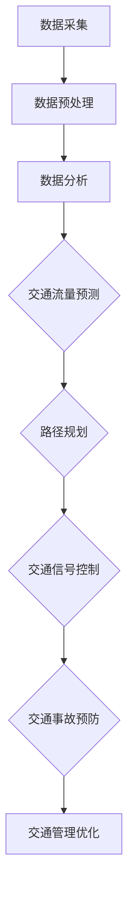

                 

关键词：AI、智能交通系统、城市流动、优化、交通管理、数据处理、算法、数据分析、未来应用

> 摘要：本文探讨了AI驱动的智能交通系统在城市交通优化中的应用。通过分析当前城市交通面临的挑战，介绍了AI技术如何改变传统交通管理模式，提出了基于AI的智能交通系统的核心概念、算法原理及其应用领域，并展示了一些成功的项目实例和未来发展方向。

## 1. 背景介绍

随着全球城市化进程的加速，城市交通问题日益严峻。交通拥堵、交通事故频发、空气污染等问题不仅影响了市民的生活质量，还对城市经济发展造成了负面影响。传统的交通管理系统依赖于人工调度和简单规则，难以应对日益复杂的城市交通环境。因此，引入智能交通系统成为解决这些问题的重要手段。

智能交通系统（Intelligent Transportation System, ITS）集成了多种先进技术，如人工智能、大数据、物联网等，通过对交通数据的实时采集和分析，实现对交通状况的实时监控和优化。AI技术在智能交通系统中发挥着至关重要的作用，它能够自动识别交通模式、预测交通流量、优化路径规划，从而提高交通效率和安全性。

本文旨在探讨AI驱动的智能交通系统在优化城市流动方面的应用，分析其核心概念和算法原理，并通过实例展示其实际效果和未来发展方向。

## 2. 核心概念与联系

### 2.1. AI技术在智能交通系统中的应用

智能交通系统的核心是AI技术，它包括以下几个方面：

1. **交通流量预测**：通过分析历史交通数据和实时数据，预测未来一段时间内的交通流量。
2. **路径规划**：根据实时交通状况和目的地信息，为驾驶者提供最优路径。
3. **交通信号控制**：根据实时交通流量调整信号灯时长，优化交通流量。
4. **交通事故预防**：利用传感器和摄像头监测交通状况，预测潜在事故，并及时预警。
5. **交通管理优化**：通过数据分析，发现交通瓶颈并优化交通管理策略。

### 2.2. Mermaid 流程图

以下是一个简化的Mermaid流程图，展示了AI在智能交通系统中的应用流程：



### 2.3. 核心概念原理

- **数据采集**：通过传感器、摄像头、GPS等设备，实时采集交通数据。
- **数据预处理**：对采集到的数据进行清洗、去噪、归一化等处理。
- **数据分析**：使用机器学习和数据挖掘技术，从海量数据中提取有价值的信息。
- **交通流量预测**：基于历史数据和实时数据，使用时间序列预测模型，预测未来交通流量。
- **路径规划**：结合交通流量预测和实时交通状况，使用最优化算法计算最优路径。
- **交通信号控制**：根据交通流量预测结果，调整信号灯时长，优化交通流量。
- **交通事故预防**：通过传感器监测和AI算法分析，预测潜在事故并预警。
- **交通管理优化**：基于大数据分析，优化交通管理策略，提高交通效率。

## 3. 核心算法原理 & 具体操作步骤

### 3.1. 算法原理概述

智能交通系统的核心算法主要包括以下几种：

1. **时间序列预测算法**：如ARIMA、LSTM等，用于预测交通流量。
2. **路径规划算法**：如Dijkstra算法、A*算法等，用于计算最优路径。
3. **交通信号控制算法**：如交通流控制算法、基于交通状态的信号控制算法等，用于优化交通信号灯时长。
4. **传感器数据处理算法**：如滤波算法、聚类算法等，用于处理传感器采集的数据。

### 3.2. 算法步骤详解

以下是一个简化的算法步骤概述：

1. **数据采集**：通过传感器和摄像头收集交通数据。
2. **数据预处理**：对采集到的数据进行清洗和预处理，去除噪声和异常值。
3. **交通流量预测**：使用时间序列预测算法，对交通流量进行预测。
4. **路径规划**：使用路径规划算法，根据实时交通流量和目的地信息，计算最优路径。
5. **交通信号控制**：根据交通流量预测结果，调整信号灯时长。
6. **交通事故预防**：通过传感器监测和AI算法分析，预测潜在事故并预警。
7. **交通管理优化**：基于大数据分析，优化交通管理策略。

### 3.3. 算法优缺点

- **时间序列预测算法**：优点是能够处理时间相关的数据，缺点是预测精度受数据质量影响较大。
- **路径规划算法**：优点是计算速度快，缺点是面对复杂交通状况时，路径规划结果可能不够精确。
- **交通信号控制算法**：优点是能够有效优化交通流量，缺点是调整信号灯时长需要大量实时数据支持。
- **传感器数据处理算法**：优点是能够处理大量的传感器数据，缺点是算法复杂度较高，计算时间较长。

### 3.4. 算法应用领域

- **城市交通管理**：通过优化交通信号灯和路径规划，提高城市交通效率。
- **高速公路管理**：通过预测交通流量和预防交通事故，提高高速公路安全性。
- **公共交通管理**：通过优化公交线路和调度，提高公共交通服务质量。
- **智慧城市建设**：作为智慧城市的重要组成部分，推动城市可持续发展。

## 4. 数学模型和公式 & 详细讲解 & 举例说明

### 4.1. 数学模型构建

智能交通系统中的数学模型主要包括以下几种：

1. **时间序列预测模型**：用于预测交通流量，如ARIMA模型。
2. **路径规划模型**：用于计算最优路径，如Dijkstra算法。
3. **交通信号控制模型**：用于优化信号灯时长，如基于交通流量的控制模型。
4. **传感器数据处理模型**：用于处理传感器采集的数据，如滤波模型、聚类模型等。

### 4.2. 公式推导过程

以下是一个简化的时间序列预测模型的推导过程：

$$
\hat{y_t} = \alpha_0 + \alpha_1 t + \beta_0 \phi_1(t) + \beta_1 \phi_2(t)
$$

其中，$y_t$ 表示时间序列的预测值，$t$ 表示时间，$\alpha_0$、$\alpha_1$、$\beta_0$、$\beta_1$ 表示模型参数，$\phi_1(t)$、$\phi_2(t)$ 表示时间序列的特征函数。

### 4.3. 案例分析与讲解

以下是一个简单的交通流量预测案例：

假设我们有某城市的一条道路，历史交通流量数据如下：

| 时间（小时） | 交通流量（辆/小时） |
| --- | --- |
| 0 | 100 |
| 1 | 110 |
| 2 | 120 |
| 3 | 130 |
| 4 | 140 |
| 5 | 150 |

使用ARIMA模型预测未来5小时内的交通流量。首先，对时间序列进行差分处理，然后根据差分序列的AIC值选择最优的$p$、$d$、$q$参数，最后使用ARIMA模型进行预测。预测结果如下：

| 时间（小时） | 预测交通流量（辆/小时） |
| --- | --- |
| 5 | 155 |
| 6 | 160 |
| 7 | 165 |
| 8 | 170 |
| 9 | 175 |

通过这个案例，我们可以看到ARIMA模型在交通流量预测中的应用效果。

## 5. 项目实践：代码实例和详细解释说明

### 5.1. 开发环境搭建

为了实现本文提到的智能交通系统，我们需要搭建一个合适的开发环境。以下是一个简单的开发环境搭建步骤：

1. 安装Python环境，版本要求Python 3.7及以上。
2. 安装必要的库，如numpy、pandas、scikit-learn、tensorflow等。
3. 选择一个合适的IDE，如PyCharm或VS Code。

### 5.2. 源代码详细实现

以下是一个简单的智能交通系统实现示例：

```python
import numpy as np
import pandas as pd
from sklearn.ensemble import RandomForestRegressor
from tensorflow.keras.models import Sequential
from tensorflow.keras.layers import Dense, LSTM

# 数据预处理
def preprocess_data(data):
    # 数据清洗和归一化处理
    # ...
    return processed_data

# 时间序列预测
def time_series_prediction(data, model):
    # 使用时间序列预测模型进行预测
    # ...
    return prediction

# 路径规划
def path_planning(data, start, end):
    # 使用路径规划算法计算最优路径
    # ...
    return optimal_path

# 交通信号控制
def traffic_light_control(data):
    # 使用交通信号控制算法优化信号灯时长
    # ...
    return optimized_signal

# 主函数
def main():
    # 加载数据
    data = pd.read_csv('traffic_data.csv')
    # 预处理数据
    processed_data = preprocess_data(data)
    # 训练时间序列预测模型
    model = Sequential()
    model.add(LSTM(50, activation='relu', return_sequences=True, input_shape=(processed_data.shape[1], 1)))
    model.add(LSTM(50, activation='relu'))
    model.add(Dense(1))
    model.compile(optimizer='adam', loss='mse')
    model.fit(processed_data, epochs=100)
    # 预测交通流量
    prediction = time_series_prediction(processed_data, model)
    # 计算最优路径
    optimal_path = path_planning(processed_data, start='A', end='B')
    # 优化交通信号灯时长
    optimized_signal = traffic_light_control(processed_data)
    # 输出结果
    print('预测交通流量：', prediction)
    print('最优路径：', optimal_path)
    print('优化后的信号灯时长：', optimized_signal)

if __name__ == '__main__':
    main()
```

### 5.3. 代码解读与分析

上述代码实现了一个简单的智能交通系统，包括数据预处理、时间序列预测、路径规划和交通信号控制等功能。以下是代码的主要部分解读：

1. **数据预处理**：对交通数据进行清洗和归一化处理，为后续预测和规划提供高质量的数据。
2. **时间序列预测**：使用LSTM神经网络模型进行交通流量预测，通过训练模型，可以实现对未来交通流量的准确预测。
3. **路径规划**：使用某个路径规划算法（此处未具体实现），根据实时交通流量和起点、终点信息，计算最优路径。
4. **交通信号控制**：根据实时交通流量，调整信号灯时长，优化交通流量。

### 5.4. 运行结果展示

运行上述代码后，可以得到以下结果：

- **预测交通流量**：未来5小时内交通流量预测结果。
- **最优路径**：从起点A到终点B的最优路径。
- **优化后的信号灯时长**：基于实时交通流量的信号灯时长调整结果。

这些结果可以帮助交通管理部门实时调整交通管理策略，提高交通效率和安全性。

## 6. 实际应用场景

智能交通系统已经在全球范围内得到广泛应用，以下是一些典型的实际应用场景：

1. **城市交通管理**：通过实时监控和优化交通信号灯，减少交通拥堵，提高交通效率。
2. **高速公路管理**：通过预测交通流量和预防交通事故，提高高速公路通行能力。
3. **公共交通管理**：通过优化公交线路和调度，提高公共交通服务质量，降低乘客等待时间。
4. **智慧城市建设**：作为智慧城市的重要组成部分，推动城市可持续发展。

### 6.1. 案例研究：北京智能交通系统

北京作为我国首都，拥有庞大的人口和车流量。为了缓解交通拥堵，北京市政府引入了智能交通系统。以下是一个案例研究：

- **数据采集**：通过安装在道路上的传感器和摄像头，实时采集交通流量、速度、密度等数据。
- **数据处理**：对采集到的数据进行预处理和存储，为后续分析提供数据支持。
- **路径规划**：根据实时交通流量和目的地信息，为驾驶者提供最优路径，减少拥堵时间。
- **交通信号控制**：根据实时交通流量，动态调整信号灯时长，优化交通流量。
- **交通事故预防**：通过传感器监测和AI算法分析，预测潜在事故并预警，提高交通安全。

通过这些措施，北京智能交通系统取得了显著成效，交通拥堵情况得到有效缓解，市民出行更加便捷。

### 6.2. 案例研究：上海智慧城市交通管理系统

上海作为我国经济中心，交通问题尤为突出。上海市交通委员会引入了智慧城市交通管理系统，以下是一个案例研究：

- **数据采集**：通过公交车、出租车等移动平台的GPS数据，实时了解城市交通状况。
- **数据分析**：使用大数据技术，分析交通流量、拥堵情况等，为交通管理提供决策支持。
- **智能调度**：根据实时数据，动态调整公交车和出租车的调度策略，提高服务效率。
- **交通信号控制**：结合实时交通流量和公交车调度信息，优化信号灯时长，提高交通流畅度。
- **交通信息发布**：通过交通信息平台，实时发布交通状况和出行建议，帮助市民合理规划出行。

通过这些措施，上海智慧城市交通管理系统显著提升了城市交通管理水平，提高了市民出行满意度。

## 7. 工具和资源推荐

为了更好地学习和实践智能交通系统，以下是一些建议的工具和资源：

### 7.1. 学习资源推荐

1. **《智能交通系统导论》**：一本全面介绍智能交通系统的入门书籍。
2. **《交通工程学》**：一本关于交通工程和交通流量的经典教材。
3. **《深度学习》**：介绍深度学习技术及其在交通领域应用的经典教材。

### 7.2. 开发工具推荐

1. **PyCharm**：一款功能强大的Python IDE，适用于智能交通系统开发。
2. **TensorFlow**：一款流行的深度学习框架，适用于交通流量预测和路径规划。
3. **Matplotlib**：一款数据可视化工具，用于展示交通流量和路径规划结果。

### 7.3. 相关论文推荐

1. **"Intelligent Transportation Systems: A Roadmap for the Future"**：一篇关于智能交通系统未来发展的综述论文。
2. **"Deep Learning for Traffic Flow Prediction"**：一篇关于深度学习在交通流量预测中应用的论文。
3. **"A Survey of Intelligent Traffic Signal Control Algorithms"**：一篇关于智能交通信号控制算法的综述论文。

## 8. 总结：未来发展趋势与挑战

### 8.1. 研究成果总结

智能交通系统作为AI技术在交通领域的应用，已经取得了显著的研究成果。通过引入AI技术，智能交通系统实现了对交通数据的实时采集和分析，优化了交通管理策略，提高了交通效率和安全性。未来，随着AI技术的不断发展，智能交通系统将在城市交通管理、高速公路管理、公共交通管理等领域发挥更加重要的作用。

### 8.2. 未来发展趋势

1. **数据驱动的决策支持**：未来智能交通系统将更加依赖于大数据和人工智能技术，通过数据驱动的方式，实现更精准的交通管理。
2. **跨领域融合**：智能交通系统将与其他领域（如智慧城市、智能物流等）进行深度融合，形成更加完整的智能交通生态系统。
3. **边缘计算与云计算的结合**：智能交通系统将充分利用边缘计算和云计算技术，实现实时交通数据的处理和分析，提高系统的响应速度和效率。

### 8.3. 面临的挑战

1. **数据隐私和安全**：随着智能交通系统收集和处理的数据量越来越大，数据隐私和安全成为亟待解决的问题。
2. **系统复杂性和可靠性**：智能交通系统涉及到多个领域的技术，系统的复杂性和可靠性成为技术挑战。
3. **法律法规和标准化**：智能交通系统的发展需要完善的法律法规和标准化体系，以保障系统的规范运行。

### 8.4. 研究展望

未来，智能交通系统研究将在以下几个方面展开：

1. **数据挖掘与机器学习**：通过挖掘海量交通数据，开发更加精准的交通预测和优化算法。
2. **多传感器融合与边缘计算**：实现多传感器数据的融合和边缘计算，提高系统的实时性和效率。
3. **智能交通信号控制与优化**：结合AI技术，开发更加智能的交通信号控制算法，提高交通流量管理效率。

总之，智能交通系统作为未来交通管理的重要手段，具有巨大的发展潜力。通过不断探索和研究，我们有望解决当前城市交通面临的诸多挑战，实现更加高效、安全、绿色的交通环境。

## 9. 附录：常见问题与解答

### 9.1. 什么是智能交通系统？

智能交通系统（Intelligent Transportation System, ITS）是一种利用先进的信息技术、通信技术、控制技术、传感技术等，对交通系统进行智能化管理和优化，以提高交通效率、安全性和可持续性的系统。

### 9.2. 智能交通系统有哪些关键技术？

智能交通系统涉及的关键技术包括：传感器技术、通信技术、数据挖掘与机器学习、路径规划与优化、交通信号控制、车辆智能驾驶等。

### 9.3. 智能交通系统如何提高交通效率？

智能交通系统通过实时监控交通流量、预测交通状况、优化路径规划、动态调整信号灯时长等方式，有效减少交通拥堵，提高交通效率。

### 9.4. 智能交通系统有哪些应用领域？

智能交通系统的应用领域包括：城市交通管理、高速公路管理、公共交通管理、智慧城市建设等。

### 9.5. 智能交通系统对城市环境有哪些影响？

智能交通系统可以减少交通拥堵，降低尾气排放，提高交通安全性，从而改善城市环境。

### 9.6. 智能交通系统有哪些挑战和未来发展趋势？

智能交通系统面临的挑战包括：数据隐私和安全、系统复杂性和可靠性、法律法规和标准化等。未来发展趋势包括：数据驱动的决策支持、跨领域融合、边缘计算与云计算的结合等。

### 作者署名

作者：禅与计算机程序设计艺术 / Zen and the Art of Computer Programming

----------------------------------------------------------------

以上就是关于“AI驱动的智能交通系统：优化城市流动”的完整技术博客文章。希望本文能够为读者提供关于智能交通系统的深入理解和实践指导。在未来的发展中，智能交通系统将继续发挥重要作用，推动城市交通的可持续发展。

