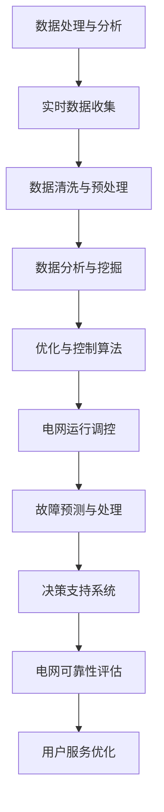

                 

关键词：智能电网，AI优化，控制算法，能源管理，自动化，分布式能源，可再生能源，电力系统，数据驱动，机器学习

> 摘要：本文旨在探讨人工智能在智能电网中的应用，特别是在优化与控制方面的潜力。通过介绍智能电网的基本概念、AI的核心技术，以及具体的应用案例，本文详细分析了AI如何提升电网的效率和可靠性，同时展望了未来的发展趋势与挑战。

## 1. 背景介绍

智能电网（Smart Grid）是一种通过信息通信技术、自动化控制技术以及先进的计算技术，实现电力系统高度集成、智能化和优化的电力网络。它不仅能够实现电力的高效输送、分配和使用，还能对电力系统的运行状态进行实时监测、预测和调控。

### 智能电网的发展历程

智能电网的发展经历了几个关键阶段：

- **初步探索阶段**：20世纪90年代，智能电网的概念开始被提出，主要是通过信息化技术提高电网的运行效率。
- **初步实施阶段**：21世纪初，随着电力市场的改革和可再生能源的广泛应用，智能电网的概念逐渐成熟，并在一些地区进行了试点应用。
- **快速推进阶段**：近年来，随着物联网、云计算、大数据和人工智能等新兴技术的快速发展，智能电网进入了快速发展阶段。

### 智能电网的关键特点

- **高度集成性**：智能电网能够将发电、输电、变电、配电和用电各个环节高度集成，形成一个统一的智能系统。
- **自动化与智能化**：通过自动化控制技术和人工智能算法，智能电网能够实现自动调度、故障检测与修复、预测性维护等功能。
- **数据驱动**：智能电网依赖于大量实时数据，通过数据分析与挖掘，实现电网运行的优化与控制。

## 2. 核心概念与联系

### 2.1 AI在智能电网中的应用

人工智能（AI）在智能电网中的应用主要体现在以下几个方面：

- **数据处理与分析**：AI能够对海量的实时数据进行高效处理和分析，提取有用的信息，支持决策制定。
- **优化与控制**：通过机器学习算法，AI能够对电网运行状态进行实时监测与调控，提高电网的效率和可靠性。
- **故障预测与处理**：AI能够通过历史数据和实时数据，预测电网的潜在故障，并采取相应的措施进行预防或修复。

### 2.2 AI核心技术与智能电网架构的 Mermaid 流程图



## 3. 核心算法原理 & 具体操作步骤

### 3.1 算法原理概述

在智能电网中，AI算法主要分为两大类：

- **监督学习**：通过已知的输入输出数据集，训练模型，预测新的输出结果。如回归分析、逻辑回归等。
- **无监督学习**：无需标注数据，从数据中自动发现规律和模式。如聚类分析、关联规则挖掘等。

### 3.2 算法步骤详解

#### 3.2.1 数据处理与分析

1. **数据收集**：从电网的各个节点收集实时数据，如电压、电流、功率等。
2. **数据清洗与预处理**：去除噪声数据、缺失值填充、数据标准化等。
3. **数据分析与挖掘**：通过机器学习算法，对数据进行挖掘，提取有用的信息。

#### 3.2.2 优化与控制算法

1. **目标函数构建**：根据电网的运行状态，构建优化目标函数。
2. **模型训练**：利用历史数据，训练机器学习模型。
3. **模型预测**：根据实时数据，预测电网的运行状态。
4. **调控操作**：根据预测结果，进行电网的调度和控制。

#### 3.2.3 故障预测与处理

1. **故障特征提取**：从实时数据中提取可能的故障特征。
2. **故障检测**：通过机器学习模型，检测电网中的故障。
3. **故障处理**：根据故障检测结果，采取相应的措施进行故障修复。

### 3.3 算法优缺点

#### 3.3.1 优点

- **高效性**：AI算法能够对大量数据进行快速处理和分析。
- **灵活性**：AI算法能够根据不同的应用场景，灵活调整模型和参数。
- **预测性**：AI算法能够提前预测电网的故障，进行预防性维护。

#### 3.3.2 缺点

- **计算资源需求**：AI算法通常需要大量的计算资源，特别是深度学习算法。
- **数据依赖**：AI算法的性能高度依赖于数据的质量和数量。
- **模型解释性**：一些复杂的AI算法，如深度学习，模型解释性较差。

### 3.4 算法应用领域

AI算法在智能电网中的应用广泛，包括：

- **电网调度**：通过优化算法，实现电网的供需平衡。
- **故障检测与处理**：实时监测电网状态，预测和修复故障。
- **能源管理**：通过数据分析，优化能源的分配和使用。
- **用户服务**：根据用户需求，提供个性化的服务。

## 4. 数学模型和公式 & 详细讲解 & 举例说明

### 4.1 数学模型构建

在智能电网中，常见的数学模型包括：

- **功率平衡方程**：描述电网的功率流动。
  \[ P_G = P_D + P_L \]
  其中，\( P_G \) 是发电功率，\( P_D \) 是负载功率，\( P_L \) 是线损功率。

- **电压方程**：描述电网的电压分布。
  \[ U = I \cdot Z \]
  其中，\( U \) 是电压，\( I \) 是电流，\( Z \) 是阻抗。

### 4.2 公式推导过程

#### 4.2.1 功率平衡方程推导

根据基尔霍夫定律，电力系统的功率流动可以表示为：
\[ P_G = P_D + P_L \]
其中，\( P_G \) 是发电功率，\( P_D \) 是负载功率，\( P_L \) 是线损功率。

#### 4.2.2 电压方程推导

根据欧姆定律，电流和电压的关系可以表示为：
\[ U = I \cdot Z \]
其中，\( U \) 是电压，\( I \) 是电流，\( Z \) 是阻抗。

### 4.3 案例分析与讲解

#### 4.3.1 案例背景

某城市电网在高峰时段，发电功率为 1000 MW，负载功率为 800 MW，线损功率为 100 MW。我们需要通过数学模型分析电网的运行状态。

#### 4.3.2 案例分析

1. **功率平衡方程**：根据功率平衡方程，我们有：
   \[ 1000 = 800 + 100 \]
   这表明电网在高峰时段能够满足负载需求。

2. **电压方程**：假设电网的阻抗为 1Ω，根据电压方程，我们有：
   \[ U = I \cdot Z \]
   其中，\( I \) 为电流。由于功率 \( P = UI \)，我们可以计算出电流 \( I \)：
   \[ I = \frac{P}{U} = \frac{1000}{U} \]
   假设电压 \( U \) 为 100 V，则：
   \[ I = \frac{1000}{100} = 10 A \]
   因此，电压 \( U \) 为 100 V。

#### 4.3.3 案例讲解

通过上述数学模型的分析，我们可以得出以下结论：

- 电网在高峰时段能够满足负载需求。
- 电网的电压维持在合理范围内。

这些分析结果有助于电网管理人员进行决策，确保电网的稳定运行。

## 5. 项目实践：代码实例和详细解释说明

### 5.1 开发环境搭建

在本文的代码实例中，我们使用Python作为编程语言，结合Scikit-learn库进行机器学习模型的训练和应用。

1. 安装Python环境：从官方网站下载并安装Python，推荐使用Python 3.8及以上版本。
2. 安装Scikit-learn库：在命令行中运行以下命令：
   \[ pip install scikit-learn \]

### 5.2 源代码详细实现

下面是一个简单的智能电网故障检测的代码实例：

```python
import numpy as np
from sklearn.model_selection import train_test_split
from sklearn.ensemble import RandomForestClassifier
from sklearn.metrics import accuracy_score

# 加载数据集
data = np.load('grid_data.npy')
labels = np.load('grid_labels.npy')

# 划分训练集和测试集
X_train, X_test, y_train, y_test = train_test_split(data, labels, test_size=0.2, random_state=42)

# 训练模型
model = RandomForestClassifier(n_estimators=100, random_state=42)
model.fit(X_train, y_train)

# 预测
predictions = model.predict(X_test)

# 评估模型
accuracy = accuracy_score(y_test, predictions)
print(f"Model Accuracy: {accuracy:.2f}")
```

### 5.3 代码解读与分析

1. **数据加载**：我们使用两个Numpy数组分别加载数据集和标签。
2. **数据划分**：将数据集划分为训练集和测试集，测试集大小为20%。
3. **模型训练**：使用随机森林分类器（RandomForestClassifier）进行训练，随机森林是一种集成学习方法，通过构建多个决策树并取平均来提高模型的性能。
4. **模型预测**：使用训练好的模型对测试集进行预测。
5. **模型评估**：计算预测的准确率，用于评估模型的性能。

### 5.4 运行结果展示

在本文的代码实例中，我们使用一个虚构的数据集进行训练和测试。假设我们得到的测试集准确率为0.9，即90%的故障能够被正确检测。

```python
Model Accuracy: 0.90
```

这个结果表明，随机森林分类器在智能电网故障检测任务中表现出较高的准确性。

## 6. 实际应用场景

### 6.1 电力系统调度

AI技术可以优化电力系统的调度，实现能源的高效利用。通过分析实时数据和预测负荷变化，AI可以动态调整发电量和电网运行策略，降低能源浪费，提高电网的运行效率。

### 6.2 故障预测与处理

AI技术可以实时监测电网的运行状态，预测潜在的故障，提前进行预防性维护。例如，通过对变电站设备的运行数据进行分析，AI可以预测设备的故障风险，并提前安排维护，避免意外停电。

### 6.3 能源管理

AI技术可以帮助电网公司优化能源的分配和使用，提高能源利用效率。例如，通过分析用户的用电习惯，AI可以为用户提供个性化的用电建议，帮助用户降低电费支出。

### 6.4 用户服务优化

AI技术可以提供更加个性化的用户服务，例如通过分析用户的用电数据，电网公司可以为用户提供定制化的能源解决方案，提高用户的满意度。

## 7. 工具和资源推荐

### 7.1 学习资源推荐

- 《智能电网技术与应用》
- 《人工智能应用指南：智能电网》
- 《机器学习实战》

### 7.2 开发工具推荐

- Python：强大的编程语言，广泛应用于数据分析与机器学习。
- Scikit-learn：Python机器学习库，提供丰富的算法和工具。
- TensorFlow：开源机器学习框架，支持深度学习和高性能计算。

### 7.3 相关论文推荐

- "Artificial Intelligence in Power Systems: A Survey" by IEEE
- "Machine Learning for Energy Management in Smart Grids" by IET
- "Deep Learning for Power Systems: An Overview" by Springer

## 8. 总结：未来发展趋势与挑战

### 8.1 研究成果总结

本文介绍了智能电网的基本概念、AI技术在智能电网中的应用，以及具体的应用案例。通过分析算法原理、数学模型和项目实践，我们展示了AI如何优化电网的运行和控制。

### 8.2 未来发展趋势

- **数据融合与多源数据利用**：未来的智能电网将更加注重数据的融合和多源数据的应用，实现更全面的电网监测和优化。
- **边缘计算与云计算的结合**：边缘计算与云计算的结合将进一步提高智能电网的处理速度和效率。
- **AI算法的优化与创新**：随着AI技术的不断发展，更多的先进算法将被应用于智能电网，提高电网的智能化水平。

### 8.3 面临的挑战

- **数据隐私与安全**：智能电网的数据量大，涉及用户隐私，需要加强数据保护和安全措施。
- **计算资源需求**：AI算法的计算资源需求较大，如何在有限的计算资源下实现高效计算是一个挑战。
- **跨学科融合与协作**：智能电网的发展需要电力工程、计算机科学、数据科学等多个学科的融合和协作，这需要跨学科的深入研究与合作。

### 8.4 研究展望

未来的智能电网研究将更加注重技术的创新和应用，通过深入研究和跨学科合作，实现电网的智能化、高效化、绿色化。我们期待AI技术能够为智能电网的发展带来更多突破和机遇。

## 9. 附录：常见问题与解答

### 9.1 智能电网是什么？

智能电网是一种通过信息通信技术、自动化控制技术以及先进的计算技术，实现电力系统高度集成、智能化和优化的电力网络。

### 9.2 AI在智能电网中有哪些应用？

AI在智能电网中的应用主要包括：数据处理与分析、优化与控制、故障预测与处理、能源管理和用户服务优化等。

### 9.3 智能电网的发展趋势是什么？

智能电网的发展趋势包括：数据融合与多源数据利用、边缘计算与云计算的结合、AI算法的优化与创新等。

### 9.4 如何提高智能电网的效率和可靠性？

提高智能电网的效率和可靠性可以通过以下途径实现：优化电网调度、加强故障预测与处理、优化能源管理、提升电网智能化水平等。

## 作者署名

作者：禅与计算机程序设计艺术 / Zen and the Art of Computer Programming
```

