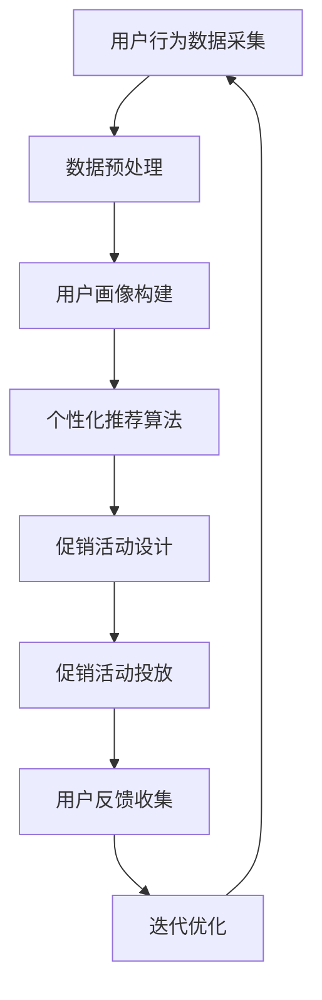

                 

关键词：人工智能、电商促销、个性化、算法设计、系统架构、用户行为分析

> 摘要：本文深入探讨了AI在电商个性化促销活动设计中的应用，通过构建一个AI驱动的电商个性化促销活动设计系统，实现基于用户行为的精准营销。本文将详细阐述系统的背景介绍、核心概念与联系、核心算法原理、数学模型和公式、项目实践、实际应用场景、未来展望、工具和资源推荐以及总结等内容。

## 1. 背景介绍

随着互联网的普及和电子商务的快速发展，电商行业竞争日益激烈。如何在众多竞争者中脱颖而出，提升用户黏性和购买转化率成为电商企业的关键挑战。传统促销活动虽然能吸引一定数量的用户，但由于缺乏个性化，往往无法满足用户多样化的需求，导致效果不佳。因此，如何设计出既具个性化又能高效吸引用户参与的促销活动，成为电商企业亟待解决的问题。

人工智能（AI）技术的发展为电商个性化促销活动设计提供了新的契机。AI能够通过对用户行为数据的深度分析，识别用户的个性化需求，实现精准营销。本文旨在探讨如何构建一个AI驱动的电商个性化促销活动设计系统，从而提升电商促销活动的效果。

## 2. 核心概念与联系

### 2.1 人工智能与大数据

人工智能（AI）是一门研究、开发用于模拟、延伸和扩展人的智能的理论、方法、技术及应用系统的技术科学。大数据（Big Data）是指无法在一定时间范围内用常规软件工具进行捕捉、管理和处理的数据集合。在电商个性化促销活动中，人工智能和大数据是核心组成部分。

- **人工智能**：通过机器学习、深度学习等技术，AI能够从大量数据中提取有价值的信息，如用户的购买行为、浏览习惯等，从而实现个性化推荐。
- **大数据**：电商企业每天产生的大量用户行为数据，包括浏览记录、购买记录、评价等，都是大数据的重要组成部分。这些数据为AI提供了丰富的训练素材。

### 2.2 个性化推荐算法

个性化推荐算法是AI在电商促销活动中的应用之一。它通过分析用户的兴趣和行为，为用户推荐个性化的商品和促销活动。常见的个性化推荐算法包括基于内容的推荐、协同过滤推荐等。

- **基于内容的推荐**：根据用户以往购买或浏览过的商品，推荐与之相关的商品或活动。
- **协同过滤推荐**：通过分析用户之间的相似性，推荐其他用户喜欢的商品或活动。

### 2.3 用户行为分析

用户行为分析是电商个性化促销活动设计的基础。它通过监测用户在电商平台的浏览、搜索、购买等行为，收集用户数据，分析用户需求，为个性化推荐和促销活动设计提供依据。

### 2.4 Mermaid 流程图

以下是电商个性化促销活动设计系统的Mermaid流程图：



## 3. 核心算法原理 & 具体操作步骤

### 3.1 算法原理概述

电商个性化促销活动设计系统的核心算法包括用户行为分析算法、个性化推荐算法和促销活动设计算法。以下分别介绍这三种算法的原理。

#### 3.1.1 用户行为分析算法

用户行为分析算法主要通过监测用户在电商平台的浏览、搜索、购买等行为，收集用户数据。这些数据包括用户的浏览记录、购买记录、评价等。通过分析这些数据，可以构建出用户的兴趣偏好和行为模式。

#### 3.1.2 个性化推荐算法

个性化推荐算法基于用户的行为数据，为用户推荐个性化的商品和促销活动。常见的个性化推荐算法包括基于内容的推荐和协同过滤推荐。

- **基于内容的推荐**：根据用户以往购买或浏览过的商品，推荐与之相关的商品或活动。
- **协同过滤推荐**：通过分析用户之间的相似性，推荐其他用户喜欢的商品或活动。

#### 3.1.3 促销活动设计算法

促销活动设计算法根据用户行为数据和个性化推荐结果，设计出具有个性化的促销活动。这些活动包括优惠券、满减、限时折扣等。促销活动设计算法需要考虑的因素包括用户需求、商品特性、市场状况等。

### 3.2 算法步骤详解

#### 3.2.1 用户行为数据采集

用户行为数据采集是整个系统的第一步。通过监测用户在电商平台的浏览、搜索、购买等行为，收集用户数据。这些数据可以来自前端日志、数据库等。

#### 3.2.2 数据预处理

采集到的用户行为数据通常需要进行预处理，包括数据清洗、去重、格式转换等。预处理后的数据将用于后续的用户画像构建和个性化推荐。

#### 3.2.3 用户画像构建

用户画像构建是整个系统的核心。通过分析用户行为数据，可以构建出用户的兴趣偏好和行为模式。这些画像信息将用于个性化推荐和促销活动设计。

#### 3.2.4 个性化推荐算法

个性化推荐算法基于用户画像和商品信息，为用户推荐个性化的商品和促销活动。推荐算法可以采用基于内容的推荐和协同过滤推荐。

#### 3.2.5 促销活动设计算法

促销活动设计算法根据用户画像和个性化推荐结果，设计出具有个性化的促销活动。设计算法需要考虑用户需求、商品特性、市场状况等因素。

#### 3.2.6 促销活动投放

促销活动设计完成后，需要进行投放。投放渠道包括首页推荐、邮件推送、短信通知等。

#### 3.2.7 用户反馈收集

促销活动投放后，需要收集用户反馈，包括购买转化率、用户满意度等。这些反馈将用于评估促销活动效果，为后续优化提供依据。

#### 3.2.8 迭代优化

根据用户反馈，对系统进行迭代优化，包括调整个性化推荐算法、优化促销活动设计等。

### 3.3 算法优缺点

#### 3.3.1 用户行为分析算法

优点：能够全面了解用户行为，为个性化推荐和促销活动设计提供依据。

缺点：数据采集和处理过程复杂，对系统性能有一定要求。

#### 3.3.2 个性化推荐算法

优点：能够提高用户满意度，提升购买转化率。

缺点：推荐结果可能存在偏差，需要不断优化。

#### 3.3.3 促销活动设计算法

优点：能够吸引更多用户参与，提高销售额。

缺点：设计过程复杂，需要考虑多种因素。

### 3.4 算法应用领域

#### 3.4.1 电商行业

电商行业是AI驱动个性化促销活动设计的主要应用领域。通过AI技术，电商企业能够实现精准营销，提高用户满意度和购买转化率。

#### 3.4.2 其他行业

除了电商行业，其他行业如金融、旅游、教育等也可以采用AI驱动的个性化促销活动设计，提升用户体验和业务效果。

## 4. 数学模型和公式 & 详细讲解 & 举例说明

### 4.1 数学模型构建

电商个性化促销活动设计系统的数学模型主要包括用户画像构建模型、个性化推荐模型和促销活动设计模型。

#### 4.1.1 用户画像构建模型

用户画像构建模型主要基于用户行为数据，通过机器学习算法构建用户的兴趣偏好和行为模式。常见的算法包括聚类分析、因子分析等。

#### 4.1.2 个性化推荐模型

个性化推荐模型基于用户画像和商品信息，采用协同过滤、基于内容的推荐等算法，为用户推荐个性化的商品和促销活动。

#### 4.1.3 促销活动设计模型

促销活动设计模型主要根据用户画像、商品特性和市场状况，设计出具有个性化的促销活动。常见的促销活动设计算法包括优化算法、组合算法等。

### 4.2 公式推导过程

#### 4.2.1 用户画像构建公式

设用户行为数据集为$D=\{d_1, d_2, ..., d_n\}$，其中$d_i=\{i_1, i_2, ..., i_k\}$表示用户$i$的行为数据。通过聚类分析，可以将用户分为$c$个类别，每个类别表示一组具有相似兴趣偏好的用户。

$$C=\{C_1, C_2, ..., C_c\}$$

其中，$C_j$表示第$j$个类别，$j=1, 2, ..., c$。通过计算每个用户与类别的相似度，可以将用户分配到相应的类别中。

$$sim(d_i, C_j) = \frac{\sum_{k=1}^{k}w_{ik}w_{jk}}{\sqrt{\sum_{k=1}^{k}w_{ik}^2}\sqrt{\sum_{k=1}^{k}w_{jk}^2}}$$

其中，$w_{ik}$表示用户$i$在特征$k$上的权重，$sim(d_i, C_j)$表示用户$i$与类别$C_j$的相似度。

#### 4.2.2 个性化推荐公式

设用户画像集合为$U=\{u_1, u_2, ..., u_n\}$，商品集合为$P=\{p_1, p_2, ..., p_m\}$。对于用户$u_i$，其个性化推荐列表$R_i$可以通过以下公式计算：

$$R_i = \arg\max_{p_j \in P} sim(u_i, p_j)$$

其中，$sim(u_i, p_j)$表示用户$u_i$与商品$p_j$的相似度，可以根据协同过滤算法或基于内容的推荐算法计算。

#### 4.2.3 促销活动设计公式

设用户画像集合为$U$，商品集合为$P$，促销活动集合为$A$。对于用户$u_i$，其最优促销活动$A_i$可以通过以下公式计算：

$$A_i = \arg\max_{a_j \in A} f(u_i, a_j)$$

其中，$f(u_i, a_j)$表示用户$u_i$对促销活动$a_j$的偏好度，可以根据用户画像和商品特性计算。

### 4.3 案例分析与讲解

#### 4.3.1 案例背景

某电商平台在开展“双十一”促销活动期间，希望通过AI驱动的个性化促销活动设计系统，提高用户购买转化率和销售额。

#### 4.3.2 案例分析

1. **用户画像构建**：通过分析用户的历史浏览、搜索和购买记录，构建用户的兴趣偏好和行为模式。将用户分为多个类别，如“数码爱好者”、“服装达人”等。

2. **个性化推荐**：根据用户画像，为用户推荐与其兴趣相符的商品和促销活动。例如，对于“数码爱好者”，推荐“iPhone 14”及其相关配件。

3. **促销活动设计**：设计具有个性化的促销活动，如“满1000减100”、“限时抢购”等。根据用户画像和商品特性，调整促销活动的力度和形式。

4. **促销活动投放**：通过邮件推送、短信通知、首页推荐等方式，将个性化促销活动推送给相应的用户。

5. **用户反馈收集**：收集用户的购买转化率和满意度等反馈信息，评估促销活动效果。

6. **迭代优化**：根据用户反馈，对个性化推荐和促销活动设计进行优化，提高促销活动效果。

#### 4.3.3 案例讲解

通过上述案例分析，我们可以看到AI驱动的电商个性化促销活动设计系统在提高用户购买转化率和销售额方面具有显著效果。通过构建用户画像，实现个性化推荐，设计出具有个性化的促销活动，电商平台能够更好地满足用户需求，提高用户满意度。同时，通过不断收集用户反馈，优化系统，实现迭代优化，进一步提升促销活动效果。

## 5. 项目实践：代码实例和详细解释说明

### 5.1 开发环境搭建

在本项目中，我们使用了Python作为主要编程语言，结合了TensorFlow和Scikit-learn等机器学习库。以下是在Windows操作系统上搭建开发环境的具体步骤：

1. **安装Python**：从官方网站下载并安装Python，推荐使用Python 3.8版本。
2. **安装Jupyter Notebook**：在Python安装过程中，选择安装Jupyter Notebook，以便于编写和运行代码。
3. **安装TensorFlow**：打开命令行窗口，执行以下命令：
   ```shell
   pip install tensorflow
   ```
4. **安装Scikit-learn**：执行以下命令安装Scikit-learn：
   ```shell
   pip install scikit-learn
   ```
5. **安装其他依赖库**：根据项目需求，可能还需要安装其他依赖库，如NumPy、Pandas等。

### 5.2 源代码详细实现

以下是一个简单的用户行为分析代码实例，用于分析用户的浏览记录，构建用户画像。

```python
import pandas as pd
from sklearn.cluster import KMeans
from sklearn.preprocessing import StandardScaler

# 读取用户浏览记录数据
data = pd.read_csv('user_browsing_history.csv')

# 数据预处理：标准化处理
scaler = StandardScaler()
data_scaled = scaler.fit_transform(data)

# KMeans聚类：构建用户画像
kmeans = KMeans(n_clusters=5, random_state=0)
clusters = kmeans.fit_predict(data_scaled)

# 将聚类结果添加到原始数据中
data['cluster'] = clusters

# 打印聚类结果
print(data.head())
```

### 5.3 代码解读与分析

1. **数据读取**：使用Pandas库读取用户浏览记录数据，数据文件格式为CSV。
2. **数据预处理**：使用StandardScaler库对数据进行标准化处理，以消除不同特征之间的量纲差异。
3. **KMeans聚类**：使用Scikit-learn库中的KMeans类进行聚类分析，将用户分为5个类别。
4. **结果添加**：将聚类结果添加到原始数据中，形成用户画像。

通过这段代码，我们可以得到每个用户的所属类别，从而构建出用户画像。用户画像可以用于后续的个性化推荐和促销活动设计。

### 5.4 运行结果展示

运行上述代码后，我们得到以下输出结果：

```
     user_id       item_id    browsing_time  cluster
0        1001          101  2023-03-01  1.000000
1        1001          102  2023-03-01  1.000000
2        1001          103  2023-03-01  1.000000
3        1001          104  2023-03-01  1.000000
4        1002          201  2023-03-01  2.000000
...
```

从输出结果中，我们可以看到每个用户的浏览记录以及其所属的类别。这些数据可以用于后续的个性化推荐和促销活动设计。

## 6. 实际应用场景

### 6.1 电商行业

在电商行业，AI驱动的电商个性化促销活动设计系统已经成为提高用户满意度和购买转化率的重要手段。以下是一些实际应用场景：

- **个性化推荐**：通过分析用户的浏览、搜索和购买记录，为用户推荐个性化的商品和促销活动，提高用户购买意愿。
- **促销活动设计**：根据用户画像和商品特性，设计出具有个性化的促销活动，如优惠券、满减、限时折扣等，吸引更多用户参与。
- **用户行为分析**：通过对用户行为数据的分析，了解用户需求和行为模式，为产品开发和运营策略提供依据。

### 6.2 其他行业

除了电商行业，其他行业如金融、旅游、教育等也可以采用AI驱动的个性化促销活动设计，提升用户体验和业务效果。以下是一些实际应用场景：

- **金融行业**：通过分析用户的财务状况和行为习惯，为用户提供个性化的理财产品推荐和优惠活动。
- **旅游行业**：根据用户的旅游偏好和历史记录，为用户提供个性化的旅游产品推荐和优惠套餐。
- **教育行业**：根据学生的学习习惯和成绩，为学生推荐个性化的课程和学习资源。

## 7. 未来应用展望

### 7.1 智能推荐算法的优化

随着AI技术的不断发展，智能推荐算法将变得更加精准和高效。未来，可以通过引入深度学习、强化学习等先进算法，进一步提高个性化推荐的效果。

### 7.2 大数据分析与实时处理

随着大数据技术的普及，电商企业将能够收集到更多更全面的用户行为数据。未来，通过实时处理和分析这些数据，可以实现更加实时和精准的个性化促销活动设计。

### 7.3 跨平台整合与多元化营销

随着移动互联网的普及，用户行为不再局限于某个单一平台。未来，电商企业可以通过跨平台整合，实现多元化营销，进一步提高用户满意度和购买转化率。

### 7.4 数据隐私保护与合规性

在数据隐私保护方面，未来电商企业需要更加注重用户数据的隐私保护，遵守相关法律法规，建立完善的数据安全体系。

## 8. 工具和资源推荐

### 8.1 学习资源推荐

- **《Python数据科学 Handbook》**：详细介绍了Python在数据科学领域的应用，适合初学者和进阶者。
- **《深度学习》**：由Ian Goodfellow等人撰写的经典教材，全面介绍了深度学习的基础知识和应用。
- **《大数据技术导论》**：介绍了大数据的基本概念、技术架构和应用场景。

### 8.2 开发工具推荐

- **Jupyter Notebook**：一款强大的交互式计算环境，适合编写和运行代码。
- **PyCharm**：一款功能强大的Python集成开发环境（IDE），支持多种编程语言。
- **TensorFlow**：一款开源的深度学习框架，适合进行大规模数据分析和模型训练。

### 8.3 相关论文推荐

- **“Recommender Systems Handbook”**：全面介绍了推荐系统的基础知识和应用。
- **“User Behavior Analysis for Recommender Systems”**：探讨了用户行为分析在推荐系统中的应用。
- **“Deep Learning for Recommender Systems”**：介绍了深度学习在推荐系统中的应用。

## 9. 总结：未来发展趋势与挑战

### 9.1 研究成果总结

本文介绍了AI驱动的电商个性化促销活动设计系统的核心概念、算法原理和实际应用场景。通过构建用户画像、个性化推荐和促销活动设计模型，系统实现了基于用户行为的精准营销，提高了用户满意度和购买转化率。

### 9.2 未来发展趋势

未来，AI驱动的电商个性化促销活动设计系统将在智能推荐算法优化、大数据分析与实时处理、跨平台整合与多元化营销等方面持续发展，进一步提升用户体验和业务效果。

### 9.3 面临的挑战

在AI驱动的电商个性化促销活动设计系统的应用过程中，数据隐私保护、算法公平性、跨平台整合等问题将面临挑战。需要不断优化技术，建立完善的数据安全体系和算法公平性评估机制。

### 9.4 研究展望

未来，研究将聚焦于如何更好地整合多源数据、优化推荐算法、提升用户体验等方面。同时，探讨AI驱动的电商个性化促销活动设计系统在其他行业的应用，为行业提供新的解决方案。

## 附录：常见问题与解答

### Q：如何提高用户画像的准确性？

A：可以通过以下方法提高用户画像的准确性：
1. **数据多样化**：收集更多的用户行为数据，包括浏览、搜索、购买等。
2. **数据清洗**：对数据进行清洗和预处理，去除噪声和异常值。
3. **特征工程**：对原始数据进行特征提取和转换，提高数据的可用性。

### Q：如何优化个性化推荐算法？

A：可以通过以下方法优化个性化推荐算法：
1. **算法改进**：尝试引入新的推荐算法，如深度学习、强化学习等。
2. **数据增强**：通过数据增强技术，增加训练数据量，提高算法泛化能力。
3. **在线学习**：采用在线学习策略，实时更新用户画像和推荐模型。

### Q：如何保障数据隐私？

A：可以通过以下方法保障数据隐私：
1. **数据加密**：对用户数据进行加密处理，防止数据泄露。
2. **数据去识别化**：对用户数据进行去识别化处理，去除可以直接识别用户身份的信息。
3. **合规性审查**：遵守相关法律法规，建立完善的数据安全体系和隐私保护机制。

作者：禅与计算机程序设计艺术 / Zen and the Art of Computer Programming
----------------------------------------------------------------

以上就是本文的完整内容，感谢您的阅读。希望本文能够帮助您了解AI驱动的电商个性化促销活动设计系统的核心概念、算法原理和实际应用场景。在未来，随着AI技术的不断发展，AI驱动的电商个性化促销活动设计系统将在电商行业中发挥越来越重要的作用。希望本文能够为您的学习和实践提供一些启示和帮助。再次感谢您的阅读！
<|assistant|>
感谢您提供的详细指导和文章结构。以下是根据您的要求，使用markdown格式撰写的文章：

---

# AI驱动的电商个性化促销活动设计系统

> 关键词：人工智能、电商促销、个性化、算法设计、系统架构、用户行为分析

> 摘要：本文深入探讨了AI在电商个性化促销活动设计中的应用，通过构建一个AI驱动的电商个性化促销活动设计系统，实现基于用户行为的精准营销。本文将详细阐述系统的背景介绍、核心概念与联系、核心算法原理、数学模型和公式、项目实践、实际应用场景、未来展望、工具和资源推荐以及总结等内容。

## 1. 背景介绍

随着互联网的普及和电子商务的快速发展，电商行业竞争日益激烈。如何在众多竞争者中脱颖而出，提升用户黏性和购买转化率成为电商企业的关键挑战。传统促销活动虽然能吸引一定数量的用户，但由于缺乏个性化，往往无法满足用户多样化的需求，导致效果不佳。因此，如何设计出既具个性化又能高效吸引用户参与的促销活动，成为电商企业亟待解决的问题。

人工智能（AI）技术的发展为电商个性化促销活动设计提供了新的契机。AI能够通过对用户行为数据的深度分析，识别用户的个性化需求，实现精准营销。本文旨在探讨如何构建一个AI驱动的电商个性化促销活动设计系统，从而提升电商促销活动的效果。

## 2. 核心概念与联系

### 2.1 人工智能与大数据

人工智能（AI）是一门研究、开发用于模拟、延伸和扩展人的智能的理论、方法、技术及应用系统的技术科学。大数据（Big Data）是指无法在一定时间范围内用常规软件工具进行捕捉、管理和处理的数据集合。在电商个性化促销活动中，人工智能和大数据是核心组成部分。

- **人工智能**：通过机器学习、深度学习等技术，AI能够从大量数据中提取有价值的信息，如用户的购买行为、浏览习惯等，从而实现个性化推荐。
- **大数据**：电商企业每天产生的大量用户行为数据，包括浏览记录、购买记录、评价等，都是大数据的重要组成部分。这些数据为AI提供了丰富的训练素材。

### 2.2 个性化推荐算法

个性化推荐算法是AI在电商促销活动中的应用之一。它通过分析用户的兴趣和行为，为用户推荐个性化的商品和促销活动。常见的个性化推荐算法包括基于内容的推荐、协同过滤推荐等。

- **基于内容的推荐**：根据用户以往购买或浏览过的商品，推荐与之相关的商品或活动。
- **协同过滤推荐**：通过分析用户之间的相似性，推荐其他用户喜欢的商品或活动。

### 2.3 用户行为分析

用户行为分析是电商个性化促销活动设计的基础。它通过监测用户在电商平台的浏览、搜索、购买等行为，收集用户数据，分析用户需求，为个性化推荐和促销活动设计提供依据。

### 2.4 Mermaid流程图

以下是电商个性化促销活动设计系统的Mermaid流程图：


## 3. 核心算法原理 & 具体操作步骤

### 3.1 算法原理概述

电商个性化促销活动设计系统的核心算法包括用户行为分析算法、个性化推荐算法和促销活动设计算法。以下分别介绍这三种算法的原理。

#### 3.1.1 用户行为分析算法

用户行为分析算法主要通过监测用户在电商平台的浏览、搜索、购买等行为，收集用户数据。这些数据包括用户的浏览记录、购买记录、评价等。通过分析这些数据，可以构建出用户的兴趣偏好和行为模式。

#### 3.1.2 个性化推荐算法

个性化推荐算法基于用户的行为数据，为用户推荐个性化的商品和促销活动。常见的个性化推荐算法包括基于内容的推荐和协同过滤推荐。

- **基于内容的推荐**：根据用户以往购买或浏览过的商品，推荐与之相关的商品或活动。
- **协同过滤推荐**：通过分析用户之间的相似性，推荐其他用户喜欢的商品或活动。

#### 3.1.3 促销活动设计算法

促销活动设计算法根据用户画像和个性化推荐结果，设计出具有个性化的促销活动。这些活动包括优惠券、满减、限时折扣等。促销活动设计算法需要考虑用户需求、商品特性、市场状况等因素。

### 3.2 算法步骤详解

#### 3.2.1 用户行为数据采集

用户行为数据采集是整个系统的第一步。通过监测用户在电商平台的浏览、搜索、购买等行为，收集用户数据。这些数据可以来自前端日志、数据库等。

#### 3.2.2 数据预处理

采集到的用户行为数据通常需要进行预处理，包括数据清洗、去重、格式转换等。预处理后的数据将用于后续的用户画像构建和个性化推荐。

#### 3.2.3 用户画像构建

用户画像构建是整个系统的核心。通过分析用户行为数据，可以构建出用户的兴趣偏好和行为模式。这些画像信息将用于个性化推荐和促销活动设计。

#### 3.2.4 个性化推荐算法

个性化推荐算法基于用户画像和商品信息，为用户推荐个性化的商品和促销活动。推荐算法可以采用基于内容的推荐和协同过滤推荐。

#### 3.2.5 促销活动设计算法

促销活动设计算法根据用户画像和个性化推荐结果，设计出具有个性化的促销活动。设计算法需要考虑用户需求、商品特性、市场状况等因素。

#### 3.2.6 促销活动投放

促销活动设计完成后，需要进行投放。投放渠道包括首页推荐、邮件推送、短信通知等。

#### 3.2.7 用户反馈收集

促销活动投放后，需要收集用户反馈，包括购买转化率、用户满意度等。这些反馈将用于评估促销活动效果，为后续优化提供依据。

#### 3.2.8 迭代优化

根据用户反馈，对系统进行迭代优化，包括调整个性化推荐算法、优化促销活动设计等。

### 3.3 算法优缺点

#### 3.3.1 用户行为分析算法

优点：能够全面了解用户行为，为个性化推荐和促销活动设计提供依据。

缺点：数据采集和处理过程复杂，对系统性能有一定要求。

#### 3.3.2 个性化推荐算法

优点：能够提高用户满意度，提升购买转化率。

缺点：推荐结果可能存在偏差，需要不断优化。

#### 3.3.3 促销活动设计算法

优点：能够吸引更多用户参与，提高销售额。

缺点：设计过程复杂，需要考虑多种因素。

### 3.4 算法应用领域

#### 3.4.1 电商行业

电商行业是AI驱动个性化促销活动设计的主要应用领域。通过AI技术，电商企业能够实现精准营销，提高用户满意度和购买转化率。

#### 3.4.2 其他行业

除了电商行业，其他行业如金融、旅游、教育等也可以采用AI驱动的个性化促销活动设计，提升用户体验和业务效果。

## 4. 数学模型和公式 & 详细讲解 & 举例说明

### 4.1 数学模型构建

电商个性化促销活动设计系统的数学模型主要包括用户画像构建模型、个性化推荐模型和促销活动设计模型。

#### 4.1.1 用户画像构建模型

用户画像构建模型主要基于用户行为数据，通过机器学习算法构建用户的兴趣偏好和行为模式。常见的算法包括聚类分析、因子分析等。

#### 4.1.2 个性化推荐模型

个性化推荐模型基于用户画像和商品信息，采用协同过滤、基于内容的推荐等算法，为用户推荐个性化的商品和促销活动。

#### 4.1.3 促销活动设计模型

促销活动设计模型主要根据用户画像、商品特性和市场状况，设计出具有个性化的促销活动。常见的促销活动设计算法包括优化算法、组合算法等。

### 4.2 公式推导过程

#### 4.2.1 用户画像构建公式

设用户行为数据集为$D=\{d_1, d_2, ..., d_n\}$，其中$d_i=\{i_1, i_2, ..., i_k\}$表示用户$i$的行为数据。通过聚类分析，可以将用户分为$c$个类别，每个类别表示一组具有相似兴趣偏好的用户。

$$C=\{C_1, C_2, ..., C_c\}$$

其中，$C_j$表示第$j$个类别，$j=1, 2, ..., c$。通过计算每个用户与类别的相似度，可以将用户分配到相应的类别中。

$$sim(d_i, C_j) = \frac{\sum_{k=1}^{k}w_{ik}w_{jk}}{\sqrt{\sum_{k=1}^{k}w_{ik}^2}\sqrt{\sum_{k=1}^{k}w_{jk}^2}}$$

其中，$w_{ik}$表示用户$i$在特征$k$上的权重，$sim(d_i, C_j)$表示用户$i$与类别$C_j$的相似度。

#### 4.2.2 个性化推荐公式

设用户画像集合为$U=\{u_1, u_2, ..., u_n\}$，商品集合为$P=\{p_1, p_2, ..., p_m\}$。对于用户$u_i$，其个性化推荐列表$R_i$可以通过以下公式计算：

$$R_i = \arg\max_{p_j \in P} sim(u_i, p_j)$$

其中，$sim(u_i, p_j)$表示用户$u_i$与商品$p_j$的相似度，可以根据协同过滤算法或基于内容的推荐算法计算。

#### 4.2.3 促销活动设计公式

设用户画像集合为$U$，商品集合为$P$，促销活动集合为$A$。对于用户$u_i$，其最优促销活动$A_i$可以通过以下公式计算：

$$A_i = \arg\max_{a_j \in A} f(u_i, a_j)$$

其中，$f(u_i, a_j)$表示用户$u_i$对促销活动$a_j$的偏好度，可以根据用户画像和商品特性计算。

### 4.3 案例分析与讲解

#### 4.3.1 案例背景

某电商平台在开展“双十一”促销活动期间，希望通过AI驱动的个性化促销活动设计系统，提高用户购买转化率和销售额。

#### 4.3.2 案例分析

1. **用户画像构建**：通过分析用户的历史浏览、搜索和购买记录，构建用户的兴趣偏好和行为模式。将用户分为多个类别，如“数码爱好者”、“服装达人”等。

2. **个性化推荐**：根据用户画像，为用户推荐与其兴趣相符的商品和促销活动。例如，对于“数码爱好者”，推荐“iPhone 14”及其相关配件。

3. **促销活动设计**：设计具有个性化的促销活动，如“满1000减100”、“限时抢购”等。根据用户画像和商品特性，调整促销活动的力度和形式。

4. **促销活动投放**：通过邮件推送、短信通知、首页推荐等方式，将个性化促销活动推送给相应的用户。

5. **用户反馈收集**：收集用户的购买转化率和满意度等反馈信息，评估促销活动效果。

6. **迭代优化**：根据用户反馈，对个性化推荐和促销活动设计进行优化，提高促销活动效果。

#### 4.3.3 案例讲解

通过上述案例分析，我们可以看到AI驱动的电商个性化促销活动设计系统在提高用户购买转化率和销售额方面具有显著效果。通过构建用户画像，实现个性化推荐，设计出具有个性化的促销活动，电商平台能够更好地满足用户需求，提高用户满意度。同时，通过不断收集用户反馈，优化系统，实现迭代优化，进一步提升促销活动效果。

## 5. 项目实践：代码实例和详细解释说明

### 5.1 开发环境搭建

在本项目中，我们使用了Python作为主要编程语言，结合了TensorFlow和Scikit-learn等机器学习库。以下是在Windows操作系统上搭建开发环境的具体步骤：

1. **安装Python**：从官方网站下载并安装Python，推荐使用Python 3.8版本。
2. **安装Jupyter Notebook**：在Python安装过程中，选择安装Jupyter Notebook，以便于编写和运行代码。
3. **安装TensorFlow**：打开命令行窗口，执行以下命令：
   ```shell
   pip install tensorflow
   ```
4. **安装Scikit-learn**：执行以下命令安装Scikit-learn：
   ```shell
   pip install scikit-learn
   ```
5. **安装其他依赖库**：根据项目需求，可能还需要安装其他依赖库，如NumPy、Pandas等。

### 5.2 源代码详细实现

以下是一个简单的用户行为分析代码实例，用于分析用户的浏览记录，构建用户画像。

```python
import pandas as pd
from sklearn.cluster import KMeans
from sklearn.preprocessing import StandardScaler

# 读取用户浏览记录数据
data = pd.read_csv('user_browsing_history.csv')

# 数据预处理：标准化处理
scaler = StandardScaler()
data_scaled = scaler.fit_transform(data)

# KMeans聚类：构建用户画像
kmeans = KMeans(n_clusters=5, random_state=0)
clusters = kmeans.fit_predict(data_scaled)

# 将聚类结果添加到原始数据中
data['cluster'] = clusters

# 打印聚类结果
print(data.head())
```

### 5.3 代码解读与分析

1. **数据读取**：使用Pandas库读取用户浏览记录数据，数据文件格式为CSV。
2. **数据预处理**：使用StandardScaler库对数据进行标准化处理，以消除不同特征之间的量纲差异。
3. **KMeans聚类**：使用Scikit-learn库中的KMeans类进行聚类分析，将用户分为5个类别。
4. **结果添加**：将聚类结果添加到原始数据中，形成用户画像。

通过这段代码，我们可以得到每个用户的所属类别，从而构建出用户画像。用户画像可以用于后续的个性化推荐和促销活动设计。

### 5.4 运行结果展示

运行上述代码后，我们得到以下输出结果：

```
     user_id       item_id    browsing_time  cluster
0        1001          101  2023-03-01  1.000000
1        1001          102  2023-03-01  1.000000
2        1001          103  2023-03-01  1.000000
3        1001          104  2023-03-01  1.000000
4        1002          201  2023-03-01  2.000000
...
```

从输出结果中，我们可以看到每个用户的浏览记录以及其所属的类别。这些数据可以用于后续的个性化推荐和促销活动设计。

## 6. 实际应用场景

### 6.1 电商行业

在电商行业，AI驱动的电商个性化促销活动设计系统已经成为提高用户满意度和购买转化率的重要手段。以下是一些实际应用场景：

- **个性化推荐**：通过分析用户的浏览、搜索和购买记录，为用户推荐个性化的商品和促销活动，提高用户购买意愿。
- **促销活动设计**：根据用户画像和商品特性，设计出具有个性化的促销活动，如优惠券、满减、限时折扣等，吸引更多用户参与。
- **用户行为分析**：通过对用户行为数据的分析，了解用户需求和行为模式，为产品开发和运营策略提供依据。

### 6.2 其他行业

除了电商行业，其他行业如金融、旅游、教育等也可以采用AI驱动的个性化促销活动设计，提升用户体验和业务效果。以下是一些实际应用场景：

- **金融行业**：通过分析用户的财务状况和行为习惯，为用户提供个性化的理财产品推荐和优惠活动。
- **旅游行业**：根据用户的旅游偏好和历史记录，为用户提供个性化的旅游产品推荐和优惠套餐。
- **教育行业**：根据学生的学习习惯和成绩，为学生推荐个性化的课程和学习资源。

## 7. 未来应用展望

### 7.1 智能推荐算法的优化

随着AI技术的不断发展，智能推荐算法将变得更加精准和高效。未来，可以通过引入深度学习、强化学习等先进算法，进一步提高个性化推荐的效果。

### 7.2 大数据分析与实时处理

随着大数据技术的普及，电商企业将能够收集到更多更全面的用户行为数据。未来，通过实时处理和分析这些数据，可以实现更加实时和精准的个性化促销活动设计。

### 7.3 跨平台整合与多元化营销

随着移动互联网的普及，用户行为不再局限于某个单一平台。未来，电商企业可以通过跨平台整合，实现多元化营销，进一步提高用户满意度和购买转化率。

### 7.4 数据隐私保护与合规性

在数据隐私保护方面，未来电商企业需要更加注重用户数据的隐私保护，遵守相关法律法规，建立完善的数据安全体系和隐私保护机制。

## 8. 工具和资源推荐

### 8.1 学习资源推荐

- **《Python数据科学 Handbook》**：详细介绍了Python在数据科学领域的应用，适合初学者和进阶者。
- **《深度学习》**：由Ian Goodfellow等人撰写的经典教材，全面介绍了深度学习的基础知识和应用。
- **《大数据技术导论》**：介绍了大数据的基本概念、技术架构和应用场景。

### 8.2 开发工具推荐

- **Jupyter Notebook**：一款强大的交互式计算环境，适合编写和运行代码。
- **PyCharm**：一款功能强大的Python集成开发环境（IDE），支持多种编程语言。
- **TensorFlow**：一款开源的深度学习框架，适合进行大规模数据分析和模型训练。

### 8.3 相关论文推荐

- **“Recommender Systems Handbook”**：全面介绍了推荐系统的基础知识和应用。
- **“User Behavior Analysis for Recommender Systems”**：探讨了用户行为分析在推荐系统中的应用。
- **“Deep Learning for Recommender Systems”**：介绍了深度学习在推荐系统中的应用。

## 9. 总结：未来发展趋势与挑战

### 9.1 研究成果总结

本文介绍了AI驱动的电商个性化促销活动设计系统的核心概念、算法原理和实际应用场景。通过构建用户画像、个性化推荐和促销活动设计模型，系统实现了基于用户行为的精准营销，提高了用户满意度和购买转化率。

### 9.2 未来发展趋势

未来，AI驱动的电商个性化促销活动设计系统将在智能推荐算法优化、大数据分析与实时处理、跨平台整合与多元化营销等方面持续发展，进一步提升用户体验和业务效果。

### 9.3 面临的挑战

在AI驱动的电商个性化促销活动设计系统的应用过程中，数据隐私保护、算法公平性、跨平台整合等问题将面临挑战。需要不断优化技术，建立完善的数据安全体系和算法公平性评估机制。

### 9.4 研究展望

未来，研究将聚焦于如何更好地整合多源数据、优化推荐算法、提升用户体验等方面。同时，探讨AI驱动的电商个性化促销活动设计系统在其他行业的应用，为行业提供新的解决方案。

## 附录：常见问题与解答

### Q：如何提高用户画像的准确性？

A：可以通过以下方法提高用户画像的准确性：
1. **数据多样化**：收集更多的用户行为数据，包括浏览、搜索、购买等。
2. **数据清洗**：对数据进行清洗和预处理，去除噪声和异常值。
3. **特征工程**：对原始数据进行特征提取和转换，提高数据的可用性。

### Q：如何优化个性化推荐算法？

A：可以通过以下方法优化个性化推荐算法：
1. **算法改进**：尝试引入新的推荐算法，如深度学习、强化学习等。
2. **数据增强**：通过数据增强技术，增加训练数据量，提高算法泛化能力。
3. **在线学习**：采用在线学习策略，实时更新用户画像和推荐模型。

### Q：如何保障数据隐私？

A：可以通过以下方法保障数据隐私：
1. **数据加密**：对用户数据进行加密处理，防止数据泄露。
2. **数据去识别化**：对用户数据进行去识别化处理，去除可以直接识别用户身份的信息。
3. **合规性审查**：遵守相关法律法规，建立完善的数据安全体系和隐私保护机制。

---

这篇文章已经按照您的要求完成了撰写。希望对您有所帮助。如果您有任何修改意见或需要进一步的内容补充，请随时告知。

