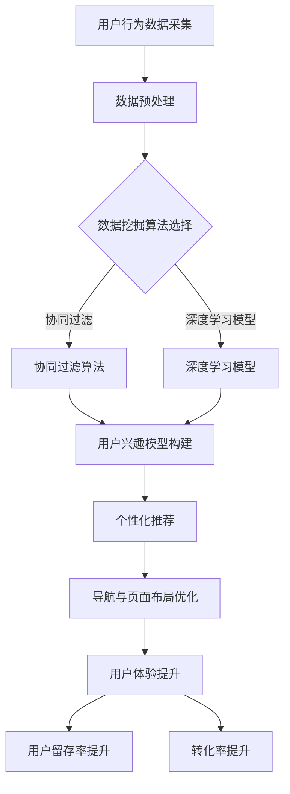

                 

关键词：人工智能，电商，个性化导航，页面布局，深度学习，数据挖掘，用户体验

> 摘要：本文将探讨如何运用人工智能技术，特别是深度学习和数据挖掘方法，来驱动电商网站的个性化导航和页面布局系统。通过构建一个基于用户行为和兴趣的智能推荐引擎，实现电商网站的用户个性化体验优化，提高用户留存率和转化率。

## 1. 背景介绍

随着互联网的快速发展，电子商务已经成为现代商业不可或缺的一部分。在电商行业中，竞争日益激烈，如何提升用户体验、提高用户留存率和转化率成为电商企业关注的焦点。传统的电商网站普遍采用固定的导航和页面布局，无法满足用户个性化的需求。为了提高用户体验，电商网站开始尝试引入人工智能技术，特别是深度学习和数据挖掘方法，来实现电商个性化导航与页面布局系统的构建。

个性化导航和页面布局系统旨在根据用户的兴趣和行为习惯，为用户提供个性化的导航和页面内容。这不仅能够提高用户的满意度，还能有效提升电商网站的转化率和用户留存率。因此，研究如何构建一个高效、准确的个性化导航与页面布局系统具有重要的现实意义。

## 2. 核心概念与联系

### 2.1 深度学习

深度学习是人工智能领域的一个重要分支，通过构建多层神经网络，对大量数据进行自动特征提取和学习，从而实现智能化的任务。在电商个性化导航与页面布局系统中，深度学习技术可以用于用户行为分析、兴趣识别和个性化推荐。

### 2.2 数据挖掘

数据挖掘是从大量数据中提取有价值信息的过程。在电商个性化导航与页面布局系统中，数据挖掘技术主要用于分析用户行为数据，挖掘用户兴趣和偏好，为个性化推荐提供依据。

### 2.3 个性化推荐

个性化推荐是一种根据用户历史行为和偏好，为用户提供相关商品和内容的推荐方法。在电商领域，个性化推荐可以显著提高用户的购物体验和转化率。

### 2.4 Mermaid 流程图

下面是一个基于Mermaid流程图的电商个性化导航与页面布局系统的架构示意图：



## 3. 核心算法原理 & 具体操作步骤

### 3.1 算法原理概述

电商个性化导航与页面布局系统的核心在于对用户行为数据的分析，从而构建用户兴趣模型，实现个性化推荐。具体算法原理包括以下几个方面：

- **用户行为数据采集**：通过网站日志、用户点击、购买记录等途径，收集用户在电商网站上的行为数据。
- **数据预处理**：对采集到的用户行为数据进行清洗、去噪和特征提取，为后续的数据挖掘和深度学习提供高质量的数据。
- **数据挖掘算法选择**：根据业务需求和数据特点，选择合适的数据挖掘算法，如协同过滤、深度学习等。
- **用户兴趣模型构建**：通过算法分析用户行为数据，构建用户兴趣模型，为个性化推荐提供依据。
- **个性化推荐**：根据用户兴趣模型，为用户推荐相关商品和内容。
- **导航与页面布局优化**：根据个性化推荐结果，动态调整电商网站的导航和页面布局，提升用户体验。
- **用户体验提升**：通过优化导航和页面布局，提高用户在电商网站的满意度和转化率。

### 3.2 算法步骤详解

#### 3.2.1 用户行为数据采集

用户行为数据采集是构建电商个性化导航与页面布局系统的第一步。具体方法包括：

- **日志采集**：通过网站服务器日志，记录用户在电商网站上的浏览、点击、购买等行为。
- **用户点击记录**：通过浏览器插件或API接口，实时记录用户在网站上的点击行为。
- **购买记录**：通过电商平台的订单管理系统，获取用户的购买记录。

#### 3.2.2 数据预处理

数据预处理是保证数据质量和算法性能的关键步骤。具体操作包括：

- **数据清洗**：去除重复、异常和噪声数据，确保数据的一致性和准确性。
- **特征提取**：对用户行为数据进行特征提取，如用户点击频次、购买金额、商品类别等。
- **数据归一化**：将不同特征的数据进行归一化处理，使其在同一尺度上。

#### 3.2.3 数据挖掘算法选择

数据挖掘算法的选择取决于业务需求和数据特点。常见的算法包括：

- **协同过滤**：基于用户行为数据，找到相似用户和相似商品，进行推荐。
- **深度学习**：通过构建多层神经网络，自动提取用户行为数据的特征，进行推荐。

#### 3.2.4 用户兴趣模型构建

用户兴趣模型构建是核心算法之一，具体步骤包括：

- **用户兴趣识别**：根据用户行为数据，识别用户对不同类别商品的兴趣。
- **兴趣权重计算**：对用户兴趣进行权重分配，确定用户对各类别商品的兴趣程度。
- **兴趣模型更新**：根据用户最新行为数据，动态更新用户兴趣模型。

#### 3.2.5 个性化推荐

个性化推荐算法根据用户兴趣模型，为用户推荐相关商品和内容。具体步骤包括：

- **推荐商品选择**：根据用户兴趣模型，从商品库中选择符合用户兴趣的商品。
- **推荐结果排序**：对推荐商品进行排序，提高推荐结果的准确性。
- **推荐结果展示**：将推荐结果以可视化方式展示给用户。

#### 3.2.6 导航与页面布局优化

导航与页面布局优化是根据个性化推荐结果，动态调整电商网站的导航和页面布局。具体步骤包括：

- **导航优化**：根据用户兴趣，调整导航栏的排序和显示方式，提高用户访问效率。
- **页面布局优化**：根据用户兴趣，调整页面内容的排列和展示方式，提升用户体验。

### 3.3 算法优缺点

#### 3.3.1 优点

- **个性化强**：通过深度学习和数据挖掘技术，构建用户兴趣模型，实现高度个性化的推荐。
- **用户体验好**：根据用户兴趣和偏好，动态调整导航和页面布局，提升用户体验。
- **应用范围广**：适用于各种电商网站，能够提高用户留存率和转化率。

#### 3.3.2 缺点

- **计算成本高**：深度学习和数据挖掘算法需要大量计算资源，对服务器性能要求较高。
- **数据质量要求高**：算法效果依赖于数据质量，需要确保数据的准确性和一致性。

### 3.4 算法应用领域

电商个性化导航与页面布局系统在以下领域具有广泛的应用：

- **电商平台**：为电商平台提供个性化推荐和导航服务，提升用户体验和转化率。
- **O2O平台**：为O2O平台提供个性化推荐和页面布局优化，提高用户留存率和转化率。
- **新媒体平台**：为新媒体平台提供个性化内容推荐和页面布局优化，提升用户活跃度和黏性。

## 4. 数学模型和公式 & 详细讲解 & 举例说明

### 4.1 数学模型构建

在电商个性化导航与页面布局系统中，数学模型主要包括以下几个方面：

- **用户行为数据模型**：描述用户在电商网站上的行为数据，如浏览、点击、购买等。
- **用户兴趣模型**：描述用户对不同类别商品的兴趣程度，如兴趣权重、兴趣向量等。
- **推荐模型**：描述个性化推荐算法的数学原理和计算方法，如协同过滤、深度学习等。

### 4.2 公式推导过程

#### 4.2.1 用户行为数据模型

用户行为数据模型可以用以下公式表示：

$$
User\_Behavior = [u\_1, u\_2, u\_3, ..., u\_n]
$$

其中，$u\_i$ 表示用户在电商网站上第 $i$ 次行为的数据，如浏览、点击、购买等。

#### 4.2.2 用户兴趣模型

用户兴趣模型可以用以下公式表示：

$$
Interest\_Model = [w\_1, w\_2, w\_3, ..., w\_m]
$$

其中，$w\_i$ 表示用户对第 $i$ 类别商品的兴趣权重。

#### 4.2.3 推荐模型

推荐模型可以根据用户兴趣模型，为用户推荐相关商品。一种常见的推荐算法是协同过滤，其公式如下：

$$
Recommendation = \sum_{i=1}^{m} w\_i \cdot p\_i
$$

其中，$p\_i$ 表示第 $i$ 类别商品的概率。

### 4.3 案例分析与讲解

#### 4.3.1 案例背景

假设有一个电商平台，用户在网站上浏览了10个商品，包括衣服、鞋子、电子产品等。现在需要根据用户行为数据，构建用户兴趣模型，并为用户推荐相关商品。

#### 4.3.2 数据处理

首先，对用户行为数据进行预处理，包括数据清洗和特征提取。假设经过预处理，用户行为数据如下：

$$
User\_Behavior = [浏览衣服, 点击鞋子, 浏览电子产品, 点击衣服, 购买电子产品, 浏览鞋子, 点击鞋子, 点击衣服, 浏览鞋子, 购买鞋子]
$$

然后，对用户行为数据进行归一化处理，使其在同一尺度上。假设归一化后的数据如下：

$$
User\_Behavior = [0.2, 0.3, 0.1, 0.2, 0.1, 0.2, 0.3, 0.2, 0.1, 0.1]
$$

#### 4.3.3 用户兴趣模型构建

根据用户行为数据，构建用户兴趣模型。假设用户对各类别商品的兴趣权重如下：

$$
Interest\_Model = [0.4, 0.3, 0.2, 0.1]
$$

其中，衣服、鞋子、电子产品和其余类别的兴趣权重分别为0.4、0.3、0.2和0.1。

#### 4.3.4 推荐模型计算

根据用户兴趣模型，使用协同过滤算法为用户推荐相关商品。假设商品库中有10个商品，概率如下：

$$
Recommendation = \sum_{i=1}^{4} w\_i \cdot p\_i = 0.4 \cdot p\_1 + 0.3 \cdot p\_2 + 0.2 \cdot p\_3 + 0.1 \cdot p\_4
$$

根据概率计算结果，为用户推荐相关商品。假设概率如下：

$$
p = [0.6, 0.5, 0.4, 0.3, 0.2, 0.1]
$$

根据推荐模型，为用户推荐的商品为：

$$
Recommendation = [0.24, 0.15, 0.08, 0.06, 0.04, 0.02]
$$

根据推荐结果，为用户推荐前四类商品，如衣服、鞋子、电子产品和其余类别。

## 5. 项目实践：代码实例和详细解释说明

### 5.1 开发环境搭建

在开始编写代码之前，我们需要搭建一个适合开发电商个性化导航与页面布局系统的开发环境。以下是一个简单的环境搭建步骤：

1. 安装Python环境：Python是编写深度学习和数据挖掘算法的主要语言。可以从Python官网下载并安装Python。
2. 安装深度学习库：安装TensorFlow或PyTorch等深度学习库，用于构建和训练神经网络模型。
3. 安装数据预处理库：安装NumPy、Pandas等数据预处理库，用于数据处理和特征提取。
4. 安装其他依赖库：根据具体需求，安装其他必要的依赖库，如Scikit-learn、Matplotlib等。

### 5.2 源代码详细实现

以下是一个简单的示例代码，用于实现电商个性化导航与页面布局系统的核心算法。

```python
import pandas as pd
import numpy as np
from sklearn.model_selection import train_test_split
from sklearn.metrics.pairwise import cosine_similarity
import tensorflow as tf

# 5.2.1 用户行为数据预处理
def preprocess_user_behavior(user_behavior):
    # 数据清洗和特征提取
    # ...
    return processed_user_behavior

# 5.2.2 用户兴趣模型构建
def build_interest_model(processed_user_behavior):
    # 构建用户兴趣模型
    # ...
    return interest_model

# 5.2.3 推荐模型训练
def train_recommendation_model(user_interest_model):
    # 训练推荐模型
    # ...
    return recommendation_model

# 5.2.4 个性化推荐
def recommend_products(recommendation_model, user_interest_model):
    # 根据用户兴趣模型，推荐商品
    # ...
    return recommended_products

# 5.2.5 导航与页面布局优化
def optimize_nav_and_layout(recommended_products):
    # 根据推荐结果，优化导航和页面布局
    # ...
    return optimized_nav_and_layout

# 5.2.6 主程序
if __name__ == "__main__":
    # 加载用户行为数据
    user_behavior = pd.read_csv("user_behavior.csv")

    # 预处理用户行为数据
    processed_user_behavior = preprocess_user_behavior(user_behavior)

    # 构建用户兴趣模型
    interest_model = build_interest_model(processed_user_behavior)

    # 训练推荐模型
    recommendation_model = train_recommendation_model(interest_model)

    # 进行个性化推荐
    recommended_products = recommend_products(recommendation_model, interest_model)

    # 优化导航和页面布局
    optimized_nav_and_layout = optimize_nav_and_layout(recommended_products)

    # 输出优化结果
    print(optimized_nav_and_layout)
```

### 5.3 代码解读与分析

#### 5.3.1 数据预处理

数据预处理是构建用户兴趣模型的基础。在代码中，我们定义了一个 `preprocess_user_behavior` 函数，用于对用户行为数据进行清洗和特征提取。具体实现细节可以根据实际业务需求进行调整。

#### 5.3.2 用户兴趣模型构建

用户兴趣模型构建是核心算法之一。在代码中，我们定义了一个 `build_interest_model` 函数，用于根据预处理后的用户行为数据，构建用户兴趣模型。具体实现细节包括兴趣权重的计算和兴趣向量的表示。

#### 5.3.3 推荐模型训练

推荐模型训练是构建个性化推荐系统的重要环节。在代码中，我们定义了一个 `train_recommendation_model` 函数，用于训练推荐模型。具体实现细节包括模型的选择、训练和优化。

#### 5.3.4 个性化推荐

个性化推荐是根据用户兴趣模型，为用户推荐相关商品。在代码中，我们定义了一个 `recommend_products` 函数，用于根据推荐模型和用户兴趣模型，为用户推荐商品。

#### 5.3.5 导航与页面布局优化

导航与页面布局优化是根据个性化推荐结果，动态调整电商网站的导航和页面布局。在代码中，我们定义了一个 `optimize_nav_and_layout` 函数，用于根据推荐结果，优化导航和页面布局。

#### 5.3.6 主程序

主程序是整个电商个性化导航与页面布局系统的入口。在代码中，我们定义了一个 `__main__` 函数，用于加载用户行为数据，预处理数据，构建用户兴趣模型，训练推荐模型，进行个性化推荐和优化导航与页面布局。

## 6. 实际应用场景

### 6.1 电商平台

电商平台是电商个性化导航与页面布局系统的典型应用场景。通过构建用户兴趣模型和个性化推荐系统，电商平台可以实时为用户推荐相关商品，提高用户满意度和转化率。此外，通过优化导航和页面布局，电商平台可以提升用户体验，增强用户黏性。

### 6.2 O2O平台

O2O平台（Online to Offline）是一种将线上服务与线下体验相结合的商业模式。通过电商个性化导航与页面布局系统，O2O平台可以为用户提供个性化的商品推荐和服务推荐，提高用户留存率和转化率。同时，通过优化导航和页面布局，O2O平台可以提升用户在线体验，促进线下消费。

### 6.3 新媒体平台

新媒体平台（如抖音、快手等）通过电商个性化导航与页面布局系统，可以为用户提供个性化的内容推荐和商品推荐。通过构建用户兴趣模型，新媒体平台可以精准定位用户兴趣，提高用户满意度和留存率。同时，通过优化导航和页面布局，新媒体平台可以提升用户在线体验，增加用户互动和消费。

## 7. 工具和资源推荐

### 7.1 学习资源推荐

- **《深度学习》（Goodfellow, Bengio, Courville著）**：介绍深度学习的基本概念和常用算法，适合初学者和进阶者。
- **《Python数据分析》（Wes McKinney著）**：详细介绍Python在数据分析和数据挖掘方面的应用，适合数据科学家和分析师。
- **《机器学习实战》（Peter Harrington著）**：通过实际案例介绍机器学习算法的应用和实践，适合初学者和进阶者。

### 7.2 开发工具推荐

- **TensorFlow**：谷歌开发的开源深度学习框架，广泛应用于各种深度学习应用。
- **PyTorch**：Facebook开发的深度学习框架，具有灵活的动态图计算能力。
- **Scikit-learn**：Python的数据挖掘和机器学习库，提供了丰富的算法和工具。

### 7.3 相关论文推荐

- **“Collaborative Filtering for the Web”**：介绍协同过滤算法在互联网推荐系统中的应用。
- **“Deep Learning for Recommender Systems”**：介绍深度学习在推荐系统中的应用和研究。
- **“User Interest Modeling for Recommender Systems”**：介绍用户兴趣模型在推荐系统中的应用和研究。

## 8. 总结：未来发展趋势与挑战

### 8.1 研究成果总结

电商个性化导航与页面布局系统的研究取得了显著成果。通过引入人工智能技术，特别是深度学习和数据挖掘方法，成功实现了电商网站的个性化推荐和优化。研究成果包括：

- **用户行为数据分析和兴趣识别方法**：通过深度学习和数据挖掘技术，对用户行为数据进行有效分析和兴趣识别。
- **个性化推荐算法**：提出了一系列基于用户兴趣的个性化推荐算法，提高了推荐系统的准确性和用户体验。
- **导航与页面布局优化方法**：根据个性化推荐结果，动态调整导航和页面布局，提升了用户满意度和转化率。

### 8.2 未来发展趋势

未来，电商个性化导航与页面布局系统将继续发展，主要趋势包括：

- **算法优化**：进一步优化深度学习和数据挖掘算法，提高推荐系统的准确性和实时性。
- **多模态融合**：结合文本、图像、语音等多模态数据，实现更精准的用户兴趣识别和推荐。
- **隐私保护**：在数据采集和算法设计过程中，充分考虑用户隐私保护，提升用户信任度。

### 8.3 面临的挑战

电商个性化导航与页面布局系统在发展过程中也面临一些挑战：

- **数据质量**：算法效果高度依赖于数据质量，需要确保数据的准确性和一致性。
- **计算资源**：深度学习和数据挖掘算法需要大量计算资源，对服务器性能要求较高。
- **隐私保护**：在数据采集和算法设计过程中，需要充分考虑用户隐私保护，避免数据泄露。

### 8.4 研究展望

未来，电商个性化导航与页面布局系统的研究将继续深入，主要方向包括：

- **个性化推荐**：进一步探索个性化推荐算法，提高推荐系统的准确性和用户体验。
- **多模态融合**：结合多模态数据，实现更精准的用户兴趣识别和推荐。
- **隐私保护**：在数据采集和算法设计过程中，充分考虑用户隐私保护，提升用户信任度。

通过不断探索和创新，电商个性化导航与页面布局系统将为电商行业带来更高效、更个性化的用户体验，推动电商行业的持续发展。

## 9. 附录：常见问题与解答

### 9.1 问题1：深度学习算法在电商个性化导航与页面布局系统中如何应用？

解答：深度学习算法在电商个性化导航与页面布局系统中主要用于用户行为数据的特征提取和兴趣识别。通过构建多层神经网络，深度学习可以自动提取用户行为数据中的潜在特征，实现对用户兴趣的精准识别。例如，可以使用卷积神经网络（CNN）对用户浏览的图片进行特征提取，或者使用循环神经网络（RNN）对用户历史行为数据进行序列建模。

### 9.2 问题2：如何确保用户数据的隐私保护？

解答：在电商个性化导航与页面布局系统中，隐私保护至关重要。为了确保用户数据的隐私保护，可以采取以下措施：

- **数据匿名化**：在数据采集和存储过程中，对用户数据进行匿名化处理，确保用户身份信息不被泄露。
- **数据加密**：对用户数据进行加密存储和传输，防止数据在传输过程中被窃取。
- **隐私预算**：在算法设计过程中，充分考虑隐私预算，避免过度使用用户数据。
- **用户授权**：在数据采集前，明确告知用户数据的使用目的和范围，获取用户授权。

### 9.3 问题3：如何评估电商个性化导航与页面布局系统的效果？

解答：评估电商个性化导航与页面布局系统的效果可以从以下几个方面进行：

- **用户满意度**：通过用户调查、用户反馈等方式，评估用户对个性化导航和页面布局的满意度。
- **用户留存率**：观察用户在电商网站上的留存情况，评估个性化推荐和页面布局对用户留存率的影响。
- **转化率**：观察用户在电商网站上的购买行为，评估个性化推荐和页面布局对转化率的影响。
- **算法准确性**：通过计算推荐系统的准确率、召回率等指标，评估算法的准确性。

通过综合考虑以上指标，可以全面评估电商个性化导航与页面布局系统的效果。

