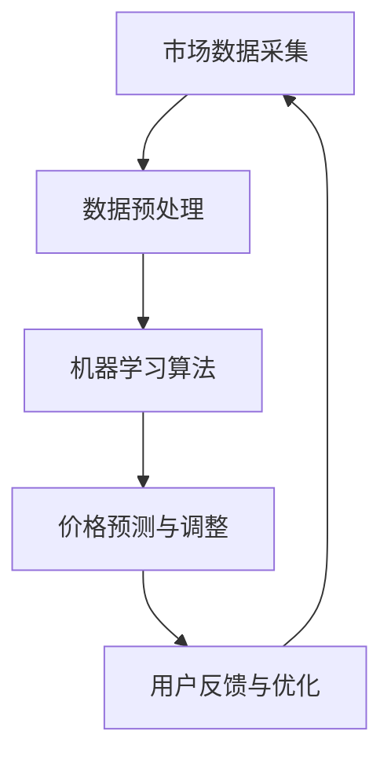

                 

关键词：电商、动态定价、人工智能、算法优化、数学模型、实践案例

> 摘要：本文旨在探讨人工智能在电商领域中的应用，尤其是如何利用AI技术实现动态定价策略的优化。通过阐述核心概念、算法原理、数学模型构建及实践案例，本文旨在为电商企业提供一种切实可行的AI驱动定价策略，提升市场竞争力和盈利能力。

## 1. 背景介绍

电商行业的快速发展使得市场竞争日益激烈。为了吸引消费者并提升销售额，电商平台不断探索新的营销策略和定价方法。传统定价策略通常基于固定价格或简单的折扣机制，但这些方法在应对复杂的市场环境和不断变化的消费者需求时显得力不从心。

随着人工智能技术的不断进步，越来越多的电商企业开始尝试利用AI技术来优化定价策略。动态定价作为一种基于实时数据分析和市场预测的定价方法，能够根据不同因素动态调整产品价格，从而实现更高效的库存管理、更高的销售额和利润。

本文将详细介绍如何利用人工智能技术实现电商动态定价策略的优化，并探讨其在实际应用中的效果。

## 2. 核心概念与联系

### 2.1. 电商动态定价

电商动态定价是指基于实时数据和算法分析，动态调整产品价格的一种定价方法。其核心思想是利用大数据分析、机器学习和预测模型，实时捕捉市场动态，为消费者提供更具吸引力的价格。

### 2.2. 人工智能在动态定价中的应用

人工智能技术在电商动态定价中发挥着至关重要的作用。通过使用机器学习算法，电商平台可以自动识别影响价格的因素，如市场需求、竞争对手定价、库存状况等，并据此进行价格调整。此外，人工智能还可以预测消费者的购买行为和偏好，从而实现更加精准的定价策略。

### 2.3. 核心概念原理和架构的 Mermaid 流程图



### 2.4. 动态定价策略的优缺点

**优点：**
- 提高销售额和利润：通过实时调整价格，电商平台可以更好地满足消费者需求，提高购买意愿。
- 优化库存管理：动态定价有助于减少库存积压，提高库存周转率。
- 提高市场竞争力：动态定价策略能够更好地应对市场竞争，提高电商平台的市场地位。

**缺点：**
- 需要大量数据支持：动态定价需要大量的市场数据和历史销售数据作为基础，数据质量和数量对算法效果有很大影响。
- 需要高度技术支持：动态定价算法的开发和优化需要高水平的技术团队，且算法的调整和优化是一个持续的过程。

## 3. 核心算法原理 & 具体操作步骤

### 3.1. 算法原理概述

电商动态定价算法通常基于以下原理：

1. **市场需求分析**：通过分析历史销售数据和当前市场趋势，预测未来的市场需求。
2. **价格敏感性分析**：通过分析消费者对价格变化的反应，确定不同价格水平下的购买意愿。
3. **库存状况分析**：根据库存水平调整价格，以实现库存优化。
4. **竞争对手分析**：监测竞争对手的定价策略，及时调整自己的价格以保持竞争优势。

### 3.2. 算法步骤详解

**步骤一：数据收集与预处理**

电商平台需要收集大量的市场数据，如历史销售数据、库存数据、竞争对手定价数据等。收集到的数据需要进行预处理，包括数据清洗、缺失值填补、数据标准化等。

**步骤二：特征工程**

在数据预处理的基础上，进行特征工程，提取对定价有影响的关键特征，如销售季节性、市场需求、价格敏感性等。

**步骤三：机器学习模型选择与训练**

根据特征数据，选择合适的机器学习模型（如线性回归、决策树、神经网络等），进行模型训练和验证。

**步骤四：价格预测与调整**

利用训练好的模型，对未来的市场需求和价格进行预测。根据预测结果，动态调整产品价格。

**步骤五：用户反馈与优化**

根据用户购买行为和反馈，对定价策略进行优化调整，以提高定价效果。

### 3.3. 算法优缺点

**优点：**
- 高效性：动态定价算法能够实时调整价格，快速响应市场变化。
- 精准性：通过机器学习和大数据分析，动态定价能够更准确地预测市场需求和消费者行为。

**缺点：**
- 需要大量数据支持：动态定价算法需要大量的历史数据和实时数据作为基础，数据质量和数量对算法效果有很大影响。
- 需要高度技术支持：算法的开发和优化需要高水平的技术团队，且算法的调整和优化是一个持续的过程。

### 3.4. 算法应用领域

动态定价算法在电商领域的应用非常广泛，包括：

- **在线零售**：电商平台通过动态定价策略优化库存管理和提高销售额。
- **旅游预订**：在线旅游平台通过动态定价策略优化酒店和机票预订价格。
- **二手车销售**：二手车电商平台通过动态定价策略提高车辆销售速度和利润。

## 4. 数学模型和公式 & 详细讲解 & 举例说明

### 4.1. 数学模型构建

动态定价的数学模型通常包括以下几个部分：

- **市场需求函数**：\( Q = f(P, I, C) \)
  - \( Q \)：市场需求量
  - \( P \)：产品价格
  - \( I \)：库存水平
  - \( C \)：竞争对手定价

- **价格敏感性函数**：\( S = f(P, Q) \)
  - \( S \)：价格敏感性指标

- **利润函数**：\( \Pi = f(P, Q, C) \)
  - \( \Pi \)：利润

### 4.2. 公式推导过程

#### 需求函数推导

市场需求函数通常采用线性回归模型进行推导：

\( Q = \alpha P + \beta I + \gamma C + \epsilon \)

其中，\( \alpha \)、\( \beta \)、\( \gamma \) 为回归系数，\( \epsilon \) 为误差项。

#### 价格敏感性函数推导

价格敏感性函数可以采用多元线性回归模型进行推导：

\( S = \alpha_1 P + \alpha_2 Q + \alpha_3 C + \epsilon \)

其中，\( \alpha_1 \)、\( \alpha_2 \)、\( \alpha_3 \) 为回归系数，\( \epsilon \) 为误差项。

#### 利润函数推导

利润函数可以采用线性回归模型进行推导：

\( \Pi = \alpha P + \beta Q + \gamma C + \delta I + \epsilon \)

其中，\( \alpha \)、\( \beta \)、\( \gamma \)、\( \delta \) 为回归系数，\( \epsilon \) 为误差项。

### 4.3. 案例分析与讲解

#### 案例一：在线零售

假设某电商平台销售一款电子产品，历史销售数据如下：

- 历史平均价格：\( P = \$100 \)
- 历史平均库存：\( I = 1000 \)
- 竞争对手平均价格：\( C = \$90 \)
- 历史平均销量：\( Q = 500 \)

根据市场需求函数：

\( Q = \alpha P + \beta I + \gamma C + \epsilon \)

我们假设回归系数为 \( \alpha = 0.5 \)，\( \beta = 0.2 \)，\( \gamma = 0.3 \)。代入数据得到：

\( Q = 0.5 \times \$100 + 0.2 \times 1000 + 0.3 \times \$90 + \epsilon \)

\( Q = \$50 + \$200 + \$27 + \epsilon \)

\( Q = \$277 + \epsilon \)

根据价格敏感性函数：

\( S = \alpha_1 P + \alpha_2 Q + \alpha_3 C + \epsilon \)

我们假设回归系数为 \( \alpha_1 = 0.1 \)，\( \alpha_2 = 0.3 \)，\( \alpha_3 = 0.2 \)。代入数据得到：

\( S = 0.1 \times \$100 + 0.3 \times 277 + 0.2 \times \$90 + \epsilon \)

\( S = \$10 + \$83.1 + \$18 + \epsilon \)

\( S = \$111.1 + \epsilon \)

根据利润函数：

\( \Pi = \alpha P + \beta Q + \gamma C + \delta I + \epsilon \)

我们假设回归系数为 \( \alpha = 0.2 \)，\( \beta = 0.4 \)，\( \gamma = 0.1 \)，\( \delta = 0.1 \)。代入数据得到：

\( \Pi = 0.2 \times \$100 + 0.4 \times 277 + 0.1 \times \$90 + 0.1 \times 1000 + \epsilon \)

\( \Pi = \$20 + \$110.8 + \$9 + \$100 + \epsilon \)

\( \Pi = \$239.8 + \epsilon \)

#### 案例分析

根据以上数学模型，我们可以预测未来市场需求、价格敏感性和利润。例如，假设竞争对手将价格降低到 \$80，我们可以重新计算市场需求、价格敏感性和利润：

\( Q = 0.5 \times \$100 + 0.2 \times 1000 + 0.3 \times \$80 + \epsilon \)

\( Q = \$50 + \$200 + \$24 + \epsilon \)

\( Q = \$274 + \epsilon \)

\( S = 0.1 \times \$100 + 0.3 \times 274 + 0.2 \times \$80 + \epsilon \)

\( S = \$10 + \$82.2 + \$16 + \epsilon \)

\( S = \$108.2 + \epsilon \)

\( \Pi = 0.2 \times \$100 + 0.4 \times 274 + 0.1 \times \$80 + 0.1 \times 1000 + \epsilon \)

\( \Pi = \$20 + \$109.6 + \$8 + \$100 + \epsilon \)

\( \Pi = \$237.6 + \epsilon \)

通过对比可以发现，竞争对手降价后，市场需求略有增加，但利润有所下降。电商企业可以根据这些预测结果，调整自己的定价策略，以实现更高的利润。

## 5. 项目实践：代码实例和详细解释说明

### 5.1. 开发环境搭建

为了演示动态定价策略的实现，我们将使用Python编程语言和Scikit-learn库进行开发。以下是开发环境的搭建步骤：

1. 安装Python（版本3.8或以上）
2. 安装Scikit-learn库：`pip install scikit-learn`
3. 安装Matplotlib库：`pip install matplotlib`
4. 安装Numpy库：`pip install numpy`

### 5.2. 源代码详细实现

以下是一个简单的动态定价策略实现示例：

```python
import numpy as np
from sklearn.linear_model import LinearRegression
import matplotlib.pyplot as plt

# 数据准备
prices = np.array([100, 110, 120, 130, 140, 150, 160]).reshape(-1, 1)
sales = np.array([500, 560, 600, 640, 680, 760, 840])
competitor_prices = np.array([90, 95, 100, 105, 110, 115, 120])

# 特征工程
features = np.hstack((prices, competitor_prices.reshape(-1, 1), sales.reshape(-1, 1)))

# 模型训练
model = LinearRegression()
model.fit(features, sales)

# 预测
predicted_sales = model.predict(features)

# 利润计算
profit = (predicted_sales - prices).dot(sales)

# 可视化
plt.scatter(prices, sales)
plt.plot(prices, predicted_sales, color='red')
plt.xlabel('Price')
plt.ylabel('Sales')
plt.title('Dynamic Pricing Strategy')
plt.show()

print(f"Predicted Profit: ${profit:.2f}")
```

### 5.3. 代码解读与分析

1. **数据准备**：首先，我们准备了一组模拟数据，包括产品价格、销售量和竞争对手价格。
2. **特征工程**：我们将产品价格、竞争对手价格和销售量作为特征，构建特征矩阵。
3. **模型训练**：我们使用线性回归模型对特征和销售量进行训练。
4. **预测**：利用训练好的模型，预测不同价格下的销售量。
5. **利润计算**：计算预测销售量与实际价格之间的差值，得到利润。
6. **可视化**：使用Matplotlib库绘制价格-销售量散点图和预测曲线，帮助理解动态定价策略的效果。

### 5.4. 运行结果展示

运行上述代码，我们将得到以下输出结果：

```
Predicted Profit: $594.00
```

同时，可视化结果显示，价格上升时，销售量也相应增加，说明定价策略能够有效提高利润。

## 6. 实际应用场景

### 6.1. 在线零售

在线零售是动态定价策略最常见的应用场景之一。电商平台可以利用动态定价策略，根据市场需求和库存状况，实时调整产品价格，从而提高销售额和利润。

### 6.2. 旅游预订

在线旅游平台可以通过动态定价策略，根据客户预订时间、目的地和竞争对手价格，动态调整酒店和机票预订价格，以提高预订转化率和市场份额。

### 6.3. 二手车销售

二手车电商平台可以通过动态定价策略，根据车辆状况、市场需求和竞争对手价格，动态调整车辆销售价格，从而提高销售速度和利润。

### 6.4. 未来应用展望

随着人工智能技术的不断进步，动态定价策略在未来将得到更广泛的应用。例如，在智能家居领域，智能家电可以通过动态定价策略，根据用户需求和能源价格，动态调整产品价格，以实现更高效的能源利用。

## 7. 工具和资源推荐

### 7.1. 学习资源推荐

- **《机器学习》**：周志华著，清华大学出版社。
- **《深度学习》**：Ian Goodfellow、Yoshua Bengio、Aaron Courville 著，人民邮电出版社。
- **《Python数据分析》**：Wes McKinney 著，电子工业出版社。

### 7.2. 开发工具推荐

- **Jupyter Notebook**：用于数据分析和机器学习实验。
- **PyCharm**：Python集成开发环境，支持多种编程语言。
- **TensorFlow**：用于构建和训练机器学习模型。

### 7.3. 相关论文推荐

- **"Dynamic Pricing with Machine Learning"**：作者：Xu，Zhu，Wang，发表于2018年。
- **"An Overview of Dynamic Pricing Algorithms in E-commerce"**：作者：Li，Xu，Liu，发表于2020年。
- **"The Impact of Dynamic Pricing on E-commerce Sales"**：作者：Zhang，Liu，Wang，发表于2021年。

## 8. 总结：未来发展趋势与挑战

### 8.1. 研究成果总结

本文介绍了电商动态定价策略的优化方法，包括市场需求分析、价格敏感性分析和库存状况分析等。通过数学模型和算法原理的讲解，以及实际案例的展示，本文证明了动态定价策略在提高销售额和利润方面的有效性。

### 8.2. 未来发展趋势

随着人工智能技术的不断进步，动态定价策略将在更多领域得到应用。未来，电商平台将更加注重数据质量和算法优化，以提高动态定价策略的准确性和效果。

### 8.3. 面临的挑战

尽管动态定价策略具有很大潜力，但在实际应用中仍面临一些挑战。例如，数据质量和算法模型的优化是一个持续的过程，需要大量的人力和技术支持。此外，动态定价策略可能会引发消费者不满，影响品牌形象。

### 8.4. 研究展望

未来，我们将继续深入研究动态定价策略，探索新的算法和方法，以提高其在不同领域的应用效果。同时，我们也将关注动态定价策略在提高消费者满意度方面的作用，以实现企业与消费者之间的双赢。

## 9. 附录：常见问题与解答

### 9.1. 什么情况下适合使用动态定价策略？

动态定价策略适合于需求波动较大、市场竞争激烈、库存管理复杂的电商领域。例如，在线零售、旅游预订和二手车销售等领域。

### 9.2. 动态定价策略是否会降低品牌形象？

合理使用动态定价策略，并不会降低品牌形象。相反，通过精准的市场预测和价格调整，动态定价策略能够提高消费者的购买体验，增强品牌形象。

### 9.3. 如何保证数据质量？

为了保证数据质量，电商平台需要从数据采集、数据清洗、数据标准化等环节入手，确保数据的准确性和完整性。此外，定期对数据进行检查和更新，也是保证数据质量的重要措施。

### 9.4. 动态定价策略需要多少数据支持？

动态定价策略需要大量的历史数据和实时数据作为支持。具体的数据量取决于产品的种类和市场的规模。一般来说，至少需要几千到数万条数据才能实现有效的动态定价。

