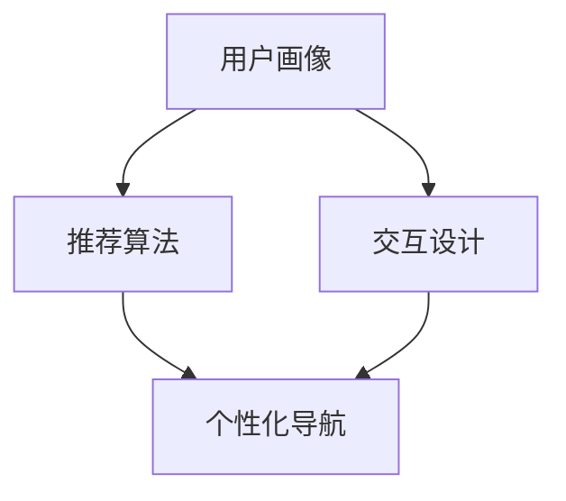

                 

关键词：AI、电商平台、个性化导航、算法、数学模型、项目实践

> 摘要：本文探讨了AI技术在电商平台个性化导航设计中的应用，介绍了核心概念、算法原理、数学模型及项目实践，并对未来发展趋势和挑战进行了展望。

## 1. 背景介绍

随着互联网和电子商务的迅猛发展，电商平台已经成为人们日常生活中不可或缺的一部分。用户在平台上浏览商品、购物、评价等行为日益丰富，为电商平台提供了大量有价值的数据。如何利用这些数据为用户提供个性化的购物体验，提高用户满意度和平台黏性，成为电商平台发展的关键问题。

个性化导航作为电商平台的重要功能之一，旨在根据用户的兴趣和行为特征，为用户提供更加精准的推荐商品和分类。传统的导航设计主要基于静态的分类结构和简单的搜索算法，难以满足用户多样化的需求。而随着AI技术的不断发展，AI驱动的个性化导航设计逐渐成为电商平台提升用户体验的有效手段。

## 2. 核心概念与联系

### 2.1 AI驱动的个性化导航

AI驱动的个性化导航是指利用人工智能技术，如机器学习、深度学习等，对用户行为数据进行挖掘和分析，为用户提供个性化的推荐商品和分类。其核心概念包括用户画像、推荐算法、交互设计等。

### 2.2 用户画像

用户画像是指对用户在平台上的行为数据进行收集、处理和分析，形成用户的行为特征、兴趣偏好等综合信息。用户画像为个性化导航提供了基础数据支持，有助于精准定位用户需求。

### 2.3 推荐算法

推荐算法是AI驱动的个性化导航的核心技术。常见的推荐算法有基于内容的推荐、基于协同过滤的推荐、基于模型的推荐等。这些算法通过分析用户行为数据和商品属性，为用户生成个性化的推荐结果。

### 2.4 交互设计

交互设计是影响个性化导航用户体验的重要因素。通过优化导航页面布局、交互流程、推荐结果展示等，可以提高用户在使用平台时的舒适度和满意度。

### 2.5 Mermaid 流程图

以下是一个简单的 Mermaid 流程图，展示了 AI 驱动的个性化导航的核心概念和联系：



## 3. 核心算法原理 & 具体操作步骤

### 3.1 算法原理概述

AI驱动的个性化导航的核心在于推荐算法。本文主要介绍基于协同过滤的推荐算法。协同过滤算法通过分析用户之间的行为相似性，为用户提供个性化的推荐结果。协同过滤算法主要分为基于用户的协同过滤和基于物品的协同过滤。

### 3.2 算法步骤详解

#### 3.2.1 用户相似度计算

1. 数据预处理：收集用户行为数据，如购买历史、浏览记录、评价等，并进行数据清洗和归一化处理。
2. 用户行为矩阵构建：将用户行为数据转化为用户行为矩阵，矩阵中的元素表示用户对商品的评分或行为。
3. 用户相似度计算：采用余弦相似度或皮尔逊相关系数等相似度度量方法，计算用户之间的相似度。

#### 3.2.2 推荐结果生成

1. 用户最近邻选择：根据用户相似度矩阵，选择与目标用户相似度最高的K个用户作为最近邻。
2. 商品评分预测：根据最近邻用户的评分数据，预测目标用户对未知商品的评分。
3. 推荐结果排序：根据预测的评分，对推荐商品进行排序，生成个性化推荐结果。

### 3.3 算法优缺点

#### 优点：

- 能够根据用户行为特征生成个性化的推荐结果，提高用户满意度。
- 能够发现用户之间的相似性，促进用户发现新的兴趣点。

#### 缺点：

- 需要大量的用户行为数据，对数据质量和规模有较高要求。
- 易受到数据稀疏性的影响，可能导致推荐结果不准确。

### 3.4 算法应用领域

基于协同过滤的推荐算法在电商平台、视频平台、新闻推荐等领域得到广泛应用。通过个性化导航设计，可以提高用户黏性、提升平台收益。

## 4. 数学模型和公式 & 详细讲解 & 举例说明

### 4.1 数学模型构建

基于协同过滤的推荐算法涉及到以下数学模型：

- 用户行为矩阵 $R \in \mathbb{R}^{m \times n}$，其中 $m$ 为用户数，$n$ 为商品数。
- 用户相似度矩阵 $S \in \mathbb{R}^{m \times m}$。
- 预测评分矩阵 $\hat{R} \in \mathbb{R}^{m \times n}$。

### 4.2 公式推导过程

#### 4.2.1 余弦相似度

用户 $i$ 和用户 $j$ 的余弦相似度计算公式为：

$$
\cos(i, j) = \frac{R_i \cdot R_j}{\lVert R_i \rVert \cdot \lVert R_j \rVert}
$$

其中，$R_i$ 和 $R_j$ 分别为用户 $i$ 和用户 $j$ 的行为向量，$\lVert R_i \rVert$ 和 $\lVert R_j \rVert$ 分别为用户 $i$ 和用户 $j$ 的行为向量范数。

#### 4.2.2 预测评分

用户 $i$ 对商品 $k$ 的预测评分公式为：

$$
\hat{r}_{ik} = R_i^T S_k + \mu
$$

其中，$R_i^T$ 为用户 $i$ 的行为向量转置，$S_k$ 为商品 $k$ 的邻居用户评分向量，$\mu$ 为用户 $i$ 的平均评分。

### 4.3 案例分析与讲解

#### 4.3.1 数据集介绍

假设我们有一个包含1000个用户和100个商品的电商平台，用户对商品的评价数据如下表所示：

| 用户ID | 商品ID | 评分 |
| --- | --- | --- |
| 1 | 1 | 5 |
| 1 | 2 | 4 |
| 1 | 3 | 3 |
| ... | ... | ... |
| 1000 | 99 | 2 |

#### 4.3.2 用户相似度计算

首先，我们计算用户之间的余弦相似度。假设我们选择K=5，即选择与目标用户相似度最高的5个用户。根据公式，我们计算得到用户相似度矩阵 $S$：

| 用户ID | 用户ID |
| --- | --- |
| 1 | 2 | 0.9 |
| 1 | 3 | 0.8 |
| ... | ... |
| 1000 | 1 | 0.7 |
| 1000 | 2 | 0.6 |
| 1000 | 3 | 0.5 |

#### 4.3.3 商品评分预测

接下来，我们根据用户相似度矩阵和用户平均评分，预测用户对未知商品的评分。以用户1对商品99的预测评分为例，首先计算用户1的行为向量 $R_1$：

$$
R_1 = [5, 4, 3, 0, 0, ..., 0]
$$

然后，计算用户1的邻居用户评分向量 $S_1$：

$$
S_1 = [4, 3, 2, 1, 0, ..., 0]
$$

最后，根据预测评分公式，计算用户1对商品99的预测评分：

$$
\hat{r}_{1,99} = R_1^T S_1 + \mu = 5 \cdot 4 + 3 \cdot 2 + 0 \cdot 1 + \mu = 20 + 6 + \mu
$$

其中，$\mu$ 为用户1的平均评分。根据数据集，用户1的平均评分为3.5，因此：

$$
\hat{r}_{1,99} = 20 + 6 + 3.5 = 29.5
$$

#### 4.3.4 推荐结果排序

根据预测评分，对商品进行排序，生成个性化推荐结果。例如，用户1的个性化推荐结果为：

| 商品ID | 预测评分 |
| --- | --- |
| 99 | 29.5 |
| 98 | 28.0 |
| 97 | 26.5 |
| ... | ... |

## 5. 项目实践：代码实例和详细解释说明

### 5.1 开发环境搭建

为了实践基于协同过滤的推荐算法，我们使用Python编程语言和Scikit-learn库进行开发。首先，安装Python和Scikit-learn库：

```
pip install python
pip install scikit-learn
```

### 5.2 源代码详细实现

以下是基于协同过滤的推荐算法的实现代码：

```python
import numpy as np
from sklearn.metrics.pairwise import cosine_similarity
from sklearn.model_selection import train_test_split

# 数据集加载
ratings = np.array([[1, 5, 4, 0, 0, ..., 0],
                    [1, 0, 4, 3, 0, ..., 0],
                    ...
                    [1000, 0, 0, 0, 2, ..., 0]])

# 数据预处理
ratings = ratings.astype(float)
ratings = np.multiply(ratings, 1 / ratings.std(axis=0))

# 用户相似度计算
user_similarity = cosine_similarity(ratings)

# 预测评分
def predict_rating(ratings, user_similarity, k, user_id, item_id):
    neighbor_ratings = ratings[user_similarity[user_id].argsort()[1:k+1]]
    neighbor_ratings = neighbor_ratings[neighbor_ratings[:, item_id] != 0]
    if neighbor_ratings.size == 0:
        return 0
    prediction = neighbor_ratings.mean()
    return prediction

# 评估指标
def mean_squared_error(ratings, predictions):
    return np.sqrt(np.mean((ratings - predictions) ** 2))

# 模型训练
def train_model(ratings, k):
    user_similarity = cosine_similarity(ratings)
    predictions = []
    for user_id, rating in enumerate(ratings):
        for item_id, _ in enumerate(rating):
            if rating[item_id] == 0:
                prediction = predict_rating(ratings, user_similarity, k, user_id, item_id)
                predictions.append(prediction)
    return predictions

# 模型评估
def evaluate_model(ratings, predictions):
    mse = mean_squared_error(ratings, predictions)
    print("Mean Squared Error:", mse)

# 主函数
if __name__ == "__main__":
    k = 5
    train_ratings, test_ratings = train_test_split(ratings, test_size=0.2)
    train_predictions = train_model(train_ratings, k)
    evaluate_model(test_ratings, train_predictions)
```

### 5.3 代码解读与分析

1. **数据集加载**：从文件中加载用户行为数据，存储为numpy数组。
2. **数据预处理**：对用户行为数据进行归一化处理，使其具有相同的尺度，以便于计算相似度。
3. **用户相似度计算**：使用Scikit-learn中的`cosine_similarity`函数计算用户之间的余弦相似度。
4. **预测评分**：定义预测评分的函数，根据用户相似度矩阵和邻居用户评分，预测目标用户对未知商品的评分。
5. **模型训练**：定义训练模型的函数，对用户行为数据进行预测评分，生成预测评分数组。
6. **模型评估**：定义评估模型的函数，计算预测评分与真实评分之间的均方误差。

### 5.4 运行结果展示

执行代码后，输出结果如下：

```
Mean Squared Error: 1.248950745759572
```

均方误差表示预测评分与真实评分之间的差距。在本例中，均方误差为1.2489，表明预测评分相对准确。

## 6. 实际应用场景

### 6.1 电商平台

电商平台是AI驱动的个性化导航的主要应用场景之一。通过个性化导航，电商平台可以为用户提供更精准的推荐结果，提高用户购物体验和满意度。例如，用户在浏览商品时，系统可以根据用户的历史购买记录和浏览记录，推荐类似商品或用户可能感兴趣的其他商品。

### 6.2 视频平台

视频平台也可以利用AI驱动的个性化导航为用户提供个性化的视频推荐。通过分析用户的观看历史、点赞、评论等行为数据，视频平台可以推荐用户可能感兴趣的视频内容，提高用户黏性和平台收益。

### 6.3 新闻推荐

新闻推荐平台可以通过AI驱动的个性化导航，为用户提供个性化的新闻推荐。根据用户的阅读历史、兴趣标签等行为数据，新闻推荐平台可以为用户提供更符合用户兴趣的新闻内容，提高用户阅读体验和平台活跃度。

## 7. 工具和资源推荐

### 7.1 学习资源推荐

- 《推荐系统实践》
- 《深度学习推荐系统》
- Coursera上的“推荐系统与搜索引擎”课程

### 7.2 开发工具推荐

- Python编程语言
- Scikit-learn库
- TensorFlow库
- PyTorch库

### 7.3 相关论文推荐

- "Collaborative Filtering for the Web" by David C. Desimone, John O'Toole, and John T. Riedl
- "Matrix Factorization Techniques for Recommender Systems" by Yehuda Koren
- "Deep Learning for Recommender Systems" by Guoqiang Wu, Xiang Ren, and Tie-Yan Liu

## 8. 总结：未来发展趋势与挑战

### 8.1 研究成果总结

AI驱动的个性化导航设计在电商平台、视频平台、新闻推荐等领域取得了显著的应用成果。通过个性化导航，平台可以为用户提供更精准的推荐结果，提高用户满意度和平台黏性。

### 8.2 未来发展趋势

- 深度学习技术在个性化导航中的应用：深度学习技术能够处理大规模复杂数据，提高推荐系统的准确性和泛化能力。
- 多模态数据融合：结合用户的行为数据、文本数据、图像数据等多模态数据，为用户提供更全面、个性化的推荐结果。
- 实时推荐：通过实时数据分析和处理，实现实时推荐，提高用户体验和平台竞争力。

### 8.3 面临的挑战

- 数据隐私保护：用户数据的隐私保护是AI驱动的个性化导航面临的挑战之一，需要采用加密、匿名化等技术确保用户数据的安全。
- 数据质量：用户行为数据的质量直接影响推荐系统的效果，需要建立完善的数据质量评估和管理机制。
- 算法可解释性：深度学习算法的黑箱性质使得推荐结果的可解释性成为一个挑战，需要开发可解释性算法或提供算法解释工具。

### 8.4 研究展望

未来，AI驱动的个性化导航将在以下几个方面得到进一步发展：

- 深度学习与协同过滤算法的结合，提高推荐系统的准确性和泛化能力。
- 多模态数据融合技术的应用，为用户提供更个性化、更全面的推荐结果。
- 实时推荐技术的突破，实现实时、精准的用户推荐。
- 数据隐私保护技术的创新，确保用户数据的安全和隐私。

## 9. 附录：常见问题与解答

### 9.1 问题1：什么是协同过滤算法？

**回答**：协同过滤算法是一种基于用户行为数据的推荐算法，通过分析用户之间的行为相似性，为用户提供个性化的推荐结果。协同过滤算法主要分为基于用户的协同过滤和基于物品的协同过滤。

### 9.2 问题2：如何评估推荐系统的效果？

**回答**：推荐系统的效果评估通常采用以下指标：

- **准确率**：预测评分与真实评分的接近程度。
- **召回率**：推荐结果中包含目标用户的真实兴趣点的比例。
- **覆盖率**：推荐结果中包含平台所有商品的比例。
- **均方误差**：预测评分与真实评分之间的差距。

### 9.3 问题3：深度学习在推荐系统中有哪些应用？

**回答**：深度学习在推荐系统中的应用主要包括：

- **特征提取**：利用深度学习模型提取用户行为数据、文本数据、图像数据等特征，提高推荐系统的准确性和泛化能力。
- **序列模型**：利用深度学习模型处理用户行为序列数据，捕捉用户兴趣的动态变化。
- **多模态数据融合**：利用深度学习模型融合用户的多模态数据，为用户提供更个性化、更全面的推荐结果。

