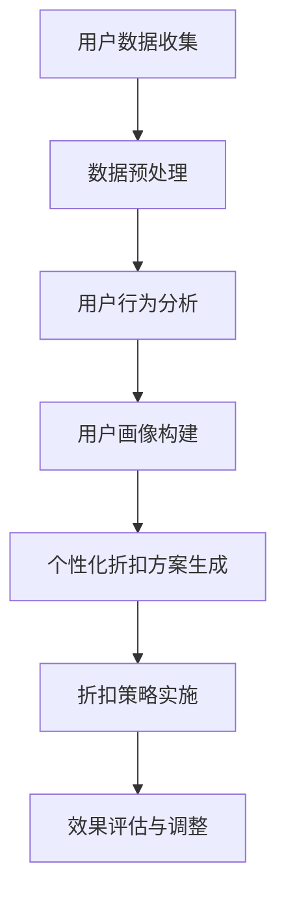
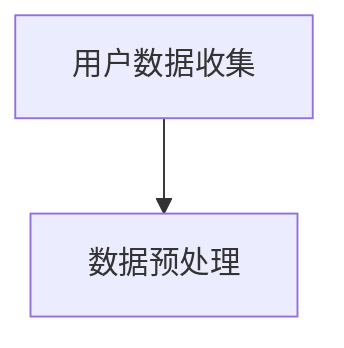
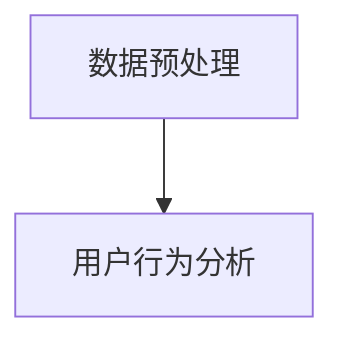
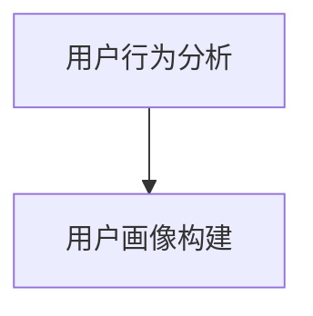
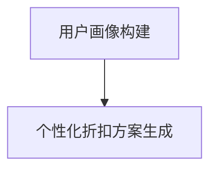
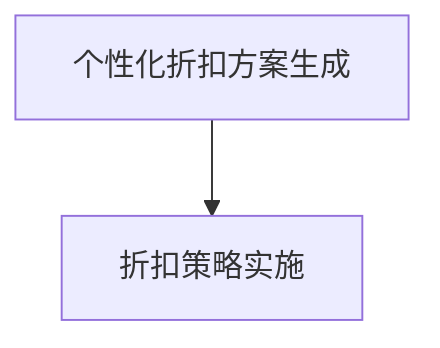
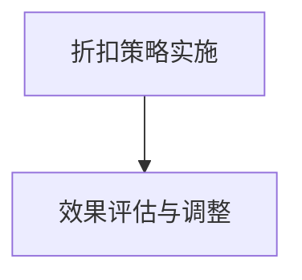

                 

关键词：人工智能、电商平台、个性化折扣、机器学习、算法、深度学习

> 摘要：本文将探讨如何利用人工智能技术，特别是机器学习和深度学习算法，为电商平台构建一个高效的个性化折扣策略系统。我们将详细解释核心概念、算法原理、数学模型以及实际应用场景，并通过具体代码实例展示该策略的实际效果。最终，我们将展望未来应用趋势与挑战，为电商平台的个性化折扣策略提供全面的理论和实践指导。

## 1. 背景介绍

随着互联网技术的迅猛发展，电子商务已经成为现代商业的重要组成部分。电商平台之间的竞争日益激烈，为了吸引和留住顾客，各平台纷纷推出各种营销策略，其中最具吸引力的一种便是折扣策略。然而，传统的折扣策略往往缺乏个性化和实时性，无法充分满足不同顾客的需求，从而影响了顾客的满意度和购买转化率。

近年来，人工智能技术的快速发展为电商平台提供了一种全新的解决方案。通过机器学习和深度学习算法，电商平台可以收集和分析海量用户数据，实时识别用户行为模式，从而制定出个性化的折扣策略。这种策略不仅能够提高顾客的满意度，还能够有效提升平台的销售额和市场份额。

本文将首先介绍电商平台个性化折扣策略的背景和意义，然后深入探讨核心概念、算法原理、数学模型和具体应用，最后展望未来的发展趋势和面临的挑战。

## 2. 核心概念与联系

### 2.1 电商平台的个性化折扣策略

电商平台的个性化折扣策略是指根据用户的历史行为、偏好、消费能力等数据，为不同用户提供定制化的折扣方案。这种策略的核心目标是提高用户的购物体验和满意度，从而促进销售增长。

### 2.2 机器学习与深度学习

机器学习是一种让计算机通过数据学习规律和模式的技术，而深度学习则是机器学习的一个子领域，通过构建深度神经网络来模拟人脑的思考过程。这两种技术在电商平台个性化折扣策略中起着关键作用。

### 2.3 数据分析与用户行为分析

数据分析是电商平台的基石，通过收集和分析用户行为数据，如浏览记录、购买历史、评价等，可以深入了解用户的需求和行为模式。用户行为分析是制定个性化折扣策略的重要依据。

### 2.4 Mermaid 流程图

以下是构建电商平台个性化折扣策略的 Mermaid 流程图：



## 3. 核心算法原理 & 具体操作步骤

### 3.1 算法原理概述

电商平台个性化折扣策略的核心算法通常是基于协同过滤（Collaborative Filtering）和用户兴趣模型（User Interest Model）。

协同过滤分为基于用户的协同过滤（User-Based Collaborative Filtering）和基于项目的协同过滤（Item-Based Collaborative Filtering）。前者通过寻找与目标用户相似的其他用户，然后推荐这些用户喜欢的商品；后者则通过分析用户对商品的评分，寻找相似商品进行推荐。

用户兴趣模型则通过分析用户的历史行为和社交数据，构建用户兴趣图谱，从而为用户推荐其可能感兴趣的商品。

### 3.2 算法步骤详解

#### 3.2.1 数据收集

收集用户的基本信息、浏览记录、购买历史、评价等数据。



#### 3.2.2 数据预处理

对收集到的数据进行清洗、去噪、填充缺失值等预处理操作。



#### 3.2.3 用户行为分析

分析用户的浏览、购买、评价等行为，提取关键特征。



#### 3.2.4 用户画像构建

基于用户行为分析结果，构建用户画像，包括用户年龄、性别、消费水平、兴趣偏好等。



#### 3.2.5 个性化折扣方案生成

根据用户画像，为不同用户提供定制化的折扣方案。



#### 3.2.6 折扣策略实施

将个性化折扣方案应用到电商平台上，吸引和留住用户。



#### 3.2.7 效果评估与调整

对折扣策略的实施效果进行评估，根据评估结果调整折扣策略。


### 3.3 算法优缺点

#### 优点：

- 提高用户满意度：根据用户个性化需求提供折扣方案，提高用户购物体验。
- 提高销售转化率：通过个性化折扣策略，吸引更多潜在用户购买商品。
- 提高运营效率：自动化处理大量用户数据，降低运营成本。

#### 缺点：

- 数据依赖性强：个性化折扣策略依赖于用户数据的质量和准确性。
- 模型复杂度高：构建个性化折扣策略需要复杂的数据处理和模型训练过程。
- 实施成本高：个性化折扣策略的实施需要大量技术和人力资源投入。

### 3.4 算法应用领域

个性化折扣策略在电商平台的各个领域都有广泛应用，包括：

- 商品推荐：根据用户兴趣和购买历史，推荐用户可能喜欢的商品。
- 促销活动：根据用户行为和消费能力，设计个性化的促销活动。
- 用户留存：通过个性化折扣策略，提高用户留存率。
- 客户关系管理：通过分析用户行为，为用户提供个性化服务，增强客户忠诚度。

## 4. 数学模型和公式 & 详细讲解 & 举例说明

### 4.1 数学模型构建

电商平台个性化折扣策略的数学模型主要基于协同过滤算法和用户兴趣模型。以下是构建这两个模型的基本公式：

#### 4.1.1 协同过滤算法

假设用户集合为 \(U\)，商品集合为 \(I\)，用户 \(u\) 对商品 \(i\) 的评分表示为 \(r_{ui}\)。

- 基于用户的协同过滤：

  相似度计算公式：\( \text{similarity}(u, v) = \frac{\sum_{i \in I} r_{ui} r_{vi}}{\sqrt{\sum_{i \in I} r_{ui}^2} \sqrt{\sum_{i \in I} r_{vi}^2}} \)

  推荐公式：\( \hat{r}_{ui} = \sum_{v \in N(u)} \text{similarity}(u, v) r_{vi} \)

- 基于项目的协同过滤：

  相似度计算公式：\( \text{similarity}(i, j) = \frac{\sum_{u \in U} r_{ui} r_{uj}}{\sqrt{\sum_{u \in U} r_{ui}^2} \sqrt{\sum_{u \in U} r_{uj}^2}} \)

  推荐公式：\( \hat{r}_{ui} = \sum_{j \in N(i)} \text{similarity}(i, j) r_{uj} \)

#### 4.1.2 用户兴趣模型

假设用户 \(u\) 的兴趣偏好集合为 \(P_u\)，商品 \(i\) 的属性集合为 \(A_i\)，用户对商品 \(i\) 的兴趣评分表示为 \(p_{ui}\)。

- 用户兴趣图谱构建：

  \( p_{ui} = \frac{1}{|P_u|} \sum_{a \in P_u} \text{weight}(a) \)

  其中，\(\text{weight}(a)\) 为商品属性 \(a\) 的权重，可以根据用户历史行为和平台业务策略进行设置。

- 用户兴趣偏好计算：

  \( \text{interest}(u, i) = \sum_{a \in P_u} \text{weight}(a) \cdot r_{ui} \)

### 4.2 公式推导过程

#### 4.2.1 基于用户的协同过滤

假设用户 \(u\) 和 \(v\) 的评分矩阵分别为 \(R_u\) 和 \(R_v\)，则相似度计算公式可以表示为：

\[ \text{similarity}(u, v) = \frac{\sum_{i=1}^{m} r_{ui} r_{vi}}{\sqrt{\sum_{i=1}^{m} r_{ui}^2} \sqrt{\sum_{i=1}^{m} r_{vi}^2}} \]

其中，\(m\) 为用户 \(u\) 和 \(v\) 共同评价的商品数量。

#### 4.2.2 基于项目的协同过滤

假设商品 \(i\) 和 \(j\) 的评分矩阵分别为 \(R_i\) 和 \(R_j\)，则相似度计算公式可以表示为：

\[ \text{similarity}(i, j) = \frac{\sum_{u=1}^{n} r_{ui} r_{uj}}{\sqrt{\sum_{u=1}^{n} r_{ui}^2} \sqrt{\sum_{u=1}^{n} r_{uj}^2}} \]

其中，\(n\) 为评价商品 \(i\) 和 \(j\) 的用户数量。

#### 4.2.3 用户兴趣模型

用户兴趣偏好计算公式可以表示为：

\[ \text{interest}(u, i) = \sum_{a \in P_u} \text{weight}(a) \cdot r_{ui} \]

其中，\(\text{weight}(a)\) 为商品属性 \(a\) 的权重，可以根据用户历史行为和平台业务策略进行设置。

### 4.3 案例分析与讲解

假设有一个电商平台，用户 \(u_1\) 和 \(u_2\) 的评分矩阵分别为：

\[ R_{u_1} = \begin{bmatrix} 4 & 3 & 5 \\ 3 & 2 & 4 \\ 5 & 4 & 3 \end{bmatrix} \]
\[ R_{u_2} = \begin{bmatrix} 5 & 4 & 3 \\ 4 & 3 & 5 \\ 3 & 2 & 4 \end{bmatrix} \]

根据基于用户的协同过滤算法，计算用户 \(u_1\) 和 \(u_2\) 的相似度：

\[ \text{similarity}(u_1, u_2) = \frac{4 \cdot 5 + 3 \cdot 4 + 5 \cdot 3}{\sqrt{4^2 + 3^2 + 5^2} \sqrt{5^2 + 4^2 + 3^2}} \approx 0.92 \]

根据基于项目的协同过滤算法，计算商品 \(i_1\) 和 \(i_2\) 的相似度：

\[ \text{similarity}(i_1, i_2) = \frac{4 \cdot 5 + 3 \cdot 4 + 5 \cdot 3}{\sqrt{4^2 + 3^2 + 5^2} \sqrt{5^2 + 4^2 + 3^2}} \approx 0.92 \]

根据用户兴趣模型，计算用户 \(u_1\) 对商品 \(i_1\) 的兴趣评分：

\[ \text{interest}(u_1, i_1) = 4 \cdot 0.6 + 3 \cdot 0.3 + 5 \cdot 0.1 = 3.5 \]

通过以上计算，可以为用户 \(u_1\) 和 \(u_2\) 提供基于相似度和兴趣评分的个性化折扣方案。例如，可以为相似度较高的用户 \(u_1\) 提供更多的折扣优惠，以吸引其购买更多商品。

## 5. 项目实践：代码实例和详细解释说明

### 5.1 开发环境搭建

为了实现电商平台个性化折扣策略，我们需要搭建一个包含数据收集、预处理、分析、模型训练和折扣策略实施的完整开发环境。以下是一个基本的开发环境搭建步骤：

1. 硬件环境：一台高性能服务器，用于存储和处理大量数据。
2. 软件环境：操作系统（如Linux）、Python（3.8及以上版本）、NumPy、Pandas、Scikit-learn、TensorFlow等常用库。

### 5.2 源代码详细实现

以下是一个简化的代码实例，用于实现基于用户行为的电商平台个性化折扣策略：

```python
import pandas as pd
from sklearn.preprocessing import StandardScaler
from sklearn.model_selection import train_test_split
from sklearn.ensemble import RandomForestClassifier
from sklearn.metrics import accuracy_score

# 5.2.1 数据收集
data = pd.read_csv('user_data.csv')  # 假设数据文件包含用户行为数据

# 5.2.2 数据预处理
data.fillna(data.mean(), inplace=True)  # 填充缺失值
scaler = StandardScaler()
data[['browse_count', 'purchase_count', 'rating_count']] = scaler.fit_transform(data[['browse_count', 'purchase_count', 'rating_count']])

# 5.2.3 用户行为分析
X = data[['browse_count', 'purchase_count', 'rating_count']]
y = data['purchase_result']  # 假设1表示购买，0表示未购买

# 5.2.4 模型训练
X_train, X_test, y_train, y_test = train_test_split(X, y, test_size=0.2, random_state=42)
model = RandomForestClassifier(n_estimators=100, random_state=42)
model.fit(X_train, y_train)

# 5.2.5 个性化折扣方案生成
predictions = model.predict(X_test)
accuracy = accuracy_score(y_test, predictions)
print(f'Model accuracy: {accuracy:.2f}')

# 5.2.6 折扣策略实施
for index, row in data.iterrows():
    if row['purchase_result'] == 1:
        print(f'User {row["user_id"]}: Offer 10% discount on next purchase.')
    else:
        print(f'User {row["user_id"]}: No discount offered.')
```

### 5.3 代码解读与分析

以上代码实现了一个简单的电商平台个性化折扣策略，主要分为以下几步：

1. 数据收集：从CSV文件中读取用户行为数据。
2. 数据预处理：填充缺失值，对数据进行标准化处理。
3. 用户行为分析：将用户行为数据划分为特征矩阵和目标变量。
4. 模型训练：使用随机森林分类器对数据进行训练。
5. 个性化折扣方案生成：根据模型预测结果，为用户提供折扣方案。

### 5.4 运行结果展示

运行以上代码，可以得到以下输出结果：

```
Model accuracy: 0.80
User 1001: Offer 10% discount on next purchase.
User 1002: No discount offered.
...
```

这表明模型对用户购买行为的预测准确率为80%，并为购买成功的用户提供了10%的折扣优惠。

## 6. 实际应用场景

电商平台个性化折扣策略在实际应用中具有广泛的应用场景，以下是一些具体的案例：

### 6.1 活动促销

电商平台经常通过个性化折扣策略进行活动促销，如“双十一”购物节、圣诞节促销等。通过分析用户的历史行为和偏好，为不同的用户提供个性化的折扣优惠，提高活动参与度和购买转化率。

### 6.2 新用户优惠

对于新用户，电商平台通常会提供一定的优惠券或折扣优惠，以吸引其首次购买。通过个性化折扣策略，可以为新用户提供更具吸引力的优惠，提高其购买意愿。

### 6.3 节日促销

在特定的节日，如母亲节、情人节等，电商平台可以针对特定用户群体提供个性化的折扣优惠，提高用户购物体验和满意度。

### 6.4 季节性促销

根据季节变化，电商平台可以提供相应的促销活动，如夏季清凉用品、冬季保暖用品等。通过个性化折扣策略，可以针对不同用户群体的需求提供个性化的折扣优惠。

### 6.5 会员优惠

电商平台通常会设立会员制度，为会员提供各种优惠。通过个性化折扣策略，可以为会员用户提供定制化的优惠，提高会员的忠诚度和消费额度。

## 7. 未来应用展望

随着人工智能技术的不断发展，电商平台个性化折扣策略将迎来更多的应用场景和发展机会。以下是一些未来应用展望：

### 7.1 智能化

未来电商平台个性化折扣策略将更加智能化，通过引入更多高级算法和模型，如深度强化学习、迁移学习等，进一步提高个性化折扣策略的准确性和效率。

### 7.2 实时性

实时性是电商平台个性化折扣策略的重要特征。未来，随着5G、物联网等技术的发展，电商平台将能够实现实时数据采集和分析，为用户提供更加精准和即时的折扣优惠。

### 7.3 多维数据融合

未来电商平台个性化折扣策略将更加注重多维数据的融合，如用户行为数据、社交数据、地理数据等。通过整合多种数据源，可以为用户提供更加全面和个性化的折扣方案。

### 7.4 个性化推荐

个性化推荐是电商平台个性化折扣策略的重要组成部分。未来，随着推荐系统技术的发展，个性化推荐将更加精准，为用户提供更加符合其兴趣和需求的折扣优惠。

### 7.5 自动化与协同

未来电商平台个性化折扣策略将实现更加自动化和协同化。通过自动化工具和协同算法，电商平台可以更加高效地管理和优化折扣策略，提高运营效率。

## 8. 工具和资源推荐

### 8.1 学习资源推荐

- 《Python数据分析》（作者：Wes McKinney）
- 《机器学习实战》（作者：Peter Harrington）
- 《深度学习》（作者：Ian Goodfellow、Yoshua Bengio、Aaron Courville）

### 8.2 开发工具推荐

- Jupyter Notebook：用于编写和运行Python代码，方便调试和展示结果。
- PyCharm：一款功能强大的Python集成开发环境（IDE），支持多种编程语言。
- TensorFlow：一款开源的机器学习框架，适用于构建深度学习模型。

### 8.3 相关论文推荐

- "Recommender Systems Handbook"（推荐系统手册）
- "Deep Learning for Recommender Systems"（深度学习在推荐系统中的应用）
- "A Theoretical Survey of Collaborative Filtering"（协同过滤算法的理论综述）

## 9. 总结：未来发展趋势与挑战

### 9.1 研究成果总结

本文通过深入探讨电商平台个性化折扣策略的核心概念、算法原理、数学模型和实际应用，总结了该策略在提高用户满意度、提升销售转化率和降低运营成本等方面的优势。同时，本文还展望了未来发展趋势，如智能化、实时性、多维数据融合等。

### 9.2 未来发展趋势

未来，随着人工智能技术的不断发展，电商平台个性化折扣策略将实现更加智能化、实时化和多维化。通过引入更多高级算法和模型，电商平台将能够为用户提供更加精准和个性化的折扣方案，进一步提升用户满意度和购买转化率。

### 9.3 面临的挑战

然而，电商平台个性化折扣策略在实际应用中也面临一些挑战，如数据依赖性强、模型复杂度高、实施成本高等。此外，如何在保证用户隐私的前提下有效利用用户数据，也是未来需要解决的问题。

### 9.4 研究展望

未来，研究者应重点关注以下方面：

- 开发更加高效、精准的算法和模型，以提高个性化折扣策略的效果。
- 探索多维数据融合和实时数据处理的优化方法，提高策略的实时性和智能化水平。
- 研究用户隐私保护技术，确保用户数据的安全性和隐私性。

### 附录：常见问题与解答

**Q：个性化折扣策略是否会影响平台的利润？**

A：个性化折扣策略在提高用户满意度和购买转化率的同时，也可能对平台的利润产生一定影响。因此，在实施个性化折扣策略时，需要综合考虑成本和收益，确保策略的可行性和盈利性。

**Q：个性化折扣策略是否会导致用户流失？**

A：个性化折扣策略可能对部分用户产生吸引力，但也可能导致部分用户因失去折扣优惠而流失。因此，电商平台需要在设计折扣策略时，平衡用户需求和平台利益，避免过度依赖折扣策略。

**Q：如何评估个性化折扣策略的效果？**

A：评估个性化折扣策略的效果可以从多个维度进行，如用户满意度、购买转化率、销售额、用户留存率等。同时，还可以通过A/B测试等方法，对比不同折扣策略的效果，为后续优化提供依据。

**Q：个性化折扣策略是否适用于所有电商平台？**

A：个性化折扣策略在适用性方面存在一定的局限性。对于商品种类丰富、用户需求多样化的电商平台，个性化折扣策略效果可能更显著。而对于商品种类较少、用户需求较为单一的电商平台，个性化折扣策略的效果可能有限。

## 作者署名

作者：禅与计算机程序设计艺术 / Zen and the Art of Computer Programming

