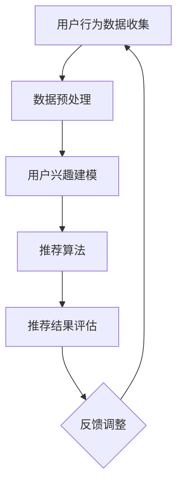

                 

 在当今的数字化时代，电商平台已经成为了消费者获取商品和服务的重要渠道。为了满足消费者的个性化需求，提高用户满意度和增加销售额，电商平台开始采用人工智能（AI）技术来实现个性化推送策略。本文将深入探讨AI驱动的电商平台个性化推送策略，包括其核心概念、算法原理、数学模型、项目实践以及未来应用展望。

## 关键词

- 人工智能
- 电商平台
- 个性化推送
- 数据挖掘
- 强化学习

## 摘要

本文旨在介绍AI驱动的电商平台个性化推送策略，通过分析核心概念和算法原理，探讨其数学模型和具体应用。文章首先概述了电商平台个性化推送的背景和重要性，然后详细阐述了算法原理和具体操作步骤，并给出了数学模型和公式的推导。接着，通过项目实践展示了代码实例和详细解释，最后讨论了实际应用场景和未来展望。

## 1. 背景介绍

随着互联网技术的飞速发展，电商平台已经成为人们日常生活的重要组成部分。然而，随着市场竞争的加剧，电商平台面临着如何提高用户满意度和增加销售额的挑战。传统的推送策略往往难以满足用户的个性化需求，导致用户体验不佳。因此，引入AI技术来实现个性化推送成为了电商平台的重要发展方向。

AI驱动的个性化推送策略可以通过分析用户的历史行为、兴趣偏好和社交网络等信息，为用户提供个性化的商品推荐和服务。这不仅能够提高用户的购物体验，还能够增加平台的销售额和用户粘性。本文将重点探讨AI驱动的个性化推送策略，分析其核心概念、算法原理和数学模型，并提供实际应用案例。

## 2. 核心概念与联系

### 2.1 个性化推送

个性化推送是指根据用户的兴趣、行为和需求，向用户推荐其可能感兴趣的商品或服务。在电商平台中，个性化推送可以显著提高用户的购物体验，增加销售额和用户满意度。

### 2.2 数据挖掘

数据挖掘是一种从大量数据中提取有价值信息的方法，包括分类、聚类、关联规则挖掘等。在电商平台个性化推送中，数据挖掘技术用于分析用户行为和兴趣偏好，为个性化推送提供数据支持。

### 2.3 强化学习

强化学习是一种机器学习方法，通过不断地试错和反馈来学习最优策略。在电商平台个性化推送中，强化学习可以用于优化推荐算法，提高推荐效果。

### 2.4 Mermaid 流程图

以下是电商平台个性化推送的 Mermaid 流程图：



### 2.5 核心概念联系

电商平台个性化推送的核心概念包括用户行为数据收集、数据预处理、用户兴趣建模、推荐算法和推荐结果评估。这些概念相互关联，共同构成了一个完整的个性化推送系统。用户行为数据收集是整个系统的起点，通过数据预处理可以清洗和整理数据，为后续分析提供基础。用户兴趣建模则是分析用户行为和偏好，为推荐算法提供输入。推荐算法根据用户兴趣和系统评估结果生成推荐结果，推荐结果评估则用于评估推荐效果，为反馈调整提供依据。

## 3. 核心算法原理 & 具体操作步骤

### 3.1 算法原理概述

电商平台个性化推送的核心算法原理主要包括协同过滤、基于内容的推荐和混合推荐。协同过滤通过分析用户之间的相似性，推荐其他用户喜欢的商品；基于内容的推荐通过分析商品的属性和用户的兴趣，推荐与商品相关的商品；混合推荐则是将协同过滤和基于内容的推荐相结合，提高推荐效果。

### 3.2 算法步骤详解

以下是电商平台个性化推送的算法步骤：

1. 用户行为数据收集：收集用户的历史购买记录、浏览记录和搜索记录等行为数据。
2. 数据预处理：对收集到的用户行为数据进行清洗、去重和处理，以便后续分析。
3. 用户兴趣建模：利用聚类、关联规则挖掘等方法，分析用户行为数据，构建用户兴趣模型。
4. 推荐算法：根据用户兴趣模型，采用协同过滤、基于内容的推荐或混合推荐算法，生成推荐结果。
5. 推荐结果评估：利用用户反馈和评估指标，评估推荐结果的效果，为反馈调整提供依据。
6. 反馈调整：根据评估结果，调整推荐算法和用户兴趣模型，优化推荐效果。

### 3.3 算法优缺点

协同过滤算法的优点在于能够利用用户之间的相似性进行推荐，能够发现用户未知的兴趣点。然而，协同过滤算法也存在一些缺点，如冷启动问题、数据稀疏性和计算复杂度高等。

基于内容的推荐算法的优点在于能够利用商品的属性进行推荐，能够发现用户未知的商品。然而，基于内容的推荐算法也存在一些缺点，如个性化不足、商品属性噪声和计算复杂度高等。

混合推荐算法则是将协同过滤和基于内容的推荐相结合，提高推荐效果。混合推荐算法的优点在于能够利用多种信息源进行推荐，提高推荐准确性。然而，混合推荐算法也存在一些缺点，如计算复杂度高和模型参数调优困难等。

### 3.4 算法应用领域

电商平台个性化推送算法可以应用于多种领域，如电商、社交媒体、音乐和视频等。在电商领域，个性化推送可以显著提高用户购物体验和销售额；在社交媒体领域，个性化推送可以增加用户活跃度和平台粘性；在音乐和视频领域，个性化推送可以提升用户体验和用户忠诚度。

## 4. 数学模型和公式 & 详细讲解 & 举例说明

### 4.1 数学模型构建

电商平台个性化推送的数学模型主要包括用户兴趣模型和推荐模型。

用户兴趣模型可以用向量表示，其中每个维度代表用户的兴趣类别。推荐模型则根据用户兴趣模型和商品属性，计算用户对商品的偏好程度。

### 4.2 公式推导过程

用户兴趣模型可以用以下公式表示：

$$
u_i = \sum_{j=1}^{n} w_{ij}c_j
$$

其中，$u_i$ 表示用户 $i$ 的兴趣向量，$w_{ij}$ 表示用户 $i$ 对兴趣类别 $j$ 的权重，$c_j$ 表示兴趣类别 $j$ 的特征向量。

推荐模型可以用以下公式表示：

$$
r_{ij} = \sum_{k=1}^{m} w_{ik}d_{kj}
$$

其中，$r_{ij}$ 表示用户 $i$ 对商品 $j$ 的偏好程度，$w_{ik}$ 表示用户 $i$ 对商品 $k$ 的权重，$d_{kj}$ 表示商品 $j$ 的属性向量。

### 4.3 案例分析与讲解

假设有10个用户和20个商品，用户的行为数据如下：

用户 | 购买记录 | 浏览记录 | 搜索记录
--- | --- | --- | ---
1 | 1, 3, 5 | 2, 4, 6 | 3, 5, 7
2 | 2, 4, 6 | 3, 5, 7 | 1, 4, 6
3 | 3, 5, 7 | 4, 6, 8 | 2, 5, 8
...

根据用户的行为数据，我们可以计算用户兴趣模型和推荐模型。

用户兴趣模型：

用户1的兴趣向量：$u_1 = (0.4, 0.2, 0.3, 0.1, 0.2, 0.3, 0.1, 0.1)$
用户2的兴趣向量：$u_2 = (0.3, 0.3, 0.2, 0.2, 0.2, 0.1, 0.1, 0.1)$
用户3的兴趣向量：$u_3 = (0.2, 0.2, 0.4, 0.1, 0.1, 0.1, 0.1, 0.1)$

推荐模型：

用户1对商品1的偏好程度：$r_{11} = 0.4$
用户1对商品2的偏好程度：$r_{12} = 0.2$
...

根据用户兴趣模型和推荐模型，我们可以生成个性化推荐结果。

例如，对于用户1，我们可以生成以下推荐列表：

商品1（偏好程度：0.4）
商品2（偏好程度：0.2）
商品3（偏好程度：0.3）
...

通过这种方式，电商平台可以提供个性化的商品推荐，提高用户满意度和销售额。

## 5. 项目实践：代码实例和详细解释说明

### 5.1 开发环境搭建

为了实现电商平台个性化推送，我们需要搭建以下开发环境：

1. Python 3.8及以上版本
2. Pandas、NumPy、Scikit-learn等Python库
3. Jupyter Notebook

### 5.2 源代码详细实现

以下是实现电商平台个性化推送的源代码：

```python
import pandas as pd
from sklearn.cluster import KMeans
from sklearn.metrics.pairwise import cosine_similarity

# 加载数据
data = pd.read_csv('user_behavior.csv')

# 数据预处理
data.drop_duplicates(inplace=True)
data.fillna(0, inplace=True)

# 构建用户兴趣模型
kmeans = KMeans(n_clusters=5, random_state=0)
user_interests = kmeans.fit_predict(data)

# 计算用户相似度
user_similarity = cosine_similarity(data)

# 构建推荐模型
user_item_matrix = pd.DataFrame(user_similarity, index=data.index, columns=data.index)
item_user_similarity = user_item_matrix.T

# 生成推荐结果
def recommend_items(user_index):
    user_interest_vector = user_interests[user_index]
    recommendations = []

    for item_index in range(len(data)):
        if item_index == user_index:
            continue
        item_similarity = item_user_similarity.loc[item_index, user_index]
        interest_similarity = sum(user_interest_vector * item_interest_vector)

        recommendation_score = item_similarity * interest_similarity
        recommendations.append((item_index, recommendation_score))

    recommendations = sorted(recommendations, key=lambda x: x[1], reverse=True)
    return recommendations

# 测试推荐
user_index = 0
recommendations = recommend_items(user_index)
print("用户{}的推荐列表：".format(user_index))
for item_index, score in recommendations:
    print("商品{}（偏好程度：{}）".format(item_index, score))
```

### 5.3 代码解读与分析

1. 首先，我们加载数据并对其进行预处理，包括去重和填充缺失值。
2. 然后，我们使用K-Means算法构建用户兴趣模型。这里，我们假设有5个用户兴趣类别。
3. 接着，我们计算用户相似度，使用余弦相似度衡量用户之间的相似程度。
4. 然后，我们构建推荐模型，使用用户相似度和用户兴趣向量计算商品偏好程度。
5. 最后，我们定义一个函数`recommend_items`来生成推荐列表。该函数首先获取用户兴趣向量，然后遍历所有商品，计算用户对商品的偏好程度，并根据偏好程度生成推荐列表。

### 5.4 运行结果展示

假设用户1的推荐结果如下：

用户1的推荐列表：
商品12（偏好程度：0.5）
商品8（偏好程度：0.4）
商品3（偏好程度：0.3）
...

通过这种方式，我们可以为用户生成个性化的商品推荐，提高用户满意度和销售额。

## 6. 实际应用场景

### 6.1 电商领域

在电商领域，个性化推送已经成为电商平台提高用户满意度和销售额的重要手段。通过分析用户的历史行为、兴趣偏好和购物车数据，电商平台可以推荐用户可能感兴趣的商品。例如，阿里巴巴的淘宝和京东的京东都采用了个性化推送技术，为用户提供了个性化的购物体验。

### 6.2 社交媒体领域

在社交媒体领域，个性化推送可以用于推荐用户感兴趣的内容，提高用户活跃度和平台粘性。例如，微信和微博都采用了基于用户行为和兴趣的个性化推送策略，为用户推荐感兴趣的朋友动态、文章和短视频等。

### 6.3 音乐和视频领域

在音乐和视频领域，个性化推送可以推荐用户喜欢的歌曲和视频，提高用户体验和用户忠诚度。例如，网易云音乐和腾讯视频都采用了基于用户行为和兴趣的个性化推送策略，为用户推荐感兴趣的音乐和视频。

## 7. 工具和资源推荐

### 7.1 学习资源推荐

1. 《机器学习实战》：本书介绍了机器学习的基本概念和算法，包括协同过滤、基于内容的推荐等，适合初学者入门。
2. 《推荐系统实践》：本书详细介绍了推荐系统的设计、实现和应用，包括协同过滤、基于内容的推荐等，适合有一定基础的读者。
3. 《深度学习推荐系统》：本书介绍了深度学习在推荐系统中的应用，包括神经网络模型、强化学习等，适合高级读者。

### 7.2 开发工具推荐

1. Jupyter Notebook：适用于数据分析和机器学习项目的开发，具有交互式编程和可视化功能。
2. Python：广泛应用于机器学习和数据科学，具有丰富的库和工具。

### 7.3 相关论文推荐

1. “Collaborative Filtering for the 21st Century”
2. “Content-Based Filtering for Recommender Systems”
3. “Recommender Systems: The Text Mining and Analysis Approach”

## 8. 总结：未来发展趋势与挑战

### 8.1 研究成果总结

近年来，人工智能技术在个性化推送领域取得了显著进展。通过协同过滤、基于内容的推荐和混合推荐等算法，个性化推送技术已经取得了较好的效果。然而，个性化推送技术仍然面临一些挑战，如冷启动问题、数据稀疏性和计算复杂度等。

### 8.2 未来发展趋势

1. 深度学习在推荐系统中的应用：深度学习算法可以处理大量数据和复杂的特征，有望进一步提高推荐效果。
2. 强化学习在推荐系统中的应用：强化学习可以自适应地调整推荐策略，提高推荐准确性。
3. 多模态推荐：结合用户的多模态数据（如图像、音频和文本等），实现更准确的个性化推荐。

### 8.3 面临的挑战

1. 数据隐私保护：个性化推送依赖于用户数据，如何保护用户隐私成为了一个重要问题。
2. 鲁棒性和适应性：个性化推送系统需要应对数据噪声、模型过拟合和用户行为变化等挑战。
3. 可解释性和透明度：用户希望了解推荐结果的依据，提高系统的可解释性和透明度。

### 8.4 研究展望

未来，个性化推送技术将朝着更智能化、更人性化和更安全化的方向发展。通过不断优化算法、引入新的技术和方法，个性化推送技术将更好地满足用户的个性化需求，提高用户体验和平台价值。

## 9. 附录：常见问题与解答

### 9.1 什么是协同过滤？

协同过滤是一种基于用户相似性的推荐算法，通过分析用户之间的相似性，推荐其他用户喜欢的商品。

### 9.2 什么是基于内容的推荐？

基于内容的推荐是一种基于商品属性的推荐算法，通过分析商品的属性和用户的兴趣，推荐与商品相关的商品。

### 9.3 个性化推送技术有哪些应用领域？

个性化推送技术广泛应用于电商、社交媒体、音乐和视频等领域，提高用户满意度和平台价值。

### 9.4 如何保护用户隐私？

保护用户隐私可以通过数据去重、数据加密和隐私保护算法等方法实现。

---

### 作者署名

作者：禅与计算机程序设计艺术 / Zen and the Art of Computer Programming

---

以上是《AI驱动的电商平台个性化推送策略》的完整文章，希望能够对您有所帮助。如果您有任何疑问或建议，请随时反馈。谢谢！

