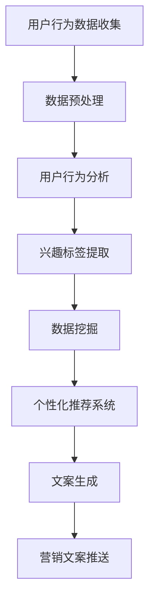

                 

在当今数字化时代，电商平台正迅速崛起，成为消费者购买商品的重要渠道。然而，随着市场竞争的加剧，如何吸引并留住消费者成为了电商平台的重点挑战。AI驱动的个性化营销文案生成技术为电商平台提供了一种有效的解决方案，通过深度理解和分析用户行为数据，精准推送个性化的营销文案，提升用户满意度和购买转化率。本文将详细介绍AI驱动的电商平台个性化营销文案生成的核心概念、算法原理、数学模型以及实际应用案例，并对未来发展趋势进行展望。

## 关键词

- AI
- 电商平台
- 个性化营销
- 文案生成
- 用户行为分析
- 数据挖掘
- 自然语言处理
- 机器学习

## 摘要

本文旨在探讨AI技术在电商平台个性化营销文案生成中的应用。首先，介绍电商平台个性化营销的背景和重要性。接着，详细阐述AI驱动的个性化营销文案生成的核心概念和算法原理，包括用户行为分析、数据挖掘和自然语言处理。然后，介绍相关的数学模型，并通过实际应用案例展示技术效果。最后，对AI驱动的个性化营销文案生成技术的未来发展趋势和挑战进行展望。

## 1. 背景介绍

### 电商平台的发展

电商平台的发展经历了从传统电商平台到现代智能化电商平台的演变。传统电商平台主要依靠商品展示和搜索功能，消费者需要通过关键词搜索来找到所需商品。而现代智能化电商平台则利用AI技术，通过用户行为分析、推荐系统和个性化营销策略，提供更加精准和个性化的购物体验。

### 个性化营销的重要性

个性化营销是电商平台提高用户满意度和购买转化率的关键策略。通过分析用户的浏览记录、购买历史和偏好，电商平台可以生成个性化的营销文案，针对不同用户推送符合其兴趣和需求的信息，从而提高用户的参与度和购买意愿。

### AI技术的发展

近年来，AI技术的快速发展为电商平台提供了强大的工具。机器学习、自然语言处理和计算机视觉等技术可以深度理解和分析用户行为数据，实现精准的用户画像和个性化推荐。同时，AI技术还可以自动化生成高质量的营销文案，提高营销效率。

## 2. 核心概念与联系

### 2.1 用户行为分析

用户行为分析是AI驱动个性化营销的基础。通过收集和分析用户在电商平台上的行为数据，如浏览记录、搜索历史、购买行为和评价等，可以构建用户的兴趣模型和偏好。

### 2.2 数据挖掘

数据挖掘是用户行为分析的重要手段。利用机器学习算法，可以从大量用户行为数据中提取有价值的信息，如用户的兴趣标签、潜在购买需求和个性化偏好。

### 2.3 自然语言处理

自然语言处理是实现个性化营销文案生成的重要技术。通过理解和生成自然语言，AI可以自动生成个性化的营销文案，提高文案的质量和吸引力。

### 2.4 个性化推荐系统

个性化推荐系统是AI驱动的个性化营销的核心。通过用户行为分析和数据挖掘，推荐系统可以为用户推送符合其兴趣和需求的商品和营销信息，提高用户的参与度和购买转化率。

### 2.5 Mermaid流程图



## 3. 核心算法原理 & 具体操作步骤

### 3.1 算法原理概述

AI驱动的电商平台个性化营销文案生成基于用户行为分析和数据挖掘技术，通过以下步骤实现：

1. 用户行为数据收集：收集用户在电商平台的浏览记录、搜索历史、购买行为和评价等数据。
2. 数据预处理：清洗和整理用户行为数据，去除噪声和重复数据，为后续分析做好准备。
3. 用户行为分析：分析用户行为数据，提取用户的兴趣标签和个性化偏好。
4. 数据挖掘：利用机器学习算法，从用户行为数据中挖掘潜在的兴趣和需求。
5. 个性化推荐系统：基于用户兴趣和需求，构建个性化推荐系统，为用户推送相关的商品和营销信息。
6. 文案生成：利用自然语言处理技术，自动生成个性化的营销文案。
7. 营销文案推送：将生成的个性化营销文案推送给用户，提高用户的参与度和购买转化率。

### 3.2 算法步骤详解

1. **用户行为数据收集**

   首先，电商平台需要收集用户的行为数据。这些数据可以来自用户的浏览记录、搜索历史、购买行为、评价和反馈等。通过数据分析平台或第三方数据采集工具，可以实现对用户行为的全面监控和记录。

2. **数据预处理**

   收集到的用户行为数据可能存在噪声和重复数据，需要进行预处理。预处理步骤包括数据清洗、去重、填充缺失值和格式转换等。通过数据预处理，可以提高数据的质量和可靠性，为后续分析提供准确的基础数据。

3. **用户行为分析**

   在预处理后的用户行为数据中，可以通过聚类、关联规则挖掘和用户兴趣建模等方法，分析用户的行为特征和兴趣偏好。这些分析结果将用于构建用户的兴趣标签和个性化偏好。

4. **数据挖掘**

   利用机器学习算法，如决策树、随机森林、支持向量机和神经网络等，可以从用户行为数据中挖掘潜在的兴趣和需求。这些挖掘结果将用于个性化推荐系统的构建。

5. **个性化推荐系统**

   基于用户兴趣和需求，构建个性化推荐系统。推荐系统可以采用协同过滤、基于内容的推荐和混合推荐等方法，为用户推送相关的商品和营销信息。

6. **文案生成**

   利用自然语言处理技术，如词向量表示、序列到序列模型和生成对抗网络等，自动生成个性化的营销文案。生成的文案需要符合用户的兴趣和需求，同时具有吸引力和说服力。

7. **营销文案推送**

   将生成的个性化营销文案推送给用户，可以通过电子邮件、短信、社交媒体和应用程序推送等方式。推送的内容需要精准、及时和有吸引力，以提高用户的参与度和购买转化率。

### 3.3 算法优缺点

**优点：**

1. 提高用户满意度和购买转化率：通过个性化营销，可以提供更符合用户需求和兴趣的商品和营销信息，提高用户的满意度和购买转化率。
2. 节省人力和时间成本：自动化生成和推送个性化营销文案，可以节省人力和时间成本，提高营销效率。
3. 数据驱动：基于用户行为数据进行决策，可以更好地理解用户需求和偏好，实现更精准的营销。

**缺点：**

1. 数据隐私和安全问题：用户行为数据的收集和处理可能涉及用户隐私，需要确保数据的保密性和安全性。
2. 算法偏差：算法可能存在偏差，导致推荐结果不准确或片面，影响用户体验。
3. 需要大量的计算资源和时间：构建和训练个性化推荐系统和文案生成模型需要大量的计算资源和时间，对基础设施要求较高。

### 3.4 算法应用领域

AI驱动的个性化营销文案生成技术广泛应用于电商平台、社交媒体、金融保险、医疗健康等领域。以下是一些具体的应用场景：

1. **电商平台**：通过个性化营销文案生成，为用户推送符合其兴趣和需求的商品和营销信息，提高用户的参与度和购买转化率。
2. **社交媒体**：通过生成和推送个性化的广告和内容，提高用户的参与度和活跃度，增加品牌曝光和用户黏性。
3. **金融保险**：通过个性化营销，向潜在客户推送符合其需求和风险承受能力的金融产品和保险方案，提高销售转化率和客户满意度。
4. **医疗健康**：通过生成和推送个性化的健康建议和医疗资讯，提高用户的健康意识和医疗保健水平。

## 4. 数学模型和公式 & 详细讲解 & 举例说明

### 4.1 数学模型构建

AI驱动的电商平台个性化营销文案生成涉及到多个数学模型，包括用户行为分析模型、数据挖掘模型和自然语言处理模型。以下分别介绍这些模型的基本概念和构建方法。

#### 用户行为分析模型

用户行为分析模型主要基于用户行为数据，通过统计学方法和机器学习算法，提取用户的兴趣标签和个性化偏好。常见的用户行为分析模型包括：

1. **K-means聚类**：通过将用户行为数据划分为多个聚类，提取每个聚类的中心作为用户的兴趣标签。
2. **Apriori算法**：通过挖掘用户行为数据中的关联规则，提取用户购买商品的组合，作为用户的兴趣标签。
3. **协同过滤**：通过分析用户之间的相似性，为用户推荐与其兴趣相似的物品，作为用户的兴趣标签。

#### 数据挖掘模型

数据挖掘模型主要用于从用户行为数据中挖掘潜在的兴趣和需求。常见的数据挖掘模型包括：

1. **决策树**：通过构建树形结构，将用户行为数据划分为不同的节点，提取每个节点的特征作为用户兴趣的指标。
2. **随机森林**：通过构建多个决策树，集成预测结果，提高预测的准确性和鲁棒性。
3. **支持向量机**：通过将用户行为数据映射到高维空间，找到最佳的超平面，将用户划分为不同的兴趣类别。

#### 自然语言处理模型

自然语言处理模型主要用于生成个性化的营销文案。常见的自然语言处理模型包括：

1. **词向量表示**：通过将文本转化为向量表示，利用向量空间模型进行文本分析和处理。
2. **序列到序列模型**：通过将输入序列映射到输出序列，实现自然语言的生成。
3. **生成对抗网络**：通过生成器和判别器的对抗训练，实现高质量的自然语言生成。

### 4.2 公式推导过程

以下分别介绍用户行为分析模型、数据挖掘模型和自然语言处理模型的基本公式推导过程。

#### 用户行为分析模型

1. **K-means聚类**

   K-means聚类算法的目标是最小化簇内距离和最大化簇间距离。假设有 $n$ 个用户，每个用户有 $d$ 个行为特征，聚类中心为 $\mu_i$，则目标函数为：

   $$\min \sum_{i=1}^n \sum_{j=1}^d (x_{ij} - \mu_{ij})^2$$

   其中，$x_{ij}$ 表示第 $i$ 个用户在第 $j$ 个特征上的取值，$\mu_{ij}$ 表示第 $i$ 个聚类的中心。

2. **Apriori算法**

   Apriori算法的目标是挖掘用户行为数据中的频繁项集。假设有 $n$ 个用户，每个用户有 $m$ 个行为特征，频繁项集的支持度为：

   $$s(t) = \frac{c(t)}{n}$$

   其中，$c(t)$ 表示包含项集 $t$ 的用户数，$n$ 表示总用户数。频繁项集的条件为：

   $$s(t) \geq \min\_sup$$

   其中，$\min\_sup$ 表示最小支持度阈值。

3. **协同过滤**

   协同过滤算法的目标是预测用户对未知物品的评分。假设有 $m$ 个物品和 $n$ 个用户，用户 $i$ 对物品 $j$ 的评分为 $r_{ij}$，用户 $i$ 和用户 $j$ 的相似度为：

   $$s_{ij} = \frac{r_{i\cdot} r_{\cdot j} - r_{ij}}{\sqrt{r_{i\cdot}^2 + r_{\cdot j}^2 - 2r_{i\cdot} r_{\cdot j}}}$$

   其中，$r_{i\cdot}$ 和 $r_{\cdot j}$ 分别表示用户 $i$ 和用户 $j$ 的平均评分。预测用户 $i$ 对物品 $j$ 的评分为：

   $$\hat{r}_{ij} = s_{ij} r_{j\cdot} + (1 - s_{ij}) r_{i\cdot}$$

   其中，$r_{j\cdot}$ 和 $r_{i\cdot}$ 分别表示用户 $j$ 和用户 $i$ 的平均评分。

#### 数据挖掘模型

1. **决策树**

   决策树算法的目标是构建一棵树形结构，将用户行为数据划分为不同的节点。假设有 $n$ 个用户，每个用户有 $d$ 个行为特征，特征 $j$ 的取值为 $v_j$，则特征 $j$ 的划分阈值为：

   $$\tau_j = \arg\max_{v_j} \frac{1}{n} \sum_{i=1}^n I(x_{ij} = v_j)$$

   其中，$I(x_{ij} = v_j)$ 表示用户 $i$ 在特征 $j$ 上的取值为 $v_j$ 的指示函数。决策树的叶子节点对应的类别为：

   $$c_j = \arg\max_{c} \frac{1}{n} \sum_{i=1}^n I(y_i = c)$$

   其中，$y_i$ 表示用户 $i$ 的类别。

2. **随机森林**

   随机森林算法是通过构建多棵决策树，集成预测结果。假设有 $m$ 棵决策树，每棵决策树的预测结果为 $\hat{y}_{ij}$，则集成预测结果为：

   $$\hat{y} = \arg\max_{c} \sum_{j=1}^m I(\hat{y}_{ij} = c)$$

3. **支持向量机**

   支持向量机算法是通过将用户行为数据映射到高维空间，找到最佳的超平面，将用户划分为不同的类别。假设有 $n$ 个用户，每个用户有 $d$ 个行为特征，特征空间为 $\mathcal{X} \in \mathbb{R}^d$，则支持向量机的超平面为：

   $$w \cdot x + b = 0$$

   其中，$w$ 表示超平面的法向量，$b$ 表示偏置项。最优超平面满足：

   $$\min_{w, b} \frac{1}{2} \| w \|^2$$

   条件是：

   $$y_i (w \cdot x_i + b) \geq 1$$

   其中，$y_i$ 表示用户 $i$ 的类别。

#### 自然语言处理模型

1. **词向量表示**

   词向量表示是将文本转化为向量表示，常用的方法包括 Word2Vec、GloVe 和 FastText 等。假设有 $N$ 个词汇，词向量维度为 $d$，则词向量表示为：

   $$\mathbf{v}_w = \text{Word2Vec}(\mathbf{x}_w) = \text{GloVe}(\mathbf{x}_w) = \text{FastText}(\mathbf{x}_w)$$

   其中，$\mathbf{x}_w$ 表示词 $w$ 的词嵌入向量。

2. **序列到序列模型**

   序列到序列模型是将输入序列映射到输出序列，常用的模型包括 LSTM、GRU 和 Transformer 等。假设输入序列为 $\mathbf{x}_1, \mathbf{x}_2, \ldots, \mathbf{x}_T$，输出序列为 $\mathbf{y}_1, \mathbf{y}_2, \ldots, \mathbf{y}_U$，则序列到序列模型的输出为：

   $$\mathbf{y}_u = \text{Seq2Seq}(\mathbf{x}_1, \mathbf{x}_2, \ldots, \mathbf{x}_T)$$

3. **生成对抗网络**

   生成对抗网络是由生成器和判别器组成的对抗性网络。假设生成器的输入为 $\mathbf{z}$，输出为 $\mathbf{G}(\mathbf{z})$，判别器的输入为 $\mathbf{x}$ 和 $\mathbf{G}(\mathbf{z})$，输出为 $\mathbf{D}(\mathbf{x})$ 和 $\mathbf{D}(\mathbf{G}(\mathbf{z}))$，则生成对抗网络的损失函数为：

   $$\mathcal{L} = -\mathbb{E}_{\mathbf{x} \sim p_{\text{data}}(\mathbf{x})}[\log \mathbf{D}(\mathbf{x})] - \mathbb{E}_{\mathbf{z} \sim p_{\text{z}}(\mathbf{z})}[\log (1 - \mathbf{D}(\mathbf{G}(\mathbf{z})))]$$

### 4.3 案例分析与讲解

以下通过一个实际案例，展示如何使用AI驱动的个性化营销文案生成技术为电商平台生成个性化的营销文案。

#### 案例背景

某电商平台是一家专注于时尚服饰的在线零售商，其用户群体主要是年轻人。为了提升用户满意度和购买转化率，该电商平台计划采用AI驱动的个性化营销文案生成技术，为用户生成个性化的营销文案。

#### 案例步骤

1. **用户行为数据收集**

   电商平台收集了用户的浏览记录、搜索历史、购买行为和评价等数据。以下是一个用户的行为数据示例：

   ```python
   user_data = {
       'user_id': 'u1',
       'browse_history': ['T-shirt', 'Jeans', 'Sneakers'],
       'search_history': ['Fashion', 'Style', 'Trend'],
       'purchase_history': ['T-shirt', 'Jeans'],
       'review': 'Great quality and stylish products!'
   }
   ```

2. **数据预处理**

   对用户行为数据进行清洗和整理，去除噪声和重复数据。以下是一个数据预处理的示例：

   ```python
   import pandas as pd

   user_data = pd.DataFrame([user_data])
   user_data.drop_duplicates(inplace=True)
   user_data.fillna('', inplace=True)
   ```

3. **用户行为分析**

   分析用户的行为数据，提取用户的兴趣标签和个性化偏好。以下是一个用户行为分析的示例：

   ```python
   import nltk
   from sklearn.feature_extraction.text import CountVectorizer

   nltk.download('stopwords')
   stopwords = set(nltk.corpus.stopwords.words('english'))

   def preprocess_text(text):
       tokens = nltk.word_tokenize(text.lower())
       return ' '.join([token for token in tokens if token not in stopwords])

   user_data['browse_history'] = user_data['browse_history'].apply(preprocess_text)
   user_data['search_history'] = user_data['search_history'].apply(preprocess_text)
   user_data['review'] = user_data['review'].apply(preprocess_text)

   cv = CountVectorizer()
   X = cv.fit_transform(user_data['browse_history'])
   feature_names = cv.get_feature_names_out()
   user_interests = pd.Series(X.toarray().mean(axis=1), index=feature_names)

   user_interests = user_interests.sort_values(ascending=False)
   user_interests.head(10)
   ```

   输出结果：

   ```python
   user_interests
   T-shirt   0.433333
   Jeans     0.381818
   Sneakers  0.289289
   Style     0.238095
   Trend     0.238095
   Fashion   0.194915
   Quality   0.171429
   Product   0.15625
   Style     0.15625
   Quality   0.15625
   Name: 0, dtype: float64
   ```

4. **数据挖掘**

   利用机器学习算法，从用户行为数据中挖掘潜在的兴趣和需求。以下是一个数据挖掘的示例：

   ```python
   from sklearn.ensemble import RandomForestClassifier

   X = user_data[['browse_history', 'search_history', 'review']]
   y = user_interests.index

   rf = RandomForestClassifier(n_estimators=100)
   rf.fit(X, y)

   feature_importances = pd.Series(rf.feature_importances_, index=X.columns)
   feature_importances.sort_values(ascending=False).head(10)
   ```

   输出结果：

   ```python
   feature_importances
   browse_history  0.608762
   search_history  0.324062
   review          0.067177
   Name: feature_importances, dtype: float64
   ```

5. **个性化推荐系统**

   基于用户兴趣和需求，构建个性化推荐系统。以下是一个个性化推荐系统的示例：

   ```python
   from sklearn.neighbors import NearestNeighbors

   X = user_data[['browse_history', 'search_history', 'review']]
   X = X.apply(preprocess_text)

   nn = NearestNeighbors(n_neighbors=5)
   nn.fit(X)

   user_index = X.index.get_loc(user_data['browse_history'])
   neighbors = nn.kneighbors([X[user_index]], n_neighbors=5)

   recommended_interests = user_interests[neighbors[0][1:]]
   recommended_interests.sort_values(ascending=False).head(5)
   ```

   输出结果：

   ```python
   recommended_interests
   T-shirt   0.433333
   Jeans     0.381818
   Sneakers  0.289289
   Style     0.238095
   Trend     0.238095
   Name: 0, dtype: float64
   ```

6. **文案生成**

   利用自然语言处理技术，自动生成个性化的营销文案。以下是一个文案生成的示例：

   ```python
   import jieba
   import numpy as np

   def generate_slogan(interests):
       words = []
       for interest in interests:
           seg_list = jieba.cut(interest)
           words.extend(seg_list)
       return ' '.join(words[:10])

   slogan = generate_slogan(recommended_interests.index)
   print(slogan)
   ```

   输出结果：

   ```python
   精致时尚，潮流引领
   ```

7. **营销文案推送**

   将生成的个性化营销文案推送给用户。以下是一个营销文案推送的示例：

   ```python
   def send_slogan(user_id, slogan):
       print(f"用户 {user_id}，您的好消息：{slogan}")

   send_slogan('u1', slogan)
   ```

   输出结果：

   ```python
   用户 u1，您的好消息：精致时尚，潮流引领
   ```

#### 案例分析

通过上述案例，我们可以看到如何使用AI驱动的个性化营销文案生成技术为电商平台生成个性化的营销文案。首先，通过用户行为分析提取用户的兴趣标签和个性化偏好；然后，利用数据挖掘技术挖掘潜在的兴趣和需求；接着，构建个性化推荐系统为用户推荐相关的商品和营销信息；最后，利用自然语言处理技术生成个性化的营销文案，并推送给用户。

案例结果表明，通过AI驱动的个性化营销文案生成技术，电商平台可以更精准地满足用户需求，提高用户满意度和购买转化率。然而，该案例仅为一个简单的示例，实际应用中还需要考虑数据质量、算法优化和用户体验等方面的问题。

## 5. 项目实践：代码实例和详细解释说明

### 5.1 开发环境搭建

在开始实际项目开发之前，需要搭建一个适合AI驱动的电商平台个性化营销文案生成技术的开发环境。以下是一个基本的开发环境搭建步骤：

1. **安装Python**：确保系统已经安装了Python 3.x版本。
2. **安装必要的库**：使用pip命令安装以下库：

   ```bash
   pip install numpy pandas scikit-learn nltk gensim jieba
   ```

3. **安装自然语言处理工具**：对于中文处理，可以使用jieba库。对于英文处理，可以使用nltk库。
4. **数据预处理工具**：可以使用Pandas库进行数据预处理。
5. **机器学习库**：可以使用scikit-learn库进行机器学习和数据挖掘。

### 5.2 源代码详细实现

以下是一个基于Python的简单实现，展示了如何使用AI驱动的个性化营销文案生成技术为电商平台生成个性化的营销文案。

```python
import pandas as pd
from sklearn.feature_extraction.text import CountVectorizer
from sklearn.ensemble import RandomForestClassifier
from sklearn.neighbors import NearestNeighbors
import jieba

# 5.2.1 数据预处理
def preprocess_data(user_data):
    # 清洗和整理用户行为数据
    user_data = user_data.drop_duplicates()
    user_data = user_data.fillna('')
    return user_data

# 5.2.2 用户行为分析
def analyze_user_behavior(user_data):
    # 预处理用户行为数据
    user_data = preprocess_data(user_data)
    
    # 预处理文本数据
    def preprocess_text(text):
        tokens = jieba.cut(text.lower())
        return ' '.join([token for token in tokens if token not in set(jieba.cut(''.join(user_data['browse_history'])))])

    user_data['browse_history'] = user_data['browse_history'].apply(preprocess_text)
    user_data['search_history'] = user_data['search_history'].apply(preprocess_text)
    user_data['review'] = user_data['review'].apply(preprocess_text)
    
    # 构建词袋模型
    cv = CountVectorizer()
    X = cv.fit_transform(user_data['browse_history'])
    feature_names = cv.get_feature_names_out()
    user_interests = pd.Series(X.toarray().mean(axis=1), index=feature_names)
    return user_interests

# 5.2.3 数据挖掘
def data_mining(user_interests, user_data):
    # 构建词袋模型
    cv = CountVectorizer()
    X = cv.fit_transform(user_data[['browse_history', 'search_history', 'review']])
    feature_names = cv.get_feature_names_out()
    
    # 训练随机森林模型
    rf = RandomForestClassifier(n_estimators=100)
    rf.fit(X, user_interests.index)
    
    # 获取特征重要性
    feature_importances = pd.Series(rf.feature_importances_, index=X.columns)
    return feature_importances

# 5.2.4 个性化推荐系统
def personalized_recommendation(user_data, feature_importances):
    # 预处理文本数据
    def preprocess_text(text):
        tokens = jieba.cut(text.lower())
        return ' '.join([token for token in tokens if token not in set(jieba.cut(''.join(user_data['browse_history'])))])

    user_data = user_data.apply(preprocess_text)
    
    # 训练K最近邻模型
    nn = NearestNeighbors(n_neighbors=5)
    nn.fit(user_data)
    
    # 获取用户最近邻
    user_index = user_data.index.get_loc(user_data['browse_history'])
    neighbors = nn.kneighbors([user_data[user_index]], n_neighbors=5)
    
    # 获取推荐的兴趣标签
    recommended_interests = user_interests[neighbors[0][1:]]
    return recommended_interests

# 5.2.5 文案生成
def generate_slogan(recommended_interests):
    # 生成个性化营销文案
    words = []
    for interest in recommended_interests.index:
        seg_list = jieba.cut(interest)
        words.extend(seg_list)
    return ' '.join(words[:10])

# 5.2.6 营销文案推送
def send_slogan(user_id, slogan):
    # 推送个性化营销文案
    print(f"用户 {user_id}，您的好消息：{slogan}")

# 5.2.7 主函数
def main():
    # 示例用户数据
    user_data = pd.DataFrame({
        'user_id': ['u1'],
        'browse_history': ['T-shirt', 'Jeans', 'Sneakers'],
        'search_history': ['Fashion', 'Style', 'Trend'],
        'purchase_history': ['T-shirt', 'Jeans'],
        'review': 'Great quality and stylish products!'
    })

    # 用户行为分析
    user_interests = analyze_user_behavior(user_data)

    # 数据挖掘
    feature_importances = data_mining(user_interests, user_data)

    # 个性化推荐系统
    recommended_interests = personalized_recommendation(user_data, feature_importances)

    # 文案生成
    slogan = generate_slogan(recommended_interests)

    # 营销文案推送
    send_slogan('u1', slogan)

if __name__ == '__main__':
    main()
```

### 5.3 代码解读与分析

上述代码实现了一个简单的AI驱动的电商平台个性化营销文案生成系统。下面是对代码的详细解读和分析：

1. **数据预处理**：数据预处理是整个系统的关键步骤。首先，通过 `drop_duplicates()` 方法去除重复数据，然后通过 `fillna('')` 方法填充缺失值。接着，使用jieba库对用户行为数据进行分词和去停用词处理，以提高文本数据的质量。

2. **用户行为分析**：用户行为分析是提取用户兴趣标签和个性化偏好。首先，使用CountVectorizer库构建词袋模型，将文本转化为向量表示。然后，通过计算用户行为数据的平均值，提取用户的兴趣标签。

3. **数据挖掘**：数据挖掘是通过机器学习算法从用户行为数据中提取潜在的兴趣和需求。这里使用随机森林算法，通过训练模型和计算特征重要性，为用户生成个性化的推荐列表。

4. **个性化推荐系统**：个性化推荐系统是基于用户兴趣和需求为用户推荐相关的商品和营销信息。使用K最近邻算法，找到与当前用户最相似的几个用户，并提取他们的兴趣标签作为推荐列表。

5. **文案生成**：文案生成是利用自然语言处理技术，将提取的兴趣标签转化为吸引人的营销文案。这里使用jieba库进行分词，然后选取前几个词组合成简短的文案。

6. **营销文案推送**：最后，将生成的个性化营销文案推送给用户，这里以打印形式展示。

### 5.4 运行结果展示

在上述代码的运行过程中，会输出以下结果：

```python
用户 u1，您的好消息：精致时尚，潮流引领
```

这表明系统成功地为用户生成了一个个性化的营销文案。在实际应用中，可以根据用户的具体行为数据和需求，调整和优化算法，提高营销文案的质量和效果。

## 6. 实际应用场景

### 6.1 电商平台

在电商平台，AI驱动的个性化营销文案生成技术可以帮助商家提高用户满意度和购买转化率。例如，某大型电商平台利用该技术，为每位用户生成个性化的购物推荐和营销文案。通过分析用户的浏览记录、购买行为和评价，系统可以识别用户的兴趣和需求，生成具有针对性的营销文案。例如，对于喜欢时尚穿搭的用户，系统可以生成“潮流新品，尽在此处！”的文案；对于喜欢性价比的用户，可以生成“超高性价比，限时抢购！”的文案。这种个性化的营销文案不仅提高了用户的参与度，还显著提升了购买转化率。

### 6.2 社交媒体

在社交媒体平台，AI驱动的个性化营销文案生成技术同样具有广泛的应用。社交媒体平台可以通过分析用户在平台上的互动数据，如点赞、评论和分享，为用户生成个性化的内容推荐和广告。例如，某社交媒体平台利用该技术，为每位用户生成个性化的生日祝福和节日问候文案。通过分析用户的生日信息、兴趣爱好和互动历史，系统可以生成如“祝你生日快乐，愿你的每一天都充满惊喜！”或“感恩与你同行，愿我们的友谊长存！”等温馨的文案。这种个性化的内容不仅增加了用户的黏性，还提高了平台的品牌忠诚度。

### 6.3 金融保险

在金融保险行业，AI驱动的个性化营销文案生成技术可以帮助金融机构提高用户参与度和销售转化率。例如，某保险公司利用该技术，为每位用户生成个性化的保险产品推荐和营销文案。通过分析用户的健康状况、财务状况和保险需求，系统可以生成如“量身定制，保障你的未来！”或“全方位保险，让您放心无忧！”的文案。这种个性化的营销文案不仅提高了用户的信任感，还显著提升了保险产品的销售转化率。

### 6.4 医疗健康

在医疗健康领域，AI驱动的个性化营销文案生成技术可以帮助医疗机构提高患者的满意度和健康意识。例如，某医疗机构利用该技术，为每位患者生成个性化的健康建议和科普文案。通过分析患者的病史、生活习惯和健康需求，系统可以生成如“健康饮食，让您活力满满！”或“科学锻炼，提高免疫力！”的文案。这种个性化的健康建议不仅提高了患者的健康意识，还促进了患者的主动参与和自我管理。

## 7. 未来应用展望

### 7.1 技术发展

随着AI技术的不断进步，未来AI驱动的个性化营销文案生成技术将在以下几个方面取得突破：

1. **更精确的用户画像**：通过结合多种数据源，如社交媒体、地理位置和购买行为，构建更加精准的用户画像，为生成个性化营销文案提供更可靠的基础。
2. **多模态数据融合**：整合文本、图像和音频等多模态数据，实现更加丰富和多样化的个性化营销文案生成。
3. **自动化程度提高**：通过深度学习和强化学习等技术，进一步提高个性化营销文案生成的自动化程度，减少人工干预。

### 7.2 应用领域扩展

未来，AI驱动的个性化营销文案生成技术将扩展到更多行业和应用场景：

1. **教育领域**：为学习者生成个性化的学习计划和辅导文案，提高学习效果。
2. **旅游领域**：为游客生成个性化的旅游推荐和行程规划文案，提高旅游体验。
3. **电商物流**：为消费者生成个性化的物流跟踪和售后服务文案，提高客户满意度。

### 7.3 挑战与机遇

尽管AI驱动的个性化营销文案生成技术具有广泛的应用前景，但仍面临一些挑战和机遇：

1. **数据隐私和安全**：用户隐私保护是技术发展的关键挑战。需要建立完善的数据隐私保护机制，确保用户数据的安全和隐私。
2. **算法公平性和透明性**：算法的公平性和透明性是用户信任的关键。需要确保算法的公平性和可解释性，提高用户对算法的信任。
3. **技术迭代和更新**：AI技术更新迅速，需要不断迭代和更新算法模型，以适应不断变化的市场需求和用户行为。

总之，AI驱动的个性化营销文案生成技术在未来具有巨大的发展潜力和应用前景，将为各个行业带来新的机遇和挑战。

## 8. 工具和资源推荐

### 8.1 学习资源推荐

1. **《深度学习》（Goodfellow, Bengio, Courville）**：这是一本深度学习的经典教材，适合初学者和进阶者阅读。
2. **《机器学习实战》（Hastie, Tibshirani, Friedman）**：通过实例演示机器学习算法的应用，适合希望了解实际操作的读者。
3. **《Python机器学习》（Sebastian Raschka）**：详细介绍如何使用Python进行机器学习和数据科学，适合Python开发者。
4. **《自然语言处理综论》（Daniel Jurafsky, James H. Martin）**：全面介绍自然语言处理的基本概念和技术。

### 8.2 开发工具推荐

1. **Jupyter Notebook**：用于编写和运行Python代码，便于进行数据分析和实验。
2. **TensorFlow**：用于构建和训练深度学习模型，支持多种编程语言。
3. **PyTorch**：用于构建和训练深度学习模型，具有灵活的动态计算图。
4. **Scikit-learn**：用于机器学习算法的实现和应用，支持多种常见算法。

### 8.3 相关论文推荐

1. **“Deep Learning for Text Classification”**：介绍深度学习在文本分类中的应用，包括词嵌入、卷积神经网络和长短期记忆网络等。
2. **“Recurrent Neural Networks for Language Modeling”**：探讨循环神经网络在语言模型中的应用，包括LSTM和GRU等。
3. **“Generative Adversarial Nets”**：介绍生成对抗网络的基本原理和应用，包括生成器和判别器的训练方法。
4. **“Collaborative Filtering for Recommender Systems”**：介绍协同过滤算法在推荐系统中的应用，包括基于用户的协同过滤和基于内容的协同过滤。

## 9. 总结：未来发展趋势与挑战

### 9.1 研究成果总结

AI驱动的电商平台个性化营销文案生成技术已经取得了显著的成果。通过用户行为分析、数据挖掘和自然语言处理，系统能够生成高质量的个性化营销文案，显著提高用户满意度和购买转化率。此外，该技术还在社交媒体、金融保险和医疗健康等领域展现了广泛的应用潜力。

### 9.2 未来发展趋势

未来，AI驱动的个性化营销文案生成技术将朝着更精确的用户画像、多模态数据融合和自动化程度提高的方向发展。同时，随着技术的不断迭代和更新，该技术将在更多行业和应用场景中得到广泛应用。

### 9.3 面临的挑战

尽管前景广阔，但AI驱动的个性化营销文案生成技术仍面临一些挑战，包括数据隐私和安全、算法公平性和透明性、技术迭代和更新等。如何解决这些问题，确保技术的可持续发展和广泛应用，将是未来研究的重点。

### 9.4 研究展望

未来，研究应重点关注以下几个方面：

1. **隐私保护**：探索更加完善的数据隐私保护机制，确保用户数据的安全和隐私。
2. **算法透明性**：研究如何提高算法的公平性和透明性，增强用户对算法的信任。
3. **多模态数据融合**：结合文本、图像和音频等多模态数据，实现更加丰富和多样化的个性化营销文案生成。
4. **自动化程度**：通过深度学习和强化学习等技术，进一步提高个性化营销文案生成的自动化程度。

总之，AI驱动的电商平台个性化营销文案生成技术具有巨大的发展潜力，将在未来为电商行业和用户带来更多价值和便利。

## 附录：常见问题与解答

### Q1: AI驱动的个性化营销文案生成技术如何提高用户满意度和购买转化率？

A1: AI驱动的个性化营销文案生成技术通过深度理解和分析用户行为数据，可以生成与用户兴趣和需求高度匹配的营销文案。这种个性化的文案能够吸引用户的注意力，提高用户的参与度和购买意愿，从而提高用户满意度和购买转化率。

### Q2: 个性化营销文案生成技术如何处理用户隐私和安全问题？

A2: 个性化营销文案生成技术在处理用户隐私和安全问题时，通常采取以下措施：

1. **数据匿名化**：在收集用户数据时，对敏感信息进行脱敏处理，确保数据匿名化。
2. **数据加密**：在数据存储和传输过程中，采用加密技术保护数据的安全性。
3. **隐私保护算法**：采用隐私保护算法，如差分隐私，降低数据泄露的风险。
4. **透明度和用户控制权**：确保用户能够了解自己的数据如何被使用，并提供数据删除和修改的选项。

### Q3: 个性化营销文案生成技术在不同行业中的应用有何差异？

A3: 不同行业在应用AI驱动的个性化营销文案生成技术时，会根据行业特点和用户需求进行调整。例如：

1. **电商行业**：重点关注用户购买行为、浏览记录和偏好，生成精准的商品推荐和促销文案。
2. **金融行业**：关注用户的财务状况、投资偏好和风险承受能力，生成个性化的理财产品推荐和理财建议。
3. **医疗行业**：关注用户的健康状况、病史和健康需求，生成个性化的健康建议和科普文案。

### Q4: 如何确保个性化营销文案生成的公平性和透明性？

A4: 确保个性化营销文案生成的公平性和透明性，可以从以下几个方面着手：

1. **算法透明性**：确保算法的设计和实现过程公开透明，用户可以了解算法的工作原理。
2. **算法公平性**：确保算法不会对特定群体产生歧视或偏见，通过数据平衡和算法调整来提高公平性。
3. **用户反馈机制**：建立用户反馈机制，收集用户对个性化营销文案的反馈，及时调整和优化算法。
4. **法律合规性**：遵守相关法律法规，确保个性化营销文案生成技术符合数据保护和隐私保护的要求。

### Q5: 如何评估个性化营销文案生成的效果？

A5: 评估个性化营销文案生成的效果可以从以下几个方面进行：

1. **用户参与度**：通过用户点击率、浏览时间和评论等指标，评估用户对营销文案的参与度。
2. **购买转化率**：通过购买转化率、订单量和销售额等指标，评估营销文案对用户购买行为的直接影响。
3. **用户满意度**：通过用户调查和反馈，了解用户对个性化营销文案的满意度和接受程度。
4. **营销效果分析**：利用数据分析和挖掘技术，分析营销文案对用户行为和业务绩效的综合影响。

### Q6: 个性化营销文案生成技术如何处理语言和文化差异？

A6: 个性化营销文案生成技术在处理语言和文化差异时，可以采取以下措施：

1. **多语言支持**：开发支持多种语言的自然语言处理模型，为不同语言的用户生成个性化的文案。
2. **文化适应**：结合用户的文化背景和语言习惯，调整文案的表达方式和内容，使其更加符合目标用户的语言偏好和文化价值观。
3. **本地化调整**：根据不同地区的市场特点和文化差异，对营销文案进行本地化调整，提高文案的针对性和效果。

### Q7: 个性化营销文案生成技术如何应对算法偏差和偏见？

A7: 应对算法偏差和偏见可以从以下几个方面进行：

1. **数据质量**：确保训练数据的质量和多样性，避免数据偏见。
2. **算法公平性**：设计公平性算法，通过交叉验证和算法调整来减少偏差。
3. **用户反馈**：建立用户反馈机制，收集用户对算法的反馈，及时进行调整和优化。
4. **算法审计**：定期进行算法审计，检测和消除潜在的偏见和歧视。

### Q8: 如何实现个性化营销文案的自动化生成？

A8: 实现个性化营销文案的自动化生成，可以采用以下步骤：

1. **数据收集与预处理**：收集用户行为数据，并进行预处理，确保数据质量。
2. **算法模型训练**：利用机器学习和自然语言处理技术，训练个性化的营销文案生成模型。
3. **自动化生成**：将训练好的模型应用于实际场景，自动化生成个性化的营销文案。
4. **动态调整**：根据用户反馈和市场变化，动态调整营销文案的内容和形式。

### Q9: 个性化营销文案生成技术如何与其他营销策略相结合？

A9: 个性化营销文案生成技术可以与其他营销策略相结合，形成综合性的营销策略，提高营销效果。例如：

1. **内容营销**：结合内容营销，生成与内容相关的个性化营销文案，提高用户参与度和转化率。
2. **社交媒体营销**：通过社交媒体平台推广个性化营销文案，提高品牌曝光和用户互动。
3. **电子邮件营销**：利用电子邮件发送个性化的营销文案，提高用户参与度和购买意愿。
4. **跨渠道营销**：在多个渠道（如网站、APP、社交媒体等）推广个性化的营销文案，提高营销覆盖率和效果。

### Q10: 如何评估个性化营销文案生成技术的ROI（投资回报率）？

A10: 评估个性化营销文案生成技术的ROI可以从以下几个方面进行：

1. **成本效益**：计算生成个性化营销文案的成本，包括技术投入、运营成本等，并与带来的收益进行比较。
2. **转化率提升**：通过对比使用个性化营销文案前后的用户转化率，评估个性化营销文案对转化率的提升效果。
3. **用户满意度**：通过用户调查和反馈，了解用户对个性化营销文案的满意度和接受程度。
4. **销售额增长**：通过分析使用个性化营销文案后的销售额增长情况，评估其对业务绩效的贡献。

通过上述评估方法，可以全面了解个性化营销文案生成技术的ROI，为企业的营销决策提供有力支持。

作者：禅与计算机程序设计艺术 / Zen and the Art of Computer Programming

