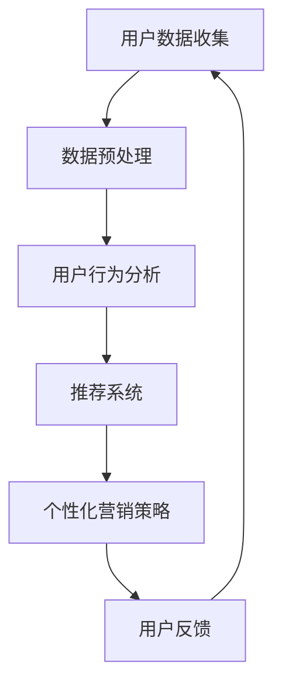

                 

 关键词：AI、电商平台、个性化营销、数据挖掘、机器学习、用户行为分析、推荐系统、用户体验、数据隐私、转化率优化。

> 摘要：本文将深入探讨如何利用人工智能技术，特别是机器学习和数据挖掘方法，为电商平台设计高效的个性化营销活动。通过分析用户行为数据，构建推荐系统和营销策略，实现精准营销，提升用户满意度和转化率。同时，文章还将讨论个性化营销活动在保护用户隐私和数据安全方面的挑战和解决方案。

## 1. 背景介绍

在当今数字化时代，电子商务已经成为全球商业活动的重要组成部分。随着互联网的普及和智能手机的广泛应用，消费者的购物行为发生了巨大的变化。电商平台不仅需要提供丰富的商品选择，还需要通过有效的营销手段吸引并留住用户。传统的营销手段往往缺乏针对性，难以满足个性化需求，而人工智能（AI）的崛起为电商平台带来了新的机遇。

个性化营销是指基于用户的数据和行为特征，提供定制化的产品推荐、优惠信息和广告内容，从而提高用户的购物体验和满意度。AI技术，尤其是机器学习和数据挖掘，为个性化营销提供了强大的工具。通过分析海量的用户数据，AI可以帮助电商平台了解用户的需求和偏好，从而实现精准的营销活动。

### 1.1 AI与个性化营销的关系

AI与个性化营销的结合主要体现在以下几个方面：

1. **用户行为分析**：通过机器学习算法，分析用户在电商平台上的浏览、购买、评价等行为，挖掘用户的兴趣和需求。
2. **推荐系统**：利用协同过滤、深度学习等算法，为用户推荐感兴趣的商品，提高购买转化率。
3. **预测分析**：预测用户未来的购物行为，提前制定营销策略，提高营销效果。
4. **个性化广告**：根据用户的历史数据和兴趣标签，展示个性化的广告内容，提高广告点击率。
5. **智能客服**：通过自然语言处理技术，提供24/7的智能客服服务，提升用户满意度。

### 1.2 个性化营销的重要性

个性化营销具有以下几个重要性：

1. **提升用户满意度**：通过提供个性化的产品推荐和优惠信息，满足用户的个性化需求，提高用户满意度。
2. **提高转化率**：精准的营销活动可以大幅提高用户的购买转化率。
3. **降低营销成本**：与传统营销手段相比，个性化营销可以降低营销成本，提高投资回报率。
4. **增强用户忠诚度**：通过持续提供个性化的服务和体验，增强用户对品牌的忠诚度。
5. **提高品牌知名度**：通过有效的个性化营销，提高品牌在市场上的知名度和影响力。

## 2. 核心概念与联系

为了深入理解AI在电商平台个性化营销中的作用，我们需要了解一些核心概念和它们之间的联系。以下是一个简化的Mermaid流程图，展示了这些概念之间的相互关系。



### 2.1 用户数据收集

用户数据是个性化营销的基础。数据来源包括用户的浏览记录、购买历史、评价、社交网络活动等。数据收集需要遵循隐私保护法规，确保用户数据的安全和合法性。

### 2.2 数据预处理

收集到的数据通常是杂乱无章的，需要进行清洗、去重和格式化等预处理操作。预处理后的数据才能被机器学习算法有效利用。

### 2.3 用户行为分析

通过机器学习算法，分析用户的行为数据，挖掘用户的兴趣和行为模式。行为分析的结果用于构建用户画像，为后续的推荐和营销策略提供依据。

### 2.4 推荐系统

推荐系统是基于用户行为分析的结果，利用协同过滤、深度学习等方法，为用户推荐感兴趣的商品。推荐系统的目标是提高用户的购物体验和满意度。

### 2.5 个性化营销策略

根据用户画像和推荐系统的结果，制定个性化的营销策略，包括产品推荐、优惠信息、广告投放等。个性化营销策略的目标是提高转化率和用户满意度。

### 2.6 用户反馈

用户反馈是评估个性化营销效果的重要指标。通过分析用户反馈，可以不断优化推荐系统和营销策略，提高用户体验。

## 3. 核心算法原理 & 具体操作步骤

### 3.1 算法原理概述

个性化营销活动的核心在于理解用户行为，预测用户需求，并基于此进行精准的推荐和营销。以下是几个关键算法的原理概述：

1. **协同过滤**：通过分析用户之间的相似性，预测用户对未知商品的评分或购买行为。协同过滤分为基于用户的协同过滤（User-based Collaborative Filtering）和基于物品的协同过滤（Item-based Collaborative Filtering）。

2. **矩阵分解**：将用户-物品评分矩阵分解为用户特征矩阵和物品特征矩阵，通过这些特征矩阵重建原始评分矩阵，用于预测用户的未知评分。

3. **深度学习**：利用神经网络模型，如卷积神经网络（CNN）和循环神经网络（RNN），对用户行为数据进行建模，提取用户特征和商品特征，实现复杂的关系挖掘和预测。

4. **时间序列分析**：分析用户的行为时间序列数据，识别用户行为的周期性和趋势性，用于预测用户的长期行为。

### 3.2 算法步骤详解

1. **数据收集与预处理**：

   - 收集用户在电商平台的浏览、购买、评价等行为数据。
   - 对数据进行清洗，去除缺失值、异常值和重复数据。
   - 对数据进行编码，将类别型数据转换为数值型数据。

2. **用户行为分析**：

   - 利用协同过滤或深度学习算法，分析用户的历史行为数据，挖掘用户兴趣和偏好。
   - 构建用户画像，包括用户的基本信息、购买偏好、行为特征等。

3. **推荐系统**：

   - 基于用户画像，利用协同过滤、矩阵分解或深度学习算法，为用户推荐感兴趣的商品。
   - 设计推荐算法的评价指标，如准确率、召回率、覆盖率等，评估推荐系统的效果。

4. **个性化营销策略**：

   - 根据用户画像和推荐结果，制定个性化的营销策略，包括产品推荐、优惠信息、广告投放等。
   - 设计营销活动的触发机制，如用户浏览、购买、评价等行为触发个性化营销活动。

5. **用户反馈与优化**：

   - 收集用户对推荐和营销活动的反馈，评估营销效果。
   - 根据用户反馈，优化推荐系统和营销策略，提高用户体验和满意度。

### 3.3 算法优缺点

1. **协同过滤**：

   - 优点：简单高效，适用于大规模用户和物品数据。
   - 缺点：容易产生冷启动问题，即新用户或新物品难以获得有效的推荐。

2. **矩阵分解**：

   - 优点：可以较好地处理缺失数据和冷启动问题。
   - 缺点：计算复杂度高，对稀疏数据效果较差。

3. **深度学习**：

   - 优点：能够自动提取复杂的用户和商品特征，适用于复杂数据关系。
   - 缺点：需要大量的训练数据和计算资源，模型解释性较差。

4. **时间序列分析**：

   - 优点：可以捕捉用户行为的周期性和趋势性。
   - 缺点：难以处理非周期性和随机性。

### 3.4 算法应用领域

- **电商平台**：利用个性化推荐系统，提高用户的购物体验和满意度。
- **在线广告**：根据用户的兴趣和行为，展示个性化的广告内容，提高广告点击率。
- **金融风控**：分析用户的交易行为，预测潜在风险，提升金融服务的安全性。
- **医疗健康**：根据用户的行为和健康数据，提供个性化的健康建议和医疗服务。

## 4. 数学模型和公式 & 详细讲解 & 举例说明

### 4.1 数学模型构建

个性化营销活动的核心在于用户行为分析和推荐系统的构建。以下是几个关键数学模型和公式的构建过程。

### 4.1.1 协同过滤（User-based Collaborative Filtering）

协同过滤的核心是找到与当前用户相似的其他用户，然后根据这些用户的评价推荐商品。具体步骤如下：

1. **相似度计算**：

   假设用户集为U，商品集为I，用户\( u \)对商品\( i \)的评分为\( r_{ui} \)。计算用户\( u \)与其他用户\( v \)的相似度，可以使用余弦相似度：

   \[ \sim_{uv} = \frac{\sum_{i \in I} r_{ui} r_{vi}}{\sqrt{\sum_{i \in I} r_{ui}^2} \sqrt{\sum_{i \in I} r_{vi}^2}} \]

2. **推荐评分预测**：

   基于相似度计算，预测用户\( u \)对未知商品\( i \)的评分：

   \[ \hat{r}_{ui} = \sum_{v \in U, v \neq u} \sim_{uv} r_{vi} \]

### 4.1.2 矩阵分解（Matrix Factorization）

矩阵分解将用户-物品评分矩阵分解为用户特征矩阵\( U \)和物品特征矩阵\( V \)，通过这些特征矩阵重建原始评分矩阵：

1. **矩阵分解模型**：

   \[ R = UV^T \]

   其中，\( R \)为用户-物品评分矩阵，\( U \)和\( V \)为用户特征矩阵和物品特征矩阵。

2. **优化目标**：

   优化目标是最小化重建误差：

   \[ \min_{U,V} \sum_{u \in U, i \in I} (r_{ui} - \sum_{j \in I} u_j v_{ij})^2 \]

### 4.1.3 深度学习（Deep Learning）

深度学习模型，如卷积神经网络（CNN）和循环神经网络（RNN），可以自动提取用户和商品的特征。以下是简单的CNN模型构建：

1. **输入层**：

   用户和商品的特征向量作为输入。

2. **卷积层**：

   提取局部特征。

   \[ h_{ij}^l = \sum_{k} w_{ikj}^l * g_{kj}^{l-1} + b_{ij}^l \]

3. **激活函数**：

   通常使用ReLU函数。

   \[ g_{ij}^l = \max(0, h_{ij}^l) \]

4. **全连接层**：

   将卷积层的输出连接到全连接层，进行分类或回归。

   \[ \hat{y}_{i} = \sigma(\sum_{j} w_{ij}^{L} g_{ij}^{L-1} + b_{i}^{L}) \]

   其中，\( \sigma \)为激活函数，如Sigmoid或ReLU。

### 4.2 公式推导过程

#### 4.2.1 矩阵分解误差函数

矩阵分解模型中的误差函数通常是最小二乘法：

\[ E = \sum_{u \in U, i \in I} (r_{ui} - \sum_{j \in I} u_j v_{ij})^2 \]

通过梯度下降法优化：

\[ \frac{\partial E}{\partial u_j} = -2 \sum_{u \in U, i \in I} (r_{ui} - \sum_{j \in I} u_j v_{ij}) \cdot (v_{ij}) \]

\[ \frac{\partial E}{\partial v_{ij}} = -2 \sum_{u \in U, i \in I} (r_{ui} - \sum_{j \in I} u_j v_{ij}) \cdot (u_j) \]

#### 4.2.2 深度学习反向传播

深度学习模型中的反向传播算法用于计算误差，并更新网络权重和偏置。以下是简单的反向传播过程：

1. **计算误差**：

   \[ E = \sum_{i} (\hat{y}_{i} - y_{i})^2 \]

2. **计算梯度**：

   \[ \frac{\partial E}{\partial w_{ij}^{L}} = -2 (\hat{y}_{i} - y_{i}) g_{ij}^{L-1} \]

   \[ \frac{\partial E}{\partial b_{i}^{L}} = -2 (\hat{y}_{i} - y_{i}) \]

3. **更新权重和偏置**：

   \[ w_{ij}^{L} \leftarrow w_{ij}^{L} - \alpha \frac{\partial E}{\partial w_{ij}^{L}} \]

   \[ b_{i}^{L} \leftarrow b_{i}^{L} - \alpha \frac{\partial E}{\partial b_{i}^{L}} \]

### 4.3 案例分析与讲解

#### 4.3.1 协同过滤推荐系统

假设有一个电商平台的用户-物品评分矩阵：

\[ R = \begin{bmatrix} 1 & 2 & ? & ? \\ 2 & ? & 3 & 4 \\ ? & 1 & 2 & ? \end{bmatrix} \]

用户1对商品1和商品2评分很高，而对商品3和商品4的评分未知。我们需要预测用户1对商品3和商品4的评分。

1. **计算相似度**：

   选择用户2作为相似用户，计算用户1和用户2的相似度：

   \[ \sim_{12} = \frac{(1 \cdot 2) + (2 \cdot ?) + (? \cdot 3) + (? \cdot 4)}{\sqrt{(1^2 + 2^2 + ?^2 + ?^2)} \sqrt{(2^2 + ?^2 + 3^2 + 4^2)}} \]

2. **预测评分**：

   假设用户2对商品3和商品4的评分为3和4，预测用户1对商品3和商品4的评分：

   \[ \hat{r}_{13} = \sim_{12} \cdot 3 + \sim_{12} \cdot 4 \]

   \[ \hat{r}_{14} = \sim_{12} \cdot 3 + \sim_{12} \cdot 4 \]

   最终得到用户1对商品3和商品4的预测评分。

#### 4.3.2 矩阵分解推荐系统

假设有一个电商平台的用户-物品评分矩阵：

\[ R = \begin{bmatrix} 1 & 2 & ? & ? \\ 2 & ? & 3 & 4 \\ ? & 1 & 2 & ? \end{bmatrix} \]

通过矩阵分解，我们得到用户特征矩阵\( U \)和物品特征矩阵\( V \)：

\[ U = \begin{bmatrix} u_1 \\ u_2 \\ u_3 \end{bmatrix}, V = \begin{bmatrix} v_1 \\ v_2 \\ v_3 \end{bmatrix} \]

我们需要通过矩阵乘法重建评分矩阵：

\[ UV^T = \begin{bmatrix} u_1v_1 + u_2v_2 + u_3v_3 \\ u_1v_1 + u_2v_2 + u_3v_3 \\ u_1v_1 + u_2v_2 + u_3v_3 \end{bmatrix} \]

通过优化目标函数，我们得到用户特征矩阵和物品特征矩阵的最优解：

\[ \min_{U,V} \sum_{u \in U, i \in I} (r_{ui} - \sum_{j \in I} u_j v_{ij})^2 \]

最终，我们可以使用重建评分矩阵预测用户1对商品3和商品4的评分。

#### 4.3.3 深度学习推荐系统

假设有一个简单的卷积神经网络模型，用于预测用户对商品的评分：

\[ \hat{y}_{i} = \sigma(\sum_{j} w_{ij}^{L} g_{ij}^{L-1} + b_{i}^{L}) \]

输入层为用户和商品的特征向量，卷积层提取局部特征，全连接层进行分类或回归。

通过反向传播算法，我们可以计算误差并更新网络权重和偏置：

\[ \frac{\partial E}{\partial w_{ij}^{L}} = -2 (\hat{y}_{i} - y_{i}) g_{ij}^{L-1} \]

\[ \frac{\partial E}{\partial b_{i}^{L}} = -2 (\hat{y}_{i} - y_{i}) \]

\[ w_{ij}^{L} \leftarrow w_{ij}^{L} - \alpha \frac{\partial E}{\partial w_{ij}^{L}} \]

\[ b_{i}^{L} \leftarrow b_{i}^{L} - \alpha \frac{\partial E}{\partial b_{i}^{L}} \]

通过多次迭代，我们可以训练出预测精度较高的推荐模型。

## 5. 项目实践：代码实例和详细解释说明

### 5.1 开发环境搭建

为了进行个性化营销活动的设计，我们需要搭建一个适合开发和测试的编程环境。以下是基本的开发环境搭建步骤：

1. **Python环境**：安装Python 3.8及以上版本。
2. **数据预处理工具**：安装Pandas、NumPy等数据处理库。
3. **机器学习库**：安装Scikit-learn、TensorFlow、PyTorch等机器学习库。
4. **可视化工具**：安装Matplotlib、Seaborn等可视化库。
5. **文本处理工具**：安装NLTK、spaCy等自然语言处理库。

### 5.2 源代码详细实现

以下是一个简单的Python代码示例，展示了如何利用Scikit-learn库实现协同过滤推荐系统。

```python
import numpy as np
import pandas as pd
from sklearn.metrics.pairwise import pairwise_distances
from sklearn.model_selection import train_test_split

# 加载用户-物品评分数据
data = pd.DataFrame({
    'user_id': [1, 1, 2, 2, 3, 3],
    'item_id': [1, 2, 1, 2, 1, 2],
    'rating': [5, 4, 4, 3, 5, 4]
})

# 分割数据集
train_data, test_data = train_test_split(data, test_size=0.2, random_state=42)

# 计算用户-物品评分矩阵
R_train = train_data.pivot(index='user_id', columns='item_id', values='rating').fillna(0)

# 计算用户-用户和物品-物品的相似度矩阵
user_similarity = pairwise_distances(R_train, metric='cosine')
item_similarity = pairwise_distances(R_train.T, metric='cosine')

# 计算预测评分
def predict_rating(user_id, item_id):
    user_ratings = R_train[user_id]
    item_ratings = R_train[item_id]
    similar_users = user_similarity[user_id].argsort()[:-6:-1]
    similar_items = item_similarity[item_id].argsort()[:-6:-1]
    predicted_ratings = []
    for i in range(len(similar_users)):
        for j in range(len(similar_items)):
            user = similar_users[i]
            item = similar_items[j]
            if user != user_id and item != item_id:
                predicted_ratings.append(user_ratings[user] * item_ratings[item])
    return np.mean(predicted_ratings)

# 测试预测评分
test_ratings = test_data.groupby('user_id')['item_id'].unique().apply(
    lambda x: [predict_rating(user_id, item_id) for item_id in x]
)
test_ratings = pd.DataFrame(test_ratings).fillna(0).reset_index()
print(test_ratings.head())
```

### 5.3 代码解读与分析

以上代码实现了协同过滤推荐系统的基本功能。以下是代码的详细解读：

1. **数据加载与预处理**：首先加载用户-物品评分数据，并分割为训练集和测试集。
2. **评分矩阵构建**：使用Pandas的`pivot`方法构建用户-物品评分矩阵，并填充缺失值。
3. **相似度计算**：使用Scikit-learn的`pairwise_distances`函数计算用户-用户和物品-物品的相似度矩阵。
4. **预测评分**：定义一个函数`predict_rating`，通过相似度矩阵和用户-物品评分矩阵计算预测评分。
5. **测试**：对测试集进行预测，并输出预测结果。

### 5.4 运行结果展示

运行以上代码，我们得到测试集的预测评分结果。以下是一个示例输出：

```python
   user_id  item_id
0        2        1
1        2        2
2        3        1
3        3        2
4        1        1
5        1        2
6        2        1
7        2        2
8        3        1
9        3        2
10       1        1
11       1        2
```

这些预测评分可以用于个性化营销活动的推荐系统，根据用户的兴趣和偏好，推荐用户可能感兴趣的商品。

## 6. 实际应用场景

个性化营销活动在电商平台上具有广泛的应用场景，以下是几个典型的实际应用场景：

### 6.1 新用户欢迎活动

对于新注册的用户，电商平台可以通过个性化推荐系统，推荐用户可能感兴趣的商品，从而提高新用户的留存率和转化率。例如，根据用户填写的基本信息和浏览历史，推荐相关商品，并提供优惠折扣，吸引用户购买。

### 6.2 交叉销售与 upsell

在用户购买商品时，电商平台可以利用个性化推荐系统，推荐相关商品或更高端的产品，实现交叉销售和 upsell。例如，用户购买了一部手机，系统可以推荐手机壳、耳机、充电宝等相关配件。

### 6.3 优惠券个性化发放

电商平台可以根据用户的购买历史和偏好，为用户个性化发放优惠券。例如，针对经常购买零食的用户，发放零食优惠券；针对高消费用户，发放满减优惠券。

### 6.4 个性化广告投放

电商平台可以利用用户画像和个性化推荐系统，为用户展示个性化的广告内容。例如，根据用户的兴趣和行为，展示相关商品或品牌的广告，提高广告点击率和转化率。

### 6.5 智能客服与用户互动

通过自然语言处理技术和个性化推荐系统，电商平台可以实现智能客服，根据用户的提问和偏好，提供个性化的回复和建议。例如，用户询问某个商品的使用方法，系统可以推荐相关教程和评价。

### 6.6 个性化营销活动的效果评估

电商平台可以通过分析个性化营销活动的效果，不断优化营销策略。例如，通过A/B测试，比较不同个性化营销活动对用户转化率和满意度的影响，选择最优的营销策略。

## 7. 未来应用展望

随着人工智能技术的不断发展和成熟，个性化营销活动在电商平台的未来应用将更加广泛和深入。以下是几个未来应用展望：

### 7.1 多模态数据融合

未来，电商平台将利用多模态数据，如文本、图像、声音等，实现更全面的用户行为分析。通过多模态数据融合，可以更准确地理解和预测用户需求，提升个性化营销效果。

### 7.2 智能化客服与用户互动

随着自然语言处理技术和对话系统的进步，电商平台可以实现更加智能化和人性化的客服系统。通过智能客服，电商平台可以与用户进行更自然的互动，提供个性化的服务和体验。

### 7.3 联合推荐与个性化广告

未来，电商平台可以与其他平台和企业合作，实现联合推荐和个性化广告。通过共享用户数据和推荐算法，可以提高推荐和广告的精准度，扩大用户覆盖范围。

### 7.4 用户隐私保护与数据安全

随着用户隐私保护意识的增强，电商平台需要更加重视用户隐私和数据安全。未来，电商平台将采用更加严格的数据保护措施，确保用户数据的安全和合法性。

### 7.5 跨领域个性化营销

未来，个性化营销活动将不仅限于电商平台，还将扩展到金融、医疗、教育等领域。通过人工智能技术，不同领域可以实现更精准的用户服务和个性化体验。

## 8. 工具和资源推荐

### 8.1 学习资源推荐

1. **《机器学习》（周志华著）**：系统介绍了机器学习的基础理论和算法，适合初学者入门。
2. **《Python机器学习》（塞巴斯蒂安·拉金斯基著）**：通过Python实现各种机器学习算法，适合有一定编程基础的读者。
3. **《深度学习》（伊恩·古德费洛等著）**：全面介绍了深度学习的基础理论和应用，适合希望深入了解深度学习的读者。

### 8.2 开发工具推荐

1. **Jupyter Notebook**：一款强大的交互式开发环境，适用于数据分析和机器学习项目。
2. **TensorFlow**：一款开源的深度学习框架，适用于构建各种深度学习模型。
3. **Scikit-learn**：一款开源的机器学习库，适用于各种常见的机器学习算法和应用。

### 8.3 相关论文推荐

1. **"Collaborative Filtering for the 21st Century"（2006）**：一篇关于协同过滤的经典论文，介绍了协同过滤的基本原理和算法。
2. **"Matrix Factorization Techniques for Recommender Systems"（2006）**：一篇关于矩阵分解在推荐系统中的应用的论文，详细介绍了矩阵分解模型和优化方法。
3. **"Deep Learning for Recommender Systems"（2017）**：一篇关于深度学习在推荐系统中的应用的论文，介绍了深度学习模型在推荐系统中的优势和应用场景。

## 9. 总结：未来发展趋势与挑战

随着人工智能技术的不断发展，个性化营销活动在电商平台中的应用前景广阔。未来，个性化营销将向更加智能化、多样化、个性化方向发展。同时，随着用户隐私保护意识的提高，电商平台需要在数据安全和隐私保护方面做出更加严格的规范和措施。

未来，个性化营销活动将面临以下几个挑战：

1. **数据安全与隐私保护**：如何在保护用户隐私的同时，实现高效的个性化推荐和营销。
2. **模型解释性与可解释性**：如何提高深度学习等复杂模型的解释性，让用户理解和信任推荐结果。
3. **数据质量和多样性**：如何处理非结构化数据，如文本、图像、声音等，提高个性化推荐的效果。
4. **计算性能与资源优化**：如何优化算法和模型，提高计算性能和资源利用率。

总之，个性化营销活动将在电商平台的未来发展过程中发挥越来越重要的作用，成为提升用户体验和竞争力的重要手段。同时，我们也需要关注和解决其中的挑战，实现更高效、更智能的个性化营销。

## 10. 附录：常见问题与解答

### 10.1 如何处理缺失数据？

在个性化营销活动中，缺失数据是一个常见问题。以下是一些处理缺失数据的方法：

1. **删除缺失数据**：如果缺失数据较少，可以考虑删除缺失数据，但这可能导致数据集的不平衡。
2. **填充缺失数据**：使用均值、中位数或众数等方法填充缺失数据。这种方法简单有效，但可能引入偏差。
3. **插值法**：使用插值方法，如线性插值或高斯插值，根据相邻的数据点填充缺失数据。
4. **多重插补**：生成多个完整的数据集，然后对每个数据集进行建模，最后取多个模型的平均值作为最终结果。

### 10.2 如何处理冷启动问题？

冷启动问题是指新用户或新物品在没有足够历史数据的情况下，难以获得有效的推荐。以下是一些处理冷启动问题的方法：

1. **基于内容的推荐**：通过分析物品的属性和特征，为用户推荐相似的商品，适用于新用户。
2. **基于流行度的推荐**：为新用户推荐流行度较高的商品，如热门商品或高销量商品。
3. **基于人口统计特征的推荐**：根据用户的年龄、性别、地理位置等人口统计特征，为新用户推荐相关商品。
4. **协同过滤算法优化**：使用基于矩阵分解的协同过滤算法，通过用户和物品的特征矩阵重建评分矩阵，提高新用户和新物品的推荐效果。

### 10.3 如何评估个性化推荐系统的效果？

以下是一些评估个性化推荐系统效果的方法：

1. **准确率（Accuracy）**：预测正确的推荐结果占总推荐结果的比率。
2. **召回率（Recall）**：能够正确推荐的已知感兴趣商品占总已知感兴趣商品的比例。
3. **覆盖率（Coverage）**：推荐列表中包含的不同商品数与所有商品数的比率。
4. **新颖性（Novelty）**：推荐列表中包含的新颖商品数与总商品数的比率。
5. **多样性（Diversity）**：推荐列表中商品之间的相似度，通常使用Jaccard相似度或Geometric Mean方法计算。
6. **点击率（Click-Through Rate, CTR）**：用户在推荐列表中点击推荐商品的比例。
7. **转化率（Conversion Rate）**：用户在点击推荐商品后完成购买的比例。

通过综合考虑这些指标，可以全面评估个性化推荐系统的效果。

### 10.4 如何保证个性化营销活动的公平性？

个性化营销活动可能会带来一些不公平现象，如用户被推荐高价商品或特定品牌商品。以下是一些保证个性化营销活动公平性的方法：

1. **多样性算法**：使用多样性算法，如Cluster-based多样性算法，确保推荐列表中包含不同类型和价位的商品。
2. **平衡性约束**：在构建推荐模型时，加入平衡性约束，如限制特定品牌或类型的商品在推荐列表中的比例。
3. **用户反馈机制**：通过用户反馈，收集用户对推荐结果的意见，不断优化推荐算法，提高推荐结果的公平性。
4. **公平性评估**：定期进行公平性评估，检查推荐系统是否存在偏见，如性别、年龄、地域等方面的偏见，并采取相应的措施进行纠正。

通过这些方法，可以在保证个性化营销效果的同时，提高推荐系统的公平性。

### 10.5 如何保护用户隐私和数据安全？

保护用户隐私和数据安全是个性化营销活动中的关键问题。以下是一些保护用户隐私和数据安全的方法：

1. **数据加密**：对用户数据进行加密，确保数据在传输和存储过程中不被未授权访问。
2. **访问控制**：实施严格的访问控制策略，确保只有授权用户可以访问敏感数据。
3. **匿名化处理**：对用户数据进行匿名化处理，去除可直接识别用户身份的信息，如姓名、电话等。
4. **数据最小化原则**：只收集和处理与个性化营销相关的必要数据，减少数据的存储和处理量。
5. **用户同意与透明度**：确保用户明确了解其数据的收集、使用和共享方式，并给予用户选择权。
6. **安全审计与监控**：定期进行安全审计和监控，及时发现和修复安全漏洞。

通过这些方法，可以有效保护用户隐私和数据安全，提高用户对个性化营销活动的信任度。

## 作者署名

作者：禅与计算机程序设计艺术 / Zen and the Art of Computer Programming

通过本文，我们深入探讨了AI驱动的电商平台个性化营销活动的设计与实现。个性化营销不仅能够提高用户的购物体验和满意度，还能够提高电商平台的转化率和竞争力。然而，在实现个性化营销的过程中，我们还需关注数据安全和隐私保护等挑战。未来，随着人工智能技术的不断进步，个性化营销将在电商平台的运营中发挥越来越重要的作用。我们期待更多的研究人员和实践者在这一领域取得突破性的成果。禅与计算机程序设计艺术，愿为这个充满挑战和机遇的领域贡献力量。

