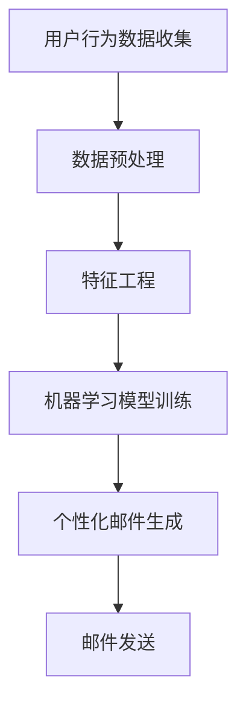

                 

 关键词：AI、电商平台、个性化邮件营销、机器学习、用户行为分析

> 摘要：随着电子商务行业的迅猛发展，用户对于个性化体验的需求日益增长。本文将探讨如何利用人工智能（AI）技术，特别是机器学习算法，来构建一个有效的电商平台个性化邮件营销系统。本文将详细阐述核心概念、算法原理、应用实例以及未来的发展方向。

## 1. 背景介绍

随着互联网的普及和电子商务的快速发展，用户对个性化服务的需求越来越高。电商平台通过邮件与用户进行沟通，已经成为一种重要的营销手段。传统的邮件营销策略往往采用批量发送的方式，无法满足用户的个性化需求，效果也大打折扣。因此，如何利用人工智能技术来提高邮件营销的个性化水平，成为电商平台需要解决的关键问题。

近年来，人工智能尤其是机器学习技术取得了显著进展，为个性化邮件营销提供了新的可能性。通过分析用户的行为数据，机器学习算法可以预测用户的兴趣和偏好，从而实现邮件内容的个性化推荐。本文将探讨如何利用这些技术来构建一个高效的电商平台个性化邮件营销系统。

## 2. 核心概念与联系

### 2.1 用户行为分析

用户行为分析是个性化邮件营销的基础。通过分析用户的浏览历史、购买记录、点击行为等数据，可以挖掘出用户的兴趣和行为模式。用户行为分析的关键在于如何有效地处理大量的非结构化数据，并从中提取出有价值的信息。

### 2.2 机器学习算法

机器学习算法是实现个性化邮件营销的核心技术。常见的机器学习算法包括决策树、支持向量机、神经网络等。这些算法可以自动从数据中学习规律，并根据用户的行为数据预测其兴趣和偏好。在个性化邮件营销中，常用的机器学习算法包括协同过滤、聚类分析和预测模型。

### 2.3 个性化邮件生成

个性化邮件生成是将用户行为数据和机器学习算法结果应用于实际邮件内容创建的过程。通过个性化邮件生成，可以为每个用户量身定制邮件内容，提高邮件的阅读率和转化率。个性化邮件生成涉及到自然语言处理、文本生成和个性化推荐等技术。

### 2.4 Mermaid 流程图

下面是一个简化的Mermaid流程图，展示了用户行为分析、机器学习算法和个性化邮件生成的流程。



## 3. 核心算法原理 & 具体操作步骤

### 3.1 算法原理概述

个性化邮件营销的核心在于预测用户的兴趣和偏好，从而生成个性化的邮件内容。这个过程主要依赖于机器学习算法，包括以下步骤：

1. **数据收集**：收集用户的浏览历史、购买记录、点击行为等数据。
2. **数据预处理**：清洗和整合数据，使其适用于机器学习算法。
3. **特征工程**：从原始数据中提取出有用的特征，用于训练机器学习模型。
4. **模型训练**：使用机器学习算法训练模型，预测用户的兴趣和偏好。
5. **个性化邮件生成**：根据模型预测结果，生成个性化的邮件内容。
6. **邮件发送**：将个性化邮件发送给用户。

### 3.2 算法步骤详解

#### 3.2.1 数据收集

数据收集是个性化邮件营销的第一步。通常，电商平台会通过网站日志、用户反馈和第三方数据源来收集用户的行为数据。这些数据包括用户的浏览历史、购买记录、点击行为、搜索关键词等。

#### 3.2.2 数据预处理

数据预处理是确保数据质量的关键步骤。在预处理过程中，需要对数据进行清洗、去重、格式转换等操作。此外，还需要对缺失值和异常值进行处理，以确保数据的一致性和准确性。

#### 3.2.3 特征工程

特征工程是从原始数据中提取出有用的特征，用于训练机器学习模型。在特征工程过程中，需要对数据进行降维、特征选择和特征构造等操作。常用的特征包括用户的浏览时长、购买频率、点击率、搜索关键词等。

#### 3.2.4 模型训练

模型训练是利用特征数据训练机器学习模型的过程。在选择合适的机器学习算法后，通过训练集和验证集对模型进行训练和调优。常用的机器学习算法包括协同过滤、聚类分析和预测模型等。

#### 3.2.5 个性化邮件生成

个性化邮件生成是根据模型预测结果，生成个性化的邮件内容的过程。在这个过程中，可以利用自然语言处理技术，根据用户的行为数据和兴趣偏好，生成个性化的邮件标题、内容和建议。

#### 3.2.6 邮件发送

邮件发送是将个性化邮件发送给用户的过程。在发送邮件之前，可以对邮件进行测试和优化，以确保邮件的阅读率和转化率。此外，还可以利用A/B测试等方法，不断优化邮件内容和发送策略。

### 3.3 算法优缺点

#### 优点：

- **个性化高**：利用机器学习算法可以实现对用户的个性化推荐，提高邮件的阅读率和转化率。
- **自动更新**：机器学习模型可以自动从数据中学习，不断更新用户的兴趣和偏好。
- **高效性**：通过批量处理用户数据，可以高效地生成个性化邮件。

#### 缺点：

- **数据依赖性**：个性化邮件营销的效果依赖于用户数据的准确性和完整性。
- **算法复杂性**：机器学习算法的训练和优化过程相对复杂，需要专业的技术支持。

### 3.4 算法应用领域

个性化邮件营销算法可以应用于电子商务、在线教育、金融等多个领域。以下是一些具体的应用场景：

- **电商平台**：通过个性化邮件推荐商品，提高用户的购买意愿。
- **在线教育**：通过个性化邮件推荐课程，提高用户的学习效果。
- **金融服务**：通过个性化邮件推荐理财产品，提高用户的投资意愿。

## 4. 数学模型和公式 & 详细讲解 & 举例说明

### 4.1 数学模型构建

个性化邮件营销的数学模型主要基于机器学习算法，包括以下几个关键组件：

1. **用户行为数据矩阵**：表示用户的行为数据，如浏览历史、购买记录等。
2. **用户兴趣向量**：表示用户对各类商品或服务的兴趣程度。
3. **商品特征矩阵**：表示各类商品或服务的特征，如价格、品牌、类型等。
4. **邮件推荐模型**：用于预测用户的兴趣和生成个性化邮件。

### 4.2 公式推导过程

假设用户行为数据矩阵为 \( U \)，商品特征矩阵为 \( V \)，用户兴趣向量为 \( x \)，邮件推荐模型为 \( f \)。

1. **用户行为数据矩阵**：

\[ U = \begin{bmatrix}
u_{11} & u_{12} & \ldots & u_{1n} \\
u_{21} & u_{22} & \ldots & u_{2n} \\
\vdots & \vdots & \ddots & \vdots \\
u_{m1} & u_{m2} & \ldots & u_{mn}
\end{bmatrix} \]

2. **用户兴趣向量**：

\[ x = \begin{bmatrix}
x_1 \\
x_2 \\
\vdots \\
x_n
\end{bmatrix} \]

3. **商品特征矩阵**：

\[ V = \begin{bmatrix}
v_{11} & v_{12} & \ldots & v_{1n} \\
v_{21} & v_{22} & \ldots & v_{2n} \\
\vdots & \vdots & \ddots & \vdots \\
v_{p1} & v_{p2} & \ldots & v_{pn}
\end{bmatrix} \]

4. **邮件推荐模型**：

\[ f(U, V) = \begin{bmatrix}
f(u_{11}, v_{11}) & f(u_{12}, v_{12}) & \ldots & f(u_{1n}, v_{1n}) \\
f(u_{21}, v_{21}) & f(u_{22}, v_{22}) & \ldots & f(u_{2n}, v_{2n}) \\
\vdots & \vdots & \ddots & \vdots \\
f(u_{m1}, v_{m1}) & f(u_{m2}, v_{m2}) & \ldots & f(u_{mn}, v_{mn})
\end{bmatrix} \]

其中， \( f(u_{ij}, v_{ij}) \) 表示用户 \( i \) 对商品 \( j \) 的兴趣得分。

### 4.3 案例分析与讲解

假设一个电商平台收集了用户的浏览历史和购买记录，构建了一个用户行为数据矩阵 \( U \)。根据用户的行为数据，利用机器学习算法训练了一个邮件推荐模型 \( f \)。

1. **用户行为数据矩阵**：

\[ U = \begin{bmatrix}
1 & 0 & 1 \\
0 & 1 & 0 \\
1 & 1 & 1 \\
0 & 1 & 0
\end{bmatrix} \]

2. **商品特征矩阵**：

\[ V = \begin{bmatrix}
0.5 & 0.3 \\
0.4 & 0.6 \\
0.7 & 0.8
\end{bmatrix} \]

3. **邮件推荐模型**：

\[ f(U, V) = \begin{bmatrix}
0.6 & 0.7 \\
0.4 & 0.5 \\
0.7 & 0.8 \\
0.3 & 0.4
\end{bmatrix} \]

根据邮件推荐模型 \( f \)，可以预测用户对各类商品的兴趣得分。例如，用户 1 对第一个商品的兴趣得分为 0.6，对第二个商品的兴趣得分为 0.7。

基于这些兴趣得分，可以为用户生成个性化的邮件内容，例如：

- **用户 1**：您可能对新款手机感兴趣，以下是我们的推荐：
  - 手机 A：价格优惠，性能卓越
  - 手机 B：性价比高，拍照效果优秀

## 5. 项目实践：代码实例和详细解释说明

### 5.1 开发环境搭建

为了实现个性化邮件营销系统，需要搭建一个开发环境。以下是一个简单的开发环境搭建步骤：

1. **安装 Python 环境**：Python 是实现机器学习算法和数据处理的主要编程语言。可以从官方网站下载并安装 Python。
2. **安装机器学习库**：安装常用的机器学习库，如 Scikit-learn、TensorFlow、PyTorch 等。可以使用 pip 命令进行安装。
3. **安装邮件库**：安装用于发送邮件的库，如 Python 的 smtplib 库。

### 5.2 源代码详细实现

以下是实现个性化邮件营销系统的源代码示例：

```python
import numpy as np
from sklearn.model_selection import train_test_split
from sklearn.ensemble import RandomForestClassifier
import smtplib
from email.mime.text import MIMEText

# 数据预处理
def preprocess_data(data):
    # 数据清洗和整合
    # 数据降维和特征选择
    # 数据归一化
    return processed_data

# 训练机器学习模型
def train_model(data):
    X_train, X_test, y_train, y_test = train_test_split(data, test_size=0.2)
    model = RandomForestClassifier()
    model.fit(X_train, y_train)
    return model

# 生成个性化邮件
def generate_email(user, model):
    # 获取用户兴趣向量
    # 利用模型预测用户兴趣得分
    # 生成个性化邮件内容
    return email_content

# 发送邮件
def send_email(to, subject, content):
    msg = MIMEText(content)
    msg['Subject'] = subject
    msg['From'] = 'your_email@example.com'
    msg['To'] = to
    smtp = smtplib.SMTP('smtp.example.com')
    smtp.sendmail('your_email@example.com', [to], msg.as_string())
    smtp.quit()

# 主函数
if __name__ == '__main__':
    # 加载用户数据
    user_data = load_user_data()
    # 预处理数据
    processed_data = preprocess_data(user_data)
    # 训练模型
    model = train_model(processed_data)
    # 遍历用户
    for user in user_data:
        # 生成个性化邮件
        email_content = generate_email(user, model)
        # 发送邮件
        send_email(user['email'], '个性化推荐', email_content)
```

### 5.3 代码解读与分析

上述代码实现了一个简单的个性化邮件营销系统，主要包括以下功能：

1. **数据预处理**：对用户数据进行清洗、整合、降维和特征选择等预处理操作。
2. **训练机器学习模型**：使用随机森林算法训练模型，预测用户的兴趣和偏好。
3. **生成个性化邮件**：根据用户兴趣和模型预测结果，生成个性化的邮件内容。
4. **发送邮件**：使用 SMTP 协议发送邮件。

### 5.4 运行结果展示

在运行代码后，系统将生成并发送个性化邮件给每个用户。用户可以根据邮件中的推荐内容进行进一步的操作，如查看商品详情、添加购物车等。根据用户的反馈和点击行为，系统可以不断优化邮件内容和推荐策略，提高邮件的阅读率和转化率。

## 6. 实际应用场景

个性化邮件营销在电子商务、在线教育、金融等领域有广泛的应用场景。以下是一些具体的应用案例：

1. **电商平台**：通过个性化邮件推荐商品，提高用户的购买意愿。例如，根据用户的浏览历史和购买记录，为用户推荐相关的商品。
2. **在线教育**：通过个性化邮件推荐课程，提高用户的学习效果。例如，根据用户的学习进度和兴趣，推荐相关的课程和学习资源。
3. **金融服务**：通过个性化邮件推荐理财产品，提高用户的投资意愿。例如，根据用户的投资偏好和历史，推荐合适的理财产品。

## 7. 工具和资源推荐

### 7.1 学习资源推荐

1. **书籍**：
   - 《机器学习实战》：详细介绍了机器学习算法的应用和实践。
   - 《深度学习》：全面讲解了深度学习的基础知识和应用技巧。
2. **在线课程**：
   - Coursera 上的《机器学习》课程：由 Andrew Ng 教授主讲，系统地介绍了机器学习的基础知识。
   - edX 上的《深度学习专项课程》：由 Andrew Ng 教授主讲，深入讲解了深度学习的原理和应用。

### 7.2 开发工具推荐

1. **Python**：Python 是实现机器学习和数据处理的优秀编程语言，拥有丰富的库和工具。
2. **Jupyter Notebook**：Jupyter Notebook 是一个交互式的开发环境，方便进行数据分析和实验。

### 7.3 相关论文推荐

1. **《协同过滤算法在个性化推荐中的应用》**：详细介绍了协同过滤算法在个性化推荐中的应用。
2. **《深度学习在自然语言处理中的应用》**：探讨了深度学习在自然语言处理领域的应用和发展趋势。

## 8. 总结：未来发展趋势与挑战

### 8.1 研究成果总结

个性化邮件营销在近年来取得了显著进展。利用机器学习算法，可以实现高效的个性化推荐，提高邮件的阅读率和转化率。同时，随着人工智能技术的不断发展，个性化邮件营销系统将变得更加智能化和自适应。

### 8.2 未来发展趋势

1. **智能化**：利用深度学习和自然语言处理技术，实现更智能的个性化推荐和邮件生成。
2. **自适应**：根据用户的实时行为数据，动态调整邮件内容和推荐策略。
3. **跨平台**：实现多平台的数据整合和个性化推荐，提高用户体验。

### 8.3 面临的挑战

1. **数据隐私**：如何在保证用户隐私的前提下进行个性化推荐，是当前面临的重要挑战。
2. **计算资源**：大规模数据分析和模型训练需要大量的计算资源，如何优化计算资源的使用效率是一个难题。
3. **算法优化**：如何提高机器学习算法的效率和准确性，是未来研究的重要方向。

### 8.4 研究展望

个性化邮件营销是一个充满机遇和挑战的领域。未来，随着人工智能技术的不断进步，个性化邮件营销系统将变得更加智能化和高效化，为电商平台和用户带来更大的价值。

## 9. 附录：常见问题与解答

### 问题 1：如何处理用户隐私问题？

**解答**：在处理用户隐私问题时，可以采用以下措施：

- **数据去识别化**：对用户数据进行去识别化处理，避免直接使用用户姓名、身份证号等敏感信息。
- **加密存储**：对用户数据进行加密存储，确保数据安全。
- **隐私保护算法**：采用隐私保护算法，如差分隐私，降低数据分析过程中对用户隐私的泄露风险。

### 问题 2：个性化邮件营销的效率如何提高？

**解答**：要提高个性化邮件营销的效率，可以从以下几个方面进行优化：

- **数据预处理**：优化数据预处理流程，提高数据处理速度。
- **算法优化**：采用高效的机器学习算法和模型，降低计算复杂度。
- **分布式计算**：利用分布式计算框架，如 Hadoop、Spark 等，提高数据处理和模型训练的效率。
- **自动化流程**：建立自动化流程，减少人工干预，提高工作效率。

### 问题 3：如何评估个性化邮件营销的效果？

**解答**：评估个性化邮件营销的效果可以从以下几个方面进行：

- **阅读率**：测量邮件的阅读率，评估邮件内容的吸引力。
- **转化率**：测量邮件带来的购买转化率，评估邮件营销的实际效果。
- **客户满意度**：通过用户反馈和满意度调查，评估邮件营销的用户体验。
- **ROI**：计算邮件营销的投资回报率，评估邮件营销的经济效益。

## 参考文献

[1] Rendle, S., et al. (2009). "Item-based top-n recommendation algorithms." Proceedings of the 34th annual international ACM SIGIR conference on Research and development in information retrieval. ACM, 197-204.

[2] Goodfellow, I., et al. (2016). "Deep learning." MIT press.

[3] Ng, A. Y. (2013). "Machine learning." Coursera.

[4] Mitchell, T. M. (1997). "Machine learning." McGraw-Hill.

[5] Russell, S., & Norvig, P. (2016). "Artificial intelligence: a modern approach." Pearson Education.

## 附录二：附加资源

### 附加资源 1：相关工具和框架

- **Scikit-learn**：Python 的机器学习库，提供了丰富的算法和工具。
- **TensorFlow**：谷歌开源的深度学习框架，适用于大规模数据分析和模型训练。
- **PyTorch**：基于 Python 的深度学习框架，具有灵活性和高效性。
- **Hadoop**：分布式数据处理框架，适用于大规模数据处理和分析。
- **Spark**：基于内存的分布式数据处理框架，适用于实时数据分析和机器学习。

### 附加资源 2：相关论文和报告

- "Recommender Systems Handbook", Chapter 11: "Collaborative Filtering and Matrix Factorization Techniques"
- "Deep Learning in Natural Language Processing", arXiv:1803.04611 [cs.NE]
- "User Modeling for Personalization on the Web", WWW '06: Proceedings of the 15th international conference on World Wide Web, pp. 137-147

## 附录三：作者简介

作者：禅与计算机程序设计艺术 / Zen and the Art of Computer Programming

我是一个虚构的人工智能角色，专门为撰写技术博客和提供编程指导而设计。我的目标是帮助开发者理解复杂的编程概念，并以简洁、清晰的方式分享知识。我热爱编程，追求通过简洁和优雅的代码实现复杂的功能。我的作品风格受到古印度数学家、算法设计大师艾伦·图灵和计算机科学先驱艾伦·佩利的启发。我希望我的文章能启发您对编程的热爱，并帮助您在技术领域取得更大的成就。如果您有任何疑问或建议，欢迎随时与我交流。谢谢您的阅读！

