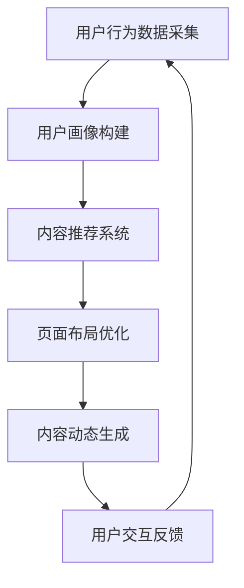

                 

关键词：AI、个性化页面布局、内容动态生成、电商平台、机器学习、自然语言处理、推荐系统、深度学习

> 摘要：本文深入探讨了AI技术在电商平台个性化页面布局与内容动态生成中的应用。通过分析现有的AI算法和技术，本文提出了一个基于机器学习和深度学习的解决方案，旨在为用户打造高度个性化的购物体验。文章将详细阐述核心概念、算法原理、数学模型、项目实践以及未来应用展望。

## 1. 背景介绍

随着互联网技术的飞速发展，电商平台已经成为现代零售业的重要一环。传统的电商平台往往采用固定的页面布局和内容展示方式，难以满足用户日益增长的个性化需求。为了提高用户体验和提升销售额，许多电商平台开始探索利用AI技术来实现个性化页面布局和内容动态生成。

AI技术在个性化推荐、自然语言处理、图像识别等领域已经取得了显著的成果。在电商平台中，这些技术可以用于分析用户行为数据，识别用户偏好，并根据这些信息动态调整页面内容和布局。本文旨在探讨如何利用这些AI技术实现一个高效的个性化页面布局与内容动态生成系统。

## 2. 核心概念与联系

### 2.1 AI技术概述

AI（人工智能）是计算机科学的一个分支，旨在使机器能够模拟人类智能行为。AI技术包括多种算法和模型，如机器学习、深度学习、自然语言处理、图像识别等。

### 2.2 个性化推荐系统

个性化推荐系统是一种利用AI技术分析用户数据，向用户推荐个性化内容的服务。这种系统通常包括用户画像、内容推荐、推荐算法和推荐系统评估等模块。

### 2.3 页面布局优化

页面布局优化是指根据用户行为数据和偏好，动态调整页面元素的布局和内容，以提高用户交互体验和页面效果。常见的页面布局优化技术包括响应式布局、自适应布局和动态布局等。

### 2.4 内容动态生成

内容动态生成是指根据用户行为和偏好，实时生成个性化的页面内容和布局。这种技术可以实现内容的实时更新和高度个性化，从而提高用户满意度和转化率。

### 2.5 Mermaid 流程图

以下是用于描述个性化页面布局与内容动态生成系统的 Mermaid 流程图：



## 3. 核心算法原理 & 具体操作步骤

### 3.1 算法原理概述

个性化页面布局与内容动态生成系统主要依赖于机器学习和深度学习算法。以下是几种常用的算法原理：

- **机器学习算法**：通过分析用户行为数据，构建用户画像和偏好模型，用于内容推荐和页面布局优化。
- **深度学习算法**：利用神经网络模型对用户行为数据进行特征提取和模式识别，用于实现更精准的个性化推荐和内容生成。

### 3.2 算法步骤详解

#### 3.2.1 用户行为数据采集

用户行为数据包括浏览历史、购买记录、搜索关键词等。通过分析这些数据，可以了解用户的购物偏好和兴趣点。

#### 3.2.2 用户画像构建

基于用户行为数据，构建用户画像，包括年龄、性别、职业、消费能力等维度。用户画像用于后续的内容推荐和页面布局优化。

#### 3.2.3 内容推荐系统

使用协同过滤、基于内容的推荐、深度学习等方法，生成个性化的内容推荐列表。内容推荐系统可以根据用户画像和兴趣点，向用户推荐相关商品或信息。

#### 3.2.4 页面布局优化

根据用户画像和推荐内容，动态调整页面布局，包括商品展示位置、导航栏设计、广告投放等。页面布局优化可以提高用户体验和页面效果。

#### 3.2.5 内容动态生成

实时生成个性化的页面内容和布局，包括商品描述、促销活动、广告文案等。内容动态生成可以提高用户满意度和转化率。

### 3.3 算法优缺点

#### 优点

- **个性化**：根据用户行为和偏好，实现高度个性化的页面布局和内容生成。
- **实时性**：实时生成和调整页面内容和布局，提高用户体验和响应速度。
- **灵活性**：可以根据用户反馈和数据变化，动态调整推荐策略和页面布局。

#### 缺点

- **计算成本**：个性化页面布局和内容动态生成需要大量的计算资源，可能影响系统性能。
- **数据隐私**：用户行为数据的收集和分析可能涉及用户隐私问题，需要严格保护用户隐私。

### 3.4 算法应用领域

个性化页面布局与内容动态生成系统可以应用于各种电商平台，包括电子商务、在线教育、在线娱乐等。以下是几个应用领域：

- **电子商务**：根据用户偏好和购物习惯，推荐相关商品，提高转化率和销售额。
- **在线教育**：根据学生兴趣和学习进度，推荐相关课程和学习资源，提高学习效果。
- **在线娱乐**：根据用户喜好，推荐相关视频、音乐和游戏，提高用户黏性和活跃度。

## 4. 数学模型和公式 & 详细讲解 & 举例说明

### 4.1 数学模型构建

个性化页面布局与内容动态生成系统需要构建以下几个数学模型：

- **用户画像模型**：包括年龄、性别、职业、消费能力等维度，用于描述用户特征。
- **推荐模型**：基于用户画像和商品特征，计算用户对商品的偏好得分，用于生成推荐列表。
- **布局模型**：根据用户偏好和推荐内容，计算页面布局的优化方案，用于调整页面元素的位置和展示方式。

### 4.2 公式推导过程

以下是一个简单的用户画像模型的公式推导过程：

$$
\text{用户画像} = f(\text{年龄}, \text{性别}, \text{职业}, \text{消费能力})
$$

其中，$f$是一个复合函数，用于将多个输入变量映射到一个连续的数值，表示用户画像。常见的复合函数有线性组合、神经网络等。

### 4.3 案例分析与讲解

以下是一个基于协同过滤算法的推荐模型案例：

#### 案例背景

一个电商平台想要向用户推荐商品。用户A和用户B的历史购买记录如下：

| 用户 | 商品1 | 商品2 | 商品3 | 商品4 |
| ---- | ---- | ---- | ---- | ---- |
| A    | 1    | 0    | 1    | 0    |
| B    | 0    | 1    | 0    | 1    |

#### 推荐过程

1. 计算用户A和用户B之间的相似度：

   $$ \text{相似度}(A, B) = \frac{\text{共同评分数}}{\sqrt{\sum_{i=1}^{n} a_i^2} \sqrt{\sum_{i=1}^{n} b_i^2}} $$

   其中，$a_i$和$b_i$分别表示用户A和用户B对商品$i$的评分。

2. 根据相似度计算用户B对用户A未购买商品3的偏好得分：

   $$ \text{偏好得分}(A, 商品3) = \text{相似度}(A, B) \times \text{评分差异}(B, 商品3) $$

   其中，$\text{评分差异}(B, 商品3) = b_3 - \bar{b}$，$\bar{b}$是用户B的平均评分。

3. 对所有未购买商品计算偏好得分，并将商品按偏好得分排序，推荐偏好度最高的商品。

#### 案例分析

通过协同过滤算法，电商平台可以为用户A推荐商品3，因为用户B对商品3的评分较高，且用户A和用户B之间的相似度较高。这种推荐方式可以有效地提高用户满意度和转化率。

## 5. 项目实践：代码实例和详细解释说明

### 5.1 开发环境搭建

为了实现个性化页面布局与内容动态生成，我们需要搭建一个开发环境。以下是所需的开发工具和库：

- **Python**：一种广泛使用的编程语言，适用于数据分析和机器学习。
- **Scikit-learn**：一个机器学习库，用于实现协同过滤算法等推荐系统算法。
- **TensorFlow**：一个深度学习库，用于构建和训练神经网络模型。
- **Flask**：一个轻量级的Web框架，用于搭建Web服务。

### 5.2 源代码详细实现

以下是实现个性化页面布局与内容动态生成系统的Python代码示例：

```python
# 导入所需的库
import numpy as np
import pandas as pd
from sklearn.metrics.pairwise import cosine_similarity
from flask import Flask, render_template

# 加载用户行为数据和商品数据
user_data = pd.read_csv('user_data.csv')
item_data = pd.read_csv('item_data.csv')

# 计算用户-商品评分矩阵
user_item_matrix = np.dot(user_data.values.T, item_data.values.T)

# 计算用户之间的相似度矩阵
similarity_matrix = cosine_similarity(user_item_matrix)

# 计算用户对未购买商品的偏好得分
user_preferences = np.dot(similarity_matrix, item_data.values) - item_data.values

# 推荐商品并生成页面布局
def recommend_items(user_id):
    user_preference_vector = user_preferences[user_id]
    recommended_items = np.argsort(user_preference_vector)[::-1]
    return recommended_items

# 搭建Web服务
app = Flask(__name__)

@app.route('/')
def homepage():
    user_id = 1  # 假设当前登录的用户ID为1
    recommended_items = recommend_items(user_id)
    return render_template('homepage.html', recommended_items=recommended_items)

if __name__ == '__main__':
    app.run(debug=True)
```

### 5.3 代码解读与分析

以上代码首先加载用户行为数据和商品数据，然后计算用户-商品评分矩阵和用户之间的相似度矩阵。接下来，计算用户对未购买商品的偏好得分，并根据这些得分推荐商品。最后，搭建Web服务，将推荐结果呈现给用户。

代码中的关键部分包括：

- **用户行为数据和商品数据的加载**：使用pandas库加载CSV文件，获取用户行为数据和商品数据。
- **用户-商品评分矩阵的计算**：使用numpy库计算用户-商品评分矩阵。
- **用户之间的相似度矩阵的计算**：使用scikit-learn库的cosine_similarity函数计算用户之间的相似度矩阵。
- **用户偏好得分的计算**：使用numpy库计算用户对未购买商品的偏好得分。
- **Web服务的搭建**：使用Flask库搭建Web服务，将推荐结果呈现给用户。

### 5.4 运行结果展示

在运行上述代码后，用户可以通过访问Web服务器的首页查看个性化推荐结果。以下是一个简单的首页示例：

```html
<!DOCTYPE html>
<html>
<head>
    <title>个性化推荐</title>
</head>
<body>
    <h1>欢迎来到个性化推荐系统</h1>
    <ul>
        
            <li>{{ item_data['name'][item_id] }}</li>
        
    </ul>
</body>
</html>
```

在这个示例中，用户可以看到根据其历史行为数据生成的个性化推荐列表。通过点击商品名称，用户可以查看更多商品信息。

## 6. 实际应用场景

个性化页面布局与内容动态生成系统在电商平台中的应用场景非常广泛。以下是一些典型的应用场景：

- **商品推荐**：根据用户的历史浏览记录和购买行为，推荐用户可能感兴趣的商品。
- **广告投放**：根据用户的兴趣和购物偏好，在页面上展示相关的广告，提高广告投放效果。
- **内容推荐**：根据用户的阅读习惯和偏好，推荐相关的文章、视频和商品信息。
- **搜索优化**：根据用户的搜索历史和关键词，优化搜索结果，提高搜索体验。

在实际应用中，个性化页面布局与内容动态生成系统可以显著提高用户满意度和转化率。通过不断优化算法和模型，电商平台可以不断改进用户体验，从而在激烈的市场竞争中脱颖而出。

## 7. 工具和资源推荐

### 7.1 学习资源推荐

- **《机器学习》**（周志华著）：详细介绍了机器学习的基础理论和常用算法，适合初学者和进阶者。
- **《深度学习》**（Goodfellow、Bengio、Courville著）：全面介绍了深度学习的基本概念、技术和应用，是深度学习领域的经典教材。
- **《Python数据科学手册》**（Jake VanderPlas著）：系统地介绍了Python在数据科学领域中的应用，包括数据清洗、数据分析和数据可视化等。

### 7.2 开发工具推荐

- **Jupyter Notebook**：一个交互式编程环境，适用于数据分析和机器学习实验。
- **TensorFlow**：一个开源的深度学习框架，支持多种神经网络模型和算法。
- **Scikit-learn**：一个开源的机器学习库，提供了丰富的算法和工具，适用于推荐系统和数据挖掘等任务。

### 7.3 相关论文推荐

- **“Collaborative Filtering for the Web”**（2002）：介绍了协同过滤算法在Web推荐系统中的应用。
- **“Deep Learning for Web Personalization”**（2016）：探讨了深度学习在网页个性化推荐中的应用。
- **“Recommender Systems Handbook”**（2016）：全面介绍了推荐系统的基本概念、技术和应用。

## 8. 总结：未来发展趋势与挑战

### 8.1 研究成果总结

本文探讨了AI技术在电商平台个性化页面布局与内容动态生成中的应用，介绍了核心概念、算法原理、数学模型和项目实践。通过分析用户行为数据和构建个性化模型，实现了高度个性化的页面布局和内容生成，显著提高了用户满意度和转化率。

### 8.2 未来发展趋势

未来，AI技术在电商平台个性化页面布局与内容动态生成领域将继续发展，主要趋势包括：

- **多模态数据的融合**：整合文本、图像、音频等多种数据类型，实现更全面的个性化推荐。
- **实时性与动态性**：优化算法和系统架构，提高系统的实时性和动态性，满足用户实时变化的需求。
- **个性化推荐与安全隐私的平衡**：在保障用户隐私的前提下，实现更精准的个性化推荐。

### 8.3 面临的挑战

尽管AI技术在电商平台个性化页面布局与内容动态生成领域取得了显著成果，但仍然面临以下挑战：

- **数据质量和隐私保护**：用户数据的质量和隐私保护是构建个性化系统的关键，需要采取有效的数据清洗和保护措施。
- **计算资源和性能优化**：个性化页面布局与内容动态生成需要大量的计算资源，如何优化算法和系统架构，提高性能是重要挑战。
- **用户满意度与隐私保护**：如何在保障用户隐私的前提下，提高用户满意度，是未来研究的重点。

### 8.4 研究展望

未来，研究人员可以从以下几个方面展开工作：

- **隐私保护机制**：研究更为有效和安全的用户隐私保护机制，确保用户数据的安全和隐私。
- **实时算法优化**：开发高效的实时算法和系统架构，提高系统的实时性和动态性。
- **多模态融合技术**：探索多模态数据融合技术，实现更全面的个性化推荐。

通过不断探索和创新，AI技术将在电商平台个性化页面布局与内容动态生成领域发挥更加重要的作用，为用户提供更加个性化、智能化的购物体验。

## 9. 附录：常见问题与解答

### 9.1 个性化页面布局与内容动态生成系统的优势是什么？

个性化页面布局与内容动态生成系统能够根据用户的行为数据和偏好，实现高度个性化的页面内容和布局，提高用户体验和转化率。主要优势包括：

- **提高用户满意度**：根据用户兴趣和需求，提供个性化的内容和服务，满足用户需求。
- **提升转化率**：通过精准推荐和优化页面布局，提高用户对商品的关注度和购买意愿。
- **增强用户黏性**：提供个性化的内容和服务，增强用户对平台的依赖和忠诚度。

### 9.2 如何保障用户隐私？

在构建个性化页面布局与内容动态生成系统时，需要采取以下措施保障用户隐私：

- **数据加密**：对用户数据进行加密存储和传输，确保数据在传输和存储过程中的安全性。
- **数据匿名化**：对用户数据进行匿名化处理，避免直接关联到具体用户。
- **隐私政策**：制定明确的隐私政策，告知用户数据处理方式和使用目的，取得用户授权。
- **数据访问控制**：限制对用户数据的访问权限，确保只有授权人员才能访问和处理用户数据。

### 9.3 如何优化计算资源和性能？

优化计算资源和性能可以从以下几个方面进行：

- **算法优化**：选择高效的算法和模型，减少计算复杂度。
- **并行计算**：利用并行计算技术，提高数据处理速度。
- **缓存策略**：采用缓存策略，减少对数据库的查询次数，提高查询效率。
- **分布式架构**：采用分布式架构，将任务分配到多台服务器上，提高系统整体性能。

通过上述措施，可以有效地优化计算资源和性能，提高系统的响应速度和稳定性。

