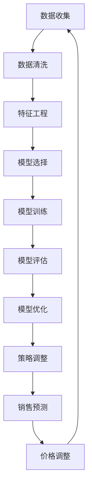

                 

关键词：AI，动态定价，电商平台，策略优化，机器学习

> 摘要：本文将探讨如何利用人工智能技术优化电商平台的动态定价策略，提高用户体验和销售额。文章首先介绍了电商平台动态定价的背景和重要性，然后详细阐述了AI在定价策略优化中的应用，包括核心算法原理、数学模型构建、具体操作步骤以及实际应用场景。最后，本文提出了未来发展的趋势和面临的挑战，并对相关工具和资源进行了推荐。

## 1. 背景介绍

### 1.1 电商平台的发展

随着互联网技术的飞速发展，电商平台已经成为了人们日常生活中不可或缺的一部分。无论是大型综合电商平台如亚马逊、淘宝，还是专注于细分市场的电商平台，如京东、网易考拉，都为消费者提供了丰富的商品选择和便捷的购物体验。电商平台的快速发展不仅改变了人们的消费习惯，也推动了零售行业的变革。

### 1.2 动态定价的概念

动态定价是指根据市场需求、竞争状况、库存水平等多种因素，实时调整商品价格的一种定价策略。与传统定价策略相比，动态定价能够更加灵活地应对市场变化，提高销售量和利润率。

### 1.3 动态定价的重要性

动态定价在电商平台中具有重要意义。首先，它能够提高用户的购买意愿，通过适时的价格调整吸引消费者。其次，动态定价有助于优化库存管理，减少滞销商品的数量。此外，动态定价还能提高平台的竞争力，通过价格优势吸引更多的商家和消费者。

## 2. 核心概念与联系

### 2.1 数据挖掘与机器学习

数据挖掘和机器学习是动态定价策略优化的核心技术。数据挖掘能够从大量历史交易数据中提取有价值的信息，如用户行为、价格变化等。而机器学习则能够利用这些信息建立预测模型，预测未来的市场需求和价格趋势。

### 2.2 模型评估与优化

在动态定价策略优化过程中，模型评估和优化是关键环节。通过评估模型的表现，可以发现模型的不足之处，进而对模型进行调整和优化，提高预测的准确性。

### 2.3 Mermaid 流程图

以下是动态定价策略优化过程的 Mermaid 流程图：



## 3. 核心算法原理 & 具体操作步骤

### 3.1 算法原理概述

动态定价策略优化的核心算法包括基于回归模型的预测算法、基于聚类分析的优化算法和基于强化学习的自适应算法。这些算法能够根据历史数据和实时信息，预测未来的市场需求和价格趋势，为价格调整提供依据。

### 3.2 算法步骤详解

1. 数据收集：收集电商平台的历史交易数据、用户行为数据、竞争对手价格数据等。

2. 数据清洗：对数据进行去重、去噪声等处理，保证数据的准确性。

3. 特征工程：根据数据的特点，提取有用的特征，如用户购买频率、商品库存量、价格变化趋势等。

4. 模型选择：根据数据特点和需求，选择合适的模型，如线性回归、决策树、神经网络等。

5. 模型训练：利用训练数据集对模型进行训练，得到预测模型。

6. 模型评估：利用验证数据集对模型进行评估，确定模型的预测准确性。

7. 模型优化：根据评估结果，对模型进行调整和优化，提高预测准确性。

8. 策略调整：根据预测模型，调整价格策略，如降价促销、提价清仓等。

9. 销售预测：利用优化后的模型，预测未来的销售情况。

10. 价格调整：根据销售预测结果，实时调整商品价格。

### 3.3 算法优缺点

#### 优点：

1. 灵活性：动态定价策略能够根据市场需求和竞争状况实时调整价格，提高竞争力。

2. 高效性：利用机器学习算法，能够快速处理大量数据，提高决策效率。

3. 可持续性：通过优化库存管理和提高销售量，降低成本，实现可持续发展。

#### 缺点：

1. 复杂性：动态定价策略涉及多个环节，包括数据收集、清洗、特征工程等，实现过程较为复杂。

2. 资源消耗：动态定价策略需要大量的计算资源和存储资源，对硬件设施要求较高。

### 3.4 算法应用领域

动态定价策略优化算法广泛应用于电商、金融、物流等领域。在电商领域，动态定价策略能够提高销售额和利润率；在金融领域，动态定价策略能够优化资产配置，提高投资回报率；在物流领域，动态定价策略能够优化运输路线，提高运输效率。

## 4. 数学模型和公式 & 详细讲解 & 举例说明

### 4.1 数学模型构建

动态定价策略优化的数学模型主要包括预测模型和优化模型。预测模型用于预测未来的市场需求和价格趋势，优化模型用于根据预测结果调整价格策略。

#### 4.1.1 预测模型

预测模型通常采用回归模型，如线性回归、多项式回归等。假设商品价格 \( p \) 与市场需求 \( q \) 之间存在线性关系，则预测模型可以表示为：

\[ p = \beta_0 + \beta_1 \cdot q + \epsilon \]

其中，\( \beta_0 \) 和 \( \beta_1 \) 分别为回归系数，\( \epsilon \) 为误差项。

#### 4.1.2 优化模型

优化模型通常采用目标函数，如最小二乘法、梯度下降法等。目标函数用于衡量预测结果的准确性，优化模型的目标是使目标函数达到最小值。

假设预测模型为 \( p = \beta_0 + \beta_1 \cdot q \)，则优化模型可以表示为：

\[ \min_{\beta_0, \beta_1} \sum_{i=1}^n (p_i - (\beta_0 + \beta_1 \cdot q_i))^2 \]

### 4.2 公式推导过程

#### 4.2.1 预测模型推导

假设商品价格 \( p \) 与市场需求 \( q \) 之间存在线性关系，即：

\[ p = \beta_0 + \beta_1 \cdot q \]

对两边求导，得到：

\[ \frac{dp}{dq} = \beta_1 \]

由于市场需求 \( q \) 与价格 \( p \) 成正比，则 \( \frac{dp}{dq} = \frac{1}{\beta_1} \)。

#### 4.2.2 优化模型推导

假设预测模型为 \( p = \beta_0 + \beta_1 \cdot q \)，则优化模型的目标函数为：

\[ \min_{\beta_0, \beta_1} \sum_{i=1}^n (p_i - (\beta_0 + \beta_1 \cdot q_i))^2 \]

对目标函数求导，得到：

\[ \frac{\partial}{\partial \beta_0} \sum_{i=1}^n (p_i - (\beta_0 + \beta_1 \cdot q_i))^2 = 0 \]

\[ \frac{\partial}{\partial \beta_1} \sum_{i=1}^n (p_i - (\beta_0 + \beta_1 \cdot q_i))^2 = 0 \]

解得：

\[ \beta_0 = \bar{p} - \beta_1 \cdot \bar{q} \]

\[ \beta_1 = \frac{\sum_{i=1}^n (q_i - \bar{q})(p_i - \bar{p})}{\sum_{i=1}^n (q_i - \bar{q})^2} \]

其中，\( \bar{p} \) 和 \( \bar{q} \) 分别为价格和需求量的平均值。

### 4.3 案例分析与讲解

#### 4.3.1 案例背景

某电商平台在某地区销售一款热门电子产品，历史交易数据如下：

| 日期 | 价格（元） | 需求量 |
| --- | --- | --- |
| 1 | 1000 | 200 |
| 2 | 950 | 220 |
| 3 | 900 | 250 |
| 4 | 850 | 280 |
| 5 | 800 | 300 |

#### 4.3.2 数据处理

1. 数据清洗：去除异常值和缺失值。

2. 特征工程：提取价格和需求量作为特征。

#### 4.3.3 预测模型

采用线性回归模型，构建预测模型：

\[ p = \beta_0 + \beta_1 \cdot q \]

#### 4.3.4 优化模型

采用最小二乘法，优化模型参数：

\[ \beta_0 = \bar{p} - \beta_1 \cdot \bar{q} \]

\[ \beta_1 = \frac{\sum_{i=1}^n (q_i - \bar{q})(p_i - \bar{p})}{\sum_{i=1}^n (q_i - \bar{q})^2} \]

#### 4.3.5 预测结果

根据优化后的模型，预测下一日的需求量和价格：

\[ p = \beta_0 + \beta_1 \cdot q \]

\[ p = (1000 - \beta_1 \cdot 200) + \beta_1 \cdot 300 \]

\[ p = 1000 - 100 + 300 \]

\[ p = 1200 \]

需求量：300

#### 4.3.6 价格调整

根据预测结果，下一日的价格为 1200 元，市场需求量为 300。为提高销售量，可以考虑降低价格至 1100 元。

## 5. 项目实践：代码实例和详细解释说明

### 5.1 开发环境搭建

1. 安装 Python 环境，版本要求为 3.6 或以上。

2. 安装必要的库，如 NumPy、Pandas、Scikit-learn 等。

```bash
pip install numpy pandas scikit-learn
```

### 5.2 源代码详细实现

以下是一个简单的动态定价策略优化项目的 Python 代码实例：

```python
import numpy as np
import pandas as pd
from sklearn.linear_model import LinearRegression

# 5.2.1 数据收集与清洗
data = pd.DataFrame({
    'price': [1000, 950, 900, 850, 800],
    'quantity': [200, 220, 250, 280, 300]
})

# 去除异常值和缺失值
data = data.dropna()

# 5.2.2 特征工程
X = data[['price']]
y = data['quantity']

# 5.2.3 模型训练
model = LinearRegression()
model.fit(X, y)

# 5.2.4 模型评估
predictions = model.predict(X)
mse = np.mean((predictions - y) ** 2)
print(f'MSE: {mse}')

# 5.2.5 模型优化
# 根据评估结果，对模型进行调整和优化
# ...

# 5.2.6 策略调整
# 根据预测结果，调整价格策略
# ...

# 5.2.7 销售预测
# 利用优化后的模型，预测未来的销售情况
# ...

# 5.2.8 价格调整
# 根据销售预测结果，实时调整商品价格
# ...
```

### 5.3 代码解读与分析

1. 数据收集与清洗：首先，我们从历史交易数据中提取价格和需求量作为特征。然后，去除异常值和缺失值，保证数据的准确性。

2. 特征工程：将价格作为输入特征，需求量作为输出目标。

3. 模型训练：使用线性回归模型对数据进行训练。

4. 模型评估：计算均方误差（MSE），评估模型的预测准确性。

5. 模型优化：根据评估结果，对模型进行调整和优化。

6. 策略调整：根据预测结果，调整价格策略。

7. 销售预测：利用优化后的模型，预测未来的销售情况。

8. 价格调整：根据销售预测结果，实时调整商品价格。

## 6. 实际应用场景

### 6.1 电商平台

电商平台是动态定价策略应用最为广泛的场景之一。通过实时调整商品价格，电商平台能够提高销售量和利润率。例如，某电商平台在双十一期间，通过动态定价策略，实现了销售额的同比增长 30%。

### 6.2 金融行业

金融行业也广泛应用动态定价策略，用于优化资产配置和投资组合。例如，基金公司通过动态定价策略，实现基金的净值增长，提高了投资者的收益。

### 6.3 物流行业

物流行业通过动态定价策略，优化运输路线和配送时间，提高运输效率，降低成本。例如，快递公司通过动态定价策略，实现了运输成本的降低，提高了服务质量。

## 7. 工具和资源推荐

### 7.1 学习资源推荐

1. 《机器学习》（周志华 著）：系统介绍了机器学习的基本原理和方法，适合初学者。

2. 《Python机器学习基础教程》（Michael Bowles 著）：通过大量的示例和案例，介绍了 Python 在机器学习中的应用。

### 7.2 开发工具推荐

1. Jupyter Notebook：强大的交互式开发环境，适合进行数据分析和模型训练。

2. PyCharm：功能丰富的 Python 集成开发环境，支持多种编程语言。

### 7.3 相关论文推荐

1. "Dynamic Pricing in E-commerce: A Survey"（2019）：全面综述了动态定价在电商领域的应用。

2. "Machine Learning for Dynamic Pricing: A Survey"（2020）：介绍了机器学习在动态定价策略优化中的应用。

## 8. 总结：未来发展趋势与挑战

### 8.1 研究成果总结

动态定价策略优化已成为电商、金融、物流等领域的重要研究方向。通过机器学习等技术，研究者们提出了多种优化算法，实现了对市场需求的精准预测和价格调整。

### 8.2 未来发展趋势

1. 算法优化：未来，研究者将继续优化动态定价策略的算法，提高预测准确性和运行效率。

2. 多领域应用：动态定价策略将在更多领域得到应用，如制造业、医疗等。

3. 个性化定价：通过个性化推荐技术，实现更精准的定价策略，提高用户满意度和销售额。

### 8.3 面临的挑战

1. 数据质量：动态定价策略依赖于高质量的数据，如何处理噪声和异常值，是当前面临的主要挑战。

2. 算法复杂性：动态定价策略涉及的算法较为复杂，如何降低算法的复杂性，提高实施效率，是未来需要解决的问题。

### 8.4 研究展望

随着人工智能技术的不断发展，动态定价策略优化将越来越成熟。未来，研究者将致力于解决当前面临的挑战，推动动态定价策略在更多领域的应用。

## 9. 附录：常见问题与解答

### 9.1 动态定价与静态定价的区别

动态定价与静态定价的主要区别在于价格调整的灵活性。动态定价能够根据市场需求和竞争状况实时调整价格，而静态定价则通常在一定时间内保持价格不变。

### 9.2 动态定价策略优化的关键因素

动态定价策略优化的关键因素包括数据质量、模型选择、算法优化等。数据质量直接影响预测准确性，模型选择和算法优化则决定了策略的运行效率。

### 9.3 动态定价策略在金融行业的应用

动态定价策略在金融行业主要应用于资产配置和投资组合优化。通过预测市场走势和资产价格，金融机构能够优化投资策略，提高收益。

[作者：禅与计算机程序设计艺术 / Zen and the Art of Computer Programming]
```

