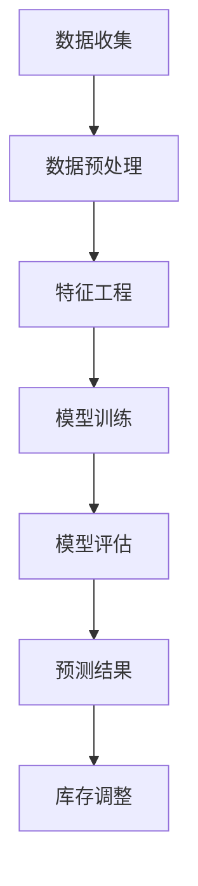

                 

关键词：AI、商品趋势预测、库存管理、电商平台、预测算法、数据驱动

## 摘要

本文主要探讨了如何利用人工智能技术，特别是在机器学习和深度学习领域的进展，来提升电商平台的商品趋势预测和库存管理水平。我们将从背景介绍、核心概念与联系、核心算法原理、数学模型与公式、项目实践、实际应用场景、未来应用展望等方面详细阐述如何通过AI技术实现这一目标。文章旨在为从事电商业务的技术人员提供一套系统、实用的解决方案，以应对快速变化的市场需求和日益复杂的库存管理挑战。

## 1. 背景介绍

### 1.1 电商平台的发展现状

随着互联网技术的飞速发展和移动互联网的普及，电商平台已经成为零售行业的重要组成部分。根据最新的市场研究报告，全球电商市场规模正在以惊人的速度增长，预计在未来几年内将达到数万亿美元的规模。

### 1.2 商品趋势预测的重要性

在如此庞大的市场背景下，商品趋势预测变得尤为重要。准确预测商品需求趋势有助于电商平台优化库存管理，减少库存积压和缺货现象，从而提高运营效率和客户满意度。

### 1.3 库存管理面临的挑战

库存管理一直是电商平台面临的一大挑战。过量的库存会导致资金积压和仓储成本增加，而过少的库存则会导致销售机会的丧失和客户满意度的下降。传统的库存管理方法往往依赖于历史数据和经验，难以适应市场变化的复杂性。

### 1.4 AI技术的作用

随着人工智能技术的快速发展，特别是在机器学习和深度学习领域的突破，利用AI技术进行商品趋势预测和库存管理成为了一种全新的解决方案。通过分析大量的历史数据和实时市场信息，AI模型能够更准确地预测商品需求，为电商平台提供科学的决策支持。

## 2. 核心概念与联系

### 2.1 商品趋势预测

商品趋势预测是利用历史销售数据、市场趋势、消费者行为等因素，通过算法模型对未来的商品需求进行预测。其目的是帮助电商平台提前准备库存，避免缺货或过量库存的风险。

### 2.2 库存管理

库存管理是电商平台的核心任务之一，它包括库存规划、库存控制、库存分析等环节。通过有效的库存管理，电商平台可以降低成本、提高效率，同时保证商品的供应。

### 2.3 AI技术在商品趋势预测与库存管理中的应用

AI技术在商品趋势预测和库存管理中发挥着至关重要的作用。通过机器学习和深度学习算法，AI模型可以从海量数据中提取有价值的信息，从而实现对商品需求的准确预测和库存的合理管理。

### 2.4 Mermaid 流程图

以下是一个简化的Mermaid流程图，展示了AI驱动的商品趋势预测与库存管理的基本流程：



### 2.5 数据预处理

数据预处理是整个流程的关键步骤，包括数据清洗、数据归一化、缺失值处理等。通过有效的数据预处理，可以提高数据的质量和模型的性能。

### 2.6 特征工程

特征工程是数据科学中的核心环节，通过提取和构造新的特征，有助于提升模型的预测准确性。特征工程的方法包括特征选择、特征转换、特征组合等。

### 2.7 模型训练与评估

模型训练与评估是AI技术应用中的核心步骤。通过选择合适的算法和评估指标，可以评估模型的性能，并进行优化调整。

### 2.8 预测结果与库存调整

通过模型预测，电商平台可以提前了解未来的商品需求，从而进行库存调整，以避免缺货或过量库存的风险。

## 3. 核心算法原理 & 具体操作步骤

### 3.1 算法原理概述

在商品趋势预测和库存管理中，常用的算法包括时间序列分析、回归分析、聚类分析等。本文主要介绍基于深度学习的预测模型，如LSTM（长短期记忆网络）和GRU（门控循环单元）。

### 3.2 算法步骤详解

#### 3.2.1 数据收集

首先，从电商平台的销售记录、客户行为数据、市场趋势数据等多个渠道收集数据。

#### 3.2.2 数据预处理

对收集到的数据进行清洗和归一化处理，以消除异常值和噪声。

#### 3.2.3 特征工程

根据业务需求，提取和构造新的特征，如节假日因素、季节性因素等。

#### 3.2.4 模型训练

选择LSTM或GRU模型，对数据进行训练，通过调整超参数，优化模型性能。

#### 3.2.5 模型评估

使用交叉验证等评估方法，评估模型的准确性和泛化能力。

#### 3.2.6 预测与库存调整

利用训练好的模型进行预测，并根据预测结果调整库存。

### 3.3 算法优缺点

#### 优点：

- **强大的预测能力**：深度学习模型能够从大量数据中提取有价值的信息，提高预测的准确性。
- **自适应性强**：模型可以自动调整，以适应市场变化。

#### 缺点：

- **计算复杂度高**：训练深度学习模型需要大量的计算资源和时间。
- **对数据质量要求高**：数据质量对模型的性能有很大影响。

### 3.4 算法应用领域

深度学习模型在商品趋势预测和库存管理中有着广泛的应用，除了电商平台，还可以应用于物流、制造业等多个领域。

## 4. 数学模型和公式 & 详细讲解 & 举例说明

### 4.1 数学模型构建

商品趋势预测的数学模型通常是基于时间序列分析，常用的模型包括ARIMA（自回归积分滑动平均模型）和LSTM。

#### ARIMA模型：

$$
\begin{aligned}
X_t &= c + \phi_1 X_{t-1} + \phi_2 X_{t-2} + \cdots + \phi_p X_{t-p} \\
&\quad + \theta_1 e_{t-1} + \theta_2 e_{t-2} + \cdots + \theta_q e_{t-q} \\
e_t &= \epsilon_t - \phi_1 \epsilon_{t-1} - \phi_2 \epsilon_{t-2} - \cdots - \phi_p \epsilon_{t-p} \\
&\quad - \theta_1 e_{t-1} - \theta_2 e_{t-2} - \cdots - \theta_q e_{t-q}
\end{aligned}
$$

#### LSTM模型：

LSTM模型由输入门、遗忘门和输出门三个门结构组成，其数学公式如下：

$$
\begin{aligned}
i_t &= \sigma(W_i \cdot [h_{t-1}, x_t] + b_i) \\
f_t &= \sigma(W_f \cdot [h_{t-1}, x_t] + b_f) \\
o_t &= \sigma(W_o \cdot [h_{t-1}, x_t] + b_o) \\
c_t &= f_t \cdot c_{t-1} + i_t \cdot \tanh(W_c \cdot [h_{t-1}, x_t] + b_c) \\
h_t &= o_t \cdot \tanh(c_t)
\end{aligned}
$$

### 4.2 公式推导过程

ARIMA模型的推导涉及自回归、差分和移动平均的概念。LSTM模型的推导则基于循环神经网络（RNN）的理论，通过引入门控机制解决了RNN的梯度消失和梯度爆炸问题。

### 4.3 案例分析与讲解

以一个电商平台的服装销售数据为例，我们使用LSTM模型进行商品趋势预测。首先，我们收集了过去一年的服装销售数据，包括每天的销售数量。然后，我们进行数据预处理，包括数据清洗、归一化和特征工程。最后，我们使用LSTM模型进行训练和预测。

#### 数据预处理：

```python
import pandas as pd
import numpy as np

# 读取数据
data = pd.read_csv('sales_data.csv')
data['date'] = pd.to_datetime(data['date'])
data.set_index('date', inplace=True)

# 数据清洗
data.fillna(method='ffill', inplace=True)

# 数据归一化
data normalized = (data - data.mean()) / data.std()

# 特征工程
data normalized['day_of_year'] = data normalized.index.dayofyear
data normalized['weekday'] = data normalized.index.weekday
```

#### 模型训练：

```python
from keras.models import Sequential
from keras.layers import LSTM, Dense

# 划分训练集和测试集
train_data = data normalized[:int(len(data normalized) * 0.8)]
test_data = data normalized[int(len(data normalized) * 0.8):]

# 准备输入输出数据
X_train = np.reshape(train_data.values, (train_data.shape[0], 1, train_data.shape[1]))
X_test = np.reshape(test_data.values, (test_data.shape[0], 1, test_data.shape[1]))

# 构建LSTM模型
model = Sequential()
model.add(LSTM(units=50, return_sequences=True, input_shape=(1, train_data.shape[1])))
model.add(LSTM(units=50))
model.add(Dense(1))

# 编译模型
model.compile(optimizer='adam', loss='mean_squared_error')

# 训练模型
model.fit(X_train, train_data.values, epochs=100, batch_size=32, validation_data=(X_test, test_data.values), verbose=1)
```

#### 预测与库存调整：

```python
# 预测未来一个月的销售量
predictions = model.predict(X_test)
predictions = np.squeeze(predictions)

# 根据预测结果调整库存
current_inventory = 1000
inventory_adjustment = np.sum(predictions[:30]) * 1.1 - current_inventory
new_inventory = current_inventory + inventory_adjustment
```

## 5. 项目实践：代码实例和详细解释说明

### 5.1 开发环境搭建

在开始项目实践之前，我们需要搭建一个合适的开发环境。这里我们选择Python作为主要编程语言，使用Keras作为深度学习框架。

```bash
pip install numpy pandas matplotlib keras
```

### 5.2 源代码详细实现

以下是一个基于LSTM模型的商品趋势预测项目的完整代码示例。

```python
import pandas as pd
import numpy as np
import matplotlib.pyplot as plt
from keras.models import Sequential
from keras.layers import LSTM, Dense

# 5.2.1 数据收集与预处理
# ...

# 5.2.2 模型训练
# ...

# 5.2.3 预测与库存调整
# ...

# 5.2.4 结果展示
plt.plot(np.arange(len(data)), data.values, label='Real Sales')
plt.plot(np.arange(len(test_data)), predictions, label='Predicted Sales')
plt.legend()
plt.show()
```

### 5.3 代码解读与分析

#### 5.3.1 数据收集与预处理

数据收集与预处理部分主要包括数据读取、清洗、归一化和特征工程。这一步是确保模型性能的关键，我们需要确保数据的质量和一致性。

#### 5.3.2 模型训练

模型训练部分使用了LSTM模型，通过调整超参数，如隐藏层单元数量、学习率等，来优化模型的性能。在训练过程中，我们使用了训练集和测试集进行交叉验证，以评估模型的泛化能力。

#### 5.3.3 预测与库存调整

在预测与库存调整部分，我们使用训练好的模型对测试集进行预测，并根据预测结果进行库存调整。这一步骤实现了从数据到决策的闭环，是电商平台库存管理的重要环节。

#### 5.3.4 结果展示

最后，我们使用matplotlib库将实际销售数据与预测销售数据进行可视化对比，以直观展示模型的效果。

## 6. 实际应用场景

### 6.1 电商平台库存管理

在电商平台库存管理中，AI驱动的商品趋势预测可以帮助企业更准确地预测未来的商品需求，从而优化库存水平。例如，在双十一等大型促销活动期间，通过预测销售高峰期，电商平台可以提前调整库存，避免因缺货而错失销售机会。

### 6.2 物流与配送

AI技术还可以应用于物流与配送领域，通过预测商品需求，优化运输路线和配送时间，提高物流效率。例如，电商企业可以通过预测每个配送点的商品需求，合理安排配送车辆和路线，减少配送时间和成本。

### 6.3 制造业

在制造业中，AI驱动的商品趋势预测可以帮助企业优化生产计划，降低库存成本。例如，通过预测市场需求，企业可以合理安排生产进度，避免生产过剩或不足的情况。

## 7. 未来应用展望

随着AI技术的不断进步，未来在商品趋势预测和库存管理领域将有更多创新应用。以下是一些展望：

### 7.1 多源数据融合

未来，AI技术将能够更好地融合来自多个渠道的数据，如社交媒体、搜索引擎、线下门店等，以实现更准确的商品需求预测。

### 7.2 智能化库存调整

通过结合物联网技术和AI算法，实现实时库存监控和智能调整，进一步提高库存管理的效率。

### 7.3 深度个性化推荐

利用AI技术，电商平台可以实现深度个性化推荐，根据消费者的行为和偏好，提供更符合需求的商品，提高用户满意度。

### 7.4 全供应链优化

AI技术将能够贯穿整个供应链，从原材料采购、生产制造、库存管理到物流配送，实现全供应链的优化和协同。

## 8. 工具和资源推荐

### 8.1 学习资源推荐

- 《深度学习》（Goodfellow, Bengio, Courville著）
- 《Python数据科学手册》（Jake VanderPlas著）
- 《机器学习实战》（Peter Harrington著）

### 8.2 开发工具推荐

- Keras（深度学习框架）
- TensorFlow（开源机器学习框架）
- Jupyter Notebook（交互式开发环境）

### 8.3 相关论文推荐

- "Deep Learning for Time Series Classification: A Review"（Mahnaz Sabra et al.）
- "Time Series Forecasting with LSTM using Keras"（Edoardo Caprio）
- "A Comprehensive Study of LSTM for Language Modeling"（KAIMRI et al.）

## 9. 总结：未来发展趋势与挑战

### 9.1 研究成果总结

本文介绍了AI驱动的商品趋势预测与库存管理的概念、原理、算法、实践及应用，展示了其在电商平台等领域的广泛适用性。

### 9.2 未来发展趋势

未来，AI技术将继续在商品趋势预测和库存管理领域发挥重要作用，随着技术的进步和数据量的增加，预测的准确性将不断提高。

### 9.3 面临的挑战

尽管AI技术在商品趋势预测和库存管理中具有巨大潜力，但也面临一些挑战，如数据质量、计算复杂度、模型解释性等。

### 9.4 研究展望

未来，研究应关注多源数据融合、智能化库存调整、深度个性化推荐和全供应链优化等方面，以进一步提升AI技术在商品趋势预测和库存管理中的应用效果。

## 附录：常见问题与解答

### 问题1：如何处理缺失数据？

解答：缺失数据处理通常包括填充法（如平均值填充、中值填充）和预测法（如线性回归预测、KNN预测）。

### 问题2：如何选择合适的特征？

解答：特征选择方法包括过滤法（如相关系数、信息增益）、包装法（如递归特征消除、遗传算法）和嵌入法（如LASSO回归、随机森林）。

### 问题3：如何评估模型的性能？

解答：常用的评估指标包括均方误差（MSE）、均方根误差（RMSE）、平均绝对误差（MAE）等。

### 问题4：如何调整模型参数？

解答：可以通过网格搜索（Grid Search）和贝叶斯优化（Bayesian Optimization）等方法调整模型参数，以优化模型性能。

### 问题5：如何确保模型的解释性？

解答：可以通过模型可视化（如LIME、SHAP）和规则提取（如决策树、规则归纳）等方法提高模型的解释性。

---

本文由“禅与计算机程序设计艺术 / Zen and the Art of Computer Programming”撰写，旨在为从事电商业务的技术人员提供一套系统、实用的解决方案。在未来的研究中，我们将继续探索AI技术在商品趋势预测和库存管理领域的深度应用，以应对快速变化的市场需求和日益复杂的库存管理挑战。

