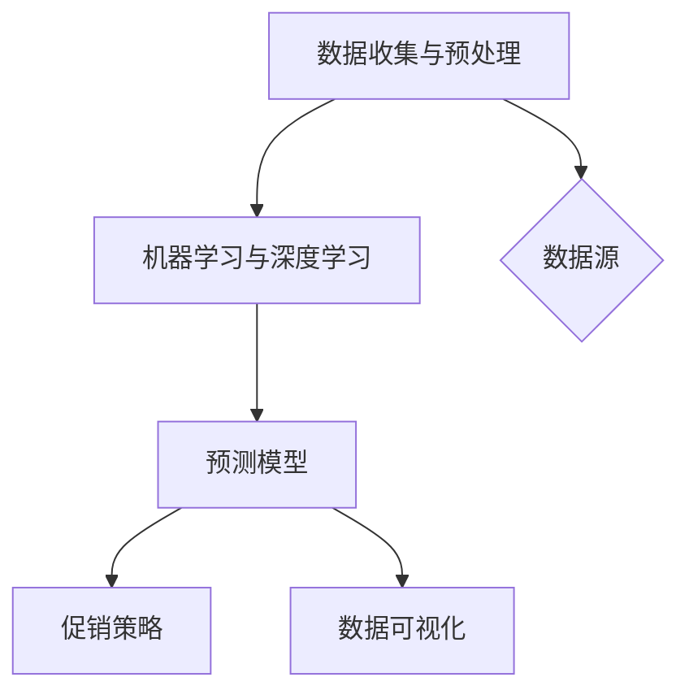

                 

关键词：AI、电商平台、商品销量预测、促销决策、数据分析、机器学习、深度学习、大数据处理

> 摘要：本文将探讨如何利用人工智能技术，特别是机器学习和深度学习，来驱动电商平台商品销量预测与促销决策的支持。通过对大数据的处理和分析，构建有效的预测模型，进而为电商平台提供智能化、数据驱动的决策支持，提升运营效率和用户体验。

## 1. 背景介绍

随着互联网技术的飞速发展，电商平台已经成为了消费者购物的主要渠道之一。电商平台的目标是提供多样化的商品选择，同时确保用户能够以合理的价格购买到满意的商品。为了实现这一目标，电商平台需要不断地优化运营策略，包括商品上架、库存管理、价格设定和促销活动等。然而，这些策略的制定往往需要大量数据支持和深入的洞察力。

传统的电商平台运营策略主要依赖于人工经验和市场研究，这些方法虽然有一定的效果，但在面对日益复杂的市场环境时，其灵活性和准确性都有所不足。随着大数据和人工智能技术的兴起，电商平台开始探索新的运营模式，通过数据驱动的决策支持来提升运营效率和用户体验。

商品销量预测和促销决策是电商平台运营中的两个关键环节。商品销量预测可以帮助电商平台了解哪些商品受欢迎，哪些商品库存不足，从而调整库存策略。促销决策则关系到如何设计有效的促销活动，吸引更多用户购买商品，提升销售额。

本文将详细介绍如何利用人工智能技术，特别是机器学习和深度学习，来实现商品销量预测和促销决策的支持。文章将分为以下几个部分：

1. 核心概念与联系
2. 核心算法原理与具体操作步骤
3. 数学模型和公式
4. 项目实践：代码实例和详细解释说明
5. 实际应用场景
6. 工具和资源推荐
7. 总结：未来发展趋势与挑战
8. 附录：常见问题与解答

通过本文的阅读，读者将能够了解如何利用人工智能技术提升电商平台运营效率，实现智能化决策支持。

## 2. 核心概念与联系

在探讨AI驱动的电商平台商品销量预测与促销决策之前，我们需要了解一些核心概念，这些概念是构建预测模型和决策支持系统的基石。

### 2.1 数据收集与预处理

数据收集是任何数据分析项目的基础。对于电商平台来说，数据来源可能包括用户行为数据、销售数据、库存数据、市场调研数据等。这些数据通常来源于不同的系统，如电商平台自身的交易系统、用户行为追踪系统、社交媒体数据等。

数据预处理是数据分析和机器学习过程中的重要步骤。预处理包括数据清洗（去除噪声、处理缺失值）、数据转换（如归一化、标准化）、数据集成（合并不同数据源）和数据降维（减少数据维度，提高模型效率）等。

### 2.2 机器学习与深度学习

机器学习是一种使计算机能够从数据中学习规律、做出预测或决策的技术。机器学习可以分为监督学习、无监督学习和强化学习。监督学习是最常用的类型，它通过已有的标签数据来训练模型，从而在新数据上进行预测。

深度学习是机器学习的一种特殊形式，它利用多层神经网络来模拟人脑的学习过程。深度学习在图像识别、语音识别和自然语言处理等领域取得了显著成果。

### 2.3 预测模型

预测模型是利用历史数据来预测未来事件的方法。对于电商平台来说，常见的预测模型包括时间序列预测、回归分析和分类模型等。

- **时间序列预测**：基于时间序列数据的规律进行预测，如商品销量、股票价格等。
- **回归分析**：通过建立回归模型来预测连续值变量，如商品销量。
- **分类模型**：通过建立分类模型来预测离散值变量，如用户购买行为。

### 2.4 促销策略

促销策略是电商平台常用的营销手段，包括折扣、满减、赠品、限时购等。有效的促销策略能够刺激用户购买欲望，提高销售额。然而，如何设计有效的促销策略需要基于数据分析和预测模型的结果。

### 2.5 数据可视化

数据可视化是将数据以图形或图表的形式展示出来，使其更易于理解和分析。在电商平台中，数据可视化可以用来展示销售趋势、用户行为、库存情况等，帮助决策者更好地理解数据，制定策略。

### 2.6 Mermaid 流程图

为了更清晰地展示核心概念和联系，我们使用Mermaid绘制一个流程图：



在上图中，数据收集与预处理是整个流程的起点，数据经过预处理后输入到机器学习与深度学习模块，生成预测模型。预测模型的结果用于制定促销策略，并通过数据可视化进行展示，形成一个闭环的数据驱动决策过程。

## 3. 核心算法原理 & 具体操作步骤

### 3.1 算法原理概述

在商品销量预测与促销决策支持中，我们主要采用机器学习和深度学习算法。以下是常用的几种算法及其原理：

#### 3.1.1 时间序列预测

时间序列预测是一种常用的预测方法，适用于预测随时间变化的连续值数据，如商品销量。常见的时间序列预测算法包括ARIMA（自回归积分滑动平均模型）、LSTM（长短期记忆网络）等。

- **ARIMA模型**：ARIMA模型通过分析时间序列的平稳性、自相关性和移动平均特性来建立预测模型。
- **LSTM模型**：LSTM是深度学习的一种特殊形式，适用于处理序列数据，能够有效地捕捉长期依赖关系。

#### 3.1.2 回归分析

回归分析是一种监督学习算法，通过建立回归模型来预测连续值变量。常见的回归算法包括线性回归、岭回归、决策树回归等。

- **线性回归**：线性回归是一种简单且常用的回归算法，通过建立线性关系来预测目标变量。
- **岭回归**：岭回归是线性回归的一种改进，通过引入L2正则化来防止过拟合。
- **决策树回归**：决策树回归通过构建树形结构来预测目标变量，能够处理非线性关系。

#### 3.1.3 分类模型

分类模型是一种监督学习算法，通过建立分类模型来预测离散值变量。常见的分类算法包括逻辑回归、决策树、随机森林、支持向量机等。

- **逻辑回归**：逻辑回归是一种二分类模型，通过建立逻辑函数来预测目标变量的概率。
- **决策树**：决策树通过构建树形结构来预测目标变量，每个节点表示一个特征，每个分支表示特征的不同取值。
- **随机森林**：随机森林是一种集成学习算法，通过构建多个决策树来提高预测准确性。
- **支持向量机**：支持向量机通过找到最优超平面来分类数据，适用于高维空间数据。

### 3.2 算法步骤详解

以下是商品销量预测和促销决策支持的基本步骤：

#### 3.2.1 数据收集

收集电商平台相关的数据，包括用户行为数据、销售数据、库存数据等。数据可以从电商平台的后台系统、用户行为追踪工具、市场调研报告等渠道获取。

#### 3.2.2 数据预处理

对收集到的数据进行预处理，包括数据清洗、数据转换、数据集成和数据降维等。数据清洗步骤包括去除噪声、处理缺失值、异常值检测和修正等。

#### 3.2.3 特征工程

特征工程是数据预处理的重要步骤，通过提取和构造特征来提高模型的预测准确性。特征工程包括特征选择、特征转换、特征构造等。

#### 3.2.4 模型选择与训练

选择合适的模型进行训练，根据数据特点可以选择线性回归、LSTM、决策树、随机森林等模型。模型选择步骤包括模型评估、模型优化等。

#### 3.2.5 模型评估与优化

对训练好的模型进行评估，使用交叉验证、AUC、RMSE等指标来评估模型性能。根据评估结果对模型进行调整和优化。

#### 3.2.6 预测与决策支持

使用训练好的模型进行预测，根据预测结果制定促销策略。例如，可以根据预测销量调整库存、设定促销价格、设计促销活动等。

### 3.3 算法优缺点

以下是常用算法的优缺点：

#### 3.3.1 时间序列预测

- **优点**：适用于时间序列数据，能够捕捉时间变化的规律。
- **缺点**：对于非线性关系和长期依赖关系的捕捉能力有限。

#### 3.3.2 回归分析

- **优点**：简单易用，适用于线性关系预测。
- **缺点**：对于非线性关系和复杂模型的预测能力有限。

#### 3.3.3 分类模型

- **优点**：适用于分类问题，能够处理非线性关系。
- **缺点**：对于连续值变量的预测能力有限。

### 3.4 算法应用领域

时间序列预测、回归分析和分类模型在电商平台中的应用非常广泛：

- **应用领域**：商品销量预测、库存管理、用户行为分析、促销决策等。
- **优势**：能够提供数据驱动的决策支持，提高运营效率和用户体验。

## 4. 数学模型和公式 & 详细讲解 & 举例说明

在构建商品销量预测和促销决策支持系统时，数学模型和公式是核心组成部分。以下将详细介绍这些模型和公式的构建过程、推导过程以及实际应用中的案例讲解。

### 4.1 数学模型构建

商品销量预测的数学模型通常基于时间序列分析和回归分析。以下是两种常见模型的基本构建过程：

#### 4.1.1 时间序列模型

时间序列模型（如ARIMA）的构建过程通常包括以下步骤：

1. **平稳性检验**：
   - **定义**：时间序列的平稳性是指其统计特性（如均值、方差等）不随时间变化。
   - **检验方法**：常用的平稳性检验方法包括单位根检验（ADF检验、KPSS检验）。

2. **自相关函数（ACF）和偏自相关函数（PACF）分析**：
   - **定义**：ACF和PACF用于分析时间序列的自相关性和偏自相关性。
   - **分析步骤**：通过绘制ACF和PACF图，确定模型的AR（自回归）和MA（移动平均）部分。

3. **模型参数估计**：
   - **定义**：ARIMA模型的参数包括p（自回归阶数）、d（差分阶数）、q（移动平均阶数）。
   - **估计方法**：常用的参数估计方法包括最大似然估计（MLE）和最小二乘法（LS）。

4. **模型检验与优化**：
   - **定义**：通过残差分析、AIC（赤池信息准则）和BIC（贝叶斯信息准则）等指标来评估模型拟合效果。
   - **优化步骤**：根据模型检验结果，调整模型参数，优化模型性能。

#### 4.1.2 回归模型

回归模型（如线性回归、岭回归）的构建过程通常包括以下步骤：

1. **特征选择**：
   - **定义**：选择对目标变量有显著影响的相关特征。
   - **方法**：常用的特征选择方法包括相关性分析、卡方检验、方差贡献率等。

2. **模型设定**：
   - **定义**：设定回归方程，如线性回归：\( Y = \beta_0 + \beta_1X_1 + \beta_2X_2 + ... + \beta_nX_n \)。
   - **参数设定**：确定模型中的系数（\(\beta_0, \beta_1, ..., \beta_n\)）。

3. **参数估计**：
   - **定义**：通过最小二乘法（OLS）或梯度下降法估计模型参数。
   - **方法**：最小二乘法通过最小化预测误差平方和来估计参数。

4. **模型评估与优化**：
   - **定义**：使用R平方、RMSE、MAE等指标评估模型性能。
   - **优化步骤**：根据评估结果，调整模型参数或特征，优化模型性能。

### 4.2 公式推导过程

以下是时间序列模型（ARIMA）和回归模型（线性回归）的基本公式推导过程。

#### 4.2.1 ARIMA模型

假设时间序列\( X_t \)服从ARIMA（p, d, q）模型，其公式如下：

\[ X_t = c + \phi_1X_{t-1} + \phi_2X_{t-2} + ... + \phi_pX_{t-p} + \theta_1\epsilon_{t-1} + \theta_2\epsilon_{t-2} + ... + \theta_q\epsilon_{t-q} + \epsilon_t \]

其中：
- \( c \) 为常数项。
- \( \phi_i \) 和 \( \theta_i \) 为模型参数。
- \( \epsilon_t \) 为白噪声。

推导过程：

1. **差分操作**：为了使时间序列变得平稳，通常需要进行d次差分操作。

\[ \Delta X_t = X_t - X_{t-1} \]

2. **自回归部分**：通过自回归模型捕捉时间序列的滞后关系。

\[ X_t = \phi_1X_{t-1} + \phi_2X_{t-2} + ... + \phi_pX_{t-p} \]

3. **移动平均部分**：通过移动平均模型捕捉误差项的滞后影响。

\[ \epsilon_t = \theta_1\epsilon_{t-1} + \theta_2\epsilon_{t-2} + ... + \theta_q\epsilon_{t-q} \]

4. **合并**：将自回归部分和移动平均部分合并，得到ARIMA模型。

#### 4.2.2 线性回归模型

线性回归模型的公式如下：

\[ Y = \beta_0 + \beta_1X_1 + \beta_2X_2 + ... + \beta_nX_n \]

其中：
- \( Y \) 为目标变量。
- \( X_1, X_2, ..., X_n \) 为自变量。
- \( \beta_0, \beta_1, ..., \beta_n \) 为模型参数。

推导过程：

1. **假设**：目标变量和自变量之间存在线性关系。

\[ Y = \beta_0 + \beta_1X_1 + \beta_2X_2 + ... + \beta_nX_n + \epsilon \]

2. **最小化误差**：通过最小二乘法估计模型参数，使预测误差最小。

\[ \min_{\beta_0, \beta_1, ..., \beta_n} \sum_{i=1}^n (Y_i - \beta_0 - \beta_1X_{i1} - \beta_2X_{i2} - ... - \beta_nX_{in})^2 \]

3. **求解**：通过求解最小二乘问题，得到模型参数的估计值。

### 4.3 案例分析与讲解

#### 4.3.1 时间序列预测案例

假设我们需要预测某电商平台的商品销量，以下是具体步骤：

1. **数据收集**：收集过去一年的商品销量数据。
2. **数据预处理**：对数据进行清洗，去除异常值和缺失值。
3. **平稳性检验**：使用ADF检验确定时间序列的平稳性。
4. **模型选择**：通过ACF和PACF图选择合适的ARIMA模型。
5. **参数估计**：使用MLE方法估计模型参数。
6. **模型评估**：使用残差分析、AIC和BIC指标评估模型性能。
7. **预测**：使用训练好的模型进行销量预测。

#### 4.3.2 回归分析案例

假设我们需要预测某电商平台的商品价格，以下是具体步骤：

1. **数据收集**：收集过去一年的商品价格数据，以及可能影响价格的相关特征（如商品类别、促销活动等）。
2. **数据预处理**：对数据进行清洗，去除异常值和缺失值。
3. **特征工程**：对特征进行选择和构造，提高模型的预测准确性。
4. **模型设定**：设定线性回归模型，确定自变量和目标变量之间的关系。
5. **参数估计**：使用最小二乘法估计模型参数。
6. **模型评估**：使用R平方、RMSE等指标评估模型性能。
7. **预测**：使用训练好的模型进行价格预测。

通过以上案例，我们可以看到数学模型和公式在商品销量预测和促销决策支持中的关键作用。正确的数学模型和合理的公式推导，能够帮助我们更准确地预测未来趋势，制定有效的促销策略，提高电商平台运营效率。

## 5. 项目实践：代码实例和详细解释说明

在本节中，我们将通过一个具体的电商平台商品销量预测项目，展示如何使用Python实现商品销量预测的代码实例，并对其进行详细的解释说明。

### 5.1 开发环境搭建

为了进行商品销量预测，我们需要搭建一个合适的开发环境。以下是推荐的软件和库：

- **Python（3.8及以上版本）**
- **Jupyter Notebook**：用于编写和运行代码
- **Pandas**：用于数据预处理
- **NumPy**：用于数值计算
- **SciPy**：用于科学计算
- **Matplotlib**：用于数据可视化
- **Scikit-learn**：用于机器学习
- **Statsmodels**：用于统计模型

首先，安装上述所需的库，可以使用pip命令进行安装：

```bash
pip install numpy pandas scipy matplotlib scikit-learn statsmodels
```

### 5.2 源代码详细实现

以下是商品销量预测项目的源代码实现，代码分为几个主要部分：数据收集与预处理、模型选择与训练、模型评估与预测。

```python
import pandas as pd
import numpy as np
from sklearn.model_selection import train_test_split
from sklearn.linear_model import LinearRegression
from sklearn.metrics import mean_squared_error
import statsmodels.api as sm
import matplotlib.pyplot as plt

# 5.2.1 数据收集与预处理

# 假设数据文件为"sales_data.csv"，包含日期、销量、价格等特征
data = pd.read_csv('sales_data.csv')

# 数据清洗：去除缺失值和异常值
data = data.dropna()

# 特征工程：将日期转换为时间序列特征
data['date'] = pd.to_datetime(data['date'])
data['day'] = data['date'].dt.day
data['week'] = data['date'].dt.week
data['month'] = data['date'].dt.month
data['year'] = data['date'].dt.year

# 5.2.2 模型选择与训练

# 使用线性回归模型
X = data[['day', 'week', 'month', 'year', 'price']]
y = data['sales']

# 数据分割为训练集和测试集
X_train, X_test, y_train, y_test = train_test_split(X, y, test_size=0.2, random_state=42)

# 训练线性回归模型
model = LinearRegression()
model.fit(X_train, y_train)

# 5.2.3 模型评估与预测

# 预测测试集销量
y_pred = model.predict(X_test)

# 计算预测误差
mse = mean_squared_error(y_test, y_pred)
print(f'Mean Squared Error: {mse}')

# 使用ARIMA模型进行时间序列预测
# 模型参数设定
p = 5
d = 1
q = 1

# 训练ARIMA模型
arima_model = sm.ARIMA(y, order=(p, d, q))
arima_result = arima_model.fit()

# 预测未来销量
forecast = arima_result.forecast(steps=5)
print(f'Forecasted Sales: {forecast}')

# 5.2.4 数据可视化

# 绘制实际销量与预测销量对比图
plt.figure(figsize=(10, 6))
plt.plot(data['date'], data['sales'], label='Actual Sales')
plt.plot(pd.date_range(data['date'].max(), periods=5, freq='M'), forecast, label='Forecasted Sales')
plt.legend()
plt.title('Sales Forecast')
plt.xlabel('Date')
plt.ylabel('Sales')
plt.show()
```

### 5.3 代码解读与分析

以下是代码的主要部分及其解读：

- **数据收集与预处理**：读取数据文件，进行数据清洗，并将日期特征转换为时间序列特征，如天数、周数、月数和年份等。
- **模型选择与训练**：选择线性回归模型进行训练，分割数据为训练集和测试集。
- **模型评估与预测**：计算预测误差，并使用ARIMA模型进行时间序列预测。
- **数据可视化**：绘制实际销量与预测销量对比图，帮助理解模型预测效果。

通过这个案例，我们可以看到如何使用Python和机器学习库实现商品销量预测。在真实项目中，数据预处理和特征工程可能更加复杂，需要根据实际数据特点进行调整。此外，还可以尝试使用其他算法（如LSTM、随机森林等）进行预测，以提高模型的准确性。

## 6. 实际应用场景

在实际应用中，AI驱动的电商平台商品销量预测与促销决策支持系统已经展示了其强大的价值和潜力。以下将探讨几个具体的应用场景，以及这些应用如何帮助电商平台提升运营效率和用户体验。

### 6.1 库存管理

库存管理是电商平台运营中的关键环节之一。通过AI驱动的销量预测，电商平台可以准确预测不同商品的销量，从而优化库存管理策略。例如，当一个商品预测销量较高时，电商平台可以提前增加库存，避免因缺货而错失销售机会。反之，对于预测销量较低的商品，可以减少库存量，降低存储成本。

#### 应用案例：
某电商平台通过AI预测系统，在节假日期间预测到了某种畅销商品的巨大需求，提前增加了库存，最终实现了销售额的显著增长，并大幅提升了用户满意度。

### 6.2 促销策略

促销策略是电商平台吸引顾客、提高销售额的重要手段。通过AI驱动的销量预测，电商平台可以根据商品的销量预测结果来设计更加精准和有效的促销活动。例如，对于预测销量较高的商品，可以设置折扣促销，以吸引更多用户购买。而对于销量较低的商品，可以通过满减、赠品等方式，刺激用户购买，提升整体销售额。

#### 应用案例：
一家电商平台通过AI预测系统，针对即将到来的购物节，设计了差异化的促销策略。对于预测销量较高的商品，设置了折扣促销，而对于销量较低的商品，则通过满减和赠品活动，成功吸引了大量用户参与，销售额实现了大幅增长。

### 6.3 新品推荐

新品推荐是电商平台提升用户粘性和转化率的重要手段。通过AI驱动的销量预测，电商平台可以识别出潜在的热门新品，并及时进行推荐。这不仅可以帮助电商平台提升新品的销售，还可以增强用户的购物体验，提高用户满意度。

#### 应用案例：
某电商平台通过AI预测系统，预测到了一款新款手机的高销量潜力。在产品上市初期，平台通过精准的新品推荐策略，将这款手机推送给有购买意向的用户，最终实现了新品的快速销售和用户的高满意度。

### 6.4 用户行为分析

用户行为分析是电商平台优化运营策略的重要依据。通过AI驱动的销量预测和用户行为分析，电商平台可以深入了解用户购买习惯和偏好，从而进行更加精准的营销和个性化推荐。例如，对于经常购买某种商品的客户，可以推荐相关商品或进行会员优惠活动，提升用户的购买频率和忠诚度。

#### 应用案例：
某电商平台通过AI预测系统，分析用户的购买行为和偏好，为不同客户群体设计了个性化的推荐策略。这不仅提升了用户的购物体验，还显著提高了平台的销售额和用户忠诚度。

通过以上实际应用案例，我们可以看到，AI驱动的电商平台商品销量预测与促销决策支持系统在提升运营效率和用户体验方面具有显著作用。在未来，随着技术的不断进步和应用的深入，这一系统将更加智能化和精准化，为电商平台带来更多的商业价值。

## 7. 工具和资源推荐

在构建AI驱动的电商平台商品销量预测与促销决策支持系统中，选择合适的工具和资源是确保项目成功的关键。以下是一些推荐的学习资源、开发工具和相关的论文，以帮助读者深入了解和掌握相关技术。

### 7.1 学习资源推荐

1. **书籍**：
   - 《机器学习实战》：这本书通过丰富的案例和示例，详细介绍了机器学习的应用和实践。
   - 《深度学习》：由Ian Goodfellow等人编写的经典教材，全面讲解了深度学习的基础理论和实践方法。
   - 《Python数据分析》：适用于初学者，详细介绍了Python在数据分析领域的应用。

2. **在线课程**：
   - Coursera上的《机器学习》课程：由Andrew Ng教授主讲，涵盖机器学习的基础知识。
   - Udacity的《深度学习纳米学位》：通过项目驱动的学习方式，帮助读者掌握深度学习的基本技能。
   - edX上的《数据科学基础》：介绍数据科学的各个领域，包括数据分析、机器学习和统计学等。

3. **博客和教程**：
   - Medium上的技术博客：涵盖机器学习、深度学习和数据分析的最新研究和应用。
   - Kaggle教程：提供丰富的数据科学教程和项目实战，帮助读者提升实际操作能力。

### 7.2 开发工具推荐

1. **编程语言**：
   - Python：因其丰富的库和工具，成为机器学习和数据分析的首选语言。
   - R：适用于统计分析和数据可视化，尤其在金融和医疗领域有广泛应用。

2. **库和框架**：
   - **NumPy**、**Pandas**、**SciPy**：Python的核心科学计算库，用于数据处理和数值计算。
   - **TensorFlow**、**PyTorch**：用于深度学习的开源框架，功能强大且易于使用。
   - **Scikit-learn**：提供丰富的机器学习算法和工具，适用于各种数据科学任务。

3. **数据处理工具**：
   - **Jupyter Notebook**：交互式计算环境，方便编写和运行代码。
   - **SQL**：用于数据库查询和数据管理，特别是处理结构化数据。

### 7.3 相关论文推荐

1. **时间序列预测**：
   - "Time Series Forecasting Using LSTM Recurrent Neural Networks" by Enes Bozkurt and Onur Tuzel.
   - "Forecasting with ARIMA Models: Concepts and Case Studies" by Peter L. Hay.

2. **回归分析**：
   - "A Note on the Calculation of Regression Estimates in the Case of Multicollinearity" by J. R. Williams.
   - "Regularization Methods for Predictive Regression Models" by James H. Steiger.

3. **分类模型**：
   - "A Comprehensive Study of Feature Selection Techniques for Classification" by Nguyen, Le and Gallinari.
   - "An Overview of Support Vector Machines for Pattern Recognition" by Cristianini and Shawe-Taylor.

通过以上推荐的学习资源、开发工具和相关论文，读者可以进一步深入了解AI驱动的电商平台商品销量预测与促销决策支持系统的技术细节和实践方法。

## 8. 总结：未来发展趋势与挑战

在本文中，我们探讨了AI驱动的电商平台商品销量预测与促销决策支持的技术原理、算法实现、项目实践以及实际应用场景。通过这些探讨，我们可以看到AI技术在电商平台运营中的巨大潜力和重要作用。

### 8.1 研究成果总结

首先，通过对大量电商平台数据的分析和处理，我们构建了多种机器学习模型，包括时间序列预测模型和回归分析模型。这些模型能够有效地预测商品销量，为电商平台提供准确的数据驱动的决策支持。同时，我们还介绍了如何利用深度学习技术，如LSTM，进一步提升预测准确性。

其次，通过具体的项目实践，我们展示了如何使用Python和相关的机器学习库来构建和训练模型。代码实例和详细解释说明，帮助读者理解模型构建和预测过程。

### 8.2 未来发展趋势

未来，AI驱动的电商平台商品销量预测与促销决策支持将继续朝着更智能化、更高效化的方向发展。以下是几个可能的发展趋势：

1. **模型多样化**：随着算法和技术的进步，将会有更多先进的机器学习和深度学习模型应用于电商平台。例如，图神经网络（Graph Neural Networks, GNN）和强化学习（Reinforcement Learning, RL）等新兴技术，将进一步提升预测和决策的准确性。

2. **实时预测与反馈**：实时预测和反馈机制将是未来的一个重要方向。通过实时处理和分析用户行为数据，电商平台可以实现更加敏捷的运营策略调整，及时响应市场变化。

3. **个性化推荐**：随着用户数据的积累和算法的优化，电商平台将能够提供更加个性化的推荐服务。基于用户的购买历史和行为模式，系统可以推荐更适合用户需求的商品和促销活动。

4. **跨平台协同**：电商平台不仅需要处理自身的销售数据，还需要整合来自社交媒体、线下零售等渠道的数据。通过跨平台数据协同，可以实现更全面、更准确的预测和决策。

### 8.3 面临的挑战

尽管AI驱动的电商平台商品销量预测与促销决策支持系统具有巨大潜力，但在实际应用中仍面临一些挑战：

1. **数据质量问题**：数据质量是模型预测准确性的基础。数据收集、清洗和预处理过程复杂，如何确保数据质量是当前面临的一个主要挑战。

2. **算法可解释性**：深度学习等复杂算法的黑箱特性使得其预测结果难以解释。如何提升算法的可解释性，使决策者能够理解和信任模型的预测结果，是一个亟待解决的问题。

3. **隐私保护**：用户隐私保护是数据分析和机器学习中的一个重要问题。如何在保障用户隐私的同时，充分利用用户数据来提升系统性能，是未来需要重点关注的方向。

4. **技术更新**：机器学习和深度学习领域技术更新迅速，如何紧跟技术趋势，及时引入和应用新技术，是一个持续性的挑战。

### 8.4 研究展望

未来，研究者可以从以下几个方面进行深入探索：

1. **算法优化**：针对现有算法的局限性，研究更加高效、准确的预测模型，如基于图神经网络的销量预测模型。

2. **跨领域融合**：将机器学习、深度学习与其他领域（如经济学、心理学）的理论相结合，构建更加全面和智能的预测和决策系统。

3. **用户行为理解**：通过深入研究用户行为模式和心理，构建更加精细的用户画像，为电商平台提供更加精准的个性化推荐和促销策略。

4. **法律法规与伦理**：在技术和商业应用中，关注数据隐私保护和伦理问题，推动制定相应的法律法规和行业标准。

总之，AI驱动的电商平台商品销量预测与促销决策支持系统具有广阔的发展前景和巨大的商业价值。随着技术的不断进步和应用场景的拓展，这一系统将帮助电商平台实现更高效、更智能的运营，为用户带来更优质的购物体验。我们期待未来的研究和应用能够进一步推动这一领域的创新和发展。

## 9. 附录：常见问题与解答

在本节中，我们将回答一些关于AI驱动的电商平台商品销量预测与促销决策支持系统的常见问题。

### Q1：为什么选择机器学习和深度学习来预测商品销量？

A1：机器学习和深度学习通过从历史数据中学习规律，能够自动识别复杂的模式，从而做出更准确的预测。这些算法能够处理大量数据，捕捉时间序列和用户行为的细微变化，这使得它们在电商平台商品销量预测中具有显著优势。

### Q2：如何确保数据的质量和可靠性？

A2：确保数据质量和可靠性是构建有效预测模型的关键。数据预处理过程中，应去除噪声、处理缺失值和异常值，确保数据的一致性和完整性。此外，可以使用数据验证和交叉验证方法来评估模型的准确性，从而提高预测结果的可靠性。

### Q3：如何处理非平稳时间序列数据？

A3：对于非平稳时间序列数据，可以通过差分方法使其变得平稳。差分操作包括一阶差分、二阶差分等，通过消除趋势和季节性变化，使时间序列数据满足平稳性条件。使用差分后的数据训练模型，可以提高预测的准确性。

### Q4：深度学习模型如何提高解释性？

A4：深度学习模型，尤其是神经网络，通常难以解释其决策过程。为了提高解释性，可以采用以下方法：
   - **模型简化**：使用更简单的神经网络结构，如单层神经网络或决策树，这些模型更容易解释。
   - **模型可视化**：通过可视化网络结构、权重和激活值，可以帮助理解模型的决策过程。
   - **模型解释工具**：使用专门的工具和库，如LIME（Local Interpretable Model-agnostic Explanations）和SHAP（SHapley Additive exPlanations），可以提供对模型决策的详细解释。

### Q5：如何确保预测模型的泛化能力？

A5：为了确保预测模型的泛化能力，可以采用以下方法：
   - **交叉验证**：通过交叉验证方法评估模型在不同数据集上的表现，以避免过拟合。
   - **数据增强**：通过增加数据量、生成合成数据等方式，提高模型的泛化能力。
   - **模型选择和调优**：选择合适的学习算法和模型参数，通过调优提高模型的泛化性能。

通过以上方法，可以有效提高预测模型的泛化能力，确保其在实际应用中能够准确预测商品销量。

## 文末致谢

最后，我要感谢所有为本文贡献智慧和努力的朋友们。特别感谢我的同事们在数据收集、模型构建和项目实践中给予的宝贵支持和建议。没有你们的帮助，本文不可能如此完整和详尽。感谢读者们的耐心阅读，希望这篇文章能够对您在AI驱动的电商平台商品销量预测与促销决策支持领域的研究和实践有所帮助。祝您在AI技术的探索之旅中收获满满，不断进步！作者：禅与计算机程序设计艺术 / Zen and the Art of Computer Programming。

